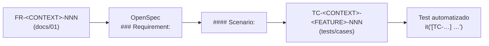

# 01 — Requerimientos funcionales

> **Estado:** Propuesto · **Fecha:** 2026-10-01 · **Owner:** Product Owner
> **Relacionado:** [ARCHITECTURE.md](./ARCHITECTURE.md) · [00-product-vision.md](./00-product-vision.md) · [02-non-functional-requirements.md](./02-non-functional-requirements.md) · [03-openspec-strategy.md](./03-openspec-strategy.md) · [05-bounded-contexts.md](./05-bounded-contexts.md) · [09-ledger-design.md](./09-ledger-design.md) · [24-roadmap.md](./24-roadmap.md) · [25-product-backlog.md](./25-product-backlog.md) · `tests/cases/`

---

## 1. Propósito y convenciones

Este documento enumera **qué** debe hacer PFOS, agrupado por **bounded context** ([ARCHITECTURE §3](./ARCHITECTURE.md#3-bounded-contexts-nombres-canónicos)). Es el primer eslabón de la cadena de trazabilidad ([ARCHITECTURE §12](./ARCHITECTURE.md#12-calidad-spec--test-traceability-adr-0016-adr-0024)):

- **ID:** `FR-<CONTEXT>-NNN`, con `CONTEXT` = código canónico de ARCHITECTURE §3. Los IDs **no se reutilizan**; un FR eliminado queda marcado `Retirado`.
- **Prioridad:** MoSCoW **relativa a su fase** — `Must` (sin él la fase no sale), `Should` (importante, puede deslizarse a la fase siguiente), `Could` (deseable), `Won't (now)` (explícitamente fuera del horizonte; se lista para dejar constancia).
- **Fase:** fase del [roadmap](./24-roadmap.md) en la que el FR debe estar `READY` (implementado, testeado y con spec archivada).
- **Capability:** ruta OpenSpec `openspec/specs/<context>/<capability>/spec.md` según la taxonomía de [ARCHITECTURE §14](./ARCHITECTURE.md#14-taxonomía-de-capabilities-openspec-openspecspecscontextcapabilityspecmd). Un FR mapea a una capability principal; puede tener escenarios en otras.
- **Normatividad:** los FR usan "DEBE" (≈ SHALL/MUST en OpenSpec). Los escenarios Given/When/Then detallados viven en OpenSpec (en español, ver [03](03-openspec-strategy.md) §5) y en `tests/cases/`, no aquí.
- **Glosario mínimo:** *Account* = cuenta del usuario (Accounts); *LedgerAccount* = cuenta contable interna; *Transaction* = hecho económico visible al usuario; *JournalEntry/Posting* = representación contable interna; *Split* = porción clasificada de una transacción; *Counterparty* = payee/merchant/provider.

## 2. Resumen global

| Contexto | Código | Capabilities | # FR | Must | Should | Could | Won't | Fase de inicio |
|----------|--------|--------------|-----:|-----:|-------:|------:|------:|----------------|
| Identity & Workspace | IDENTITY | identity/authentication, identity/workspace-membership, identity/demo-data | 16 | 10 | 4 | 1 | 1 | 1 |
| Accounts | ACCOUNTS | accounts/account-management, accounts/institutions | 16 | 13 | 2 | 1 | 0 | 1 |
| Ledger | LEDGER | ledger/journal-posting, ledger/balances (+ reporting/cash-flow-calendar para FR-LEDGER-013) | 16 | 15 | 0 | 1 | 0 | 1 |
| Transactions | TRANSACTIONS | transactions/* (7) | 36 | 30 | 5 | 1 | 0 | 1 |
| Classification | CLASSIFICATION | classification/* (4) | 13 | 7 | 4 | 2 | 0 | 1 |
| Planning & Budgeting | PLANNING | planning/* (4) | 24 | 16 | 6 | 2 | 0 | 2 |
| Commitments | COMMITMENTS | commitments/recurrence-engine, commitments/subscriptions | 17 | 12 | 5 | 0 | 0 | 3 |
| Savings Goals | GOALS | goals/savings-goals | 10 | 6 | 4 | 0 | 0 | 4 |
| Debt & Credit | DEBT | debt/loans, debt/amortization, debt/credit-cards | 18 | 9 | 7 | 2 | 0 | 4 |
| FX & Market Data | FX | fx/market-rates, fx/conversion-pricing, fx/market-rate-providers | 17 | 13 | 4 | 0 | 0 | 1 |
| Documents | DOCUMENTS | documents/attachments (+ security/file-upload-security) | 9 | 5 | 2 | 2 | 0 | 6 |
| Imports | IMPORTS | imports/import-pipeline, imports/banking-providers | 17 | 9 | 4 | 4 | 0 | 3 (Could) / 6 |
| Rules | RULES | rules/rule-engine | 11 | 8 | 2 | 1 | 0 | 6 |
| Reporting | REPORTING | reporting/* (4) | 19 | 14 | 4 | 1 | 0 | 1 |
| Forecasting | FORECAST | forecast/expense-forecasting | 10 | 6 | 3 | 1 | 0 | 8 |
| Notifications | NOTIFY | notifications/alerts | 9 | 4 | 3 | 1 | 1 | 2 |
| Audit | AUDIT | audit/audit-trail, audit/lifecycle-timeline | 12 | 7 | 4 | 1 | 0 | 1 |
| AI Assistant | ASSISTANT | assistant/read-only-assistant | 11 | 8 | 1 | 0 | 2 | 10 |
| **Total** | | | **281** | **192** | **63** | **21** | **4** | |

> FRs con prioridad mixta (p.ej. FR-REPORTING-008) se cuentan por su prioridad más alta. Los conteos son orientativos y se recalculan al cerrar el DESIGN GATE.

---

## 3. IDENTITY — Identity & Workspace

Capabilities: `identity/authentication`, `identity/workspace-membership`, `identity/demo-data` (docs/31 D36). Ver también `security/access-control` y el documento 12 (seguridad, `docs/12-*`).

| ID | Requerimiento | Prioridad | Fase | Capability |
|----|---------------|-----------|------|------------|
| FR-IDENTITY-001 | El sistema DEBE autenticar usuarios mediante OIDC (Authorization Code + PKCE) a través del BFF de Next.js; la sesión del navegador DEBE mantenerse en cookie `httpOnly`, `Secure`, `SameSite=Lax` y el access token nunca DEBE exponerse al JavaScript del navegador. | Must | 1 | identity/authentication |
| FR-IDENTITY-002 | El sistema DEBE permitir cerrar sesión (local y en el IdP) e invalidar la sesión del BFF; las sesiones DEBEN expirar por inactividad (configurable, default 30 min) y por duración absoluta (default 12 h). | Must | 1 | identity/authentication |
| FR-IDENTITY-003 | El sistema DEBE exponer el perfil del usuario autenticado (`/api/v1/me`): id, nombre visible, email, locale preferido, zona horaria preferida y workspaces a los que pertenece con su rol. | Must | 1 | identity/authentication |
| FR-IDENTITY-004 | En el primer login el sistema DEBE crear (de forma idempotente) un workspace personal con el usuario como `OWNER`. | Must | 1 | identity/workspace-membership |
| FR-IDENTITY-005 | El `OWNER` DEBE poder configurar el workspace: nombre, moneda base (default sugerido BOB), zona horaria (default `America/La_Paz`), locale de formato (default `es-BO`), día de inicio del mes financiero (default 1) y reserva mínima de liquidez (opcional). Cambiar la moneda base NO DEBE alterar datos históricos; solo afecta vistas y reportes. | Must | 1 | identity/workspace-membership |
| FR-IDENTITY-006 | El sistema DEBE autorizar cada caso de uso según el rol del usuario en el workspace (`OWNER`: todo; `EDITOR`: datos financieros sin configuración de workspace ni membresías; `VIEWER`: solo lectura), validando membership en cada request y aplicando RLS por `workspace_id`. | Must | 1 | identity/workspace-membership |
| FR-IDENTITY-007 | Un usuario DEBE poder pertenecer a varios workspaces y seleccionar el workspace activo; toda ruta de negocio DEBE incluir el `workspaceId` explícito. | Should | 1 | identity/workspace-membership |
| FR-IDENTITY-008 | El `OWNER` DEBE poder invitar miembros por email con un rol, y revocar o cambiar roles; las invitaciones expiran (default 7 días) y todos los cambios se auditan. | Should | 11 | identity/workspace-membership |
| FR-IDENTITY-009 | El sistema DEBE soportar MFA delegada al IdP y DEBE poder exigirla por workspace para roles `OWNER`. | Should | 9 | identity/authentication |
| FR-IDENTITY-010 | El `OWNER` DEBE poder exportar todos los datos del workspace (cuentas, transacciones con splits, ledger, catálogos, planes, metas, deudas, tasas, audit) en formato JSON versionado y CSV, como job asíncrono con descarga temporal. | Must | 2 | identity/workspace-membership |
| FR-IDENTITY-011 | El sistema DEBE permitir transferir la propiedad (`OWNER`) del workspace a otro miembro. | Could | 11 | identity/workspace-membership |
| FR-IDENTITY-012 | Borrado definitivo de workspace y de cuenta de usuario (derecho al olvido) con periodo de gracia. | Won't (now) | — | identity/workspace-membership |
| FR-IDENTITY-013 | Los datos de demostración DEBEN cargarse **solo por una acción explícita del `OWNER` en la app** ("Cargar datos de demostración"), nunca automáticamente (arranque, migración, login); la carga crea un **workspace de demostración dedicado**, marcado como demo de forma inmutable desde su creación, y nunca escribe datos demo en un workspace real. (docs/31 D36, 2026-10-03) | Must | 1 | identity/demo-data |
| FR-IDENTITY-014 | Todo dato de demostración DEBE identificarse como tal en la UI (indicador persistente) y en la API (`isDemo` del workspace), usar solo entidades ficticias con apariencia real (bancos, comercios, personas) y generarse de forma determinista desde el dataset versionado (docs/29). (docs/31 D36) | Must | 1 | identity/demo-data |
| FR-IDENTITY-015 | El `OWNER` del workspace demo DEBE poder **limpiar** los datos de demostración ("Limpiar datos de demostración"): el workspace demo se archiva al instante y luego se **purga por completo** de forma asíncrona y auditada, sin afectar ningún workspace real (ADR-0026). (docs/31 D36) | Must | 1 | identity/demo-data |
| FR-IDENTITY-016 | La acción de carga de datos demo DEBE poder deshabilitarse por entorno (habilitada por defecto en local/dev; deshabilitada por defecto en producción hasta decisión del owner) y DEBE limitarse a un workspace demo activo por usuario. (docs/31 D36) | Should | 1 | identity/demo-data |

## 4. ACCOUNTS — Accounts & Institutions

Capabilities: `accounts/account-management`, `accounts/institutions`.

| ID | Requerimiento | Prioridad | Fase | Capability |
|----|---------------|-----------|------|------------|
| FR-ACCOUNTS-001 | El sistema DEBE permitir crear cuentas de los tipos: `bank`, `cash`, `digital_wallet`, `credit_card`, `loan`, `crypto_wallet`, `investment`, `savings`, `virtual`, `manual_asset`, `manual_liability`. | Must | 1 | accounts/account-management |
| FR-ACCOUNTS-002 | Cada cuenta DEBE tener: nombre (único por workspace entre cuentas activas), institución (opcional), tipo, moneda (una sola), saldo inicial y fecha de saldo inicial, saldo calculado (solo lectura), estado, icono, color, identificador opcional (enmascarado; solo últimos 4 caracteres visibles), tags y notas. | Must | 1 | accounts/account-management |
| FR-ACCOUNTS-003 | Toda cuenta DEBE estar respaldada por exactamente un `LedgerAccount` de su misma moneda y de naturaleza `ASSET` (bank, cash, digital_wallet, crypto_wallet, investment, savings, virtual, manual_asset) o `LIABILITY` (credit_card, loan, manual_liability). El `LedgerAccount` se obtiene con *get-or-create* idempotente en la misma transacción de BD que el **primer posting** de la cuenta (ARCHITECTURE §7), no al crear la cuenta; NO DEBE existir más de uno por cuenta (unicidad `(workspace_id, source_account_id)` en `ledger.ledger_account`). (rev. 2026-10-02, D6) | Must | 1 | accounts/account-management |
| FR-ACCOUNTS-004 | Un saldo inicial distinto de cero DEBE registrarse como una `JournalEntry` contra `EQUITY:OPENING_BALANCE:<CCY>` con fecha = fecha de saldo inicial. | Must | 1 | accounts/account-management |
| FR-ACCOUNTS-005 | La moneda de una cuenta NO DEBE poder cambiarse una vez que la cuenta tenga postings. | Must | 1 | accounts/account-management |
| FR-ACCOUNTS-006 | El saldo mostrado de una cuenta DEBE ser siempre el derivado del ledger (Σ postings); el sistema NO DEBE permitir editar el saldo directamente (solo vía transacción `adjustment`). | Must | 1 | accounts/account-management |
| FR-ACCOUNTS-007 | Las cuentas DEBEN tener estados `active`, `closed` y `archived`. Cerrar una cuenta DEBE requerir saldo cero (o un ajuste explícito previo); archivar la oculta de listas por defecto. Una cuenta cerrada/archivada NO DEBE aceptar nuevas transacciones; puede reactivarse (auditado). | Must | 1 | accounts/account-management |
| FR-ACCOUNTS-008 | El sistema NO DEBE eliminar físicamente cuentas; solo archivarlas (ARCHITECTURE §9). | Must | 1 | accounts/account-management |
| FR-ACCOUNTS-009 | Editar metadatos (nombre, icono, color, notas, tags, institución, identificador) NO DEBE afectar el ledger y DEBE quedar auditado con diff. | Must | 1 | accounts/account-management |
| FR-ACCOUNTS-010 | El sistema DEBE listar cuentas con saldo calculado en moneda original y equivalente en moneda base (con fecha/fuente de la tasa), con filtros por tipo, moneda, estado, institución y tag, y agrupación por tipo o institución. | Must | 1 | accounts/account-management |
| FR-ACCOUNTS-011 | Cada cuenta DEBE tener el atributo `liquidity` = `LIQUID` \| `SEMI_LIQUID` \| `ILLIQUID` (ARCHITECTURE §4), editable y con default según tipo: `LIQUID` para bank/cash/digital_wallet/crypto_wallet/savings; `SEMI_LIQUID` para investment; `ILLIQUID` para virtual/manual_asset/credit_card/loan/manual_liability. Solo las cuentas `LIQUID` cuentan como dinero disponible. Además, el flag `includeInNetWorth` (default true) decide si la cuenta suma al patrimonio neto. No existe flag `includeInLiquidity`. (rev. 2026-10-02, D5) | Must | 1 | accounts/account-management |
| FR-ACCOUNTS-012 | El sistema DEBE permitir gestionar instituciones configurables (nombre, tipo `bank/fintech/exchange/broker/wallet_provider/other`, país, icono/logo, color, sitio web, notas). Ninguna institución DEBE estar hardcodeada en código; un catálogo inicial opcional se carga como seed editable. | Must | 1 | accounts/institutions |
| FR-ACCOUNTS-013 | Una institución referenciada por cuentas NO DEBE eliminarse; solo archivarse. | Must | 1 | accounts/institutions |
| FR-ACCOUNTS-014 | Las cuentas cripto DEBEN usar una moneda de `kind = CRYPTO` con su escala (p.ej. USDT 6, BTC 8) y PUEDEN registrar red/protocolo opcional (p.ej. TRC20, ERC20, BEP20) como metadato. | Should | 1 | accounts/account-management |
| FR-ACCOUNTS-015 | Las cuentas `virtual` DEBEN comportarse como `ASSET` reales a efectos contables (el dinero entra/sale vía transferencias) y su `liquidity` (default `ILLIQUID`) DEBE ser configurable, evitando doble conteo con la cuenta física de respaldo. (rev. 2026-10-02, D5) | Should | 1 | accounts/account-management |
| FR-ACCOUNTS-016 | El usuario PUEDE definir un orden manual de cuentas y grupos de visualización. | Could | 1 | accounts/account-management |

## 5. LEDGER — Financial Ledger

Capabilities: `ledger/journal-posting`, `ledger/balances`. Invariantes formales `INV-001..034` en [09-ledger-design.md](./09-ledger-design.md) (fuente única de IDs INV); los FR citan entre paréntesis el INV principal que materializan.

| ID | Requerimiento | Prioridad | Fase | Capability |
|----|---------------|-----------|------|------------|
| FR-LEDGER-001 | (INV-004) El ledger DEBE registrar hechos económicos como `JournalEntry` con ≥ 2 `Posting`; para cada entry y **para cada moneda**, Σ `posting.amount` = 0. La regla se valida en el dominio y se refuerza en BD con constraint trigger diferido; una entry desbalanceada DEBE rechazarse con `LEDGER_UNBALANCED_ENTRY`. | Must | 1 | ledger/journal-posting |
| FR-LEDGER-002 | La convención de signo DEBE ser débito positivo, crédito negativo. | Must | 1 | ledger/journal-posting |
| FR-LEDGER-003 | Cada `LedgerAccount` DEBE tener tipo `ASSET`, `LIABILITY`, `EQUITY`, `INCOME` o `EXPENSE` y una única moneda; un posting DEBE estar en la moneda de su ledger account. | Must | 1 | ledger/journal-posting |
| FR-LEDGER-004 | El sistema DEBE crear bajo demanda (idempotente) las cuentas de sistema por workspace y moneda: `INCOME:<CCY>`, `EXPENSE:<CCY>`, `EQUITY:OPENING_BALANCE:<CCY>`, `EQUITY:FX_TRADING:<CCY>`, `EQUITY:ADJUSTMENTS:<CCY>`. | Must | 1 | ledger/journal-posting |
| FR-LEDGER-005 | Postings y entries DEBEN ser append-only: el sistema NO DEBE hacer UPDATE ni DELETE de postings. Toda corrección DEBE ser una entry de reversa + una entry nueva, enlazadas por `reverses_entry_id`. | Must | 1 | ledger/journal-posting |
| FR-LEDGER-006 | Solo transacciones en estado `posted`, `cleared` o `reconciled` DEBEN tener `JournalEntry` vigente; `pending` no impacta el ledger y `void` se representa con la reversa. | Must | 1 | ledger/journal-posting |
| FR-LEDGER-007 | Los montos de posting DEBEN ser `Money` decimal (nunca float) y respetar la escala de la moneda; el redondeo en materialización DEBE ser HALF_EVEN. | Must | 1 | ledger/journal-posting |
| FR-LEDGER-008 | Cada posting a `INCOME`/`EXPENSE` DEBE referenciar el `split_id` de la transacción; la clasificación (categoría, tags, custom fields) vive fuera del ledger y recategorizar NO DEBE crear entries. | Must | 1 | ledger/journal-posting |
| FR-LEDGER-009 | Cada entry DEBE registrar: `entry_date` (fecha de negocio), tipo de origen y `source_id` (transacción), actor, `correlation_id`, `created_at` UTC y referencia opcional a la entry que revierte. | Must | 1 | ledger/journal-posting |
| FR-LEDGER-010 | La creación de entries DEBE ser idempotente respecto a su origen (una transacción en una versión dada produce como máximo una entry vigente). | Must | 1 | ledger/journal-posting |
| FR-LEDGER-011 | El sistema DEBE rechazar entries cuya `entry_date` caiga en un periodo financiero `closed` (`PERIOD_CLOSED`). | Must | 2 | ledger/journal-posting |
| FR-LEDGER-012 | El saldo de una cuenta DEBE calcularse como Σ postings; el sistema DEBE poder calcular saldo actual y saldo *as-of* una fecha, por ledger account y agregado por moneda. | Must | 1 | ledger/balances |
| FR-LEDGER-013 | El sistema DEBE ofrecer "saldo proyectado" = saldo contable + transacciones `pending` (proyección fuera del ledger), claramente diferenciado del saldo contable. Pertenece a Reporting, no al ledger: el ledger solo expone el saldo contable (FR-LEDGER-012). (rev. 2026-10-02, D21) | Must | 7 | reporting/cash-flow-calendar |
| FR-LEDGER-014 | `AccountBalanceSnapshot` DEBE ser derivado y reconstruible desde postings; DEBE existir un comando para reconstruirlo y su resultado DEBE coincidir con Σ postings (NFR-DATA-009). (rev. 2026-10-02, D20) | Must | 1 | ledger/balances |
| FR-LEDGER-015 | Un job periódico DEBE verificar invariantes del ledger (balance por entry y moneda, ausencia de mutaciones, snapshot = Σ postings) y emitir alerta/métrica ante cualquier violación (NFR-DATA-008). (rev. 2026-10-02, D20) | Must | 1 | ledger/balances |
| FR-LEDGER-016 | Vista técnica de *trial balance* por workspace y moneda (solo `OWNER`). | Could | 1 | ledger/balances |

## 6. TRANSACTIONS — Transactions

Capabilities: `transactions/transaction-recording`, `transactions/transfers`, `transactions/conversions`, `transactions/splits`, `transactions/reconciliation`, `transactions/duplicate-detection`, `transactions/bulk-edit`.

### 6.1 Registro

| ID | Requerimiento | Prioridad | Fase | Capability |
|----|---------------|-----------|------|------------|
| FR-TRANSACTIONS-001 | El sistema DEBE soportar los tipos de transacción `income`, `expense`, `transfer`, `conversion`, `refund` y `adjustment`, cada uno con su patrón de postings definido en [09-ledger-design.md](./09-ledger-design.md). | Must | 1 | transactions/transaction-recording |
| FR-TRANSACTIONS-002 | Una transacción DEBE tener: fecha (de negocio), posting date opcional (fecha valor bancaria), descripción, counterparty/payee opcional, monto, moneda, cuenta, categoría y subcategoría (vía splits), tags, notas, estado y origen (`manual`, `import`, `recurring`, `system`). | Must | 1 | transactions/transaction-recording |
| FR-TRANSACTIONS-003 | Una transacción DEBE poder referenciar, cuando aplique: ocurrencia recurrente (Phase 3), meta (Phase 4), préstamo o tarjeta (Phase 4), adjuntos (Phase 6), `externalSource` + `externalId` y valores de custom fields. | Must | 1 (campos) / fase del contexto (vínculos) | transactions/transaction-recording |
| FR-TRANSACTIONS-004 | Para `income`/`expense`/`refund`/`adjustment`, la moneda de la transacción DEBE ser igual a la moneda de la cuenta; movimientos entre monedas DEBEN registrarse como `conversion`. | Must | 1 | transactions/transaction-recording |
| FR-TRANSACTIONS-005 | El monto DEBE ingresarse y transmitirse como decimal string; el sistema DEBE rechazar montos con más decimales que la escala de la moneda (`AMOUNT_SCALE_EXCEEDED`) y montos cero o negativos en todos los tipos, incluido `adjustment` (`AMOUNT_NOT_POSITIVE`; la dirección la da el tipo; ningún posting es cero, INV-005). (rev. 2026-10-02, D17) | Must | 1 | transactions/transaction-recording |
| FR-TRANSACTIONS-006 | Los estados DEBEN ser `pending`, `posted`, `cleared`, `reconciled` y `void`, con transiciones válidas: pending→posted, posted→cleared, cleared→posted, cleared→reconciled, reconciled→cleared (solo vía des-reconciliación explícita, con motivo y auditada) y pending/posted/cleared→void. Una transacción `reconciled` NO DEBE anularse directamente (`TRANSACTION_RECONCILED`): primero se des-reconcilia. Transiciones inválidas → `INVALID_STATUS_TRANSITION`. (rev. 2026-10-02, D16) | Must | 1 | transactions/transaction-recording |
| FR-TRANSACTIONS-007 | La transición a `posted` DEBE crear la `JournalEntry` en la misma transacción de BD (vía `LedgerPostingPort`) junto con el `AuditLog` y el evento outbox `transactions.TransactionPosted.v1`. | Must | 1 | transactions/transaction-recording |
| FR-TRANSACTIONS-008 | Editar montos, fecha, cuenta o moneda de una transacción con entry DEBE generar reversa + nueva entry; editar solo clasificación (categoría, tags, notas, payee, custom fields) NO DEBE tocar el ledger. Ambos casos DEBEN auditarse con diff. | Must | 1 | transactions/transaction-recording |
| FR-TRANSACTIONS-009 | Anular (`void`) DEBE crear la entry de reversa; la transacción permanece consultable con estado `void` y motivo opcional. No existe borrado físico. | Must | 1 | transactions/transaction-recording |
| FR-TRANSACTIONS-010 | Los POST que crean transacciones DEBEN exigir `Idempotency-Key`; una repetición con misma clave y mismo payload DEBE devolver el resultado original; con payload distinto → `IDEMPOTENCY_KEY_REUSED`. | Must | 1 | transactions/transaction-recording |
| FR-TRANSACTIONS-011 | Las actualizaciones DEBEN usar optimistic locking (`version` + `ETag`/`If-Match`); conflicto → `412 Precondition Failed`. | Must | 1 | transactions/transaction-recording |
| FR-TRANSACTIONS-012 | El sistema DEBE listar transacciones con filtros por rango de fechas, cuenta(s), tipo, estado, categoría (incl. subcategorías), tag, counterparty, rango de monto, moneda, origen y texto; orden configurable y paginación por cursor. | Must | 1 | transactions/transaction-recording |
| FR-TRANSACTIONS-013 | Búsqueda de texto libre en descripción, notas y nombre de counterparty, insensible a acentos y mayúsculas. | Should | 1 | transactions/transaction-recording |
| FR-TRANSACTIONS-014 | El historial de cambios (audit) de una transacción DEBE ser visible desde su detalle para todo miembro que pueda ver la transacción, **incluido VIEWER**; el log de auditoría global sigue restringido a OWNER/EDITOR (rev. 2026-10-02, D28). | Must | 1 | transactions/transaction-recording |
| FR-TRANSACTIONS-015 | El usuario PUEDE duplicar una transacción existente como nueva (nueva fecha por defecto = hoy, estado `pending` o `posted` según elección). | Could | 1 | transactions/transaction-recording |
| FR-TRANSACTIONS-016 | `refund` DEBE acreditar `EXPENSE:<CCY>` con la misma categoría del gasto (reduciendo el gasto de esa categoría) y PUEDE vincularse a la transacción original; el total reembolsado no DEBE exceder el original sin confirmación explícita. | Must | 1 | transactions/transaction-recording |
| FR-TRANSACTIONS-017 | `adjustment` DEBE contabilizarse contra `EQUITY:ADJUSTMENTS:<CCY>`, requerir motivo y quedar destacado en reportes de reconciliación. | Must | 1 | transactions/transaction-recording |

### 6.2 Transferencias y conversiones

| ID | Requerimiento | Prioridad | Fase | Capability |
|----|---------------|-----------|------|------------|
| FR-TRANSACTIONS-018 | (INV-009) Una `transfer` entre dos cuentas del workspace en la misma moneda DEBE generar una única entry (débito destino, crédito origen) y NO DEBE contarse como ingreso ni gasto. Origen y destino deben ser distintos. | Must | 1 | transactions/transfers |
| FR-TRANSACTIONS-019 | Una transferencia PUEDE incluir un fee (gasto en la cuenta origen, categoría de sistema *Fees*) en la misma entry. | Should | 1 | transactions/transfers |
| FR-TRANSACTIONS-020 | Un movimiento entre cuentas de monedas distintas DEBE registrarse como `conversion`; el sistema DEBE guiar al usuario si intenta una transferencia cross-currency. | Must | 1 | transactions/transfers |
| FR-TRANSACTIONS-036 | Editar financieramente una transferencia posteada DEBE ser una transición explícita **revisada** (reversa + nueva revisión) que publica `transactions.TransferRevised.v1` con los asientos revertido, de reversa y nuevo; `transactions.TransferCompleted.v1` DEBE publicarse **una sola vez** por transferencia (primer posteo). (docs/31 D37, 2026-10-03) | Must | 1 | transactions/transfers |
| FR-TRANSACTIONS-021 | Una `conversion` DEBE soportar las 4 direcciones: fiat→fiat, fiat→crypto, crypto→fiat, crypto→crypto, generando una sola entry con patas por moneda balanceadas vía `EQUITY:FX_TRADING:<CCY>` (ARCHITECTURE §4.2). | Must | 1 | transactions/conversions |
| FR-TRANSACTIONS-022 | Una conversión DEBE capturar: monto enviado (moneda origen), monto recibido (moneda destino), tasa cotizada (quoted), tasa efectiva (calculada), fees por tipo (`PROVIDER`, `NETWORK`, `BANK`, `TAX`, `OTHER`) con su moneda, spread vs tasa de referencia, provider/canal (p.ej. Binance P2P, casa de cambio, banco), timestamp y monto final acreditado. Se persisten como `ConversionDetail` inmutable, versionado por revisión (FR-TRANSACTIONS-024). (rev. 2026-10-02, D12) | Must | 1 | transactions/conversions |
| FR-TRANSACTIONS-023 | Los fees de conversión DEBEN registrarse como postings a `EXPENSE:<CCY>` con split de categoría de sistema *Fees*, en la moneda en que se pagaron. | Must | 1 | transactions/conversions |
| FR-TRANSACTIONS-024 | Las conversiones históricas NUNCA DEBEN recalcularse con tasas actuales; editar una conversión genera reversa + nueva entry + nuevo `ConversionDetail` (el anterior se conserva). | Must | 1 | transactions/conversions |
| FR-TRANSACTIONS-025 | El formulario de conversión DEBE permitir ingresar dos de {monto enviado, monto recibido, tasa} y calcular el tercero, mostrando la tasa efectiva y el costo total (fees + spread) en moneda base antes de confirmar. | Should | 1 | transactions/conversions |

### 6.3 Splits

| ID | Requerimiento | Prioridad | Fase | Capability |
|----|---------------|-----------|------|------------|
| FR-TRANSACTIONS-026 | Toda transacción de ingreso/gasto/refund DEBE tener ≥ 1 split; el usuario DEBE poder dividirla en N splits, cada uno con monto, categoría, tags, notas y custom fields. Σ splits DEBE ser exactamente igual al monto total (`SPLITS_DO_NOT_SUM`). | Must | 1 | transactions/splits |
| FR-TRANSACTIONS-027 | Al repartir por porcentaje o partes iguales, el sistema DEBE usar *largest remainder* determinista a la escala de la moneda, de modo que la suma sea exacta y el resultado reproducible. | Must | 1 | transactions/splits |
| FR-TRANSACTIONS-028 | Cambiar montos de splits DEBE generar reversa + nueva entry; cambiar solo la clasificación de un split NO DEBE tocar el ledger. | Must | 1 | transactions/splits |

### 6.4 Reconciliación, duplicados y edición masiva

| ID | Requerimiento | Prioridad | Fase | Capability |
|----|---------------|-----------|------|------------|
| FR-TRANSACTIONS-029 | El usuario DEBE poder marcar transacciones como `cleared` (confirmadas contra el extracto) individualmente o en lote. | Must | 1 | transactions/reconciliation |
| FR-TRANSACTIONS-030 | El sistema DEBE ofrecer sesiones de reconciliación por cuenta: el usuario ingresa fecha y saldo del extracto, selecciona transacciones `cleared`, el sistema muestra la diferencia; al finalizar con diferencia 0 las marca `reconciled`; con diferencia ≠ 0 ofrece crear un `adjustment` auditado. Las transacciones `reconciled` quedan protegidas contra edición accidental (requieren des-reconciliar, auditado). | Must | 2 | transactions/reconciliation |
| FR-TRANSACTIONS-031 | Al crear una transacción manual, el sistema DEBE advertir posibles duplicados (misma cuenta, mismo monto, fecha ±3 días, descripción/counterparty similar) sin bloquear. | Should | 1 | transactions/duplicate-detection |
| FR-TRANSACTIONS-032 | El sistema DEBE detectar duplicados en imports (por `externalId`, hash de fila normalizada y heurística) y permitir resolverlos (`keep both`, `skip`, `merge`), registrando la decisión. | Must | 6 | transactions/duplicate-detection |
| FR-TRANSACTIONS-033 | Edición masiva: sobre una selección o filtro, cambiar categoría, tags (añadir/quitar), counterparty, notas, estado (`cleared`) o custom field, con preview del número de transacciones afectadas, ejecución atómica, un `AuditLog` por transacción y un `bulkOperationId` común. Bulk edit NO DEBE modificar montos, cuentas ni fechas. | Should | 2 | transactions/bulk-edit |
| FR-TRANSACTIONS-034 | Toda transacción (incluidas transferencias y pagos de tarjeta) DEBE admitir un **medio de pago** opcional (`CASH`, `QR`, `DEBIT_CARD`, `CREDIT_CARD`, `BANK_TRANSFER`, `DIGITAL_WALLET`, `OTHER`), filtrable y sin impacto en el ledger (nuevo 2026-10-02, D27). | Must | 1 | transactions/transaction-recording |
| FR-TRANSACTIONS-035 | Pagos y cobros con **QR** (QR Simple interoperable): una compra pagada con QR DEBE registrarse como gasto que debita la cuenta de origen del QR y un cobro por QR como ingreso en la cuenta receptora, con `paymentMethod = QR` y contraparte opcional (nuevo 2026-10-02, D27). | Must | 1 | transactions/transaction-recording |

## 7. CLASSIFICATION — Categories, Tags, Custom Fields, Counterparties

| ID | Requerimiento | Prioridad | Fase | Capability |
|----|---------------|-----------|------|------------|
| FR-CLASSIFICATION-001 | El sistema DEBE gestionar una jerarquía de tres niveles: **grupo → categoría → subcategoría** (toda categoría pertenece a un grupo de su mismo tipo; una subcategoría no admite hijas: `CATEGORY_DEPTH_EXCEEDED`), con tipo `income` o `expense` (heredado del grupo e inmutable), nombre (único, sin distinguir mayúsculas, entre las activas con el mismo padre dentro del grupo), icono, color, orden y estado activo/archivado. (rev. 2026-10-02, D8) | Must | 1 | classification/categories |
| FR-CLASSIFICATION-002 | Las categorías NUNCA DEBEN eliminarse, estén o no referenciadas (INV-019); solo archivarse (no aparecen en selectores, sí en históricos). La API no ofrece `DELETE` sobre categorías: responde `405 Method Not Allowed`. Renombrar NO DEBE alterar la historia (se referencia por ID). (rev. 2026-10-02, D7) | Must | 1 | classification/categories |
| FR-CLASSIFICATION-003 | DEBEN existir en cada workspace 11 categorías de sistema con `systemCode` estable: de gasto `FEES`, `FX_FEES`, `INTEREST`, `LOAN_FEES`, `INSURANCE`, `TAXES`, `ADJUSTMENTS`, `UNCATEGORIZED`; de ingreso `INTEREST_EARNED`, `ADJUSTMENTS_INCOME`, `UNCATEGORIZED_INCOME`. No se eliminan, archivan, renombran ni cambian de tipo o jerarquía (`SYSTEM_CATEGORY_IMMUTABLE`); nombres visibles traducibles. *Opening Balance* no es categoría (el saldo inicial postea contra `EQUITY:OPENING_BALANCE:<CCY>` sin splits). (rev. 2026-10-02, D9) | Must | 1 | classification/categories |
| FR-CLASSIFICATION-004 | Un catálogo inicial sugerido de categorías DEBE cargarse como seed editable al crear el workspace (opcional), nunca hardcodeado. | Must | 1 | classification/categories |
| FR-CLASSIFICATION-005 | El usuario DEBE poder reordenar categorías y subcategorías (orden persistente). | Should | 1 | classification/categories |
| FR-CLASSIFICATION-006 | El sistema DEBE gestionar *category groups* (p.ej. "Vivienda", "Gastos fijos") que agrupan categorías para presupuestos y reportes. | Should | 1 | classification/categories |
| FR-CLASSIFICATION-007 | Fusionar categorías: reasigna todos los splits de la categoría origen a la destino (sin tocar el ledger), archiva la origen y audita la operación. | Could | 2 | classification/categories |
| FR-CLASSIFICATION-008 | El sistema DEBE gestionar tags (nombre único, color, archivado); un split puede tener N tags. | Must | 1 | classification/tags |
| FR-CLASSIFICATION-009 | El sistema DEBE permitir definir custom fields (nombre, clave, tipo `text`/`number`/`decimal`/`date`/`boolean`/`select`, opciones, requerido, entidad objetivo `transaction`/`account`) y validar sus valores. Archivar una definición conserva los valores históricos. | Should | 2 | classification/custom-fields |
| FR-CLASSIFICATION-010 | El sistema DEBE gestionar counterparties (payee/merchant/provider/employer/person/institution) con nombre, alias para matching, categoría por defecto, icono y estado. | Must | 1 | classification/counterparties |
| FR-CLASSIFICATION-011 | Al elegir una counterparty, el sistema DEBE sugerir su categoría por defecto o la última usada con ella. | Should | 1 | classification/counterparties |
| FR-CLASSIFICATION-012 | El usuario PUEDE crear una counterparty inline desde el formulario de transacción. | Must | 1 | classification/counterparties |
| FR-CLASSIFICATION-013 | Fusionar counterparties (reasigna referencias, conserva alias). | Could | 2 | classification/counterparties |

## 8. PLANNING — Planning & Budgeting

Capabilities: `planning/financial-periods`, `planning/budgets`, `planning/budget-templates`, `planning/month-closing`.

### 8.1 Periodos y cierre

| ID | Requerimiento | Prioridad | Fase | Capability |
|----|---------------|-----------|------|------------|
| FR-PLANNING-001 | El sistema DEBE gestionar periodos financieros mensuales por workspace (inicio según día configurado) con estados `draft`, `active`, `closed`, `reopened`. Transiciones: draft→active→closed; closed→reopened (solo `OWNER`, con motivo); reopened→closed. | Must | 2 | planning/financial-periods |
| FR-PLANNING-002 | Los periodos DEBEN crearse automáticamente (idempotente) con al menos 1 mes de anticipación; solo puede haber un periodo `active` que contenga la fecha actual. | Must | 2 | planning/financial-periods |
| FR-PLANNING-003 | El cierre de mes DEBE ejecutar un checklist previo: transacciones `pending` del periodo, cuentas sin reconciliar, duplicados sin resolver, ocurrencias recurrentes sin resolver, transacciones `Uncategorized`. Los ítems bloqueantes son configurables; los no bloqueantes se muestran como advertencia. | Must | 2 | planning/month-closing |
| FR-PLANNING-004 | Al cerrar, el sistema DEBE generar un snapshot **inmutable** del periodo: saldos por cuenta y moneda, net worth, ingresos, gastos, ahorro, tasa de ahorro, presupuesto vs real por categoría, aportes a metas, tasas de referencia usadas; y un reporte de cierre consultable/exportable. | Must | 2 | planning/month-closing |
| FR-PLANNING-005 | (INV-015) Con el periodo `closed`, el ledger DEBE rechazar entries con fecha en el periodo (ver FR-LEDGER-011). Las correcciones se hacen reabriendo o con ajuste en periodo abierto. | Must | 2 | planning/month-closing |
| FR-PLANNING-006 | Reabrir un periodo DEBE requerir rol `OWNER` y motivo, quedar auditado y, al re-cerrar, generar un **nuevo** snapshot versionado conservando el anterior. | Must | 2 | planning/month-closing |
| FR-PLANNING-007 | El reporte de cierre DEBE mostrar KPIs y variaciones respecto al periodo anterior (MoM). | Should | 2 | planning/month-closing |

### 8.2 Plan mensual y templates versionados

| ID | Requerimiento | Prioridad | Fase | Capability |
|----|---------------|-----------|------|------------|
| FR-PLANNING-008 | Cada periodo DEBE poder tener un **plan mensual** con: ingresos esperados, gastos planificados/presupuestos por categoría o grupo, aportes planificados a metas, pagos de deudas y compromisos esperados. | Must | 2 | planning/budgets |
| FR-PLANNING-009 | El sistema DEBE gestionar **budget templates** versionados: crear template, y cada modificación del template crea una nueva **versión inmutable**; las versiones previas se conservan y los planes guardan la versión desde la que se originaron. | Must | 2 | planning/budget-templates |
| FR-PLANNING-010 | Crear el plan de un periodo desde un template (versión específica, default la última). | Must | 2 | planning/budget-templates |
| FR-PLANNING-011 | Crear el plan de un periodo **clonando el plan del mes anterior**. | Must | 2 | planning/budget-templates |
| FR-PLANNING-012 | Clonar un template completo como nuevo template independiente. | Should | 2 | planning/budget-templates |
| FR-PLANNING-013 | Modificar **solo el plan actual** sin afectar el template de origen ni otros periodos. | Must | 2 | planning/budget-templates |
| FR-PLANNING-014 | **Aplicar a futuro**: un cambio en el plan actual o template PUEDE propagarse (creando nueva versión de template) a los periodos futuros en `draft`, con preview; NUNCA a periodos `closed`. | Should | 2 | planning/budget-templates |

### 8.3 Presupuestos

| ID | Requerimiento | Prioridad | Fase | Capability |
|----|---------------|-----------|------|------------|
| FR-PLANNING-015 | El sistema DEBE soportar presupuestos por **categoría** (incluyendo sus subcategorías) y periodo. | Must | 2 | planning/budgets |
| FR-PLANNING-016 | Presupuestos por **category group**. | Should | 2 | planning/budgets |
| FR-PLANNING-017 | Presupuestos por **tag**. | Could | 2 | planning/budgets |
| FR-PLANNING-018 | Tipos de presupuesto `fixed` (monto planificado exacto) y `maximum` (tope de gasto). | Must | 2 | planning/budgets |
| FR-PLANNING-019 | Tipos `minimum` (gasto/aporte mínimo esperado) y `range` (min–max). | Should | 2 | planning/budgets |
| FR-PLANNING-020 | Tipos `rollover` (el remanente o exceso pasa al periodo siguiente, con tope opcional) y `percentage-of-income` (monto = % de ingresos reales o esperados del periodo, política configurable). | Should | 2 | planning/budgets |
| FR-PLANNING-021 | Tipos `zero-based` (todo ingreso esperado se asigna; indicador "por asignar" = 0), `average-based` (promedio de últimos N periodos cerrados) y `historical-based` (igual periodo del año anterior ± ajuste %). | Could | 2 (zero-based) / 7 (average/historical) | planning/budgets |
| FR-PLANNING-022 | Umbrales de alerta por presupuesto: 50, 75, 90, 100 % y personalizados; al cruzar un umbral el sistema DEBE emitir `planning.BudgetThresholdReached.v1` **una sola vez por umbral y periodo**. | Must | 2 | planning/budgets |
| FR-PLANNING-023 | El cálculo de presupuesto vs real DEBE hacerse en moneda base; gastos en otra moneda se convierten con la tasa histórica asociada a la transacción (ConversionDetail o tasa de referencia de la fecha), nunca con la tasa actual. | Must | 2 | planning/budgets |
| FR-PLANNING-024 | El sistema DEBE mostrar por presupuesto: planificado, gastado, restante, % y proyección lineal al fin de periodo; y un "disponible para gastar" agregado (insumo de Q5). | Must | 2 | planning/budgets |

## 9. COMMITMENTS — Recurrence & Subscriptions

| ID | Requerimiento | Prioridad | Fase | Capability |
|----|---------------|-----------|------|------------|
| FR-COMMITMENTS-001 | El sistema DEBE gestionar definiciones recurrentes con: tipo (`income`, `expense`, `transfer`, `loan_payment`, `card_payment`), cuenta(s), categoría, counterparty, descripción, moneda, tipo de monto y fecha de inicio. | Must | 3 | commitments/recurrence-engine |
| FR-COMMITMENTS-002 | Cadencias soportadas: `daily`, `weekly`, `biweekly`, `semimonthly`, `monthly`, `bimonthly`, `quarterly`, `semiannual`, `annual`, e intervalo N de cada una. | Must | 3 | commitments/recurrence-engine |
| FR-COMMITMENTS-003 | Cadencia **custom RRULE** (subconjunto de RFC 5545: FREQ, INTERVAL, BYDAY, BYMONTHDAY, BYSETPOS, COUNT, UNTIL) evaluada en la zona horaria del workspace. | Should | 3 | commitments/recurrence-engine |
| FR-COMMITMENTS-004 | Tipos de monto: `fixed`, `estimated` (valor esperado editable al confirmar), `min-max` (rango; proyecciones usan el máximo para el peor caso) y `variable` (sin monto; requiere ingreso al confirmar). | Must | 3 | commitments/recurrence-engine |
| FR-COMMITMENTS-005 | Reglas de fecha: día 29–31 en meses cortos → último día del mes; ajuste opcional de fin de semana (anterior/siguiente/ninguno). | Must | 3 | commitments/recurrence-engine |
| FR-COMMITMENTS-006 | (INV-013) La generación de ocurrencias DEBE ser **idempotente** (unicidad `definition_id + occurrence_date`), ejecutada por el worker con horizonte configurable (default 90 días) y re-ejecutable sin duplicar. | Must | 3 | commitments/recurrence-engine |
| FR-COMMITMENTS-007 | Modos de materialización por definición: `auto-create` (crea transacción `pending` o `posted` en la fecha), `pending-approval` (requiere confirmación del usuario) y `notify-only`. | Must | 3 | commitments/recurrence-engine |
| FR-COMMITMENTS-008 | Acciones sobre una ocurrencia: aprobar (crea transacción), editar monto/fecha de esa ocurrencia, **skip**, marcar como pagada vinculándola a una transacción existente (matching manual). | Must | 3 | commitments/recurrence-engine |
| FR-COMMITMENTS-009 | Acciones sobre la definición: **pause/resume**, **end date** o número máximo de ocurrencias, y **change future** (editar "esta y las siguientes"), que versiona la definición sin alterar ocurrencias pasadas ni transacciones ya creadas. | Must | 3 | commitments/recurrence-engine |
| FR-COMMITMENTS-010 | Matching automático sugerido entre ocurrencias pendientes y transacciones manuales/importadas (cuenta, monto ± tolerancia, fecha ± ventana, counterparty). | Should | 3 | commitments/recurrence-engine |
| FR-COMMITMENTS-011 | El sistema DEBE calcular el total comprometido del periodo (ocurrencias no resueltas + pending) y la lista de próximos pagos (insumos de Q4 y Q8). | Must | 3 | commitments/recurrence-engine |
| FR-COMMITMENTS-012 | El sistema DEBE gestionar suscripciones: provider (counterparty), nombre/plan, precio y moneda, ciclo, próxima renovación, cuenta/tarjeta de pago, estado (`trial`, `active`, `paused`, `cancelled`), fin de trial y fecha de cancelación; cada suscripción tiene una definición recurrente asociada. | Must | 3 | commitments/subscriptions |
| FR-COMMITMENTS-013 | Cada suscripción DEBE mantener **historial de precios** con vigencia (`effectiveFrom`), inmutable. | Must | 3 | commitments/subscriptions |
| FR-COMMITMENTS-014 | **Detección de cambio de precio**: si el monto real de un cargo vinculado difiere del precio vigente más allá de una tolerancia configurable (default 1 %), el sistema DEBE emitir `commitments.SubscriptionPriceChanged.v1` y proponer registrar el nuevo precio. | Should | 3 | commitments/subscriptions |
| FR-COMMITMENTS-015 | Vista de costo de suscripciones mensualizado y anualizado en moneda base. | Should | 3 | commitments/subscriptions |
| FR-COMMITMENTS-016 | Recordatorios de renovación y fin de trial (N días antes, configurable). | Should | 3 | commitments/subscriptions |
| FR-COMMITMENTS-017 | Cancelar una suscripción DEBE finalizar su definición recurrente sin afectar transacciones pasadas. | Must | 3 | commitments/subscriptions |

## 10. GOALS — Savings Goals

| ID | Requerimiento | Prioridad | Fase | Capability |
|----|---------------|-----------|------|------------|
| FR-GOALS-001 | El sistema DEBE gestionar metas de ahorro con: nombre, tipo (`emergency_fund`, `purchase`, `travel`, `education`, `retirement`, `custom`), monto objetivo y moneda, fecha objetivo opcional, fecha de inicio, cuenta(s) vinculada(s) opcionales, prioridad, icono, color, notas y estado (`active`, `paused`, `achieved`, `cancelled`). | Must | 4 | goals/savings-goals |
| FR-GOALS-002 | Contribuciones de dos tipos: **real** (transferencia a cuenta vinculada, vía Transactions) y **virtual/earmark** (asignación sin movimiento de ledger sobre el saldo de una cuenta). Ambas registran fecha, monto y origen. | Must | 4 | goals/savings-goals |
| FR-GOALS-003 | El sistema DEBE calcular por meta: saldo acumulado, % completado, **aporte mensual requerido** para llegar a la fecha objetivo, **fecha esperada de cumplimiento** según el ritmo de los últimos N meses, y estado `behind`/`on-track`/`ahead` según tolerancia configurable (default ±5 %). | Must | 4 | goals/savings-goals |
| FR-GOALS-004 | La suma de earmarks sobre una cuenta NO DEBE exceder su saldo disponible; si el saldo cae por debajo, la meta DEBE marcarse como "sobre-asignada" y notificarse. | Must | 4 | goals/savings-goals |
| FR-GOALS-005 | Retirar o reasignar fondos de una meta DEBE registrarse explícitamente (contribución negativa o transferencia) y auditarse. | Must | 4 | goals/savings-goals |
| FR-GOALS-006 | **What-if**: el usuario PUEDE simular cambios de aporte mensual, monto objetivo o fecha y ver el efecto en fecha esperada y aporte requerido, sin persistir. | Should | 4 | goals/savings-goals |
| FR-GOALS-007 | Metas cuyo objetivo está en una moneda distinta a las contribuciones DEBEN calcular el progreso con tasa de referencia vigente, indicando fecha y fuente de la tasa. | Should | 4 | goals/savings-goals |
| FR-GOALS-008 | Al alcanzar 100 % se emite `goals.GoalReached.v1`; los hitos intermedios (25/50/75 %) generan notificaciones derivadas de `goals.SavingsContributionRecorded.v1`. | Should | 4 | goals/savings-goals |
| FR-GOALS-009 | Los aportes planificados a metas DEBEN poder incluirse en el plan mensual (PLANNING) y reflejarse en "disponible para gastar". | Should | 4 | goals/savings-goals |
| FR-GOALS-010 | Una transacción PUEDE vincularse a una meta (FR-TRANSACTIONS-003) y contar como contribución real. | Must | 4 | goals/savings-goals |

## 11. DEBT — Loans, Amortization, Credit Cards

| ID | Requerimiento | Prioridad | Fase | Capability |
|----|---------------|-----------|------|------------|
| FR-DEBT-001 | El sistema DEBE gestionar préstamos con: principal, moneda, tasa nominal anual, tipo de tasa (`fixed`/`variable`), plazo (nº de cuotas), frecuencia de pago, fecha de desembolso, fecha de primera cuota, lender (counterparty), cuenta `loan` (LIABILITY) vinculada y cuenta destino del desembolso. | Must | 4 | debt/loans |
| FR-DEBT-002 | El desembolso DEBE registrarse como transacción (+ASSET destino / −LIABILITY préstamo). Préstamos preexistentes PUEDEN registrarse con saldo pendiente inicial (opening balance) sin desembolso. | Must | 4 | debt/loans |
| FR-DEBT-003 | Generación de cronograma con sistema **French** (cuota constante). | Must | 4 | debt/amortization |
| FR-DEBT-004 | Sistemas **German** (amortización de capital constante, cuota decreciente) y **fixed principal** (capital fijo definido por el usuario por cuota, con posible cuota final balloon). | Should | 4 | debt/amortization |
| FR-DEBT-005 | Cronograma **custom** cargado manualmente o importado (tabla del banco), que prevalece sobre el cálculo. | Should | 4 | debt/amortization |
| FR-DEBT-006 | Cada cuota DEBE desglosar principal, interés, fees, seguro e impuestos; redondeo HALF_EVEN a la escala de la moneda y la **última cuota absorbe el residuo** para que Σ principal = principal original exactamente. | Must | 4 | debt/amortization |
| FR-DEBT-007 | Registrar un pago DEBE crear una transacción cuya entry acredita la cuenta origen, debita la LIABILITY por el principal y debita `EXPENSE:<CCY>` con splits de categorías de sistema (*Interest*, *Loan Fees*, *Insurance*, *Taxes*). Diferencias entre pago real y cuota esperada DEBEN mostrarse. | Must | 4 | debt/loans |
| FR-DEBT-008 | **Pagos extraordinarios** con opción reducir plazo o reducir cuota; el cronograma futuro se recalcula como nueva versión, conservando la anterior. | Should | 4 | debt/amortization |
| FR-DEBT-009 | **Tasa variable**: registrar cambios de tasa con fecha de vigencia y recalcular cuotas futuras. | Should | 4 | debt/amortization |
| FR-DEBT-010 | **Payoff simulator**: comparar escenarios (pagos extra únicos o recurrentes, estrategias *avalanche*/*snowball* entre deudas) mostrando intereses totales, fecha de fin y ahorro, sin persistir. | Should | 4 | debt/amortization |
| FR-DEBT-011 | Las cuotas de préstamo DEBEN generar compromisos recurrentes (COMMITMENTS) para alimentar Q4/Q8 y el cash-flow calendar. | Must | 4 | debt/loans |
| FR-DEBT-012 | El sistema DEBE gestionar tarjetas de crédito: límite, moneda, día de cierre, día de vencimiento, tasa, regla de pago mínimo (% o monto) y cuenta LIABILITY asociada. | Must | 4 | debt/credit-cards |
| FR-DEBT-013 | El sistema DEBE calcular por ciclo: compras del ciclo, saldo al cierre, pago mínimo, pago para no generar intereses y fecha de vencimiento; y generar recordatorio de vencimiento. | Must | 4 | debt/credit-cards |
| FR-DEBT-014 | El pago de tarjeta DEBE ser una transferencia ASSET→LIABILITY (no es gasto). | Must | 4 | debt/credit-cards |
| FR-DEBT-015 | Utilización de crédito (saldo/límite) con alerta configurable (default 30 % y 80 %). | Should | 4 | debt/credit-cards |
| FR-DEBT-016 | Tarjetas bimoneda (p.ej. BOB + USD) modeladas como una tarjeta con una cuenta LIABILITY por moneda y límite compartido o separado. | Should | 4 | debt/credit-cards |
| FR-DEBT-017 | Compras en cuotas (sin/con interés) en tarjeta, con calendario de cargos futuros. | Could | 4 | debt/credit-cards |
| FR-DEBT-018 | Resumen de deudas: total adeudado por moneda y en base, interés pagado YTD, fecha estimada libre de deudas. | Could | 4 | debt/loans |

## 12. FX — FX & Market Data

| ID | Requerimiento | Prioridad | Fase | Capability |
|----|---------------|-----------|------|------------|
| FR-FX-001 | El sistema DEBE gestionar un catálogo de monedas con `code`, nombre, símbolo, `kind` (`FIAT`, `CRYPTO`, `COMMODITY`, `CUSTOM`) y `scale`; el catálogo base (BOB, USD, EUR, USDT, BTC, ETH, …) se carga como seed y es extensible por el usuario (CUSTOM/COMMODITY). | Must | 1 | fx/market-rates |
| FR-FX-002 | El usuario DEBE poder registrar manualmente tasas de referencia: par (base/quote), fecha y hora, valor (NUMERIC, string en API), tipo (`OFFICIAL`, `PARALLEL`, `P2P`, `BANK`, `CUSTOM`) y fuente. (rev. 2026-10-02, D13) Además existen `PARALLEL_BUY` / `PARALLEL_SELL` (compra/venta "desde el lado del owner"), que los providers registran junto con la mediana `PARALLEL` y que solo se usan si se piden explícitamente (rev. 2026-10-04, D39; FR-FX-009). | Must | 1 | fx/market-rates |
| FR-FX-003 | (INV-011) Las tasas históricas DEBEN ser **inmutables**: una corrección crea una nueva versión que `supersedes` a la anterior; la anterior sigue consultable y las operaciones que la usaron conservan su referencia. | Must | 1 | fx/market-rates |
| FR-FX-004 | Lookup de tasa *as-of* por par y tipo con política explícita (exacta o última anterior dentro de una ventana máxima configurable, default 7 días); si no hay tasa válida → `FX_RATE_NOT_FOUND` (nunca un valor inventado). | Must | 1 | fx/market-rates |
| FR-FX-005 | Tasas cruzadas vía moneda pivote (p.ej. USDT→USD→BOB) con trazabilidad de las tasas componentes. | Should | 1 | fx/market-rates |
| FR-FX-006 | Valoración de saldos en moneda base para vistas (dashboard, net worth) usando la tasa vigente del tipo preferido por el workspace (p.ej. `P2P` para USDT, `OFFICIAL` o `PARALLEL` para USD), mostrando fecha y fuente. (rev. 2026-10-02, D13) | Must | 1 | fx/market-rates |
| FR-FX-007 | **Conversion pricing**: dado monto enviado, monto recibido y fees, el sistema DEBE calcular tasa efectiva, spread vs tasa de referencia del momento (si existe), costo total de la conversión en moneda base y diferencia quoted vs actual. | Must | 1 | fx/conversion-pricing |
| FR-FX-008 | La tasa de referencia usada en una conversión DEBE quedar registrada (ID + versión) junto al `ConversionDetail`. | Must | 1 | fx/conversion-pricing |
| FR-FX-009 | Puerto `MarketRateProvider` con adapters configurables por par y tipo (p.ej. tasa oficial del banco central, cotizaciones P2P públicas, APIs de tipo de cambio, precios cripto), ejecución programada por el worker y almacenamiento como tasa histórica con `source = provider`. Providers de Phase 1: paralelo.bo (principal, PARALLEL) y bo.dolarapi.com (respaldo PARALLEL + OFFICIAL BCB), ADR-0025 (rev. 2026-10-02, D29). | Must | 1 | fx/market-rate-providers |
| FR-FX-010 | Fallback entre providers, detección de tasas obsoletas (staleness) y de valores anómalos (variación > umbral vs anterior), con alerta y sin sobrescribir tasas manuales. (rev. 2026-10-02, D29) | Must | 1 | fx/market-rate-providers |
| FR-FX-011 | Análisis de costo de conversiones: spread y fees promedio por provider/canal, por par y por periodo. | Should | 5 | fx/conversion-pricing |
| FR-FX-012 | Precios manuales o por provider para commodities/inversiones (`kind = COMMODITY`) usados en valoración (no generan entries). | Should | 5 | fx/market-rates |
| FR-FX-013 | Importar el histórico diario de la tasa paralela del provider principal al configurar el workspace y completar a diario los días faltantes, de forma idempotente (nuevo 2026-10-02, D29). | Must | 1 | fx/market-rate-providers |
| FR-FX-014 | Mostrar la atribución de la fuente (y su licencia: CC BY 4.0 para paralelo.bo) en toda vista o respuesta que use una tasa de provider (nuevo 2026-10-02, D29). | Must | 1 | fx/market-rate-providers |
| FR-FX-015 | Las consultas a providers NO DEBEN enviar datos del usuario; el core DEBE funcionar sin providers disponibles (nuevo 2026-10-02, D29). | Must | 1 | fx/market-rate-providers |
| FR-FX-016 | Estado de los providers consultable: salud, última tasa obtenida, fallas recientes y progreso del backfill (nuevo 2026-10-02, D29). | Should | 1 | fx/market-rate-providers |
| FR-FX-017 | Respetar límites de uso, caché y `Retry-After` de cada provider, con intervalo mínimo de consulta de 60 s (nuevo 2026-10-02, D29). | Must | 1 | fx/market-rate-providers |

## 13. DOCUMENTS — Documents & Attachments

| ID | Requerimiento | Prioridad | Fase | Capability |
|----|---------------|-----------|------|------------|
| FR-DOCUMENTS-001 | Subida de archivos mediante **presigned URL** (PUT/POST directo al object storage) con registro previo `pending` y confirmación `uploaded`; el backend nunca recibe el binario en el request de la API. | Must | 6 | documents/attachments |
| FR-DOCUMENTS-002 | Validación de **MIME** real (magic bytes), **extensión** en allowlist (pdf, png, jpg/jpeg, webp, heic, csv, ofx, qif, json, xlsx), **tamaño** máximo configurable (default 15 MB) y **checksum SHA-256**; un archivo que no pasa queda `rejected` y se elimina del bucket de cuarentena. | Must | 6 | security/file-upload-security |
| FR-DOCUMENTS-003 | Un documento DEBE poder adjuntarse a transacciones, conversiones, préstamos, suscripciones, cuentas, imports y cierres de mes (relación N:M). | Must | 6 | documents/attachments |
| FR-DOCUMENTS-004 | Descarga mediante presigned GET de corta duración (default 5 min) previa autorización por workspace. | Must | 6 | documents/attachments |
| FR-DOCUMENTS-005 | Las claves de objeto NO DEBEN contener datos personales ni nombres originales (se usa UUID; el nombre original se guarda como metadato). | Must | 6 | security/file-upload-security |
| FR-DOCUMENTS-006 | Deduplicación por checksum dentro del workspace (mismo archivo → mismo documento). | Should | 6 | documents/attachments |
| FR-DOCUMENTS-007 | Archivar documentos; documentos no referenciados se purgan tras retención configurable. | Should | 6 | documents/attachments |
| FR-DOCUMENTS-008 | Hook de **escaneo de malware** (estado `scanning` → `clean/infected`) antes de habilitar la descarga. | Could | 9 | security/file-upload-security |
| FR-DOCUMENTS-009 | **OCR** de recibos/extractos para sugerir datos de transacción (nunca crea transacciones sin confirmación). | Could | 11 | documents/attachments |

## 14. IMPORTS — Imports & Banking Integrations

| ID | Requerimiento | Prioridad | Fase | Capability |
|----|---------------|-----------|------|------------|
| FR-IMPORTS-001 | El sistema DEBE modelar `ImportJob` con estados `uploaded → parsing → parsed → validating → previewing → approved → persisting → completed` y `failed`/`cancelled`, con métricas (filas leídas, válidas, inválidas, duplicadas, creadas). | Must | 6 | imports/import-pipeline |
| FR-IMPORTS-002 | Pipeline: **upload → parse → normalize → validate → dedupe → rules → preview → approval → persist → reconciliation**; cada etapa es reanudable y el job es procesado por el worker. | Must | 6 | imports/import-pipeline |
| FR-IMPORTS-003 | **CSV básico** (una cuenta, mapeo manual de columnas fecha/descripción/monto o débito-crédito, formato de fecha y separador decimal) con preview y aprobación, para cargar histórico real temprano. | Could | 3 | imports/import-pipeline |
| FR-IMPORTS-004 | Formatos soportados: CSV (configurable), OFX, QIF y JSON (esquema propio versionado). | Must | 6 | imports/import-pipeline |
| FR-IMPORTS-005 | **Perfiles de mapeo** reutilizables por institución/cuenta (columnas, encoding, delimitador, formato de fecha, separador decimal/miles, convención de signo, filas a saltar). | Must | 6 | imports/import-pipeline |
| FR-IMPORTS-006 | Normalización: fechas a `YYYY-MM-DD` en zona del workspace, montos a decimal string con escala de la moneda, descripción saneada; errores por fila con número de línea y causa. | Must | 6 | imports/import-pipeline |
| FR-IMPORTS-007 | Deduplicación contra transacciones existentes e intra-archivo (ver FR-TRANSACTIONS-032). | Must | 6 | imports/import-pipeline |
| FR-IMPORTS-008 | Aplicar el rules engine en el preview (categoría, tags, payee sugeridos) mostrando qué regla aplicó. | Must | 6 | imports/import-pipeline |
| FR-IMPORTS-009 | **Preview** editable (categoría, payee, excluir filas, resolver duplicados) antes de aprobar; nada se persiste antes de la aprobación. | Must | 6 | imports/import-pipeline |
| FR-IMPORTS-010 | (INV-014) El import DEBE ser **idempotente**: re-subir el mismo archivo (checksum) o reintentar la persistencia no crea duplicados; cada transacción importada guarda `importJobId`, `externalSource`, `externalId`/hash de fila. | Must | 6 | imports/import-pipeline |
| FR-IMPORTS-011 | Tras persistir, comparar saldo final del extracto (si se provee) con el saldo calculado y ofrecer iniciar reconciliación. | Should | 6 | imports/import-pipeline |
| FR-IMPORTS-012 | **Deshacer import**: anula (void con reversa) todas las transacciones creadas por un job, auditado. | Should | 6 | imports/import-pipeline |
| FR-IMPORTS-013 | Puerto `BankingProvider` (fuentes `bank_api`, `aggregator`, `exchange`) definido con contrato de sync incremental (cursor), mapeo a la misma etapa *normalize* del pipeline y almacenamiento de tokens solo cifrados (nunca credenciales de usuario). | Should | 6 | imports/banking-providers |
| FR-IMPORTS-014 | Adapter de exchange (p.ej. export CSV de historial P2P/spot) que produce conversiones con `ConversionDetail`. | Should | 6 | imports/banking-providers |
| FR-IMPORTS-015 | Adapters reales de bank API / agregador cuando existan para las instituciones del usuario. | Could | 11 | imports/banking-providers |
| FR-IMPORTS-016 | Import de extractos **PDF** de bancos bolivianos mediante parsers por institución (best effort, siempre con preview). | Could | 11 | imports/import-pipeline |
| FR-IMPORTS-017 | Import desde XLS/XLSX. | Could | 6 | imports/import-pipeline |

## 15. RULES — Rules Engine

| ID | Requerimiento | Prioridad | Fase | Capability |
|----|---------------|-----------|------|------------|
| FR-RULES-001 | El sistema DEBE permitir reglas **WHEN** condiciones **THEN** acciones, con nombre, descripción, estado activo/inactivo. | Must | 6 | rules/rule-engine |
| FR-RULES-002 | Campos de condición: descripción, counterparty, monto, moneda, cuenta, tipo de transacción, fecha/día de semana/día de mes, categoría actual, tags, `externalSource`, custom field. | Must | 6 | rules/rule-engine |
| FR-RULES-003 | Operadores: `equals`, `not_equals`, `contains`, `not_contains`, `starts_with`, `ends_with`, `matches_regex` (con timeout/longitud máxima), `gt`, `gte`, `lt`, `lte`, `between`, `in`, `is_empty`, `is_not_empty`; comparación de texto insensible a acentos/mayúsculas. | Must | 6 | rules/rule-engine |
| FR-RULES-004 | Combinación de condiciones con `ALL` (AND) / `ANY` (OR); grupos anidados de un nivel. | Should | 6 | rules/rule-engine |
| FR-RULES-005 | Acciones: set category, add/remove tag, set counterparty, set description (rename), append note, set custom field, link goal, split por porcentajes (largest remainder), marcar para revisión, excluir del import. Las reglas NUNCA DEBEN modificar montos, moneda, cuenta ni fecha. | Must | 6 | rules/rule-engine |
| FR-RULES-006 | **Prioridad** numérica y orden determinista; opción `stopProcessing`; ante conflicto gana la de mayor prioridad (menor número) y el resultado es reproducible. | Must | 6 | rules/rule-engine |
| FR-RULES-007 | **Preview**: probar una regla contra una transacción o texto de ejemplo mostrando condiciones cumplidas y acciones resultantes. | Must | 6 | rules/rule-engine |
| FR-RULES-008 | **Dry-run histórico**: ejecutar una regla (o el set) sobre un rango histórico mostrando el diff propuesto sin persistir; aplicar opcionalmente como bulk edit auditado. | Should | 6 | rules/rule-engine |
| FR-RULES-009 | Disparadores: durante import (preview), al crear transacción manual (opcional por regla) y ejecución manual. | Must | 6 | rules/rule-engine |
| FR-RULES-010 | Cada split modificado por una regla DEBE registrar `ruleId` y versión de la regla aplicada (trazabilidad). | Must | 6 | rules/rule-engine |
| FR-RULES-011 | Sugerir reglas a partir de recategorizaciones manuales repetidas (≥ 3 veces mismo patrón). | Could | 7 | rules/rule-engine |

## 16. REPORTING — Reporting & Analytics

| ID | Requerimiento | Prioridad | Fase | Capability |
|----|---------------|-----------|------|------------|
| FR-REPORTING-001 | El Home/dashboard DEBE responder progresivamente las 9 preguntas de [00-product-vision §6](./00-product-vision.md#6-las-9-preguntas-del-home-contrato-del-dashboard); un widget sin datos suficientes DEBE indicarlo explícitamente (nunca valores inventados). | Must | 1 (Q1,Q2,Q3,Q6,Q7 básico) → 7 | reporting/dashboard |
| FR-REPORTING-002 | KPIs del dashboard: liquidez total (base y por moneda), ingresos del periodo, gastos del periodo, ahorro neto y tasa de ahorro, comprometido, disponible para gastar, net worth, ratio deuda/activos, utilización de presupuesto, metas en curso. Cada KPI muestra periodo, moneda y frescura. | Must | 1 → 7 | reporting/dashboard |
| FR-REPORTING-003 | Saldos por cuenta y totales por moneda y en moneda base. | Must | 1 | reporting/dashboard |
| FR-REPORTING-004 | Ingresos y gastos del mes por categoría (top N) y comparación básica con el mes anterior. *Nota (rev. 2026-10-04):* la parte que usa el Home (Q2, Q3, Q7 básico: totales del mes, top N de categorías de gasto y comparación "a la fecha") la sirve en Phase 1 `reporting/dashboard` (`GET /reports/summary`, [14-reporting.md §9.1](./14-reporting.md)); el FR sigue en `reporting/financial-reports` mientras el owner no decida moverlo (pregunta abierta 10). | Must | 1 | reporting/financial-reports |
| FR-REPORTING-005 | Net worth actual (activos − pasivos, cuentas con `includeInNetWorth`) en moneda base con desglose por moneda y tipo de cuenta. | Must | 1 | reporting/net-worth |
| FR-REPORTING-006 | Evolución mensual del net worth (fin de mes, desde snapshots de cierre o cálculo as-of). | Should | 2 | reporting/net-worth |
| FR-REPORTING-007 | Los read models DEBEN alimentarse por eventos (outbox) de forma idempotente, ser **reconstruibles** desde la fuente de verdad y exponer su frescura (`asOf`). En Phase 1 el dashboard lee el ledger directamente; los read models se introducen con los reportes avanzados (rev. 2026-10-02, D15). | Must | 7 | reporting/financial-reports |
| FR-REPORTING-008 | Catálogo de **16 reportes** según [14-reporting.md](./14-reporting.md): (1) Income vs Expenses; (2) Budget vs Actual; (3) Expenses by Category; (4) Expenses by Tags; (5) Expenses by Account; (6) Monthly Trends; (7) Cash Flow; (8) Net Worth; (9) Savings Goals; (10) Debt Evolution; (11) Recurring Costs; (12) Subscription Evolution; (13) FX / Crypto Conversion; (14) Fees; (15) Account Balance History; (16) Forecast vs Actual. Cada reporte se habilita en la fase de su contexto fuente (doc 14) y se completa en Phase 7. *(Si difiere, prevalece el doc 14.)* | Must (1,2,3,7,8,15) / Should (resto) | 1–8 incremental; completo en 7 | reporting/financial-reports |
| FR-REPORTING-009 | Comparaciones **MoM**, **YoY**, rango custom y ventanas móviles (3/6/12 meses) en todos los reportes temporales. | Must | 7 | reporting/financial-reports |
| FR-REPORTING-010 | **Drill-down** desde cualquier agregado hasta las transacciones/splits que lo componen, con los mismos filtros aplicados. | Must | 7 | reporting/financial-reports |
| FR-REPORTING-011 | Moneda de reporte seleccionable; política de conversión explícita y visible: **tasa histórica** de cada transacción (default para flujos) o **tasa a fecha de corte** (default para saldos/net worth). | Must | 7 | reporting/financial-reports |
| FR-REPORTING-012 | Export de reportes y listados a CSV. | Must | 7 | reporting/financial-reports |
| FR-REPORTING-013 | Export de reportes a PDF. | Could | 7 | reporting/financial-reports |
| FR-REPORTING-014 | **Cash-flow calendar** 7/30/60/90 días: saldo esperado diario por cuenta y total líquido, ocurrencias recurrentes, cuotas, vencimientos de tarjeta e ingresos esperados. | Must | 7 | reporting/cash-flow-calendar |
| FR-REPORTING-015 | El calendario DEBE indicar el **saldo más bajo esperado** (monto y fecha) y **riesgo de déficit** (saldo < 0 o < reserva mínima del workspace), generando una alerta de riesgo de déficit (evento a catalogar en [11-domain-events.md](./11-domain-events.md)). | Must | 7 | reporting/cash-flow-calendar |
| FR-REPORTING-016 | Lista de próximos pagos (Q8) en el dashboard, versión simple sin calendario. | Must | 3 | reporting/cash-flow-calendar |
| FR-REPORTING-017 | Valoración de cuentas `investment`/`manual_asset` mediante valoraciones manuales periódicas o precios de commodities, para net worth y ganancia no realizada (sin entries). | Should | 5 | reporting/net-worth |
| FR-REPORTING-018 | Variación MoM de KPIs principales en el dashboard (Q7) con indicador de tendencia. | Should | 1 | reporting/dashboard |
| FR-REPORTING-019 | Vistas guardadas de reportes (filtros favoritos). | Should | 7 | reporting/financial-reports |

## 17. FORECAST — Forecasting

| ID | Requerimiento | Prioridad | Fase | Capability |
|----|---------------|-----------|------|------------|
| FR-FORECAST-001 | El sistema DEBE generar forecasts de gasto (total y por categoría/grupo) e ingreso para horizontes de **1, 3, 6 y 12 meses**. | Must | 8 | forecast/expense-forecasting |
| FR-FORECAST-002 | Cada forecast DEBE incluir: valor predicho, **intervalo de confianza** (p.ej. 80 % y 95 %), **baseline** de referencia (p.ej. seasonal naive / media móvil), **versión del modelo**, **generatedAt**, ventana de entrenamiento y moneda. | Must | 8 | forecast/expense-forecasting |
| FR-FORECAST-003 | **Explicabilidad**: el forecast DEBE separar **costos futuros conocidos** (compromisos recurrentes, cuotas, suscripciones) de **costos variables predichos**, y mostrar los principales drivers. | Must | 8 | forecast/expense-forecasting |
| FR-FORECAST-004 | La UI y la API NUNCA DEBEN presentar un forecast como certeza ("gastarás exactamente X"); el copy usa rangos y probabilidad. | Must | 8 | forecast/expense-forecasting |
| FR-FORECAST-005 | Con historia insuficiente (umbral configurable, default < 6 meses cerrados por serie) el sistema DEBE devolver solo baseline + conocidos, marcando `insufficientData = true`. | Must | 8 | forecast/expense-forecasting |
| FR-FORECAST-006 | El servicio ML DEBE estar aislado (ACL `@pf/forecasting`); su indisponibilidad NO DEBE afectar ninguna funcionalidad core (degradación: se muestra último forecast con su `generatedAt` o nada). | Must | 8 | forecast/expense-forecasting |
| FR-FORECAST-007 | Backtesting por serie con métricas (MASE/sMAPE) vs baseline; un modelo solo se publica para una serie si supera al baseline. | Should | 8 | forecast/expense-forecasting |
| FR-FORECAST-008 | Forecast probabilístico de saldo líquido y probabilidad de déficit en el horizonte (complementa FR-REPORTING-015). | Should | 8 | forecast/expense-forecasting |
| FR-FORECAST-009 | Historial de forecasts vs real (accuracy tracking) visible al usuario. | Should | 8 | forecast/expense-forecasting |
| FR-FORECAST-010 | Detección de anomalías de gasto (transacción atípica para la categoría/counterparty). | Could | 8 | forecast/expense-forecasting |

## 18. NOTIFY — Notifications

| ID | Requerimiento | Prioridad | Fase | Capability |
|----|---------------|-----------|------|------------|
| FR-NOTIFY-001 | Centro de notificaciones in-app con estados `unread`/`read`/`archived`, contador y enlace al recurso origen. | Must | 2 | notifications/alerts |
| FR-NOTIFY-002 | Canal **email** (SMTP; Mailpit en local) con plantillas en español. | Should | 2 | notifications/alerts |
| FR-NOTIFY-003 | Preferencias por tipo de notificación y canal, y horario de silencio. | Should | 2 | notifications/alerts |
| FR-NOTIFY-004 | Tipos (incrementales por fase): umbral de presupuesto (2), cierre de mes pendiente (2), próximo pago / ocurrencia por aprobar (3), cambio de precio y fin de trial (3), hito de meta / sobre-asignación (4), vencimiento de tarjeta y cuota (4), tasa obsoleta (5), import completado/fallido (6), riesgo de déficit (7), violación de invariante (OWNER, 1→2). | Must | 2 → 7 | notifications/alerts |
| FR-NOTIFY-005 | Las notificaciones DEBEN ser idempotentes: un mismo evento origen no genera notificaciones duplicadas (inbox por `(consumer, eventId)` + clave de deduplicación de negocio). | Must | 2 | notifications/alerts |
| FR-NOTIFY-006 | Los emails NO DEBEN incluir saldos ni montos salvo opt-in explícito; deben enlazar a la app autenticada. | Must | 2 | notifications/alerts |
| FR-NOTIFY-007 | Digest semanal/mensual por email. | Should | 7 | notifications/alerts |
| FR-NOTIFY-008 | Canal webhook/Telegram personal. | Could | 11 | notifications/alerts |
| FR-NOTIFY-009 | Push notifications nativas móviles. | Won't (now) | — | notifications/alerts |

## 19. AUDIT — Audit Trail

| ID | Requerimiento | Prioridad | Fase | Capability |
|----|---------------|-----------|------|------------|
| FR-AUDIT-001 | (INV-029) Todo comando que muta datos financieros o de configuración DEBE escribir un `AuditLog` **en la misma transacción de BD** que el cambio (si el audit falla, el cambio falla). | Must | 1 | audit/audit-trail |
| FR-AUDIT-002 | Cada registro DEBE contener: `id`, `workspaceId`, actor (usuario/sistema/job), acción, `aggregateType`, `aggregateId`, versión, diff antes/después (JSON, con campos sensibles enmascarados), motivo (si aplica), `occurredAt` UTC, `correlationId`, origen (`ui`, `api`, `import`, `rule`, `recurring`, `system`). | Must | 1 | audit/audit-trail |
| FR-AUDIT-003 | El audit log DEBE ser append-only (sin UPDATE/DELETE para el rol de aplicación) y protegido por RLS. | Must | 1 | audit/audit-trail |
| FR-AUDIT-004 | Consulta del historial por entidad (p.ej. una transacción o cuenta). | Must | 1 | audit/audit-trail |
| FR-AUDIT-005 | Eventos de seguridad auditados: login/logout, fallo de autorización, cambio de rol/membresía, export de datos, reapertura de periodo, cambio de configuración del workspace. | Must | 1 (login, export) / 2 | audit/audit-trail |
| FR-AUDIT-006 | Consulta global del audit log con filtros (actor, acción, entidad, rango de fechas) y export CSV (solo `OWNER`). | Should | 2 | audit/audit-trail |
| FR-AUDIT-007 | Política de retención configurable (default: indefinida para eventos financieros, 2 años para eventos de acceso). | Should | 9 | audit/audit-trail |
| FR-AUDIT-008 | Hash encadenado (tamper-evidence) por workspace verificable por job. | Could | 9 | audit/audit-trail |
| FR-AUDIT-009 | Cada agregado con ciclo de vida (`Transaction` —incluidas transferencias y conversiones—, `Account`, `ExchangeRate`) DEBE declarar una **máquina de estados explícita** (estados, transiciones permitidas con su guarda y **un evento por transición**); toda transición, incluida la edición financiera (reversa + nueva revisión), DEBE registrarse como un **registro de transición append-only** en la misma transacción de BD que el cambio. (docs/31 D37, 2026-10-03) | Must | 1 | audit/lifecycle-timeline |
| FR-AUDIT-010 | El sistema DEBE exponer el **recorrido** de un elemento (`GET …/{id}/lifecycle`): transiciones en orden con actor, instante, origen, motivo, revisión/versión, asientos del ledger (revertido, de reversa, nuevo) y evento emitido, junto con la definición de su máquina de estados; visible para todo miembro que pueda ver el elemento, incluido `VIEWER` (D28). (docs/31 D37) | Must | 1 | audit/lifecycle-timeline |
| FR-AUDIT-011 | La UI DEBE ofrecer un **reporte de recorrido tipo máquina de estados**: diagrama de estados con el camino recorrido resaltado y el estado actual destacado, más una línea de tiempo de transiciones con enlace a cada revisión y a sus asientos. (docs/31 D37) | Should | 1 | audit/lifecycle-timeline |
| FR-AUDIT-012 | Las transiciones ocurridas antes de existir el registro de transiciones DEBEN reconstruirse desde el audit log y marcarse como **derivadas**; el recorrido nunca inventa transiciones sin evidencia. (docs/31 D37) | Should | 1 | audit/lifecycle-timeline |

## 20. ASSISTANT — AI Assistant (solo lectura)

> **Bloqueado por el AI Feature Gate** ([24-roadmap.md §4](./24-roadmap.md)). Ver [27-ai-assistant-roadmap.md](./27-ai-assistant-roadmap.md) y ADR-0021.

| ID | Requerimiento | Prioridad | Fase | Capability |
|----|---------------|-----------|------|------------|
| FR-ASSISTANT-001 | El usuario PUEDE hacer preguntas en lenguaje natural (español) sobre sus datos del workspace: saldos, gastos, presupuestos, compromisos, metas, deudas, conversiones. | Must | 10 | assistant/read-only-assistant |
| FR-ASSISTANT-002 | El asistente DEBE operar **solo lectura**, invocando exclusivamente *tools* autorizadas que mapean a queries de la capa de aplicación; NUNCA DEBE acceder a la BD ni ejecutar SQL. | Must | 10 | assistant/read-only-assistant |
| FR-ASSISTANT-003 | Cada tool call DEBE ejecutarse con la identidad, workspace y rol del usuario (mismo RBAC + RLS que la UI). | Must | 10 | assistant/read-only-assistant |
| FR-ASSISTANT-004 | Toda cifra en una respuesta DEBE provenir de un resultado de tool y citarse (enlace al reporte/filtro de transacciones y `asOf`); si no hay dato, el asistente DEBE decir que no lo sabe. | Must | 10 | assistant/read-only-assistant |
| FR-ASSISTANT-005 | El asistente NO DEBE dar asesoría de inversión personalizada ni recomendaciones de compra/venta; DEBE incluir disclaimer cuando la pregunta lo roce. | Must | 10 | assistant/read-only-assistant |
| FR-ASSISTANT-006 | El asistente DEBE ser **opt-in** por workspace, con proveedor de LLM configurable y minimización de datos enviados (solo resultados de tools necesarios; sin identificadores de cuenta completos). | Must | 10 | assistant/read-only-assistant |
| FR-ASSISTANT-007 | Suite de evaluación (*golden questions*) con respuestas verificadas contra datos seed; el despliegue requiere superar el umbral definido en doc 27. | Must | 10 | assistant/read-only-assistant |
| FR-ASSISTANT-008 | Cada interacción DEBE auditarse (pregunta, tools invocadas, sin contenido de respuesta si el usuario lo desactiva). | Must | 10 | assistant/read-only-assistant |
| FR-ASSISTANT-009 | Historial de conversaciones con retención configurable y borrado por el usuario. | Should | 10 | assistant/read-only-assistant |
| FR-ASSISTANT-010 | Acciones de escritura propuestas por el asistente (borradores de transacción que el usuario confirma). | Won't (now) | — | assistant/read-only-assistant |
| FR-ASSISTANT-011 | Acceso del asistente a datos externos (web, noticias de mercado). | Won't (now) | — | assistant/read-only-assistant |

---

## 21. Matriz FR ↔ preguntas del Home

| Pregunta | FR principales |
|----------|----------------|
| Q1 ¿Cuánto dinero tengo? | FR-LEDGER-012, FR-ACCOUNTS-011, FR-FX-006, FR-REPORTING-003, FR-REPORTING-005 |
| Q2 ¿Cuánto ingresó? | FR-TRANSACTIONS-001, FR-REPORTING-004 |
| Q3 ¿Cuánto gasté? | FR-TRANSACTIONS-016, FR-TRANSACTIONS-023, FR-REPORTING-004 |
| Q4 ¿Cuánto está comprometido? | FR-COMMITMENTS-011, FR-LEDGER-013 |
| Q5 ¿Cuánto puedo gastar? | FR-PLANNING-024, FR-GOALS-009, FR-COMMITMENTS-011 |
| Q6 ¿Cuánto ahorré? | FR-REPORTING-002, FR-GOALS-003 |
| Q7 ¿Cómo estoy vs mes pasado? | FR-REPORTING-018, FR-REPORTING-009 |
| Q8 ¿Qué pagos vienen? | FR-REPORTING-016, FR-REPORTING-014, FR-DEBT-013 |
| Q9 ¿Voy a cumplir mis metas? | FR-GOALS-003 |

## Preguntas abiertas

1. **Fecha contable**: ¿la `entry_date` del ledger debe ser la fecha de negocio (`date`) o la `posting date` bancaria? Propuesta: `date`; `posting date` informativa y usada en reconciliación. Afecta FR-LEDGER-009 y el cierre de mes.
2. ¿Se permite `transfer` hacia/desde cuentas de **otro workspace** (p.ej. personal → hogar) en el track de Colaboración? Implica dos entries en workspaces distintos y un vínculo cross-workspace.
3. **Fixed principal vs German**: en la literatura son a menudo sinónimos. Se propone *fixed principal* = capital por cuota definido por el usuario (con balloon). ¿Coincide con los préstamos reales del owner?
4. ~~¿Qué tipo de tasa (`OFFICIAL`, `PARALLEL`, `P2P`) se usa por defecto para valorar USD y USDT en BOB? ¿Configurable por moneda?~~ Resuelta (docs/31 D29, ADR-0025): `PARALLEL` del provider, sembrada como preferencia de USD/BOB y USDT/BOB al crear el workspace y configurable por par (FR-FX-006).
5. ¿El cierre de mes debe **bloquear** si hay cuentas sin reconciliar o solo advertir (FR-PLANNING-003)?
6. ¿Custom fields se necesitan ya en Phase 1 o pueden esperar a Phase 2 (propuesta actual)?
7. Lista definitiva de los 16 reportes: validar con el doc 14 (reporting).
8. ¿Las tarjetas bimoneda (FR-DEBT-016) son un caso real del owner? Si sí, subir a Must.
9. ¿Se requiere soporte de **cuentas conjuntas** (una cuenta compartida entre workspaces) o basta con el workspace compartido del track de Colaboración?
10. **Ubicación de FR-REPORTING-004**: ¿mover a `reporting/dashboard` la parte que usa el Home (Q2, Q3, Q7 básico) o mantener el FR completo en `reporting/financial-reports`? Pregunta abierta de `add-basic-dashboard` (design.md), pendiente del owner.
