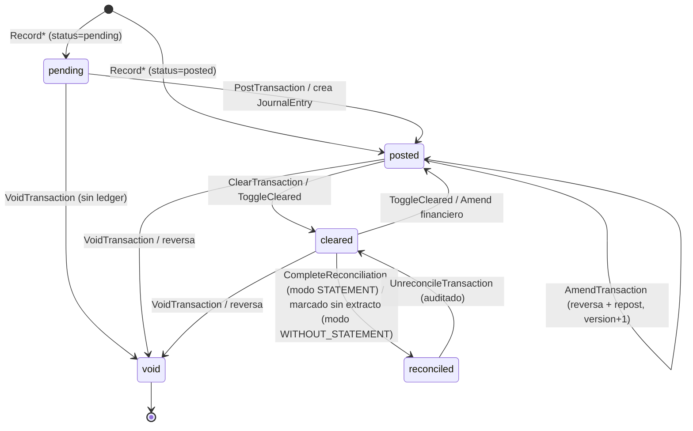
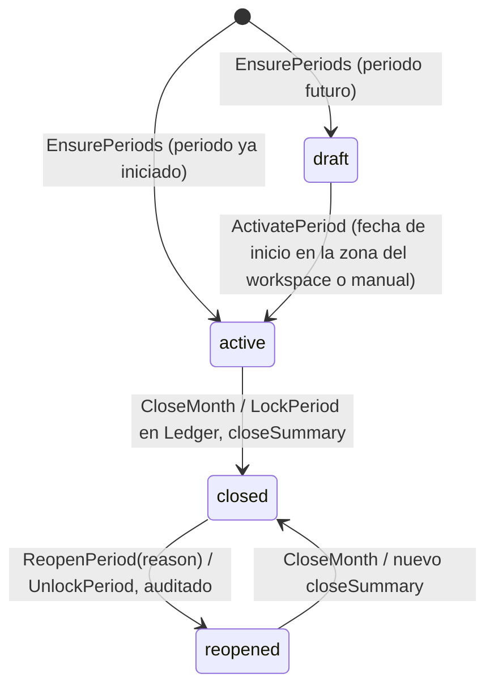
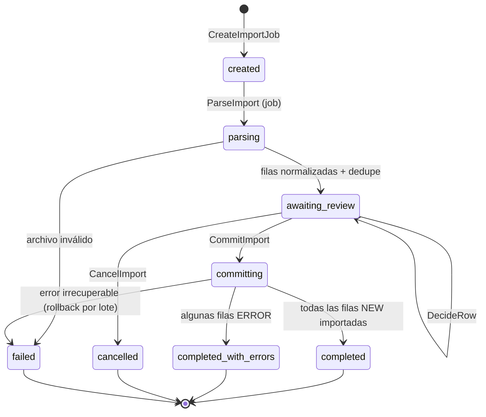
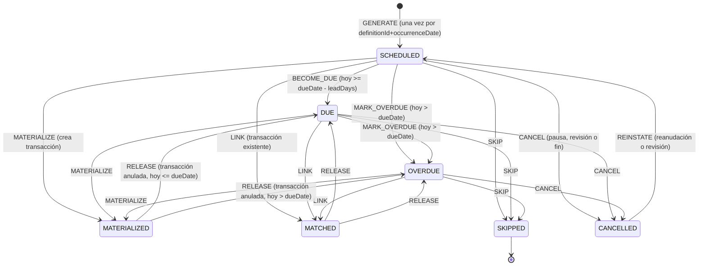
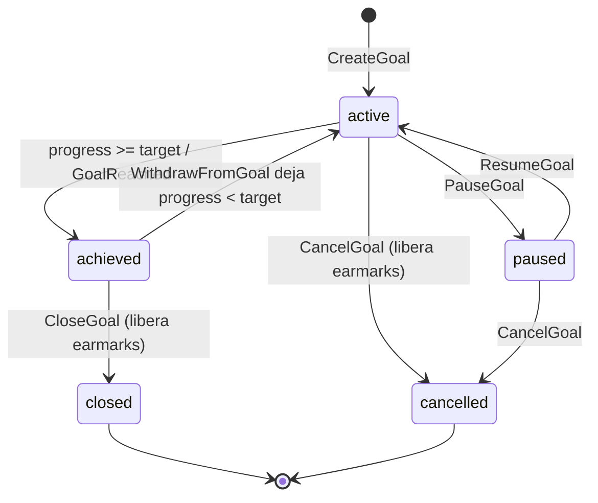
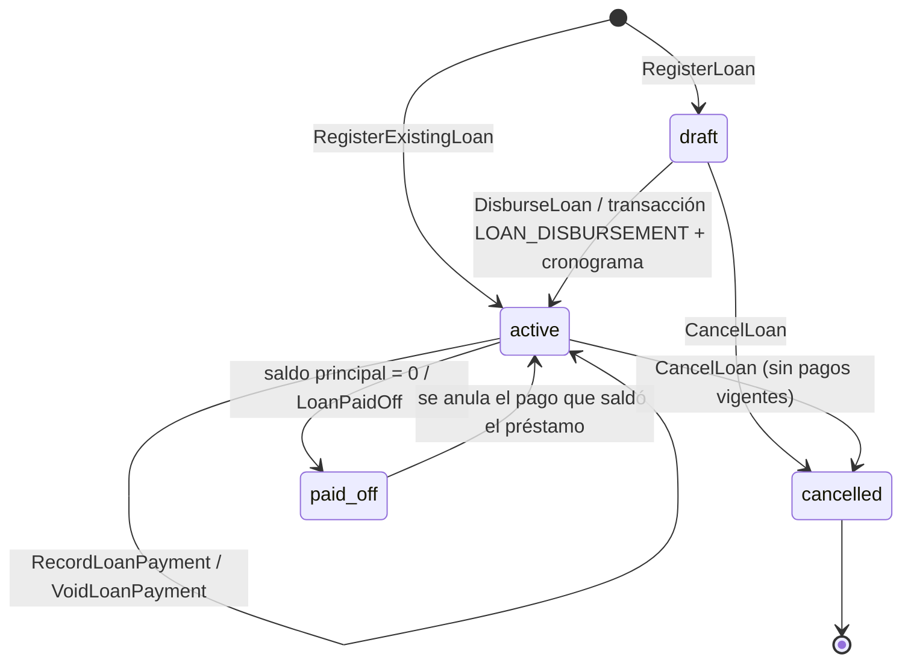
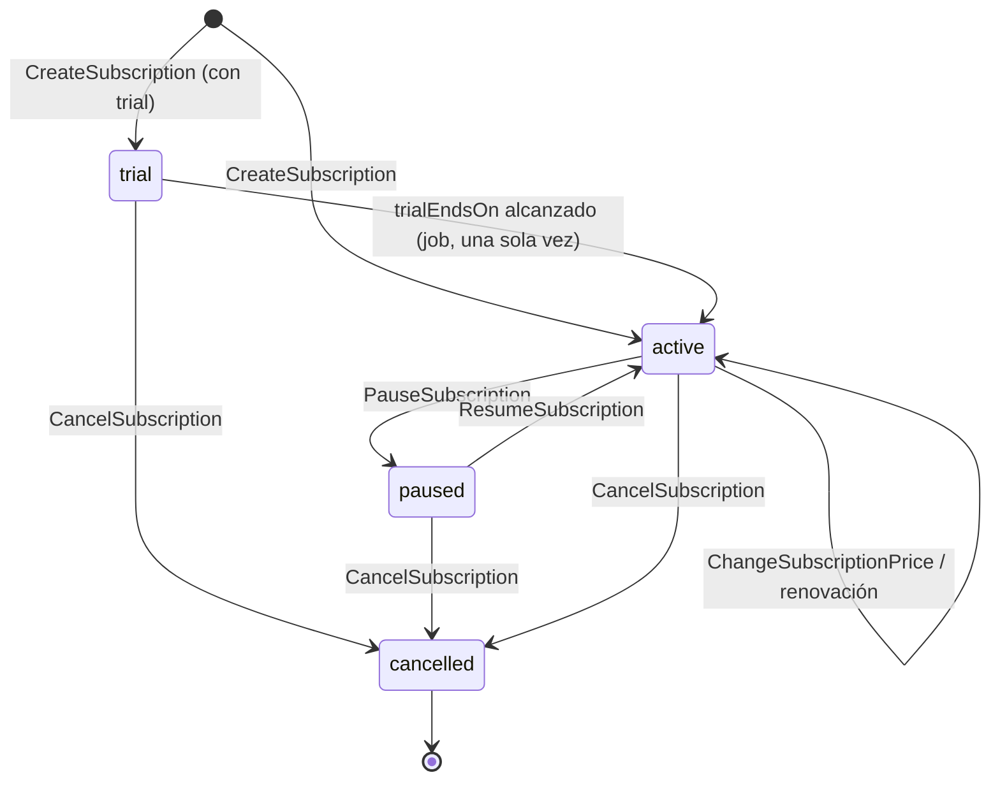

# 04 — Modelo de dominio

> **Estado:** Propuesto · **Fecha:** 2026-10-01 · **Relacionado:** [ARCHITECTURE.md](ARCHITECTURE.md) · [05-bounded-contexts.md](05-bounded-contexts.md) · [06-context-map.md](06-context-map.md) · [08-data-model.md](08-data-model.md) · [09-ledger-design.md](09-ledger-design.md) · [11-domain-events.md](11-domain-events.md) · ADR-0004, ADR-0006

Este documento fija el **lenguaje ubicuo**, el **shared kernel** y, por cada bounded context, sus agregados, entidades, value objects, servicios de dominio, puertos, comandos, queries, eventos e invariantes. Incluye los diagramas de estado de los ciclos de vida principales y la validación de la lista original de tablas candidatas. El modelo físico (tablas, columnas, índices) es responsabilidad de [08-data-model.md](08-data-model.md); aquí las tablas se describen sólo conceptualmente.

---

## 1. Lenguaje ubicuo (glosario)

Regla: el **código** usa el término en inglés; la **UI y la documentación** usan el término en español. Un término = un significado en todo el sistema.

| Español (UI/docs) | Código (EN) | Contexto | Definición |
|---|---|---|---|
| Usuario | `User` | IDENTITY | Persona autenticada vía OIDC (`sub`). |
| Espacio de trabajo | `Workspace` | IDENTITY | Unidad de aislamiento de datos (tenant). Tiene moneda base, moneda de reporte y zona horaria. |
| Membresía / rol | `Membership` / `Role` | IDENTITY | Relación usuario–workspace con rol `OWNER`, `EDITOR`, `VIEWER`. |
| Institución | `Institution` | ACCOUNTS | Banco, fintech, exchange, broker, proveedor de billetera u otra (`InstitutionKind`). |
| Cuenta | `Account` | ACCOUNTS | Contenedor de dinero del usuario en **una** moneda (activo o pasivo). |
| Naturaleza de cuenta | `AccountNature` (`ASSET`/`LIABILITY`) | ACCOUNTS | Derivada del tipo de cuenta. |
| Cuenta contable | `LedgerAccount` | LEDGER | Cuenta interna de doble entrada (ASSET, LIABILITY, EQUITY, INCOME, EXPENSE), una moneda. Invisible al usuario. |
| Asiento | `JournalEntry` | LEDGER | Conjunto inmutable de postings que cuadra por moneda. |
| Apunte / posting | `Posting` | LEDGER | Línea de un asiento: ledger account + monto firmado (débito +, crédito −). |
| Reversa | `Reversal` | LEDGER | Asiento que niega exactamente otro. |
| Saldo | `Balance` | LEDGER | Σ postings de una cuenta a una fecha. |
| Instantánea de saldo | `AccountBalanceSnapshot` | LEDGER | Caché derivada del saldo a una fecha. |
| Movimiento / transacción | `Transaction` | TRANSACTIONS | Documento de negocio que el usuario registra (gasto, ingreso, transferencia, conversión…). |
| Tipo de movimiento | `TransactionKind` | TRANSACTIONS | `INCOME, EXPENSE, TRANSFER, REFUND, ADJUSTMENT, OPENING_BALANCE, CONVERSION, LOAN_DISBURSEMENT, LOAN_PAYMENT`. |
| Estado | `TransactionStatus` | TRANSACTIONS | `pending, posted, cleared, reconciled, void`. |
| Pata | `TransactionLeg` | TRANSACTIONS | Efecto de la transacción sobre una cuenta del usuario (monto firmado). |
| División | `TransactionSplit` | TRANSACTIONS | Porción del monto nominal con su categoría, tags y custom fields. |
| Transferencia | `Transfer` (kind `TRANSFER`) | TRANSACTIONS | Movimiento entre cuentas del usuario **en la misma moneda**. |
| Conversión / cambio | `Conversion` (kind `CONVERSION`) + `ConversionDetail` | TRANSACTIONS | Intercambio entre monedas distintas (fiat↔fiat, fiat↔cripto, cripto↔cripto, compra/venta de commodity). |
| Tasa cotizada | `quotedRate` | TRANSACTIONS/FX | Tasa anunciada por el proveedor. |
| Tasa efectiva | `effectiveRate` | TRANSACTIONS | Neto recibido / bruto entregado. |
| Tasa de referencia | `referenceRate` | FX | Tasa de mercado/oficial histórica usada para comparar. |
| Diferencial | `spread` | FX/TRANSACTIONS | Diferencia entre cotizada y referencia. |
| Comisión | `Fee` (`PROVIDER, NETWORK, BANK, TAX, OTHER`) | TRANSACTIONS | Costo de una operación; siempre un gasto categorizado *Fees*. |
| Reembolso | `Refund` | TRANSACTIONS | Devolución que reduce el gasto de la categoría original. |
| Ajuste | `Adjustment` | TRANSACTIONS | Corrección de saldo sin origen identificado. |
| Saldo inicial | `OpeningBalance` | TRANSACTIONS | Saldo con el que la cuenta entra al sistema. |
| Conciliación | `Reconciliation` | TRANSACTIONS | Cotejo contra un extracto a una fecha con saldo declarado. |
| Duplicado candidato | `DuplicateCandidate` | TRANSACTIONS | Par de transacciones sospechosamente iguales. |
| Categoría / grupo | `Category` / `CategoryGroup` | CLASSIFICATION | Clasificación jerárquica de tres niveles: grupo → categoría → subcategoría. |
| Categoría de sistema | `SystemCategory` | CLASSIFICATION | 11 categorías protegidas con `systemCode` (FR-CLASSIFICATION-003): Comisiones, Comisiones de cambio, Intereses pagados, Comisiones de préstamo, Seguros, Impuestos, Ajustes y Sin categoría (gasto); Intereses ganados, Ajustes y Sin categoría (ingreso). |
| Etiqueta | `Tag` | CLASSIFICATION | Marca libre transversal. |
| Campo personalizado | `CustomFieldDefinition` / `CustomFieldValue` | CLASSIFICATION / TRANSACTIONS | Atributo definido por el usuario. |
| Contraparte | `Counterparty` | CLASSIFICATION | Comercio, proveedor, empleador, persona, banco con quien se opera (antes "Provider/Merchant/Payee"). |
| Periodo financiero / mes | `FinancialPeriod` (`YearMonth`) | PLANNING | Mes calendario del workspace con ciclo de vida. |
| Cierre de mes | `MonthClose` | PLANNING | Proceso que congela el mes. |
| Presupuesto / línea | `Budget` / `BudgetItem` | PLANNING | Monto planificado por categoría/grupo y mes. |
| Plantilla / versión | `BudgetTemplate` / `BudgetTemplateVersion` | PLANNING | Presupuesto modelo versionado e inmutable por versión. |
| Definición recurrente | `RecurringDefinition` | COMMITMENTS | Compromiso periódico (ingreso, gasto, transferencia). |
| Ocurrencia | `RecurringOccurrence` | COMMITMENTS | Instancia fechada de una definición. |
| Regla de recurrencia | `RecurrenceRule` | SHARED KERNEL | Patrón (mensual, día 5, último día hábil…). |
| Suscripción | `Subscription` | COMMITMENTS | Servicio con precio y ciclo de renovación (Netflix, Spotify…). |
| Meta de ahorro | `SavingsGoal` | GOALS | Objetivo monetario con fecha opcional. |
| Aporte / reserva | `GoalContribution` (`REAL_TRANSFER` / `EARMARK`) | GOALS | Aporte real (transferencia) o reserva virtual (sin ledger). |
| Préstamo / cuota | `Loan` / `LoanInstallment` | DEBT | Deuda amortizable y su cronograma. |
| Tarjeta de crédito | `CreditCardProfile` | DEBT | Perfil (límite, corte, vencimiento) de una cuenta LIABILITY. |
| Estado de cuenta (tarjeta) | `CardStatement` | DEBT | Corte mensual de la tarjeta. |
| Moneda | `Currency` (`FIAT/CRYPTO/COMMODITY/CUSTOM`) | SHARED KERNEL / FX | Unidad de valor con escala. |
| Tasa de cambio | `ExchangeRate` | FX | Precio de una moneda en otra en un instante, con fuente. |
| Documento / adjunto | `Document` / `AttachmentLink` | DOCUMENTS | Archivo almacenado y su vínculo a entidades. |
| Importación | `ImportJob` / `ImportRow` | IMPORTS | Proceso de carga de un archivo o sync bancario. |
| Conexión bancaria | `BankConnection` | IMPORTS | Consentimiento/credencial delegada con un proveedor bancario. |
| Regla | `Rule` (`RuleCondition`, `RuleAction`) | RULES | Automatización "si … entonces …". |
| Patrimonio neto | `NetWorth` | REPORTING | Σ activos − pasivos valorizados en moneda de reporte. |
| Corrida de pronóstico | `ForecastRun` / `ForecastResult` | FORECAST | Ejecución del modelo y sus series. |
| Notificación | `Notification` | NOTIFY | Mensaje al usuario por canal. |
| Bitácora de auditoría | `AuditLog` | AUDIT | Registro inmutable de quién cambió qué. |
| Máquina de estados | `LifecycleMachine` | SHARED KERNEL (declarada por cada contexto) | Estados, terminales y transiciones permitidas (origen, destino, guarda, eventos) de un agregado; única fuente de las reglas de transición (docs/31 D37). |
| Transición | `LifecycleTransition` | AUDIT | Paso explícito del flujo de un agregado (p. ej. `POST`, `REVISE`, `VOID`) con actor, instante, motivo, revisión, asientos y eventos; inmutable. |
| Anotación | `LifecycleAnnotation` | AUDIT | Cambio descriptivo del recorrido (sin cambio de estado ni de ledger). |
| Recorrido | `Lifecycle` | AUDIT (compuesto por el contexto dueño) | Camino completo de un elemento: estado actual, estados visitados y transiciones/anotaciones en orden. |
| Fecha de negocio | `businessDate` / `entryDate` (`LocalDate`) | todos | Fecha en la TZ del workspace (no instante). |
| Instante | `Instant` (UTC) | todos | Momento absoluto (`occurredAt`, `executedAt`). |

## 2. Shared kernel (`@pf/shared-kernel`)

Pequeño, estable, sin dependencias de infraestructura. Cambios requieren ADR (lo comparten todos los contextos).

### 2.1 Identificadores

```ts
// UUIDv7 generado en la app (ordenable por tiempo). Branded types: imposibles de mezclar.
type Brand<T, B extends string> = T & { readonly __brand: B };
type WorkspaceId = Brand<string, 'WorkspaceId'>;
type AccountId   = Brand<string, 'AccountId'>;
type TransactionId = Brand<string, 'TransactionId'>;
// ... uno por agregado/entidad referenciable
interface IdGenerator { next<T extends string>(): Brand<string, T>; } // puerto (determinista en tests)
```

### 2.2 `Currency` y `CurrencyCode`

```ts
type CurrencyKind = 'FIAT' | 'CRYPTO' | 'COMMODITY' | 'CUSTOM';
interface Currency {
  code: CurrencyCode;      // 'BOB','USD','USDT','BTC','ETH','XAU','AAPL', custom 'X-MILLAS'
  kind: CurrencyKind;
  scale: number;           // 0..18 — BOB 2, USD 2, JPY 0, BTC 8, USDT 6, ETH 18
  name: string; symbol?: string;
  workspaceId?: WorkspaceId; // sólo CUSTOM/COMMODITY definidos por un workspace
}
```

Invariantes: `scale ∈ [0,18]` (límite de `NUMERIC(38,18)`); `code` único en su ámbito; `scale` **inmutable** una vez usada (cambiarla reinterpretaría montos históricos).

### 2.3 `Money`

```ts
class Money {                      // Value Object inmutable
  private constructor(readonly amount: Decimal, readonly currency: Currency) {}
  static of(amount: string, c: Currency): Money;      // rechaza escala > c.scale (AMOUNT_SCALE_EXCEEDED)
  static ofMinorUnits(units: bigint, c: Currency): Money;
  static zero(c: Currency): Money;
  add(o: Money): Money;            // CURRENCY_MISMATCH si o.currency ≠ currency
  subtract(o: Money): Money;
  negate(): Money;
  multiply(factor: Decimal, rounding: 'HALF_EVEN' = 'HALF_EVEN'): Money; // materializa a escala
  allocate(weights: Decimal[]): Money[];   // largest remainder, desempate por índice
  isZero(): boolean; isPositive(): boolean; isNegative(): boolean;
  compare(o: Money): -1 | 0 | 1;
  toJSON(): { amount: string; currency: string };   // "685.00" (escala fija de la moneda)
}
```

decimal.js configurado con `precision: 40`, `rounding: ROUND_HALF_EVEN`. Prohibido `number` para montos (lint + architecture test, INV-001). Detalle de redondeo en [09-ledger-design.md §12](09-ledger-design.md).

### 2.4 `ExchangeRate` / `Rate`

```ts
interface Rate { base: CurrencyCode; quote: CurrencyCode; value: Decimal } // 1 base = value quote; value > 0; base ≠ quote
interface ExchangeRateSnapshot extends Rate {
  asOf: Instant; source: RateSourceRef;
  rateType: 'OFFICIAL' | 'PARALLEL' | 'P2P' | 'BANK' | 'CUSTOM' | 'PARALLEL_BUY' | 'PARALLEL_SELL'; // FR-FX-002 (D13) + D39
}
// operaciones: invert() (precisión 40), convert(money) (una cuantización HALF_EVEN), normalize(displayOrientation)
```

- **Tipos de tasa** (rev. 2026-10-04, D13/D39): los cinco de FR-FX-002 (spec `fx/market-rates`) más `PARALLEL_BUY` / `PARALLEL_SELL`, que los providers de mercado registran junto con la mediana `PARALLEL` (misma vigencia, provider y respuesta cruda; spec `fx/market-rate-providers`). Convención "desde el lado del owner": `PARALLEL_BUY` = BOB que se **pagan** por 1 USD (valor mayor), `PARALLEL_SELL` = BOB que se **reciben** al vender 1 USD (valor menor). Solo se usan si se piden explícitamente (tipo pedido o preferencia del par); la valoración y la referencia de conversión por defecto no los toman. El tipo preferido para valorar se fija por par en `fx.rate_preference` (FR-FX-006).
- **Fees de conversión** (rev. 2026-10-04, D12): VO `Fee { type: 'PROVIDER' | 'NETWORK' | 'BANK' | 'TAX' | 'OTHER'; amount: Money; paidFromAccountId? }` (FR-TRANSACTIONS-022). Un fee en una moneda distinta del origen y del destino exige `paidFromAccountId` de esa moneda.
- **Revisión de una conversión** (rev. 2026-10-04, D11): `ConversionDetail` es inmutable y versionado por `revision` (≥ 1). Editar una conversión = reversa del asiento + nuevo asiento + nuevo `ConversionDetail` con `revision + 1` en la misma transacción de BD; las revisiones anteriores se conservan y siguen consultables (FR-TRANSACTIONS-024). La tasa de referencia queda registrada por id exacto aunque luego se reemplace (FR-FX-008).

### 2.5 Tiempo y periodos

- `LocalDate` (`YYYY-MM-DD`), `Instant` (UTC), `TimeZone` (IANA, default `America/La_Paz`).
- `DateRange { start: LocalDate; end: LocalDate }` inclusivo; invariante `start ≤ end`; operaciones `contains`, `overlaps`, `split(byMonth)`.
- `YearMonth { year; month }` (= periodo mensual); `toDateRange(tz)`, `next()`, `prev()`, `of(LocalDate)`.
- `Clock` (puerto): `now(): Instant`, `today(tz): LocalDate`. Nunca `new Date()` en dominio.

### 2.6 `Percentage`

`Percentage { value: Decimal }` con `value` en puntos porcentuales (`11.5` = 11.5 %). Constructores `ofPercent`, `ofFraction`. Usos: tasas de interés (con `AnnualRate`/`PeriodicRate` como VOs de Debt), umbrales de presupuesto, splits porcentuales. Validación de rango contextual (umbral 0–1000 %, split 0–100 %).

### 2.7 `RecurrenceRule`

```ts
interface RecurrenceRule {          // Subconjunto de RFC 5545 RRULE + ajustes de negocio
  freq: 'DAILY' | 'WEEKLY' | 'MONTHLY' | 'YEARLY';
  interval: number;                 // ≥ 1
  byMonthDay?: number[];            // 1..31, -1 = último día
  byWeekday?: Weekday[]; bySetPos?: number;  // "último viernes"
  start: LocalDate; until?: LocalDate; count?: number;
  businessDayAdjustment: 'NONE' | 'PREVIOUS' | 'NEXT';   // Phase 3: solo fin de semana; 'MODIFIED_FOLLOWING' y feriados fuera de Phase 3 (D130)
  timeZone: TimeZone;
}
// expand(rule, window: DateRange, holidays?): LocalDate[]  — función pura y determinista
```

Reglas: día 29–31 en meses sin ese día → último día del mes (**desviación deliberada de RFC 5545**, que omitiría el mes; la UI lo explica; FR-COMMITMENTS-005); `until` y `count` mutuamente excluyentes; la clave de ocurrencia es la **fecha nominal** (antes del ajuste por día hábil) para que la generación sea estable (INV-013).

### 2.8 Otros

- `Result<T, E>` para errores de dominio esperados (sin excepciones para flujo de negocio); `DomainError { code: 'LEDGER_UNBALANCED_ENTRY' | 'PERIOD_CLOSED' | … }` mapeado a RFC 9457.
- `DomainEvent<TPayload>` base: `{ eventType, eventVersion, aggregateType, aggregateId, aggregateVersion, occurredAt, payload }` (el envelope completo lo agrega `@pf/platform`, ver [11-domain-events.md](11-domain-events.md)).
- `AggregateRoot` con `version` (optimistic locking) y `pullEvents()`.

## 3. Modelo por bounded context

Convenciones: **AR** = aggregate root, **E** = entidad, **VO** = value object, **DS** = domain service, **Repo** = repositorio (puerto), **Port** = otro puerto de salida. Comandos/queries listados son los del `contracts` público salvo indicación (*interno*). Eventos sin prefijo pertenecen al contexto (`<context>.<EventName>.v1`).

### 3.1 IDENTITY — Identity & Workspace (`iam`)

- **AR `User`**: `id, externalSubject (OIDC sub), email, displayName, locale, status (ACTIVE|DISABLED)`.
- **AR `Workspace`**: `id, name, baseCurrency, reportingCurrency, timeZone, weekStart, memberships: E Membership[] (userId, role, joinedAt)`.
- **VO**: `Role`, `Email`, `WorkspaceSettings`.
- **Ports**: `UserRepository`, `WorkspaceRepository`, `IdentityProviderPort` (claims OIDC; sin contraseñas propias), `Clock`.
- **Comandos**: `ProvisionUserFromIdentity`, `CreateWorkspace`, `UpdateWorkspaceSettings`, `AddMember`, `ChangeMemberRole`, `RemoveMember`.
- **Queries**: `GetMe`, `ListMyWorkspaces`, `GetWorkspaceSettings`, `AuthorizeAction(userId, workspaceId, permission)`.
- **Eventos**: `WorkspaceCreated`, `WorkspaceSettingsChanged`, `MemberAdded`, `MemberRemoved`.
- **Invariantes**: un workspace tiene ≥ 1 `OWNER`; un usuario no tiene dos membresías en el mismo workspace; `reportingCurrency` se puede cambiar (sólo afecta valoración); `baseCurrency` es default de UI, no contable.

### 3.2 ACCOUNTS — Accounts & Institutions (`accounts`)

- **AR `Account`**: `id, workspaceId, name, type, nature (derivada), currency, institutionId?, liquidity (LIQUID|SEMI_LIQUID|ILLIQUID), includeInNetWorth, includeInBudget, status (ACTIVE|CLOSED|ARCHIVED, derivado de closedOn/archivedAt), openedOn, closedOn?, archivedAt?, displayOrder, accountNumberLast4? (MaskedAccountNumber), icon?, color?, notes?, tagIds[], cryptoNetwork?, version` (rev. 2026-10-04, D3/D4/D5).
  - Estados (D4): `ACTIVE`, `CLOSED`, `ARCHIVED`; transiciones repetidas → `INVALID_STATUS_TRANSITION`; se permite archivar una cuenta `CLOSED`; editar una `ARCHIVED` → `ACCOUNT_ARCHIVED`.
  - Etiquetas de cuenta: tabla de enlace `accounts.account_tag (workspace_id, account_id, tag_id)` con `tag_id` lógico al catálogo `classification.tag`, validado vía `TagCatalogPort`; un tag archivado no es asignable (`TAG_ARCHIVED`).
  - `AccountType` (D3, lista canónica de FR-ACCOUNTS-001 / spec `accounts/account-management`): `BANK, CASH, DIGITAL_WALLET, CREDIT_CARD, LOAN, CRYPTO_WALLET, INVESTMENT, SAVINGS, VIRTUAL, MANUAL_ASSET, MANUAL_LIABILITY` → `nature` LIABILITY para `CREDIT_CARD`, `LOAN`, `MANUAL_LIABILITY`; ASSET para el resto.
  - `liquidity` por defecto según tipo (FR-ACCOUNTS-011): `LIQUID` para BANK, CASH, DIGITAL_WALLET, CRYPTO_WALLET, SAVINGS; `SEMI_LIQUID` para INVESTMENT; `ILLIQUID` para el resto (D5). Solo `ASSET` + `LIQUID` cuenta como dinero disponible (D35); no existe flag `includeInLiquidity`.
- **AR `Institution`**: `id, workspaceId, name, kind (BANK|FINTECH|EXCHANGE|BROKER|WALLET_PROVIDER|OTHER), country, website?, status`.
- **VO**: `AccountType`, `AccountNature`, `AccountLiquidity`, `MaskedAccountNumber` (sólo últimos 4).
- **Ports**: `AccountRepository`, `InstitutionRepository`, `CurrencyCatalog` (lectura, FX contracts), `LedgerBalancesPort` (`GetBalances`, `HasPostings`), `FxRateQueryPort`, `TagCatalogPort` (Classification contracts), `AuditPort`, `OutboxPort`.
- **Comandos**: `OpenAccount`, `UpdateAccount` (nombre, institución, orden, liquidity, includeInNetWorth, includeInBudget, tags, moneda solo sin movimientos), `ArchiveAccount`, `CloseAccount` (exige saldo cero), `ReactivateAccount`, `ReorderAccounts`, `CreateInstitution`, `UpdateInstitution`, `ArchiveInstitution`.
- **Queries**: `GetAccount`, `ListAccounts(filters)`, `GetAccountsByIds`, `ListInstitutions`.
- **Eventos**: `AccountOpened`, `AccountUpdated`, `AccountArchived`, `AccountClosed`, `AccountReactivated`.
- **Invariantes**: `type` (por ende `nature`) **inmutable** tras crear; `currency` solo puede cambiar mientras la cuenta no tenga movimientos (FR-ACCOUNTS-005, rev. 2026-10-02); nombre único entre cuentas activas del workspace; cuenta archivada o cerrada no acepta movimientos nuevos (INV-026, verificado por Transactions vía query); el `LedgerAccount` de la cuenta lo crea Ledger con *get-or-create* en la misma transacción de BD que el primer posting, único por cuenta (`UNIQUE (workspace_id, source_account_id)` en `ledger.ledger_account`); Accounts no guarda `ledger_account_id` (FR-ACCOUNTS-003, ARCHITECTURE §7, rev. 2026-10-04, D6); no se borra nunca (soft-archive). El **saldo no vive aquí** (lo calcula Ledger). El saldo inicial se registra como transacción `OPENING_BALANCE` en Transactions (orquestado en la misma unidad de trabajo por la capa de composición, ver [06-context-map.md](06-context-map.md)).

### 3.3 LEDGER — Financial Ledger (`ledger`)

- **AR `JournalEntry`** (E `Posting[]`): ver [09-ledger-design.md §4](09-ledger-design.md).
- **AR `LedgerAccount`**: `id, workspaceId, nature (ASSET|LIABILITY|EQUITY|INCOME|EXPENSE), currency, code, sourceAccountId? (cuenta de usuario; rev. 2026-10-04), systemCode? (INCOME, EXPENSE, OPENING_BALANCE, FX_TRADING, ADJUSTMENTS), status`.
- **Read model interno**: `AccountBalanceSnapshot` (derivado), `PeriodLock` (escrito por Planning vía puerto).
- **VO**: `EntryType`, `SourceRef`, `LedgerAccountCode`, `SignedAmount` (Money firmado).
- **DS**: `EntryValidator` (cuadre por moneda, ≥ 2 postings, monedas de cuentas, workspace), `ReversalFactory`, `BalanceCalculator`, `LedgerAccountResolver` (get-or-create de cuentas de usuario y de sistema por moneda).
- **Repos**: `JournalEntryRepository` (append-only: `append`, `findById`, `findActiveBySource`), `LedgerAccountRepository`, `BalanceSnapshotRepository`, `PeriodLockRepository`.
- **Ports**: `Clock`, `IdGenerator`.
- **API pública (sync, `LedgerPostingPort`)**: `PostJournalEntry(draft) → JournalEntryId`, `ReverseJournalEntry(entryId, reverseDate, reason) → JournalEntryId`. `LedgerPeriodLockPort`: `LockPeriod(yearMonth)`, `UnlockPeriod(yearMonth)`.
- **Queries**: `GetBalance(accountId, asOf)`, `GetBalances(accountIds, asOf)`, `GetBalanceHistory(accountId, range, granularity)`, `GetTrialBalance(asOf)`, `GetEntriesBySource(sourceRef)`.
- **Comandos internos**: `RebuildBalanceSnapshots`, `VerifyLedgerIntegrity` (job).
- **Eventos**: `JournalEntryPosted` (incluye reversas, con `entryType`).
- **Invariantes**: INV-004..008, INV-015, INV-022, INV-025, INV-031.

### 3.4 TRANSACTIONS (`txn`)

- **AR `Transaction`**: `id, workspaceId, kind, status, businessDate, description, notes, counterpartyId?, legs: VO TransactionLeg[] (accountId, amount: Money firmado), splits: E TransactionSplit[] (id, amount, categoryId?, tagIds[], customFields: CustomFieldValue[], memo, originalAmount?), conversionDetail?: VO ConversionDetail (versionado por revisión: editar = reversa + nuevo asiento + nueva revisión), loanPaymentBreakdown?: VO, origin: VO Origin (MANUAL|IMPORT|RECURRING|DEBT|GOAL|RULE|SYSTEM + refId), externalRef?, fingerprint?, refundOfTransactionId?, transferPairRef?, activeJournalEntryId?, version`.
- **AR `Reconciliation`** (as-built `add-reconciliation`, 2026-10-08): `id, workspaceId, accountId, currency, statementDate, statementBalance: Money, status (IN_PROGRESS|COMPLETED|CANCELLED), clearedBalance?, difference?, adjustmentTransactionId?, completedAt?, cancelledAt?, version`; el conjunto incluido NO se guarda mientras la sesión está en curso (es "`cleared` de la cuenta con fecha ≤ extracto" al finalizar) y lo reconciliado queda en `reconciliation_item`. `Transaction` agrega el VO `ReconciliationMode = STATEMENT | WITHOUT_STATEMENT` (no nulo si y solo si `RECONCILED`) y la marca de sistema derivada `RECONCILED_WITHOUT_STATEMENT` (docs/33 D74, D111).
- **AR `DuplicateCandidate`**: `id, transactionIds[2], score, reasons[], status (OPEN|CONFIRMED_DUPLICATE|DISMISSED|MERGED)`.
- **VO**: `TransactionKind`, `TransactionStatus`, `TransactionLeg`, `ConversionDetail`, `Fee`, `Rate`, `LoanPaymentBreakdown (principal, interest, fees, insurance, taxes)`, `Origin`, `TransactionFingerprint (accountId + date + amount + normalizedDescription hash)`.
- **DS**: `TransactionPostingTranslator` (Transaction → JournalEntryDraft; implementa todo el mapeo de [09 §6](09-ledger-design.md)), `SplitAllocator` (largest remainder), `ConversionCalculator` (effective rate, spread, validaciones), `DuplicateDetector`, `TransferMatcher` (empareja dos transacciones importadas como una transferencia), `ReconciliationService`.
- **Repos**: `TransactionRepository`, `ReconciliationRepository`, `DuplicateCandidateRepository`.
- **Ports**: `LedgerPostingPort` (sync), `AccountDirectory` (Accounts query), `ClassificationValidator` (Classification query), `ReferenceRateProvider` (FX query), `AuditPort`, `Clock`, `IdGenerator`.
- **Comandos** (públicos; algunos invocados por Debt/Goals/Commitments/Imports/Rules): `RecordTransaction` (income/expense con splits), `RecordTransfer`, `RecordConversion`, `RecordRefund`, `RecordAdjustment`, `RecordOpeningBalance`, `RecordLoanDisbursement`, `RecordLoanPayment` (as-built `add-loans`: solo se invocan por el puerto `LoanTransactionsPort` —`recordDisbursement`, `recordPayment`, `voidManaged`— y producen transacciones **administradas** `source = DEBT`; `RecordTransaction` rechaza esos kinds con `VALIDATION_FAILED` y la edición financiera o anulación por la API de transacciones responde `TRANSACTION_MANAGED_EXTERNALLY`, 409, `details {managedBy: 'DEBT', loanId}`), `PostTransaction` (pending→posted), `ClearTransaction`, `AmendTransaction`, `VoidTransaction`, `ApplyClassification` (categoría/tags/custom fields/contraparte por split, con `appliedBy: USER|RULE|IMPORT`), `BulkEditTransactions`, `StartReconciliation`, `ToggleClearedInSession`, `CompleteReconciliation` (con ajuste opcional), `CancelReconciliation`, `ReconcileWithoutStatement` (marcado directo con modo explícito, D74), `UnreconcileTransaction`, `ResolveDuplicate` (confirm/dismiss/merge), `LinkAsTransfer`, `ImportTransactions` (batch con fingerprints, usado por Imports).
- **Queries**: `GetTransaction`, `ListTransactions(filters, cursor)`, `SearchTransactions`, `GetReconciliation` (saldo confirmado y diferencia en vivo), `ListReconciliations`, `ReconciliationStatusQuery.getCoverage({workspaceId, accountIds, from?, through})` (contrato público para PLANNING, D111), `ListDuplicateCandidates`, `CountPendingInPeriod(yearMonth)`.
- **Eventos**: `TransactionCreated`, `TransactionUpdated`, `TransactionPosted`, `TransactionVoided`, `TransactionCategorized`, `TransferCompleted`, `TransferRevised`, `ConversionRecorded`, `ConversionRevised`, `TransactionCleared`, `ReconciliationCompleted`, `DuplicateDetected`.
- **Invariantes**: INV-002, 003, 009, 010, 012, 016, 021, 023, 024, 026, 027, 033; además: transfer requiere misma moneda y cuentas distintas; conversión requiere monedas distintas; legs de cuentas con su moneda; `reconciled` ⇒ campos financieros inmutables; `REFUND` no puede exceder el original (advertencia, no bloqueo).

### 3.5 CLASSIFICATION (`classification`)

- **AR `Category`**: `id, groupId, parentId? (un solo nivel de subcategoría), name, kind (EXPENSE|INCOME), isSystem, systemCode? (FEES|FX_FEES|INTEREST|LOAN_FEES|INSURANCE|TAXES|ADJUSTMENTS|UNCATEGORIZED|INTEREST_EARNED|ADJUSTMENTS_INCOME|UNCATEGORIZED_INCOME), status (ACTIVE|ARCHIVED), icon, color, mergedInto?`.
- **AR `CategoryGroup`**: `id, name, kind, order, status`.
- **AR `Tag`**: `id, name, color, status`.
- **AR `CustomFieldDefinition`** (as-built `add-custom-fields`, rev. 2026-10-08): `id, key (snake_case ≤ 40, único entre las activas e inmutable), label, dataType (TEXT|NUMBER|DECIMAL|DATE|BOOLEAN|SELECT), target (TRANSACTION|ACCOUNT), options[{key, label, position}] (solo SELECT, clave estable), required, position, archivedAt, version`. `MULTI_SELECT` y `MONEY` quedan fuera de Phase 2 (docs/33 D96); `NUMBER` es entero (|n| < 10^15) y `DECIMAL` admite hasta 18 decimales (ambos viajan como string exacto, nunca punto flotante). El objetivo `TRANSACTION` se asigna **por split nominal** de ingresos, gastos y reembolsos (con un único split la UI lo presenta a nivel transacción); transferencias y conversiones no llevan custom fields (D97). Sin máquina de estados (solo archivado suave). Tipo y objetivo se bloquean mientras la definición tenga valores; una opción de `SELECT` en uso no se elimina.
- **AR `Counterparty`**: `id, name, kind (MERCHANT|PERSON|EMPLOYER|BANK|SERVICE_PROVIDER|GOVERNMENT|OTHER), aliases: VO Alias[] (patrones de descripción para matching), defaultCategoryId?, status, mergedInto?`.
- **DS**: `CounterpartyMatcher` (alias → counterparty), `CategoryMergeService`.
- **Repos**: uno por AR. **Ports**: `AuditPort`.
- **Comandos**: `CreateCategory`, `UpdateCategory`, `MoveCategory`, `ArchiveCategory`, `MergeCategories`, `Create/Update/ArchiveCategoryGroup`, `Create/Rename/Archive/MergeTags`, `Define/Update/Archive/UnarchiveCustomField`, `Create/Update/Archive/MergeCounterparty`, `AddCounterpartyAlias`, `SeedSystemCategories` (al crear workspace).
- **Queries**: `ListCategories`, `GetCategoryTree`, `ValidateClassification(categoryIds, tagIds, counterpartyId)`, `ValidateCustomFieldValues(target, items[], requireMandatory)` (as-built `add-custom-fields`: valida y normaliza los valores de un split o de una cuenta; obligatoriedad no retroactiva), `ResolveCounterparty(description)`, `ListTags`, `ListCustomFields`, `ListCounterparties`.
- **Eventos**: `CategoryArchived`, `CategoriesMerged`, `TagsMerged`, `CounterpartiesMerged`, `CustomFieldDefinitionChanged`.
- **Invariantes**: INV-019 (nunca hard delete, solo archivar); las categorías de sistema no se archivan, renombran, cambian de tipo ni de jerarquía (`SYSTEM_CATEGORY_IMMUTABLE`); jerarquía de tres niveles grupo → categoría → subcategoría (una subcategoría no tiene hijas: `CATEGORY_DEPTH_EXCEEDED`), con nombre único entre activas del mismo padre; `kind` de la categoría compatible con el signo del split (gasto/ingreso; los refunds usan categoría de gasto).

> Nota: los **valores** asignados (categoryId del split, tags del split, `CustomFieldValue`) son propiedad de Transactions (valores de custom fields de cuenta: de Accounts); Classification es dueño de los **catálogos** y de la validación (`ValidateCustomFieldValues`).

### 3.6 PLANNING — Planning & Budgeting (`planning`)

- **AR `FinancialPeriod`**: `id, yearMonth, status (draft|active|closed|reopened), dateRange, closedAt?, closedBy?, closeSummary?: VO (saldos por cuenta, totales ingreso/gasto por moneda, conteos), reopenings: VO[] (at, by, reason)`.
  - *add-financial-periods (Phase 2):* `label` = `YYYY-MM` del **inicio** (docs/33 D59), `dateRange` inclusivo calculado por el DS `PeriodCalendar` desde el día de inicio del mes financiero (1..28), `startDay`, `isTransition` (absorbe un cambio del día de inicio), `closeCount`/`reopenCount`/`latestCloseNo` (los alimenta `add-month-closing`), `version`. Un periodo se **crea `active`** si ya empezó en la zona del workspace (contiene hoy o terminó) y `draft` si es futuro; un periodo terminado y no cerrado sigue `active` con la marca derivada *pendiente de cierre* (D60). Cambiar el día de inicio recalcula solo los `draft`, conservando `id` y `label`; el primero pasa a ser el periodo de transición (D61).
- **AR `Budget`**: `id, workspaceId, periodId, currency, origin (EMPTY|TEMPLATE|CLONE), templateVersionId?, clonedFromBudgetId?, zeroBased, lines: E BudgetLine[], version`.
  - *add-budgets (Phase 2):* **un plan por periodo** (`UNIQUE (workspace, periodo)`) **en la moneda base** del workspace al crearlo (docs/33 D78/D79; la columna `currency` permite relajarlo a `(periodo, moneda)` con un *expand*). Sin estados propios: sigue al periodo (D110, sin máquina de recorrido; historia en el audit log). `BudgetLine`: `target (CATEGORY|GROUP|TAG + id)`, `nature (EXPENSE|INCOME)` derivada del `kind` de la categoría/grupo, `kind (FIXED|MAXIMUM|MINIMUM|RANGE|PERCENT_OF_INCOME)` con sus montos (`planned`, `min`, `max`, `percent` + `incomeBasis`), `rolloverPolicy (NONE|CARRY_POSITIVE|CARRY_ALL)` + `rolloverCap?` + remanente recibido (`PROVISIONAL` hasta cerrar el periodo anterior, luego `FINAL`), `thresholds[]` (por defecto 50/75/90/100; no en `MINIMUM` ni ingresos, D81), `source`/`overridden`. Los **ingresos esperados** son líneas `FIXED` de categorías de ingreso. `zeroBased` es un modo del plan ("por asignar"). Un plan no admite objetivos solapados (categoría↔subcategoría, grupo↔categoría: `BUDGET_TARGET_OVERLAP`) ni el mismo objetivo dos veces. **El gastado nunca se guarda** (INV-034).
- **AR `BudgetTemplate`**: `id, workspaceId, name, description?, isDefault, status (ACTIVE|ARCHIVED), currentVersionNo, version, versions: E BudgetTemplateVersion[] (versionNo, basedOnVersionNo?, changeNote?, createdAt, createdBy, lines: VO TemplateLineSpec[]) — inmutables`.
  - *add-budget-templates (Phase 2):* cada versión es una **instantánea completa e inmutable** de las líneas (no un diff; WS-RO en la BD: `forbid_mutation`, PF003). `TemplateLineSpec` es el mismo valor que valida `BudgetLine` (objetivo `CATEGORY|GROUP|TAG`, naturaleza, tipo, montos, %, base de ingresos, rollover, umbrales) más la **moneda** (la base del workspace al publicar); sin `effectiveFrom` (la versión se elige al aplicar). Nombre único entre activos sin distinguir mayúsculas (`NAME_TAKEN`); un solo predeterminado activo por workspace; archivar (nunca borrar: `DELETE` ⇒ 405) lo desmarca y bloquea aplicarlo (`BUDGET_TEMPLATE_ARCHIVED`). Publicar con `baseVersionNo` distinto de la vigente ⇒ `CONCURRENCY_CONFLICT`. Sin recorrido de ciclo de vida (D110): la historia está en el audit log. **Orígenes del plan** (`Budget.origin`): `TEMPLATE` (versión elegida o la última; guarda `templateVersionId` y, por línea, `source`/`templateLineId`), `CLONE` (plan del periodo anterior: copia líneas, marca `overridden` y `templateLineId`; hereda `templateVersionId`; sin cruces, gastado ni remanente recibido) y `EMPTY`. Al copiar se **omiten e informan** (`omittedLines`) las líneas de objetivos archivados (`TARGET_ARCHIVED`) y las de otra moneda que la base (`CURRENCY_MISMATCH`, D79; sin convertir). El **predeterminado** se aplica a cada periodo nuevo mediante el `PeriodCreatedHook` síncrono de la unidad de trabajo de `EnsurePeriods` (idempotente por la unicidad del plan). Editar una línea de origen template/clon la marca `overridden` y nunca toca el template. **Propagación** (DS `PropagationPlanner`, sin estado, con token de hash): alcanza solo planes del template en periodos `DRAFT` con inicio posterior a hoy en la zona del workspace (D86), no pisa líneas `overridden` (conflicto) y quita las líneas borradas del template solo si no se editaron (D85); desde un plan sin template ⇒ `BUDGET_NO_TEMPLATE_ORIGIN` (D84).
- **Gastado (INV-034)**: en Phase 2 se **deriva en cada lectura** de `SummarizeNominalFlows` (Transactions) del rango del periodo, con la valoración compartida `FlowValuation` del shared-kernel (D109: la misma del Home). `reporting.budget_snapshot` / `BudgetActuals` materializado llegan con Phase 7.
- **DS**: `CloseChecklistEvaluator` (puro: ítems por severidad de la `ClosingPolicy` y veredicto), `CloseSnapshotBuilder` (snapshot inmutable y versionado), `SnapshotComparator`/`PeriodVariation` (add-month-closing; el caso de uso `CloseMonth` bloquea el ledger en la misma transacción), `BudgetFromTemplateFactory`, `RolloverCalculator`, `ThresholdEvaluator`; *add-budgets:* `BudgetProgressCalculator` (planificado efectivo, restante, % HALF_EVEN a 1 decimal, proyección lineal **solo** en `MAXIMUM`/`RANGE`/`PERCENT_OF_INCOME` — `FIXED` y `MINIMUM` muestran pendiente/cumplido, D83 —, estado, disponible para gastar, por asignar) y `TargetOverlapPolicy`.
- **Repos**: uno por AR + `BudgetActualsRepository`. **Ports**: `LedgerPeriodLockPort` (sync), `TransactionsQuery` (pendientes), `BalanceQuery` (Ledger), `AuditPort`, `Clock`.
- **Comandos**: `EnsurePeriods(through?)` (job/consumidores/comando; reemplaza a `OpenPeriod`), `ActivatePeriod`, `CloseMonth`, `ReopenPeriod(reason)`, `CreateBudget`, `CreateBudgetFromTemplate`, `AddBudgetLine`, `UpdateBudgetLine`, `RemoveBudgetLine`, `SetZeroBasedMode`, `CreateTemplate`, `PublishTemplateVersion`, `CloneTemplate`, `ArchiveTemplate`/`UnarchiveTemplate`, `SetDefaultTemplate`, `PreviewPropagation`/`ConfirmPropagation` (add-budget-templates; `CreateBudget` acepta `TEMPLATE` y `CLONE_PREVIOUS`).
- **Queries**: `GetPeriod`, `ListPeriods`, `GetBudget`, `GetBudgetByPeriod`, `GetBudgetVsActual` (contrato público `BudgetVsActualQuery.getForPeriod({workspaceId, periodId, asOf?})` para el snapshot de cierre), `GetCloseChecklist(yearMonth)`, `ListTemplates`, `GetTemplate`, `GetTemplateVersion`.
- **Eventos**: `PeriodActivated`, `MonthClosed`, `PeriodReopened`, `BudgetCreated`, `BudgetThresholdReached`.
- **Invariantes**: INV-015; un periodo por `(workspace, yearMonth)`; sólo se cierra en orden (no se cierra M si M−1 está abierto); una versión de plantilla publicada nunca cambia; un plan por periodo (Phase 2: en la moneda base; `(workspace, period)`); el cruce de un umbral se registra y emite **una sola vez** por `(periodo, objetivo, umbral)` (tabla de cruces append-only).

### 3.7 COMMITMENTS — Recurrence & Subscriptions (`commitments`)

- **AR `RecurringDefinition`** (nomenclatura canónica fijada por `add-recurrence-engine`, decisión 2): `id, workspaceId, name, description, kind (INCOME|EXPENSE|TRANSFER; reservados LOAN_PAYMENT|CARD_PAYMENT hasta Phase 4, D116), managedBy (USER|SUBSCRIPTION|DEBT; hoy solo USER), status (ACTIVE|PAUSED|ENDED), currentVersionNo, versions: DefinitionVersion[], generatedThrough, version`. **VO `DefinitionVersion`** (inmutable, append-only): `versionNo, effectiveFrom, template (accountId, toAccountId?, categoryId?, counterpartyId?, tagIds, paymentMethod?), schedule (RecurrenceRule + cadencia), amountSpec (FIXED|ESTIMATED|MIN_MAX|VARIABLE), materialization (AUTO_CREATE con autoCreateStatus PENDING|POSTED | PENDING_APPROVAL | NOTIFY_ONLY), leadDays`.
- **AR `RecurringOccurrence`**: `id, definitionId, occurrenceDate (nominal, clave), dueDate (ajustada o editada), definitionVersionNo, expected: AmountSpec, overridden {amount, date}, status (SCHEDULED|DUE|OVERDUE|MATERIALIZED|MATCHED|SKIPPED|CANCELLED), cancelReason? (PAUSED|SUPERSEDED|ENDED), transactionId?, resolution? (CREATED|MATCHED|SKIPPED), version`. Agregado separado (alto volumen, ciclo propio).
- **AR `MatchSuggestion`** (add-commitment-matching): `id, workspaceId, occurrenceId, definitionId, transactionId, score (0..100, 2 decimales), confidence (HIGH|MEDIUM|LOW), amountDelta?, dateDeltaDays, counterparty (MATCH|UNKNOWN), ambiguous, status (PROPOSED|CONFIRMED|DISMISSED|EXPIRED), expireReason? (TRANSACTION_VOIDED|OCCURRENCE_RESOLVED|OCCURRENCE_CANCELLED|INCOMPATIBLE|SUPERSEDED), version`. Una propuesta, no un elemento financiero: sin máquina de recorrido (D134); `EXPIRED{INCOMPATIBLE}` vuelve a `PROPOSED` si una edición la hace compatible (D136) y `DISMISSED` es terminal. `UNIQUE (occurrenceId, transactionId)`. Las tolerancias (`matchingAmountTolerancePct`, `matchingDateWindowDays`) son una anotación de la definición.
- **AR `Subscription`** (add-subscriptions): `id, workspaceId, definitionId (una definición recurrente propia, administrada: managedBy = SUBSCRIPTION), counterpartyId (provider), name, planName?, priceCurrency, status (TRIAL|ACTIVE|PAUSED|CANCELLED), trialEndsOn?, scheduledCancellationOn? (atributo, no un estado), cancelledOn?, cancellationReason?, cancellationUrl?, reminder {enabled, daysBefore 1..30}, tolerance (0.00–50.00 %, default 1.00), nextRenewalOn (proyección), version`. El ciclo, la cuenta de pago, la categoría y el modo de materialización viven en la definición. Entidades: `PriceHistoryEntry {id, effectiveFrom, price: Money, origin (INITIAL|MANUAL|PROPOSAL|CORRECTION), supersedesId?, proposalId?}` (historial inmutable: una entrada reemplazada es la que otra referencia con `supersedesId`), `PriceChangeProposal {id, chargeId, effectiveFrom, previousPrice, proposedPrice, changePercent, status (PENDING|ACCEPTED|REJECTED|SUPERSEDED|WITHDRAWN)}` y `SubscriptionCharge {id, occurrenceId, occurrenceDate, transactionId, charged: Money, priceCurrencyAmount?, expectedPrice, impliedRate?, deviationPercent?, outcome (WITHIN_TOLERANCE|PRICE_CHANGE_DETECTED|NOT_COMPARABLE|VOIDED)}`.
- **DS**: `RecurrenceEngine` (expansión pura del `RecurrenceRule`), `OccurrenceGenerator` (ventana deslizante idempotente), `OccurrenceMatcher` (add-commitment-matching; puro: filtros duros de tipo, cuenta(s), moneda, ventana de fechas, contraparte no contradictoria y tolerancia de monto por tipo —`FIXED` ±2 %, `ESTIMATED` ±25 %, `MIN_MAX` ±5 % sobre el rango, ventana ±5 días, D120—; puntaje explicable monto 0..50 + fecha 0..30 + contraparte 10/20 con HALF_EVEN a 2 decimales; confianza `HIGH` ≥ 80, `MEDIUM` ≥ 60, `LOW`; ranking y marca de ambigüedad; nunca vincula, D121), `SubscriptionDetector` (Phase 6+, sugerencias); de add-subscriptions, puros: `SubscriptionStateMachine`, `PriceHistory` (vigente en fecha, cronología, reemplazo), `PriceChangeDetector` (comparación estricta con la tolerancia, `NOT_COMPARABLE` entre monedas), `SubscriptionCostCalculator` (renovaciones por año, anualizado/mensualizado sin redondeo intermedio) y `RenewalReminderPolicy` (ventana `[hoy, hoy + N]`).
- **Repos**: uno por AR. **Ports**: `TransactionsCommandPort` (sync; en Phase 3 `RecurringTransactionPort` de `@pf/transactions/contracts`), `Clock`, `JobScheduler`.
- **Comandos**: `CreateDefinition`, `UpdateDefinitionDetails` (anotación), `ReviseDefinition` ("esta y las siguientes": nueva versión inmutable), `PauseDefinition`, `ResumeDefinition`, `EndDefinition`, `GenerateOccurrences(workspace)` (job), `MaterializeOccurrence` ("Aprobar" en la UI; crea la transacción), `EditOccurrence`, `SkipOccurrence`, `LinkOccurrence(transactionId)`, `ConfirmMatchSuggestion` (reutiliza `LinkOccurrence` con `matchedBy = SUGGESTION`), `DismissMatchSuggestion`, `SetMatchingTolerances` (anotación de la definición), `CreateSubscription`, `UpdateSubscription`, `ChangeSubscriptionPrice`, `SupersedeSubscriptionPrice`, `AcceptPriceProposal`, `RejectPriceProposal`, `PauseSubscription`, `ResumeSubscription`, `CancelSubscription` (inmediata o programada), `UndoScheduledCancellation`, `RecordChargeOriginalAmount`.
- **Queries**: `ListUpcomingOccurrences(range)`, `GetDefinition`, `ListMatchSuggestions`, `OccurrenceMatchCandidatesQuery` (candidatas de filas sin registrar para la vista previa de un import; sin persistir), `ListSubscriptions`, `GetSubscription`, `ListSubscriptionCharges`, `GetSubscriptionCostSummary`, `GetSubscriptionLifecycle`.
- **Eventos**: `OccurrencesGenerated` (batch, ver [11](11-domain-events.md)), `RecurringOccurrenceDue`, `RecurringOccurrenceMaterialized`, `RecurringOccurrenceChanged`, `RecurringDefinitionChanged`, `OccurrenceMatchSuggested` (add-commitment-matching: sugerencia creada o re-propuesta), `SubscriptionPriceChanged` (un solo hecho con `origin` DETECTED|MANUAL|CORRECTION; aceptar una propuesta no lo republica, docs/35 D118), `SubscriptionRenewalUpcoming`, `SubscriptionTrialEnding`, `SubscriptionCancelled`.
- **Invariantes**: INV-013; una ocurrencia materializada referencia exactamente una transacción; editar o revisar una definición no altera ocurrencias ya resueltas (`MATERIALIZED|MATCHED|SKIPPED`) ni sus transacciones; una transacción resuelve a lo sumo una ocurrencia; ninguna sugerencia resuelve una ocurrencia ni vincula una transacción sin la confirmación explícita de un EDITOR u OWNER, tampoco en imports (D121), y un par descartado nunca vuelve a sugerirse; el historial de precios de una suscripción es append-only, ordenado y sin solapes (la vigencia de una entrada nueva es posterior a la última no reemplazada); una suscripción tiene exactamente una definición recurrente y las acciones de usuario sobre esa definición se rechazan con `RECURRING_MANAGED_EXTERNALLY`; un cargo de suscripción nunca se recalcula con la tasa de hoy (INV-012).

### 3.8 GOALS — Savings Goals (`goals`)

- **AR `SavingsGoal`**: `id, name, target: Money, targetDate?, mode (REAL|EARMARK|MIXED), linkedAccountIds[], status (active|paused|achieved|closed|cancelled), progress (derivado de contribuciones), priority`.
- **AR `GoalContribution`**: `id, goalId, type (REAL_TRANSFER|EARMARK|WITHDRAWAL|EARMARK_RELEASE), amount: Money, date, transactionId? (REAL/WITHDRAWAL), sourceAccountId? (EARMARK), note`.
- **DS**: `GoalProgressCalculator`, `EarmarkGuard` (Σ earmarks ≤ saldo), `ContributionPlanner` (aporte mensual sugerido).
- **Repos**: uno por AR. **Ports**: `TransactionsCommandPort` (sync, crea la transferencia real), `BalanceQuery` (Ledger), `Clock`.
- **Comandos**: `CreateGoal`, `UpdateGoal`, `ContributeToGoal` (REAL ⇒ transferencia + contribución en la misma tx; EARMARK ⇒ sólo contribución), `WithdrawFromGoal`, `ReleaseEarmark`, `PauseGoal`, `ResumeGoal`, `CloseGoal`, `CancelGoal`.
- **Queries**: `ListGoals`, `GetGoalProgress`, `GetEarmarkedByAccount`.
- **Eventos**: `SavingsContributionRecorded`, `GoalReached`, `EarmarkExceedsBalance`.
- **Invariantes**: INV-018; contribución en la moneda de la meta (otra moneda requiere conversión previa); no se aporta a metas `closed|cancelled`.

### 3.9 DEBT — Debt & Credit (`debt`)

- **AR `Loan`** (as-built `add-loans`): `id, name, liabilityAccountId, disbursementAccountId, paymentAccountId, lenderCounterpartyId?, principal: Money, annualRate: Percentage (fracción decimal, `"0.115"`), rateType (FIXED|VARIABLE), dayCount (30/360|ACT/360|ACT/365), frequency, termInstallments, method (FRENCH disponible; GERMAN|FIXED_PRINCIPAL|CUSTOM reservados para `add-loan-amortization-advanced`; `FIXED_PRINCIPAL` reemplaza a `BULLET`, que FR-DEBT-004 no pide), disbursementDate, firstDueDate, charges: VO (insurance, fees, taxes por cuota, modo `FIXED|RATE_ON_BALANCE`), origin (NEW|EXISTING), status (DRAFT|ACTIVE|PAID_OFF|CANCELLED), currentScheduleVersion, recurringDefinitionId?, disbursementTransactionId?`. El cronograma es **versionado e inmutable** (`LoanInstallment`: n, dueDate, principal, interest, fees, insurance, taxes, total, saldos inicial y final, por `scheduleVersion`); el estado de pago **no** vive en la cuota: se deriva de las imputaciones de pagos vigentes (`UNPAID|PARTIALLY_PAID|PAID`, `PAID` cuando Σ principal imputado ≥ principal esperado) y `DUE`/`OVERDUE` se derivan del vencimiento contra hoy en la zona del workspace (sin job).
- **Entidades de Debt** (as-built): `LoanPayment` (pago vigente o anulado, una transacción por pago, desglose principal/interés/comisiones/seguro/impuestos), imputación por cuota y componente, `ReferenceSchedule` (tabla del banco cargada; solo se guardan las filas) y `ScheduleComparison` (referencia × versión del cronograma, estado `MATCH|UNEXPLAINED|EXPLAINED`, `scheduleVersion = 0` para la vista previa de un borrador).
- **AR `CreditCard`** (as-built `add-credit-cards`; reemplaza a `CreditCardProfile`): `id, name, statementDay 1..31, dueDay 1..31, dueWeekendAdjustment (NONE|PREVIOUS|NEXT), annualRate? (informativa), limitMode (SEPARATE|SHARED), sharedLimit?, utilizationThresholds (1..3; 30.00 y 80.00), reminderDays (1..30; 3), status (ACTIVE|ARCHIVED), accounts: CardAccount[]`. Es un **perfil sobre cuentas `credit_card` ya existentes** (una por moneda: tarjeta bimoneda, FR-DEBT-016); registrarla no crea asientos. Entidad `CardAccount {accountId, currency, creditLimit?, minimumRule (PERCENT con piso | FIXED), paymentPlan?}`; VO `CardPaymentPlan {sourceAccountId, policy (NO_INTEREST|MINIMUM), materialization, definitionId}` (definición `CARD_PAYMENT` administrada en COMMITMENTS). Los términos del calendario se versionan (`credit_card_terms`, append-only) para que los estados emitidos no cambien sus fechas. Sin máquina de estados (D178).
- **AR `CardStatement`** (as-built): estado de cuenta **emitido una sola vez** por (cuenta, cierre) con las cifras congeladas (`CycleFigures`: saldo anterior, compras, reembolsos, pagos, otros, saldo al cierre, cuotas no facturadas, saldo facturado, pago mínimo, pago sin intereses) y los montos informados por el banco (Could). El estado (`OPEN|ISSUED|PAID|PARTIALLY_PAID|OVERDUE`) **se deriva al leer**; los cambios retroactivos se muestran como recálculo con diferencia. AR `CardInstallmentPlan` (Could): 2–60 cuotas de una compra posteada, sin interés (residuo en la última) o francés a la tasa mensual (anual ÷ 12).
- **DS de tarjetas** (puros, `add-credit-cards`): `CardCycleCalendar` (cierres con fin de mes, ciclos contiguos, vencimiento y ajuste de fin de semana, ciclo abierto por «hoy» del workspace, cambio de términos), `CardCycleCalculator` (cifras del ciclo, saldo facturado, lo que falta, estado), `MinimumPaymentRule` (HALF_EVEN), `InstallmentScheduler`, `UtilizationCalculator`, `UtilizationThresholdTracker` (un hecho por cruce, rearme al bajar) y `PaymentPlanExpectation` (monto esperado del plan por ocurrencia).
- **DS**: `AmortizationCalculator` (puro; francés con HALF_EVEN y residuo en la última cuota; cuota nivelada solo con ACT/360, ACT/365 o primer periodo irregular, y 30/360 regular con la fórmula estándar, D153; alemán y capital fijo en `add-loan-amortization-advanced`), `PaymentAllocator` (orden **fijo** impuestos → seguro → comisiones → interés → principal, D155: no es configurable), `ScheduleComparator` y `ReferenceScheduleParser` (CSV, pegado o filas; ≤ 256 KiB y ≤ 600 filas), `ScheduleRecalculator` (prepagos, cambio de tasa ⇒ nueva `scheduleVersion`; `add-loan-amortization-advanced`).
- **Repos**: uno por AR. **Ports** (as-built `add-loans`): `LoanTransactionsPort` (TRANSACTIONS: `recordDisbursement`, `recordPayment`, `voidManaged`), `AccountProvisioningPort` (ACCOUNTS: `openAccount`, abre la cuenta `LOAN` en la UoW del llamador con saldo inicial y fecha opcionales), `RecurringDefinitionPort` (COMMITMENTS: `createManaged` con calendario explícito, `settle`, `unsettle`, `setExpected`, `end`, `revise`), `AccountBalancesQuery`, `Clock`.
- **Comandos**: `RegisterLoan`, `RegisterExistingLoan`, `DisburseLoan`, `CancelLoan`, `RecordLoanPayment(amount, breakdown?)` y `VoidLoanPayment` (solo el último pago), `UploadReferenceSchedule`, `ExplainComparison`, `RecordPrepayment`, `ChangeLoanRate`, `RegisterCreditCard`, `UpdateCreditCard`, `ArchiveCreditCard`, `EnableCardPaymentPlan`/`DisableCardPaymentPlan`, `RecordReportedStatementFigures`, `CreateInstallmentPlan`/`CancelInstallmentPlan`. No hay `IssueCardStatement` manual (lo emite el job `debt.card-daily`) ni `RecordCardPayment`: el pago de tarjeta es la transferencia del usuario (D27).
- **Queries**: `GetLoan` (`unreconciledDifference` = principal pendiente − saldo de la cuenta), `ListLoans`, `PreviewSchedule`, `GetAmortizationSchedule`, `LoanPortfolioQuery` (`listLoans`, `interestPaid`; contrato público para `add-debt-summary`), `ListDebts`, `ListCreditCards`/`GetCreditCard` (crédito usado = saldo adeudado + compras pendientes), `ListCardStatements`/`GetCardStatement` (emitido, recalculado y diferencia), `GetFutureCharges` y `CardPortfolioQuery` (`listCards`; contrato público para `add-debt-summary`).
- **Eventos**: `LoanDisbursed`, `LoanScheduleGenerated`, `LoanPaymentRecorded`, `LoanPaymentVoided` (nuevo en `add-loans`), `LoanInstallmentOverdue` (fuera de Phase 4, D159), `LoanPaidOff`, `CardStatementIssued`, `CardPaymentDue`, `CreditUtilizationThresholdReached` (nuevo en `add-credit-cards`).
- **Invariantes**: INV-016, INV-017, INV-030 y, para tarjetas, INV-002/003 (montos por moneda), INV-009 y INV-030 (el pago es una transferencia y no cambia el patrimonio), INV-017 y INV-020 (Σ capital de cuotas = compra; HALF_EVEN), INV-022 (saldos al cierre derivados del ledger).

### 3.10 FX — FX & Market Data (`fx`)

- **AR `CurrencyDefinition`** (catálogo `currency`): ver §2.2. Fiat ISO 4217 y cripto/commodities globales sembrados; `CUSTOM`/`COMMODITY` por workspace.
- **AR `ExchangeRate`**: `id, base, quote, value, asOf (Instant), effectiveDate, rateType (OFFICIAL|PARALLEL|P2P|BANK|CUSTOM|PARALLEL_BUY|PARALLEL_SELL, §2.4), source (MANUAL|PROVIDER|USER_CONVERSION), providerCode?, supersedesRateId?, workspaceId? (manuales/observaciones son del workspace; las de proveedores globales pueden ser compartidas)`. Inmutable.
- **AR `RateProviderConfig`**: `providerCode, pairs[], schedule, priority, enabled`.
- **DS**: `RateResolver` (directa → inversa → triangulación pivote, con política de fuente/staleness), `ConversionPricingService` (referencia + spread para una conversión).
- **Repos**: `CurrencyRepository`, `ExchangeRateRepository` (append-only), `RateProviderConfigRepository`. **Ports**: `MarketRateProvider` (ACL; adapters BCB oficial, APIs fiat, Binance P2P, CoinGecko…), `Clock`.
- **Comandos**: `RecordManualRate`, `SupersedeRate`, `FetchRates(provider, pairs, date)` (job, Phase 1 desde D29, rev. 2026-10-04), `RegisterCustomCurrency`, `RegisterCommodity`, `RecordConversionObservation` (handler de `ConversionRecorded`).
- **Queries**: `GetRate(pair, at, policy)`, `GetRateSeries(pair, range)`, `GetReferenceRate(pair, at)`, `ListCurrencies`, `ConvertForValuation(money, target, at)` (sólo lectura/reporting).
- **Eventos**: `RateRecorded`, `RatesFetched`, `CurrencyRegistered`.
- **Invariantes**: INV-011, INV-032; nunca se usa una tasa triangulada para registrar una operación real.

### 3.11 DOCUMENTS (`documents`)

- **AR `Document`**: `id, objectKey, originalFilename, contentType, sizeBytes, sha256, status (PENDING_UPLOAD|SCANNING|AVAILABLE|QUARANTINED|ARCHIVED), uploadedBy, links: E AttachmentLink[] (targetContext, targetType, targetId, linkedAt)`.
- **DS**: `UploadPolicy` (tipos permitidos, tamaño máx.), `DuplicateFileDetector` (sha256).
- **Ports**: `DocumentRepository`, `ObjectStorage` (S3 API, presigned URLs), `MalwareScanner`, `Clock`.
- **Comandos**: `RequestUpload` (presigned PUT), `ConfirmUpload`, `LinkDocument`, `UnlinkDocument`, `ArchiveDocument`.
- **Queries**: `GetDownloadUrl`, `ListDocumentsFor(target)`.
- **Eventos**: `AttachmentUploaded`, `AttachmentLinked`, `DocumentQuarantined`.
- **Invariantes**: sólo `AVAILABLE` se puede vincular/descargar; documentos vinculados a datos financieros no se borran físicamente (archivado); `objectKey` incluye `workspaceId` como prefijo.

### 3.12 IMPORTS — Imports & Banking Integrations (`imports`)

- **AR `ImportJob`**: `id, accountId, sourceType (CSV|OFX|QIF|XLSX|BANK_API), documentId?, bankConnectionId?, mappingProfileId?, fileSha256?, status, stats (total, new, duplicates, errors, imported), rows: E ImportRow[] (rowNo, raw, normalized: StagedTransaction, fingerprint, decision (NEW|DUPLICATE|MATCHED|IGNORED|ERROR), transactionId?, errors[])`.
- **AR `ImportMappingProfile`**: columnas, formato de fecha/decimales, signo, cuenta por defecto.
- **AR `BankConnection`**: `id, providerCode, status (PENDING_CONSENT|ACTIVE|EXPIRED|REVOKED|ERROR), consentExpiresAt, lastSyncAt, accountMappings[]` (tokens en secret store, nunca en BD en claro).
- **DS**: `FileParser` (por formato), `RowNormalizer`, `FingerprintCalculator`, `ImportDeduplicator`.
- **Ports**: `ImportJobRepository`, `MappingProfileRepository`, `BankConnectionRepository`, `BankingProvider` (ACL), `DocumentsPort` (leer archivo), `TransactionsCommandPort` (`ImportTransactions` batch idempotente), `SecretStore`, `Clock`.
- **Comandos**: `CreateImportJob`, `ParseImport` (job), `DecideRow`, `CommitImport`, `CancelImport`, `ConnectBank`, `SyncBankConnection` (job), `RevokeBankConnection`.
- **Queries**: `GetImportJob`, `PreviewImport`, `ListImportJobs`, `ListBankConnections`.
- **Eventos**: `ImportCompleted`, `ImportFailed`, `BankSyncCompleted`, `BankConnectionExpired`.
- **Invariantes**: INV-014; un `ImportJob` sólo se comitea una vez; filas `IMPORTED` referencian una transacción.

### 3.13 RULES — Rules Engine (`rules`)

- **AR `Rule`**: `id, name, priority, trigger (ON_IMPORT|ON_CREATE|MANUAL), conditionLogic (ALL|ANY), conditions: VO RuleCondition[] (field, operator, value), actions: VO RuleAction[] (SET_CATEGORY|ADD_TAGS|SET_COUNTERPARTY|SET_CUSTOM_FIELD|RENAME|MARK_TRANSFER_CANDIDATE), stopProcessing, status (ACTIVE|DISABLED), version`.
- **DS**: `RuleEvaluator` (puro, determinista por prioridad), `RuleConflictAnalyzer`.
- **Ports**: `RuleRepository`, `TransactionsCommandPort` (`ApplyClassification` con `appliedBy=RULE, ruleId`), `TransactionsQuery`.
- **Comandos**: `CreateRule`, `UpdateRule`, `ReorderRules`, `DisableRule`, `RunRules(transactionIds | filter)`, `PreviewRule`.
- **Queries**: `ListRules`, `PreviewRuleMatches`.
- **Eventos**: ninguno propio en v1 (el efecto se publica como `transactions.TransactionCategorized` con `ruleId`).
- **Invariantes**: una regla nunca modifica montos, cuentas, fechas ni estado (sólo clasificación); una regla no sobrescribe clasificación hecha manualmente por el usuario salvo opción explícita.

### 3.14 REPORTING (`reporting`)

Sin agregados transaccionales: **read models** reconstruibles desde eventos + queries a Ledger/FX.
- **Read models**: `AccountBalanceView`, `MonthlyCashflow` (por moneda/categoría), `CategorySpend`, `NetWorthSeries` (con tasa usada), `CashFlowCalendar` (ocurrencias + pendientes), `DashboardSummary`, `ConversionHistory` (tasas efectivas vs referencia).
- **DS**: `NetWorthValuator`, `CostBasisCalculator` (Phase 7).
- **Ports**: `ProjectionStore`, `RateResolver` (FX query), `BalanceQuery` (Ledger).
- **Queries**: `GetDashboard`, `GetNetWorth(at, reportingCcy)`, `GetCashflowReport(range)`, `GetSpendingByCategory`, `GetCashFlowCalendar`, `ExportReport`.
- **Comandos internos**: `RebuildProjection(name)`.
- **Invariantes**: INV-028, INV-031, INV-034 (proyecciones = función de eventos).

### 3.15 FORECAST (`forecasting` + `services/ml-forecasting`)

- **AR `ForecastRun`**: `id, scope (CATEGORY|ACCOUNT|CASHFLOW), horizonMonths, inputSnapshotHash, modelName, modelVersion, status (REQUESTED|RUNNING|SUCCEEDED|FAILED), requestedAt, completedAt, error?`.
- **E `ForecastResult`** (dentro del run o como colección asociada): `seriesKey, date, value: Money, lower, upper, confidence`.
- **Ports**: `ForecastRunRepository`, `ForecastingServicePort` (ACL HTTP → servicio Python), `TrainingDataQuery` (Reporting).
- **Comandos**: `RequestForecast`, `RecordForecastResult` (callback/poll), `CancelForecast`.
- **Queries**: `GetLatestForecast(scope)`, `ListForecastRuns`.
- **Eventos**: `ForecastGenerated` (y `ForecastFailed`).
- **Invariantes**: un forecast **nunca** escribe en Ledger/Transactions; resultados son de solo lectura y etiquetados con versión de modelo.

### 3.16 NOTIFY — Notifications (`notifications`)

Implementado por `add-alerts` (Phase 2; `packages/contexts/notifications`). NOTIFY **solo traduce hechos publicados** en notificaciones: no decide reglas de alerta.

- **AR `Notification`**: `id, workspaceId, userId, type (BUDGET_THRESHOLD|MONTH_CLOSE_PENDING), severity (INFO|WARNING|CRITICAL), messageKey, params (ids, umbral, montos como string decimal + moneda, periodo), link ({BUDGET_LINE|PERIOD_CLOSE, …}), dedupeKey, sourceEventId, status (UNREAD|READ|ARCHIVED), createdAt, readAt?, archivedAt?`. No guarda texto ni emails: el título y el cuerpo se renderizan al leer en el locale del perfil (es/en/pt, respaldo es) con los nombres vigentes de la categoría/grupo/tag.
- **Entidad `NotificationDelivery`** (canal EMAIL): `status (PENDING|SENDING|RETRY|SENT|FAILED|SUPPRESSED), suppressionReason, notBefore, attempts, leaseUntil, providerMessageId, lastErrorCode`.
- **AR `NotificationPreferences`** (por usuario y workspace): `byType {tipo → {IN_APP, EMAIL}}` (ausencia = activado), `quietHours? (HH:mm en la zona del usuario, puede cruzar la medianoche)`, `includeDetailsInEmail` (por defecto `false`). **VOs**: `NotificationType`, `QuietHours`, `NotificationLocale`. **Registro** `NotificationTypeCatalog`: por tipo, evento de origen, destinatarios, `dedupeKey`, severidad y enlace (extensible por fase).
- **Ports**: `NotificationRepository`, `DeliveryRepository`, `PreferencesRepository`, `WorkspaceRecipientsQuery` (`@pf/identity/contracts`), `CategoryCatalogQuery` (nombres), `EmailSender` (adapters `smtp` y `none`), `EmailDispatchScheduler`, `Clock`, `UnitOfWork`.
- **Casos de uso**: `NotifyFromEvent` (consumidores `notifications.budget-threshold` y `notifications.month-close-pending`), `DispatchEmailDelivery`, `MarkAsRead`, `MarkAllAsRead`, `Archive`, `UpdatePreferences` (auditado), `PurgeExpiredNotifications`. **Queries**: `ListNotifications`, `GetNotification`, `GetUnreadCount`, `GetPreferences`.
- **Destinatarios (docs/33 D89)**: `BUDGET_THRESHOLD` a todo miembro activo (OWNER, EDITOR, VIEWER); `MONTH_CLOSE_PENDING` a OWNER y EDITOR.
- **Invariantes**: una notificación por (workspace, usuario, `dedupeKey`) —`budget-threshold:<periodId>:<targetKind>:<targetId>:<threshold>` y `month-close-pending:<periodId>`— además del inbox `(consumer, eventId)` (INV-028); a lo sumo un email aceptado por notificación y canal (claim con lease, `Message-ID` determinista); el in-app nunca depende del email; el email no lleva montos ni nombres salvo opt-in; sin direcciones de email en las tablas de NOTIFY ni en logs.

### 3.17 AUDIT (`audit`)

- **AR `AuditRecord`** (registro append-only, inmutable): `id, workspaceId, occurredAt, actor (USER{userId} | SYSTEM{process} | WORKER{process}), action (<context>.<aggregate>.<verbo-pasado>), aggregateType, aggregateId, aggregateVersion, changes (diff campo a campo filtrado por la allow-list del agregado; montos como {amount: string, currency}), reason, origin (ui|api|import|rule|recurring|system), correlationId, requestId, idempotencyKey, clientIpHash (HMAC), userAgent, prevHash?` (cadena de hash reservada, FR-AUDIT-008).
- **Port público**: `AuditPort.append(entry)` (`@pf/audit/contracts`) — **síncrono en la misma transacción** (ARCHITECTURE §7, INV-029); fuera de una unidad de trabajo falla con `AUDIT_OUTSIDE_UNIT_OF_WORK`. Cada contexto declara la allow-list de redacción de sus agregados (`RedactionPolicy`).
- **Queries**: `SearchAuditLog({from, to, aggregateType?})`, `GetHistory(aggregateType, aggregateId)` y `AuditHistoryQuery.historyOf(entities)` (vistas de historial por entidad, p. ej. `getTransactionHistory`, D28). Implementado por `add-audit-trail` (`packages/contexts/audit`).
- **Invariantes**: append-only (sin UPDATE/DELETE grants); retención configurable.
- **Recorrido del ciclo de vida** (`add-lifecycle-timeline`, docs/31 D37): `LifecycleEntry` append-only (`audit.lifecycle_transition`), un paso por cambio de estado (`TRANSITION`) o por edición descriptiva (`ANNOTATION`), escrito por `LifecyclePort.record(auditEntry, steps)` en la misma unidad de trabajo que el cambio, su auditoría y su outbox. `GetLifecycle` (`LifecycleQuery`) lo sirve al contexto dueño, que compone montos por revisión. Las máquinas (`TRANSACTION_LIFECYCLE`, `ACCOUNT_LIFECYCLE`, `EXCHANGE_RATE_LIFECYCLE` y, por docs/31 D52, `CATEGORY_LIFECYCLE` y `COUNTERPARTY_LIFECYCLE`) las declara cada contexto en su dominio sobre `LifecycleMachine` (shared-kernel); AUDIT no conoce reglas. Job `audit.lifecycle-backfill` reconstruye (`derived = true`) el recorrido de datos anteriores desde la auditoría. El recorrido de cualquier elemento se exporta en CSV y PDF (FR-AUDIT-013, docs/31 D52).

### 3.18 ASSISTANT — AI Assistant (Phase 10)

- **AR `Conversation`**: `id, userId, messages: E Message[], toolInvocations: E ToolInvocation[] (toolName, input, outputSummary, latency)`.
- **Ports**: `LlmProvider` (ACL), `AssistantToolCatalog` (sólo **queries** autorizadas de otros contextos), `PolicyGuard` (RBAC del usuario, redacción PII), `ConversationRepository`.
- **Comandos**: `AskAssistant`, `DeleteConversation`. **Queries**: `ListConversations`.
- **Invariantes**: el asistente **no** puede invocar comandos que muten datos financieros; toda tool ejecuta con la identidad y permisos del usuario.

## 4. Diagramas de estado

### 4.1 Transaction



`reconciled → void` no es directo: requiere des-conciliar primero. `void` es terminal (para "deshacer" se registra una transacción nueva).

**Máquina declarada `Transaction` (`TRANSACTION_LIFECYCLE`, machineVersion 2 desde `add-reconciliation`; docs/31 D37).** El diagrama anterior es la vista de negocio; la máquina declarada usa los códigos del contrato y nombra cada transición, que queda registrada en el recorrido:

| Transición | Origen → destino | Eventos |
|---|---|---|
| `RECORD` | ∅ → `PENDING` \| `POSTED` \| `CLEARED` | `TransactionCreated` (+ `TransactionPosted`, `TransferCompleted` / `ConversionRecorded` si nace posteada) |
| `POST` | `PENDING` → `POSTED` | `TransactionPosted` (+ `TransferCompleted` / `ConversionRecorded`) |
| `CLEAR` / `UNCLEAR` | `POSTED` ↔ `CLEARED` (periodo abierto, D65) | `TransactionCleared` (D47) + `TransactionUpdated` |
| `RECONCILE` | `CLEARED` → `RECONCILED`, modo `STATEMENT`: al finalizar la sesión de reconciliación de su cuenta | `TransactionUpdated` |
| `RECONCILE_WITHOUT_STATEMENT` | `CLEARED` → `RECONCILED`, modo `WITHOUT_STATEMENT`: marcado directo con modo explícito, sin sesión (D74) | `TransactionUpdated` |
| `UNRECONCILE` | `RECONCILED` → `CLEARED` (motivo obligatorio; limpia el modo; periodo abierto) | `TransactionUpdated` |
| `REVISE` | `POSTED` \| `CLEARED` → `POSTED` (revisión n → n+1: asiento revertido, reversa y nuevo) | `TransactionPosted` + `TransactionUpdated` (+ `TransferRevised` / `ConversionRevised`, docs/31 D37/D48) |
| `VOID` | `PENDING` \| `POSTED` \| `CLEARED` → `VOIDED` (terminal) | `TransactionVoided` |

La edición de una transacción `PENDING` y las ediciones descriptivas son anotaciones; el cotejo posterior de una conciliada sin extracto por una sesión (`WITHOUT_STATEMENT` → `STATEMENT`) es la anotación `RECONCILIATION_VERIFIED` que enlaza la sesión (D111). **`Reconciliation` (`RECONCILIATION_LIFECYCLE`, machineVersion 1; `add-reconciliation`)**: `START` ∅ → `IN_PROGRESS`, `COMPLETE` `IN_PROGRESS` → `COMPLETED` (publica `ReconciliationCompleted`), `CANCEL` `IN_PROGRESS` → `CANCELLED`; `COMPLETED` y `CANCELLED` son terminales; confirmar/desconfirmar dentro de la sesión y las des-reconciliaciones posteriores son anotaciones de su recorrido. `Account` (`ACCOUNT_LIFECYCLE`): `OPEN` ∅ → `ACTIVE`, `CLOSE` `ACTIVE` → `CLOSED`, `ARCHIVE` `ACTIVE`\|`CLOSED` → `ARCHIVED`, `REACTIVATE` `ARCHIVED`\|`CLOSED` → `ACTIVE`. `ExchangeRate` manual (`EXCHANGE_RATE_LIFECYCLE`): `RECORD` ∅ → `RECORDED`, `SUPERSEDE` `RECORDED` → `SUPERSEDED` (terminal; enlaza la tasa que la reemplazó). `Category` (`CATEGORY_LIFECYCLE`) y `Counterparty` (`COUNTERPARTY_LIFECYCLE`) (docs/31 D52; `add-lifecycle-timeline` tareas 9.x): `CREATE` ∅ → `ACTIVE`, `ARCHIVE` `ACTIVE` → `ARCHIVED` (en una categoría, también cada subcategoría activa archivada en cascada), `UNARCHIVE` `ARCHIVED` → `ACTIVE`; ningún estado terminal, sin fusión en Phase 1; renombrar, alias, icono, color, orden, grupo y categoría por defecto son anotaciones.

### 4.2 FinancialPeriod



Sin estado terminal (máquina declarada `FINANCIAL_PERIOD_LIFECYCLE`, docs/31 D37; transiciones `CREATE`, `ACTIVATE`, `CLOSE`, `REOPEN`). El recálculo de rango de un `draft` es una anotación del recorrido, no una transición (add-financial-periods).

Restricciones: `CloseMonth(M)` exige `M−1` cerrado (o primer mes); `ReopenPeriod(M)` exige que `M+1` no esté cerrado (o se reabren en cascada, ver Preguntas abiertas).

### 4.3 ImportJob



Para `BANK_API`, `awaiting_review` puede saltarse si el workspace configura auto-commit.

### 4.4 RecurringOccurrence

Nomenclatura canónica de `add-recurrence-engine` (decisión 2). La edición de monto o fecha es anotación (`EDIT`), no transición. `CANCELLED` **no es terminal**: `REINSTATE` evita que la clave nominal bloquee una fecha que una revisión o reanudación vuelve a producir. "Por aprobar" = `DUE`/`OVERDUE` de una definición en modo `PENDING_APPROVAL`.



### 4.5 SavingsGoal



### 4.6 Loan



As-built `add-loans` (máquina `LOAN_LIFECYCLE`, transiciones `REGISTER`, `DISBURSE`, `REGISTER_EXISTING`, `PAY_OFF`, `REACTIVATE`, `CANCEL`): sin `delinquent` ni `refinanced` en Phase 4 (morosidad fuera, D159); `paid_off` **no** es terminal (anular el último pago lo reactiva). Al saldarse termina el compromiso de cuotas y, al reactivar, se crea uno nuevo con lo pendiente. Un préstamo **existente** al empezar a usar el sistema entra directo a `active` (transición `REGISTER_EXISTING`) con el saldo pendiente como saldo inicial (`OPENING_BALANCE` sobre la cuenta LIABILITY, abierta en el acto o ya existente con ese mismo saldo) en vez de desembolso.

### 4.7 Subscription



La cancelación al fin del ciclo pagado **no es un estado** (`pending_cancellation` se retira, docs/35 D139): es el atributo `scheduledCancellationOn` sobre `trial|active|paused`, que el job ejecuta (`→ cancelled`) al llegar la fecha en la zona del workspace y que el EDITOR puede deshacer antes. Tampoco existe `expired` (docs/35 D140): un plan de duración fija se modela con una cancelación programada. Máquina `Subscription` registrada en `audit/lifecycle-timeline` (docs/35 D138).

## 5. Validación de la lista original de tablas candidatas

Decisiones: **Mantener**, **Renombrar**, **Fusionar** (absorbida en otro concepto), **Rechazar** (como tabla/agregado independiente). Las tablas físicas finales las define [08-data-model.md](08-data-model.md).

| Candidata | Decisión | Dueño (schema) | Justificación |
|---|---|---|---|
| User | Mantener | IDENTITY (`iam.user`) | Identidad local enlazada al `sub` OIDC; sin contraseñas. |
| Workspace | Mantener (+ `Membership`) | IDENTITY (`iam.workspace`, `iam.membership`) | Tenant; falta la membresía con rol para RBAC multiusuario. |
| Currency | Mantener (catálogo de referencia) | FX (`currency`, referenciable por FK cross-schema) | `kind` FIAT/CRYPTO/COMMODITY/CUSTOM + `scale`; FK permitida por ARCHITECTURE §2. |
| Institution | Mantener | ACCOUNTS | Agrupa cuentas; no tiene lógica financiera. |
| Account | Mantener | ACCOUNTS | Cuenta del usuario, una moneda; 1:1 con `LedgerAccount` (nuevo). |
| AccountBalanceSnapshot | Mantener como **derivado**; mover a Ledger | LEDGER (`ledger.balance_snapshot`) | Saldo = Σ postings; snapshot es caché por `ledgerAccountId`, reconstruible (INV-022). |
| Transaction | Mantener | TRANSACTIONS (`txn`) | Documento de negocio; **no** es el registro contable. |
| TransactionPosting | **Renombrar/mover** → `Posting` dentro de `JournalEntry` | LEDGER (`ledger.posting`, `ledger.journal_entry`) | La doble entrada es responsabilidad del Ledger; postings inmutables con reversa. |
| TransactionSplit | Mantener | TRANSACTIONS | Portador de categoría/tags/custom fields; postings nominales referencian `split_id`. |
| Category | Mantener | CLASSIFICATION | Catálogo; soft-archive y merge. |
| CategoryGroup | Mantener | CLASSIFICATION | Primer nivel de la jerarquía grupo → categoría → subcategoría. |
| Tag | Mantener | CLASSIFICATION | Catálogo. |
| TransactionTag | **Renombrar** → `SplitTag` | TRANSACTIONS (`txn.split_tag`) | El tag se asigna a nivel split (etiquetar la transacción = todos sus splits); la asignación es un valor de Transactions. |
| CustomFieldDefinition | Mantener | CLASSIFICATION | Catálogo de definiciones. |
| CustomFieldValue | Mantener (dueño Transactions / Accounts) | TRANSACTIONS, ACCOUNTS | Valor sobre el split (o la cuenta) validado contra la definición. Decidido en `add-custom-fields`: **EAV con columnas tipadas** (`value_text`, `value_number numeric(38,18)`, `value_date`, `value_bool`; `num_nonnulls = 1`), no JSONB: permite índices por tipo y el filtro del listado (docs/08 §5.4). |
| Attachment | **Renombrar** → `Document` + `AttachmentLink` | DOCUMENTS | Un mismo archivo puede vincularse a varias entidades (transacción, préstamo, conversión); separar archivo de vínculo. |
| FinancialPeriod | Mantener (+ `ledger.period_lock` como proyección síncrona) | PLANNING | Ciclo de vida del mes; el lock vive junto al ledger para reforzarlo en BD. |
| Budget | Mantener | PLANNING | Por periodo (add-budgets: uno por `(workspace, period)` en la moneda base; docs/33 D78). |
| BudgetItem | Mantener (entidad de `Budget`) | PLANNING | Sin ciclo de vida propio (as-built: `BudgetLine`, `planning.budget_line`). |
| BudgetTemplate | Mantener | PLANNING | add-budget-templates: versiones instantánea completa, predeterminado y archivado (nunca se borra). |
| BudgetTemplateVersion | Mantener (inmutable) | PLANNING | Presupuestos referencian la versión usada (trazabilidad). |
| SavingsGoal | Mantener | GOALS | — |
| GoalContribution | Mantener (tipos REAL/EARMARK/WITHDRAWAL/RELEASE) | GOALS | Unifica aporte real y earmark; sólo REAL/WITHDRAWAL tienen transacción. |
| RecurringDefinition | Mantener | COMMITMENTS | — |
| RecurringOccurrence | Mantener | COMMITMENTS | UNIQUE `(definitionId, occurrenceDate)` (INV-013). |
| Provider | **Renombrar** → `Counterparty` | CLASSIFICATION | "Provider" colisiona con MarketRateProvider/BankingProvider; contraparte cubre comercio, persona, empleador, banco. |
| Subscription | Mantener | COMMITMENTS | Se apoya en una `RecurringDefinition` para la generación de cargos. |
| Loan | Mantener | DEBT | — |
| LoanInstallment | Mantener (entidad de `Loan`) | DEBT | Cronograma versionado (`scheduleVersion`). |
| FXRate | **Renombrar** → `ExchangeRate` | FX (`fx.exchange_rate`) | Inmutable con `source`, `rateType`, `supersedesRateId`. |
| Conversion | **Rechazar como agregado**; fusionar → `ConversionDetail` (Transactions) + tasa de referencia (FX) | TRANSACTIONS / FX | El movimiento de dinero es una transacción (ARCHITECTURE §3); la tasa de mercado es dato de FX. |
| Rule | Mantener | RULES | — |
| RuleCondition | **Fusionar** como VO de `Rule` | RULES | Sin identidad ni ciclo de vida propio; se persiste dentro de la regla (JSONB o tabla hija sin API propia). |
| RuleAction | **Fusionar** como VO de `Rule` | RULES | Ídem. |
| ImportJob | Mantener (+ `ImportRow`, `ImportMappingProfile`, `BankConnection`) | IMPORTS | Staging por fila necesario para revisión y dedupe. |
| Notification | Mantener (+ `NotificationPreference`) | NOTIFY | — |
| ForecastRun | Mantener | FORECAST | — |
| ForecastResult | Mantener (series del run) | FORECAST | Etiquetado con versión de modelo. |
| AuditLog | Mantener | AUDIT | Append-only, misma transacción. |

**Conceptos nuevos no presentes en la lista**: `Membership`, `LedgerAccount`, `JournalEntry`, `PeriodLock`, `Reconciliation`, `DuplicateCandidate`, `CreditCardProfile`, `CardStatement`, `ImportRow`, `ImportMappingProfile`, `BankConnection`, `NotificationPreference`, `RateProviderConfig`, `Conversation` (Phase 10); de plataforma (no dominio): `platform.outbox`, `platform.inbox`, `platform.idempotency_key`.

## Preguntas abiertas

1. **Dueño del catálogo `currency`**: propuesto FX; alternativa `platform`. Debe acordarse con [08-data-model.md](08-data-model.md). ¿Monedas `CUSTOM` por workspace con códigos prefijados (`X-…`) para evitar colisiones?
2. ~~**Jerarquía de categorías**~~: resuelta — tres niveles fijos grupo → categoría → subcategoría ([31-phase-1-consolidation-decisions.md](31-phase-1-consolidation-decisions.md), D8).
3. **Reapertura de periodos en cascada**: ¿reabrir M obliga a reabrir M+1…?
4. **Cuentas multi-moneda** (Binance, Wise): una `Account` por moneda bajo la misma institución, ¿con agrupador visual?
5. **Metas multi-moneda**: ¿permitir contribuciones en otra moneda valorizadas, o exigir conversión previa (propuesto)?
6. **Orden de imputación de pagos de préstamo** por defecto en Bolivia (impuestos/seguro/interés/principal) — validar con contratos reales del owner.
7. **Tags a nivel transacción vs split**: propuesto split; confirmar UX.
