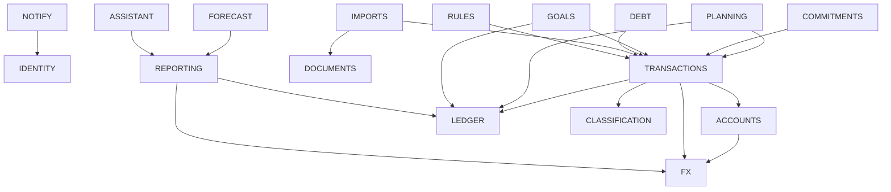

# 05 — Bounded contexts

> **Estado:** Propuesto · **Fecha:** 2026-10-01 · **Relacionado:** [ARCHITECTURE.md](ARCHITECTURE.md) §3, §7 · [04-domain-model.md](04-domain-model.md) · [06-context-map.md](06-context-map.md) · [09-ledger-design.md](09-ledger-design.md) · [11-domain-events.md](11-domain-events.md) · ADR-0002, ADR-0003

Ficha de cada uno de los 18 bounded contexts canónicos (ARCHITECTURE §3). Los nombres, códigos, schemas, paquetes, clasificación DDD y fases son los canónicos; aquí se detallan responsabilidades, límites, API pública, eventos, dependencias y preparación para extracción a microservicio. El detalle de agregados está en [04-domain-model.md](04-domain-model.md).

**Escala de preparación para extracción (ADR-0003):**
- **Alta**: sólo integración async + queries de lectura; sin transacciones BD compartidas. Extraíble con cambio de adapters.
- **Media**: alguna llamada síncrona entrante/saliente reemplazable por API HTTP + eventos con consistencia eventual aceptable.
- **Baja**: participa en invariantes que hoy exigen la misma transacción BD; extraerlo exige sagas/rediseño. No se recomienda extraer.

---

## 1. Visión general

| # | Código | Tipo | Fase | Agregados principales | Extracción |
|---|---|---|---|---|---|
| 1 | IDENTITY | Generic | 1 | User, Workspace | Media |
| 2 | ACCOUNTS | Core | 1 | Account, Institution | Media |
| 3 | LEDGER | Core | 1 | JournalEntry, LedgerAccount | Baja |
| 4 | TRANSACTIONS | Core | 1 | Transaction, Reconciliation, DuplicateCandidate | Baja |
| 5 | CLASSIFICATION | Supporting | 1 | Category, CategoryGroup, Tag, CustomFieldDefinition, Counterparty | Media |
| 6 | PLANNING | Core | 2 | FinancialPeriod, Budget, BudgetTemplate | Media-Baja |
| 7 | COMMITMENTS | Core | 3 | RecurringDefinition, RecurringOccurrence, Subscription | Media |
| 8 | GOALS | Supporting | 4 | SavingsGoal, GoalContribution | Media |
| 9 | DEBT | Core | 4 | Loan, CreditCardProfile, CardStatement | Media |
| 10 | FX | Supporting | 1 / 5 | CurrencyDefinition, ExchangeRate, RateProviderConfig | Alta |
| 11 | DOCUMENTS | Generic | 6 | Document | Alta |
| 12 | IMPORTS | Supporting | 6 | ImportJob, ImportMappingProfile, BankConnection | Alta |
| 13 | RULES | Supporting | 6 | Rule | Alta |
| 14 | REPORTING | Supporting | 1 / 7 | (read models) | Alta |
| 15 | FORECAST | Supporting | 8 | ForecastRun | Alta (ya separado en Python) |
| 16 | NOTIFY | Generic | 2 | Notification, NotificationPreference | Alta |
| 17 | AUDIT | Generic | 1 | AuditLog | Baja (escritura síncrona) |
| 18 | ASSISTANT | Supporting | 10 | Conversation | Alta |

---

## 2. Fichas

### 2.1 IDENTITY — Identity & Workspace (`iam`, `@pf/identity`)
- **Propósito:** saber quién es el usuario y a qué workspaces puede acceder con qué rol.
- **Responsabilidades:** provisionar usuario desde claims OIDC; workspaces y sus settings (moneda base, de reporte, TZ); membresías y roles `OWNER/EDITOR/VIEWER`; decisión de autorización por workspace.
- **NO responsabilidades:** autenticar contraseñas (Keycloak/IdP); emitir tokens (BFF/IdP); RLS (lo aplica `@pf/platform` con el `workspaceId` resuelto).
- **API pública:** cmd `ProvisionUserFromIdentity`, `CreateWorkspace`, `UpdateWorkspaceSettings`, `AddMember`, `ChangeMemberRole`, `RemoveMember`; qry `GetMe`, `ListMyWorkspaces`, `GetWorkspaceSettings`, `AuthorizeAction`.
- **Eventos publicados:** `identity.WorkspaceCreated`, `identity.WorkspaceSettingsChanged`, `identity.MemberAdded`, `identity.MemberRemoved`. **Consumidos:** ninguno.
- **Dependencias:** IdP (OIDC) vía `IdentityProviderPort`; puerto opcional `WorkspaceCreatedHook` (cableado en `apps/api` a la provisión síncrona del catálogo de Classification, ver §2.5).
- **Extracción:** Media — todos consultan `AuthorizeAction` en cada request; extraíble a un IdP/servicio de autorización con caché de membresías en token.

### 2.2 ACCOUNTS (`accounts`, `@pf/accounts`)
- **Propósito:** catálogo de las cuentas e instituciones del usuario.
- **Responsabilidades:** abrir/editar/archivar/cerrar/reactivar cuentas (estados `ACTIVE`, `CLOSED`, `ARCHIVED`); tipo → naturaleza ASSET/LIABILITY; moneda inmutable; liquidez (`LIQUID`, `SEMI_LIQUID`, `ILLIQUID`); instituciones; orden y visibilidad en net worth.
- **NO responsabilidades:** saldos (Ledger); movimientos (Transactions); límites de crédito, cortes y préstamos (Debt); conexiones bancarias (Imports).
- **API pública:** cmd `OpenAccount`, `UpdateAccount`, `ArchiveAccount`, `CloseAccount`, `ReactivateAccount`, `CreateInstitution`, `UpdateInstitution`, `ArchiveInstitution`; qry `GetAccount`, `GetAccountsByIds`, `ListAccounts`, `ListInstitutions`.
- **Eventos publicados:** `accounts.AccountOpened`, `accounts.AccountUpdated`, `accounts.AccountArchived`, `accounts.AccountClosed`, `accounts.AccountReactivated`. **Consumidos:** `identity.WorkspaceCreated` (opcional: cuenta "Efectivo" por defecto).
- **Dependencias:** FX (catálogo de monedas, query), Audit (sync).
- **Extracción:** Media — Transactions consulta Accounts sincrónicamente (moneda, estado); reemplazable por réplica local alimentada por eventos `AccountOpened/Archived`.

### 2.3 LEDGER — Financial Ledger (`ledger`, `@pf/ledger`)
- **Propósito:** registro contable de doble entrada, inmutable y multi-moneda; fuente de verdad de saldos.
- **Responsabilidades:** validar y persistir asientos balanceados por moneda; reversas; plan de cuentas (usuario + sistema por moneda, creadas con *get-or-create* al primer posting); saldo contable y snapshots; bloqueo de periodos mensuales; verificación de integridad. El saldo proyectado (con `pending`) no es del ledger: lo calcula Reporting (FR-LEDGER-013).
- **NO responsabilidades:** clasificación (Transactions/Classification); valoración en moneda de reporte (Reporting); estados de transacción, conciliación (Transactions); decidir cuándo se cierra un mes (Planning).
- **API pública:** port sync `LedgerPostingPort` (`PostJournalEntry`, `ReverseJournalEntry`), `LedgerPeriodLockPort` (`LockPeriod`, `UnlockPeriod`); qry `GetBalance`, `GetBalances`, `GetBalanceHistory`, `GetTrialBalance`, `GetEntriesBySource`.
- **Eventos publicados:** `ledger.JournalEntryPosted`. **Consumidos:** ninguno (todo entra síncrono).
- **Dependencias:** sólo shared-kernel y catálogo de monedas. Es el contexto más "upstream" en invariantes.
- **Extracción:** Baja — su valor es la atomicidad con Transactions. No se extrae.

### 2.4 TRANSACTIONS (`txn`, `@pf/transactions`)
- **Propósito:** registrar y gestionar los movimientos de dinero del usuario como documentos de negocio.
- **Responsabilidades:** todos los `TransactionKind` (ingreso, gasto, splits, transferencias, conversiones con `ConversionDetail`, refunds, ajustes, saldos iniciales, desembolsos/pagos de préstamo); ciclo de estados; traducción a asientos; edición/void con reversa; asignación de clasificación a splits; conciliación; detección de duplicados; emparejamiento de transferencias; bulk edit; ingreso batch idempotente desde Imports.
- **NO responsabilidades:** persistir postings (Ledger); catálogos de categorías/tags (Classification); cronogramas de préstamos (Debt); generación de recurrencias (Commitments); obtención de tasas de mercado (FX); archivos (Documents).
- **API pública:** ver [04 §3.4](04-domain-model.md) (`RecordTransaction`, `RecordTransfer`, `RecordConversion`, … `ApplyClassification`, `ImportTransactions`, `CompleteReconciliation`; qry `ListTransactions`, `GetTransaction`, `GetClearedBalance`, `CountPendingInPeriod`).
- **Eventos publicados:** `transactions.TransactionCreated`, `TransactionUpdated`, `TransactionPosted`, `TransactionVoided`, `TransactionCategorized`, `TransferCompleted`, `TransferRevised`, `ConversionRecorded`, `ConversionRevised` (docs/31 D48), `TransactionCleared`, `ReconciliationCompleted`, `DuplicateDetected`. **Consumidos:** `classification.CategoriesMerged`, `TagsMerged`, `CounterpartiesMerged` (reasignación idempotente).
- **Dependencias:** Ledger (sync, misma tx), Accounts (query), Classification (query), FX (query de referencia), Audit (sync).
- **Extracción:** Baja — forma con Ledger una unidad transaccional.

### 2.5 CLASSIFICATION (`classification`, `@pf/classification`)
- **Propósito:** catálogos con los que el usuario da significado a sus movimientos.
- **Responsabilidades:** categorías (incl. de sistema), grupos, tags, definiciones de custom fields, contrapartes con alias; archivado y fusión.
- **NO responsabilidades:** asignar clasificación a transacciones (Transactions); automatización (Rules); presupuestos por categoría (Planning).
- **API pública:** cmd de CRUD/archivo/merge (ver 04 §3.5); qry `ListCategories`, `GetCategoryTree`, `ValidateClassification`, `ResolveCounterparty`, `ListTags`, `ListCustomFields`, `ListCounterparties`.
- **Eventos publicados:** `classification.CategoryArchived`, `CategoriesMerged`, `TagsMerged`, `CounterpartiesMerged`, `CustomFieldDefinitionChanged`. **Consumidos:** ninguno en Phase 1 (la provisión del catálogo al crear el workspace es síncrona, ver abajo).
- **Provisión del catálogo al crear el workspace (síncrona):** decisión implementada por `add-classification` y **confirmada por el owner el 2026-10-05** ([docs/31 D54](31-phase-1-consolidation-decisions.md)): `ProvisionSystemCategories` (11 categorías de sistema con sus grupos "Finanzas", "Otros gastos" y "Otros ingresos") y, si `seedDefaultCategories = true` (por defecto), `ApplyDefaultCategoryCatalog` (catálogo sugerido versionado, ver [29 §2.4](29-seed-datasets.md#24-catálogo-inicial-de-categorías-sugerido)) corren **en la misma unidad de trabajo que `CreateWorkspace`** —incluido el workspace personal creado por JIT—, no como consumo asíncrono de `identity.WorkspaceCreated`. Motivo: el contrato de `createWorkspace` promete que las categorías existen al responder y Transactions necesita `UNCATEGORIZED` desde la primera transacción. IDENTITY expone el puerto opcional `WorkspaceCreatedHook` y el composition root (`apps/api`) lo cablea a Classification, de modo que IDENTITY no importa CLASSIFICATION. Ambas operaciones son idempotentes. Por docs/31 D52 la provisión escribe **un** registro `classification.catalog.applied` (agregado `CategoryCatalog`, id = workspace, `origin = system`) que respalda el `CREATE` del recorrido de cada categoría creada; si no crea nada (provisión repetida) no escribe nada.
- **Dependencias:** Audit (sync).
- **Extracción:** Media — `ValidateClassification` es síncrono en la escritura de transacciones; reemplazable por réplica local de IDs válidos.

### 2.6 PLANNING — Planning & Budgeting (`planning`, `@pf/planning`)
- **Propósito:** planificar y cerrar el mes.
- **Responsabilidades:** periodos financieros y su ciclo de vida; cierre de mes (checklist, `closeSummary`, bloqueo del ledger); reapertura auditada; presupuestos por categoría/grupo y moneda; plantillas versionadas; actuals derivados; alertas de umbral.
- **NO responsabilidades:** forecasting estadístico (Forecast); compromisos recurrentes (Commitments); reportes generales (Reporting).
- **API pública:** cmd `OpenPeriod`, `ActivatePeriod`, `CloseMonth`, `ReopenPeriod`, `CreateBudget`, `CreateBudgetFromTemplate`, `SetBudgetItem`, `RemoveBudgetItem`, `CreateTemplate`, `PublishTemplateVersion`; qry `GetPeriod`, `ListPeriods`, `GetBudgetVsActual`, `GetCloseChecklist`, `ListTemplates`.
- **Eventos publicados:** `planning.PeriodActivated`, `MonthClosed`, `PeriodReopened`, `BudgetCreated`, `BudgetThresholdReached`. **Consumidos:** `transactions.TransactionPosted`, `TransactionVoided`, `TransactionCategorized`, `TransactionUpdated` (actuals).
- **Dependencias:** Ledger (`LedgerPeriodLockPort` sync, `GetBalances` query), Transactions (query), Audit.
- **Extracción:** Media-Baja — el cierre necesita bloquear el ledger atómicamente.

### 2.7 COMMITMENTS — Recurrence & Subscriptions (`commitments`, `@pf/commitments`)
- **Propósito:** representar lo que el usuario se ha comprometido a pagar/recibir periódicamente.
- **Responsabilidades:** motor de recurrencia; definiciones; generación idempotente de ocurrencias; materialización (crear transacción) o matching con transacciones existentes; suscripciones con historial de precios y renovaciones.
- **NO responsabilidades:** cronogramas de amortización (Debt, aunque una cuota pueda verse en el calendario); persistir transacciones (Transactions); notificar (Notify).
- **API pública:** ver 04 §3.7.
- **Eventos publicados:** `commitments.RecurringOccurrenceGenerated` (batch), `RecurringOccurrenceDue`, `RecurringOccurrenceMaterialized`, `SubscriptionPriceChanged`, `SubscriptionRenewalUpcoming`, `SubscriptionCancelled`. **Consumidos:** `transactions.TransactionCreated` (auto-match), `TransactionVoided` (liberar ocurrencia).
- **Dependencias:** Transactions (sync para materializar), Classification (query), Audit.
- **Extracción:** Media.

### 2.8 GOALS — Savings Goals (`goals`, `@pf/goals`)
- **Propósito:** metas de ahorro y su progreso.
- **Responsabilidades:** metas; aportes reales (vía transferencia) y earmarks; retiros; progreso; detección de meta alcanzada; vigilancia de sobre-asignación de earmarks.
- **NO responsabilidades:** mover dinero por sí mismo (Transactions); saldos (Ledger).
- **API pública:** ver 04 §3.8.
- **Eventos publicados:** `goals.SavingsContributionRecorded`, `GoalReached`, `EarmarkExceedsBalance`. **Consumidos:** `transactions.TransferCompleted` (transferencias manuales a cuentas vinculadas → sugerir/registrar aporte), `TransactionVoided` (anular aporte REAL), `ledger.JournalEntryPosted` (re-evaluar earmarks vs saldo).
- **Dependencias:** Transactions (sync), Ledger (query), Audit.
- **Extracción:** Media.

### 2.9 DEBT — Debt & Credit (`debt`, `@pf/debt`)
- **Propósito:** préstamos y tarjetas de crédito como compromisos amortizables.
- **Responsabilidades:** préstamos, cronogramas (francés/alemán/bullet), desglose de pagos, prepagos, cambios de tasa, morosidad; perfiles de tarjeta (límite, corte, vencimiento), estados de cuenta, pagos.
- **NO responsabilidades:** la cuenta LIABILITY en sí (Accounts); asientos (Ledger vía Transactions).
- **API pública:** ver 04 §3.9.
- **Eventos publicados:** `debt.LoanDisbursed`, `LoanScheduleGenerated`, `LoanPaymentRecorded`, `LoanInstallmentOverdue`, `LoanPaidOff`, `CardStatementIssued`, `CardPaymentDue`. **Consumidos:** `transactions.TransferCompleted` (pago a cuenta de tarjeta/préstamo hecho fuera de Debt), `TransactionVoided`.
- **Dependencias:** Transactions (sync), Accounts (query), Ledger (query), Audit.
- **Extracción:** Media.

### 2.10 FX — FX & Market Data (`fx`, `@pf/fx`)
- **Propósito:** monedas y tasas: catálogo, histórico inmutable y pricing de referencia.
- **Responsabilidades:** catálogo `currency` (kind, scale); tasas manuales (Phase 1) y de proveedores (Phase 5) vía ACL `MarketRateProvider`; resolución de tasas con política; tasa de referencia y spread para conversiones; observaciones de tasa derivadas de conversiones del usuario.
- **NO responsabilidades:** registrar la conversión (Transactions); valorar el patrimonio (Reporting, usando FX).
- **API pública:** cmd `RecordManualRate`, `SupersedeRate`, `FetchRates`, `RegisterCustomCurrency`, `RegisterCommodity`; qry `GetRate`, `GetRateSeries`, `GetReferenceRate`, `ListCurrencies`, `ConvertForValuation`.
- **Eventos publicados:** `fx.RateRecorded`, `fx.RatesFetched`, `fx.CurrencyRegistered`. **Consumidos:** `transactions.ConversionRecorded`.
- **Dependencias:** proveedores externos (ACL).
- **Extracción:** Alta — sólo queries entrantes y eventos.

### 2.11 DOCUMENTS (`documents`, `@pf/documents`)
- **Propósito:** almacenar archivos de forma segura y vincularlos a entidades.
- **Responsabilidades:** presigned upload/download, validación de tipo/tamaño, escaneo, hash, vínculos polimórficos por ID.
- **NO responsabilidades:** OCR/extracción de datos (Imports o futuro); interpretar el contenido financiero.
- **API pública:** cmd `RequestUpload`, `ConfirmUpload`, `LinkDocument`, `UnlinkDocument`, `ArchiveDocument`; qry `GetDownloadUrl`, `ListDocumentsFor`.
- **Eventos publicados:** `documents.AttachmentUploaded`, `AttachmentLinked`, `DocumentQuarantined`. **Consumidos:** ninguno.
- **Dependencias:** `ObjectStorage`, `MalwareScanner`.
- **Extracción:** Alta.

### 2.12 IMPORTS — Imports & Banking Integrations (`imports`, `@pf/imports`)
- **Propósito:** traer movimientos externos (archivos y APIs bancarias) de forma idempotente y revisable.
- **Responsabilidades:** parseo por formato, perfiles de mapeo, staging por fila, fingerprinting, dedupe, revisión, commit batch, conexiones bancarias y sincronización.
- **NO responsabilidades:** decidir categorías (Rules); crear asientos (Transactions/Ledger); guardar archivos (Documents).
- **API pública:** ver 04 §3.12.
- **Eventos publicados:** `imports.ImportCompleted`, `ImportFailed`, `BankSyncCompleted`, `BankConnectionExpired`. **Consumidos:** `documents.AttachmentUploaded` (si el archivo se subió para importar).
- **Dependencias:** Transactions (sync `ImportTransactions`), Documents (query/stream), `BankingProvider` (ACL), Accounts (query).
- **Extracción:** Alta.

### 2.13 RULES — Rules Engine (`rules`, `@pf/rules`)
- **Propósito:** automatizar la clasificación.
- **Responsabilidades:** definición, prioridad y evaluación determinista de reglas; preview; ejecución sobre transacciones nuevas/importadas o retroactiva.
- **NO responsabilidades:** modificar montos/cuentas/fechas/estado; detección de duplicados (Transactions).
- **API pública:** cmd `CreateRule`, `UpdateRule`, `ReorderRules`, `DisableRule`, `RunRules`, `PreviewRule`; qry `ListRules`, `PreviewRuleMatches`.
- **Eventos publicados:** ninguno en v1. **Consumidos:** `transactions.TransactionCreated` (trigger ON_CREATE/ON_IMPORT).
- **Dependencias:** Transactions (`ApplyClassification`, sync desde el handler async), Classification (query).
- **Extracción:** Alta.

### 2.14 REPORTING — Reporting & Analytics (`reporting`, `@pf/reporting`)
- **Propósito:** responder preguntas del usuario sobre su situación financiera.
- **Responsabilidades:** read models (saldos, flujo mensual, gasto por categoría, net worth, calendario de flujo de caja y saldo proyectado, dashboard), valoración multi-moneda, exportaciones. En Phase 1 el resumen del dashboard (`/reports/summary`) se calcula leyendo directamente el ledger y las transacciones, sin read models ([14-reporting.md](14-reporting.md) §2.2).
- **NO responsabilidades:** ser fuente de verdad de nada; escribir en otros contextos.
- **API pública:** qry `GetDashboard`, `GetNetWorth`, `GetCashflowReport`, `GetSpendingByCategory`, `GetCashFlowCalendar`, `ExportReport`; cmd interno `RebuildProjection`.
- **Eventos publicados:** ninguno. **Consumidos:** prácticamente todos los de Transactions, Ledger, Accounts, Commitments, Goals, Debt, Planning, FX.
- **Dependencias:** Ledger, FX (queries).
- **Extracción:** Alta (CQRS natural).

### 2.15 FORECAST (`forecasting`, `@pf/forecasting` ACL + `services/ml-forecasting`)
- **Propósito:** pronósticos estadísticos de gasto/flujo.
- **Responsabilidades:** solicitar corridas, preparar dataset desde Reporting, almacenar resultados versionados, exponerlos.
- **NO responsabilidades:** presupuestos (Planning), escribir datos financieros, estar en el camino crítico.
- **API pública:** cmd `RequestForecast`, `CancelForecast`; qry `GetLatestForecast`, `ListForecastRuns`.
- **Eventos publicados:** `forecast.ForecastGenerated`, `ForecastFailed`. **Consumidos:** `planning.MonthClosed` (disparar recálculo).
- **Dependencias:** servicio Python (ACL HTTP), Reporting (query).
- **Extracción:** Alta.

### 2.16 NOTIFY — Notifications (`notifications`, `@pf/notifications`)
- **Propósito:** avisar al usuario.
- **Responsabilidades:** traducir eventos en notificaciones, preferencias, deduplicación, envío por canal, reintentos, bandeja in-app.
- **NO responsabilidades:** decidir reglas de negocio de alerta (el productor emite el hecho, p. ej. `BudgetThresholdReached`).
- **Eventos consumidos:** `planning.BudgetThresholdReached`, `commitments.RecurringOccurrenceDue`, `SubscriptionRenewalUpcoming`, `SubscriptionPriceChanged`, `debt.LoanInstallmentOverdue`, `CardPaymentDue`, `goals.GoalReached`, `EarmarkExceedsBalance`, `imports.ImportCompleted`, `ImportFailed`, `BankConnectionExpired`, `forecast.ForecastGenerated`.
- **Dependencias:** `NotificationSender` (SMTP/push), Identity (query de destinatarios/preferencias).
- **Extracción:** Alta.

### 2.17 AUDIT (`audit`, `@pf/audit`)
- **Propósito:** evidencia inmutable de quién cambió qué y cuándo.
- **Responsabilidades:** `AuditPort.append` síncrono en la misma transacción; consulta; retención; cadena de hash opcional.
- **NO responsabilidades:** logs técnicos (observabilidad); historial funcional de saldos (Ledger).
- **Eventos:** no consume para datos financieros (sync); puede consumir eventos de seguridad/no financieros si se decide.
- **Extracción:** Baja (por requisito de misma transacción). Alternativa futura: outbox dedicado con garantía de entrega.

### 2.18 ASSISTANT — AI Assistant (`@pf/assistant`, Phase 10)
- **Propósito:** responder preguntas en lenguaje natural sobre las finanzas del usuario.
- **Responsabilidades:** conversación, selección de tools de solo lectura, control de permisos, redacción de PII hacia el LLM.
- **NO responsabilidades:** mutar datos; acceso directo a BD.
- **Dependencias:** `LlmProvider` (ACL), queries públicas de Reporting/Transactions/Planning/Goals/Debt.
- **Extracción:** Alta.

---

## 3. Justificación de las fusiones (ARCHITECTURE §3)

| Fusión | Justificación |
|---|---|
| *Budget Templates* → **Planning** | Una plantilla sólo tiene sentido como origen de un `Budget`; comparten lenguaje (items, categorías, rollover) y ciclo (aplicar al abrir el mes). Separarlas generaría un contexto anémico con acoplamiento conversacional alto. |
| *Recurring Payments* + *Subscriptions* → **Commitments** | Una suscripción es una recurrencia con semántica comercial (precio, trial, cancelación). Compartir el `RecurrenceEngine` y el `OccurrenceMatcher` evita duplicar la parte más delicada (fechas, idempotencia INV-013). |
| *Merchants/Providers* → **Classification** (`Counterparty`) | La contraparte es un eje de clasificación igual que la categoría (alias, categoría por defecto, merge). "Provider" además colisionaba con los providers técnicos (tasas, banca). |
| *Banking Integrations* → **Imports** | Un sync bancario es otra fuente de filas con el mismo pipeline (normalizar, fingerprint, dedupe, revisión, commit). Las diferencias (consentimientos, tokens) quedan detrás del ACL `BankingProvider`. |
| *FX & Crypto Conversion* → **FX** (tasas/pricing) + **Transactions** (movimiento) | El movimiento de dinero debe vivir donde viven las invariantes de cuadre y estado (Transactions + Ledger, misma tx). Las tasas son datos de mercado con otro ciclo de vida (históricos inmutables, proveedores) y alta extraibilidad. Mezclarlos acoplaría el core a proveedores externos. |

## 4. ¿Por qué Transactions y Ledger son contextos separados?

1. **Lenguajes distintos.** Transactions habla el idioma del usuario (gasto, transferencia, split, categoría, pendiente, conciliado); Ledger habla contabilidad (asiento, posting, débito/crédito, cuenta de sistema, FX_TRADING). Mezclarlos filtra conceptos contables a la UI o conceptos de negocio al núcleo contable.
2. **Mutabilidad opuesta.** La transacción es editable (versionada, recategorizable, con estados); el ledger es append-only. Separarlos permite que recategorizar o cambiar notas no toque el ledger (INV-033) y que el ledger tenga reglas de BD estrictas (sin UPDATE/DELETE).
3. **Ledger estable y pequeño.** Las reglas del ledger (cuadre por moneda, reversa, periodos) casi no cambian; Transactions crecerá mucho (duplicados, bulk edit, imports, nuevos kinds). Un núcleo pequeño es más fácil de verificar con PBT.
4. **Múltiples productores futuros.** Hoy sólo Transactions postea, pero el `LedgerPostingPort` es un contrato explícito (p. ej. futuros ajustes técnicos) con validación central.
5. **Coste controlado.** Ambos viven en el mismo proceso y la misma transacción BD (ARCHITECTURE §7); separar no introduce consistencia eventual. El precio es un traductor (`TransactionPostingTranslator`) y la invariante INV-024 (legs = postings), cubierta por PBT.

Alternativa rechazada: un único contexto "Transactions+Ledger" — más simple al inicio, pero el ledger inmutable quedaría expuesto a la complejidad de edición y a cambios frecuentes del modelo de negocio.

## 5. Dependencias entre contextos (resumen)

Flechas = dependencia de código (`A` usa `contracts` de `B`). Prohibidos ciclos entre paquetes de contexto (dependency-cruiser). Las reacciones inversas (p. ej. Goals reaccionando a `TransferCompleted`) son por eventos, sin dependencia de código. Detalle de patrones en [06-context-map.md](06-context-map.md).

## Preguntas abiertas

1. ¿Audit debe aceptar en el futuro entrega vía outbox dedicado (mejor extraibilidad) manteniendo la garantía de "no hay mutación sin audit"?
2. ¿Credit cards necesitan un contexto propio si crecen (rewards, cuotas sin interés tipo "diferidos")? Por ahora en Debt.
3. ¿Planning debería consumir `ledger.JournalEntryPosted` en lugar de eventos de Transactions para los actuals? Propuesto: eventos de Transactions (llevan splits/categorías).
4. La orquestación "abrir cuenta + saldo inicial" en una misma unidad de trabajo vive en la capa de composición (`apps/api`), no en un contexto; validar con SPIKE-04.
