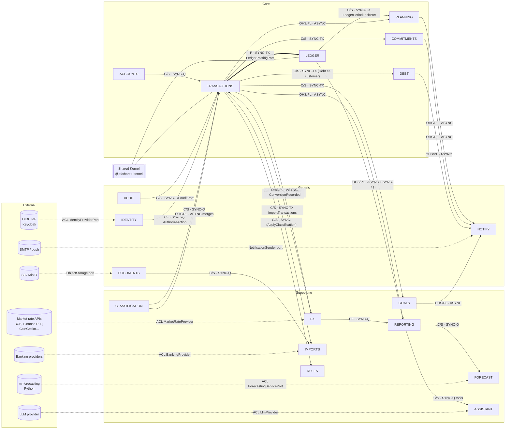

# 06 — Context map (DDD)

> **Estado:** Propuesto · **Fecha:** 2026-10-01 · **Relacionado:** [ARCHITECTURE.md](ARCHITECTURE.md) §3, §7 · [05-bounded-contexts.md](05-bounded-contexts.md) · [04-domain-model.md](04-domain-model.md) · [11-domain-events.md](11-domain-events.md) · [07-c4-architecture.md](07-c4-architecture.md) · ADR-0003, ADR-0008, ADR-0017, ADR-0021

Mapa de relaciones entre los 18 bounded contexts y los sistemas externos, con el patrón DDD de cada relación y su modo de integración.

## 1. Patrones usados

| Patrón | Significado en este proyecto |
|---|---|
| **Shared Kernel (SK)** | `@pf/shared-kernel` (Money, Currency, IDs, Clock, DomainEvent). Cambios por ADR. Compartido por todos. |
| **Customer/Supplier (C/S)** | El upstream (supplier) expone un contrato en `contracts` pensado para las necesidades del downstream (customer); se negocian cambios. |
| **Conformist (CF)** | El downstream adopta el modelo del upstream tal cual (sin traducción). |
| **Anti-Corruption Layer (ACL)** | El downstream traduce un modelo ajeno (externo) a su lenguaje; nada del modelo externo cruza el puerto. |
| **Open Host Service / Published Language (OHS/PL)** | El upstream publica un protocolo estable para muchos consumidores: eventos JSON Schema versionados (`contracts/events`) y queries públicas. |
| **Partnership (P)** | Dos contextos evolucionan coordinadamente porque comparten una invariante (cambian juntos). |

Modos de integración: **SYNC-TX** = llamada en proceso dentro de la **misma transacción BD** (sólo donde una invariante lo exige, ARCHITECTURE §7); **SYNC-Q** = query de lectura en proceso (sin requerir misma transacción); **ASYNC** = evento vía transactional outbox, at-least-once, consumidor idempotente.

## 2. Mapa



Convención de flechas: **upstream → downstream** (el downstream depende del upstream). Ej.: `TX → DB` = Debt (downstream) usa la API de Transactions (upstream) para crear transacciones; `LG → PL` = Planning usa el puerto de bloqueo del Ledger.

## 3. Tabla de relaciones

| # | Upstream | Downstream | Patrón | Modo | Justificación |
|---|---|---|---|---|---|
| 1 | Shared Kernel | Todos | SK | código | Money/Currency/IDs deben ser idénticos en todo el sistema; divergir sería un bug financiero. |
| 2 | LEDGER | TRANSACTIONS | **Partnership** (+ C/S) | SYNC-TX | INV-004/023/024 exigen que transacción y asiento se confirmen juntos. Evolucionan coordinadamente (el translator depende del plan de cuentas). |
| 3 | ACCOUNTS | TRANSACTIONS | C/S | SYNC-Q | Transactions necesita moneda, naturaleza y estado de la cuenta para validar; Accounts expone `GetAccountsByIds` a su medida. |
| 4 | CLASSIFICATION | TRANSACTIONS | C/S | SYNC-Q | Validar IDs de categoría/tags/custom fields al escribir (INV-019). |
| 5 | CLASSIFICATION | TRANSACTIONS | OHS/PL | ASYNC | `CategoriesMerged`/`TagsMerged`/`CounterpartiesMerged` → reasignación idempotente; no necesita atomicidad (el origen archivado sigue existiendo). |
| 6 | FX | TRANSACTIONS | C/S | SYNC-Q | Tasa de referencia al registrar una conversión (opcional; si no hay, `referenceRate=null`). |
| 7 | TRANSACTIONS | FX | OHS/PL | ASYNC | `ConversionRecorded` → FX guarda observación de tasa del usuario (útil para P2P USDT/BOB). |
| 8 | TRANSACTIONS | DEBT | C/S | SYNC-TX | Desembolso/pago de préstamo y pago de tarjeta: la cuota marcada como pagada y la transacción deben confirmarse juntas (INV-016). As-built `add-loans`: Debt llama a `LoanTransactionsPort` (`recordDisbursement`, `recordPayment`, `voidManaged`) dentro de su UoW y las transacciones `LOAN_*` quedan administradas (`TRANSACTION_MANAGED_EXTERNALLY`). |
| 9 | TRANSACTIONS | GOALS | C/S | SYNC-TX | Aporte REAL = transferencia + `GoalContribution` atómicos (INV-018). |
| 10 | TRANSACTIONS | COMMITMENTS | C/S | SYNC-TX | Materializar ocurrencia = crear transacción + marcar ocurrencia atómicamente (INV-013). |
| 11 | TRANSACTIONS | IMPORTS | C/S | SYNC-TX (por lote) | `ImportTransactions` batch con fingerprints; fila marcada `IMPORTED` en la misma tx (INV-014). |
| 12 | TRANSACTIONS | RULES | C/S | ASYNC trigger + SYNC comando | Rules reacciona a `TransactionCreated` (async) y aplica `ApplyClassification` (sync dentro de su handler). |
| 13 | TRANSACTIONS | DEBT / GOALS / COMMITMENTS | OHS/PL | ASYNC | `TransferCompleted`, `TransactionCreated`, `TransactionVoided` para matching/reconciliación de compromisos hechos fuera de esos contextos. |
| 14 | LEDGER | PLANNING | C/S | SYNC-TX | `LedgerPeriodLockPort`: cerrar mes y bloquear ledger en la misma tx (INV-015). **Requiere ampliar ARCHITECTURE §7.** |
| 15 | TRANSACTIONS | PLANNING | OHS/PL | ASYNC | Actuals de presupuesto y thresholds (eventual, INV-034). |
| 16 | TRANSACTIONS, LEDGER, ACCOUNTS, COMMITMENTS, GOALS, DEBT, PLANNING | REPORTING | OHS/PL | ASYNC (+ SYNC-Q a Ledger) | Proyecciones CQRS reconstruibles; Reporting es conformista con el lenguaje publicado. |
| 17 | FX | REPORTING | Conformist | SYNC-Q | Reporting usa `RateResolver` tal cual para valorar. |
| 18 | AUDIT | Todos los contextos que mutan | C/S | SYNC-TX | ARCHITECTURE §7: audit en la misma transacción (INV-029). |
| 19 | IDENTITY | Todos | Conformist | SYNC-Q | Autorización por workspace; nadie redefine roles. |
| 20 | DOCUMENTS | IMPORTS, TRANSACTIONS, DEBT | C/S | SYNC-Q / referencias por ID | Vínculos por ID; Imports lee el archivo vía puerto. |
| 21 | PLANNING, COMMITMENTS, DEBT, GOALS, IMPORTS, FORECAST | NOTIFY | OHS/PL | ASYNC | Notify sólo traduce hechos publicados a mensajes. |
| 22 | REPORTING | FORECAST | C/S | SYNC-Q | Dataset de entrenamiento/inferencia. |
| 23 | REPORTING (+ queries públicas) | ASSISTANT | C/S | SYNC-Q | Tools de solo lectura (ADR-0021). |
| 24 | Market rate APIs | FX | **ACL** | HTTP (job) | Ver §4.1. |
| 25 | Banking providers | IMPORTS | **ACL** | HTTP (job) | Ver §4.2. |
| 26 | ml-forecasting | FORECAST | **ACL** | HTTP | Ver §4.3. |
| 27 | LLM provider | ASSISTANT | **ACL** | HTTP | Ver §4.4. |
| 28 | OIDC IdP | IDENTITY | ACL | OIDC | Claims → `User`; el modelo del IdP no entra al dominio. |
| 29 | ACCOUNTS | DEBT | C/S | SYNC-TX | `AccountProvisioningPort.openAccount`: Debt abre la cuenta `LOAN` del préstamo en su propia UoW (as-built `add-loans`); Accounts sigue siendo dueño del agregado y de sus validaciones. |
| 30 | COMMITMENTS | DEBT | C/S | SYNC-TX | `RecurringDefinitionPort` (`createManaged`, `settle`, `unsettle`, `setExpected`, `end`, `revise`): las cuotas del préstamo son ocurrencias de una definición administrada (`managedBy = DEBT`, `kind = LOAN_PAYMENT`) que Debt resuelve en la misma UoW; COMMITMENTS no depende de DEBT (pagar desde Recurrentes redirige al formulario del préstamo, D162). |
| 31 | TRANSACTIONS | DEBT | C/S | SYNC-TX | Lectura (as-built `add-credit-cards`): `AccountMovementsQuery` (movimientos de la cuenta de tarjeta por fecha y clase), `PendingFlowQuery` (compras pendientes) y `TransactionLinkQuery` (validar la compra de un plan de cuotas). Debt no crea transacciones de tarjeta: el pago es la transferencia del usuario o la del plan de pago que materializa el motor. |

### 3.1 Composición "abrir cuenta con saldo inicial"

Accounts no depende de Transactions (evita ciclo). El endpoint `POST /accounts` con `openingBalance` se implementa en la **capa de composición** (`apps/api`) dentro de una unidad de trabajo: `Accounts.OpenAccount` → `Transactions.RecordOpeningBalance` (que crea el `LedgerAccount` vía get-or-create). Es orquestación de aplicación, no una relación de dominio.

## 4. Anti-Corruption Layers

### 4.1 `MarketRateProvider` (FX)

```ts
interface MarketRateProvider {                     // puerto en @pf/fx/application
  readonly code: string;                           // 'BCB_OFFICIAL' | 'BINANCE_P2P' | 'COINGECKO' | …
  supportedPairs(): Promise<CurrencyPair[]>;
  fetch(req: { pairs: CurrencyPair[]; at?: Instant }): Promise<Result<RateQuote[], ProviderError>>;
}
interface RateQuote { base: CurrencyCode; quote: CurrencyCode; value: string; rateType: 'MID'|'BUY'|'SELL'|'P2P'|'OFFICIAL'; asOf: Instant; providerRef?: string }
```
Traducciones del ACL: símbolos del proveedor → `CurrencyCode` del catálogo (`USDT_TRC20` → `USDT`); números a **string decimal** (nunca float del JSON externo: parse con `JSON` de texto crudo o lib de big numbers); timestamps a UTC; orientación del par; agregación (p. ej. mediana de N anuncios P2P). Resiliencia: timeouts, retries con backoff, circuit breaker, rate limits; un fallo de proveedor **nunca** bloquea el registro manual. Tests: contract tests con fixtures grabadas por proveedor.

### 4.2 `BankingProvider` (Imports)

```ts
interface BankingProvider {
  readonly code: string;
  startConsent(input): Promise<ConsentRedirect>;
  completeConsent(callback): Promise<ConnectionTokensRef>;   // tokens → SecretStore, nunca BD en claro
  listAccounts(conn): Promise<ExternalAccount[]>;
  fetchTransactions(conn, accountRef, since: LocalDate): Promise<ExternalTransaction[]>;
}
```
Traduce `ExternalTransaction` → `StagedTransaction` (monto string + moneda, fecha de negocio en TZ del workspace, descripción normalizada, `externalId` para fingerprint). Signos y estados (`booked/pending`) del proveedor → `posted/pending`. Ningún tipo del proveedor sale del adapter.

### 4.3 ML service (Forecast)

`ForecastingServicePort.run(request: ForecastRequestDTO) → ForecastResponseDTO`. El contrato HTTP (OpenAPI propio del servicio Python) usa montos string y series agregadas **sin PII** (sin descripciones, sólo categoría/fecha/monto). El ACL valida respuesta (esquema, horizonte, NaN/inf rechazados), convierte a `Money` y etiqueta `modelVersion`. Timeouts y fallback: si el servicio no responde, `ForecastRun` → `FAILED`; el core sigue funcionando.

### 4.4 LLM provider (Assistant)

`LlmProvider.complete({messages, tools}) → {text, toolCalls}`. El ACL: aísla SDKs del proveedor; aplica redacción de PII (números de cuenta, emails) antes de enviar; mapea tool calls a un **catálogo cerrado** de queries de solo lectura; valida argumentos con schema; limita tokens/costo; registra invocaciones. Prompt injection desde datos del usuario (descripciones) se trata como dato, nunca como instrucción para ejecutar comandos (no existen tools de escritura).

## 5. Reglas de evolución

- Cambios en contratos C/S: el downstream abre un cambio OpenSpec; el upstream mantiene compatibilidad hacia atrás dentro de la versión.
- Cambios en Published Language (eventos): reglas de [11-domain-events.md §4](11-domain-events.md).
- Nueva relación SYNC-TX: requiere ADR (rompe extraibilidad) y actualizar ARCHITECTURE §7.

## Preguntas abiertas

1. Formalizar en ARCHITECTURE §7 las relaciones SYNC-TX adicionales: `Planning → Ledger` (period lock) e `Imports → Transactions` (batch).
2. ¿Rules debe aplicarse **sincrónicamente** durante el commit de un import (clasificación visible al terminar) en lugar de async? Propuesto: async con UI que muestra "aplicando reglas…".
3. Proveedores concretos de tasas para BOB/USDT (BCB oficial, referenciales de mercado) — decisión en Phase 5.
