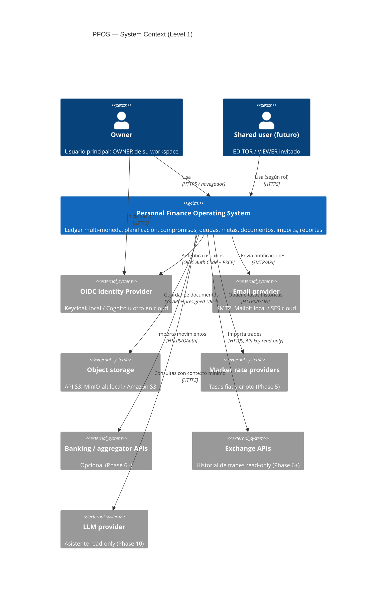
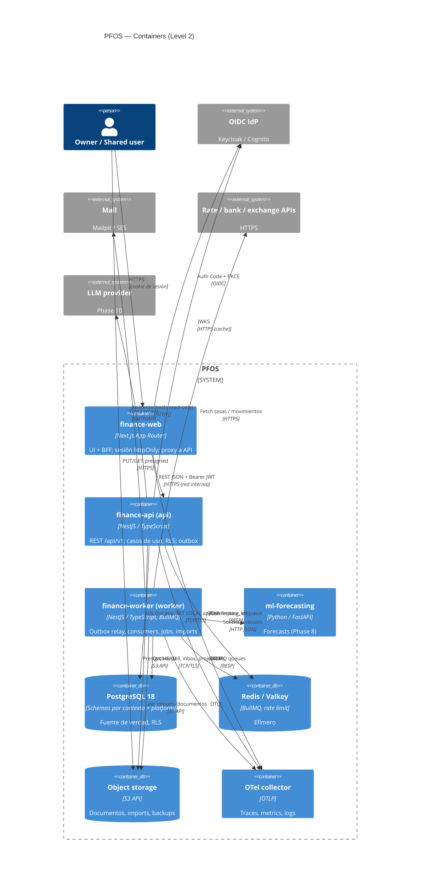
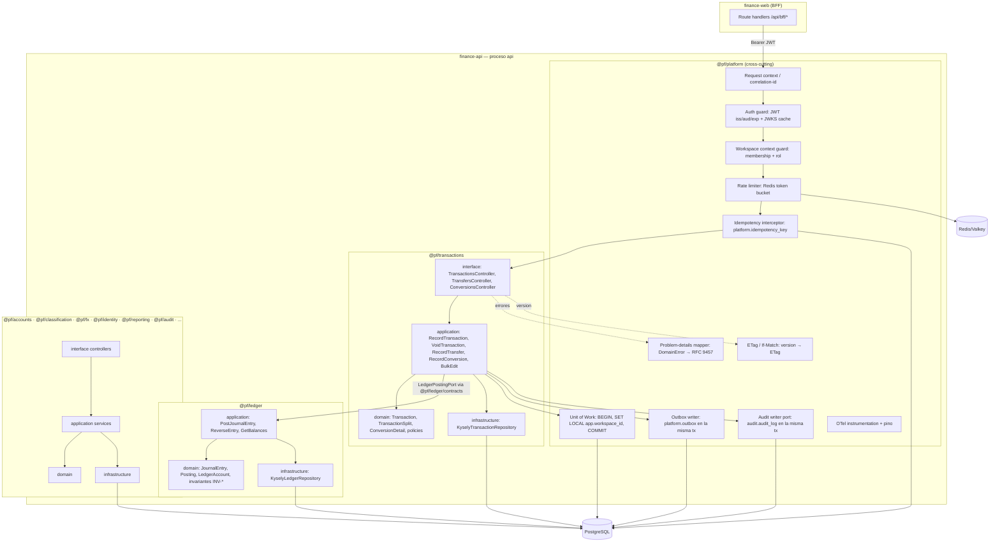
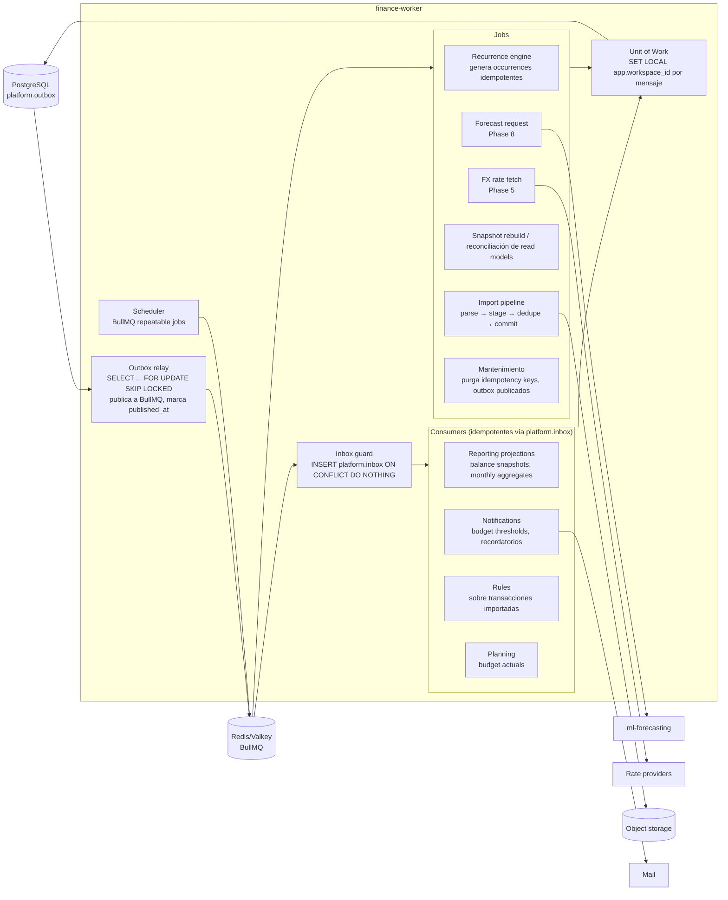
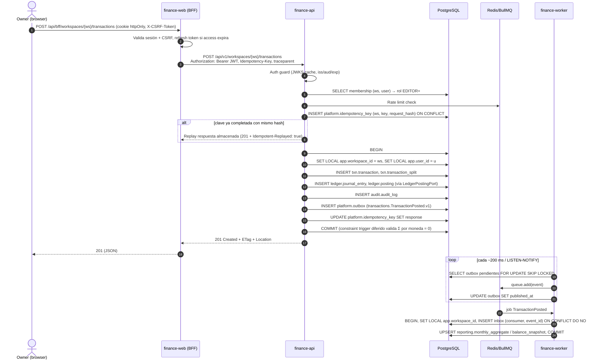
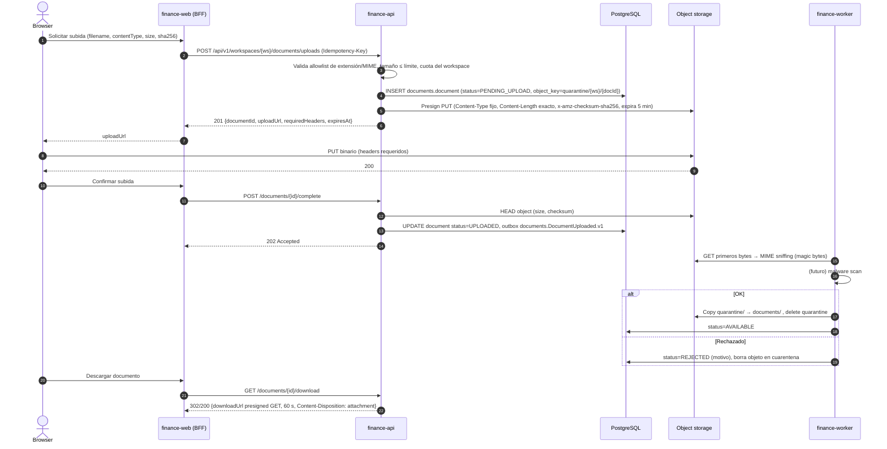
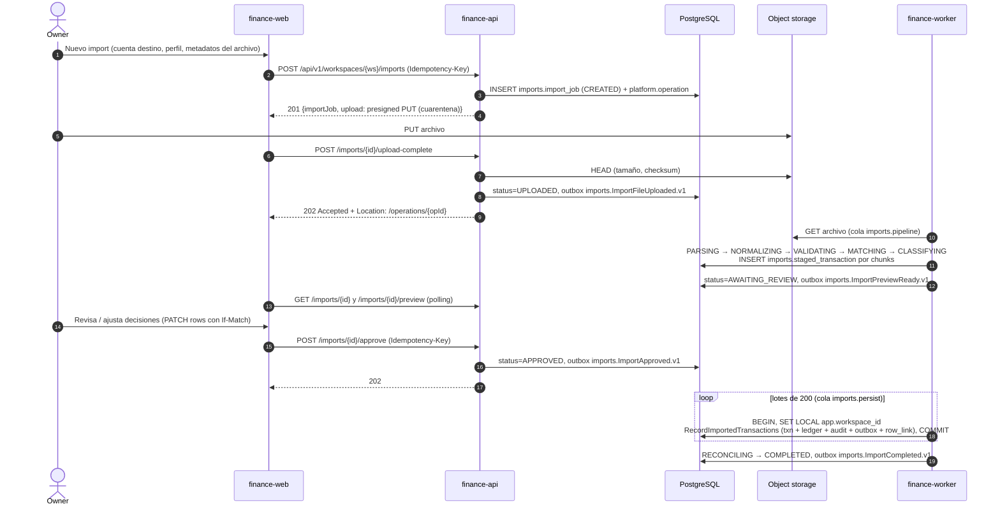
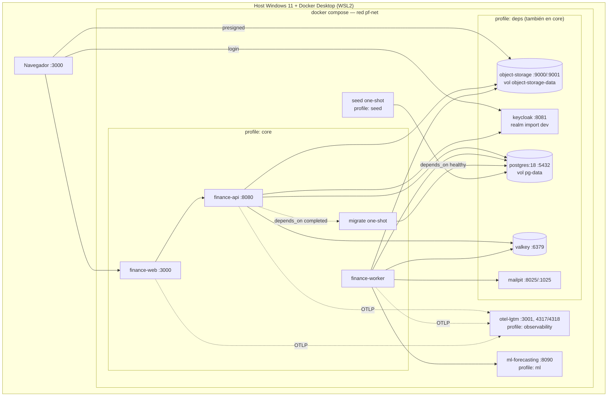
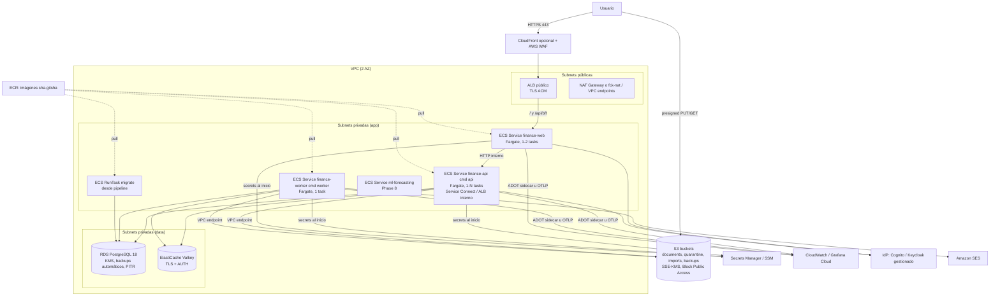

# 07 — Arquitectura C4 (Context, Container, Component, Runtime, Deployment)

> **Estado:** Propuesto · **Fecha:** 2026-10-01 · **Relacionado:** [ARCHITECTURE.md](ARCHITECTURE.md) · [05-bounded-contexts.md](05-bounded-contexts.md) · [06-context-map.md](06-context-map.md) · [08-data-model.md](08-data-model.md) · [09-ledger-design.md](09-ledger-design.md) · [10-api-design.md](10-api-design.md) · [11-domain-events.md](11-domain-events.md) · [12-security.md](12-security.md) · [19-local-development.md](19-local-development.md) · [20-container-strategy.md](20-container-strategy.md) · [21-cloud-deployment-options.md](21-cloud-deployment-options.md) · [22-infrastructure.md](22-infrastructure.md) · [18-observability.md](18-observability.md) · [13-import-architecture.md](13-import-architecture.md) · ADR-0002, ADR-0003, ADR-0008, ADR-0009, ADR-0010, ADR-0011, ADR-0013, ADR-0019, ADR-0020, ADR-0023

Este documento describe la arquitectura de PFOS con el modelo **C4** (Level 1 Context, Level 2 Container, Level 3 Component), complementado con diagramas de **runtime** (secuencias clave), **deployment** (local y cloud) y **quality attribute scenarios**. Es consistente con [ARCHITECTURE.md](ARCHITECTURE.md): Modular Monolith (`finance-api` con procesos `api` y `worker` desde una misma imagen), contextos con schema PostgreSQL propio, outbox transaccional, Next.js como BFF, RLS como defense-in-depth.

> Nota de notación: se usa la sintaxis Mermaid `C4Context` / `C4Container` / `C4Component` / `C4Deployment` donde el renderizado es razonable; para diagramas densos se usan `flowchart` con la misma semántica (persona, sistema, contenedor, componente, relación etiquetada con tecnología).

---

## 1. Level 1 — System Context

### 1.1 Actores y sistemas externos

| Elemento | Tipo | Descripción | Fase |
|----------|------|-------------|------|
| **Owner** | Persona | Usuario principal; registra transacciones, conversiones, planifica, revisa reportes. Rol `OWNER` de su workspace. | 1 |
| **Shared user (futuro)** | Persona | Miembro invitado a un workspace (pareja, contador) con rol `EDITOR` o `VIEWER`. | 9+ (modelo listo desde 1) |
| **OIDC Identity Provider** | Sistema externo | Keycloak local; en cloud Cognito / Keycloak gestionado / otro (ADR-0013, ADR-0010). Emite tokens OIDC. | 1 |
| **Email provider** | Sistema externo | SMTP (Mailpit local; SES u otro en cloud). Alertas de presupuesto, recordatorios de compromisos. | 2 |
| **Object storage** | Sistema externo/infra | API S3 (MinIO/alternativa local, S3 en cloud). Documentos, comprobantes, archivos de import, backups. | 6 (backups antes) |
| **Market rate providers** | Sistema externo | Tasas fiat/cripto (p. ej. APIs públicas de tipo de cambio, agregadores cripto). Solo lectura. | 5 |
| **Banking / aggregator APIs** | Sistema externo | Integraciones bancarias opcionales (aggregators, open banking donde exista). El producto funciona sin ellas. | 6+ |
| **Exchange APIs** | Sistema externo | Exchanges cripto/P2P para importar historial de operaciones (solo lectura, API keys read-only). | 6+ |
| **LLM provider** | Sistema externo | Proveedor de modelo de lenguaje para el asistente de solo lectura. | 10 |

### 1.2 Diagrama

**Fronteras de confianza:** el navegador solo habla con `finance-web` (mismo origen); jamás recibe access tokens ni credenciales de terceros. Todas las integraciones externas son **salientes** desde el worker (o `finance-api` para presigned URLs); no hay webhooks entrantes en esta etapa (ver [10-api-design.md](10-api-design.md) §14).

---

## 2. Level 2 — Containers

### 2.1 Inventario

| Container | Tecnología | Responsabilidad | Escala / estado | Fase |
|-----------|-----------|-----------------|-----------------|------|
| `finance-web` | Next.js (App Router), TypeScript, TanStack Query, ECharts | UI + **BFF**: flujo OIDC, sesión en cookie httpOnly, proxy autenticado a `finance-api` (agrega `Authorization: Bearer`), server components para lecturas | Stateless (sesión cifrada en cookie o store Redis) | 1 |
| `finance-api` (cmd `api`) | NestJS en composition root; módulos `@pf/<ctx>` | REST `/api/v1`, validación JWT, autorización por workspace, casos de uso, transacciones BD con RLS, escritura de outbox y audit en la misma transacción | Stateless, N réplicas | 1 |
| `finance-worker` (cmd `worker`) | Misma imagen que `finance-api` | Outbox relay → BullMQ; consumidores de eventos (projections Reporting, Notifications, Rules, Budget thresholds); jobs programados (recurrence, fx fetch, snapshots); import pipeline | Stateless, 1..N réplicas (relay con lock) | 1 |
| `migrate` (one-shot) | Misma imagen, cmd `migrate` (dbmate) | Aplica migraciones SQL-first con rol de migración | Job | 1 |
| PostgreSQL 18 | RDS en cloud | Fuente de verdad; un schema por contexto + `platform`; RLS | Stateful | 1 |
| Redis / Valkey | ElastiCache/Valkey en cloud | Colas BullMQ, rate limiting, cache efímera; **nunca** fuente de verdad | Semi-stateful (reconstruible) | 1 |
| Object storage | S3 API | Documentos, archivos de import, exports, backups | Stateful | 6 (backups 1) |
| IdP | Keycloak (local) / Cognito u otro | Identidades, login, MFA | Externo/gestionado | 1 |
| Mail | Mailpit / SES | Entrega de emails | Externo | 2 |
| `ml-forecasting` | Python + FastAPI + Polars + statsmodels | Forecasts estadísticos; consume datasets agregados, devuelve predicciones | Stateless | 8 |
| OTel collector | `grafana/otel-lgtm` local / ADOT o Grafana Cloud | Recibe traces, metrics, logs OTLP | Infra | 1 (opcional) |

### 2.2 Diagrama

### 2.3 Decisiones de nivel container

- **Un deployable de backend, dos procesos** (ARCHITECTURE §2): `api` y `worker` comparten imagen y código; se diferencian por comando (`node dist/main.api.js` / `node dist/main.worker.js`). Escalan y fallan de forma independiente.
- **El navegador no habla con `finance-api` directamente.** El BFF (`finance-web`) es el único cliente HTTP de la API en Phase 1–9. Esto evita CORS, mantiene el token fuera del JS y permite que `finance-api` no sea público (cloud: ALB interno o service discovery; ver §6.2).
- **Excepción controlada:** subida/descarga de documentos va **directo** del navegador al object storage mediante **presigned URLs** de corta vida (§4.2), para no pasar binarios por BFF ni API.
- **`ml-forecasting` no está en el camino crítico**: el worker lo invoca de forma asíncrona; si está caído, los forecasts quedan en estado `FAILED`/`STALE` y el resto del producto sigue funcionando.
- **Redis no es fuente de verdad**: si se pierde, el outbox (en PostgreSQL) re-publica lo no despachado; las colas se re-hidratan.

---

## 3. Level 3 — Components

### 3.1 `finance-api` (proceso `api`)

Cada bounded context es un paquete `@pf/<ctx>` con capas `domain → application → infrastructure / interface` y una superficie pública `contracts`. El composition root (`apps/api/src/main.api.ts`) registra los módulos Nest de **interface** e **infrastructure**; `domain` y `application` son TypeScript puro.

**Componentes de plataforma (`@pf/platform`):**

| Componente | Responsabilidad | Notas |
|-----------|-----------------|-------|
| Request context | Genera/propaga `correlationId` (header `X-Request-Id` / `traceparent`), actor, workspace | `AsyncLocalStorage` |
| Auth guard | Valida JWT del IdP (firma vía JWKS cacheado, `iss`, `aud`, `exp`, `nbf`, `azp`), resuelve `userId` interno (`iam.user` por `sub`+`issuer`) | Ver [12-security.md](12-security.md) §3 |
| Workspace context guard | Lee `{workspaceId}` de la ruta, verifica membership activa y rol requerido por la operación (`@RequiresRole('EDITOR')`) | 403 `WORKSPACE_ACCESS_DENIED` si no es miembro activo (ADR-0010); 403 `INSUFFICIENT_ROLE` si el rol no alcanza |
| Rate limiter | Token bucket por usuario y por workspace en Redis; headers `RateLimit-*` | Degrada a *fail-open* con log si Redis cae (solo lectura) / *fail-closed* en endpoints de auth |
| Idempotency interceptor | Para POST financieros: reserva `(workspace_id, key)`, compara hash de request, devuelve respuesta almacenada en replays | Ver [10-api-design.md](10-api-design.md) §7 |
| Unit of Work | Abre transacción Kysely, ejecuta `SET LOCAL app.workspace_id`, `app.user_id`, `app.request_id`; commit/rollback; expone `tx` a repositorios | Una tx por comando |
| Outbox writer | Inserta eventos de dominio en `platform.outbox` dentro de la tx del UoW | Envelope de ARCHITECTURE §7 |
| Audit writer | Inserta `audit.audit_log` en la misma tx (requisito de integridad, ARCHITECTURE §7) | Puerto `AuditPort` de `@pf/audit/contracts` |
| Problem-details mapper | Exception filter Nest: `DomainError(code)` → `application/problem+json` con `type`, `code`, `status`, `errors[]` | Catálogo en [10-api-design.md](10-api-design.md) §9 |
| ETag / If-Match | `ETag: W/"<version>"`; valida `If-Match` en PATCH/acciones; 412/428 | Optimistic locking columna `version` |
| Observability | OTel SDK (HTTP, pg, ioredis, BullMQ), pino JSON con redacción | ADR-0020, [18-observability.md](18-observability.md) |

**Reglas de dependencia** (verificadas con dependency-cruiser, ARCHITECTURE §6): `interface → application → domain`; `infrastructure → application/domain` (implementa puertos); cruce entre contextos **solo** vía `@pf/<ctx>/contracts`. La llamada `Transactions → Ledger` es síncrona en la misma transacción BD porque la invariante de doble entrada lo exige (ARCHITECTURE §7).

### 3.2 `finance-worker` (proceso `worker`)

- El **relay** usa `FOR UPDATE SKIP LOCKED` en lotes; varias réplicas del worker pueden correr sin duplicar trabajo (y si duplican, el inbox lo absorbe — at-least-once).
- **Todo** handler abre su propio Unit of Work con `SET LOCAL app.workspace_id = <envelope.workspaceId>`; el worker usa el mismo rol de app sin `BYPASSRLS`. Los jobs de mantenimiento cross-workspace (purga de outbox/idempotency) operan solo sobre tablas `platform` sin RLS de negocio o usan un rol `pf_maintenance` restringido (ver [12-security.md](12-security.md) §6).
- **Graceful shutdown**: SIGTERM → dejar de tomar jobs, terminar en curso (timeout 25 s < `stopTimeout` de ECS 30 s), cerrar pool.
- **Dead letter**: tras N reintentos con backoff exponencial, BullMQ mueve a cola `dlq.<consumer>`; métrica + alerta.

---

## 4. Runtime — secuencias clave

### 4.1 Request autenticado: BFF → API → transacción con RLS → outbox → worker

Caso: el owner registra un gasto (`POST /api/v1/workspaces/{ws}/transactions`).

Puntos clave: (1) audit, outbox e idempotency se escriben **en la misma transacción** que el cambio; (2) si el constraint trigger de balance falla, el `COMMIT` aborta todo y la API responde `422 LEDGER_UNBALANCED_ENTRY` (no debería ocurrir: el dominio valida antes; el trigger es la red de seguridad); (3) el relay puede despertar por `LISTEN/NOTIFY` además de polling.

### 4.2 Subida de documento con presigned URL (Phase 6)

### 4.3 Import job (alto nivel, Phase 6; CSV básico puede adelantarse a Phase 3)

Detalle completo (máquina de estados, colas, fingerprints) en [13-import-architecture.md](13-import-architecture.md); aquí solo la vista de containers.

Idempotencia: a nivel fila, `imports.row_link UNIQUE (workspace_id, account_id, fingerprint) WHERE status='ACTIVE'`; a nivel proveedor, `external_id` único por cuenta en `txn`; a nivel lote, `Idempotency-Key = (jobId, batchNo)` (ver [08-data-model.md](08-data-model.md) §5.12).

---

## 5. Vista de módulos por fase

| Fase | Módulos activos en `finance-api` | Consumers/jobs del worker |
|------|----------------------------------|---------------------------|
| 1 | identity, accounts, ledger, transactions, classification, fx (manual), reporting (básico), audit | outbox relay, reporting projections |
| 2 | + planning, notifications | budget actuals, budget thresholds, email |
| 3 | + commitments | recurrence engine (+ CSV import básico opcional) |
| 4 | + goals, debt | installment generation |
| 5 | fx providers | fx rate fetch |
| 6 | + documents, imports, rules | import pipeline, rules, MIME sniffing |
| 7 | reporting avanzado | net worth, cash-flow calendar projections |
| 8 | + forecasting (ACL) | forecast request → `ml-forecasting` |
| 10 | + assistant | — |

---

## 6. Deployment

### 6.1 Local (Docker Compose)

Servicios y profiles canónicos de ARCHITECTURE §10; detalle operativo en [19-local-development.md](19-local-development.md) y [20-container-strategy.md](20-container-strategy.md).

Notas: los hostnames son nombres de servicio Compose (sin `localhost` hardcodeado); para que presigned URLs y redirects OIDC funcionen desde el navegador, el *public endpoint* de storage y el issuer de Keycloak se configuran con hostname alcanzable desde host y contenedores (p. ej. `*.localhost` o `host.docker.internal`) — punto a cerrar en SPIKE-06/07.

### 6.2 Cloud target — AWS ECS/Fargate (ADR-0013)

Recomendación canónica: ECS/Fargate con perfil de costo mínimo. Alternativas (Cloud Run, Lightsail/VM única, Fly.io…) y costos en [21-cloud-deployment-options.md](21-cloud-deployment-options.md); IaC en [22-infrastructure.md](22-infrastructure.md).

- `finance-api` **no** se expone a Internet: solo `finance-web` es público (ALB). Si en el futuro hay clientes móviles, se agrega una ruta `/api/*` en el ALB con el mismo JWT (decisión diferida).
- Costo mínimo: 1 task por servicio, Fargate Spot para worker en staging, RDS `db.t4g.micro/small` single-AZ en staging, Multi-AZ opcional en prod; NAT gateway es el costo fijo más alto → evaluar `fck-nat` o VPC endpoints (SPIKE-09).
- Misma imagen en todos los entornos (tag inmutable por digest), configuración vía env + Secrets Manager (ARCHITECTURE §11).

---

## 7. Quality attribute scenarios

| ID | Atributo | Estímulo | Entorno | Respuesta | Medida |
|----|----------|----------|---------|-----------|--------|
| QAS-01 | Integridad (NFR-DATA) | Bug en caso de uso intenta persistir una entry desbalanceada en USDT | Producción | Constraint trigger diferido aborta el `COMMIT`; API responde 500/422 con `LEDGER_UNBALANCED_ENTRY`; alerta | 0 entries desbalanceadas en BD (query de verificación diaria = 0 filas) |
| QAS-02 | Seguridad / aislamiento (NFR-SEC) | Usuario autenticado manipula `workspaceId` en la URL a uno ajeno | Normal | Guard responde 403 `WORKSPACE_ACCESS_DENIED`; aunque el guard fallara, RLS devuelve 0 filas | 0 filas filtradas en suite de tests cross-workspace; 100 % de tablas de negocio con RLS (test automático sobre `pg_class.relrowsecurity`) |
| QAS-03 | Fiabilidad (NFR-REL) | Cliente reintenta `POST /transactions` por timeout de red | Red inestable | Mismo `Idempotency-Key` → replay de la respuesta original | 0 transacciones duplicadas; replay < 100 ms p95 |
| QAS-04 | Fiabilidad | Redis cae 10 minutos | Producción | API sigue aceptando escrituras (outbox en PG); relay reintenta; read models se ponen al día al volver | 0 eventos perdidos; lag de projections < 2 min tras recuperación |
| QAS-05 | Rendimiento (NFR-PERF) | Dashboard con 50 000 transacciones / 5 años | Carga normal | Lecturas desde read models `reporting.*` | p95 < 300 ms API, LCP < 2.5 s |
| QAS-06 | Rendimiento | Registrar transacción con 10 splits | Carga normal | Una tx BD con ~25 inserts | p95 < 150 ms API |
| QAS-07 | Modificabilidad (NFR-MAINT) | Extraer `imports` a un servicio | Futuro | Solo cambian adapters (contracts→HTTP/cola); no se toca dominio | Sin FKs cross-schema; dependency-cruiser 0 violaciones |
| QAS-08 | Portabilidad (NFR-PORT) | Mover de ECS/Fargate a Cloud Run | Decisión de costo | Cambio en `infra/terraform` y config; misma imagen | 0 cambios en código de aplicación |
| QAS-09 | Observabilidad (NFR-OBS) | Error en consumer de projections | Producción | Trace correlacionado BFF→API→outbox→worker vía `correlationId`/`traceparent`; job en DLQ; alerta | MTTD < 5 min; trace completo en 100 % de errores muestreados |
| QAS-10 | Recuperabilidad (NFR-REL) | Corrupción de read model `reporting.*` | Producción | Job `rebuild` reconstruye desde ledger | Rebuild 5 años < 10 min; RPO de datos primarios ≤ 5 min (PITR), RTO ≤ 4 h |
| QAS-11 | Disponibilidad | `ml-forecasting` caído | Phase 8 | Forecast en estado `FAILED`; UI muestra último forecast válido | Core sin degradación |
| QAS-12 | Seguridad | Archivo malicioso renombrado `.pdf` | Phase 6 | MIME sniffing en worker lo rechaza; nunca sale de cuarentena | 0 objetos no verificados en bucket `documents/` |

---

## 8. Preguntas abiertas

1. **Sesión del BFF**: ¿cookie cifrada sin estado (iron-session/JWE) o store en Redis con session id? Afecta revocación y tamaño de cookie (tokens de Keycloak pueden superar 4 KB). Propuesta: store en Redis (`sid` en cookie). Cerrar en SPIKE-06.
2. **Relay trigger**: ¿polling puro o `LISTEN/NOTIFY` + polling de respaldo? Propuesta: ambos; validar en SPIKE-05.
3. **Exposición pública de `finance-api`**: hoy solo vía BFF. ¿Se anticipa cliente móvil/CLI que requiera ALB público para la API?
4. **Hostname de presigned URLs en local** (navegador vs red Compose) y del issuer OIDC (mismo `iss` visto por navegador y API). Cerrar en SPIKE-06/07.
5. **Notificaciones en tiempo real** (import progress): ¿polling suficiente o SSE desde BFF? Propuesta: polling en Phase 6.
6. **Worker único vs colas segregadas** por tipo (imports pesados vs projections) para evitar *head-of-line blocking*: propuesta de colas separadas con concurrencia distinta desde Phase 6.
7. **NAT Gateway** en cloud: costo vs `fck-nat`/VPC endpoints; depende de proveedores externos de tasas (Phase 5) que requieren salida a Internet.
