# 08 — Modelo de datos (ERD físico por schema)

> **Estado:** Propuesto · **Fecha:** 2026-10-01 · **Relacionado:** [ARCHITECTURE.md](ARCHITECTURE.md) §3, §4, §9 · [04-domain-model.md](04-domain-model.md) · [05-bounded-contexts.md](05-bounded-contexts.md) · [09-ledger-design.md](09-ledger-design.md) · [11-domain-events.md](11-domain-events.md) · [07-c4-architecture.md](07-c4-architecture.md) · [10-api-design.md](10-api-design.md) · [12-security.md](12-security.md) · [30-backup-and-disaster-recovery.md](30-backup-and-disaster-recovery.md) · ADR-0004, ADR-0005, ADR-0006, ADR-0007, ADR-0008, ADR-0023

Este documento define el **modelo físico** en PostgreSQL 18: un schema por bounded context (ARCHITECTURE §3) más `platform`. Es la traducción a tablas del modelo de dominio ([04-domain-model.md](04-domain-model.md)) y del diseño del ledger ([09-ledger-design.md](09-ledger-design.md)); en caso de conflicto de semántica financiera, manda 09 y se corrige este documento. Todo el SQL de este documento es **ilustrativo**; desde Phase 1 la fuente de verdad de nombres, tipos y constraints de las tablas ya creadas son las migraciones en [`apps/api/db/migrations/`](../apps/api/db/migrations/), y las secciones marcadas *as-built* las reflejan (rev. 2026-10-04).

---

## 1. Convenciones globales

### 1.1 Tipos

| Concepto | Tipo PostgreSQL | Token en ERD | Notas |
|----------|-----------------|--------------|-------|
| Identificador | `uuid` (UUIDv7 generado en la app) | `uuid` | Ordenable por tiempo → buen locality en índices B-tree. Sin `DEFAULT` en BD (la app es dueña del ID; facilita idempotencia y outbox). |
| Monto | `NUMERIC(38,18)` | `money` | Nunca `float`/`money` de PG. Escala válida por moneda validada en dominio (`fx.currency.scale`). |
| Tasa FX | `NUMERIC(38,18)` | `rate` | Tasa = unidades de `quote` por 1 `base`. |
| Código de moneda | `varchar(16)` con `CHECK (code ~ '^[A-Z0-9][A-Z0-9_.-]{1,15}$')` | `ccy` | FK a `fx.currency(code)` (FK cross-schema permitida por ARCHITECTURE §2). Admite `BOB`, `USD`, `USDT`, `BTC`, commodities y `CUSTOM`. |
| Instante | `timestamptz` (UTC) | `timestamptz` | `created_at`, `occurred_at`, … |
| Fecha de negocio | `date` | `date` | Interpretada en `iam.workspace.time_zone` (default `America/La_Paz`). |
| Enumeraciones | `text` + `CHECK (col IN (...))` | `text` | Se prefieren CHECK sobre `ENUM` de PG: añadir valores no requiere `ALTER TYPE` y es expand-friendly. |
| Documentos semiestructurados | `jsonb` validado por JSON Schema en dominio | `jsonb` | Solo donde se justifica (rules, mappings, payloads de eventos, snapshots). |

### 1.2 Columnas estándar

| Grupo | Columnas | Aplica a |
|-------|----------|----------|
| Tenancy | `workspace_id uuid NOT NULL REFERENCES iam.workspace(id)` | Toda tabla de negocio (excepciones explícitas: `iam.user`, `iam.bff_session` (tabla técnica del BFF), `fx.currency` global, `platform.inbox`, `fx.provider_run` — bitácora de instalación de los providers de tasas, sin datos de usuario; add-market-rate-providers —, `classification.category_name_i18n` — nombres traducidos de las categorías de sistema, datos de referencia globales cargados por migración; add-classification). |
| Auditoría técnica | `created_at timestamptz NOT NULL DEFAULT now()`, `created_by uuid`, `updated_at timestamptz`, `updated_by uuid` | Agregados mutables. Las tablas inmutables solo tienen `created_*`. |
| Optimistic locking | `version int NOT NULL DEFAULT 1` | Raíces de agregado mutables (ARCHITECTURE §9). Se incrementa en cada UPDATE (`WHERE id=$1 AND version=$2`). Expuesto como `ETag`. |
| Soft-archive | `archived_at timestamptz`, `archived_by uuid` | Catálogos referenciados: accounts, institutions, categories, category groups, tags, counterparties, custom fields, templates, rules, goals, recurring definitions. Hard delete prohibido en datos financieros. |

### 1.3 Integridad referencial

- **FKs solo intra-schema**, más `workspace_id → iam.workspace(id)` y `currency → fx.currency(code)` (ARCHITECTURE §2). Las referencias a otros contextos son `uuid` "lógicos" con sufijo `_id` y comentario `-- ref: <schema>.<tabla>`; su validez la garantiza la capa `application` del contexto que escribe (consultando el `contracts` del dueño) y, a posteriori, jobs de verificación.
- **FKs compuestas con `workspace_id`**: toda FK intra-schema incluye `workspace_id` (`FOREIGN KEY (workspace_id, parent_id) REFERENCES s.parent(workspace_id, id)`), con `UNIQUE (workspace_id, id)` en el padre. Así es **imposible** enlazar filas de workspaces distintos aunque se salte RLS.
- `ON DELETE`: siempre `NO ACTION/RESTRICT` (no hay deletes de negocio). `CASCADE` solo en tablas puramente técnicas o en el purge de workspace (§13.3), que se ejecuta con rol privilegiado.

### 1.4 Patrón RLS (ARCHITECTURE §9, ADR-0023)

```sql
-- Función helper: fail-closed RUIDOSO (ADR-0023, validado en SPIKE-02).
-- Si el setting no existe o está vacío, la query FALLA en vez de devolver 0 filas en silencio:
-- un bug de contexto se detecta de inmediato y nunca se confunde con "workspace vacío".
CREATE FUNCTION platform.current_workspace_id() RETURNS uuid
  LANGUAGE plpgsql STABLE PARALLEL SAFE AS
$$
DECLARE v text := current_setting('app.workspace_id', true);
BEGIN
  IF v IS NULL OR v = '' THEN
    RAISE EXCEPTION 'workspace context not set' USING ERRCODE = 'PF002';
  END IF;
  RETURN v::uuid;
END
$$;

-- Aplicado a cada tabla de negocio
ALTER TABLE <s>.<t> ENABLE ROW LEVEL SECURITY;
ALTER TABLE <s>.<t> FORCE ROW LEVEL SECURITY;  -- aplica incluso al owner
CREATE POLICY ws_isolation ON <s>.<t>
  USING      (workspace_id = platform.current_workspace_id())
  WITH CHECK (workspace_id = platform.current_workspace_id());
```

Códigos usados en las tablas de este documento:

| Código | Política |
|--------|----------|
| **WS** | Patrón estándar anterior. |
| **WS-RO** | WS + la tabla es *append-only*: solo `SELECT, INSERT` concedidos a `pf_app`; trigger `platform.forbid_mutation()` en `BEFORE UPDATE OR DELETE OR TRUNCATE`. |
| **WS+G** | Lectura: `workspace_id IS NULL OR workspace_id = current_workspace_id()` (filas globales + propias). Escritura: solo filas propias (`WITH CHECK workspace_id = current_workspace_id()`); filas globales solo vía rol `pf_worker` / migración. |
| **USR** | Políticas por `app.user_id` (tablas de identidad consultadas antes de fijar workspace). |
| **DRV** | WS, tabla **derivada** (read model reconstruible); el worker tiene `INSERT/UPDATE/DELETE`, la API solo `SELECT`. |
| **PLT** | Tabla técnica de `platform` con políticas específicas (ver §5.18). |

Roles: `pf_migrator` (owner de schemas y tablas, ejecuta dbmate), `pf_app` (proceso `api`), `pf_worker` (proceso `worker`; mismos grants que `pf_app` + relay/read models), `pf_backup` (solo para dumps lógicos, `BYPASSRLS`, nunca usado por la app). Ni `pf_app` ni `pf_worker` tienen `BYPASSRLS` ni son owners. Detalle en [12-security.md](12-security.md) §6.

### 1.5 Mapa de schemas

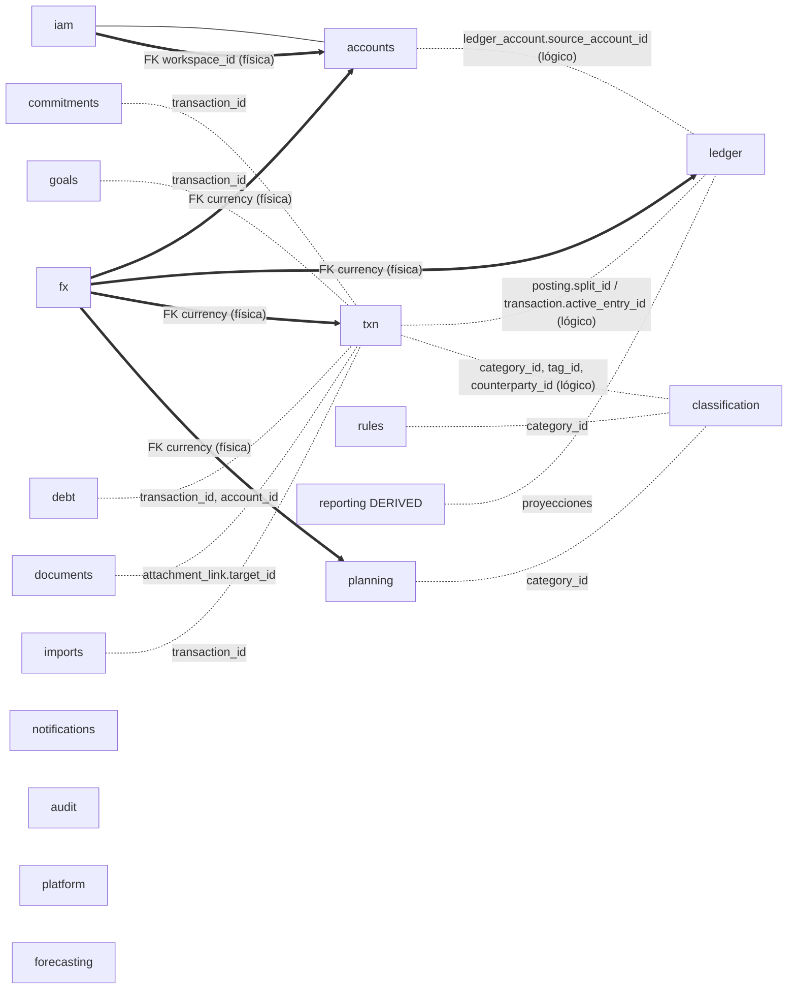
```mermaid
flowchart LR
  iam[iam] --- accounts[accounts]
  accounts -. "ledger_account.source_account_id (lógico)" .- ledger[ledger]
  txn[txn] -. "posting.split_id / transaction.active_entry_id (lógico)" .- ledger
  txn -. "category_id, tag_id, counterparty_id (lógico)" .- classification[classification]
  planning[planning] -. category_id .- classification
  commitments[commitments] -. transaction_id .- txn
  goals[goals] -. transaction_id .- txn
  debt[debt] -. "transaction_id, account_id" .- txn
  fx[fx] == "FK currency (física)" ==> accounts & ledger & txn & planning
  documents[documents] -. "attachment_link.target_id" .- txn
  imports[imports] -. transaction_id .- txn
  rules[rules] -. category_id .- classification
  reporting[reporting DERIVED] -. proyecciones .- ledger
  notifications[notifications]
  audit[audit]
  platform[platform]
  forecasting[forecasting]
  iam == "FK workspace_id (física)" ==> accounts
```

---

## 2. Validación de la lista candidata original de tablas

La lista de tablas del brief inicial se reconcilia con los contextos canónicos (ARCHITECTURE §3). La validación conceptual de agregados la hace [04-domain-model.md](04-domain-model.md); aquí se decide el destino físico.

| Tabla candidata | Decisión | Tabla final | Justificación |
|-----------------|----------|-------------|---------------|
| `users` | Renombrar | `iam.user` | Singular, schema `iam`; credenciales viven en el IdP (no hay `password_hash`). |
| `workspaces`, `workspace_members` | Mantener | `iam.workspace`, `iam.workspace_membership` | Multi-workspace desde día 1. |
| `institutions` | Mantener | `accounts.institution` | Parte de Accounts (ARCHITECTURE §3 #2). |
| `accounts` | Mantener | `accounts.account` | 1:1 con `ledger.ledger_account` ASSET/LIABILITY. |
| `account_balances` | Renombrar + derivar | `ledger.balance_snapshot` (+ `reporting.daily_balance`) | Derivados; saldo = Σ postings (ARCHITECTURE §4.1, 09 §8). |
| `ledger_accounts`, `journal_entries`, `postings` | Mantener | `ledger.*` | Núcleo de doble entrada. |
| `transactions` | Mantener | `txn.transaction` | Agregado de usuario; el ledger es invisible. |
| `transaction_splits` | Mantener | `txn.transaction_split` | Portador de la clasificación; `posting.split_id`. |
| `transfers` | Fusionar | `txn.transaction` kind `TRANSFER` + `txn.transaction_leg` | Una transferencia son dos legs de la misma moneda; tabla aparte no aporta datos (09 §6.4). |
| `currency_conversions` / `crypto_conversions` | Fusionar | `txn.conversion_detail` + `txn.conversion_fee` | La conversión es una transacción; pricing inmutable junto a ella. |
| `exchange_rates` | Mantener (singular) | `fx.exchange_rate` | Histórico inmutable con source/provider/as-of. |
| `currencies` | Mantener | `fx.currency` (+ `fx.workspace_currency`) | Incluye `kind` FIAT/CRYPTO/COMMODITY/CUSTOM. |
| `categories`, `category_groups`, `tags` | Mantener | `classification.*` | Soft-archive. |
| `transaction_tags` | Renombrar | `txn.split_tag` | Tags a nivel de split, no de transacción. |
| `custom_fields`, `custom_field_values` | Mantener / mover | `classification.custom_field_definition`, `txn.split_custom_field_value` | Definición en Classification, valor junto al split. |
| `merchants`, `payees`, `providers` | Fusionar | `classification.counterparty` (+ `counterparty_alias`) | Un solo concepto con `kind`. |
| `budgets`, `budget_items` | Mantener / renombrar | `planning.budget`, `planning.budget_line` | — |
| `budget_templates` | Mantener + versionar | `planning.budget_template`, `budget_template_version`, `budget_template_line` | Templates versionados; el presupuesto referencia la versión usada. |
| `financial_periods` / `months` | Renombrar | `planning.financial_period` | Periodos explícitos (no se asume mes calendario). |
| `month_closings` | Reemplazar (add-month-closing) | `planning.close_snapshot`, `close_snapshot_balance`, `close_snapshot_without_statement`, `period_reopening`, `close_pending_notice`, `closing_policy` | Snapshots y reaperturas **append-only** (PF003) en lugar de intentos mutables: el cierre es síncrono. |
| `recurring_payments`, `subscriptions` | Fusionar | `commitments.recurring_definition` (+ `subscription` subtipo) + `recurring_occurrence` | Un motor de recurrencia. |
| `savings_goals`, `goal_contributions` | Mantener | `goals.*` | Contribución TRANSFER o EARMARK. |
| `loans`, `loan_payments` | Mantener / renombrar | `debt.loan`, `debt.loan_installment` | Pagos reales son transacciones. As-built `add-loans`: `debt.loan_payment` + `debt.loan_payment_allocation` enlazan la transacción y la cuota (la cuota ya no guarda `paid_transaction_id`). |
| `credit_cards` | Mantener | `debt.credit_card`, `debt.credit_card_statement` | La tarjeta es un `accounts.account` LIABILITY + términos en Debt. |
| `documents`, `attachments` | Mantener | `documents.document`, `documents.attachment_link` | Link polimórfico (§5.11). |
| `imports`, `import_rows` | Renombrar | `imports.import_job`, `imports.staged_transaction` (+ `row_link`, `import_error`) | Alineado con [13-import-architecture.md](13-import-architecture.md) §14. |
| `bank_connections` | Renombrar (Phase 6+) | `imports.connection` | Cubre bancos y exchanges; secretos fuera de BD (`secret_ref`). |
| `import_mappings` | Renombrar | `imports.mapping_profile` | Versionado `(id, version)`. |
| `rules`, `rule_conditions`, `rule_actions` | Fusionar | `rules.rule` con `conditions`/`actions` JSONB | Ver justificación §5.13. |
| `notifications` | Mantener | `notifications.notification` (+ `preference`, `delivery`) | — |
| `audit_logs` | Renombrar | `audit.audit_log` | Append-only, particionada. |
| `reconciliations` | Mantener | `txn.reconciliation` (+ `reconciliation_item`) | Parte de Transactions (ARCHITECTURE §3 #4). |
| `forecasts` | Mantener (Phase 8) | `forecasting.forecast_run`, `forecast_point` | Escritas por el ACL; ML no escribe en BD core. |
| `net_worth_history` | Renombrar + derivar | `reporting.net_worth_snapshot` | Derivado, reconstruible. |
| `sessions`, `refresh_tokens` | **Reemplazar** | `iam.bff_session` | Sesión server-side del BFF (tokens cifrados, `sid` hasheado), tabla técnica sin RLS por workspace accesible solo por el rol `pf_bff` (§5.1). No es dato de negocio. |
| `api_keys` (usuario) | **Rechazar por ahora** | — | Sin clientes externos; reabrir si aparece CLI/móvil. |
| `jobs`/`queue` | **Rechazar** | — | BullMQ en Redis; durabilidad vía `platform.outbox`. |
| — (nuevas) | Agregar | `platform.outbox`, `platform.inbox`, `platform.idempotency_key`, `platform.operation`, `txn.transaction_journal_link`, `txn.duplicate_candidate`, `ledger.period_lock`, `reporting.projection_checkpoint` | Requeridas por ARCHITECTURE §4, §7, §8. |

---

## 3. Visión general de relaciones entre agregados (lógica)

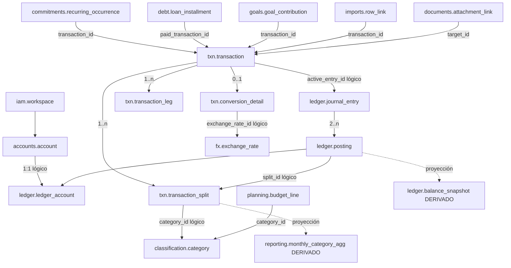
```mermaid
flowchart TB
  WS[iam.workspace] --> ACC[accounts.account]
  ACC -->|1:1 lógico| LA[ledger.ledger_account]
  TX[txn.transaction] -->|1..n| SP[txn.transaction_split]
  TX -->|active_entry_id lógico| JE[ledger.journal_entry]
  TX -->|1..n| LEG[txn.transaction_leg]
  JE -->|2..n| PO[ledger.posting]
  PO -->|split_id lógico| SP
  PO --> LA
  TX -->|0..1| CD[txn.conversion_detail]
  CD -->|exchange_rate_id lógico| FR[fx.exchange_rate]
  SP -->|category_id lógico| CAT[classification.category]
  OCC[commitments.recurring_occurrence] -->|transaction_id| TX
  INST[debt.loan_installment] -->|paid_transaction_id| TX
  GC[goals.goal_contribution] -->|transaction_id| TX
  IR[imports.row_link] -->|transaction_id| TX
  AL[documents.attachment_link] -->|target_id| TX
  BL[planning.budget_line] -->|category_id| CAT
  PO -. proyección .-> SNAP[ledger.balance_snapshot DERIVADO]
  SP -. proyección .-> AGG[reporting.monthly_category_agg DERIVADO]
```

---

## 4. Leyenda de los ERD

- Tipos según §1.1 (`money` = `NUMERIC(38,18)`, `ccy` = `varchar(16)` FK `fx.currency`).
- `PK`, `FK`, `UK` según Mermaid. Las referencias lógicas cross-context se anotan con `"ref ctx.tabla"`.
- Todas las tablas con `workspace_id` lo tienen `FK` a `iam.workspace` (se omite la relación en los diagramas por legibilidad).
- Las columnas estándar `created_by`, `updated_by`, `archived_by` se omiten en los ERD salvo que sean relevantes; existen según §1.2.

---

## 5. Schemas

### 5.1 `iam` — Identity & Workspace (Phase 1)

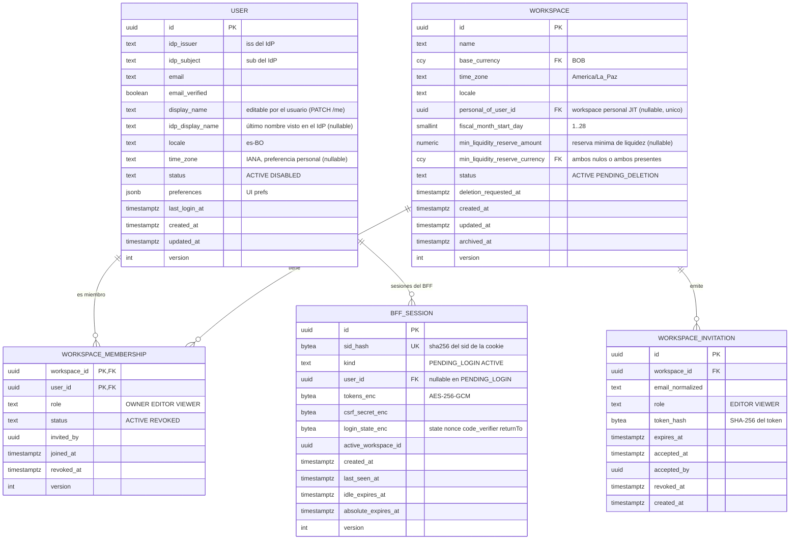
```mermaid
erDiagram
  USER ||--o{ WORKSPACE_MEMBERSHIP : "es miembro"
  WORKSPACE ||--o{ WORKSPACE_MEMBERSHIP : "tiene"
  WORKSPACE ||--o{ WORKSPACE_INVITATION : "emite"
  USER ||--o{ BFF_SESSION : "sesiones del BFF"
  USER {
    uuid id PK
    text idp_issuer "iss del IdP"
    text idp_subject "sub del IdP"
    text email
    boolean email_verified
    text display_name "editable por el usuario (PATCH /me)"
    text idp_display_name "último nombre visto en el IdP (nullable)"
    text locale "es-BO"
    text time_zone "IANA, preferencia personal (nullable)"
    text status "ACTIVE DISABLED"
    jsonb preferences "UI prefs"
    timestamptz last_login_at
    timestamptz created_at
    timestamptz updated_at
    int version
  }
  WORKSPACE {
    uuid id PK
    text name
    ccy base_currency FK "BOB"
    text time_zone "America/La_Paz"
    text locale
    uuid personal_of_user_id FK "workspace personal JIT (nullable, unico)"
    smallint fiscal_month_start_day "1..28"
    numeric min_liquidity_reserve_amount "reserva minima de liquidez (nullable)"
    ccy min_liquidity_reserve_currency FK "ambos nulos o ambos presentes"
    text status "ACTIVE PENDING_DELETION"
    timestamptz deletion_requested_at
    timestamptz created_at
    timestamptz updated_at
    timestamptz archived_at
    int version
  }
  WORKSPACE_MEMBERSHIP {
    uuid workspace_id PK, FK
    uuid user_id PK, FK
    text role "OWNER EDITOR VIEWER"
    text status "ACTIVE REVOKED"
    uuid invited_by
    timestamptz joined_at
    timestamptz revoked_at
    int version
  }
  WORKSPACE_INVITATION {
    uuid id PK
    uuid workspace_id FK
    text email_normalized
    text role "EDITOR VIEWER"
    bytea token_hash "SHA-256 del token"
    timestamptz expires_at
    timestamptz accepted_at
    uuid accepted_by
    timestamptz revoked_at
    timestamptz created_at
  }
  BFF_SESSION {
    uuid id PK
    bytea sid_hash UK "sha256 del sid de la cookie"
    text kind "PENDING_LOGIN ACTIVE"
    uuid user_id FK "nullable en PENDING_LOGIN"
    bytea tokens_enc "AES-256-GCM"
    bytea csrf_secret_enc
    bytea login_state_enc "state nonce code_verifier returnTo"
    uuid active_workspace_id
    timestamptz created_at
    timestamptz last_seen_at
    timestamptz idle_expires_at
    timestamptz absolute_expires_at
    int version
  }
```

| Tabla | Unique | Check | Índices | RLS | version / archivo |
|-------|--------|-------|---------|-----|-------------------|
| `user` | `(idp_issuer, idp_subject)`; `lower(email)` parcial `WHERE status='ACTIVE'` | `status IN (...)` | — | **USR**: `id = app.user_id` (lectura propia); alta vía JIT provisioning con rol `pf_app` y policy `WITH CHECK` sobre `idp_subject` del token (función `SECURITY DEFINER` acotada `iam.provision_user`: sincroniza `email` siempre y `display_name` solo si cambió el nombre en el IdP —`idp_display_name`—, para no pisar el elegido por el usuario) | `version` |
| `workspace` | `(personal_of_user_id) WHERE personal_of_user_id IS NOT NULL` (un workspace personal por usuario) | `fiscal_month_start_day BETWEEN 1 AND 28`; reserva mínima: `min_liquidity_reserve_amount` y `min_liquidity_reserve_currency` ambos nulos o ambos presentes, monto `>= 0` | — | **USR/WS**: `SELECT` si existe membership activa de `app.user_id`; `UPDATE` si `id = current_workspace_id()` | `version`, `archived_at` |
| `workspace_membership` | PK compuesta. **Al menos un OWNER activo** por workspace: invariante de dominio (`LAST_OWNER_CANNOT_LEAVE`) + constraint trigger diferido | `role IN ('OWNER','EDITOR','VIEWER')` | `(user_id) WHERE status='ACTIVE'` (resolver workspaces del usuario) | **USR**: `user_id = app.user_id OR workspace_id = current_workspace_id()` | `version` |
| `workspace_invitation` | `(workspace_id, email_normalized) WHERE accepted_at IS NULL AND revoked_at IS NULL` | `expires_at > created_at` | `(token_hash)` | WS | — (Phase 9) |
| `bff_session` | `sid_hash` | `kind IN ('PENDING_LOGIN','ACTIVE')`; `kind='ACTIVE'` ⇒ `user_id IS NOT NULL` | `(idle_expires_at)`, `(absolute_expires_at)` (purga) | **Sin RLS por workspace** (tabla técnica por usuario, en la allowlist del chequeo de catálogo): solo el rol `pf_bff` tiene `SELECT/INSERT/UPDATE/DELETE`; `pf_app`/`pf_worker` sin grants; `pf_maintenance` purga expiradas | `version` (refresh *single-flight*) |

### 5.2 `accounts` — Accounts & Institutions (Phase 1)

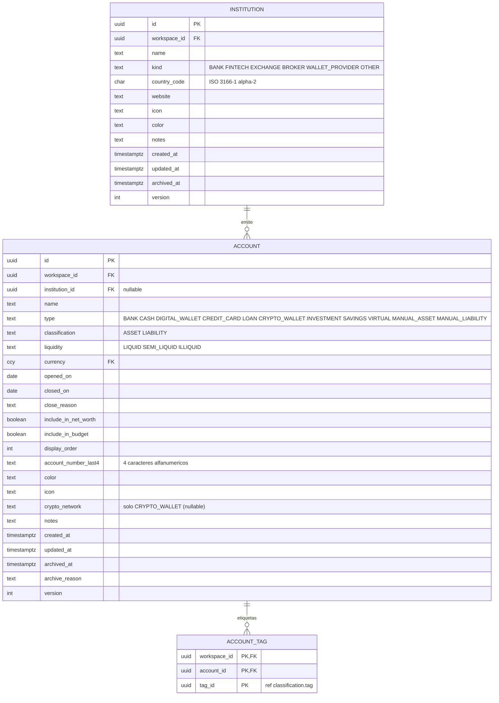
```mermaid
erDiagram
  INSTITUTION ||--o{ ACCOUNT : "emite"
  ACCOUNT ||--o{ ACCOUNT_TAG : "etiquetas"
  INSTITUTION {
    uuid id PK
    uuid workspace_id FK
    text name
    text kind "BANK FINTECH EXCHANGE BROKER WALLET_PROVIDER OTHER"
    char country_code "ISO 3166-1 alpha-2"
    text website
    text icon
    text color
    text notes
    timestamptz created_at
    timestamptz updated_at
    timestamptz archived_at
    int version
  }
  ACCOUNT {
    uuid id PK
    uuid workspace_id FK
    uuid institution_id FK "nullable"
    text name
    text type "BANK CASH DIGITAL_WALLET CREDIT_CARD LOAN CRYPTO_WALLET INVESTMENT SAVINGS VIRTUAL MANUAL_ASSET MANUAL_LIABILITY"
    text classification "ASSET LIABILITY"
    text liquidity "LIQUID SEMI_LIQUID ILLIQUID"
    ccy currency FK
    date opened_on
    date closed_on
    text close_reason
    boolean include_in_net_worth
    boolean include_in_budget
    int display_order
    text account_number_last4 "4 caracteres alfanumericos"
    text color
    text icon
    text crypto_network "solo CRYPTO_WALLET (nullable)"
    text notes
    timestamptz created_at
    timestamptz updated_at
    timestamptz archived_at
    text archive_reason
    int version
  }
  ACCOUNT_TAG {
    uuid workspace_id PK, FK
    uuid account_id PK, FK
    uuid tag_id PK "ref classification.tag"
  }
```

| Tabla | Unique | Check | Índices | RLS | version / archivo |
|-------|--------|-------|---------|-----|-------------------|
| `institution` | `(workspace_id, id)`; `(workspace_id, lower(name)) WHERE archived_at IS NULL` | `kind IN (...)` (6 valores, D3); `country_code ~ '^[A-Z]{2}$'` | — | WS | `version`, `archived_at` |
| `account` | `(workspace_id, id)`; `(workspace_id, lower(name)) WHERE archived_at IS NULL` | `type IN (...)` (11 valores, D3); `classification IN ('ASSET','LIABILITY')`; coherencia `type`↔`classification` (`CREDIT_CARD`,`LOAN`,`MANUAL_LIABILITY` ⇒ `LIABILITY`; resto ⇒ `ASSET`); `liquidity IN ('LIQUID','SEMI_LIQUID','ILLIQUID')` (D5); `account_number_last4 ~ '^[A-Za-z0-9]{4}$'`; `closed_on >= opened_on`; FK compuesta `(workspace_id, institution_id) → institution(workspace_id, id)` | `(workspace_id, display_order, id)`; `(workspace_id, institution_id) WHERE institution_id IS NOT NULL` | WS | `version`, `archived_at` |
| `account_custom_field_value` | PK `(workspace_id, account_id, field_id)`; FK compuesta `(workspace_id, account_id) → account` | `num_nonnulls(value_text, value_number, value_date, value_bool) = 1`; `value_text` de 1 a 500 caracteres | `(workspace_id, field_id)` | WS (`pf_app`: `SELECT, INSERT, UPDATE, DELETE`, tabla de enlace) | — (as-built `add-custom-fields`: valores de custom fields de cuenta; `field_id` lógico, validado vía `CustomFieldCatalogPort` → CLASSIFICATION `ValidateCustomFieldValues`; no afectan saldos) |
| `account_tag` | PK `(workspace_id, account_id, tag_id)`; FK compuesta `(workspace_id, account_id) → account` | — | — | WS | Tabla de enlace: `pf_app` con `SELECT, INSERT, DELETE`. `tag_id` es referencia lógica (sin FK cross-schema), validada vía `TagCatalogPort`; un tag archivado no es asignable (`TAG_ARCHIVED`) |

Notas (as-built `add-accounts-management`, migración `20261003181000_accounts_institution_account.sql`; rev. 2026-10-04, D3–D6): sin DELETE en `institution` ni `account` (NFR-DATA-012). La moneda de una cuenta solo puede cambiarse mientras no tenga movimientos (`ACCOUNT_CURRENCY_IMMUTABLE`; en la práctica, mientras no exista su ledger account). `account` **no** guarda `ledger_account_id` (D6): el vínculo 1:1 vive en `ledger.ledger_account.source_account_id`, único por `(workspace_id, source_account_id)` (§5.3), creado con *get-or-create* en la misma transacción del primer posting (ARCHITECTURE §7, FR-ACCOUNTS-003); una cuenta sin movimientos no tiene ledger account y su saldo es cero. Estados (D4) `ACTIVE`, `CLOSED`, `ARCHIVED`, **derivados** (sin columna `status`): `ARCHIVED` si `archived_at` no es nulo, `CLOSED` si `closed_on` no es nulo, si no `ACTIVE`; cerrar exige saldo cero. `liquidity` tiene default por tipo (FR-ACCOUNTS-011); no existe `include_in_liquidity`. Nunca se guarda número de cuenta completo (minimización, [12-security.md](12-security.md) §13).

### 5.3 `ledger` — Financial Ledger (Phase 1)

Semántica completa e invariantes `INV-*` en [09-ledger-design.md](09-ledger-design.md) (§4, §5, §8, §10, §13). Este schema la materializa sin divergir.

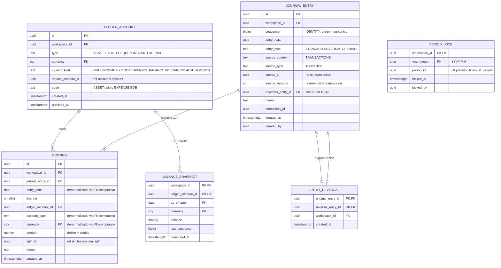
```mermaid
erDiagram
  LEDGER_ACCOUNT ||--o{ POSTING : "recibe"
  JOURNAL_ENTRY ||--|{ POSTING : "contiene 2..n"
  JOURNAL_ENTRY ||--o| ENTRY_REVERSAL : "original"
  JOURNAL_ENTRY ||--o| ENTRY_REVERSAL : "reversa"
  LEDGER_ACCOUNT ||--o{ BALANCE_SNAPSHOT : "DERIVADO"
  LEDGER_ACCOUNT {
    uuid id PK
    uuid workspace_id FK
    text type "ASSET LIABILITY EQUITY INCOME EXPENSE"
    ccy currency FK
    text system_kind "NULL INCOME EXPENSE OPENING_BALANCE FX_TRADING ADJUSTMENTS"
    uuid source_account_id "ref accounts.account"
    text code "ASSET:uuid o EXPENSE:BOB"
    timestamptz created_at
    timestamptz archived_at
  }
  JOURNAL_ENTRY {
    uuid id PK
    uuid workspace_id FK
    bigint sequence "IDENTITY, orden monotonico"
    date entry_date
    text entry_type "STANDARD REVERSAL OPENING"
    text source_context "TRANSACTIONS"
    text source_type "Transaction"
    uuid source_id "ref txn.transaction"
    int source_revision "revision de la transaccion"
    uuid reverses_entry_id FK "solo REVERSAL"
    text memo
    uuid correlation_id
    timestamptz created_at
    uuid created_by
  }
  ENTRY_REVERSAL {
    uuid original_entry_id PK, FK
    uuid reversal_entry_id UK, FK
    uuid workspace_id FK
    timestamptz created_at
  }
  POSTING {
    uuid id PK
    uuid workspace_id FK
    uuid journal_entry_id FK
    date entry_date "denormalizado via FK compuesta"
    smallint line_no
    uuid ledger_account_id FK
    text account_type "denormalizado via FK compuesta"
    ccy currency FK "denormalizado via FK compuesta"
    money amount "debito + credito -"
    uuid split_id "ref txn.transaction_split"
    text memo
    timestamptz created_at
  }
  PERIOD_LOCK {
    uuid workspace_id PK, FK
    char year_month PK "YYYY-MM"
    uuid period_id "ref planning.financial_period"
    timestamptz locked_at
    uuid locked_by
  }
  BALANCE_SNAPSHOT {
    uuid workspace_id PK, FK
    uuid ledger_account_id PK, FK
    date as_of_date PK
    ccy currency FK
    money balance
    bigint last_sequence
    timestamptz computed_at
  }
```

| Tabla | Unique | Check | Índices | RLS | version / archivo |
|-------|--------|-------|---------|-----|-------------------|
| `ledger_account` | `(workspace_id, id)`; `(id, currency, type)` (destino de FK compuesta de `posting`); `(workspace_id, system_kind, currency) WHERE system_kind IS NOT NULL`; `(workspace_id, source_account_id) WHERE source_account_id IS NOT NULL` | `type IN (...)`; `source_account_id IS NOT NULL` ⇔ `type IN ('ASSET','LIABILITY')`; `system_kind IS NULL` ⇔ `source_account_id IS NOT NULL`, y el `type` de una cuenta de sistema lo fija su `system_kind` (`INCOME`→`INCOME`, `EXPENSE`→`EXPENSE`, resto→`EQUITY`) | — | WS (sin UPDATE salvo `archived_at`) | `archived_at` (sin `version`: no se edita) |
| `journal_entry` | `(workspace_id, id)`; `(id, entry_date)` (destino FK de posting); `(workspace_id, source_type, source_id, source_revision, entry_type)` | `entry_type IN ('STANDARD','REVERSAL','OPENING')`; `entry_type='REVERSAL'` ⇔ `reverses_entry_id IS NOT NULL` | `(workspace_id, source_type, source_id)`; `(workspace_id, entry_date)`; `(workspace_id, sequence)` | **WS-RO** | Inmutable |
| `entry_reversal` | PK `original_entry_id` (**una entry se revierte a lo sumo una vez**, INV-008); `UNIQUE (reversal_entry_id)` | `original_entry_id <> reversal_entry_id` | — | **WS-RO** | Inmutable. Proyección de `reversedByEntryId` sin necesidad de UPDATE (09 §5) |
| `posting` | `(journal_entry_id, line_no)` | `amount <> 0`; `account_type NOT IN ('INCOME','EXPENSE') OR split_id IS NOT NULL` (todo posting nominal referencia un split) | `(workspace_id, ledger_account_id, entry_date, id)` INCLUDE `(amount)` — saldos *as-of*; `(workspace_id, split_id) WHERE split_id IS NOT NULL` | **WS-RO** | Inmutable |
| `period_lock` | PK `(workspace_id, year_month)` (`year_month` = etiqueta del periodo financiero); `period_start`, `period_end` (bloqueo por **rango** del periodo, ADR-0028; `period_start = '-infinity'` en el primer periodo cerrado) | `year_month ~ '^[0-9]{4}-(0[1-9]\|1[0-2])$'`; `period_end >= period_start`; exclusión gist `(workspace_id =, daterange(period_start, period_end, '[]') &&)` | — | WS (`pf_app`: INSERT/DELETE — reabrir elimina el lock, con audit) | — |
| `balance_snapshot` | PK | — | `(workspace_id, ledger_account_id, as_of_date DESC)` | **DRV** | **Derivado** y reconstruible (09 §8, INV-022). Borrable como caché cuando llega un asiento *backdated*. La reconstrucción y la verificación Σ postings las ejecuta el worker con `SET ROLE pf_ledger_maintenance` (rol `NOINHERIT`, sin `BYPASSRLS`, con políticas propias: lectura de `ledger_account`/`journal_entry`/`posting`/`entry_reversal` y `SELECT, INSERT, DELETE` en `balance_snapshot` de todos los workspaces; migración `20261003190000_ledger_maintenance_role.sql`) |

Restricciones de BD que refuerzan el dominio:
1. **Zero-sum por moneda y entry** (INV-004): constraint trigger `DEFERRABLE INITIALLY DEFERRED` (SQL §10.2).
2. **Mínimo dos postings** por entry, ninguno en cero (INV-005): CHECK + constraint trigger diferido.
3. **Moneda del posting = moneda del ledger account** (INV-006): FK compuesta `(ledger_account_id, currency, account_type) → ledger_account(id, currency, type)`.
4. **`entry_date` y workspace coherentes** (INV-025): FKs compuestas `(journal_entry_id, entry_date)` y `(workspace_id, journal_entry_id)`.
5. **Inmutabilidad** (INV-007): sin grants `UPDATE/DELETE/TRUNCATE` + trigger `forbid_mutation`.
6. **Periodo cerrado** (INV-015): trigger `BEFORE INSERT` en `journal_entry` rechaza (`PF004`, `PERIOD_CLOSED`) la `entry_date` que caiga en `[period_start, period_end]` de algún `period_lock` del workspace (ADR-0028, enmienda de D10: con día de inicio 1 coincide con el mes calendario; el primer periodo cerrado protege además todo lo anterior). `period_lock` lo escribe Planning **sincrónicamente** vía `LedgerPeriodLockPort` (`@pf/ledger/contracts`) en la misma transacción del cierre (09 §10).
7. `sequence` (`bigint GENERATED ALWAYS AS IDENTITY`): monotónico global ⇒ monotónico por workspace (con huecos). Suficiente para checkpoints de rebuild; **no** es orden de commit (ver Preguntas abiertas).

Códigos SQLSTATE propios de la BD (docs/31 D19; as-built, migraciones `20261002130000_platform_idempotency_key.sql`, `20261003160000_audit_audit_log.sql` y `20261003170000_ledger_core.sql`; rev. 2026-10-04). Cada código tiene **un único** significado; la app los traduce a problem+json:

| SQLSTATE | Significado | Origen |
|----------|-------------|--------|
| `PF001` | Asiento desbalanceado por moneda (`LEDGER_UNBALANCED_ENTRY`, INV-004) | `ledger.assert_entry_balanced()` (constraint trigger diferido) |
| `PF002` | Contexto de RLS ausente (`app.workspace_id` sin fijar; también `app.user_id` en las tablas **USR**): la consulta **falla**, nunca devuelve 0 filas | `platform.current_workspace_id()` (§1.4), `platform.current_user_id()` |
| `PF003` | Mutación prohibida sobre una tabla append-only (`IMMUTABLE_RECORD`, INV-007) | `platform.forbid_mutation()` |
| `PF004` | Periodo cerrado (`PERIOD_CLOSED`, INV-015) | `ledger.assert_period_open()` |
| `PF005` | Asiento con menos de 2 postings (`LEDGER_ENTRY_TOO_FEW_POSTINGS`, INV-005) | `ledger.assert_entry_has_postings()` (constraint trigger diferido) |

Las violaciones de invariantes de otros contextos (p. ej. Σ splits, consistencia de transferencias y conversiones, jerarquía de categorías) usan `23514` (`check_violation`) con el nombre de constraint lógico en `CONSTRAINT`.

### 5.4 `txn` — Transactions (Phase 1)

Modelo alineado con [09-ledger-design.md](09-ledger-design.md) §3, §6.17, §7: una `Transaction` tiene **legs** (movimientos sobre cuentas del usuario, con signo contable desde la perspectiva de la cuenta) y **splits** (porción nominal clasificada). INV-024: legs = postings de cuentas de usuario del asiento activo; INV-021: Σ splits = monto nominal.

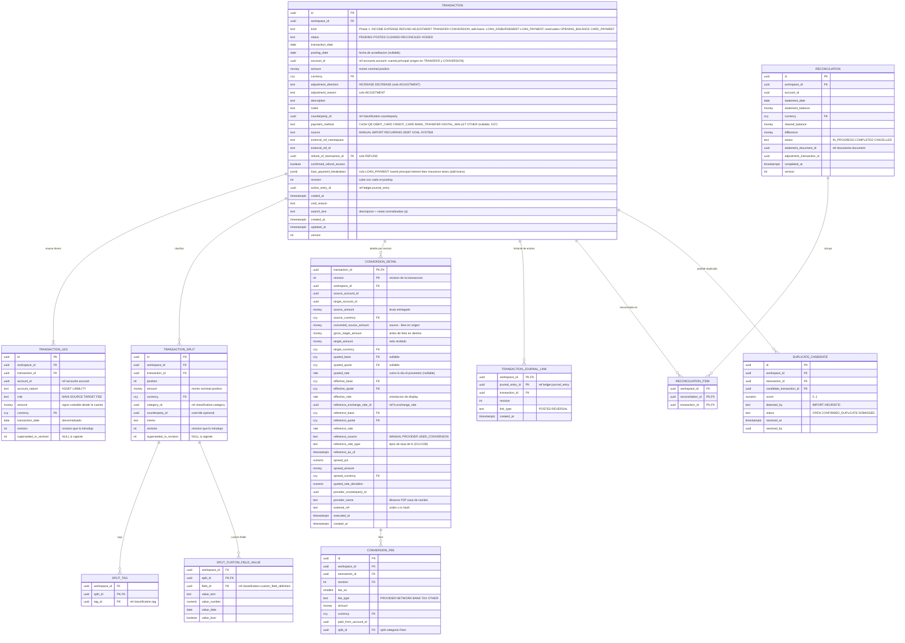
```mermaid
erDiagram
  TRANSACTION ||--|{ TRANSACTION_LEG : "mueve dinero"
  TRANSACTION ||--o{ TRANSACTION_SPLIT : "clasifica"
  TRANSACTION ||--o{ CONVERSION_DETAIL : "detalle por revision"
  CONVERSION_DETAIL ||--o{ CONVERSION_FEE : "fees"
  TRANSACTION ||--o{ TRANSACTION_JOURNAL_LINK : "historial de entries"
  TRANSACTION_SPLIT ||--o{ SPLIT_TAG : "tags"
  TRANSACTION_SPLIT ||--o{ SPLIT_CUSTOM_FIELD_VALUE : "custom fields"
  RECONCILIATION ||--o{ RECONCILIATION_ITEM : "incluye"
  TRANSACTION ||--o{ RECONCILIATION_ITEM : "reconciliada en"
  TRANSACTION ||--o{ DUPLICATE_CANDIDATE : "posible duplicado"
  TRANSACTION {
    uuid id PK
    uuid workspace_id FK
    text kind "Phase 1: INCOME EXPENSE REFUND ADJUSTMENT TRANSFER CONVERSION; add-loans: LOAN_DISBURSEMENT LOAN_PAYMENT; reservados OPENING_BALANCE CARD_PAYMENT"
    text status "PENDING POSTED CLEARED RECONCILED VOIDED"
    date transaction_date
    date posting_date "fecha de acreditacion (nullable)"
    uuid account_id "ref accounts.account: cuenta principal (origen en TRANSFER y CONVERSION)"
    money amount "monto nominal positivo"
    ccy currency FK
    text adjustment_direction "INCREASE DECREASE (solo ADJUSTMENT)"
    text adjustment_reason "solo ADJUSTMENT"
    text description
    text notes
    uuid counterparty_id "ref classification.counterparty"
    text payment_method "CASH QR DEBIT_CARD CREDIT_CARD BANK_TRANSFER DIGITAL_WALLET OTHER (nullable, D27)"
    text source "MANUAL IMPORT RECURRING DEBT GOAL SYSTEM"
    text external_ref_namespace
    text external_ref_id
    uuid refund_of_transaction_id FK "solo REFUND"
    boolean confirmed_refund_excess
    jsonb loan_payment_breakdown "solo LOAN_PAYMENT: loanId principal interest fees insurance taxes (add-loans)"
    int revision "sube con cada re-posting"
    uuid active_entry_id "ref ledger.journal_entry"
    timestamptz voided_at
    text void_reason
    text search_text "descripcion + notas normalizadas (q)"
    timestamptz created_at
    timestamptz updated_at
    int version
  }
  TRANSACTION_LEG {
    uuid id PK
    uuid workspace_id FK
    uuid transaction_id FK
    uuid account_id "ref accounts.account"
    text account_nature "ASSET LIABILITY"
    text role "MAIN SOURCE TARGET FEE"
    money amount "signo contable desde la cuenta"
    ccy currency FK
    date transaction_date "denormalizado"
    int revision "revision que lo introdujo"
    int superseded_in_revision "NULL si vigente"
  }
  TRANSACTION_SPLIT {
    uuid id PK
    uuid workspace_id FK
    uuid transaction_id FK
    int position
    money amount "monto nominal positivo"
    ccy currency FK
    uuid category_id "ref classification.category"
    uuid counterparty_id "override opcional"
    text memo
    int revision "revision que lo introdujo"
    int superseded_in_revision "NULL si vigente"
  }
  SPLIT_TAG {
    uuid workspace_id FK
    uuid split_id PK, FK
    uuid tag_id PK "ref classification.tag"
  }
  SPLIT_CUSTOM_FIELD_VALUE {
    uuid workspace_id FK
    uuid split_id PK, FK
    uuid field_id PK "ref classification.custom_field_definition"
    text value_text
    numeric value_number
    date value_date
    boolean value_bool
  }
  CONVERSION_DETAIL {
    uuid transaction_id PK, FK
    int revision PK "revision de la transaccion"
    uuid workspace_id FK
    uuid source_account_id
    uuid target_account_id
    money source_amount "bruto entregado"
    ccy source_currency FK
    money converted_source_amount "source - fees en origen"
    money gross_target_amount "antes de fees en destino"
    money target_amount "neto recibido"
    ccy target_currency FK
    ccy quoted_base FK "nullable"
    ccy quoted_quote FK "nullable"
    rate quoted_rate "como lo dio el proveedor (nullable)"
    ccy effective_base FK
    ccy effective_quote FK
    rate effective_rate "orientacion de display"
    uuid reference_exchange_rate_id "ref fx.exchange_rate"
    ccy reference_base FK
    ccy reference_quote FK
    rate reference_rate
    text reference_source "MANUAL PROVIDER USER_CONVERSION"
    text reference_rate_type "tipos de tasa de fx (D13 D39)"
    timestamptz reference_as_of
    numeric spread_pct
    money spread_amount
    ccy spread_currency FK
    numeric quoted_rate_deviation
    uuid provider_counterparty_id
    text provider_name "Binance P2P casa de cambio"
    text external_ref "orden o tx hash"
    timestamptz executed_at
    timestamptz created_at
  }
  CONVERSION_FEE {
    uuid id PK
    uuid workspace_id FK
    uuid transaction_id FK
    int revision FK
    smallint fee_no
    text fee_type "PROVIDER NETWORK BANK TAX OTHER"
    money amount
    ccy currency FK
    uuid paid_from_account_id
    uuid split_id FK "split categoria Fees"
  }
  TRANSACTION_JOURNAL_LINK {
    uuid workspace_id PK, FK
    uuid journal_entry_id PK "ref ledger.journal_entry"
    uuid transaction_id FK
    int revision
    text link_type "POSTED REVERSAL"
    timestamptz created_at
  }
  RECONCILIATION {
    uuid id PK
    uuid workspace_id FK
    uuid account_id
    date statement_date
    money statement_balance
    ccy currency FK
    money cleared_balance
    money difference
    text status "IN_PROGRESS COMPLETED CANCELLED"
    uuid statement_document_id "ref documents.document"
    uuid adjustment_transaction_id
    timestamptz completed_at
    int version
  }
  RECONCILIATION_ITEM {
    uuid workspace_id FK
    uuid reconciliation_id PK, FK
    uuid transaction_id PK, FK
  }
  DUPLICATE_CANDIDATE {
    uuid id PK
    uuid workspace_id FK
    uuid transaction_id FK
    uuid candidate_transaction_id FK
    numeric score "0..1"
    text detected_by "IMPORT HEURISTIC"
    text status "OPEN CONFIRMED_DUPLICATE DISMISSED"
    timestamptz resolved_at
    uuid resolved_by
  }
```

| Tabla | Unique | Check | Índices | RLS | version / archivo |
|-------|--------|-------|---------|-----|-------------------|
| `transaction` | `(workspace_id, id)`. *Planificado (Phase 6, proveedores con id estable):* `(workspace_id, account_id, external_ref_namespace, external_ref_id) WHERE external_ref_id IS NOT NULL` (13 §7.3); *as-built Phase 3 `add-basic-csv-import`:* el índice único parcial `transaction_import_ref_uk` solo para el espacio `imports.csv-row` y la columna `import_job_id` | `kind IN (...)` (6 valores en Phase 1, ampliado por migración en cada change: transacciones → `TRANSFER` → `CONVERSION`); `status IN (...)`; `amount > 0`; `status='VOIDED'` ⇔ `voided_at IS NOT NULL`; `status IN ('PENDING','VOIDED')` ⇔ `active_entry_id IS NULL` (INV-023); `kind='ADJUSTMENT'` ⇔ `adjustment_reason` y `adjustment_direction IN ('INCREASE','DECREASE')` presentes; `refund_of_transaction_id IS NULL OR kind='REFUND'` (FK compuesta a la misma tabla); `payment_method IN (...)` o nulo (D27); `external_ref_namespace` y `external_ref_id` ambos nulos o ambos presentes | `(workspace_id, transaction_date DESC, id DESC)` (listado/cursor); `(workspace_id, account_id, transaction_date DESC, id DESC)`; `(workspace_id, refund_of_transaction_id) WHERE refund_of_transaction_id IS NOT NULL`; *as-built `add-recurrence-engine`:* único parcial `(workspace_id, external_ref_namespace, external_ref_id) WHERE external_ref_namespace = 'commitments.occurrence'` (una transacción por ocurrencia). Búsqueda `q` por `LIKE` sobre `search_text` (sin `pg_trgm`/`unaccent` en Phase 1) | WS | `version` (no archivo: se **anula** con `void`) |
| `transaction_leg` | — | `amount <> 0`; `role IN (...)`; `account_nature IN ('ASSET','LIABILITY')`; `superseded_in_revision IS NULL OR superseded_in_revision > revision` | `(workspace_id, transaction_id)`; `(workspace_id, account_id, transaction_date DESC, transaction_id DESC) WHERE superseded_in_revision IS NULL` (registro de cuenta) | WS | Reemplazados en cada revisión: las filas anteriores se conservan con `superseded_in_revision` |
| `transaction_split` | `(workspace_id, id)` | `amount > 0` (el signo lo da el `kind`); `position >= 0`; `category_id NOT NULL` | `(workspace_id, transaction_id) WHERE superseded_in_revision IS NULL`; `(workspace_id, category_id) WHERE superseded_in_revision IS NULL` | WS | Nunca se borra (postings históricos lo referencian) |
| `split_tag` | PK `(workspace_id, split_id, tag_id)` | — | — | WS (`pf_app`: `SELECT, INSERT, DELETE`, tabla de enlace) | — |
| `split_custom_field_value` | PK `(workspace_id, split_id, field_id)`; FK compuesta `(workspace_id, split_id) → transaction_split` | `num_nonnulls(value_text, value_number, value_date, value_bool) = 1`; `value_text` de 1 a 500 caracteres | Parciales por tipo de valor: `(workspace_id, field_id, value_text)`, `(…, value_number)`, `(…, value_date)`, `(…, value_bool)`; `(workspace_id, split_id)` | WS (`pf_app`: `SELECT, INSERT, UPDATE, DELETE`, tabla de enlace) | — (as-built `add-custom-fields`, migración `20261008130000_classification_custom_fields.sql`: `value_number numeric(38,18)` guarda NUMBER y DECIMAL exactos y la API los devuelve en forma canónica sin ceros finales; `field_id` es referencia lógica, sin FK entre schemas; los splits reemplazados por una revisión conservan sus filas) |
| `conversion_detail` | PK `(transaction_id, revision)` (D11); `(workspace_id, transaction_id, revision)` (destino de la FK de `conversion_fee`) | `source_currency <> target_currency`; montos `> 0`; `converted_source_amount <= source_amount`; `gross_target_amount >= target_amount`; tasas `> 0`; cotizada (`quoted_*`), de referencia (`reference_*`) y spread: cada grupo todo nulo o todo presente, con monedas del par de la conversión; `effective_base <> effective_quote`; `reference_source IN ('MANUAL','PROVIDER','USER_CONVERSION')`; `reference_rate_type IN (...)` (los 7 tipos de `fx.exchange_rate`) | `(workspace_id, source_currency, target_currency, executed_at)` | **WS-RO** (inmutable, INV-011/012: editar = reversa + nuevo asiento + nueva revisión del detalle; las anteriores se conservan) | Inmutable; el vigente es el de la mayor `revision` ≤ `transaction.revision` |
| `conversion_fee` | `(transaction_id, revision, fee_no)`; FK `(workspace_id, transaction_id, revision) → conversion_detail`; FK `(workspace_id, split_id) → transaction_split` | `amount > 0`; `fee_type IN (...)`; `split_id NOT NULL` | `(workspace_id, transaction_id, revision)` | **WS-RO** | Inmutable |
| `transaction_journal_link` | PK `(workspace_id, journal_entry_id)` | `link_type IN ('POSTED','REVERSAL')` | `(workspace_id, transaction_id, revision)` | **WS-RO** | Append-only |
| `reconciliation` | `(workspace_id, id)`; único parcial `(workspace_id, account_id) WHERE status='IN_PROGRESS'` (una sesión en curso por cuenta) | `status IN ('IN_PROGRESS','COMPLETED','CANCELLED')`; `COMPLETED` ⇔ `completed_at/by`, `cleared_balance` y `difference` presentes, con `difference = 0`; `CANCELLED` ⇔ `cancelled_at/by`; `adjustment_transaction_id` solo en `COMPLETED` (FK compuesta a `transaction`) | `(workspace_id, account_id, statement_date DESC)` | WS (`pf_app`: `SELECT, INSERT, UPDATE`, sin DELETE) | `version` (as-built `add-reconciliation`, migración `20261008140000_txn_reconciliation.sql`; `statement_document_id` reservado para Phase 6) |
| `reconciliation_item` | PK `(workspace_id, reconciliation_id, transaction_id)`; FK compuestas a `reconciliation` y `transaction` | `unreconciled_at/by/reason` los tres nulos o los tres presentes | `(workspace_id, transaction_id)` | WS (`pf_app`: `SELECT, INSERT` y `UPDATE` solo de las columnas `unreconciled_*`) | — (as-built; `verified_without_statement` = la sesión cotejó una conciliada sin extracto; la des-reconciliación posterior se anota sin alterar la sesión) |
| `duplicate_candidate` | `(workspace_id, least(transaction_id, candidate_transaction_id), greatest(transaction_id, candidate_transaction_id))` | `transaction_id <> candidate_transaction_id`; `score BETWEEN 0 AND 1` | `(workspace_id, status) WHERE status='OPEN'` | WS | — (Phase 2+, aún no creada; en Phase 1 los posibles duplicados se calculan al vuelo) |

As-built Phase 1 (rev. 2026-10-04; migraciones `20261003200000_txn_transactions_core.sql`, `20261003210000_txn_transfers.sql`, `20261003220100_txn_conversions.sql` y `20261004130000_fx_quote_side_rate_types.sql`): la transacción guarda **cabecera nominal** (`account_id`, `amount > 0`, `currency`) y los legs llevan el signo contable; no existe `primary_account_id` ni `leg_no`/`line_no`/`introduced_in_revision` (el orden del split es `position` y la revisión que introduce un leg o split es `revision`). Estados `CLEARED`/`RECONCILED` se marcan sobre la misma columna `status` (mark-cleared/unreconcile, sin tabla propia en Phase 1). **As-built Phase 2 (`add-reconciliation`, rev. 2026-10-08):** `transaction` agrega `reconciliation_mode text` (`STATEMENT` | `WITHOUT_STATEMENT`; CHECK `(status = 'RECONCILED') = (reconciliation_mode IS NOT NULL)`, docs/33 D74), `reconciliation_id uuid` (solo en el `ADJUSTMENT` que crea una sesión) y el índice parcial `(workspace_id, account_id, transaction_date) WHERE reconciliation_mode = 'WITHOUT_STATEMENT'` (filtro `systemFlag`, D111); la migración rellena las `RECONCILED` de Phase 1 con `WITHOUT_STATEMENT` (D77) suspendiendo `FORCE RLS` solo dentro de la migración. La marca `RECONCILED_WITHOUT_STATEMENT` se deriva del modo y no se almacena. `payment_method` (D27) es solo descriptivo: no altera el ledger. Un ajuste lleva `adjustment_direction` (`INCREASE` = débito en ASSET, crédito en LIABILITY, según `account_nature` del leg) y `adjustment_reason`; un reembolso puede enlazar su gasto original con `refund_of_transaction_id` y `confirmed_refund_excess` registra que el usuario aceptó reembolsar más que el original. El saldo inicial de una cuenta se postea hoy directo al ledger (sin fila `OPENING_BALANCE` en `txn`, ver design de add-accounts-management). `conversion_detail`, `conversion_fee` y `transaction_journal_link` son append-only por grants (`SELECT, INSERT`), sin trigger `forbid_mutation`.

Reglas adicionales:
- **Transacciones de préstamo (as-built Phase 4, `add-loans`; migraciones `20261011100100_txn_loan_kinds.sql` y `20261011100110_txn_loan_ref_uk.sql`):** `kind` admite `LOAN_DISBURSEMENT` y `LOAN_PAYMENT`, siempre con `source = 'DEBT'` (administradas) y `external_ref_namespace` `debt.loan` / `debt.loan-payment`; la columna `loan_payment_breakdown jsonb` guarda `{loanId, principal, interest, fees, insurance, taxes}` y existe si y solo si el kind es `LOAN_PAYMENT` (CHECKs `transaction_loan_source_ck`, `transaction_loan_external_ref_ck` y `transaction_loan_breakdown_ck`); `txn.assert_splits_sum()` (INV-021) se amplía: en `LOAN_PAYMENT` Σ splits = monto − principal (lo que no es principal es gasto) y en `LOAN_DISBURSEMENT` Σ splits = comisión retenida; el índice único parcial `transaction_loan_ref_uk (workspace_id, external_ref_namespace, external_ref_id) WHERE external_ref_namespace IN ('debt.loan','debt.loan-payment') AND status <> 'VOIDED'` (`CREATE UNIQUE INDEX CONCURRENTLY`, migración aparte) da una transacción vigente por préstamo y por pago. El pago omite la pata de principal si es 0 (CHECK `posting_nonzero`, docs/09 §6.9). El DTO de la API gana `loanId` y `loanPaymentBreakdown`.
- **Σ splits vigentes = monto nominal** (INV-021) para kinds con parte nominal (`INCOME`, `EXPENSE`, `REFUND`, categorizados de `ADJUSTMENT`, componentes no-principal de `LOAN_PAYMENT`): validado en dominio y por el constraint trigger diferido `txn.assert_splits_sum()` sobre `transaction` y `transaction_split` (as-built: para `INCOME`, `EXPENSE` y `REFUND`; `23514`, `transaction_splits_sum_ck`). `TRANSFER`/`CONVERSION` solo tienen splits para fees (09 §6.17).
- **Transferencias**: no hay tabla `transfer`; una transferencia es `kind='TRANSFER'` con legs `SOURCE`/`TARGET` en la misma moneda (cross-currency ⇒ `CONVERSION`). El recurso API `/transfers` es una fachada sobre este modelo ([10-api-design.md](10-api-design.md)). El pago de tarjeta de crédito es una transferencia (`kind='TRANSFER'`, destino `LIABILITY`; D27); `CARD_PAYMENT` queda reservado para `debt/credit-cards` (Phase 4). Refuerzo en BD (add-transfers, migración `20261003210000_txn_transfers.sql`; rev. 2026-10-04): constraint trigger `DEFERRABLE INITIALLY DEFERRED` `txn.assert_transfer_consistency()` sobre `transaction` y `transaction_leg` — entre los legs vigentes de una `TRANSFER` hay exactamente un `SOURCE` negativo y un `TARGET` positivo, ningún otro rol, dos cuentas distintas y una sola moneda igual a la de la cabecera; si no, `23514` con constraint `transaction_transfer_consistency_ck`.
- **Conversiones en BD** (add-manual-conversions, migración `20261003220100_txn_conversions.sql`; rev. 2026-10-04): constraint trigger diferido `txn.assert_conversion_consistency()` sobre `transaction`, `transaction_leg`, `conversion_detail` y `conversion_fee` — un `SOURCE` negativo, un `TARGET` positivo y legs `FEE` negativos; monedas distintas; cuentas, montos y monedas de los legs iguales a los del detalle vigente (`transaction_conversion_consistency_ck`); y los fees no pagados desde otra cuenta concilian bruto y neto (INV-010: `converted_source_amount` + fees en origen = `source_amount`; `target_amount` + fees en destino = `gross_target_amount`; `conversion_detail_inv010_ck`).
- **Edición de una transacción posteada** que afecta montos/cuentas/fecha/moneda: `revision+1`, entry `REVERSAL` + nueva entry `STANDARD` con `source_revision = revision`; `active_entry_id` apunta a la nueva y `transaction_journal_link` conserva la historia. Los legs/splits anteriores se marcan `superseded_in_revision` (los postings históricos siguen apuntando a splits existentes). Recategorizar **no** toca el ledger (INV-033): se actualiza `category_id` del split vigente in situ.
- **Edición de una conversión** (FR-TRANSACTIONS-024): mismo patrón — `revision+1`, entry `REVERSAL` + nueva entry `STANDARD` y **nueva fila** `conversion_detail`/`conversion_fee` con esa `revision`, todo en la misma transacción de BD; las revisiones anteriores del detalle nunca se modifican (D11: `revision` forma parte de la PK de `conversion_detail`).

### 5.5 `classification` — Categories, Tags, Custom fields, Counterparties (Phase 1)

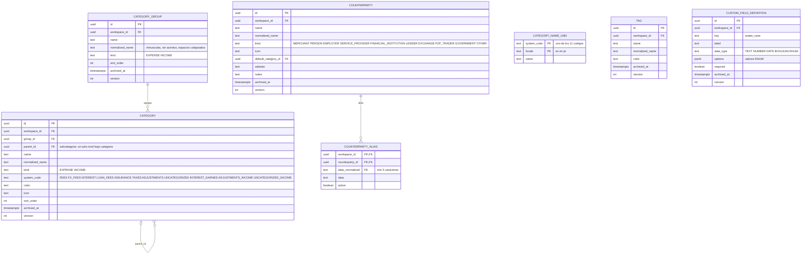
```mermaid
erDiagram
  CATEGORY_GROUP ||--o{ CATEGORY : "agrupa"
  CATEGORY |o--o{ CATEGORY : "parent_id"
  COUNTERPARTY ||--o{ COUNTERPARTY_ALIAS : "alias"
  CATEGORY_NAME_I18N {
    text system_code PK "uno de los 11 codigos"
    text locale PK "es en pt"
    text name
  }
  CATEGORY_GROUP {
    uuid id PK
    uuid workspace_id FK
    text name
    text normalized_name "minusculas, sin acentos, espacios colapsados"
    text kind "EXPENSE INCOME"
    int sort_order
    timestamptz archived_at
    int version
  }
  CATEGORY {
    uuid id PK
    uuid workspace_id FK
    uuid group_id FK
    uuid parent_id FK "subcategoria: un solo nivel bajo categoria"
    text name
    text normalized_name
    text kind "EXPENSE INCOME"
    text system_code "FEES FX_FEES INTEREST LOAN_FEES INSURANCE TAXES ADJUSTMENTS UNCATEGORIZED INTEREST_EARNED ADJUSTMENTS_INCOME UNCATEGORIZED_INCOME"
    text color
    text icon
    int sort_order
    timestamptz archived_at
    int version
  }
  TAG {
    uuid id PK
    uuid workspace_id FK
    text name
    text normalized_name
    text color
    timestamptz archived_at
    int version
  }
  CUSTOM_FIELD_DEFINITION {
    uuid id PK
    uuid workspace_id FK
    text key "snake_case"
    text label
    text data_type "TEXT NUMBER DATE BOOLEAN ENUM"
    jsonb options "valores ENUM"
    boolean required
    timestamptz archived_at
    int version
  }
  COUNTERPARTY {
    uuid id PK
    uuid workspace_id FK
    text name
    text normalized_name
    text kind "MERCHANT PERSON EMPLOYER SERVICE_PROVIDER FINANCIAL_INSTITUTION LENDER EXCHANGE P2P_TRADER GOVERNMENT OTHER"
    text icon
    uuid default_category_id FK
    text website
    text notes
    timestamptz archived_at
    int version
  }
  COUNTERPARTY_ALIAS {
    uuid workspace_id PK, FK
    uuid counterparty_id PK, FK
    text alias_normalized PK "min 3 caracteres"
    text alias
    boolean active
  }
```

| Tabla | Unique | Check | Índices | RLS | version / archivo |
|-------|--------|-------|---------|-----|-------------------|
| `category_group` | `(id, workspace_id)`; `(workspace_id, kind, normalized_name) WHERE archived_at IS NULL` | `kind IN ('EXPENSE','INCOME')` | — | WS | `version`, `archived_at` |
| `category` | `(id, workspace_id)`; `(workspace_id, group_id, coalesce(parent_id, '00000000-0000-0000-0000-000000000000'), normalized_name) WHERE archived_at IS NULL` (**único por padre**, D8); `(workspace_id, system_code) WHERE system_code IS NOT NULL` | `system_code IN (...)` (11 códigos, D9); una categoría de sistema no tiene padre (`category_system_no_parent`) ni puede estar archivada (`category_system_active`); `parent_id <> id`; trigger `classification.category_guard()`: `kind` = `kind` del grupo, el padre comparte `kind` y grupo (`CATEGORY_KIND_MISMATCH`), jerarquía de **3 niveles** grupo → categoría → subcategoría — una subcategoría no tiene hijas (`CATEGORY_DEPTH_EXCEEDED`) —, una categoría de sistema no tiene subcategorías ni se renombra ni archiva (`SYSTEM_CATEGORY_IMMUTABLE`), `kind` inmutable | `(workspace_id, parent_id)` | WS | `version`, `archived_at` |
| `category_name_i18n` | PK `(system_code, locale)` | `locale IN ('es','en','pt')` | — | **Global sin `workspace_id`** (excepción de §1.2): RLS forzada con política `global_read` (`SELECT` para `pf_app`); escritura solo por migración | Datos de referencia (33 filas: 11 códigos × 3 locales). La API resuelve el nombre de las categorías de sistema por el locale del usuario (fallback `es`) |
| `tag` | `(workspace_id, normalized_name) WHERE archived_at IS NULL` | — | — | WS | `version`, `archived_at` |
| `custom_field_definition` | `(id, workspace_id)`; `(workspace_id, key) WHERE archived_at IS NULL` | `key ~ '^[a-z][a-z0-9_]{0,39}$'`; `data_type IN ('TEXT','NUMBER','DECIMAL','DATE','BOOLEAN','SELECT')` (`SELECT` reemplaza al `ENUM` previsto); `target IN ('TRANSACTION','ACCOUNT')`; `jsonb_typeof(options)='array'` y `data_type='SELECT'` ⇔ al menos una opción (`[{key, label, position}]`) | `(workspace_id, key)` | WS (`pf_app`: `SELECT, INSERT, UPDATE`; sin DELETE: archivado suave, INV-019) | `version`, `archived_at` (as-built `add-custom-fields`) |
| `counterparty` | `(id, workspace_id)`; `(workspace_id, normalized_name) WHERE archived_at IS NULL` | `kind IN (...)` (default `OTHER`); FK compuesta `(default_category_id, workspace_id) → category` | *Planificado (Phase 6):* `gin (normalized_name gin_trgm_ops)` (fuzzy match, `pg_trgm`) — en Phase 1 la resolución es por subcadena sobre texto normalizado | WS | `version`, `archived_at` |
| `counterparty_alias` | PK `(workspace_id, counterparty_id, alias_normalized)`; `(workspace_id, alias_normalized) WHERE active` (`COUNTERPARTY_ALIAS_TAKEN`) | `length(alias_normalized) >= 3` | — | WS (`pf_app`: además `DELETE`, tabla de enlace) | — |

As-built `add-classification` (migración `20261003173000_classification_schema.sql`; rev. 2026-10-04, D7–D9): la unicidad de nombres usa `normalized_name` (minúsculas, sin acentos, espacios colapsados; la llena la aplicación) en lugar de `lower(name)`. **Nunca hay hard delete** de categorías, grupos, tags ni counterparties (D7, INV-019): `pf_app` solo tiene `SELECT, INSERT, UPDATE` y el borrado es archivar (`archived_at`, `archived_by`); `DELETE` sobre el recurso API ⇒ 405. Las categorías de sistema (11 `system_code`, D9) se provisionan por workspace, de forma síncrona al crearlo; su nombre visible sale de `category_name_i18n`.

### 5.6 `planning` — Periods, Budgets, Templates, Month closing (Phase 2)

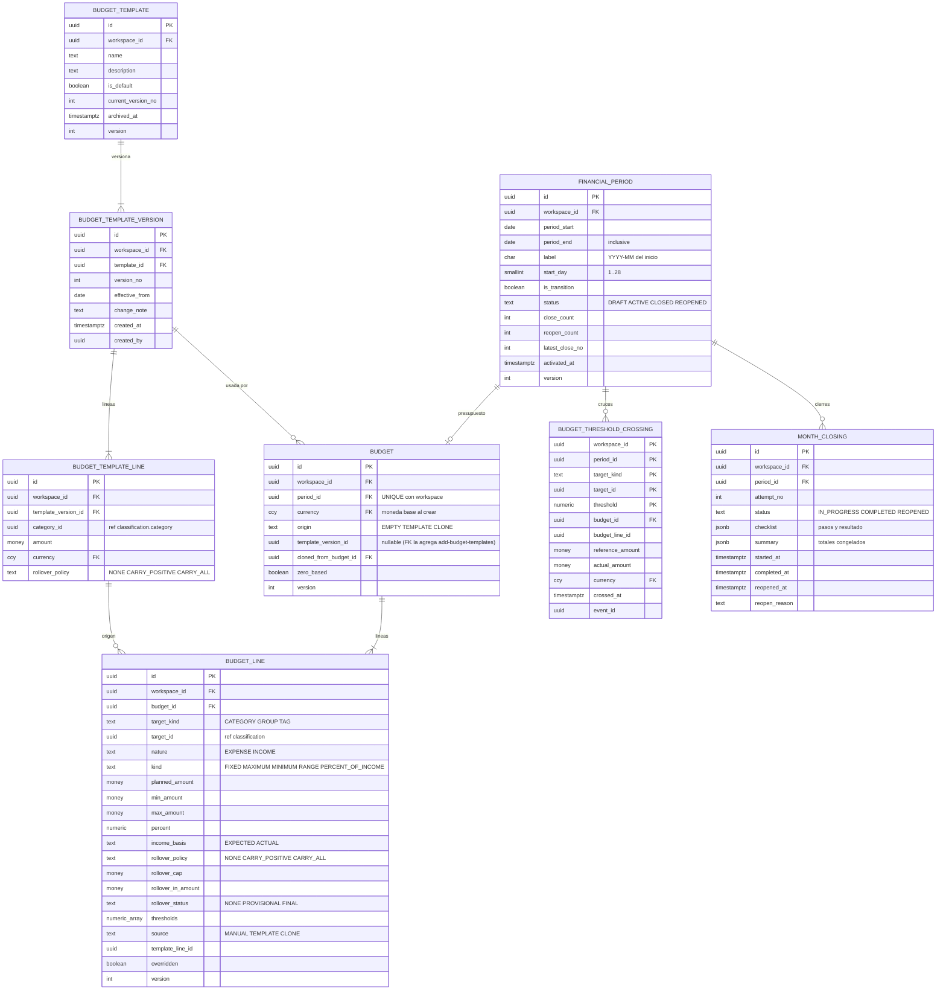
```mermaid
erDiagram
  BUDGET_TEMPLATE ||--|{ BUDGET_TEMPLATE_VERSION : "versiona"
  BUDGET_TEMPLATE_VERSION ||--|{ BUDGET_TEMPLATE_LINE : "lineas"
  FINANCIAL_PERIOD ||--o| BUDGET : "presupuesto"
  BUDGET_TEMPLATE_VERSION ||--o{ BUDGET : "usada por"
  BUDGET ||--|{ BUDGET_LINE : "lineas"
  BUDGET_TEMPLATE_LINE ||--o{ BUDGET_LINE : "origen"
  FINANCIAL_PERIOD ||--o{ BUDGET_THRESHOLD_CROSSING : "cruces"
  FINANCIAL_PERIOD ||--o{ MONTH_CLOSING : "cierres"
  FINANCIAL_PERIOD {
    uuid id PK
    uuid workspace_id FK
    date period_start
    date period_end "inclusive"
    char label "YYYY-MM del inicio"
    smallint start_day "1..28"
    boolean is_transition
    text status "DRAFT ACTIVE CLOSED REOPENED"
    int close_count
    int reopen_count
    int latest_close_no
    timestamptz activated_at
    int version
  }
  BUDGET_TEMPLATE {
    uuid id PK
    uuid workspace_id FK
    text name
    text description
    boolean is_default
    int current_version_no
    timestamptz archived_at
    int version
  }
  BUDGET_TEMPLATE_VERSION {
    uuid id PK
    uuid workspace_id FK
    uuid template_id FK
    int version_no
    date effective_from
    text change_note
    timestamptz created_at
    uuid created_by
  }
  BUDGET_TEMPLATE_LINE {
    uuid id PK
    uuid workspace_id FK
    uuid template_version_id FK
    uuid category_id "ref classification.category"
    money amount
    ccy currency FK
    text rollover_policy "NONE CARRY_POSITIVE CARRY_ALL"
  }
  BUDGET {
    uuid id PK
    uuid workspace_id FK
    uuid period_id FK "UNIQUE con workspace"
    ccy currency FK "moneda base al crear"
    text origin "EMPTY TEMPLATE CLONE"
    uuid template_version_id "nullable (FK la agrega add-budget-templates)"
    uuid cloned_from_budget_id FK
    boolean zero_based
    int version
  }
  BUDGET_LINE {
    uuid id PK
    uuid workspace_id FK
    uuid budget_id FK
    text target_kind "CATEGORY GROUP TAG"
    uuid target_id "ref classification"
    text nature "EXPENSE INCOME"
    text kind "FIXED MAXIMUM MINIMUM RANGE PERCENT_OF_INCOME"
    money planned_amount
    money min_amount
    money max_amount
    numeric percent
    text income_basis "EXPECTED ACTUAL"
    text rollover_policy "NONE CARRY_POSITIVE CARRY_ALL"
    money rollover_cap
    money rollover_in_amount
    text rollover_status "NONE PROVISIONAL FINAL"
    numeric_array thresholds
    text source "MANUAL TEMPLATE CLONE"
    uuid template_line_id
    boolean overridden
    int version
  }
  BUDGET_THRESHOLD_CROSSING {
    uuid workspace_id PK
    uuid period_id PK
    text target_kind PK
    uuid target_id PK
    numeric threshold PK
    uuid budget_id FK
    uuid budget_line_id
    money reference_amount
    money actual_amount
    ccy currency FK
    timestamptz crossed_at
    uuid event_id
  }
  MONTH_CLOSING {
    uuid id PK
    uuid workspace_id FK
    uuid period_id FK
    int attempt_no
    text status "IN_PROGRESS COMPLETED REOPENED"
    jsonb checklist "pasos y resultado"
    jsonb summary "totales congelados"
    timestamptz started_at
    timestamptz completed_at
    timestamptz reopened_at
    text reopen_reason
  }
```

| Tabla | Unique | Check | Índices | RLS | version / archivo |
|-------|--------|-------|---------|-----|-------------------|
| `financial_period` | `(workspace_id, label)` (árbitro de `ON CONFLICT DO NOTHING`); `(workspace_id, period_start)`; **EXCLUDE USING gist** `(workspace_id WITH =, daterange(period_start, period_end, '[]') WITH &&)` **DEFERRABLE INITIALLY DEFERRED** — sin solapamientos (`btree_gist`; diferible para recalcular DRAFT en sitio) | `period_end >= period_start`; `label = to_char(period_start,'YYYY-MM')`; `start_day` 1..28; `status IN (DRAFT, ACTIVE, CLOSED, REOPENED)`; trigger `planning.assert_period_range_frozen()` (rango inmutable fuera de `DRAFT`, `23514`) | `(workspace_id, status)`, `(workspace_id, period_start DESC)` | WS (`pf_app` sin `DELETE`) | `version` |
| `budget_template` | `(workspace_id, lower(btrim(name))) WHERE status = 'ACTIVE'`; `(workspace_id) WHERE is_default AND status = 'ACTIVE'` (a lo sumo un predeterminado activo; árbitro de las solicitudes concurrentes) | `status IN (ACTIVE, ARCHIVED)`; `NOT is_default OR status = 'ACTIVE'`; `current_version_no >= 1` | — | WS (`pf_app` sin `DELETE`: se archiva) | `version`, `archived_at` |
| `budget_template_version` | `(template_id, version_no)`; `(workspace_id, id)` | `version_no >= 1`; `based_on_version_no >= 1` | FK `(workspace_id, template_id)` | **WS-RO** (versiones inmutables, `forbid_mutation` PF003; cambiar template = nueva versión; as-built de `add-budget-templates`) | Inmutable |
| `budget_template_line` | `(template_version_id, target_kind, target_id)` — as-built generaliza `category_id` a `target_kind/target_id` (categoría, grupo o tag) y **no tiene `effective_from`** (la versión se elige al aplicar) | los mismos CHECKs de forma por tipo, montos y umbrales que `budget_line` (más `currency` FK a `fx.currency`) | `(workspace_id, target_kind, target_id)` | **WS-RO** (`forbid_mutation`) | Inmutable |
| `budget` (+ FK `template_version_id` → `budget_template_version`, `NOT VALID` + `VALIDATE`; índice parcial) | `(workspace_id, period_id)` — **un plan por periodo en la moneda base** (as-built de `add-budgets`, docs/33 D78; relajable a `(period, currency)` con un *expand*); `(workspace_id, id)` | `origin IN (EMPTY, TEMPLATE, CLONE)` | FK `(workspace_id, period_id)` → `financial_period` | WS (`pf_app` sin `DELETE`) | `version` |
| `budget_line` (+ FK `template_line_id` → `budget_template_line`) | `(budget_id, target_kind, target_id)` — sin objetivos repetidos; los solapados (categoría↔subcategoría, grupo↔categoría) los rechaza `TargetOverlapPolicy` | montos `>= 0`; `min <= max`; forma por tipo (`FIXED`/`MAXIMUM` ⇒ `planned_amount`; `MINIMUM` ⇒ `min_amount`; `RANGE` ⇒ ambos; `PERCENT_OF_INCOME` ⇒ `percent` en (0, 100] + `income_basis`); `cardinality(thresholds) <= 10`; ingresos solo `FIXED` sin umbrales ni rollover; `MINIMUM` sin umbrales; tags solo de gasto | `(workspace_id, target_kind, target_id)` | WS (con `DELETE`: las líneas son configuración, su historia está en el audit log) | `version` |
| `budget_threshold_crossing` | PK `(workspace_id, period_id, target_kind, target_id, threshold)` — el dedupe de "una sola vez" es por **objetivo**, no por línea | `0 < threshold <= 1000` | — | **WS-RO** (append-only, `forbid_mutation`; el hecho de umbral se emite en la misma transacción) | Inmutable |
| `close_snapshot` / `close_snapshot_balance` / `close_snapshot_without_statement` / `period_reopening` / `close_pending_notice` | `(period_id, close_no)`, `(period_id, reopen_no)`, `(workspace_id, period_id)` | — | — | WS-RO (`forbid_mutation`, PF003) | Reemplaza a `month_closing` (add-month-closing): una fila por cierre o reapertura, nunca se actualiza |

Los **actuals** del presupuesto no se guardan en `planning`. **As-built (Phase 2, `add-budgets`):** se derivan en cada lectura de la fuente de verdad (`SummarizeNominalFlows` de Transactions + `FlowValuation` del shared-kernel); `reporting.monthly_category_agg` / `reporting.budget_snapshot` (derivados, [14-reporting.md](14-reporting.md)) llegan con Phase 7. El `summary` del cierre congela los valores al cerrar (`BudgetVsActualQuery.getForPeriod`).

### 5.7 `commitments` — Recurrence engine & Subscriptions (Phase 3)

**Motor de recurrencia (`add-recurrence-engine`, expand-only).** Tres tablas en el schema `commitments`; nomenclatura canónica en [04](04-domain-model.md) §3.7/§4.4. Las suscripciones (`add-subscriptions`, más abajo) se apoyan en una definición administrada (`managed_by = 'SUBSCRIPTION'`). Ninguna tabla escribe en `ledger.*` ni en `txn.*`: la transacción de una ocurrencia la crea Transactions por su puerto público.

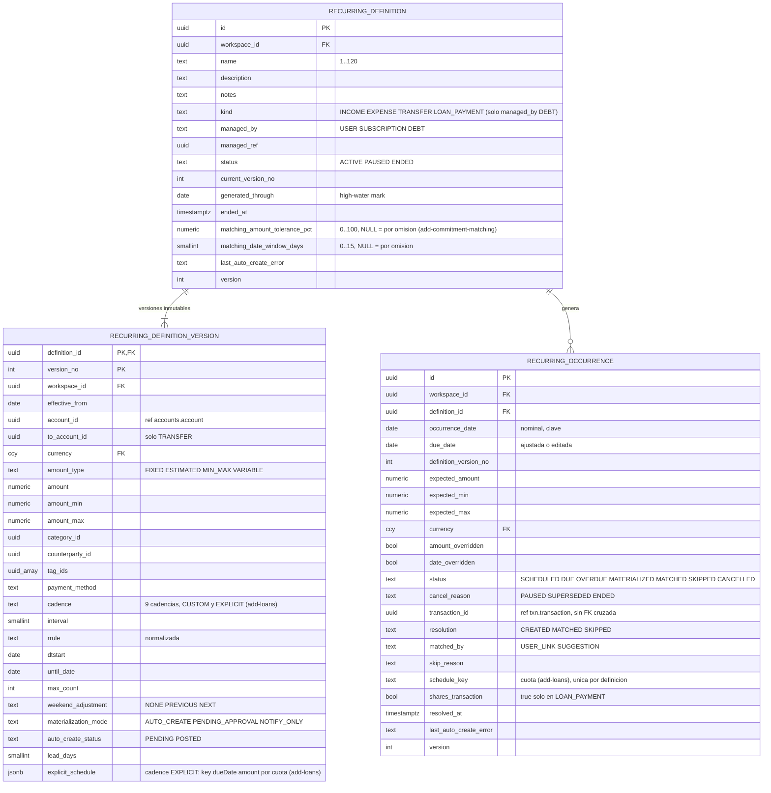
```mermaid
erDiagram
  RECURRING_DEFINITION ||--|{ RECURRING_DEFINITION_VERSION : "versiones inmutables"
  RECURRING_DEFINITION ||--o{ RECURRING_OCCURRENCE : "genera"
  RECURRING_DEFINITION {
    uuid id PK
    uuid workspace_id FK
    text name "1..120"
    text description
    text notes
    text kind "INCOME EXPENSE TRANSFER LOAN_PAYMENT (solo managed_by DEBT)"
    text managed_by "USER SUBSCRIPTION DEBT"
    uuid managed_ref
    text status "ACTIVE PAUSED ENDED"
    int current_version_no
    date generated_through "high-water mark"
    timestamptz ended_at
    numeric matching_amount_tolerance_pct "0..100, NULL = por omision (add-commitment-matching)"
    smallint matching_date_window_days "0..15, NULL = por omision"
    text last_auto_create_error
    int version
  }
  RECURRING_DEFINITION_VERSION {
    uuid definition_id PK, FK
    int version_no PK
    uuid workspace_id FK
    date effective_from
    uuid account_id "ref accounts.account"
    uuid to_account_id "solo TRANSFER"
    ccy currency FK
    text amount_type "FIXED ESTIMATED MIN_MAX VARIABLE"
    numeric amount
    numeric amount_min
    numeric amount_max
    uuid category_id
    uuid counterparty_id
    uuid_array tag_ids
    text payment_method
    text cadence "9 cadencias, CUSTOM y EXPLICIT (add-loans)"
    smallint interval
    text rrule "normalizada"
    date dtstart
    date until_date
    int max_count
    text weekend_adjustment "NONE PREVIOUS NEXT"
    text materialization_mode "AUTO_CREATE PENDING_APPROVAL NOTIFY_ONLY"
    text auto_create_status "PENDING POSTED"
    smallint lead_days
    jsonb explicit_schedule "cadence EXPLICIT: key dueDate amount por cuota (add-loans)"
  }
  RECURRING_OCCURRENCE {
    uuid id PK
    uuid workspace_id FK
    uuid definition_id FK
    date occurrence_date "nominal, clave"
    date due_date "ajustada o editada"
    int definition_version_no
    numeric expected_amount
    numeric expected_min
    numeric expected_max
    ccy currency FK
    bool amount_overridden
    bool date_overridden
    text status "SCHEDULED DUE OVERDUE MATERIALIZED MATCHED SKIPPED CANCELLED"
    text cancel_reason "PAUSED SUPERSEDED ENDED"
    uuid transaction_id "ref txn.transaction, sin FK cruzada"
    text resolution "CREATED MATCHED SKIPPED"
    text matched_by "USER_LINK SUGGESTION"
    text skip_reason
    text schedule_key "cuota (add-loans), unica por definicion"
    bool shares_transaction "true solo en LOAN_PAYMENT"
    timestamptz resolved_at
    text last_auto_create_error
    int version
  }
```

| Tabla | Unique | Check | Índices | RLS / grants | version / archivo |
|-------|--------|-------|---------|--------------|-------------------|
| `recurring_definition` | `(workspace_id, id)` | `kind IN ('INCOME','EXPENSE','TRANSFER')`; `managed_by IN ('USER','SUBSCRIPTION')` (add-subscriptions; `DEBT` con un expand cuando Debt administre definiciones) y `managed_ref` presente ⇔ `managed_by <> 'USER'`; `status IN ('ACTIVE','PAUSED','ENDED')`; `name` de 1 a 120 caracteres | `(workspace_id, status, generated_through) WHERE status = 'ACTIVE'` (scheduler) | WS; `pf_app`/`pf_worker` SELECT, INSERT, UPDATE; sin DELETE | `version`; sin archivo en Phase 3 (se filtra por estado, D128) |
| `recurring_definition_version` | PK `(definition_id, version_no)` | coherencia de `kind` (`to_account_id` presente ⇔ `TRANSFER`; en dominio y trigger liviano); montos según `amount_type` (> 0, `min <= max`); `until_date IS NULL OR max_count IS NULL`; `lead_days BETWEEN 0 AND 60`; `materialization_mode <> 'AUTO_CREATE' OR amount_type IN ('FIXED','ESTIMATED') OR indexed_amount IS NOT NULL`; `indexed_amount`/`indexed_currency` ambos o ninguno, solo con `amount_type = 'VARIABLE'` y en otra moneda que `currency` | PK | **WS-RO**: `pf_app`/`pf_worker` SELECT, INSERT; `platform.forbid_mutation()` (append-only) | Inmutable |
| `recurring_occurrence` | **`(definition_id, occurrence_date)`** — generación idempotente (`INSERT ... ON CONFLICT DO NOTHING`, INV-013); parcial `(workspace_id, transaction_id) WHERE status IN ('MATERIALIZED','MATCHED')` (una transacción resuelve a lo sumo una ocurrencia) | `status IN ('MATERIALIZED','MATCHED')` ⇔ `transaction_id IS NOT NULL`; `status = 'CANCELLED'` ⇔ `cancel_reason IS NOT NULL` | `(workspace_id, due_date) WHERE status IN ('SCHEDULED','DUE','OVERDUE')` (comprometido y próximos pagos); `(workspace_id, status, due_date)` (job) | WS; `pf_app`/`pf_worker` SELECT, INSERT, UPDATE; sin DELETE | `version` |

Las tres tablas se registran en `platform.workspace_scoped_table` (purga demo, ADR-0026) y declaran sección de portabilidad (`recurring-definitions`, `recurring-definition-versions`, `recurring-occurrences`, órdenes 750–752). **Defensa en profundidad en `txn.transaction`** (§5.4): índice único parcial `(workspace_id, external_ref_namespace, external_ref_id) WHERE external_ref_namespace = 'commitments.occurrence'`, creado con `CREATE UNIQUE INDEX CONCURRENTLY` en una migración separada: una transacción por ocurrencia aunque un bug reintente.

**Cuotas de préstamo (`add-loans`, expand-only; migración `20261011100200_commitments_loan_payment.sql`).** `recurring_definition.kind` admite `LOAN_PAYMENT` solo con `managed_by = 'DEBT'` (CHECK `recurring_definition_loan_payment_ck`; `managed_by` admite `DEBT`); `recurring_definition_version` gana `explicit_schedule jsonb` (`[{key, dueDate, amount}]`) y la cadencia `EXPLICIT`, que van juntas (XOR con la regla: sin RRULE, fin ni máximo, y solo `NOTIFY_ONLY`); `recurring_occurrence` gana `schedule_key` (única por definición) y `shares_transaction`, y el índice único de vinculación transacción ↔ ocurrencia pasa a ser parcial (`WHERE NOT shares_transaction`) para que un pago cubra varias cuotas de su préstamo. La transición `RELEASE` de la máquina de ocurrencias admite destino `SCHEDULED`. Las guardas del motor por `kind = LOAN_PAYMENT` (no por `managedBy`) responden `RECURRING_MANAGED_EXTERNALLY` con `details {managedBy, managedRef, scheduleKey}`; los filtros N7 (matcher, liberación por anulación, backfill) y `listResolvedOutflows` excluyen `LOAN_PAYMENT`; el comprometido y los próximos pagos incluyen las cuotas con el nombre del préstamo y el número de cuota.

**Matching sugerido (`add-commitment-matching`, expand-only).** Una tabla nueva en `commitments` y dos columnas nulas en `recurring_definition` (`matching_amount_tolerance_pct numeric(5,2)` 0..100 y `matching_date_window_days smallint` 0..15; `NULL` = valor por omisión del tipo de monto, D120). La sugerencia no escribe en `ledger.*` ni en `txn.*`: confirmar reutiliza el vínculo manual del motor.

| Tabla | Unique | Check | Índices | RLS / grants | version / archivo |
|-------|--------|-------|---------|--------------|-------------------|
| `occurrence_match_suggestion` | **`(occurrence_id, transaction_id)`** — idempotencia del consumidor (`INSERT ... ON CONFLICT DO NOTHING`, INV-028) y descarte permanente; `(workspace_id, id)` | `status IN ('PROPOSED','CONFIRMED','DISMISSED','EXPIRED')`; `status = 'EXPIRED'` ⇔ `expire_reason IS NOT NULL`; `confidence IN ('HIGH','MEDIUM','LOW')`; `score BETWEEN 0 AND 100`; `counterparty_match IN ('MATCH','UNKNOWN')`; `amount_delta >= 0` (NULL en `VARIABLE`); `CONFIRMED`/`DISMISSED` ⇔ `decided_at` presente | `(workspace_id, status, created_at) WHERE status = 'PROPOSED'`; `(workspace_id, score DESC, id) WHERE status = 'PROPOSED'` (bandeja); `(workspace_id, transaction_id)` | WS; `pf_app`/`pf_worker` SELECT, INSERT, UPDATE; sin DELETE | `version` |

Columnas: `id, workspace_id, occurrence_id, definition_id, transaction_id` (referencia lógica a `txn.transaction`, sin FK cruzada)`, score numeric(5,2), confidence, amount_delta numeric(38,18), currency, date_delta_days smallint, counterparty_match, ambiguous, status, expire_reason (TRANSACTION_VOIDED|OCCURRENCE_RESOLVED|OCCURRENCE_CANCELLED|INCOMPATIBLE|SUPERSEDED), source_event_id, created_at, decided_at, decided_by, version`. Se registra en `platform.workspace_scoped_table` (orden de purga 169, antes que las ocurrencias) y declara la sección de portabilidad `occurrence-match-suggestions` (orden 765, después de las de suscripciones 760–764; remapea `occurrence_id`, `definition_id` y `transaction_id`).

**Suscripciones (`add-subscriptions`, expand-only).** Cinco tablas más en el mismo schema; una suscripción tiene **id propio** y `UNIQUE (definition_id)` (antes se modelaba con PK = `definition_id`; la cadencia vive en la definición, por eso `billing_cycle` desaparece), estados `TRIAL|ACTIVE|PAUSED|CANCELLED` (sin `pending_cancellation` ni `expired`: la cancelación programada es el atributo `scheduled_cancellation_on`). Dos columnas nuevas en `recurring_definition_version`: `indexed_amount` e `indexed_currency` (precio en otra moneda que la cuenta; la plantilla queda `VARIABLE` y cada ocurrencia estima `precio × tasa de valoración vigente al generarla`), y el CHECK de `managed_by` pasa a `IN ('USER','SUBSCRIPTION')` con `managed_ref` obligatorio si no es `USER`.

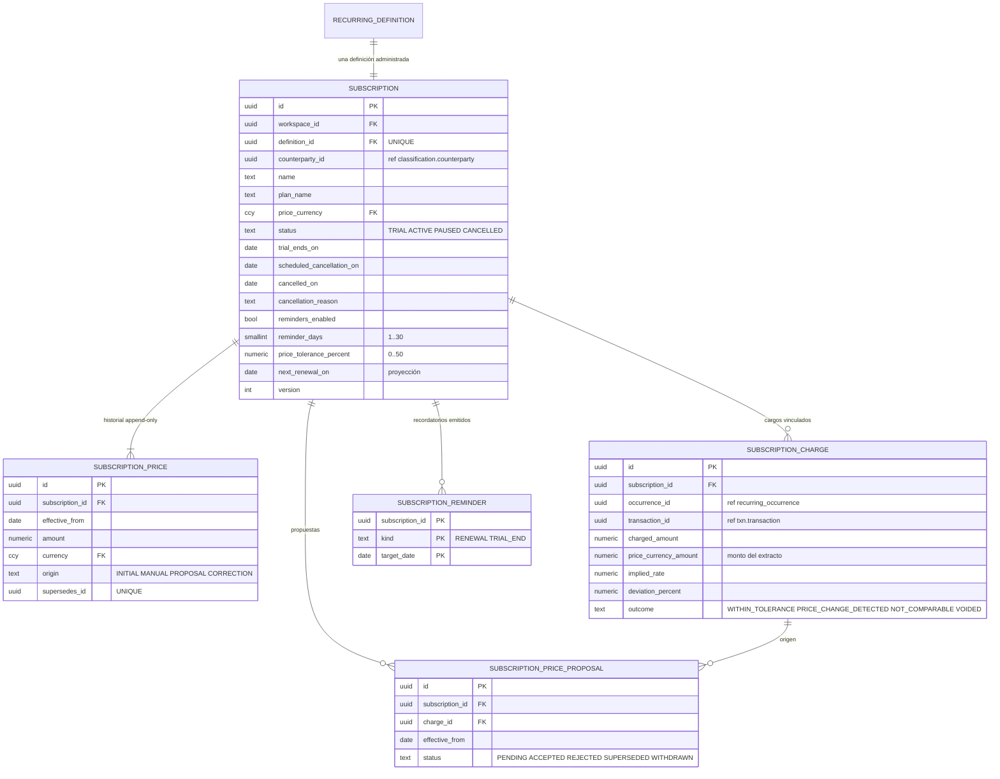
```mermaid
erDiagram
  RECURRING_DEFINITION ||--|| SUBSCRIPTION : "una definición administrada"
  SUBSCRIPTION ||--|{ SUBSCRIPTION_PRICE : "historial append-only"
  SUBSCRIPTION ||--o{ SUBSCRIPTION_CHARGE : "cargos vinculados"
  SUBSCRIPTION ||--o{ SUBSCRIPTION_PRICE_PROPOSAL : "propuestas"
  SUBSCRIPTION_CHARGE ||--o{ SUBSCRIPTION_PRICE_PROPOSAL : "origen"
  SUBSCRIPTION ||--o{ SUBSCRIPTION_REMINDER : "recordatorios emitidos"
  SUBSCRIPTION {
    uuid id PK
    uuid workspace_id FK
    uuid definition_id FK "UNIQUE"
    uuid counterparty_id "ref classification.counterparty"
    text name
    text plan_name
    ccy price_currency FK
    text status "TRIAL ACTIVE PAUSED CANCELLED"
    date trial_ends_on
    date scheduled_cancellation_on
    date cancelled_on
    text cancellation_reason
    bool reminders_enabled
    smallint reminder_days "1..30"
    numeric price_tolerance_percent "0..50"
    date next_renewal_on "proyección"
    int version
  }
  SUBSCRIPTION_PRICE {
    uuid id PK
    uuid subscription_id FK
    date effective_from
    numeric amount
    ccy currency FK
    text origin "INITIAL MANUAL PROPOSAL CORRECTION"
    uuid supersedes_id "UNIQUE"
  }
  SUBSCRIPTION_CHARGE {
    uuid id PK
    uuid subscription_id FK
    uuid occurrence_id "ref recurring_occurrence"
    uuid transaction_id "ref txn.transaction"
    numeric charged_amount
    numeric price_currency_amount "monto del extracto"
    numeric implied_rate
    numeric deviation_percent
    text outcome "WITHIN_TOLERANCE PRICE_CHANGE_DETECTED NOT_COMPARABLE VOIDED"
  }
  SUBSCRIPTION_PRICE_PROPOSAL {
    uuid id PK
    uuid subscription_id FK
    uuid charge_id FK
    date effective_from
    text status "PENDING ACCEPTED REJECTED SUPERSEDED WITHDRAWN"
  }
  SUBSCRIPTION_REMINDER {
    uuid subscription_id PK
    text kind PK "RENEWAL TRIAL_END"
    date target_date PK
  }
```

| Tabla | Unique | Check | Índices | RLS / grants | version / archivo |
|-------|--------|-------|---------|--------------|-------------------|
| `subscription` | `(workspace_id, id)`; `(definition_id)` | `status IN ('TRIAL','ACTIVE','PAUSED','CANCELLED')`; `TRIAL` ⇒ `trial_ends_on`; `CANCELLED` ⇔ `cancelled_on`; `CANCELLED` ⇒ sin cancelación programada; `reminder_days BETWEEN 1 AND 30`; `price_tolerance_percent BETWEEN 0 AND 50` | `(workspace_id, status, next_renewal_on)` | WS; `pf_app`/`pf_worker` SELECT, INSERT, UPDATE; sin DELETE | `version`; sin archivo (se cancela, nunca se borra) |
| `subscription_price` | `(supersedes_id)` — un solo reemplazo por entrada | `amount > 0`; `origin = 'CORRECTION'` ⇔ `supersedes_id IS NOT NULL` | `(subscription_id, effective_from)` | **WS-RO**: SELECT, INSERT; `platform.forbid_mutation()` | Inmutable (append-only) |
| `subscription_charge` | parcial `(subscription_id, occurrence_id) WHERE outcome <> 'VOIDED'` — un cargo vigente por ocurrencia (idempotencia de negocio de la detección) | `charged_amount > 0`; `expected_amount > 0`; `outcome IN (...)` | `(workspace_id, transaction_id)`; `(subscription_id, occurrence_date DESC)` | WS; SELECT, INSERT, UPDATE | — |
| `subscription_price_proposal` | `(subscription_id, effective_from)`; parcial `(subscription_id) WHERE status = 'PENDING'` — a lo sumo una pendiente | `ACCEPTED|REJECTED` ⇔ `decided_at` | — | WS; SELECT, INSERT, UPDATE | — |
| `subscription_reminder` | PK `(workspace_id, subscription_id, kind, target_date)` — exactamente una vez por fecha | — | PK | **WS-RO**: SELECT, INSERT; `forbid_mutation` | Append-only |

Las cinco tablas se registran en `platform.workspace_scoped_table` (órdenes 161–165: se purgan antes que las definiciones) y declaran sección de portabilidad (`subscriptions`, `subscription-prices`, `subscription-charges`, `subscription-price-proposals`, `subscription-reminders`, órdenes 760–764; `managed_ref`, `supersedes_id`, `proposal_id` y `charge_id` se remapean con el mapa de ids). `audit.lifecycle_state_divergences()` cubre también `Subscription`.

### 5.8 `goals` — Savings goals (Phase 4)

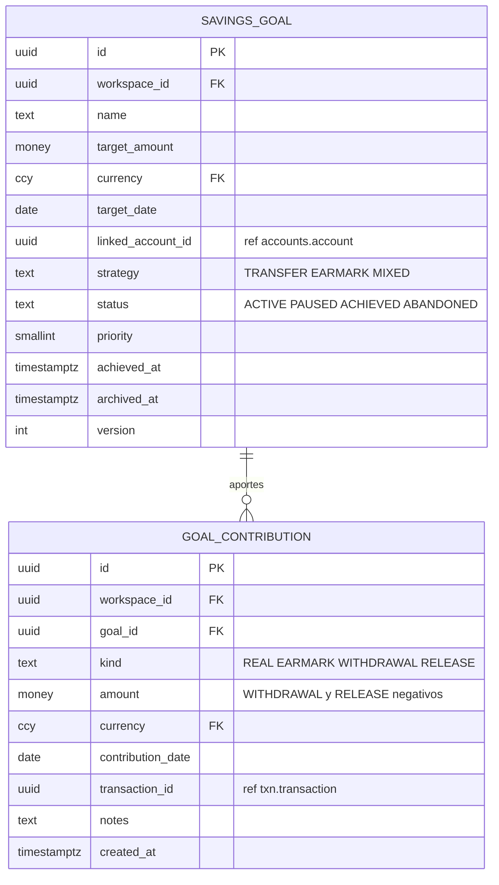
```mermaid
erDiagram
  SAVINGS_GOAL ||--o{ GOAL_CONTRIBUTION : "aportes"
  SAVINGS_GOAL {
    uuid id PK
    uuid workspace_id FK
    text name
    money target_amount
    ccy currency FK
    date target_date
    uuid linked_account_id "ref accounts.account"
    text strategy "TRANSFER EARMARK MIXED"
    text status "ACTIVE PAUSED ACHIEVED ABANDONED"
    smallint priority
    timestamptz achieved_at
    timestamptz archived_at
    int version
  }
  GOAL_CONTRIBUTION {
    uuid id PK
    uuid workspace_id FK
    uuid goal_id FK
    text kind "REAL EARMARK WITHDRAWAL RELEASE"
    money amount "WITHDRAWAL y RELEASE negativos"
    ccy currency FK
    date contribution_date
    uuid transaction_id "ref txn.transaction"
    text notes
    timestamptz created_at
  }
```

| Tabla | Unique | Check | Índices | RLS | version / archivo |
|-------|--------|-------|---------|-----|-------------------|
| `savings_goal` | `(workspace_id, lower(name)) WHERE archived_at IS NULL` | `target_amount > 0`; `strategy IN ('TRANSFER','MIXED')` ⇒ `linked_account_id IS NOT NULL` | — | WS | `version`, `archived_at` |
| `goal_contribution` | `(transaction_id) WHERE transaction_id IS NOT NULL` | `kind IN ('REAL','WITHDRAWAL')` ⇔ `transaction_id IS NOT NULL` (04 §5); `kind IN ('WITHDRAWAL','RELEASE')` ⇔ `amount < 0` | `(workspace_id, goal_id, contribution_date)` | **WS-RO** (corrección = contribución inversa) | Append-only |

### 5.9 `debt` — Loans, amortization, credit cards (Phase 4)

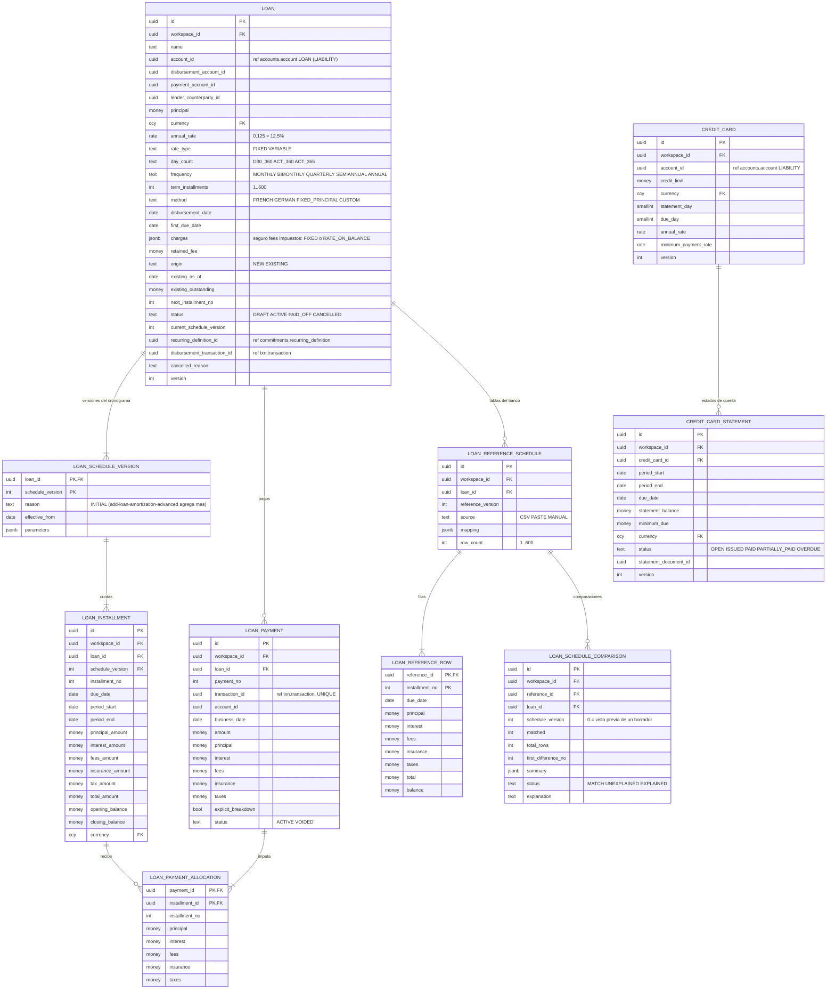
```mermaid
erDiagram
  LOAN ||--|{ LOAN_SCHEDULE_VERSION : "versiones del cronograma"
  LOAN_SCHEDULE_VERSION ||--|{ LOAN_INSTALLMENT : "cuotas"
  LOAN ||--o{ LOAN_PAYMENT : "pagos"
  LOAN_PAYMENT ||--|{ LOAN_PAYMENT_ALLOCATION : "imputa"
  LOAN_INSTALLMENT ||--o{ LOAN_PAYMENT_ALLOCATION : "recibe"
  LOAN ||--o{ LOAN_REFERENCE_SCHEDULE : "tablas del banco"
  LOAN_REFERENCE_SCHEDULE ||--|{ LOAN_REFERENCE_ROW : "filas"
  LOAN_REFERENCE_SCHEDULE ||--o{ LOAN_SCHEDULE_COMPARISON : "comparaciones"
  CREDIT_CARD ||--o{ CREDIT_CARD_STATEMENT : "estados de cuenta"
  LOAN {
    uuid id PK
    uuid workspace_id FK
    text name
    uuid account_id "ref accounts.account LOAN (LIABILITY)"
    uuid disbursement_account_id
    uuid payment_account_id
    uuid lender_counterparty_id
    money principal
    ccy currency FK
    rate annual_rate "0.125 = 12.5%"
    text rate_type "FIXED VARIABLE"
    text day_count "D30_360 ACT_360 ACT_365"
    text frequency "MONTHLY BIMONTHLY QUARTERLY SEMIANNUAL ANNUAL"
    int term_installments "1..600"
    text method "FRENCH GERMAN FIXED_PRINCIPAL CUSTOM"
    date disbursement_date
    date first_due_date
    jsonb charges "seguro fees impuestos: FIXED o RATE_ON_BALANCE"
    money retained_fee
    text origin "NEW EXISTING"
    date existing_as_of
    money existing_outstanding
    int next_installment_no
    text status "DRAFT ACTIVE PAID_OFF CANCELLED"
    int current_schedule_version
    uuid recurring_definition_id "ref commitments.recurring_definition"
    uuid disbursement_transaction_id "ref txn.transaction"
    text cancelled_reason
    int version
  }
  LOAN_SCHEDULE_VERSION {
    uuid loan_id PK, FK
    int schedule_version PK
    text reason "INITIAL (add-loan-amortization-advanced agrega mas)"
    date effective_from
    jsonb parameters
  }
  LOAN_INSTALLMENT {
    uuid id PK
    uuid workspace_id FK
    uuid loan_id FK
    int schedule_version FK
    int installment_no
    date due_date
    date period_start
    date period_end
    money principal_amount
    money interest_amount
    money fees_amount
    money insurance_amount
    money tax_amount
    money total_amount
    money opening_balance
    money closing_balance
    ccy currency FK
  }
  LOAN_PAYMENT {
    uuid id PK
    uuid workspace_id FK
    uuid loan_id FK
    int payment_no
    uuid transaction_id "ref txn.transaction, UNIQUE"
    uuid account_id
    date business_date
    money amount
    money principal
    money interest
    money fees
    money insurance
    money taxes
    bool explicit_breakdown
    text status "ACTIVE VOIDED"
  }
  LOAN_PAYMENT_ALLOCATION {
    uuid payment_id PK, FK
    uuid installment_id PK, FK
    int installment_no
    money principal
    money interest
    money fees
    money insurance
    money taxes
  }
  LOAN_REFERENCE_SCHEDULE {
    uuid id PK
    uuid workspace_id FK
    uuid loan_id FK
    int reference_version
    text source "CSV PASTE MANUAL"
    jsonb mapping
    int row_count "1..600"
  }
  LOAN_REFERENCE_ROW {
    uuid reference_id PK, FK
    int installment_no PK
    date due_date
    money principal
    money interest
    money fees
    money insurance
    money taxes
    money total
    money balance
  }
  LOAN_SCHEDULE_COMPARISON {
    uuid id PK
    uuid workspace_id FK
    uuid reference_id FK
    uuid loan_id FK
    int schedule_version "0 = vista previa de un borrador"
    int matched
    int total_rows
    int first_difference_no
    jsonb summary
    text status "MATCH UNEXPLAINED EXPLAINED"
    text explanation
  }
  CREDIT_CARD {
    uuid id PK
    uuid workspace_id FK
    uuid account_id "ref accounts.account LIABILITY"
    money credit_limit
    ccy currency FK
    smallint statement_day
    smallint due_day
    rate annual_rate
    rate minimum_payment_rate
    int version
  }
  CREDIT_CARD_STATEMENT {
    uuid id PK
    uuid workspace_id FK
    uuid credit_card_id FK
    date period_start
    date period_end
    date due_date
    money statement_balance
    money minimum_due
    ccy currency FK
    text status "OPEN ISSUED PAID PARTIALLY_PAID OVERDUE"
    uuid statement_document_id
    int version
  }
```

| Tabla | Unique | Check | Índices | RLS | version / archivo |
|-------|--------|-------|---------|-----|-------------------|
| `loan` | `(workspace_id, id)`; **parcial `(workspace_id, account_id) WHERE status <> 'CANCELLED'`** | `principal > 0`; `annual_rate >= 0`; `term_installments BETWEEN 1 AND 600`; `first_due_date > disbursement_date` (salvo `origin = 'EXISTING'`); `status IN ('DRAFT','ACTIVE','PAID_OFF','CANCELLED')`; `method IN ('FRENCH','GERMAN','FIXED_PRINCIPAL','CUSTOM')` (`FIXED_PRINCIPAL` reemplaza a `BULLET`); `origin` ⇔ campos `existing_*`; `ACTIVE`/`PAID_OFF` ⇔ `current_schedule_version` | `(workspace_id, status)` | WS | `version` (reemplaza `term_months`, `start_date` y `amortization_method` del diseño previo) |
| `loan_schedule_version` | PK `(loan_id, schedule_version)` | `reason IN ('INITIAL')` en este change | — | **WS-RO** | Append-only (`forbid_mutation`); `add-loan-amortization-advanced` agrega versiones |
| `loan_installment` | **`(loan_id, schedule_version, installment_no)`**; `(workspace_id, id)` | `total_amount = principal_amount + interest_amount + fees_amount + insurance_amount + tax_amount`; todos `>= 0`; FK a `loan_schedule_version` | — | **WS-RO** | Append-only: la cuota **no** guarda estado ni `paid_transaction_id` (lo reemplazan las imputaciones); el estado `UNPAID`/`PARTIALLY_PAID`/`PAID` y `DUE`/`OVERDUE` se derivan |
| `loan_payment` | `(transaction_id)`; `(loan_id, payment_no)`; `(workspace_id, id)` | `amount = principal + interest + fees + insurance + taxes` (INV-016); `status IN ('ACTIVE','VOIDED')`; `VOIDED` ⇔ `voided_at` | `(loan_id, status, business_date)`; `(workspace_id, business_date) WHERE status = 'ACTIVE'` | WS | Una fila por pago; solo cambia al anularse (reemplaza al modelo previo `loan_schedule_change`, que llega con `add-loan-amortization-advanced`) |
| `loan_payment_allocation` | PK `(payment_id, installment_id)` | componentes `>= 0` | `(loan_id, installment_no)` | **WS-RO** | Append-only; el estado de la cuota se deriva de las imputaciones de pagos `ACTIVE` |
| `loan_reference_schedule` | `(loan_id, reference_version)`; `(workspace_id, id)` | `source IN ('CSV','PASTE','MANUAL')`; `row_count BETWEEN 1 AND 600` | — | **WS-RO** | Append-only; el archivo original NO se guarda |
| `loan_reference_row` | PK `(reference_id, installment_no)` | montos `>= 0` | — | **WS-RO** | Append-only |
| `loan_schedule_comparison` | `(reference_id, schedule_version)` | `status IN ('MATCH','UNEXPLAINED','EXPLAINED')`; `EXPLAINED` ⇔ `explanation` (1..1000 caracteres); `schedule_version >= 0` (0 = vista previa de un borrador) | — | WS | `UPDATE` solo para explicar |
| `credit_card` | `(workspace_id, id)`; parcial `(workspace_id, lower(name)) WHERE status = 'ACTIVE'` | `limit_mode = 'SHARED'` ⇔ límite compartido presente; `cardinality(utilization_thresholds) BETWEEN 1 AND 3`; `reminder_days BETWEEN 1 AND 30` | `(workspace_id, status)` | WS | `version` (as-built `add-credit-cards`) |
| `credit_card_terms` | PK `(card_id, seq)` | `statement_day`/`due_day BETWEEN 1 AND 31` (ya no 1..28) | — | **WS-RO** | Append-only (`forbid_mutation`); la primera versión rige desde siempre |
| `credit_card_account` | `(card_id, currency)`; **parcial `(workspace_id, account_id) WHERE card_status = 'ACTIVE'`** | regla de mínimo coherente (`PERCENT` 0.01–100 con piso opcional | `FIXED` > 0); plan completo o ausente | `(workspace_id, account_id)` | WS | `version`; `card_status` denormalizado |
| `card_statement` | `(card_account_id, closing_date)` (emisión única) | `due_date >= closing_date`; `billed_balance = closing_balance - unbilled_installments`; `UPDATE` solo de `status`, `reported_*` y `version` | `(workspace_id, due_date)` | WS | Reemplaza a `credit_card_statement` |
| `card_installment_plan` / `card_installment` | parcial `(workspace_id, purchase_transaction_id) WHERE status <> 'CANCELLED'`; PK `(plan_id, n)` | `installment_count BETWEEN 2 AND 60`; `total = principal + interest` | `(workspace_id, billing_closing_date)` | WS | Cuotas no facturadas reasignables |
| `card_utilization_state` | PK `(card_id, scope_key, threshold)` | — | — | WS | Umbral armado o desarmado |
| `card_utilization_crossing`, `card_reminder` | PK `(card_id, scope_key, threshold, crossing_no)`; PK `(workspace_id, card_account_id, closing_date)` | — | — | **WS-RO** | Append-only |

**As-built Phase 4 (`add-loans`, migración `20261011100000_debt_schema.sql`).** Se crean las 8 tablas de préstamos (`loan`, `loan_schedule_version`, `loan_installment`, `loan_payment`, `loan_payment_allocation`, `loan_reference_schedule`, `loan_reference_row`, `loan_schedule_comparison`) con RLS forzada por `workspace_id`, registradas en `platform.workspace_scoped_table` y con `forbid_mutation` (PF003) en versión, cuotas, imputaciones, referencias y filas; cuenta, contraparte, transacción y definición recurrente son referencias lógicas, sin FK entre schemas. Portabilidad: secciones `loans`, `loan-schedule-versions`, `loan-installments`, `loan-payments`, `loan-payment-allocations`, `loan-reference-schedules`, `loan-reference-rows` y `loan-schedule-comparisons` (órdenes 780–787). Las tablas de tarjetas llegan con `add-credit-cards` (abajo). Expand en otros contextos: ver §5.4 (kinds `LOAN_*`, `loan_payment_breakdown`, `assert_splits_sum`) y §5.7 (`LOAN_PAYMENT`, `explicit_schedule`, `schedule_key`).

**As-built Phase 4 (`add-credit-cards`, migración `20261012110000_debt_credit_cards.sql`).** Nueve tablas en `debt` con RLS forzada, grants mínimos (`UPDATE` por columnas en `card_statement`), `forbid_mutation` en `credit_card_terms`, `card_utilization_crossing` y `card_reminder`, registradas en `platform.workspace_scoped_table` (purga 190–194) y exportables (secciones `credit-cards`, `credit-card-terms`, `credit-card-accounts`, `card-statements`, `card-installment-plans`, `card-installments`, `card-utilization-states`, `card-utilization-crossings` y `card-reminders`, órdenes 788–796). La tarjeta ya no tiene `account_id` (las cuentas viven en `credit_card_account`, una por moneda) ni el rango 1..28 de `statement_day`. Expand en COMMITMENTS (`20261012100000_commitments_card_payment.sql`, §5.7): `kind` admite `CARD_PAYMENT` solo con `managed_by = 'DEBT'` y `AUTO_CREATE` con monto `VARIABLE` es válido para ese tipo. `txn.transaction.kind`: `CARD_PAYMENT` sigue reservado sin uso (D177).

### 5.10 `fx` — Currencies & market data (Phase 1 manual / Phase 5 providers)

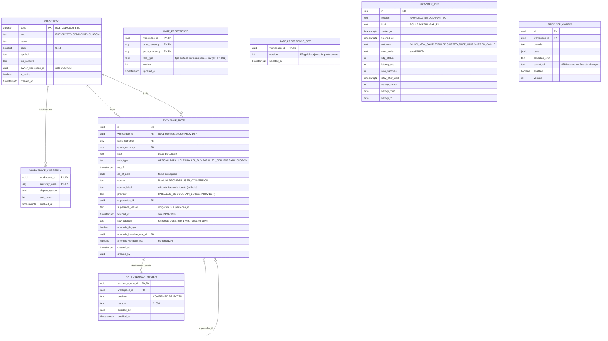
```mermaid
erDiagram
  CURRENCY ||--o{ WORKSPACE_CURRENCY : "habilitada en"
  CURRENCY ||--o{ EXCHANGE_RATE : "base"
  CURRENCY ||--o{ EXCHANGE_RATE : "quote"
  EXCHANGE_RATE |o--o| EXCHANGE_RATE : "supersedes_id"
  EXCHANGE_RATE ||--o| RATE_ANOMALY_REVIEW : "decision del usuario"
  CURRENCY {
    varchar code PK "BOB USD USDT BTC"
    text kind "FIAT CRYPTO COMMODITY CUSTOM"
    text name
    smallint scale "0..18"
    text symbol
    text iso_numeric
    uuid owner_workspace_id "solo CUSTOM"
    boolean is_active
    timestamptz created_at
  }
  WORKSPACE_CURRENCY {
    uuid workspace_id PK, FK
    ccy currency_code PK, FK
    text display_symbol
    int sort_order
    timestamptz enabled_at
  }
  RATE_PREFERENCE {
    uuid workspace_id PK, FK
    ccy base_currency PK, FK
    ccy quote_currency PK, FK
    text rate_type "tipo de tasa preferido para el par (FR-FX-002)"
    int version
    timestamptz updated_at
  }
  RATE_PREFERENCE_SET {
    uuid workspace_id PK, FK
    int version "ETag del conjunto de preferencias"
    timestamptz updated_at
  }
  EXCHANGE_RATE {
    uuid id PK
    uuid workspace_id FK "NULL solo para source PROVIDER"
    ccy base_currency FK
    ccy quote_currency FK
    rate rate "quote por 1 base"
    text rate_type "OFFICIAL PARALLEL PARALLEL_BUY PARALLEL_SELL P2P BANK CUSTOM"
    timestamptz as_of
    date as_of_date "fecha de negocio"
    text source "MANUAL PROVIDER USER_CONVERSION"
    text source_label "etiqueta libre de la fuente (nullable)"
    text provider "PARALELO_BO DOLARAPI_BO (solo PROVIDER)"
    uuid supersedes_id FK
    text supersede_reason "obligatoria si supersedes_id"
    timestamptz fetched_at "solo PROVIDER"
    text raw_payload "respuesta cruda, max 1 MiB, nunca en la API"
    boolean anomaly_flagged
    uuid anomaly_baseline_rate_id FK
    numeric anomaly_variation_pct "numeric(12,4)"
    timestamptz created_at
    uuid created_by
  }
  RATE_ANOMALY_REVIEW {
    uuid exchange_rate_id PK, FK
    uuid workspace_id FK
    text decision "CONFIRMED REJECTED"
    text reason "3..500"
    uuid decided_by
    timestamptz decided_at
  }
  PROVIDER_RUN {
    uuid id PK
    text provider "PARALELO_BO DOLARAPI_BO"
    text kind "POLL BACKFILL GAP_FILL"
    timestamptz started_at
    timestamptz finished_at
    text outcome "OK NO_NEW_SAMPLE FAILED SKIPPED_RATE_LIMIT SKIPPED_CACHE"
    text error_code "solo FAILED"
    int http_status
    int latency_ms
    int new_samples
    timestamptz retry_after_until
    int history_points
    date history_from
    date history_to
  }
  PROVIDER_CONFIG {
    uuid id PK
    uuid workspace_id FK
    text provider
    jsonb pairs
    text schedule_cron
    text secret_ref "ARN o clave en Secrets Manager"
    boolean enabled
    int version
  }
```

| Tabla | Unique | Check | Índices | RLS | version / archivo |
|-------|--------|-------|---------|-----|-------------------|
| `currency` | PK `code`; `(owner_workspace_id, lower(name)) WHERE kind='CUSTOM'` | `scale BETWEEN 0 AND 18`; `kind='CUSTOM'` ⇔ `owner_workspace_id IS NOT NULL`; `code ~ '^[A-Z0-9][A-Z0-9_.-]{1,15}$'` | — | **WS+G** (`owner_workspace_id`). As-built Phase 1: tabla global sin RLS, solo `SELECT` para `pf_app` (aún no hay monedas `CUSTOM`) | `is_active` (no se borra; `scale` inmutable: trigger `currency_scale_immutable`) |
| `workspace_currency` | PK | — | — | WS | — |
| `rate_preference` | PK `(workspace_id, base_currency, quote_currency)`; `(workspace_id, least(base, quote), greatest(base, quote))` (una preferencia por par sin importar la orientación) | `base_currency <> quote_currency`; `rate_type IN (...)` (los 7 tipos) | — | WS (`pf_app`: `SELECT, INSERT, UPDATE, DELETE`) | `version` |
| `rate_preference_set` | PK `workspace_id` | — | — | WS | `version`: concurrencia optimista del reemplazo completo de las preferencias del workspace |
| `exchange_rate` | **As-built (add-manual-conversions y add-market-rate-providers; rev. 2026-10-04):** `exchange_rate_provider_uk (workspace_id, provider, base_currency, quote_currency, rate_type, as_of) WHERE provider IS NOT NULL` (idempotencia de muestras: una copia por workspace, design decisión 3); `UNIQUE (supersedes_id)` | `base_currency <> quote_currency`; `rate > 0`; `rate_type IN ('OFFICIAL','PARALLEL','PARALLEL_BUY','PARALLEL_SELL','P2P','BANK','CUSTOM')` (D13 + D39; `PARALLEL_BUY` = BOB pagados por 1 USD, `PARALLEL_SELL` = BOB recibidos, ambos junto con la mediana `PARALLEL`); `source IN ('MANUAL','PROVIDER','USER_CONVERSION')`; `workspace_id IS NOT NULL OR source='PROVIDER'`; `supersedes_id` ⇔ `supersede_reason` (3–500) y la corrección conserva par, tipo y `as_of` (trigger `exchange_rate_supersede_consistency`); `provider IN ('PARALELO_BO','DOLARAPI_BO')`; `(source = 'PROVIDER') = (provider IS NOT NULL)`; provider ⇔ `fetched_at`; marca de anomalía completa (`anomaly_flagged`, `anomaly_baseline_rate_id` → FK compuesta al mismo workspace, `anomaly_variation_pct numeric(12,4)`); `raw_payload text` (respuesta cruda exacta, ≤ 1 MiB, nunca expuesta en la API) | `(base_currency, quote_currency, as_of DESC)` + `(workspace_id, base_currency, quote_currency, as_of DESC)` + `exchange_rate_provider_day_idx (workspace_id, provider, base, quote, rate_type, as_of_date)` (relleno de días) | **WS+G**, append-only (sin UPDATE/DELETE para nadie; corrección = nueva fila con `supersedes_id`); el worker (`pf_worker`, miembro de `pf_app`) inserta las de provider con `SET LOCAL app.workspace_id` | Inmutable |
| `rate_anomaly_review` | PK `exchange_rate_id`; FK `(workspace_id, exchange_rate_id)` | `decision IN ('CONFIRMED','REJECTED')`; `reason` 3–500; trigger: solo tasas con `anomaly_flagged` | — | **WS**, append-only (`SELECT, INSERT`) | Inmutable (una decisión por tasa; add-market-rate-providers) |
| `provider_run` | PK `id` | `provider IN ('PARALELO_BO','DOLARAPI_BO')`; `kind IN ('POLL','BACKFILL','GAP_FILL')`; `outcome IN ('OK','NO_NEW_SAMPLE','FAILED','SKIPPED_RATE_LIMIT','SKIPPED_CACHE')`; `FAILED` ⇔ `error_code`; `history_points/from/to` (carga histórica) | `(provider, started_at DESC)`, `(started_at)` | **Instalación sin `workspace_id`** (excepción explícita de §1): RLS FORZADA con políticas por rol — `pf_app` SELECT (estado), `pf_worker` INSERT/DELETE (bitácora y purga > 90 días) | Bitácora (purga) |
| `provider_config` | `(workspace_id, provider)` | — | — | WS | `version` (Phase 5, aún no creada) |

Catálogo inicial de monedas globales (`BOB`, `USD`, `USDT`, `USDC`, `EUR`, `BTC`, `ETH`, …) se carga como **migración de datos de referencia**, no como seed (§12). Pregunta abierta: códigos de monedas `CUSTOM` globalmente únicos.

### 5.11 `documents` — Documents & attachments (Phase 6)

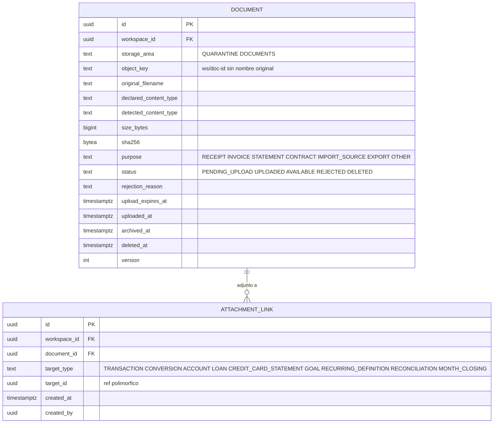
```mermaid
erDiagram
  DOCUMENT ||--o{ ATTACHMENT_LINK : "adjunto a"
  DOCUMENT {
    uuid id PK
    uuid workspace_id FK
    text storage_area "QUARANTINE DOCUMENTS"
    text object_key "ws/doc-id sin nombre original"
    text original_filename
    text declared_content_type
    text detected_content_type
    bigint size_bytes
    bytea sha256
    text purpose "RECEIPT INVOICE STATEMENT CONTRACT IMPORT_SOURCE EXPORT OTHER"
    text status "PENDING_UPLOAD UPLOADED AVAILABLE REJECTED DELETED"
    text rejection_reason
    timestamptz upload_expires_at
    timestamptz uploaded_at
    timestamptz archived_at
    timestamptz deleted_at
    int version
  }
  ATTACHMENT_LINK {
    uuid id PK
    uuid workspace_id FK
    uuid document_id FK
    text target_type "TRANSACTION CONVERSION ACCOUNT LOAN CREDIT_CARD_STATEMENT GOAL RECURRING_DEFINITION RECONCILIATION MONTH_CLOSING"
    uuid target_id "ref polimorfico"
    timestamptz created_at
    uuid created_by
  }
```

| Tabla | Unique | Check | Índices | RLS | version / archivo |
|-------|--------|-------|---------|-----|-------------------|
| `document` | `(workspace_id, object_key)`; `(workspace_id, sha256) WHERE status='AVAILABLE'` (dedupe opcional, advertencia, no error) | `size_bytes > 0 AND size_bytes <= 26214400` (25 MiB); `declared_content_type IN (allowlist)`; `status='REJECTED'` ⇒ `rejection_reason IS NOT NULL` | `(workspace_id, status) WHERE status IN ('PENDING_UPLOAD','UPLOADED')` (limpieza); `(workspace_id, purpose, uploaded_at DESC)` | WS | `version`, `archived_at`; `deleted_at` = borrado del binario a pedido del usuario (metadatos permanecen) |
| `attachment_link` | `(document_id, target_type, target_id)` | `target_type IN (...)` | `(workspace_id, target_type, target_id)` | WS | Desvincular = fila borrada (no es dato financiero) + audit |

**Justificación del link polimórfico:** los targets viven en otros schemas, así que ninguna FK física sería posible de todos modos (ARCHITECTURE §2). Una tabla de enlace por target multiplicaría tablas sin ganar integridad. Se compensa con: (1) `target_type` cerrado por CHECK; (2) validación en `application` vía `contracts` del dueño del target; (3) job de verificación de huérfanos.

### 5.12 `imports` — Import pipeline & banking providers (Phase 6; subconjunto CSV implementado en Phase 3)

Modelo físico del agregado `ImportJob` de [13-import-architecture.md](13-import-architecture.md) (§3, §7, §14). La "import_row" de la lista candidata es `imports.staged_transaction`; la idempotencia entre jobs la da `imports.row_link`.

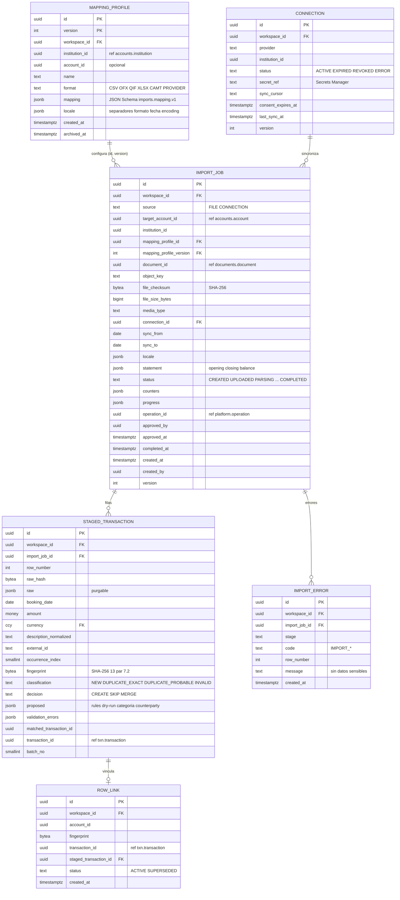
```mermaid
erDiagram
  MAPPING_PROFILE ||--o{ IMPORT_JOB : "configura (id, version)"
  CONNECTION ||--o{ IMPORT_JOB : "sincroniza"
  IMPORT_JOB ||--o{ STAGED_TRANSACTION : "filas"
  IMPORT_JOB ||--o{ IMPORT_ERROR : "errores"
  STAGED_TRANSACTION ||--o| ROW_LINK : "vincula"
  MAPPING_PROFILE {
    uuid id PK
    int version PK
    uuid workspace_id FK
    uuid institution_id "ref accounts.institution"
    uuid account_id "opcional"
    text name
    text format "CSV OFX QIF XLSX CAMT PROVIDER"
    jsonb mapping "JSON Schema imports.mapping.v1"
    jsonb locale "separadores formato fecha encoding"
    timestamptz created_at
    timestamptz archived_at
  }
  IMPORT_JOB {
    uuid id PK
    uuid workspace_id FK
    text source "FILE CONNECTION"
    uuid target_account_id "ref accounts.account"
    uuid institution_id
    uuid mapping_profile_id FK
    int mapping_profile_version FK
    uuid document_id "ref documents.document"
    text object_key
    bytea file_checksum "SHA-256"
    bigint file_size_bytes
    text media_type
    uuid connection_id FK
    date sync_from
    date sync_to
    jsonb locale
    jsonb statement "opening closing balance"
    text status "CREATED UPLOADED PARSING ... COMPLETED"
    jsonb counters
    jsonb progress
    uuid operation_id "ref platform.operation"
    uuid approved_by
    timestamptz approved_at
    timestamptz completed_at
    timestamptz created_at
    uuid created_by
    int version
  }
  STAGED_TRANSACTION {
    uuid id PK
    uuid workspace_id FK
    uuid import_job_id FK
    int row_number
    bytea raw_hash
    jsonb raw "purgable"
    date booking_date
    money amount
    ccy currency FK
    text description_normalized
    text external_id
    smallint occurrence_index
    bytea fingerprint "SHA-256 13 par 7.2"
    text classification "NEW DUPLICATE_EXACT DUPLICATE_PROBABLE INVALID"
    text decision "CREATE SKIP MERGE"
    jsonb proposed "rules dry-run categoria counterparty"
    jsonb validation_errors
    uuid matched_transaction_id
    uuid transaction_id "ref txn.transaction"
    smallint batch_no
  }
  ROW_LINK {
    uuid id PK
    uuid workspace_id FK
    uuid account_id
    bytea fingerprint
    uuid transaction_id "ref txn.transaction"
    uuid staged_transaction_id FK
    text status "ACTIVE SUPERSEDED"
    timestamptz created_at
  }
  CONNECTION {
    uuid id PK
    uuid workspace_id FK
    text provider
    uuid institution_id
    text status "ACTIVE EXPIRED REVOKED ERROR"
    text secret_ref "Secrets Manager"
    text sync_cursor
    timestamptz consent_expires_at
    timestamptz last_sync_at
    int version
  }
  IMPORT_ERROR {
    uuid id PK
    uuid workspace_id FK
    uuid import_job_id FK
    text stage
    text code "IMPORT_*"
    int row_number
    text message "sin datos sensibles"
    timestamptz created_at
  }
```

| Tabla | Unique | Check | Índices | RLS | version / archivo |
|-------|--------|-------|---------|-----|-------------------|
| `mapping_profile` | PK `(id, version)` (versionado inmutable) | `jsonb_typeof(mapping)='object'` | `(workspace_id, institution_id)` | WS | Nueva versión por cambio; `archived_at` |
| `import_job` | `(workspace_id, id)` | `source='FILE'` ⇒ `file_checksum IS NOT NULL` (tras `UPLOADED`); `source='CONNECTION'` ⇒ `connection_id IS NOT NULL` | `(workspace_id, status)`; `(workspace_id, target_account_id, file_checksum)` **no único** (reimport permitido, se advierte) | WS | `version` |
| `staged_transaction` | `(import_job_id, row_number)` | `classification IN (...)`; `decision IN (...)` | `(import_job_id, classification)`; `(workspace_id, fingerprint)` | WS | Purgado 90 días tras `COMPLETED*` (dato técnico) |
| `row_link` | **`(workspace_id, account_id, fingerprint) WHERE status='ACTIVE'`** — idempotencia de filas entre jobs (INV-014). Al anular la transacción vinculada pasa a `SUPERSEDED` y deja de bloquear | — | `(workspace_id, transaction_id)` | WS | Se conserva |
| `connection` | `(workspace_id, provider, institution_id)` | — | — | WS | `version` (Phase 6+); `DELETE` API = revocar (soft) |
| `import_error` | — | — | `(import_job_id, stage)` | WS | Purgado con staging |

El nivel proveedor (`external_id` estable) se garantiza en `txn.transaction` con `UNIQUE (workspace_id, primary_account_id, external_namespace, external_id)` (13 §7.3).

**As-built Phase 3 (`add-basic-csv-import`, migraciones `20261010400000`–`20261010400200`).** Solo existen `imports.import_job`, `imports.staged_transaction` e `imports.row_link`, las tres con RLS forzada por `workspace_id`, registradas en `platform.workspace_scoped_table` (órdenes 6 → 7 → 8, hijas antes que padres) y SIN FK cross-schema (cuenta y transacción son referencias lógicas):

| Tabla | Columnas del subconjunto (resto de Phase 6: columnas nullable nuevas) | Notas |
|---|---|---|
| `import_job` | `id, workspace_id, target_account_id, source CHECK ('FILE_CSV'), status CHECK (8 estados), original_name, file_checksum bytea(32), file_size_bytes, encoding, delimiter, row_count, column_count, header jsonb, mapping jsonb NULL (`imports.mapping.v1`), counters jsonb, progress jsonb, errors jsonb, warnings jsonb, approved_by/at, completed_at, cancelled_at/by (NULL con `cancelled_at` = cancelada por el sistema), expires_at, created_by, created_at, updated_at, version` | Índices `(workspace_id, status)`, `(workspace_id, target_account_id, created_at DESC)`, `(workspace_id, target_account_id, file_checksum)` **no único**, `(expires_at)` parcial. `pf_app` SELECT/INSERT/UPDATE; sin DELETE. Estado nuevo `AWAITING_MAPPING` (docs/13 §3). |
| `staged_transaction` | `id, workspace_id, import_job_id, row_number (línea física del archivo), raw jsonb (celdas), booking_date, amount numeric(38,18) ≥ 0, currency, direction IN/OUT, description, occurrence_index, fingerprint bytea(32), classification NULL \| NEW \| DUPLICATE_EXACT \| DUPLICATE_PROBABLE \| INVALID, decision NULL \| CREATE \| SKIP \| EXCLUDE, issues jsonb, matched_transaction_id, transaction_id, batch_no, batch_error jsonb` | `UNIQUE (import_job_id, row_number)`; `classification` NULL = fila de encabezado, saltada o sin clasificar. Incluye TODAS las filas del archivo, también la de encabezado. DELETE concedido a `pf_app` (cancelar descarta las celdas; el worker expira y purga). |
| `row_link` | `id, workspace_id, account_id, fingerprint bytea(32), transaction_id, staged_transaction_id NULL (ON DELETE SET NULL (staged_transaction_id)), kind CREATED \| SKIPPED_AS_DUPLICATE, status ACTIVE \| SUPERSEDED, created_at, superseded_at` | **Único parcial** `(workspace_id, account_id, fingerprint) WHERE status = 'ACTIVE'` (INV-014); sin DELETE; se conserva al purgar el staging. |

`txn.transaction` agrega la columna nullable `import_job_id` (referencia lógica; las transacciones creadas por un import llevan `source = 'IMPORT'`) y el índice único parcial `transaction_import_ref_uk (workspace_id, account_id, external_ref_namespace, external_ref_id) WHERE external_ref_namespace = 'imports.csv-row' AND status <> 'VOIDED'` (`CREATE UNIQUE INDEX CONCURRENTLY`, migración aparte): red de seguridad de la idempotencia por fila cuando dos jobs aprobados en paralelo persisten la misma huella. **Export del workspace:** secciones `import-jobs` (orden 770) e `import-row-links` (771, sin `staged_transaction_id`); `staged_transaction` queda excluida como dato técnico purgable. **Retención:** celdas crudas 90 días tras terminar (`IMPORT_STAGING_RETENTION`), revisiones sin aprobar 30 días (`IMPORT_REVIEW_TTL`).

### 5.13 `rules` — Rules engine (Phase 6)

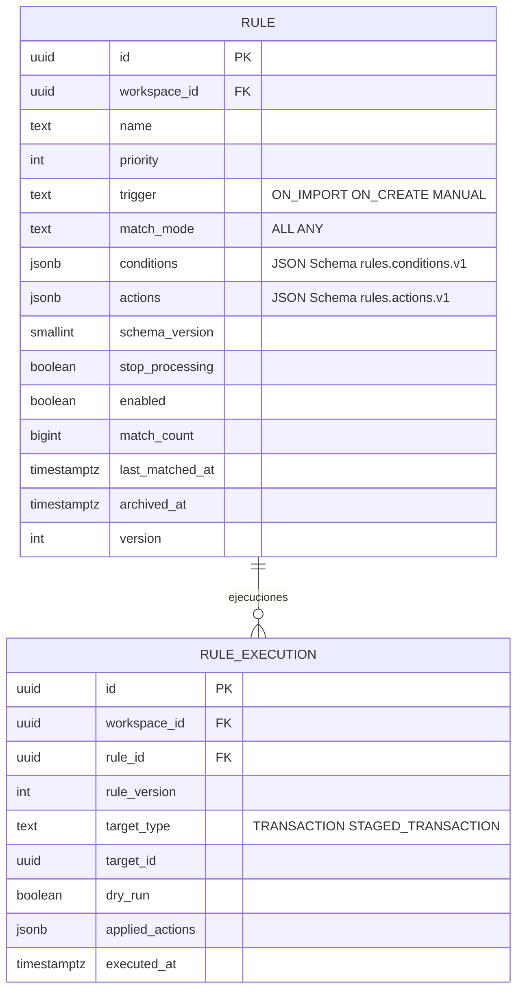
```mermaid
erDiagram
  RULE ||--o{ RULE_EXECUTION : "ejecuciones"
  RULE {
    uuid id PK
    uuid workspace_id FK
    text name
    int priority
    text trigger "ON_IMPORT ON_CREATE MANUAL"
    text match_mode "ALL ANY"
    jsonb conditions "JSON Schema rules.conditions.v1"
    jsonb actions "JSON Schema rules.actions.v1"
    smallint schema_version
    boolean stop_processing
    boolean enabled
    bigint match_count
    timestamptz last_matched_at
    timestamptz archived_at
    int version
  }
  RULE_EXECUTION {
    uuid id PK
    uuid workspace_id FK
    uuid rule_id FK
    int rule_version
    text target_type "TRANSACTION STAGED_TRANSACTION"
    uuid target_id
    boolean dry_run
    jsonb applied_actions
    timestamptz executed_at
  }
```

| Tabla | Unique | Check | Índices | RLS | version / archivo |
|-------|--------|-------|---------|-----|-------------------|
| `rule` | `(workspace_id, lower(name)) WHERE archived_at IS NULL` | `jsonb_typeof(conditions)='array' AND jsonb_array_length(conditions) BETWEEN 1 AND 20`; `jsonb_typeof(actions)='array' AND jsonb_array_length(actions) BETWEEN 1 AND 10` | `(workspace_id, trigger, priority) WHERE enabled AND archived_at IS NULL`; `gin (actions jsonb_path_ops)` ("¿qué reglas usan la categoría X?") | WS | `version`, `archived_at` |
| `rule_execution` | — | — | `(workspace_id, target_type, target_id)`; `(rule_id, executed_at DESC)` | **WS-RO** | Retención 180 días |

**Decisión JSONB vs tablas `rule_condition`/`rule_action`:** se elige **JSONB con JSON Schema versionado**. Razones: (1) la regla es un agregado que siempre se carga y evalúa completo en memoria — nunca se consultan condiciones sueltas por SQL; (2) operandos heterogéneos (texto, regex, rango de montos, moneda, cuenta, día de la semana) obligarían a columnas `value_text/value_num/...` o EAV; (3) evolución del DSL vía `schema_version` + migración en lectura, sin DDL; (4) el orden de condiciones/acciones es intrínseco al array. Costes aceptados: sin FK hacia categorías (ya imposibles por ser cross-schema), validación en dominio + CHECK estructural, índice GIN para búsquedas inversas. Esquemas en `contracts/rules/` (a definir en Phase 6).

### 5.14 `reporting` — Read models **DERIVADOS** (Phase 1 básico / Phase 7)

> Todas las tablas de este schema son **derivadas y reconstruibles** desde `ledger`/`txn`/`fx`/otros contextos vía eventos. No son fuente de verdad, no tienen `version` ni audit, y pueden truncarse y reconstruirse (`job reporting.rebuild`). Escritas solo por `pf_worker` (política **DRV**). Catálogo funcional completo y consumidores en [14-reporting.md](14-reporting.md) §2; aquí se fija la forma física de las principales.


```mermaid
erDiagram
  TXN_FACT {
    uuid workspace_id PK, FK
    uuid split_id PK "o leg_id para transfer y conversion"
    uuid transaction_id
    text kind
    date transaction_date
    date period_month
    uuid account_id
    uuid category_id
    uuid counterparty_id
    uuid_array tag_ids
    money amount
    ccy currency FK
    text status
    timestamptz projected_at
  }
  MONTHLY_CATEGORY_AGG {
    uuid workspace_id PK, FK
    date period_month PK
    ccy currency PK, FK
    uuid category_id PK
    text kind PK "EXPENSE INCOME"
    money total
    int count
  }
  MONTHLY_ACCOUNT_AGG {
    uuid workspace_id PK, FK
    date period_month PK
    uuid account_id PK
    ccy currency FK
    money inflow
    money outflow
    money net
    money closing_balance
  }
  DAILY_BALANCE {
    uuid workspace_id PK, FK
    uuid account_id PK
    date as_of_date PK
    ccy currency FK
    money balance
  }
  NET_WORTH_SNAPSHOT {
    uuid workspace_id PK, FK
    date month_end PK
    ccy reporting_currency FK
    jsonb by_currency "assets liabilities por moneda"
    money total_assets
    money total_liabilities
    money net_worth
    jsonb rates_used "exchange_rate ids y valores"
    timestamptz computed_at
  }
  PROJECTION_CHECKPOINT {
    text projection PK
    uuid workspace_id PK, FK
    uuid last_event_id
    timestamptz last_occurred_at
    timestamptz rebuilt_at
  }
```

| Tabla | Índices | Notas |
|-------|---------|-------|
| `txn_fact` | PK; `(workspace_id, period_month, category_id)`; `(workspace_id, account_id, transaction_date)`; `gin (tag_ids)` | 1 fila por split nominal vigente (+ filas de transfer/conversion marcadas). `uuid_array` = `uuid[]`. |
| `monthly_category_agg` | PK | Alimenta budget actuals (INV-034), dashboard y tendencias. |
| `monthly_account_agg` | PK | Cash flow histórico por cuenta. |
| `daily_balance` | PK | Historia de saldos para gráficos y net worth; distinto de `ledger.balance_snapshot` (caché de cálculo del ledger). |
| `net_worth_snapshot` | PK | Phase 7; guarda las tasas usadas (no recalcula histórico con tasas actuales, INV-012). |
| `projection_checkpoint` | PK | Seguimiento de rebuilds / lag. |
| Otras de 14 §2 | — | `monthly_tag_agg`, `fx_conversion_fact`, `fee_fact`, `commitment_occurrence`, `goal_progress`, `debt_snapshot`, `budget_snapshot`, `forecast_vs_actual`: mismo patrón (PK natural con `workspace_id` primero, sin `version`, DRV). |

Verificación: job diario compara una muestra de `daily_balance` y `ledger.balance_snapshot` con `Σ posting.amount` (completo semanal); divergencia ⇒ alerta + rebuild.

### 5.15 `notifications` (Phase 2, as-built de `add-alerts`)

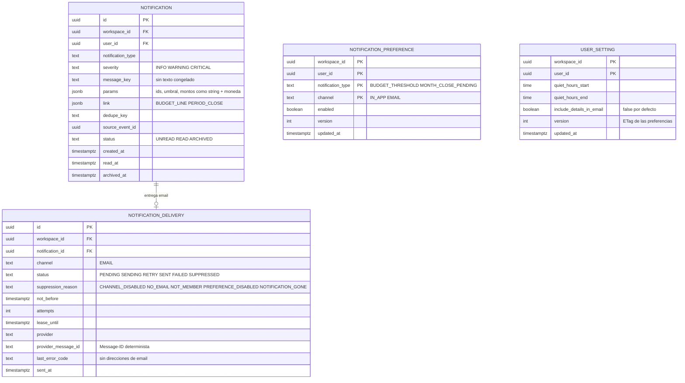
```mermaid
erDiagram
  NOTIFICATION ||--o| NOTIFICATION_DELIVERY : "entrega email"
  NOTIFICATION_PREFERENCE {
    uuid workspace_id PK
    uuid user_id PK
    text notification_type PK "BUDGET_THRESHOLD MONTH_CLOSE_PENDING"
    text channel PK "IN_APP EMAIL"
    boolean enabled
    int version
    timestamptz updated_at
  }
  USER_SETTING {
    uuid workspace_id PK
    uuid user_id PK
    time quiet_hours_start
    time quiet_hours_end
    boolean include_details_in_email "false por defecto"
    int version "ETag de las preferencias"
    timestamptz updated_at
  }
  NOTIFICATION {
    uuid id PK
    uuid workspace_id FK
    uuid user_id FK
    text notification_type
    text severity "INFO WARNING CRITICAL"
    text message_key "sin texto congelado"
    jsonb params "ids, umbral, montos como string + moneda"
    jsonb link "BUDGET_LINE PERIOD_CLOSE"
    text dedupe_key
    uuid source_event_id
    text status "UNREAD READ ARCHIVED"
    timestamptz created_at
    timestamptz read_at
    timestamptz archived_at
  }
  NOTIFICATION_DELIVERY {
    uuid id PK
    uuid workspace_id FK
    uuid notification_id FK
    text channel "EMAIL"
    text status "PENDING SENDING RETRY SENT FAILED SUPPRESSED"
    text suppression_reason "CHANNEL_DISABLED NO_EMAIL NOT_MEMBER PREFERENCE_DISABLED NOTIFICATION_GONE"
    timestamptz not_before
    int attempts
    timestamptz lease_until
    text provider
    text provider_message_id "Message-ID determinista"
    text last_error_code "sin direcciones de email"
    timestamptz sent_at
  }
```

Cambios respecto del diseño original (docs/33 D87–D93): `DISMISSED` → `ARCHIVED`; `title/body` → `message_key/params` (el texto se renderiza al leer en el locale del usuario); `settings` por tipo → tabla `user_setting` (horario de silencio, detalles en email; D91: sin filtro por umbral); `NOTIFICATION_DELIVERY` con lease, `not_before` y motivos de supresión. **Ninguna tabla guarda direcciones de email** (se resuelven al despachar; RISK-010).

| Tabla | Unique | Check | Índices | RLS | Notas |
|-------|--------|-------|---------|-----|-------|
| `notification` | `(workspace_id, user_id, dedupe_key)` (p. ej. `budget-threshold:<periodId>:CATEGORY:<id>:90`) | coherencia estado ↔ `read_at`/`archived_at` | `(workspace_id, user_id, status, created_at DESC, id DESC)`, `(created_at)` | WS + `user_id` (`notifications.is_row_user`): `pf_app` SELECT propias y UPDATE de estado propio; `pf_worker` INSERT, SELECT y DELETE (purga) | Retención 12 meses (D93), archivadas incluidas |
| `notification_delivery` | `(notification_id, channel)` | `attempts >= 0`; `SUPPRESSED` ⇒ motivo; `SENT` ⇒ `sent_at` | `(status, not_before) WHERE status IN ('PENDING','RETRY')`, `(lease_until) WHERE status='SENDING'` | WS; `pf_worker` todo; `pf_app` solo `(workspace_id, notification_id, channel, status)` de las entregas de SUS notificaciones | No exportada |
| `notification_preference` | `(workspace_id, user_id, notification_type, channel)` (PK) | — | — | WS + `user_id`; `pf_worker` SELECT | Ausencia = activado; exportada |
| `user_setting` | `(workspace_id, user_id)` (PK) | horario: ambos nulos o ambos presentes y distintos | — | WS + `user_id`; `pf_worker` SELECT | `version` = ETag; exportada |

Las cuatro tablas están registradas en `platform.workspace_scoped_table` (purga del workspace demo, órdenes 120–126).

### 5.16 `audit` — Audit trail (Phase 1)

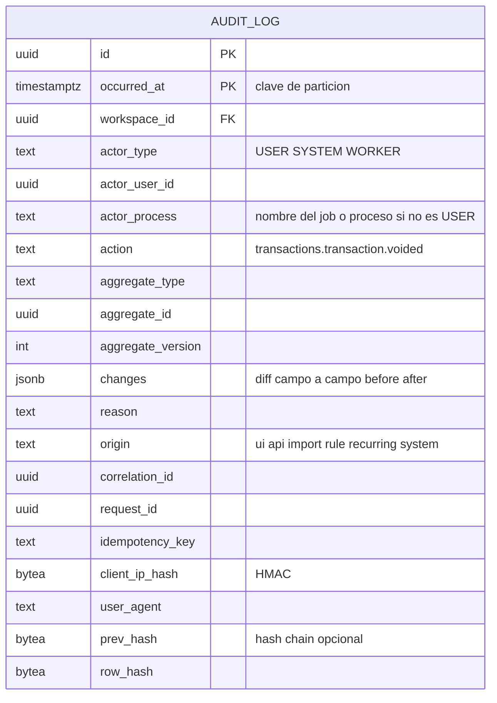
```mermaid
erDiagram
  AUDIT_LOG {
    uuid id PK
    timestamptz occurred_at PK "clave de particion"
    uuid workspace_id FK
    text actor_type "USER SYSTEM WORKER"
    uuid actor_user_id
    text actor_process "nombre del job o proceso si no es USER"
    text action "transactions.transaction.voided"
    text aggregate_type
    uuid aggregate_id
    int aggregate_version
    jsonb changes "diff campo a campo before after"
    text reason
    text origin "ui api import rule recurring system"
    uuid correlation_id
    uuid request_id
    text idempotency_key
    bytea client_ip_hash "HMAC"
    text user_agent
    bytea prev_hash "hash chain opcional"
    bytea row_hash
  }
```

| Tabla | Unique | Check | Índices | RLS | version / archivo |
|-------|--------|-------|---------|-----|-------------------|
| `audit_log` | PK `(occurred_at, id)` (requisito de particionado) | `actor_type='USER'` ⇒ `actor_user_id IS NOT NULL`; `actor_type<>'USER'` ⇒ `actor_process IS NOT NULL`; `origin IN ('ui','api','import','rule','recurring','system')` (FR-AUDIT-002) | `(workspace_id, aggregate_type, aggregate_id, occurred_at)`; `(workspace_id, occurred_at DESC)`; `(workspace_id, actor_user_id, occurred_at DESC)` | **WS-RO** | Particionada `PARTITION BY RANGE (occurred_at)` mensual (`pg_partman` o job propio). Sin UPDATE/DELETE/TRUNCATE para `pf_app`/`pf_worker`. |
| `lifecycle_transition` | PK `id`; `UNIQUE (workspace_id, aggregate_type, aggregate_id, sequence)` | `kind IN ('TRANSITION','ANNOTATION')`; una transición lleva `transition`, `to_state` y `machine_version`; una anotación no lleva estado, máquina ni `reason`; `revision_to > revision_from`; `cardinality(event_ids) = cardinality(event_types)`; actor como en `audit_log` | `(workspace_id, occurred_at DESC)`; `(workspace_id, audit_log_id)` | **WS-RO** | Append-only (`platform.forbid_mutation()` de fila y de sentencia). Un paso del flujo (transición) o una anotación por comando, en la misma transacción que el cambio, su `audit_log` y su outbox (`add-lifecycle-timeline`, docs/31 D37). Columnas: `sequence`, `kind`, `transition`, `from_state`, `to_state`, `machine_version`, `revision_from/to`, `aggregate_version`, `occurred_at`, actor, `origin`, `reason`, `correlation_id`, `audit_log_id`, `event_ids uuid[]`, `event_types text[]`, `journal_entries jsonb {reversed, reversal, posted}`, `detail_refs jsonb`, `changed_fields text[]`, `derived` (reconstruida desde `audit_log` por el job `audit.lifecycle-backfill`). Sin montos. |

Se escribe **en la misma transacción** que el comando (ARCHITECTURE §7). `changes` nunca contiene secretos ni tokens; sí montos (es el propósito del audit financiero). Hash chain (`prev_hash`/`row_hash` por workspace) es opcional — ver Preguntas abiertas.

Implementación (add-audit-trail, migración `20261003160000_audit_audit_log.sql`): particiones mensuales `audit.audit_log_yYYYYmMM` creadas por `audit.ensure_partitions(n)` (SECURITY DEFINER; job `audit.ensure-partitions` del worker, 2 meses de anticipación) y partición `audit.audit_log_default` como red de seguridad (`audit.default_partition_rows()` alimenta la alerta del job). Políticas `ws_isolation_read` (SELECT) y `ws_isolation_write` (INSERT) para `pf_app` (y `pf_worker`, que lo hereda); las particiones repiten RLS forzada y política y no tienen grants (se accede solo por el padre). `platform.forbid_mutation()` (SQLSTATE PF003) en `BEFORE UPDATE OR DELETE` (fila, clonado a las particiones) y `BEFORE TRUNCATE` (sentencia, en el padre y cada partición). Las columnas `actor_process` y `origin` son las exigidas por FR-AUDIT-002.

### 5.17 `forecasting` (Phase 8)

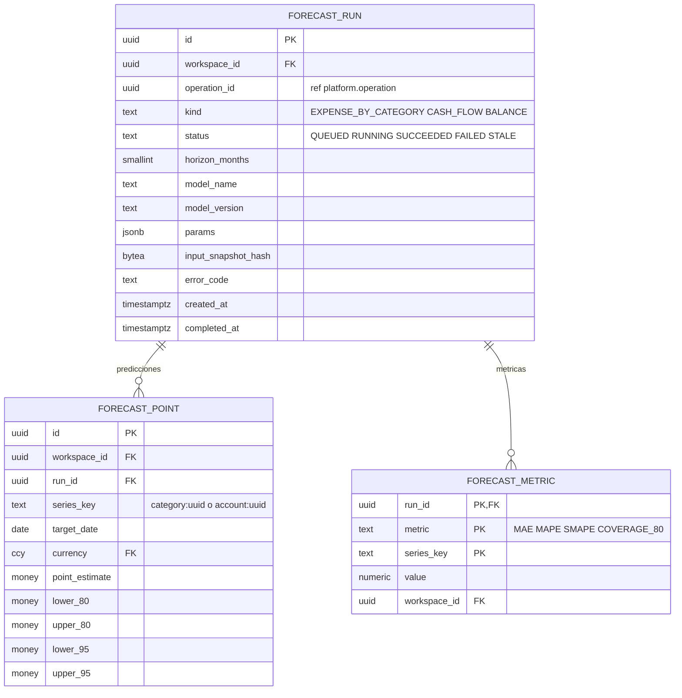
```mermaid
erDiagram
  FORECAST_RUN ||--o{ FORECAST_POINT : "predicciones"
  FORECAST_RUN ||--o{ FORECAST_METRIC : "metricas"
  FORECAST_RUN {
    uuid id PK
    uuid workspace_id FK
    uuid operation_id "ref platform.operation"
    text kind "EXPENSE_BY_CATEGORY CASH_FLOW BALANCE"
    text status "QUEUED RUNNING SUCCEEDED FAILED STALE"
    smallint horizon_months
    text model_name
    text model_version
    jsonb params
    bytea input_snapshot_hash
    text error_code
    timestamptz created_at
    timestamptz completed_at
  }
  FORECAST_POINT {
    uuid id PK
    uuid workspace_id FK
    uuid run_id FK
    text series_key "category:uuid o account:uuid"
    date target_date
    ccy currency FK
    money point_estimate
    money lower_80
    money upper_80
    money lower_95
    money upper_95
  }
  FORECAST_METRIC {
    uuid run_id PK, FK
    text metric PK "MAE MAPE SMAPE COVERAGE_80"
    text series_key PK
    numeric value
    uuid workspace_id FK
  }
```

| Tabla | Unique | Check | Índices | RLS | version / archivo |
|-------|--------|-------|---------|-----|-------------------|
| `forecast_run` | — | `horizon_months BETWEEN 1 AND 24` | `(workspace_id, kind, created_at DESC) WHERE status='SUCCEEDED'` | WS | Retención: últimos 12 runs por kind |
| `forecast_point` | `(run_id, series_key, target_date)` | `lower_80 <= point_estimate AND point_estimate <= upper_80` | — | **WS-RO** | — |
| `forecast_metric` | PK | — | — | **WS-RO** | — |

El servicio `ml-forecasting` **no** accede a PostgreSQL: recibe datasets agregados del worker y devuelve resultados; el ACL `@pf/forecasting` persiste.

### 5.18 `platform` — Outbox, inbox, idempotency, operations

```mermaid
erDiagram
  OUTBOX {
    uuid id PK "eventId UUIDv7"
    uuid workspace_id FK
    text event_type "transactions.TransactionPosted"
    smallint event_version
    text aggregate_type
    uuid aggregate_id
    int aggregate_version
    timestamptz occurred_at
    uuid correlation_id
    uuid causation_id
    jsonb actor
    jsonb payload
    timestamptz created_at
    timestamptz published_at
    smallint publish_attempts
    text last_error
  }
  INBOX {
    text consumer PK
    uuid event_id PK
    uuid workspace_id
    timestamptz processed_at
  }
  IDEMPOTENCY_KEY {
    uuid scope_id PK "workspace_id o user_id"
    text key PK
    uuid workspace_id
    uuid user_id
    text method
    text route "plantilla de ruta"
    bytea request_hash "SHA-256 body canonico"
    text status "IN_PROGRESS COMPLETED"
    smallint response_status
    jsonb response_headers
    jsonb response_body
    timestamptz locked_until
    timestamptz created_at
    timestamptz expires_at
  }
  OPERATION {
    uuid id PK
    uuid workspace_id FK
    text kind "IMPORT_PARSE IMPORT_COMMIT FORECAST EXPORT WORKSPACE_DELETE REBUILD"
    text status "PENDING RUNNING SUCCEEDED FAILED CANCELLED"
    smallint progress_pct
    text resource_type
    uuid resource_id
    jsonb result
    jsonb error "problem details"
    uuid requested_by
    timestamptz created_at
    timestamptz updated_at
    timestamptz expires_at
  }
  WORKSPACE_TOMBSTONE {
    uuid workspace_id PK
    bytea requested_by_hash
    timestamptz requested_at
    timestamptz purged_at
    jsonb purge_report "conteos por tabla"
  }
```

| Tabla | Unique | Índices | RLS / grants | Retención |
|-------|--------|---------|--------------|-----------|
| `outbox` | PK; único `(aggregate_id, aggregate_version, event_type, event_version)` (publicación dual vN/vN+1) | `(sequence) WHERE published_at IS NULL` (relay, métricas); `(published_at) WHERE published_at IS NOT NULL` (purga) | **PLT** (RLS forzada): `pf_app` solo INSERT con `WITH CHECK workspace_id = current_workspace_id()`; `pf_worker` SELECT + UPDATE de `published_at`, `publish_attempts`, `last_error` (grants de columna, política `USING (true)`); `pf_maintenance` SELECT/DELETE solo de filas publicadas. Sin FK a `iam.workspace` (tabla técnica; ver add-event-outbox design §3) | Publicados: 7 días |
| `inbox` | PK `(consumer, event_id)` | `(processed_at)` | Sin datos de negocio (allowlist del chequeo RLS); `pf_worker` SELECT/INSERT, `pf_maintenance` SELECT/DELETE; `pf_app` sin grants | 30 días |
| `dead_letter` | PK `(consumer, event_id)` | `(first_failed_at) WHERE status = 'OPEN'` | RLS forzada, solo `pf_worker` (SELECT/INSERT/UPDATE); `status OPEN\|REPLAYED\|DISCARDED` | Sin purga (se resuelve a mano) |
| `idempotency_key` | PK `(scope_id, key)` | `(expires_at)` | **WS** (cuando `workspace_id` no es NULL) / USR (endpoints de usuario); contiene respuestas ⇒ datos financieros | 24 h (configurable hasta 7 días) |
| `operation` | PK | `(workspace_id, created_at DESC)` | WS | 30 días tras terminar |
| `workspace_tombstone` | PK | — | Solo `pf_migrator`/rol de purge | Permanente (sin datos personales) |

---

## 6. Inmutabilidad y grants (resumen)

| Tabla | `pf_app` | `pf_worker` | Trigger `forbid_mutation` |
|-------|----------|-------------|---------------------------|
| `ledger.journal_entry`, `ledger.posting`, `ledger.entry_reversal` | SELECT, INSERT | SELECT, INSERT | Sí (UPDATE, DELETE, TRUNCATE) |
| `ledger.period_lock` | SELECT, INSERT, DELETE | SELECT | No (DELETE = reapertura, auditada) |
| `ledger.balance_snapshot` | SELECT | SELECT, INSERT, UPDATE, DELETE | No (derivado) |
| `txn.conversion_detail`, `txn.conversion_fee`, `txn.transaction_journal_link` | SELECT, INSERT | SELECT, INSERT | No (append-only por grants; as-built, rev. 2026-10-04) |
| `fx.exchange_rate`, `fx.rate_anomaly_review` | SELECT, INSERT | SELECT, INSERT | No (append-only por grants; sin UPDATE/DELETE) |
| `fx.provider_run` (instalación) | SELECT | SELECT, INSERT, DELETE (purga) | No |
| `planning.budget_template_version`, `budget_template_line` | SELECT, INSERT | SELECT | Sí (la purga del workspace demo sigue permitida, ADR-0026) |
| `planning.budget_threshold_crossing` | SELECT, INSERT | SELECT, INSERT (hereda de `pf_app`) | Sí (la purga del workspace demo sigue permitida, ADR-0026) |
| `audit.audit_log`, `audit.lifecycle_transition` | SELECT, INSERT | SELECT, INSERT | Sí |
| `goals.goal_contribution`, `debt.loan_schedule_change`, `rules.rule_execution`, `forecasting.forecast_point` | SELECT, INSERT | SELECT, INSERT | Sí (salvo purga por retención con rol de mantenimiento) |
| `reporting.*` | SELECT | SELECT, INSERT, UPDATE, DELETE, TRUNCATE | No |
| Resto de tablas de negocio | SELECT, INSERT, UPDATE | SELECT, INSERT, UPDATE | No (DELETE no concedido salvo tablas de enlace/técnicas: `accounts.account_tag`, `txn.split_tag`, `classification.counterparty_alias`, `fx.rate_preference`, `txn.split_custom_field_value`, `accounts.account_custom_field_value`, `attachment_link`, `reconciliation_item`; purgas de `imports.staged_transaction` solo `pf_maintenance`) |

---

## 7. ERD consolidado (núcleo Phase 1)

```mermaid
erDiagram
  WORKSPACE ||--o{ ACCOUNT : ""
  WORKSPACE ||--o{ LEDGER_ACCOUNT : ""
  ACCOUNT ||..|| LEDGER_ACCOUNT : "1:1 logico"
  INSTITUTION ||--o{ ACCOUNT : ""
  LEDGER_ACCOUNT ||--o{ POSTING : ""
  JOURNAL_ENTRY ||--|{ POSTING : ""
  TRANSACTION ||..o| JOURNAL_ENTRY : "active_entry_id logico"
  TRANSACTION ||--|{ TRANSACTION_LEG : ""
  TRANSACTION ||--o{ TRANSACTION_SPLIT : ""
  TRANSACTION_SPLIT ||..o{ POSTING : "split_id logico"
  JOURNAL_ENTRY ||--o| ENTRY_REVERSAL : ""
  TRANSACTION ||--o{ CONVERSION_DETAIL : "por revision"
  CATEGORY_GROUP ||--o{ CATEGORY : ""
  CATEGORY ||..o{ TRANSACTION_SPLIT : "category_id logico"
  TAG ||..o{ SPLIT_TAG : ""
  TRANSACTION_SPLIT ||--o{ SPLIT_TAG : ""
  COUNTERPARTY ||..o{ TRANSACTION : ""
  CURRENCY ||--o{ ACCOUNT : "FK fisica"
  CURRENCY ||--o{ POSTING : "FK fisica"
  CURRENCY ||--o{ EXCHANGE_RATE : ""
  TRANSACTION ||--o{ AUDIT_LOG : "logico"
```

---

## 8. Estrategia de índices y rendimiento

- **Listados por cursor**: índices `(workspace_id, <sort_col> DESC, id DESC)` alineados con el `sort` de la API ([10-api-design.md](10-api-design.md) §5).
- **Saldo as-of**: `posting (workspace_id, ledger_account_id, entry_date, id) INCLUDE (amount)` permite *index-only scan*; para cuentas con muchos postings se parte del último `ledger.balance_snapshot`.
- **Índices parciales** para colas lógicas (outbox pendiente, occurrences programadas, imports activos, notificaciones no leídas) — pequeños y calientes.
- **RLS y planes**: `workspace_id` como primera columna de los índices de negocio; `platform.current_workspace_id()` es `STABLE` → se evalúa una vez por query.
- **Particionado**: solo `audit.audit_log` desde el inicio. `ledger.posting` no se particiona en Phase 1 (volumen personal: ~10⁴–10⁵ filas/año); revisar si supera 10⁷ filas.
- Extensiones requeridas: `btree_gist` (exclusión de periodos), `pg_trgm` (fuzzy match de counterparties). Sin `uuid-ossp` (IDs en la app).

---

## 9. Concurrencia

- Optimistic locking con `version` en agregados mutables (`UPDATE ... WHERE id=$1 AND version=$2`; 0 filas ⇒ `409 CONCURRENCY_CONFLICT` / `412` si vino `If-Match`).
- El ledger no necesita locking optimista (append-only). Para creación de ledger accounts de sistema bajo demanda: `INSERT ... ON CONFLICT (workspace_id, system_kind, currency) DO NOTHING` + `SELECT`.
- Nivel de aislamiento: `READ COMMITTED` por defecto; `SERIALIZABLE` (con retry) solo en cierre de mes y reconciliación.

---

## 10. SQL ilustrativo

### 10.1 Tablas del ledger

```sql
CREATE SCHEMA ledger AUTHORIZATION pf_migrator;

CREATE TABLE ledger.ledger_account (
  id                uuid PRIMARY KEY,
  workspace_id      uuid NOT NULL REFERENCES iam.workspace(id),
  type              text NOT NULL CHECK (type IN ('ASSET','LIABILITY','EQUITY','INCOME','EXPENSE')),
  currency          varchar(16) NOT NULL REFERENCES fx.currency(code),
  system_kind       text CHECK (system_kind IN ('INCOME','EXPENSE','OPENING_BALANCE','FX_TRADING','ADJUSTMENTS')),
  source_account_id uuid,                       -- ref lógica accounts.account
  code              text NOT NULL,
  created_at        timestamptz NOT NULL DEFAULT now(),
  archived_at       timestamptz,
  CONSTRAINT ledger_account_ws_id_uk   UNIQUE (workspace_id, id),
  CONSTRAINT ledger_account_id_ccy_uk  UNIQUE (id, currency, type),
  CONSTRAINT ledger_account_user_ck CHECK (
    (type IN ('ASSET','LIABILITY')) = (source_account_id IS NOT NULL)
  )
);
CREATE UNIQUE INDEX ledger_account_system_uk
  ON ledger.ledger_account (workspace_id, system_kind, currency)
  WHERE system_kind IS NOT NULL;
CREATE UNIQUE INDEX ledger_account_source_uk
  ON ledger.ledger_account (workspace_id, source_account_id)
  WHERE source_account_id IS NOT NULL;

CREATE TABLE ledger.journal_entry (
  id                uuid PRIMARY KEY,
  workspace_id      uuid NOT NULL REFERENCES iam.workspace(id),
  sequence          bigint GENERATED ALWAYS AS IDENTITY,
  entry_date        date NOT NULL,
  entry_type        text NOT NULL CHECK (entry_type IN
                     ('STANDARD','REVERSAL','OPENING')),
  source_context    text NOT NULL DEFAULT 'TRANSACTIONS',
  source_type       text NOT NULL,              -- 'Transaction'
  source_id         uuid NOT NULL,              -- ref lógica txn.transaction
  source_revision   int  NOT NULL,
  reverses_entry_id uuid,
  memo              text,
  correlation_id    uuid,
  created_at        timestamptz NOT NULL DEFAULT now(),
  created_by        uuid,
  CONSTRAINT journal_entry_ws_id_uk   UNIQUE (workspace_id, id),
  CONSTRAINT journal_entry_id_date_uk UNIQUE (id, entry_date),
  CONSTRAINT journal_entry_reversal_fk FOREIGN KEY (workspace_id, reverses_entry_id)
    REFERENCES ledger.journal_entry (workspace_id, id),
  CONSTRAINT journal_entry_reversal_ck
    CHECK ((entry_type = 'REVERSAL') = (reverses_entry_id IS NOT NULL))
);
-- "se revierte a lo sumo una vez" (INV-008): tabla de enlace, sin UPDATE
CREATE TABLE ledger.entry_reversal (
  original_entry_id uuid PRIMARY KEY,
  reversal_entry_id uuid NOT NULL UNIQUE,
  workspace_id      uuid NOT NULL,
  created_at        timestamptz NOT NULL DEFAULT now(),
  FOREIGN KEY (workspace_id, original_entry_id) REFERENCES ledger.journal_entry (workspace_id, id),
  FOREIGN KEY (workspace_id, reversal_entry_id) REFERENCES ledger.journal_entry (workspace_id, id)
);
CREATE INDEX journal_entry_source_ix ON ledger.journal_entry (workspace_id, source_type, source_id);

CREATE TABLE ledger.posting (
  id                uuid PRIMARY KEY,
  workspace_id      uuid NOT NULL,
  journal_entry_id  uuid NOT NULL,
  entry_date        date NOT NULL,
  line_no           smallint NOT NULL,
  ledger_account_id uuid NOT NULL,
  account_type      text NOT NULL,
  currency          varchar(16) NOT NULL REFERENCES fx.currency(code),
  amount            numeric(38,18) NOT NULL CHECK (amount <> 0),
  split_id          uuid,                       -- ref lógica txn.transaction_split
  memo              text,
  created_at        timestamptz NOT NULL DEFAULT now(),
  CONSTRAINT posting_entry_fk FOREIGN KEY (workspace_id, journal_entry_id)
    REFERENCES ledger.journal_entry (workspace_id, id),
  CONSTRAINT posting_entry_date_fk FOREIGN KEY (journal_entry_id, entry_date)
    REFERENCES ledger.journal_entry (id, entry_date),
  CONSTRAINT posting_account_ws_fk FOREIGN KEY (workspace_id, ledger_account_id)
    REFERENCES ledger.ledger_account (workspace_id, id),
  CONSTRAINT posting_account_ccy_fk FOREIGN KEY (ledger_account_id, currency, account_type)
    REFERENCES ledger.ledger_account (id, currency, type),
  CONSTRAINT posting_line_uk UNIQUE (journal_entry_id, line_no),
  CONSTRAINT posting_nominal_split_ck
    CHECK (account_type NOT IN ('INCOME','EXPENSE') OR split_id IS NOT NULL)
);
CREATE INDEX posting_balance_ix
  ON ledger.posting (workspace_id, ledger_account_id, entry_date, id) INCLUDE (amount);
CREATE INDEX posting_split_ix ON ledger.posting (workspace_id, split_id) WHERE split_id IS NOT NULL;
```

### 10.2 Zero-sum por moneda (constraint trigger diferido) e inmutabilidad

```sql
CREATE FUNCTION ledger.assert_entry_balanced() RETURNS trigger
LANGUAGE plpgsql AS $$
DECLARE
  v_ccy text; v_sum numeric;
BEGIN
  SELECT currency, sum(amount) INTO v_ccy, v_sum
  FROM ledger.posting
  WHERE journal_entry_id = NEW.journal_entry_id
  GROUP BY currency
  HAVING sum(amount) <> 0
  LIMIT 1;

  IF FOUND THEN
    RAISE EXCEPTION 'LEDGER_UNBALANCED_ENTRY: entry % currency % sum %',
      NEW.journal_entry_id, v_ccy, v_sum
      USING ERRCODE = 'PF001';   -- mapeado a problem+json por la app
  END IF;
  RETURN NULL;
END $$;

CREATE CONSTRAINT TRIGGER posting_balanced_trg
  AFTER INSERT ON ledger.posting
  DEFERRABLE INITIALLY DEFERRED
  FOR EACH ROW EXECUTE FUNCTION ledger.assert_entry_balanced();

-- Toda entry debe tener al menos 2 postings
CREATE FUNCTION ledger.assert_entry_has_postings() RETURNS trigger
LANGUAGE plpgsql AS $$
BEGIN
  IF (SELECT count(*) FROM ledger.posting WHERE journal_entry_id = NEW.id) < 2 THEN
    RAISE EXCEPTION 'LEDGER_ENTRY_TOO_FEW_POSTINGS: entry %', NEW.id USING ERRCODE = 'PF005';
  END IF;
  RETURN NULL;
END $$;

CREATE CONSTRAINT TRIGGER journal_entry_postings_trg
  AFTER INSERT ON ledger.journal_entry
  DEFERRABLE INITIALLY DEFERRED
  FOR EACH ROW EXECUTE FUNCTION ledger.assert_entry_has_postings();

-- Inmutabilidad (defensa adicional a los grants)
CREATE FUNCTION platform.forbid_mutation() RETURNS trigger
LANGUAGE plpgsql AS $$
BEGIN
  RAISE EXCEPTION 'IMMUTABLE_RECORD: % on %.% is not allowed', TG_OP, TG_TABLE_SCHEMA, TG_TABLE_NAME
    USING ERRCODE = 'PF003';
END $$;

CREATE TRIGGER posting_immutable_trg
  BEFORE UPDATE OR DELETE ON ledger.posting
  FOR EACH ROW EXECUTE FUNCTION platform.forbid_mutation();
CREATE TRIGGER posting_no_truncate_trg
  BEFORE TRUNCATE ON ledger.posting
  FOR EACH STATEMENT EXECUTE FUNCTION platform.forbid_mutation();
-- (idem para journal_entry, audit_log, conversion_detail, exchange_rate, ...)

-- Periodo cerrado
CREATE FUNCTION ledger.assert_period_open() RETURNS trigger
LANGUAGE plpgsql AS $$
BEGIN
  IF EXISTS (SELECT 1 FROM ledger.period_lock
             WHERE workspace_id = NEW.workspace_id
               AND year_month = to_char(NEW.entry_date, 'YYYY-MM')) THEN
    RAISE EXCEPTION 'PERIOD_CLOSED: % is in a closed period', NEW.entry_date USING ERRCODE = 'PF004';
  END IF;
  RETURN NEW;
END $$;
CREATE TRIGGER journal_entry_period_open_trg
  BEFORE INSERT ON ledger.journal_entry
  FOR EACH ROW EXECUTE FUNCTION ledger.assert_period_open();
```

> El trigger diferido se ejecuta una vez por posting; con entries de 2–20 postings el costo es despreciable. Alternativa evaluada: trigger `FOR EACH STATEMENT` con *transition tables* (no combinable con `CONSTRAINT TRIGGER`); se descarta por simplicidad. SPIKE-02 mide el costo.

### 10.3 RLS y grants

```sql
-- Roles (creados por IaC/bootstrap, no por migraciones de la app)
--   pf_migrator: owner; pf_app / pf_worker: LOGIN, NOBYPASSRLS, NOSUPERUSER

ALTER TABLE ledger.posting ENABLE ROW LEVEL SECURITY;
ALTER TABLE ledger.posting FORCE ROW LEVEL SECURITY;

CREATE POLICY ws_isolation ON ledger.posting
  FOR ALL TO pf_app, pf_worker
  USING      (workspace_id = platform.current_workspace_id())
  WITH CHECK (workspace_id = platform.current_workspace_id());

GRANT USAGE ON SCHEMA ledger TO pf_app, pf_worker;
GRANT SELECT, INSERT ON ledger.posting, ledger.journal_entry TO pf_app, pf_worker;
GRANT SELECT, INSERT, UPDATE (archived_at) ON ledger.ledger_account TO pf_app, pf_worker;
REVOKE UPDATE, DELETE, TRUNCATE ON ledger.posting, ledger.journal_entry FROM PUBLIC, pf_app, pf_worker;

-- Filas globales + propias (fx.exchange_rate)
CREATE POLICY exchange_rate_read ON fx.exchange_rate FOR SELECT TO pf_app, pf_worker
  USING (workspace_id IS NULL OR workspace_id = platform.current_workspace_id());
CREATE POLICY exchange_rate_insert_own ON fx.exchange_rate FOR INSERT TO pf_app, pf_worker
  WITH CHECK (workspace_id = platform.current_workspace_id());
CREATE POLICY exchange_rate_insert_global ON fx.exchange_rate FOR INSERT TO pf_worker
  WITH CHECK (workspace_id IS NULL AND source = 'PROVIDER');

-- Uso por request (Unit of Work)
BEGIN;
SELECT set_config('app.workspace_id', '0192f3c4-...-...', true);  -- equivalente a SET LOCAL
SELECT set_config('app.user_id',      '0192f3c4-...-...', true);
-- ... comandos ...
COMMIT;  -- triggers diferidos se evalúan aquí
```

Test obligatorio (ver [16-testing-strategy.md](16-testing-strategy.md) §5.5 y `tests/cases/`, `TC-IDENTITY-RLS-*`): para **cada** tabla con `workspace_id`, un test parametrizado verifica `relrowsecurity AND relforcerowsecurity`, existencia de política, y que con `app.workspace_id` = WS-A no se leen ni insertan filas de WS-B; y que sin setting la consulta **falla** con `SQLSTATE PF002` (nunca 0 filas).

---

## 11. Estrategia de migraciones

- **Herramienta:** dbmate (SQL-first), ejecutado por el contenedor one-shot `migrate` con rol `pf_migrator` (ARCHITECTURE §5, §10). Confirmación final en SPIKE-02.
- **Layout:** `db/migrations/<schema>/<YYYYMMDDHHMMSS>_<descripcion>.sql` (un directorio por schema/contexto, ARCHITECTURE §6). El timestamp es **global** y define el orden total. Un script TS (`scripts/db/migrate.ts`) verifica orden/duplicados y ejecuta dbmate con múltiples `--migrations-dir` (o aplana a un directorio temporal si la versión de dbmate no lo soporta — validar en SPIKE-02). Tabla de control: `platform.schema_migrations`.
- **Bootstrap** (`db/migrations/_bootstrap/`): extensiones (`btree_gist`, `pg_trgm`), schemas, función `platform.current_workspace_id()`, `platform.forbid_mutation()`, default privileges. Los **roles** y sus contraseñas los crea IaC / script de entorno, no las migraciones.
- **Expand → migrate → contract** (ARCHITECTURE §9): (1) *expand*: agregar columnas nullable/tablas/índices `CONCURRENTLY` (en migración aparte, sin transacción: `-- migrate:up transaction:false`); (2) desplegar código que escribe ambos; (3) *backfill* por lotes vía job del worker; (4) *contract*: quitar columnas/constraints viejos en un release posterior, **con aprobación manual** en el pipeline ([23-ci-cd.md](23-ci-cd.md)).
- **Reglas:** migraciones idempotentes donde sea posible (`IF NOT EXISTS`); `down` solo para cambios no destructivos (en producción se hace *roll-forward*); prohibido `ALTER TABLE ... ADD COLUMN ... DEFAULT volatile` sobre tablas grandes; `NOT NULL` se añade con `CHECK ... NOT VALID` + `VALIDATE CONSTRAINT`.
- **Lint de migraciones en CI:** squawk (o equivalente) + test que aplica todas las migraciones sobre PG vacío (Testcontainers) y verifica RLS/grants (§10.3).
- **Datos de referencia** (monedas globales, catálogos de tipos) = migraciones de datos versionadas; nunca seeds.

---

## 12. Implicaciones para seeds

Perfiles (ARCHITECTURE §10): `minimal`, `demo`, `large`.

| Perfil | Contenido | Uso |
|--------|-----------|-----|
| `minimal` | Usuario dev (enlazado al usuario del realm Keycloak dev), 1 workspace BOB/`America/La_Paz`, monedas habilitadas BOB/USD/USDT, categorías de sistema, 3 cuentas (Banco BOB, Efectivo USD, Wallet USDT) con saldos iniciales | Desarrollo diario, E2E smoke |
| `demo` | `minimal` + 6 meses de transacciones realistas, conversiones USDT↔BOB, transferencias, 1 presupuesto con template, 3 recurrentes, 1 préstamo | Demos, pruebas manuales |
| `large` | 5 años, ~50 000 transacciones, 20 cuentas, 4 monedas | Pruebas de rendimiento (QAS-05) |

Reglas: (1) los seeds **usan los casos de uso de la aplicación** (o un *seed writer* que pasa por los mismos invariantes), nunca INSERT directo a `ledger.posting` — así el seed también valida balance y audit; (2) corren con `pf_app` y `SET LOCAL app.workspace_id` (ejercitan RLS); (3) IDs deterministas (UUIDv7 con semilla fija) para tests reproducibles; (4) idempotentes (re-ejecutar no duplica: usa `Idempotency-Key` derivada); (5) categorías de sistema se crean al crear un workspace (caso de uso), no solo en seed.

---

## 13. Ciclo de vida de los datos

### 13.1 Archivo y retención

| Dato | Política |
|------|----------|
| Transacciones, ledger, conversiones, audit | Se conservan mientras exista el workspace. Nunca se borran por retención. |
| Catálogos (accounts, categories, tags, counterparties…) | Soft-archive; ocultos en UI, visibles en histórico. |
| `imports.staged_transaction`, `imports.import_error` | Purgados 90 días después de `COMPLETED*` (13 §11); `row_link` y `import_job` se conservan. |
| Documentos `REJECTED` / `PENDING_UPLOAD` expirados | Binario borrado a los 7 días; fila queda `REJECTED`/expirada. |
| `platform.idempotency_key` | 24 h. |
| `platform.outbox` publicados / `platform.inbox` | 7 / 30 días. |
| `rules.rule_execution` | 180 días. |
| `notifications.notification` | 12 meses. |
| `forecasting.*` | Últimos 12 runs por tipo. |
| `reporting.*` | Derivado: se recalcula; sin retención propia. |
| Particiones de `audit.audit_log` | Permanentes; particiones > 24 meses pueden moverse a tablespace/almacenamiento frío (Phase futura). |

Las purgas las ejecuta un job del worker con rol `pf_maintenance` (DELETE acotado solo en tablas técnicas/purgables).

### 13.2 Exportación del workspace (portabilidad)

As-built (`add-workspace-export`): operación asíncrona (`POST /workspaces/{id}/exports` → `202` + `platform.operation` de tipo `EXPORT`, tablas `iam.workspace_export` e `iam.workspace_import`, `iam.workspace.restored_from_export`, estado `RESTORING` mientras se importa). El ZIP `pfos-export` v1 (manifiesto + JSON Lines validado con `contracts/export/v1/*.schema.json` + CSV neutralizado) se guarda cifrado en el bucket `exports` (`exports/{ws}/{exportId}.pfxe`, cifrado de sobre) y expira en 7 días. Cubre TODAS las tablas de `platform.workspace_scoped_table` (o una exclusión declarada con motivo). Exportar e importar son acciones auditadas; importar crea siempre un workspace nuevo.

### 13.3 Eliminación del workspace (derecho al olvido)

1. `OWNER` solicita borrado (re-autenticación reciente requerida) → `workspace.status = PENDING_DELETION`, `deletion_requested_at`; acceso de escritura bloqueado; **gracia de 30 días** (cancelable).
2. Tras la gracia, operación `WORKSPACE_DELETE` ejecuta `platform.purge_workspace(ws)` con rol dedicado `pf_purge` (owner-level, auditado): deshabilita triggers de inmutabilidad **solo dentro de esa función**, borra en orden de dependencias todas las filas con ese `workspace_id` en todos los schemas, borra objetos en storage con prefijo `{ws}/`, registra `platform.workspace_tombstone` con conteos.
3. Los backups conservan los datos hasta su expiración (RDS 35 días / snapshots según [30-backup-and-disaster-recovery.md](30-backup-and-disaster-recovery.md)); se documenta al usuario. Al restaurar un backup, se re-aplican los tombstones (script de restore).

Esta es la **única** excepción a "hard delete prohibido en datos financieros" (ARCHITECTURE §9) y requiere ADR (ver Preguntas abiertas).

---

## 14. Preguntas abiertas

1. **Purge de workspace vs "hard delete prohibido"**: ARCHITECTURE §9 no contempla la excepción de borrado a pedido del usuario. Propuesta: ADR (extensión de ADR-0023) que la autorice con `pf_purge`.
2. **`ledger.period_lock`** escrito sincrónicamente por Planning (09 §10): requiere añadir `Planning → Ledger` a las integraciones síncronas de ARCHITECTURE §7 (misma observación que 09). El bloqueo es por el rango del periodo financiero, `(workspace_id, period_start..period_end)` (ADR-0028, enmienda de D10 en [31-phase-1-consolidation-decisions.md](31-phase-1-consolidation-decisions.md)).
9. **Ubicación de snapshots de saldo**: se sigue a 09 (`ledger.balance_snapshot`, derivado, capability `ledger/balances`) en lugar de `reporting`; `reporting.daily_balance` es otro read model (14). ¿Unificar en uno solo para evitar dos cachés del mismo dato?
10. **Nombre de la tabla de tasas**: se adopta `fx.exchange_rate` (agregado `ExchangeRate`, alineado con [04-domain-model.md](04-domain-model.md) y 09 INV-011); el recurso API sigue siendo `fx-rates` (ARCHITECTURE §8). Confirmar que el brief que pedía "fx_rate" acepta el nombre.
11. **`journal_entry.sequence`** como IDENTITY no refleja orden de commit; si un consumidor necesita orden estricto por workspace (rebuild incremental), usar contador por workspace (`UPDATE ... RETURNING`, serializa escrituras) — decidir en SPIKE-05.
3. **Monedas CUSTOM**: PK global `code` obliga a códigos únicos entre workspaces. Alternativa: PK surrogate `uuid` + `(owner_workspace_id, code)`, a costa de FKs más complejas. Propuesta actual: prefijo generado (`X-<8 chars>`).
4. **Splits superseded** al editar montos: ¿se conservan (propuesta) o se permite reemplazar el split y re-apuntar la entry de reemplazo? Afecta reporting histórico.
5. **Hash chain en `audit_log`**: ¿vale la pena la evidencia de manipulación (requiere serializar inserts por workspace)? Propuesta: Phase 7, opcional.
6. **Particionado de `ledger.posting`** si aparecen workspaces con imports masivos de exchanges (miles de trades/mes).
7. **dbmate multi-directorio**: confirmar soporte en la versión elegida; si no, script de aplanado.
8. **Sesión del IdP y `iam.user`**: ¿se guarda email (PII) o solo `sub`? Propuesta: email para notificaciones, sincronizado desde el token en cada login.

## Datos de demostración (add-demo-data, ADR-0026) — as-built 2026-10-04

Migración `20261004170000_identity_demo_data.sql` (expand):

| Objeto | Cambio |
|---|---|
| `iam.workspace` | + `is_demo boolean NOT NULL DEFAULT false`, `demo_status` (`LOADING`/`READY`/`FAILED`/`CLEANING`/`PURGED`), `demo_origin_workspace_id`, `demo_requested_by`, `demo_dataset_version`; `status` admite `ARCHIVED` y `PURGED` (solo demo); CHECK de coherencia; índice único parcial "un demo vigente por usuario"; trigger `iam.guard_demo_workspace()` (marca inmutable y transiciones, PF003). |
| `platform.demo_workspace_run` | Nueva (instalación, RLS forzada por solicitante): carga, progreso, error, limpieza, purga y filas borradas por tabla. Sobrevive a la purga. |
| `platform.workspace_scoped_table` | Nueva: catálogo de tablas acotadas por `workspace_id` con `purge_order` (hijas antes que padres) y `purge_action` (`DELETE`/`RETAIN`). Toda migración que cree una tabla con `workspace_id` debe invocar `platform.register_workspace_scoped_table()`. |
| Funciones | `platform.purge_demo_workspace(uuid)` (SECURITY DEFINER, EXECUTE solo `pf_worker`, PF006), `platform.demo_purge_target()`, `platform.workspace_is_retired(uuid)`, nueva versión de `platform.forbid_mutation()`. |

