# 08 — Modelo de datos (ERD físico por schema)

> **Estado:** Propuesto · **Fecha:** 2026-10-01 · **Relacionado:** [ARCHITECTURE.md](ARCHITECTURE.md) §3, §4, §9 · [04-domain-model.md](04-domain-model.md) · [05-bounded-contexts.md](05-bounded-contexts.md) · [09-ledger-design.md](09-ledger-design.md) · [11-domain-events.md](11-domain-events.md) · [07-c4-architecture.md](07-c4-architecture.md) · [10-api-design.md](10-api-design.md) · [12-security.md](12-security.md) · [30-backup-and-disaster-recovery.md](30-backup-and-disaster-recovery.md) · ADR-0004, ADR-0005, ADR-0006, ADR-0007, ADR-0008, ADR-0023

Este documento define el **modelo físico** en PostgreSQL 18: un schema por bounded context (ARCHITECTURE §3) más `platform`. Es la traducción a tablas del modelo de dominio ([04-domain-model.md](04-domain-model.md)) y del diseño del ledger ([09-ledger-design.md](09-ledger-design.md)); en caso de conflicto de semántica financiera, manda 09 y se corrige este documento. Todo el SQL es **ilustrativo** (Phase 0: no hay migraciones productivas).

---

## 1. Convenciones globales

### 1.1 Tipos

| Concepto | Tipo PostgreSQL | Token en ERD | Notas |
|----------|-----------------|--------------|-------|
| Identificador | `uuid` (UUIDv7 generado en la app) | `uuid` | Ordenable por tiempo → buen locality en índices B-tree. Sin `DEFAULT` en BD (la app es dueña del ID; facilita idempotencia y outbox). |
| Monto | `NUMERIC(38,18)` | `money` | Nunca `float`/`money` de PG. Escala válida por moneda validada en dominio (`fx.currency.scale`). |
| Tasa FX | `NUMERIC(38,18)` | `rate` | Tasa = unidades de `quote` por 1 `base`. |
| Código de moneda | `varchar(16)` con `CHECK (code ~ '^[A-Z0-9][A-Z0-9_.-]{1,15}$')` | `ccy` | FK a `fx.currency(code)` (FK cross-schema permitida por ARCHITECTURE §2). Admite `BOB`, `USD`, `USDT`, `BTC`, commodities y `CUSTOM`. |
| Instante | `timestamptz` (UTC) | `timestamptz` | `created_at`, `occurred_at`, … |
| Fecha de negocio | `date` | `date` | Interpretada en `iam.workspace.time_zone` (default `America/La_Paz`). |
| Enumeraciones | `text` + `CHECK (col IN (...))` | `text` | Se prefieren CHECK sobre `ENUM` de PG: añadir valores no requiere `ALTER TYPE` y es expand-friendly. |
| Documentos semiestructurados | `jsonb` validado por JSON Schema en dominio | `jsonb` | Solo donde se justifica (rules, mappings, payloads de eventos, snapshots). |

### 1.2 Columnas estándar

| Grupo | Columnas | Aplica a |
|-------|----------|----------|
| Tenancy | `workspace_id uuid NOT NULL REFERENCES iam.workspace(id)` | Toda tabla de negocio (excepciones explícitas: `iam.user`, `fx.currency` global, `platform.inbox`). |
| Auditoría técnica | `created_at timestamptz NOT NULL DEFAULT now()`, `created_by uuid`, `updated_at timestamptz`, `updated_by uuid` | Agregados mutables. Las tablas inmutables solo tienen `created_*`. |
| Optimistic locking | `version int NOT NULL DEFAULT 1` | Raíces de agregado mutables (ARCHITECTURE §9). Se incrementa en cada UPDATE (`WHERE id=$1 AND version=$2`). Expuesto como `ETag`. |
| Soft-archive | `archived_at timestamptz`, `archived_by uuid` | Catálogos referenciados: accounts, institutions, categories, category groups, tags, counterparties, custom fields, templates, rules, goals, recurring definitions. Hard delete prohibido en datos financieros. |

### 1.3 Integridad referencial

- **FKs solo intra-schema**, más `workspace_id → iam.workspace(id)` y `currency → fx.currency(code)` (ARCHITECTURE §2). Las referencias a otros contextos son `uuid` "lógicos" con sufijo `_id` y comentario `-- ref: <schema>.<tabla>`; su validez la garantiza la capa `application` del contexto que escribe (consultando el `contracts` del dueño) y, a posteriori, jobs de verificación.
- **FKs compuestas con `workspace_id`**: toda FK intra-schema incluye `workspace_id` (`FOREIGN KEY (workspace_id, parent_id) REFERENCES s.parent(workspace_id, id)`), con `UNIQUE (workspace_id, id)` en el padre. Así es **imposible** enlazar filas de workspaces distintos aunque se salte RLS.
- `ON DELETE`: siempre `NO ACTION/RESTRICT` (no hay deletes de negocio). `CASCADE` solo en tablas puramente técnicas o en el purge de workspace (§13.3), que se ejecuta con rol privilegiado.

### 1.4 Patrón RLS (ARCHITECTURE §9, ADR-0023)

```sql
-- Función helper: fail-closed RUIDOSO (ADR-0023, validado en SPIKE-02).
-- Si el setting no existe o está vacío, la query FALLA en vez de devolver 0 filas en silencio:
-- un bug de contexto se detecta de inmediato y nunca se confunde con "workspace vacío".
CREATE FUNCTION platform.current_workspace_id() RETURNS uuid
  LANGUAGE plpgsql STABLE PARALLEL SAFE AS
$$
DECLARE v text := current_setting('app.workspace_id', true);
BEGIN
  IF v IS NULL OR v = '' THEN
    RAISE EXCEPTION 'workspace context not set' USING ERRCODE = 'PF002';
  END IF;
  RETURN v::uuid;
END
$$;

-- Aplicado a cada tabla de negocio
ALTER TABLE <s>.<t> ENABLE ROW LEVEL SECURITY;
ALTER TABLE <s>.<t> FORCE ROW LEVEL SECURITY;  -- aplica incluso al owner
CREATE POLICY ws_isolation ON <s>.<t>
  USING      (workspace_id = platform.current_workspace_id())
  WITH CHECK (workspace_id = platform.current_workspace_id());
```

Códigos usados en las tablas de este documento:

| Código | Política |
|--------|----------|
| **WS** | Patrón estándar anterior. |
| **WS-RO** | WS + la tabla es *append-only*: solo `SELECT, INSERT` concedidos a `pf_app`; trigger `platform.forbid_mutation()` en `BEFORE UPDATE OR DELETE OR TRUNCATE`. |
| **WS+G** | Lectura: `workspace_id IS NULL OR workspace_id = current_workspace_id()` (filas globales + propias). Escritura: solo filas propias (`WITH CHECK workspace_id = current_workspace_id()`); filas globales solo vía rol `pf_worker` / migración. |
| **USR** | Políticas por `app.user_id` (tablas de identidad consultadas antes de fijar workspace). |
| **DRV** | WS, tabla **derivada** (read model reconstruible); el worker tiene `INSERT/UPDATE/DELETE`, la API solo `SELECT`. |
| **PLT** | Tabla técnica de `platform` con políticas específicas (ver §5.18). |

Roles: `pf_migrator` (owner de schemas y tablas, ejecuta dbmate), `pf_app` (proceso `api`), `pf_worker` (proceso `worker`; mismos grants que `pf_app` + relay/read models), `pf_backup` (solo para dumps lógicos, `BYPASSRLS`, nunca usado por la app). Ni `pf_app` ni `pf_worker` tienen `BYPASSRLS` ni son owners. Detalle en [12-security.md](12-security.md) §6.

### 1.5 Mapa de schemas

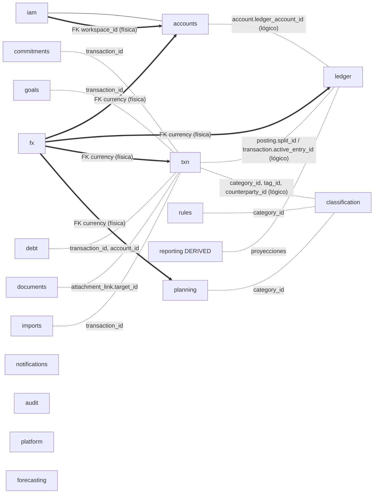
```mermaid
flowchart LR
  iam[iam] --- accounts[accounts]
  accounts -. "account.ledger_account_id (lógico)" .- ledger[ledger]
  txn[txn] -. "posting.split_id / transaction.active_entry_id (lógico)" .- ledger
  txn -. "category_id, tag_id, counterparty_id (lógico)" .- classification[classification]
  planning[planning] -. category_id .- classification
  commitments[commitments] -. transaction_id .- txn
  goals[goals] -. transaction_id .- txn
  debt[debt] -. "transaction_id, account_id" .- txn
  fx[fx] == "FK currency (física)" ==> accounts & ledger & txn & planning
  documents[documents] -. "attachment_link.target_id" .- txn
  imports[imports] -. transaction_id .- txn
  rules[rules] -. category_id .- classification
  reporting[reporting DERIVED] -. proyecciones .- ledger
  notifications[notifications]
  audit[audit]
  platform[platform]
  forecasting[forecasting]
  iam == "FK workspace_id (física)" ==> accounts
```

---

## 2. Validación de la lista candidata original de tablas

La lista de tablas del brief inicial se reconcilia con los contextos canónicos (ARCHITECTURE §3). La validación conceptual de agregados la hace [04-domain-model.md](04-domain-model.md); aquí se decide el destino físico.

| Tabla candidata | Decisión | Tabla final | Justificación |
|-----------------|----------|-------------|---------------|
| `users` | Renombrar | `iam.user` | Singular, schema `iam`; credenciales viven en el IdP (no hay `password_hash`). |
| `workspaces`, `workspace_members` | Mantener | `iam.workspace`, `iam.workspace_membership` | Multi-workspace desde día 1. |
| `institutions` | Mantener | `accounts.institution` | Parte de Accounts (ARCHITECTURE §3 #2). |
| `accounts` | Mantener | `accounts.account` | 1:1 con `ledger.ledger_account` ASSET/LIABILITY. |
| `account_balances` | Renombrar + derivar | `ledger.balance_snapshot` (+ `reporting.daily_balance`) | Derivados; saldo = Σ postings (ARCHITECTURE §4.1, 09 §8). |
| `ledger_accounts`, `journal_entries`, `postings` | Mantener | `ledger.*` | Núcleo de doble entrada. |
| `transactions` | Mantener | `txn.transaction` | Agregado de usuario; el ledger es invisible. |
| `transaction_splits` | Mantener | `txn.transaction_split` | Portador de la clasificación; `posting.split_id`. |
| `transfers` | Fusionar | `txn.transaction` kind `TRANSFER` + `txn.transaction_leg` | Una transferencia son dos legs de la misma moneda; tabla aparte no aporta datos (09 §6.4). |
| `currency_conversions` / `crypto_conversions` | Fusionar | `txn.conversion_detail` + `txn.conversion_fee` | La conversión es una transacción; pricing inmutable junto a ella. |
| `exchange_rates` | Mantener (singular) | `fx.exchange_rate` | Histórico inmutable con source/provider/as-of. |
| `currencies` | Mantener | `fx.currency` (+ `fx.workspace_currency`) | Incluye `kind` FIAT/CRYPTO/COMMODITY/CUSTOM. |
| `categories`, `category_groups`, `tags` | Mantener | `classification.*` | Soft-archive. |
| `transaction_tags` | Renombrar | `txn.split_tag` | Tags a nivel de split, no de transacción. |
| `custom_fields`, `custom_field_values` | Mantener / mover | `classification.custom_field_definition`, `txn.split_custom_field_value` | Definición en Classification, valor junto al split. |
| `merchants`, `payees`, `providers` | Fusionar | `classification.counterparty` (+ `counterparty_alias`) | Un solo concepto con `kind`. |
| `budgets`, `budget_items` | Mantener / renombrar | `planning.budget`, `planning.budget_line` | — |
| `budget_templates` | Mantener + versionar | `planning.budget_template`, `budget_template_version`, `budget_template_line` | Templates versionados; el presupuesto referencia la versión usada. |
| `financial_periods` / `months` | Renombrar | `planning.financial_period` | Periodos explícitos (no se asume mes calendario). |
| `month_closings` | Mantener | `planning.month_closing` | Con intentos (reapertura auditada). |
| `recurring_payments`, `subscriptions` | Fusionar | `commitments.recurring_definition` (+ `subscription` subtipo) + `recurring_occurrence` | Un motor de recurrencia. |
| `savings_goals`, `goal_contributions` | Mantener | `goals.*` | Contribución TRANSFER o EARMARK. |
| `loans`, `loan_payments` | Mantener / renombrar | `debt.loan`, `debt.loan_installment` | Pagos reales son transacciones; installment enlaza `paid_transaction_id`. |
| `credit_cards` | Mantener | `debt.credit_card`, `debt.credit_card_statement` | La tarjeta es un `accounts.account` LIABILITY + términos en Debt. |
| `documents`, `attachments` | Mantener | `documents.document`, `documents.attachment_link` | Link polimórfico (§5.11). |
| `imports`, `import_rows` | Renombrar | `imports.import_job`, `imports.staged_transaction` (+ `row_link`, `import_error`) | Alineado con [13-import-architecture.md](13-import-architecture.md) §14. |
| `bank_connections` | Renombrar (Phase 6+) | `imports.connection` | Cubre bancos y exchanges; secretos fuera de BD (`secret_ref`). |
| `import_mappings` | Renombrar | `imports.mapping_profile` | Versionado `(id, version)`. |
| `rules`, `rule_conditions`, `rule_actions` | Fusionar | `rules.rule` con `conditions`/`actions` JSONB | Ver justificación §5.13. |
| `notifications` | Mantener | `notifications.notification` (+ `preference`, `delivery`) | — |
| `audit_logs` | Renombrar | `audit.audit_log` | Append-only, particionada. |
| `reconciliations` | Mantener | `txn.reconciliation` (+ `reconciliation_item`) | Parte de Transactions (ARCHITECTURE §3 #4). |
| `forecasts` | Mantener (Phase 8) | `forecasting.forecast_run`, `forecast_point` | Escritas por el ACL; ML no escribe en BD core. |
| `net_worth_history` | Renombrar + derivar | `reporting.net_worth_snapshot` | Derivado, reconstruible. |
| `sessions`, `refresh_tokens` | **Reemplazar** | `iam.bff_session` | Sesión server-side del BFF (tokens cifrados, `sid` hasheado), tabla técnica sin RLS por workspace accesible solo por el rol `pf_bff` (§5.1). No es dato de negocio. |
| `api_keys` (usuario) | **Rechazar por ahora** | — | Sin clientes externos; reabrir si aparece CLI/móvil. |
| `jobs`/`queue` | **Rechazar** | — | BullMQ en Redis; durabilidad vía `platform.outbox`. |
| — (nuevas) | Agregar | `platform.outbox`, `platform.inbox`, `platform.idempotency_key`, `platform.operation`, `txn.transaction_journal_link`, `txn.duplicate_candidate`, `ledger.period_lock`, `reporting.projection_checkpoint` | Requeridas por ARCHITECTURE §4, §7, §8. |

---

## 3. Visión general de relaciones entre agregados (lógica)

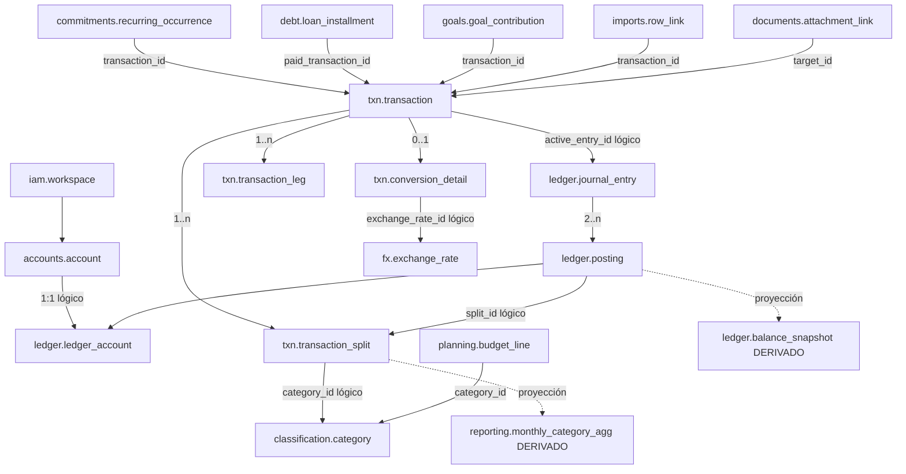
```mermaid
flowchart TB
  WS[iam.workspace] --> ACC[accounts.account]
  ACC -->|1:1 lógico| LA[ledger.ledger_account]
  TX[txn.transaction] -->|1..n| SP[txn.transaction_split]
  TX -->|active_entry_id lógico| JE[ledger.journal_entry]
  TX -->|1..n| LEG[txn.transaction_leg]
  JE -->|2..n| PO[ledger.posting]
  PO -->|split_id lógico| SP
  PO --> LA
  TX -->|0..1| CD[txn.conversion_detail]
  CD -->|exchange_rate_id lógico| FR[fx.exchange_rate]
  SP -->|category_id lógico| CAT[classification.category]
  OCC[commitments.recurring_occurrence] -->|transaction_id| TX
  INST[debt.loan_installment] -->|paid_transaction_id| TX
  GC[goals.goal_contribution] -->|transaction_id| TX
  IR[imports.row_link] -->|transaction_id| TX
  AL[documents.attachment_link] -->|target_id| TX
  BL[planning.budget_line] -->|category_id| CAT
  PO -. proyección .-> SNAP[ledger.balance_snapshot DERIVADO]
  SP -. proyección .-> AGG[reporting.monthly_category_agg DERIVADO]
```

---

## 4. Leyenda de los ERD

- Tipos según §1.1 (`money` = `NUMERIC(38,18)`, `ccy` = `varchar(16)` FK `fx.currency`).
- `PK`, `FK`, `UK` según Mermaid. Las referencias lógicas cross-context se anotan con `"ref ctx.tabla"`.
- Todas las tablas con `workspace_id` lo tienen `FK` a `iam.workspace` (se omite la relación en los diagramas por legibilidad).
- Las columnas estándar `created_by`, `updated_by`, `archived_by` se omiten en los ERD salvo que sean relevantes; existen según §1.2.

---

## 5. Schemas

### 5.1 `iam` — Identity & Workspace (Phase 1)

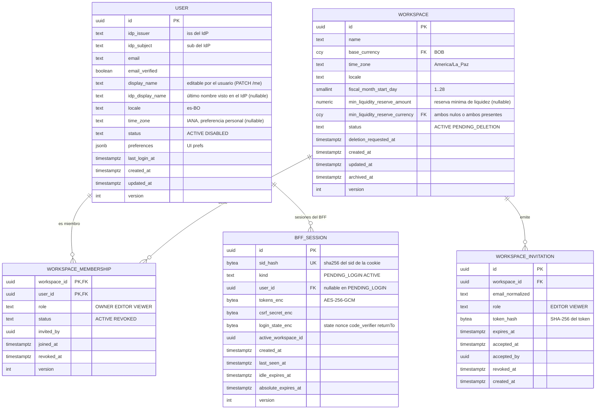
```mermaid
erDiagram
  USER ||--o{ WORKSPACE_MEMBERSHIP : "es miembro"
  WORKSPACE ||--o{ WORKSPACE_MEMBERSHIP : "tiene"
  WORKSPACE ||--o{ WORKSPACE_INVITATION : "emite"
  USER ||--o{ BFF_SESSION : "sesiones del BFF"
  USER {
    uuid id PK
    text idp_issuer "iss del IdP"
    text idp_subject "sub del IdP"
    text email
    boolean email_verified
    text display_name "editable por el usuario (PATCH /me)"
    text idp_display_name "último nombre visto en el IdP (nullable)"
    text locale "es-BO"
    text time_zone "IANA, preferencia personal (nullable)"
    text status "ACTIVE DISABLED"
    jsonb preferences "UI prefs"
    timestamptz last_login_at
    timestamptz created_at
    timestamptz updated_at
    int version
  }
  WORKSPACE {
    uuid id PK
    text name
    ccy base_currency FK "BOB"
    text time_zone "America/La_Paz"
    text locale
    smallint fiscal_month_start_day "1..28"
    numeric min_liquidity_reserve_amount "reserva minima de liquidez (nullable)"
    ccy min_liquidity_reserve_currency FK "ambos nulos o ambos presentes"
    text status "ACTIVE PENDING_DELETION"
    timestamptz deletion_requested_at
    timestamptz created_at
    timestamptz updated_at
    timestamptz archived_at
    int version
  }
  WORKSPACE_MEMBERSHIP {
    uuid workspace_id PK, FK
    uuid user_id PK, FK
    text role "OWNER EDITOR VIEWER"
    text status "ACTIVE REVOKED"
    uuid invited_by
    timestamptz joined_at
    timestamptz revoked_at
    int version
  }
  WORKSPACE_INVITATION {
    uuid id PK
    uuid workspace_id FK
    text email_normalized
    text role "EDITOR VIEWER"
    bytea token_hash "SHA-256 del token"
    timestamptz expires_at
    timestamptz accepted_at
    uuid accepted_by
    timestamptz revoked_at
    timestamptz created_at
  }
  BFF_SESSION {
    uuid id PK
    bytea sid_hash UK "sha256 del sid de la cookie"
    text kind "PENDING_LOGIN ACTIVE"
    uuid user_id FK "nullable en PENDING_LOGIN"
    bytea tokens_enc "AES-256-GCM"
    bytea csrf_secret_enc
    bytea login_state_enc "state nonce code_verifier returnTo"
    uuid active_workspace_id
    timestamptz created_at
    timestamptz last_seen_at
    timestamptz idle_expires_at
    timestamptz absolute_expires_at
    int version
  }
```

| Tabla | Unique | Check | Índices | RLS | version / archivo |
|-------|--------|-------|---------|-----|-------------------|
| `user` | `(idp_issuer, idp_subject)`; `lower(email)` parcial `WHERE status='ACTIVE'` | `status IN (...)` | — | **USR**: `id = app.user_id` (lectura propia); alta vía JIT provisioning con rol `pf_app` y policy `WITH CHECK` sobre `idp_subject` del token (función `SECURITY DEFINER` acotada `iam.provision_user`: sincroniza `email` siempre y `display_name` solo si cambió el nombre en el IdP —`idp_display_name`—, para no pisar el elegido por el usuario) | `version` |
| `workspace` | — | `fiscal_month_start_day BETWEEN 1 AND 28`; reserva mínima: `min_liquidity_reserve_amount` y `min_liquidity_reserve_currency` ambos nulos o ambos presentes, monto `>= 0` | — | **USR/WS**: `SELECT` si existe membership activa de `app.user_id`; `UPDATE` si `id = current_workspace_id()` | `version`, `archived_at` |
| `workspace_membership` | PK compuesta. **Al menos un OWNER activo** por workspace: invariante de dominio (`LAST_OWNER_CANNOT_LEAVE`) + constraint trigger diferido | `role IN ('OWNER','EDITOR','VIEWER')` | `(user_id) WHERE status='ACTIVE'` (resolver workspaces del usuario) | **USR**: `user_id = app.user_id OR workspace_id = current_workspace_id()` | `version` |
| `workspace_invitation` | `(workspace_id, email_normalized) WHERE accepted_at IS NULL AND revoked_at IS NULL` | `expires_at > created_at` | `(token_hash)` | WS | — (Phase 9) |
| `bff_session` | `sid_hash` | `kind IN ('PENDING_LOGIN','ACTIVE')`; `kind='ACTIVE'` ⇒ `user_id IS NOT NULL` | `(idle_expires_at)`, `(absolute_expires_at)` (purga) | **Sin RLS por workspace** (tabla técnica por usuario, en la allowlist del chequeo de catálogo): solo el rol `pf_bff` tiene `SELECT/INSERT/UPDATE/DELETE`; `pf_app`/`pf_worker` sin grants; `pf_maintenance` purga expiradas | `version` (refresh *single-flight*) |

### 5.2 `accounts` — Accounts & Institutions (Phase 1)

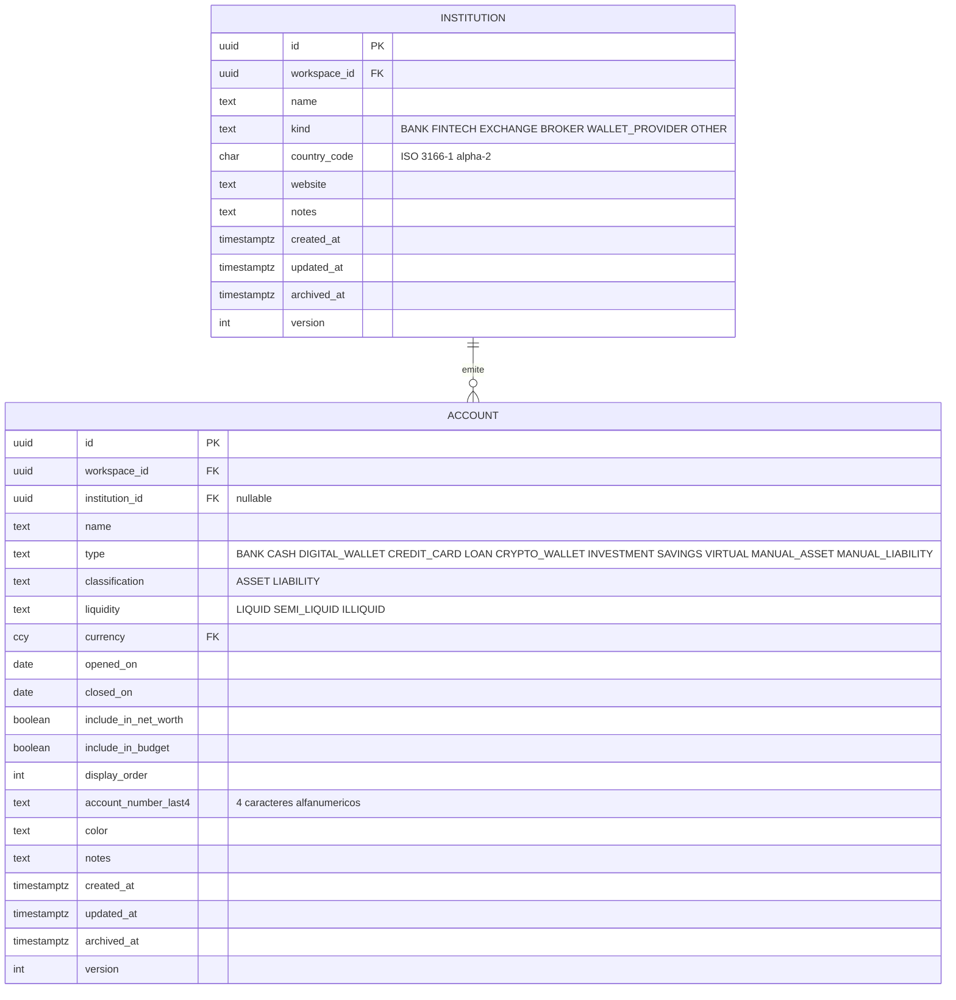
```mermaid
erDiagram
  INSTITUTION ||--o{ ACCOUNT : "emite"
  INSTITUTION {
    uuid id PK
    uuid workspace_id FK
    text name
    text kind "BANK FINTECH EXCHANGE BROKER WALLET_PROVIDER OTHER"
    char country_code "ISO 3166-1 alpha-2"
    text website
    text notes
    timestamptz created_at
    timestamptz updated_at
    timestamptz archived_at
    int version
  }
  ACCOUNT {
    uuid id PK
    uuid workspace_id FK
    uuid institution_id FK "nullable"
    text name
    text type "BANK CASH DIGITAL_WALLET CREDIT_CARD LOAN CRYPTO_WALLET INVESTMENT SAVINGS VIRTUAL MANUAL_ASSET MANUAL_LIABILITY"
    text classification "ASSET LIABILITY"
    text liquidity "LIQUID SEMI_LIQUID ILLIQUID"
    ccy currency FK
    date opened_on
    date closed_on
    boolean include_in_net_worth
    boolean include_in_budget
    int display_order
    text account_number_last4 "4 caracteres alfanumericos"
    text color
    text notes
    timestamptz created_at
    timestamptz updated_at
    timestamptz archived_at
    int version
  }
```

| Tabla | Unique | Check | Índices | RLS | version / archivo |
|-------|--------|-------|---------|-----|-------------------|
| `institution` | `(workspace_id, id)`; `(workspace_id, lower(name)) WHERE archived_at IS NULL` | `kind IN (...)` | — | WS | `version`, `archived_at` |
| `account` | `(workspace_id, id)`; `(workspace_id, lower(name)) WHERE archived_at IS NULL` | `type IN (...)` (11 valores); `classification IN ('ASSET','LIABILITY')`; coherencia `type`↔`classification` (`CREDIT_CARD`,`LOAN`,`MANUAL_LIABILITY` ⇒ `LIABILITY`; resto ⇒ `ASSET`); `liquidity IN ('LIQUID','SEMI_LIQUID','ILLIQUID')`; `account_number_last4 ~ '^[0-9]{4}$'`; `closed_on >= opened_on` | `(workspace_id, display_order) WHERE archived_at IS NULL` | WS | `version`, `archived_at` |

Notas: la moneda de una cuenta es **inmutable** una vez que existe su ledger account (cambiarla = archivar y crear otra). `account` **no** guarda `ledger_account_id`: el vínculo 1:1 vive en `ledger.ledger_account.source_account_id` (único por workspace), creado con *get-or-create* en la misma transacción del primer posting (ARCHITECTURE §7, FR-ACCOUNTS-003). Estado derivado: `ARCHIVED` si `archived_at` no es nulo, `CLOSED` si `closed_on` no es nulo, si no `ACTIVE`. `liquidity` tiene default por tipo (FR-ACCOUNTS-011); no existe `include_in_liquidity`. Nunca se guarda número de cuenta completo (minimización, [12-security.md](12-security.md) §13).

### 5.3 `ledger` — Financial Ledger (Phase 1)

Semántica completa e invariantes `INV-*` en [09-ledger-design.md](09-ledger-design.md) (§4, §5, §8, §10, §13). Este schema la materializa sin divergir.

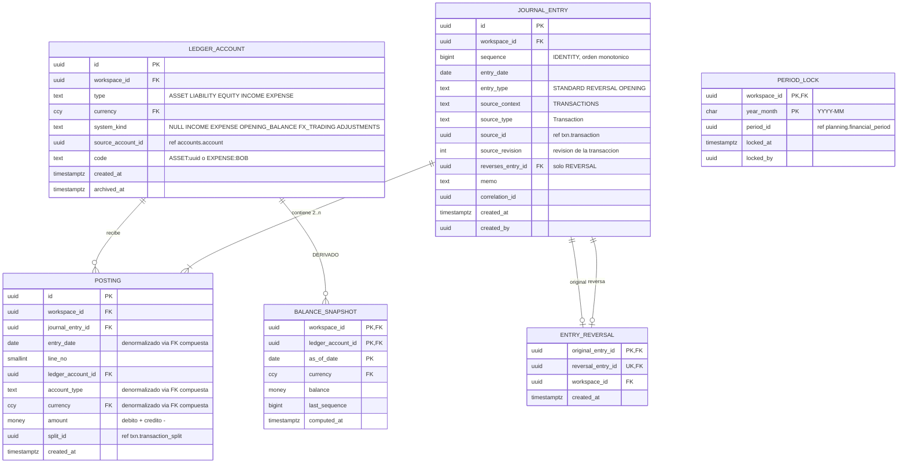
```mermaid
erDiagram
  LEDGER_ACCOUNT ||--o{ POSTING : "recibe"
  JOURNAL_ENTRY ||--|{ POSTING : "contiene 2..n"
  JOURNAL_ENTRY ||--o| ENTRY_REVERSAL : "original"
  JOURNAL_ENTRY ||--o| ENTRY_REVERSAL : "reversa"
  LEDGER_ACCOUNT ||--o{ BALANCE_SNAPSHOT : "DERIVADO"
  LEDGER_ACCOUNT {
    uuid id PK
    uuid workspace_id FK
    text type "ASSET LIABILITY EQUITY INCOME EXPENSE"
    ccy currency FK
    text system_kind "NULL INCOME EXPENSE OPENING_BALANCE FX_TRADING ADJUSTMENTS"
    uuid source_account_id "ref accounts.account"
    text code "ASSET:uuid o EXPENSE:BOB"
    timestamptz created_at
    timestamptz archived_at
  }
  JOURNAL_ENTRY {
    uuid id PK
    uuid workspace_id FK
    bigint sequence "IDENTITY, orden monotonico"
    date entry_date
    text entry_type "STANDARD REVERSAL OPENING"
    text source_context "TRANSACTIONS"
    text source_type "Transaction"
    uuid source_id "ref txn.transaction"
    int source_revision "revision de la transaccion"
    uuid reverses_entry_id FK "solo REVERSAL"
    text memo
    uuid correlation_id
    timestamptz created_at
    uuid created_by
  }
  ENTRY_REVERSAL {
    uuid original_entry_id PK, FK
    uuid reversal_entry_id UK, FK
    uuid workspace_id FK
    timestamptz created_at
  }
  POSTING {
    uuid id PK
    uuid workspace_id FK
    uuid journal_entry_id FK
    date entry_date "denormalizado via FK compuesta"
    smallint line_no
    uuid ledger_account_id FK
    text account_type "denormalizado via FK compuesta"
    ccy currency FK "denormalizado via FK compuesta"
    money amount "debito + credito -"
    uuid split_id "ref txn.transaction_split"
    timestamptz created_at
  }
  PERIOD_LOCK {
    uuid workspace_id PK, FK
    char year_month PK "YYYY-MM"
    uuid period_id "ref planning.financial_period"
    timestamptz locked_at
    uuid locked_by
  }
  BALANCE_SNAPSHOT {
    uuid workspace_id PK, FK
    uuid ledger_account_id PK, FK
    date as_of_date PK
    ccy currency FK
    money balance
    bigint last_sequence
    timestamptz computed_at
  }
```

| Tabla | Unique | Check | Índices | RLS | version / archivo |
|-------|--------|-------|---------|-----|-------------------|
| `ledger_account` | `(workspace_id, id)`; `(id, currency, type)` (destino de FK compuesta de `posting`); `(workspace_id, system_kind, currency) WHERE system_kind IS NOT NULL`; `(workspace_id, source_account_id) WHERE source_account_id IS NOT NULL` | `type IN (...)`; `system_kind IS NULL OR type IN ('INCOME','EXPENSE','EQUITY')`; `source_account_id IS NOT NULL` ⇔ `type IN ('ASSET','LIABILITY')` | — | WS (sin UPDATE salvo `archived_at`) | `archived_at` (sin `version`: no se edita) |
| `journal_entry` | `(workspace_id, id)`; `(id, entry_date)` (destino FK de posting); `(workspace_id, source_type, source_id, source_revision, entry_type)` | `entry_type IN ('STANDARD','REVERSAL','OPENING')`; `entry_type='REVERSAL'` ⇔ `reverses_entry_id IS NOT NULL` | `(workspace_id, source_type, source_id)`; `(workspace_id, entry_date)`; `(workspace_id, sequence)` | **WS-RO** | Inmutable |
| `entry_reversal` | PK `original_entry_id` (**una entry se revierte a lo sumo una vez**, INV-008); `UNIQUE (reversal_entry_id)` | `original_entry_id <> reversal_entry_id` | — | **WS-RO** | Inmutable. Proyección de `reversedByEntryId` sin necesidad de UPDATE (09 §5) |
| `posting` | `(journal_entry_id, line_no)` | `amount <> 0`; `account_type NOT IN ('INCOME','EXPENSE') OR split_id IS NOT NULL` (todo posting nominal referencia un split) | `(workspace_id, ledger_account_id, entry_date, id)` INCLUDE `(amount)` — saldos *as-of*; `(workspace_id, split_id) WHERE split_id IS NOT NULL` | **WS-RO** | Inmutable |
| `period_lock` | PK `(workspace_id, year_month)` (bloqueo **mensual**) | `year_month ~ '^[0-9]{4}-(0[1-9]\|1[0-2])$'` | — | WS (`pf_app`: INSERT/DELETE — reabrir elimina el lock, con audit) | — |
| `balance_snapshot` | PK | — | `(workspace_id, ledger_account_id, as_of_date DESC)` | **DRV** | **Derivado** y reconstruible (09 §8, INV-022). Borrable como caché cuando llega un asiento *backdated* |

Restricciones de BD que refuerzan el dominio:
1. **Zero-sum por moneda y entry** (INV-004): constraint trigger `DEFERRABLE INITIALLY DEFERRED` (SQL §10.2).
2. **Mínimo dos postings** por entry, ninguno en cero (INV-005): CHECK + constraint trigger diferido.
3. **Moneda del posting = moneda del ledger account** (INV-006): FK compuesta `(ledger_account_id, currency, account_type) → ledger_account(id, currency, type)`.
4. **`entry_date` y workspace coherentes** (INV-025): FKs compuestas `(journal_entry_id, entry_date)` y `(workspace_id, journal_entry_id)`.
5. **Inmutabilidad** (INV-007): sin grants `UPDATE/DELETE/TRUNCATE` + trigger `forbid_mutation`.
6. **Periodo cerrado** (INV-015): trigger `BEFORE INSERT` en `journal_entry` rechaza (`PF004`, `PERIOD_CLOSED`) la `entry_date` cuyo mes `to_char(entry_date, 'YYYY-MM')` tenga un `period_lock`. El bloqueo es **mensual** por `(workspace_id, year_month)`, igual que 09 §10. `period_lock` lo escribe Planning **sincrónicamente** vía `LedgerPeriodLockPort` (`@pf/ledger/contracts`) en la misma transacción del cierre (09 §10).
7. `sequence` (`bigint GENERATED ALWAYS AS IDENTITY`): monotónico global ⇒ monotónico por workspace (con huecos). Suficiente para checkpoints de rebuild; **no** es orden de commit (ver Preguntas abiertas).

### 5.4 `txn` — Transactions (Phase 1)

Modelo alineado con [09-ledger-design.md](09-ledger-design.md) §3, §6.17, §7: una `Transaction` tiene **legs** (movimientos sobre cuentas del usuario, con signo contable desde la perspectiva de la cuenta) y **splits** (porción nominal clasificada). INV-024: legs = postings de cuentas de usuario del asiento activo; INV-021: Σ splits = monto nominal.

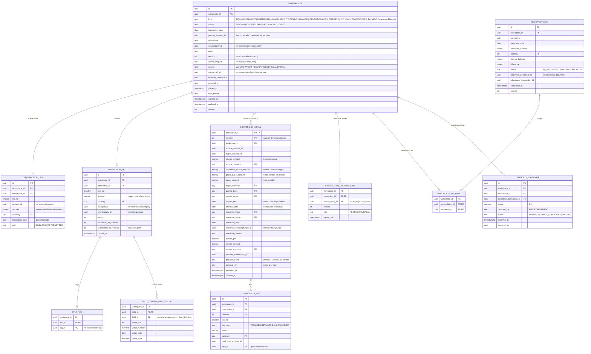
```mermaid
erDiagram
  TRANSACTION ||--|{ TRANSACTION_LEG : "mueve dinero"
  TRANSACTION ||--o{ TRANSACTION_SPLIT : "clasifica"
  TRANSACTION ||--o{ CONVERSION_DETAIL : "detalle por revision"
  CONVERSION_DETAIL ||--o{ CONVERSION_FEE : "fees"
  TRANSACTION ||--o{ TRANSACTION_JOURNAL_LINK : "historial de entries"
  TRANSACTION_SPLIT ||--o{ SPLIT_TAG : "tags"
  TRANSACTION_SPLIT ||--o{ SPLIT_CUSTOM_FIELD_VALUE : "custom fields"
  RECONCILIATION ||--o{ RECONCILIATION_ITEM : "incluye"
  TRANSACTION ||--o{ RECONCILIATION_ITEM : "reconciliada en"
  TRANSACTION ||--o{ DUPLICATE_CANDIDATE : "posible duplicado"
  TRANSACTION {
    uuid id PK
    uuid workspace_id FK
    text kind "INCOME EXPENSE TRANSFER REFUND ADJUSTMENT OPENING_BALANCE CONVERSION LOAN_DISBURSEMENT LOAN_PAYMENT CARD_PAYMENT (reservado Phase 4)"
    text status "PENDING POSTED CLEARED RECONCILED VOIDED"
    date transaction_date
    uuid primary_account_id "denormalizado: cuenta del leg principal"
    text description
    uuid counterparty_id "ref classification.counterparty"
    text notes
    int revision "sube con cada re-posting"
    uuid active_entry_id "ref ledger.journal_entry"
    text source "MANUAL IMPORT RECURRING DEBT GOAL SYSTEM"
    uuid source_ref_id "occurrence installment staged row"
    text external_namespace
    text external_id
    timestamptz voided_at
    text void_reason
    timestamptz created_at
    timestamptz updated_at
    int version
  }
  TRANSACTION_LEG {
    uuid id PK
    uuid workspace_id FK
    uuid transaction_id FK
    smallint leg_no
    uuid account_id "ref accounts.account"
    money amount "signo contable desde la cuenta"
    ccy currency FK
    date transaction_date "denormalizado"
    text role "MAIN SOURCE TARGET FEE"
  }
  TRANSACTION_SPLIT {
    uuid id PK
    uuid workspace_id FK
    uuid transaction_id FK
    smallint line_no
    money amount "monto nominal con signo"
    ccy currency FK
    uuid category_id "ref classification.category"
    uuid counterparty_id "override opcional"
    text memo
    int introduced_in_revision
    int superseded_in_revision "NULL si vigente"
    timestamptz created_at
  }
  SPLIT_TAG {
    uuid workspace_id FK
    uuid split_id PK, FK
    uuid tag_id PK "ref classification.tag"
  }
  SPLIT_CUSTOM_FIELD_VALUE {
    uuid workspace_id FK
    uuid split_id PK, FK
    uuid field_id PK "ref classification.custom_field_definition"
    text value_text
    numeric value_number
    date value_date
    boolean value_bool
  }
  CONVERSION_DETAIL {
    uuid transaction_id PK, FK
    int revision PK "revision de la transaccion"
    uuid workspace_id FK
    uuid source_account_id
    uuid target_account_id
    money source_amount "bruto entregado"
    ccy source_currency FK
    money converted_source_amount "source - fees en origen"
    money gross_target_amount "antes de fees en destino"
    money target_amount "neto recibido"
    ccy target_currency FK
    ccy quoted_base FK
    ccy quoted_quote FK
    rate quoted_rate "como lo dio el proveedor"
    rate effective_rate "orientacion de display"
    ccy reference_base FK
    ccy reference_quote FK
    rate reference_rate
    uuid reference_exchange_rate_id "ref fx.exchange_rate"
    text reference_source
    numeric spread_pct
    money spread_amount
    ccy spread_currency FK
    uuid provider_counterparty_id
    text provider_name "Binance P2P casa de cambio"
    text external_ref "orden o tx hash"
    timestamptz executed_at
    timestamptz created_at
  }
  CONVERSION_FEE {
    uuid id PK
    uuid workspace_id FK
    uuid transaction_id FK
    int revision FK
    smallint fee_no
    text fee_type "PROVIDER NETWORK BANK TAX OTHER"
    money amount
    ccy currency FK
    uuid paid_from_account_id
    uuid split_id FK "split categoria Fees"
  }
  TRANSACTION_JOURNAL_LINK {
    uuid workspace_id FK
    uuid transaction_id PK, FK
    uuid journal_entry_id PK "ref ledger.journal_entry"
    int revision
    text role "POSTING REVERSAL"
    timestamptz created_at
  }
  RECONCILIATION {
    uuid id PK
    uuid workspace_id FK
    uuid account_id
    date statement_date
    money statement_balance
    ccy currency FK
    money cleared_balance
    money difference
    text status "IN_PROGRESS COMPLETED CANCELLED"
    uuid statement_document_id "ref documents.document"
    uuid adjustment_transaction_id
    timestamptz completed_at
    int version
  }
  RECONCILIATION_ITEM {
    uuid workspace_id FK
    uuid reconciliation_id PK, FK
    uuid transaction_id PK, FK
  }
  DUPLICATE_CANDIDATE {
    uuid id PK
    uuid workspace_id FK
    uuid transaction_id FK
    uuid candidate_transaction_id FK
    numeric score "0..1"
    text detected_by "IMPORT HEURISTIC"
    text status "OPEN CONFIRMED_DUPLICATE DISMISSED"
    timestamptz resolved_at
    uuid resolved_by
  }
```

| Tabla | Unique | Check | Índices | RLS | version / archivo |
|-------|--------|-------|---------|-----|-------------------|
| `transaction` | `(workspace_id, id)`; `(workspace_id, primary_account_id, external_namespace, external_id) WHERE external_id IS NOT NULL` (13 §7.3) | `kind IN (...)`; `status IN (...)`; `status='VOIDED'` ⇔ `voided_at IS NOT NULL`; `status IN ('PENDING','VOIDED')` ⇔ `active_entry_id IS NULL` (INV-023) | `(workspace_id, transaction_date DESC, id DESC)` (listado/cursor); `(workspace_id, counterparty_id)`; `(workspace_id, status) WHERE status='PENDING'`; `gin (to_tsvector('simple', description))` | WS | `version` (no archivo: se **anula** con `void`) |
| `transaction_leg` | `(transaction_id, leg_no)` | `amount <> 0`; `role IN (...)` | `(workspace_id, account_id, transaction_date DESC, transaction_id DESC)` (registro de cuenta) | WS | Reemplazados en cada revisión (filas de la revisión anterior se conservan con `superseded_in_revision`, columna omitida en ERD) |
| `transaction_split` | `(workspace_id, id)`; `(transaction_id, line_no, introduced_in_revision)` | `amount <> 0`; `superseded_in_revision IS NULL OR superseded_in_revision > introduced_in_revision` | `(workspace_id, category_id) WHERE superseded_in_revision IS NULL`; `(transaction_id)` | WS | Nunca se borra (postings históricos lo referencian) |
| `split_tag` | PK | — | `(workspace_id, tag_id)` | WS | — |
| `split_custom_field_value` | PK | `num_nonnulls(value_text, value_number, value_date, value_bool) = 1` | `(workspace_id, field_id)` | WS | — |
| `conversion_detail` | PK `(transaction_id, revision)` | `source_currency <> target_currency`; montos `> 0`; tasas `> 0`; `quoted_base <> quoted_quote` | `(workspace_id, source_currency, target_currency, executed_at)` | **WS-RO** (inmutable, INV-011/012: editar = reversa + nuevo asiento + nueva revisión del detalle; las anteriores se conservan) | Inmutable; el vigente es el de la revisión activa |
| `conversion_fee` | `(transaction_id, revision, fee_no)` | `amount > 0` | — | **WS-RO** | Inmutable |
| `transaction_journal_link` | PK | `role IN (...)` | `(workspace_id, journal_entry_id)` | **WS-RO** | Append-only |
| `reconciliation` | `(workspace_id, account_id) WHERE status='IN_PROGRESS'` | — | `(workspace_id, account_id, statement_date DESC)` | WS | `version` |
| `reconciliation_item` | PK | — | `(workspace_id, transaction_id)` | WS | — |
| `duplicate_candidate` | `(workspace_id, least(transaction_id, candidate_transaction_id), greatest(transaction_id, candidate_transaction_id))` | `transaction_id <> candidate_transaction_id`; `score BETWEEN 0 AND 1` | `(workspace_id, status) WHERE status='OPEN'` | WS | — |

Reglas adicionales:
- **Σ splits vigentes = monto nominal** (INV-021) para kinds con parte nominal (`INCOME`, `EXPENSE`, `REFUND`, categorizados de `ADJUSTMENT`, componentes no-principal de `LOAN_PAYMENT`): validado en dominio y por constraint trigger diferido en `txn`. `TRANSFER`/`CONVERSION` solo tienen splits para fees (09 §6.17).
- **Transferencias**: no hay tabla `transfer`; una transferencia es `kind='TRANSFER'` con legs `SOURCE`/`TARGET` en la misma moneda (cross-currency ⇒ `CONVERSION`). El recurso API `/transfers` es una fachada sobre este modelo ([10-api-design.md](10-api-design.md)). El pago de tarjeta de crédito es una transferencia (`kind='TRANSFER'`, destino `LIABILITY`); `CARD_PAYMENT` queda reservado para `debt/credit-cards` (Phase 4).
- **Edición de una transacción posteada** que afecta montos/cuentas/fecha/moneda: `revision+1`, entry `REVERSAL` + nueva entry `STANDARD` con `source_revision = revision`; `active_entry_id` apunta a la nueva y `transaction_journal_link` conserva la historia. Los legs/splits anteriores se marcan `superseded_in_revision` (los postings históricos siguen apuntando a splits existentes). Recategorizar **no** toca el ledger (INV-033): se actualiza `category_id` del split vigente in situ.
- **Edición de una conversión** (FR-TRANSACTIONS-024): mismo patrón — `revision+1`, entry `REVERSAL` + nueva entry `STANDARD` y **nueva fila** `conversion_detail`/`conversion_fee` con esa `revision`, todo en la misma transacción de BD; las revisiones anteriores del detalle nunca se modifican.

### 5.5 `classification` — Categories, Tags, Custom fields, Counterparties (Phase 1)

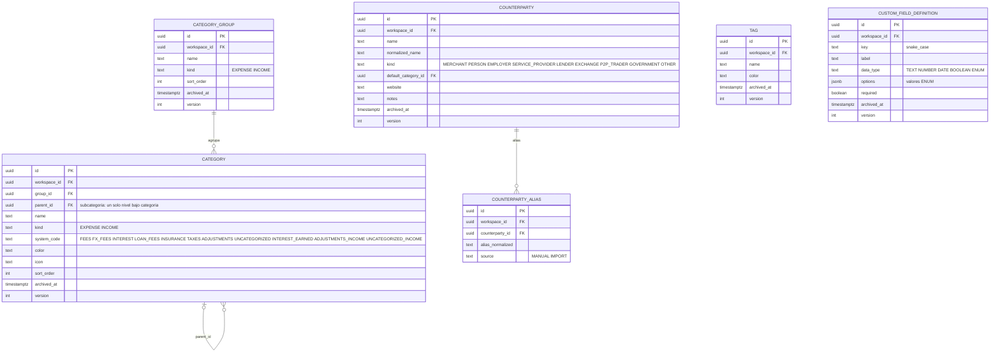
```mermaid
erDiagram
  CATEGORY_GROUP ||--o{ CATEGORY : "agrupa"
  CATEGORY |o--o{ CATEGORY : "parent_id"
  COUNTERPARTY ||--o{ COUNTERPARTY_ALIAS : "alias"
  CATEGORY_GROUP {
    uuid id PK
    uuid workspace_id FK
    text name
    text kind "EXPENSE INCOME"
    int sort_order
    timestamptz archived_at
    int version
  }
  CATEGORY {
    uuid id PK
    uuid workspace_id FK
    uuid group_id FK
    uuid parent_id FK "subcategoria: un solo nivel bajo categoria"
    text name
    text kind "EXPENSE INCOME"
    text system_code "FEES FX_FEES INTEREST LOAN_FEES INSURANCE TAXES ADJUSTMENTS UNCATEGORIZED INTEREST_EARNED ADJUSTMENTS_INCOME UNCATEGORIZED_INCOME"
    text color
    text icon
    int sort_order
    timestamptz archived_at
    int version
  }
  TAG {
    uuid id PK
    uuid workspace_id FK
    text name
    text color
    timestamptz archived_at
    int version
  }
  CUSTOM_FIELD_DEFINITION {
    uuid id PK
    uuid workspace_id FK
    text key "snake_case"
    text label
    text data_type "TEXT NUMBER DATE BOOLEAN ENUM"
    jsonb options "valores ENUM"
    boolean required
    timestamptz archived_at
    int version
  }
  COUNTERPARTY {
    uuid id PK
    uuid workspace_id FK
    text name
    text normalized_name
    text kind "MERCHANT PERSON EMPLOYER SERVICE_PROVIDER LENDER EXCHANGE P2P_TRADER GOVERNMENT OTHER"
    uuid default_category_id FK
    text website
    text notes
    timestamptz archived_at
    int version
  }
  COUNTERPARTY_ALIAS {
    uuid id PK
    uuid workspace_id FK
    uuid counterparty_id FK
    text alias_normalized
    text source "MANUAL IMPORT"
  }
```

| Tabla | Unique | Check | Índices | RLS | version / archivo |
|-------|--------|-------|---------|-----|-------------------|
| `category_group` | `(workspace_id, kind, lower(name)) WHERE archived_at IS NULL` | `kind IN ('EXPENSE','INCOME')` | — | WS | `version`, `archived_at` |
| `category` | `(workspace_id, group_id, coalesce(parent_id, '00000000-0000-0000-0000-000000000000'), lower(name)) WHERE archived_at IS NULL` (único por padre); `(workspace_id, system_code) WHERE system_code IS NOT NULL` | `system_code IN (...)` (11 códigos); `kind` = `kind` del grupo y del padre (trigger); `parent_id <> id`; jerarquía grupo → categoría → subcategoría: una subcategoría no tiene hijas (trigger, `CATEGORY_DEPTH_EXCEEDED`) | `(workspace_id, group_id, sort_order)` | WS | `version`, `archived_at`. Categorías de sistema no archivables (trigger) |
| `tag` | `(workspace_id, lower(name)) WHERE archived_at IS NULL` | — | — | WS | `version`, `archived_at` |
| `custom_field_definition` | `(workspace_id, key) WHERE archived_at IS NULL` | `key ~ '^[a-z][a-z0-9_]{0,39}$'`; `data_type='ENUM'` ⇒ `jsonb_typeof(options)='array'` | — | WS | `version`, `archived_at` |
| `counterparty` | `(workspace_id, normalized_name) WHERE archived_at IS NULL` | — | `gin (normalized_name gin_trgm_ops)` (fuzzy match, `pg_trgm`) | WS | `version`, `archived_at` |
| `counterparty_alias` | `(workspace_id, alias_normalized)` | — | — | WS | — |

### 5.6 `planning` — Periods, Budgets, Templates, Month closing (Phase 2)

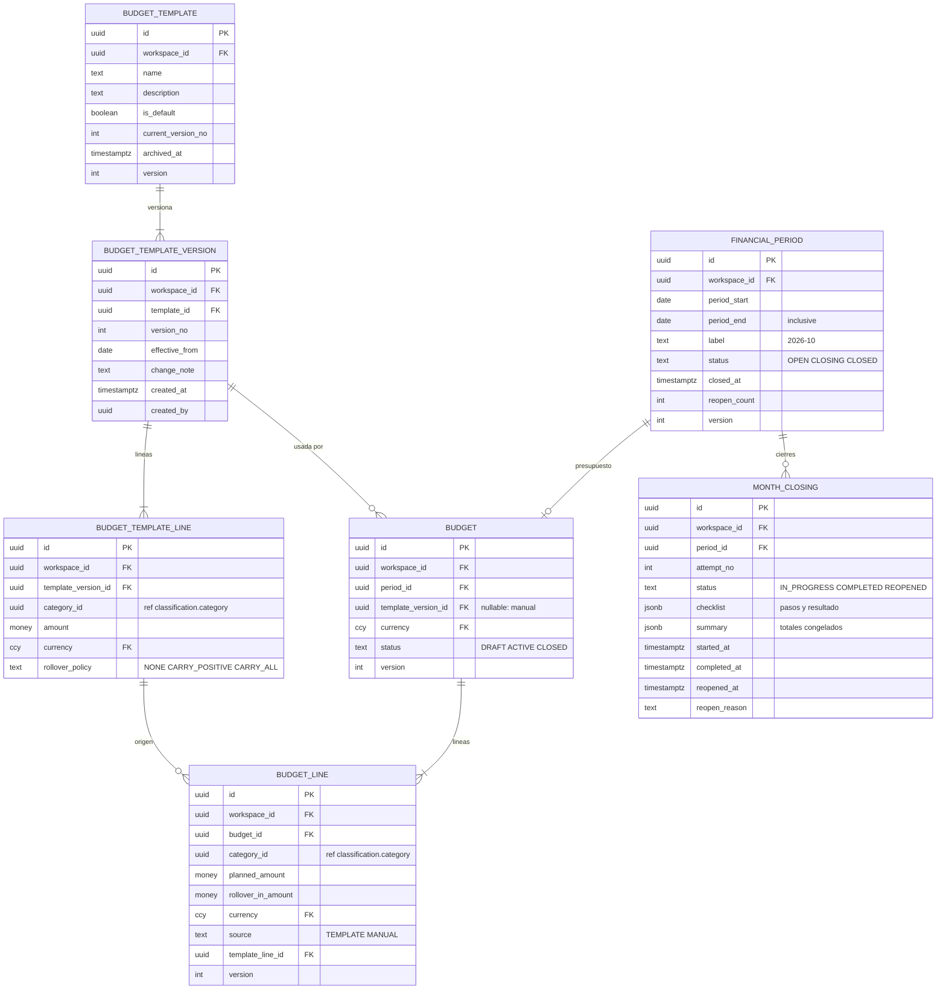
```mermaid
erDiagram
  BUDGET_TEMPLATE ||--|{ BUDGET_TEMPLATE_VERSION : "versiona"
  BUDGET_TEMPLATE_VERSION ||--|{ BUDGET_TEMPLATE_LINE : "lineas"
  FINANCIAL_PERIOD ||--o| BUDGET : "presupuesto"
  BUDGET_TEMPLATE_VERSION ||--o{ BUDGET : "usada por"
  BUDGET ||--|{ BUDGET_LINE : "lineas"
  BUDGET_TEMPLATE_LINE ||--o{ BUDGET_LINE : "origen"
  FINANCIAL_PERIOD ||--o{ MONTH_CLOSING : "cierres"
  FINANCIAL_PERIOD {
    uuid id PK
    uuid workspace_id FK
    date period_start
    date period_end "inclusive"
    text label "2026-10"
    text status "OPEN CLOSING CLOSED"
    timestamptz closed_at
    int reopen_count
    int version
  }
  BUDGET_TEMPLATE {
    uuid id PK
    uuid workspace_id FK
    text name
    text description
    boolean is_default
    int current_version_no
    timestamptz archived_at
    int version
  }
  BUDGET_TEMPLATE_VERSION {
    uuid id PK
    uuid workspace_id FK
    uuid template_id FK
    int version_no
    date effective_from
    text change_note
    timestamptz created_at
    uuid created_by
  }
  BUDGET_TEMPLATE_LINE {
    uuid id PK
    uuid workspace_id FK
    uuid template_version_id FK
    uuid category_id "ref classification.category"
    money amount
    ccy currency FK
    text rollover_policy "NONE CARRY_POSITIVE CARRY_ALL"
  }
  BUDGET {
    uuid id PK
    uuid workspace_id FK
    uuid period_id FK
    uuid template_version_id FK "nullable: manual"
    ccy currency FK
    text status "DRAFT ACTIVE CLOSED"
    int version
  }
  BUDGET_LINE {
    uuid id PK
    uuid workspace_id FK
    uuid budget_id FK
    uuid category_id "ref classification.category"
    money planned_amount
    money rollover_in_amount
    ccy currency FK
    text source "TEMPLATE MANUAL"
    uuid template_line_id FK
    int version
  }
  MONTH_CLOSING {
    uuid id PK
    uuid workspace_id FK
    uuid period_id FK
    int attempt_no
    text status "IN_PROGRESS COMPLETED REOPENED"
    jsonb checklist "pasos y resultado"
    jsonb summary "totales congelados"
    timestamptz started_at
    timestamptz completed_at
    timestamptz reopened_at
    text reopen_reason
  }
```

| Tabla | Unique | Check | Índices | RLS | version / archivo |
|-------|--------|-------|---------|-----|-------------------|
| `financial_period` | `(workspace_id, period_start)`; **EXCLUDE USING gist** `(workspace_id WITH =, daterange(period_start, period_end, '[]') WITH &&)` — sin solapamientos (`btree_gist`) | `period_end >= period_start` | `(workspace_id, status)` | WS | `version` |
| `budget_template` | `(workspace_id, lower(name)) WHERE archived_at IS NULL`; `(workspace_id) WHERE is_default AND archived_at IS NULL` | — | — | WS | `version`, `archived_at` |
| `budget_template_version` | `(template_id, version_no)` | `version_no >= 1` | — | **WS-RO** (versiones inmutables; cambiar template = nueva versión) | Inmutable |
| `budget_template_line` | `(template_version_id, category_id, currency)` | `amount >= 0` | — | **WS-RO** | Inmutable |
| `budget` | `(workspace_id, period_id, currency)` | — | — | WS | `version` |
| `budget_line` | `(budget_id, category_id, currency)` | `planned_amount >= 0` | `(workspace_id, category_id)` | WS | `version` |
| `month_closing` | `(period_id, attempt_no)`; `(period_id) WHERE status='IN_PROGRESS'` | — | — | WS | Append-only por intento |

Los **actuals** del presupuesto no se guardan en `planning`: se leen de `reporting.monthly_category_agg` / `reporting.budget_snapshot` (derivados, [14-reporting.md](14-reporting.md)) vía `@pf/reporting/contracts`; el `summary` del cierre congela los valores al cerrar.

### 5.7 `commitments` — Recurrence engine & Subscriptions (Phase 3)

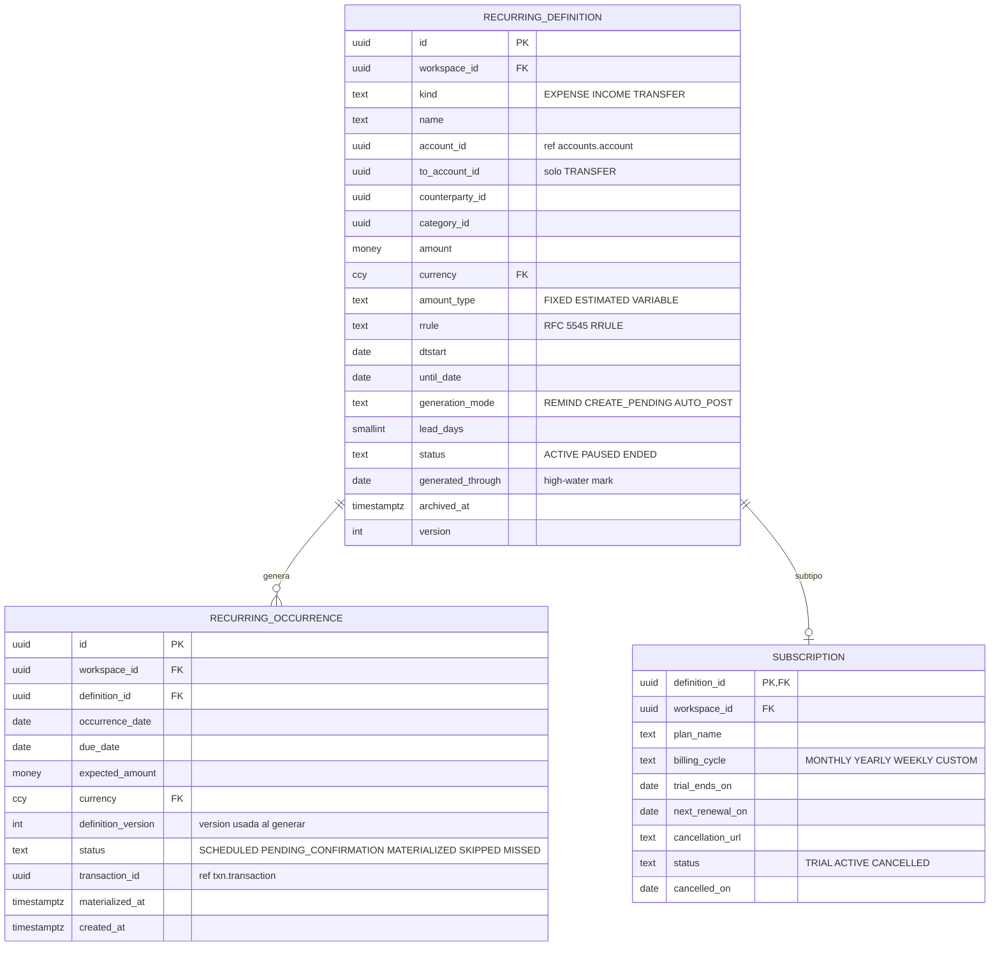
```mermaid
erDiagram
  RECURRING_DEFINITION ||--o{ RECURRING_OCCURRENCE : "genera"
  RECURRING_DEFINITION ||--o| SUBSCRIPTION : "subtipo"
  RECURRING_DEFINITION {
    uuid id PK
    uuid workspace_id FK
    text kind "EXPENSE INCOME TRANSFER"
    text name
    uuid account_id "ref accounts.account"
    uuid to_account_id "solo TRANSFER"
    uuid counterparty_id
    uuid category_id
    money amount
    ccy currency FK
    text amount_type "FIXED ESTIMATED VARIABLE"
    text rrule "RFC 5545 RRULE"
    date dtstart
    date until_date
    text generation_mode "REMIND CREATE_PENDING AUTO_POST"
    smallint lead_days
    text status "ACTIVE PAUSED ENDED"
    date generated_through "high-water mark"
    timestamptz archived_at
    int version
  }
  SUBSCRIPTION {
    uuid definition_id PK, FK
    uuid workspace_id FK
    text plan_name
    text billing_cycle "MONTHLY YEARLY WEEKLY CUSTOM"
    date trial_ends_on
    date next_renewal_on
    text cancellation_url
    text status "TRIAL ACTIVE CANCELLED"
    date cancelled_on
  }
  RECURRING_OCCURRENCE {
    uuid id PK
    uuid workspace_id FK
    uuid definition_id FK
    date occurrence_date
    date due_date
    money expected_amount
    ccy currency FK
    int definition_version "version usada al generar"
    text status "SCHEDULED PENDING_CONFIRMATION MATERIALIZED SKIPPED MISSED"
    uuid transaction_id "ref txn.transaction"
    timestamptz materialized_at
    timestamptz created_at
  }
```

| Tabla | Unique | Check | Índices | RLS | version / archivo |
|-------|--------|-------|---------|-----|-------------------|
| `recurring_definition` | `(workspace_id, id)` | `kind='TRANSFER'` ⇔ `to_account_id IS NOT NULL`; `amount > 0`; `until_date IS NULL OR until_date >= dtstart`; `lead_days BETWEEN 0 AND 60` | `(workspace_id, status, generated_through) WHERE status='ACTIVE'` (scheduler) | WS | `version`, `archived_at` |
| `subscription` | PK | — | `(workspace_id, next_renewal_on)` | WS | via definición |
| `recurring_occurrence` | **`(definition_id, occurrence_date)`** — generación idempotente (`INSERT ... ON CONFLICT DO NOTHING`); `(transaction_id) WHERE transaction_id IS NOT NULL` | `status='MATERIALIZED'` ⇔ `transaction_id IS NOT NULL` | `(workspace_id, due_date) WHERE status IN ('SCHEDULED','PENDING_CONFIRMATION')` (cash-flow calendar) | WS | — |

### 5.8 `goals` — Savings goals (Phase 4)

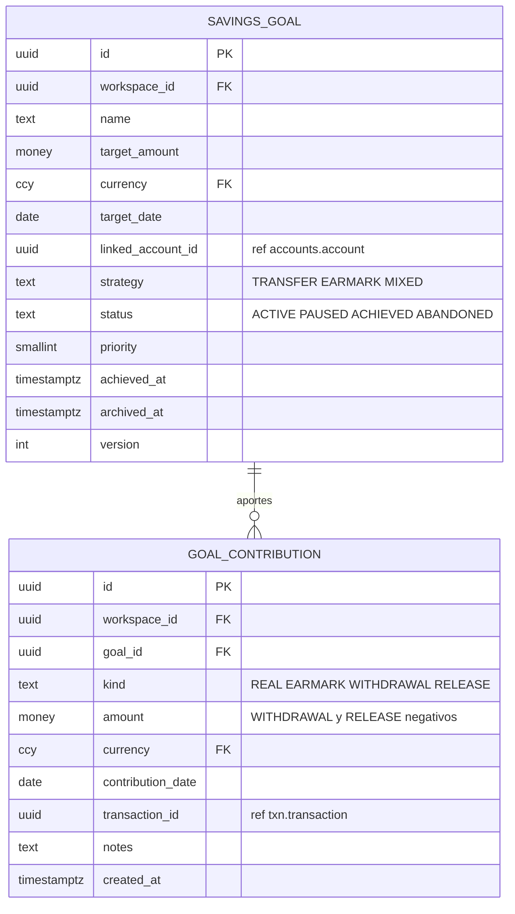
```mermaid
erDiagram
  SAVINGS_GOAL ||--o{ GOAL_CONTRIBUTION : "aportes"
  SAVINGS_GOAL {
    uuid id PK
    uuid workspace_id FK
    text name
    money target_amount
    ccy currency FK
    date target_date
    uuid linked_account_id "ref accounts.account"
    text strategy "TRANSFER EARMARK MIXED"
    text status "ACTIVE PAUSED ACHIEVED ABANDONED"
    smallint priority
    timestamptz achieved_at
    timestamptz archived_at
    int version
  }
  GOAL_CONTRIBUTION {
    uuid id PK
    uuid workspace_id FK
    uuid goal_id FK
    text kind "REAL EARMARK WITHDRAWAL RELEASE"
    money amount "WITHDRAWAL y RELEASE negativos"
    ccy currency FK
    date contribution_date
    uuid transaction_id "ref txn.transaction"
    text notes
    timestamptz created_at
  }
```

| Tabla | Unique | Check | Índices | RLS | version / archivo |
|-------|--------|-------|---------|-----|-------------------|
| `savings_goal` | `(workspace_id, lower(name)) WHERE archived_at IS NULL` | `target_amount > 0`; `strategy IN ('TRANSFER','MIXED')` ⇒ `linked_account_id IS NOT NULL` | — | WS | `version`, `archived_at` |
| `goal_contribution` | `(transaction_id) WHERE transaction_id IS NOT NULL` | `kind IN ('REAL','WITHDRAWAL')` ⇔ `transaction_id IS NOT NULL` (04 §5); `kind IN ('WITHDRAWAL','RELEASE')` ⇔ `amount < 0` | `(workspace_id, goal_id, contribution_date)` | **WS-RO** (corrección = contribución inversa) | Append-only |

### 5.9 `debt` — Loans, amortization, credit cards (Phase 4)

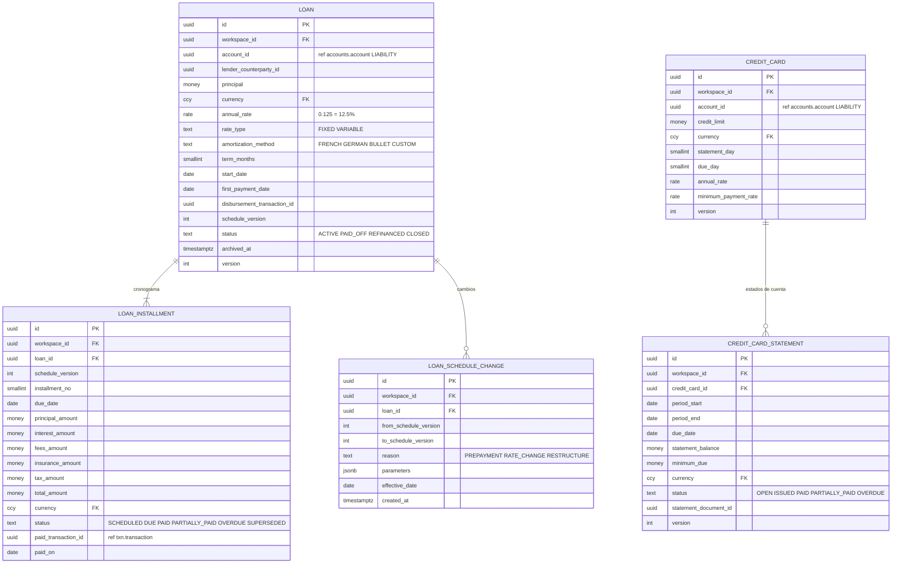
```mermaid
erDiagram
  LOAN ||--|{ LOAN_INSTALLMENT : "cronograma"
  LOAN ||--o{ LOAN_SCHEDULE_CHANGE : "cambios"
  CREDIT_CARD ||--o{ CREDIT_CARD_STATEMENT : "estados de cuenta"
  LOAN {
    uuid id PK
    uuid workspace_id FK
    uuid account_id "ref accounts.account LIABILITY"
    uuid lender_counterparty_id
    money principal
    ccy currency FK
    rate annual_rate "0.125 = 12.5%"
    text rate_type "FIXED VARIABLE"
    text amortization_method "FRENCH GERMAN BULLET CUSTOM"
    smallint term_months
    date start_date
    date first_payment_date
    uuid disbursement_transaction_id
    int schedule_version
    text status "ACTIVE PAID_OFF REFINANCED CLOSED"
    timestamptz archived_at
    int version
  }
  LOAN_INSTALLMENT {
    uuid id PK
    uuid workspace_id FK
    uuid loan_id FK
    int schedule_version
    smallint installment_no
    date due_date
    money principal_amount
    money interest_amount
    money fees_amount
    money insurance_amount
    money tax_amount
    money total_amount
    ccy currency FK
    text status "SCHEDULED DUE PAID PARTIALLY_PAID OVERDUE SUPERSEDED"
    uuid paid_transaction_id "ref txn.transaction"
    date paid_on
  }
  LOAN_SCHEDULE_CHANGE {
    uuid id PK
    uuid workspace_id FK
    uuid loan_id FK
    int from_schedule_version
    int to_schedule_version
    text reason "PREPAYMENT RATE_CHANGE RESTRUCTURE"
    jsonb parameters
    date effective_date
    timestamptz created_at
  }
  CREDIT_CARD {
    uuid id PK
    uuid workspace_id FK
    uuid account_id "ref accounts.account LIABILITY"
    money credit_limit
    ccy currency FK
    smallint statement_day
    smallint due_day
    rate annual_rate
    rate minimum_payment_rate
    int version
  }
  CREDIT_CARD_STATEMENT {
    uuid id PK
    uuid workspace_id FK
    uuid credit_card_id FK
    date period_start
    date period_end
    date due_date
    money statement_balance
    money minimum_due
    ccy currency FK
    text status "OPEN ISSUED PAID PARTIALLY_PAID OVERDUE"
    uuid statement_document_id
    int version
  }
```

| Tabla | Unique | Check | Índices | RLS | version / archivo |
|-------|--------|-------|---------|-----|-------------------|
| `loan` | `(workspace_id, account_id)` | `principal > 0`; `annual_rate >= 0`; `term_months > 0` | `(workspace_id, status)` | WS | `version`, `archived_at` |
| `loan_installment` | **`(loan_id, schedule_version, installment_no)`**; `(paid_transaction_id) WHERE paid_transaction_id IS NOT NULL` | `total_amount = principal_amount + interest_amount + fees_amount + insurance_amount + tax_amount`; todos `>= 0` | `(workspace_id, due_date) WHERE status IN ('SCHEDULED','DUE','OVERDUE')` | WS | Versionado por `schedule_version` (las cuotas de un cronograma reemplazado pasan a `SUPERSEDED`, nunca se borran) |
| `loan_schedule_change` | `(loan_id, to_schedule_version)` | `to_schedule_version = from_schedule_version + 1` | — | **WS-RO** | Append-only |
| `credit_card` | `(workspace_id, account_id)` | `statement_day BETWEEN 1 AND 28`; `due_day BETWEEN 1 AND 31` | — | WS | `version` |
| `credit_card_statement` | `(credit_card_id, period_end)` | `period_end >= period_start` | `(workspace_id, due_date)` | WS | `version` |

### 5.10 `fx` — Currencies & market data (Phase 1 manual / Phase 5 providers)

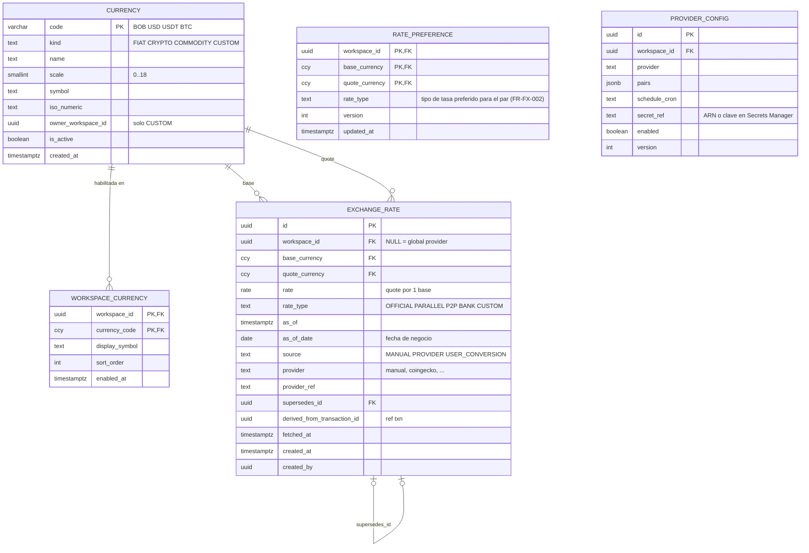
```mermaid
erDiagram
  CURRENCY ||--o{ WORKSPACE_CURRENCY : "habilitada en"
  CURRENCY ||--o{ EXCHANGE_RATE : "base"
  CURRENCY ||--o{ EXCHANGE_RATE : "quote"
  EXCHANGE_RATE |o--o| EXCHANGE_RATE : "supersedes_id"
  CURRENCY {
    varchar code PK "BOB USD USDT BTC"
    text kind "FIAT CRYPTO COMMODITY CUSTOM"
    text name
    smallint scale "0..18"
    text symbol
    text iso_numeric
    uuid owner_workspace_id "solo CUSTOM"
    boolean is_active
    timestamptz created_at
  }
  WORKSPACE_CURRENCY {
    uuid workspace_id PK, FK
    ccy currency_code PK, FK
    text display_symbol
    int sort_order
    timestamptz enabled_at
  }
  RATE_PREFERENCE {
    uuid workspace_id PK, FK
    ccy base_currency PK, FK
    ccy quote_currency PK, FK
    text rate_type "tipo de tasa preferido para el par (FR-FX-002)"
    int version
    timestamptz updated_at
  }
  EXCHANGE_RATE {
    uuid id PK
    uuid workspace_id FK "NULL = global provider"
    ccy base_currency FK
    ccy quote_currency FK
    rate rate "quote por 1 base"
    text rate_type "OFFICIAL PARALLEL P2P BANK CUSTOM"
    timestamptz as_of
    date as_of_date "fecha de negocio"
    text source "MANUAL PROVIDER USER_CONVERSION"
    text provider "manual, coingecko, ..."
    text provider_ref
    uuid supersedes_id FK
    uuid derived_from_transaction_id "ref txn"
    timestamptz fetched_at
    timestamptz created_at
    uuid created_by
  }
  PROVIDER_CONFIG {
    uuid id PK
    uuid workspace_id FK
    text provider
    jsonb pairs
    text schedule_cron
    text secret_ref "ARN o clave en Secrets Manager"
    boolean enabled
    int version
  }
```

| Tabla | Unique | Check | Índices | RLS | version / archivo |
|-------|--------|-------|---------|-----|-------------------|
| `currency` | PK `code`; `(owner_workspace_id, lower(name)) WHERE kind='CUSTOM'` | `scale BETWEEN 0 AND 18`; `kind='CUSTOM'` ⇔ `owner_workspace_id IS NOT NULL`; `code ~ '^[A-Z0-9][A-Z0-9_.-]{1,15}$'` | — | **WS+G** (`owner_workspace_id`) | `is_active` (no se borra; `scale` inmutable una vez usada) |
| `workspace_currency` | PK | — | — | WS | — |
| `exchange_rate` | `(COALESCE(workspace_id, '00000000-0000-0000-0000-000000000000'), provider, base_currency, quote_currency, rate_type, as_of)` | `base_currency <> quote_currency`; `rate > 0` | `(base_currency, quote_currency, as_of DESC)` + `(workspace_id, base_currency, quote_currency, as_of_date DESC)` (búsqueda "tasa vigente a fecha X") | **WS+G**, append-only (sin UPDATE/DELETE; corrección = nueva fila con `supersedes_id`) | Inmutable |
| `provider_config` | `(workspace_id, provider)` | — | — | WS | `version` (Phase 5) |

Catálogo inicial de monedas globales (`BOB`, `USD`, `USDT`, `USDC`, `EUR`, `BTC`, `ETH`, …) se carga como **migración de datos de referencia**, no como seed (§12). Pregunta abierta: códigos de monedas `CUSTOM` globalmente únicos.

### 5.11 `documents` — Documents & attachments (Phase 6)

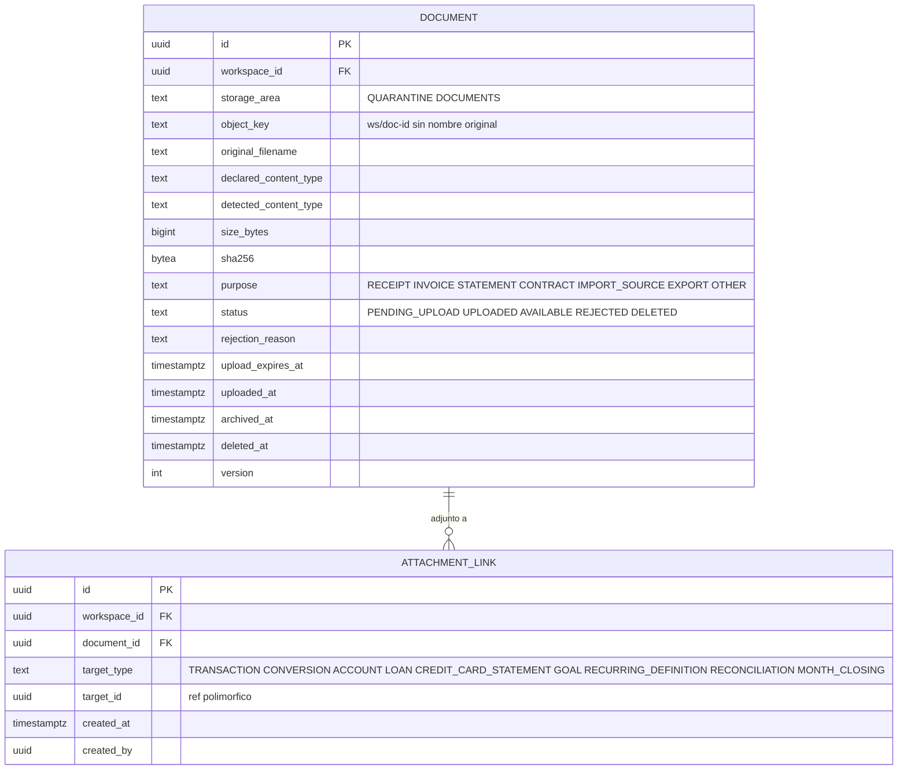
```mermaid
erDiagram
  DOCUMENT ||--o{ ATTACHMENT_LINK : "adjunto a"
  DOCUMENT {
    uuid id PK
    uuid workspace_id FK
    text storage_area "QUARANTINE DOCUMENTS"
    text object_key "ws/doc-id sin nombre original"
    text original_filename
    text declared_content_type
    text detected_content_type
    bigint size_bytes
    bytea sha256
    text purpose "RECEIPT INVOICE STATEMENT CONTRACT IMPORT_SOURCE EXPORT OTHER"
    text status "PENDING_UPLOAD UPLOADED AVAILABLE REJECTED DELETED"
    text rejection_reason
    timestamptz upload_expires_at
    timestamptz uploaded_at
    timestamptz archived_at
    timestamptz deleted_at
    int version
  }
  ATTACHMENT_LINK {
    uuid id PK
    uuid workspace_id FK
    uuid document_id FK
    text target_type "TRANSACTION CONVERSION ACCOUNT LOAN CREDIT_CARD_STATEMENT GOAL RECURRING_DEFINITION RECONCILIATION MONTH_CLOSING"
    uuid target_id "ref polimorfico"
    timestamptz created_at
    uuid created_by
  }
```

| Tabla | Unique | Check | Índices | RLS | version / archivo |
|-------|--------|-------|---------|-----|-------------------|
| `document` | `(workspace_id, object_key)`; `(workspace_id, sha256) WHERE status='AVAILABLE'` (dedupe opcional, advertencia, no error) | `size_bytes > 0 AND size_bytes <= 26214400` (25 MiB); `declared_content_type IN (allowlist)`; `status='REJECTED'` ⇒ `rejection_reason IS NOT NULL` | `(workspace_id, status) WHERE status IN ('PENDING_UPLOAD','UPLOADED')` (limpieza); `(workspace_id, purpose, uploaded_at DESC)` | WS | `version`, `archived_at`; `deleted_at` = borrado del binario a pedido del usuario (metadatos permanecen) |
| `attachment_link` | `(document_id, target_type, target_id)` | `target_type IN (...)` | `(workspace_id, target_type, target_id)` | WS | Desvincular = fila borrada (no es dato financiero) + audit |

**Justificación del link polimórfico:** los targets viven en otros schemas, así que ninguna FK física sería posible de todos modos (ARCHITECTURE §2). Una tabla de enlace por target multiplicaría tablas sin ganar integridad. Se compensa con: (1) `target_type` cerrado por CHECK; (2) validación en `application` vía `contracts` del dueño del target; (3) job de verificación de huérfanos.

### 5.12 `imports` — Import pipeline & banking providers (Phase 6; CSV básico Phase 3 opcional)

Modelo físico del agregado `ImportJob` de [13-import-architecture.md](13-import-architecture.md) (§3, §7, §14). La "import_row" de la lista candidata es `imports.staged_transaction`; la idempotencia entre jobs la da `imports.row_link`.


```mermaid
erDiagram
  MAPPING_PROFILE ||--o{ IMPORT_JOB : "configura (id, version)"
  CONNECTION ||--o{ IMPORT_JOB : "sincroniza"
  IMPORT_JOB ||--o{ STAGED_TRANSACTION : "filas"
  IMPORT_JOB ||--o{ IMPORT_ERROR : "errores"
  STAGED_TRANSACTION ||--o| ROW_LINK : "vincula"
  MAPPING_PROFILE {
    uuid id PK
    int version PK
    uuid workspace_id FK
    uuid institution_id "ref accounts.institution"
    uuid account_id "opcional"
    text name
    text format "CSV OFX QIF XLSX CAMT PROVIDER"
    jsonb mapping "JSON Schema imports.mapping.v1"
    jsonb locale "separadores formato fecha encoding"
    timestamptz created_at
    timestamptz archived_at
  }
  IMPORT_JOB {
    uuid id PK
    uuid workspace_id FK
    text source "FILE CONNECTION"
    uuid target_account_id "ref accounts.account"
    uuid institution_id
    uuid mapping_profile_id FK
    int mapping_profile_version FK
    uuid document_id "ref documents.document"
    text object_key
    bytea file_checksum "SHA-256"
    bigint file_size_bytes
    text media_type
    uuid connection_id FK
    date sync_from
    date sync_to
    jsonb locale
    jsonb statement "opening closing balance"
    text status "CREATED UPLOADED PARSING ... COMPLETED"
    jsonb counters
    jsonb progress
    uuid operation_id "ref platform.operation"
    uuid approved_by
    timestamptz approved_at
    timestamptz completed_at
    timestamptz created_at
    uuid created_by
    int version
  }
  STAGED_TRANSACTION {
    uuid id PK
    uuid workspace_id FK
    uuid import_job_id FK
    int row_number
    bytea raw_hash
    jsonb raw "purgable"
    date booking_date
    money amount
    ccy currency FK
    text description_normalized
    text external_id
    smallint occurrence_index
    bytea fingerprint "SHA-256 13 par 7.2"
    text classification "NEW DUPLICATE_EXACT DUPLICATE_PROBABLE INVALID"
    text decision "CREATE SKIP MERGE"
    jsonb proposed "rules dry-run categoria counterparty"
    jsonb validation_errors
    uuid matched_transaction_id
    uuid transaction_id "ref txn.transaction"
    smallint batch_no
  }
  ROW_LINK {
    uuid id PK
    uuid workspace_id FK
    uuid account_id
    bytea fingerprint
    uuid transaction_id "ref txn.transaction"
    uuid staged_transaction_id FK
    text status "ACTIVE SUPERSEDED"
    timestamptz created_at
  }
  CONNECTION {
    uuid id PK
    uuid workspace_id FK
    text provider
    uuid institution_id
    text status "ACTIVE EXPIRED REVOKED ERROR"
    text secret_ref "Secrets Manager"
    text sync_cursor
    timestamptz consent_expires_at
    timestamptz last_sync_at
    int version
  }
  IMPORT_ERROR {
    uuid id PK
    uuid workspace_id FK
    uuid import_job_id FK
    text stage
    text code "IMPORT_*"
    int row_number
    text message "sin datos sensibles"
    timestamptz created_at
  }
```

| Tabla | Unique | Check | Índices | RLS | version / archivo |
|-------|--------|-------|---------|-----|-------------------|
| `mapping_profile` | PK `(id, version)` (versionado inmutable) | `jsonb_typeof(mapping)='object'` | `(workspace_id, institution_id)` | WS | Nueva versión por cambio; `archived_at` |
| `import_job` | `(workspace_id, id)` | `source='FILE'` ⇒ `file_checksum IS NOT NULL` (tras `UPLOADED`); `source='CONNECTION'` ⇒ `connection_id IS NOT NULL` | `(workspace_id, status)`; `(workspace_id, target_account_id, file_checksum)` **no único** (reimport permitido, se advierte) | WS | `version` |
| `staged_transaction` | `(import_job_id, row_number)` | `classification IN (...)`; `decision IN (...)` | `(import_job_id, classification)`; `(workspace_id, fingerprint)` | WS | Purgado 90 días tras `COMPLETED*` (dato técnico) |
| `row_link` | **`(workspace_id, account_id, fingerprint) WHERE status='ACTIVE'`** — idempotencia de filas entre jobs (INV-014). Al anular la transacción vinculada pasa a `SUPERSEDED` y deja de bloquear | — | `(workspace_id, transaction_id)` | WS | Se conserva |
| `connection` | `(workspace_id, provider, institution_id)` | — | — | WS | `version` (Phase 6+); `DELETE` API = revocar (soft) |
| `import_error` | — | — | `(import_job_id, stage)` | WS | Purgado con staging |

El nivel proveedor (`external_id` estable) se garantiza en `txn.transaction` con `UNIQUE (workspace_id, primary_account_id, external_namespace, external_id)` (13 §7.3).

### 5.13 `rules` — Rules engine (Phase 6)

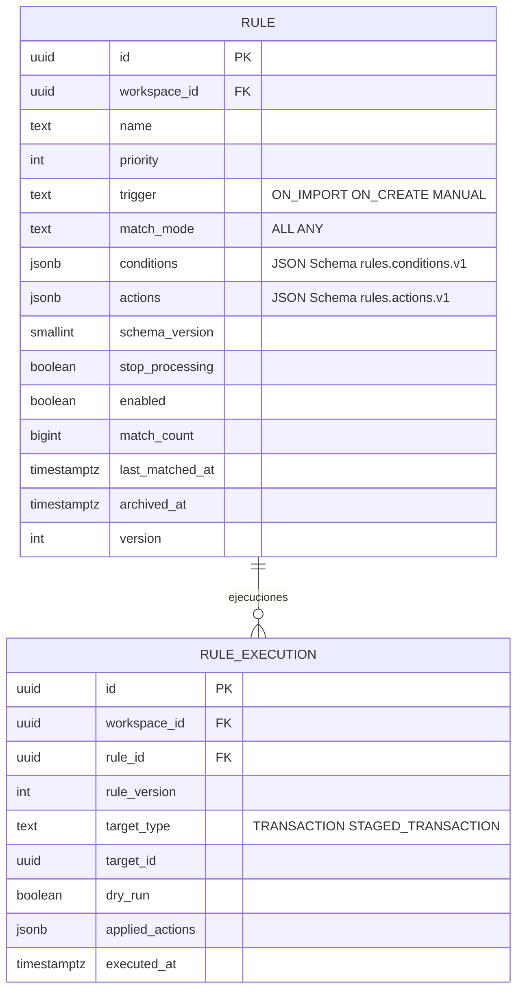
```mermaid
erDiagram
  RULE ||--o{ RULE_EXECUTION : "ejecuciones"
  RULE {
    uuid id PK
    uuid workspace_id FK
    text name
    int priority
    text trigger "ON_IMPORT ON_CREATE MANUAL"
    text match_mode "ALL ANY"
    jsonb conditions "JSON Schema rules.conditions.v1"
    jsonb actions "JSON Schema rules.actions.v1"
    smallint schema_version
    boolean stop_processing
    boolean enabled
    bigint match_count
    timestamptz last_matched_at
    timestamptz archived_at
    int version
  }
  RULE_EXECUTION {
    uuid id PK
    uuid workspace_id FK
    uuid rule_id FK
    int rule_version
    text target_type "TRANSACTION STAGED_TRANSACTION"
    uuid target_id
    boolean dry_run
    jsonb applied_actions
    timestamptz executed_at
  }
```

| Tabla | Unique | Check | Índices | RLS | version / archivo |
|-------|--------|-------|---------|-----|-------------------|
| `rule` | `(workspace_id, lower(name)) WHERE archived_at IS NULL` | `jsonb_typeof(conditions)='array' AND jsonb_array_length(conditions) BETWEEN 1 AND 20`; `jsonb_typeof(actions)='array' AND jsonb_array_length(actions) BETWEEN 1 AND 10` | `(workspace_id, trigger, priority) WHERE enabled AND archived_at IS NULL`; `gin (actions jsonb_path_ops)` ("¿qué reglas usan la categoría X?") | WS | `version`, `archived_at` |
| `rule_execution` | — | — | `(workspace_id, target_type, target_id)`; `(rule_id, executed_at DESC)` | **WS-RO** | Retención 180 días |

**Decisión JSONB vs tablas `rule_condition`/`rule_action`:** se elige **JSONB con JSON Schema versionado**. Razones: (1) la regla es un agregado que siempre se carga y evalúa completo en memoria — nunca se consultan condiciones sueltas por SQL; (2) operandos heterogéneos (texto, regex, rango de montos, moneda, cuenta, día de la semana) obligarían a columnas `value_text/value_num/...` o EAV; (3) evolución del DSL vía `schema_version` + migración en lectura, sin DDL; (4) el orden de condiciones/acciones es intrínseco al array. Costes aceptados: sin FK hacia categorías (ya imposibles por ser cross-schema), validación en dominio + CHECK estructural, índice GIN para búsquedas inversas. Esquemas en `contracts/rules/` (a definir en Phase 6).

### 5.14 `reporting` — Read models **DERIVADOS** (Phase 1 básico / Phase 7)

> Todas las tablas de este schema son **derivadas y reconstruibles** desde `ledger`/`txn`/`fx`/otros contextos vía eventos. No son fuente de verdad, no tienen `version` ni audit, y pueden truncarse y reconstruirse (`job reporting.rebuild`). Escritas solo por `pf_worker` (política **DRV**). Catálogo funcional completo y consumidores en [14-reporting.md](14-reporting.md) §2; aquí se fija la forma física de las principales.

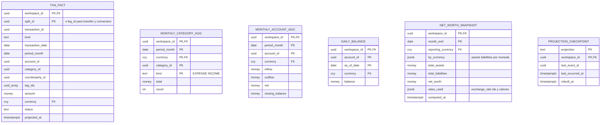
```mermaid
erDiagram
  TXN_FACT {
    uuid workspace_id PK, FK
    uuid split_id PK "o leg_id para transfer y conversion"
    uuid transaction_id
    text kind
    date transaction_date
    date period_month
    uuid account_id
    uuid category_id
    uuid counterparty_id
    uuid_array tag_ids
    money amount
    ccy currency FK
    text status
    timestamptz projected_at
  }
  MONTHLY_CATEGORY_AGG {
    uuid workspace_id PK, FK
    date period_month PK
    ccy currency PK, FK
    uuid category_id PK
    text kind PK "EXPENSE INCOME"
    money total
    int count
  }
  MONTHLY_ACCOUNT_AGG {
    uuid workspace_id PK, FK
    date period_month PK
    uuid account_id PK
    ccy currency FK
    money inflow
    money outflow
    money net
    money closing_balance
  }
  DAILY_BALANCE {
    uuid workspace_id PK, FK
    uuid account_id PK
    date as_of_date PK
    ccy currency FK
    money balance
  }
  NET_WORTH_SNAPSHOT {
    uuid workspace_id PK, FK
    date month_end PK
    ccy reporting_currency FK
    jsonb by_currency "assets liabilities por moneda"
    money total_assets
    money total_liabilities
    money net_worth
    jsonb rates_used "exchange_rate ids y valores"
    timestamptz computed_at
  }
  PROJECTION_CHECKPOINT {
    text projection PK
    uuid workspace_id PK, FK
    uuid last_event_id
    timestamptz last_occurred_at
    timestamptz rebuilt_at
  }
```

| Tabla | Índices | Notas |
|-------|---------|-------|
| `txn_fact` | PK; `(workspace_id, period_month, category_id)`; `(workspace_id, account_id, transaction_date)`; `gin (tag_ids)` | 1 fila por split nominal vigente (+ filas de transfer/conversion marcadas). `uuid_array` = `uuid[]`. |
| `monthly_category_agg` | PK | Alimenta budget actuals (INV-034), dashboard y tendencias. |
| `monthly_account_agg` | PK | Cash flow histórico por cuenta. |
| `daily_balance` | PK | Historia de saldos para gráficos y net worth; distinto de `ledger.balance_snapshot` (caché de cálculo del ledger). |
| `net_worth_snapshot` | PK | Phase 7; guarda las tasas usadas (no recalcula histórico con tasas actuales, INV-012). |
| `projection_checkpoint` | PK | Seguimiento de rebuilds / lag. |
| Otras de 14 §2 | — | `monthly_tag_agg`, `fx_conversion_fact`, `fee_fact`, `commitment_occurrence`, `goal_progress`, `debt_snapshot`, `budget_snapshot`, `forecast_vs_actual`: mismo patrón (PK natural con `workspace_id` primero, sin `version`, DRV). |

Verificación: job diario compara una muestra de `daily_balance` y `ledger.balance_snapshot` con `Σ posting.amount` (completo semanal); divergencia ⇒ alerta + rebuild.

### 5.15 `notifications` (Phase 2)

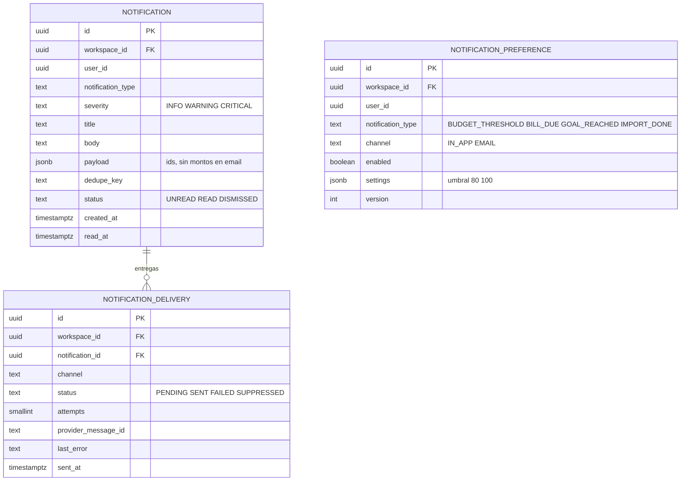
```mermaid
erDiagram
  NOTIFICATION ||--o{ NOTIFICATION_DELIVERY : "entregas"
  NOTIFICATION_PREFERENCE {
    uuid id PK
    uuid workspace_id FK
    uuid user_id
    text notification_type "BUDGET_THRESHOLD BILL_DUE GOAL_REACHED IMPORT_DONE"
    text channel "IN_APP EMAIL"
    boolean enabled
    jsonb settings "umbral 80 100"
    int version
  }
  NOTIFICATION {
    uuid id PK
    uuid workspace_id FK
    uuid user_id
    text notification_type
    text severity "INFO WARNING CRITICAL"
    text title
    text body
    jsonb payload "ids, sin montos en email"
    text dedupe_key
    text status "UNREAD READ DISMISSED"
    timestamptz created_at
    timestamptz read_at
  }
  NOTIFICATION_DELIVERY {
    uuid id PK
    uuid workspace_id FK
    uuid notification_id FK
    text channel
    text status "PENDING SENT FAILED SUPPRESSED"
    smallint attempts
    text provider_message_id
    text last_error
    timestamptz sent_at
  }
```

| Tabla | Unique | Check | Índices | RLS | version / archivo |
|-------|--------|-------|---------|-----|-------------------|
| `notification_preference` | `(workspace_id, user_id, notification_type, channel)` | — | — | WS | `version` |
| `notification` | `(workspace_id, user_id, dedupe_key)` (p. ej. `budget:<lineId>:80`) | — | `(workspace_id, user_id, created_at DESC) WHERE status='UNREAD'` | WS (+ filtro `user_id = app.user_id` en lectura) | Retención 12 meses |
| `notification_delivery` | `(notification_id, channel)` | `attempts >= 0` | `(status) WHERE status='PENDING'` | WS | — |

### 5.16 `audit` — Audit trail (Phase 1)

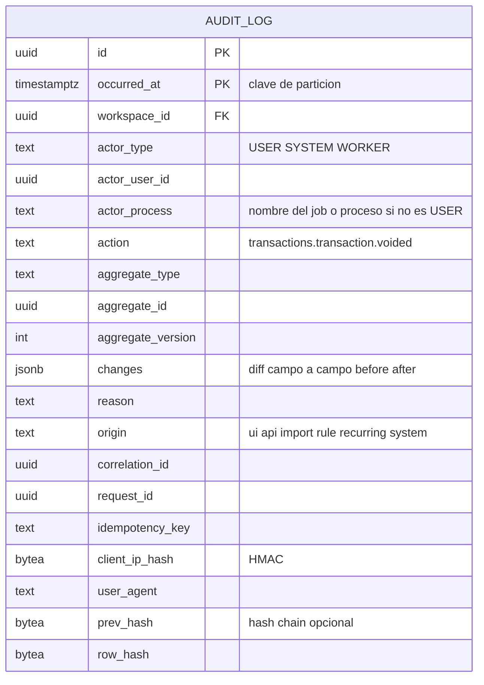
```mermaid
erDiagram
  AUDIT_LOG {
    uuid id PK
    timestamptz occurred_at PK "clave de particion"
    uuid workspace_id FK
    text actor_type "USER SYSTEM WORKER"
    uuid actor_user_id
    text actor_process "nombre del job o proceso si no es USER"
    text action "transactions.transaction.voided"
    text aggregate_type
    uuid aggregate_id
    int aggregate_version
    jsonb changes "diff campo a campo before after"
    text reason
    text origin "ui api import rule recurring system"
    uuid correlation_id
    uuid request_id
    text idempotency_key
    bytea client_ip_hash "HMAC"
    text user_agent
    bytea prev_hash "hash chain opcional"
    bytea row_hash
  }
```

| Tabla | Unique | Check | Índices | RLS | version / archivo |
|-------|--------|-------|---------|-----|-------------------|
| `audit_log` | PK `(occurred_at, id)` (requisito de particionado) | `actor_type='USER'` ⇒ `actor_user_id IS NOT NULL`; `actor_type<>'USER'` ⇒ `actor_process IS NOT NULL`; `origin IN ('ui','api','import','rule','recurring','system')` (FR-AUDIT-002) | `(workspace_id, aggregate_type, aggregate_id, occurred_at)`; `(workspace_id, occurred_at DESC)`; `(workspace_id, actor_user_id, occurred_at DESC)` | **WS-RO** | Particionada `PARTITION BY RANGE (occurred_at)` mensual (`pg_partman` o job propio). Sin UPDATE/DELETE/TRUNCATE para `pf_app`/`pf_worker`. |

Se escribe **en la misma transacción** que el comando (ARCHITECTURE §7). `changes` nunca contiene secretos ni tokens; sí montos (es el propósito del audit financiero). Hash chain (`prev_hash`/`row_hash` por workspace) es opcional — ver Preguntas abiertas.

### 5.17 `forecasting` (Phase 8)

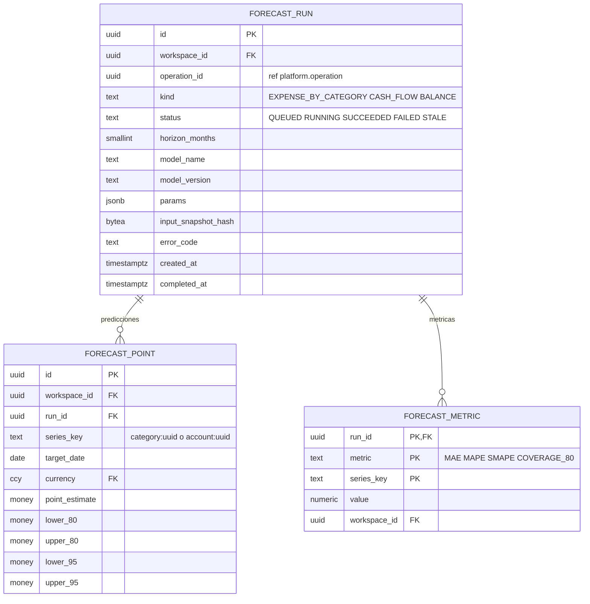
```mermaid
erDiagram
  FORECAST_RUN ||--o{ FORECAST_POINT : "predicciones"
  FORECAST_RUN ||--o{ FORECAST_METRIC : "metricas"
  FORECAST_RUN {
    uuid id PK
    uuid workspace_id FK
    uuid operation_id "ref platform.operation"
    text kind "EXPENSE_BY_CATEGORY CASH_FLOW BALANCE"
    text status "QUEUED RUNNING SUCCEEDED FAILED STALE"
    smallint horizon_months
    text model_name
    text model_version
    jsonb params
    bytea input_snapshot_hash
    text error_code
    timestamptz created_at
    timestamptz completed_at
  }
  FORECAST_POINT {
    uuid id PK
    uuid workspace_id FK
    uuid run_id FK
    text series_key "category:uuid o account:uuid"
    date target_date
    ccy currency FK
    money point_estimate
    money lower_80
    money upper_80
    money lower_95
    money upper_95
  }
  FORECAST_METRIC {
    uuid run_id PK, FK
    text metric PK "MAE MAPE SMAPE COVERAGE_80"
    text series_key PK
    numeric value
    uuid workspace_id FK
  }
```

| Tabla | Unique | Check | Índices | RLS | version / archivo |
|-------|--------|-------|---------|-----|-------------------|
| `forecast_run` | — | `horizon_months BETWEEN 1 AND 24` | `(workspace_id, kind, created_at DESC) WHERE status='SUCCEEDED'` | WS | Retención: últimos 12 runs por kind |
| `forecast_point` | `(run_id, series_key, target_date)` | `lower_80 <= point_estimate AND point_estimate <= upper_80` | — | **WS-RO** | — |
| `forecast_metric` | PK | — | — | **WS-RO** | — |

El servicio `ml-forecasting` **no** accede a PostgreSQL: recibe datasets agregados del worker y devuelve resultados; el ACL `@pf/forecasting` persiste.

### 5.18 `platform` — Outbox, inbox, idempotency, operations

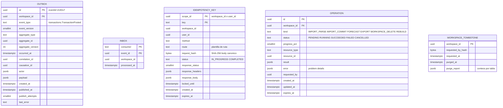
```mermaid
erDiagram
  OUTBOX {
    uuid id PK "eventId UUIDv7"
    uuid workspace_id FK
    text event_type "transactions.TransactionPosted"
    smallint event_version
    text aggregate_type
    uuid aggregate_id
    int aggregate_version
    timestamptz occurred_at
    uuid correlation_id
    uuid causation_id
    jsonb actor
    jsonb payload
    timestamptz created_at
    timestamptz published_at
    smallint publish_attempts
    text last_error
  }
  INBOX {
    text consumer PK
    uuid event_id PK
    uuid workspace_id
    timestamptz processed_at
  }
  IDEMPOTENCY_KEY {
    uuid scope_id PK "workspace_id o user_id"
    text key PK
    uuid workspace_id
    uuid user_id
    text method
    text route "plantilla de ruta"
    bytea request_hash "SHA-256 body canonico"
    text status "IN_PROGRESS COMPLETED"
    smallint response_status
    jsonb response_headers
    jsonb response_body
    timestamptz locked_until
    timestamptz created_at
    timestamptz expires_at
  }
  OPERATION {
    uuid id PK
    uuid workspace_id FK
    text kind "IMPORT_PARSE IMPORT_COMMIT FORECAST EXPORT WORKSPACE_DELETE REBUILD"
    text status "PENDING RUNNING SUCCEEDED FAILED CANCELLED"
    smallint progress_pct
    text resource_type
    uuid resource_id
    jsonb result
    jsonb error "problem details"
    uuid requested_by
    timestamptz created_at
    timestamptz updated_at
    timestamptz expires_at
  }
  WORKSPACE_TOMBSTONE {
    uuid workspace_id PK
    bytea requested_by_hash
    timestamptz requested_at
    timestamptz purged_at
    jsonb purge_report "conteos por tabla"
  }
```

| Tabla | Unique | Índices | RLS / grants | Retención |
|-------|--------|---------|--------------|-----------|
| `outbox` | PK | `(created_at) WHERE published_at IS NULL` (relay); `(aggregate_id, aggregate_version)` | **PLT**: `pf_app` INSERT con `WITH CHECK workspace_id = current_workspace_id()`; `pf_worker` policy `TO pf_worker USING (true)` para SELECT/UPDATE de `published_at`, `publish_attempts`, `last_error` (grants a nivel de columna) | Publicados: 7 días |
| `inbox` | PK `(consumer, event_id)` | `(processed_at)` | Sin datos de negocio; solo `pf_worker` | 30 días |
| `idempotency_key` | PK `(scope_id, key)` | `(expires_at)` | **WS** (cuando `workspace_id` no es NULL) / USR (endpoints de usuario); contiene respuestas ⇒ datos financieros | 24 h (configurable hasta 7 días) |
| `operation` | PK | `(workspace_id, created_at DESC)` | WS | 30 días tras terminar |
| `workspace_tombstone` | PK | — | Solo `pf_migrator`/rol de purge | Permanente (sin datos personales) |

---

## 6. Inmutabilidad y grants (resumen)

| Tabla | `pf_app` | `pf_worker` | Trigger `forbid_mutation` |
|-------|----------|-------------|---------------------------|
| `ledger.journal_entry`, `ledger.posting`, `ledger.entry_reversal` | SELECT, INSERT | SELECT, INSERT | Sí (UPDATE, DELETE, TRUNCATE) |
| `ledger.period_lock` | SELECT, INSERT, DELETE | SELECT | No (DELETE = reapertura, auditada) |
| `ledger.balance_snapshot` | SELECT | SELECT, INSERT, UPDATE, DELETE | No (derivado) |
| `txn.conversion_detail`, `txn.conversion_fee`, `txn.transaction_journal_link` | SELECT, INSERT | SELECT, INSERT | Sí |
| `fx.exchange_rate` | SELECT, INSERT | SELECT, INSERT | Sí |
| `planning.budget_template_version`, `budget_template_line` | SELECT, INSERT | SELECT | Sí |
| `audit.audit_log` | SELECT, INSERT | SELECT, INSERT | Sí |
| `goals.goal_contribution`, `debt.loan_schedule_change`, `rules.rule_execution`, `forecasting.forecast_point` | SELECT, INSERT | SELECT, INSERT | Sí (salvo purga por retención con rol de mantenimiento) |
| `reporting.*` | SELECT | SELECT, INSERT, UPDATE, DELETE, TRUNCATE | No |
| Resto de tablas de negocio | SELECT, INSERT, UPDATE | SELECT, INSERT, UPDATE | No (DELETE no concedido salvo tablas de enlace/técnicas: `split_tag`, `split_custom_field_value`, `attachment_link`, `reconciliation_item`; purgas de `imports.staged_transaction` solo `pf_maintenance`) |

---

## 7. ERD consolidado (núcleo Phase 1)

```mermaid
erDiagram
  WORKSPACE ||--o{ ACCOUNT : ""
  WORKSPACE ||--o{ LEDGER_ACCOUNT : ""
  ACCOUNT ||..|| LEDGER_ACCOUNT : "1:1 logico"
  INSTITUTION ||--o{ ACCOUNT : ""
  LEDGER_ACCOUNT ||--o{ POSTING : ""
  JOURNAL_ENTRY ||--|{ POSTING : ""
  TRANSACTION ||..o| JOURNAL_ENTRY : "active_entry_id logico"
  TRANSACTION ||--|{ TRANSACTION_LEG : ""
  TRANSACTION ||--o{ TRANSACTION_SPLIT : ""
  TRANSACTION_SPLIT ||..o{ POSTING : "split_id logico"
  JOURNAL_ENTRY ||--o| ENTRY_REVERSAL : ""
  TRANSACTION ||--o| CONVERSION_DETAIL : ""
  CATEGORY_GROUP ||--o{ CATEGORY : ""
  CATEGORY ||..o{ TRANSACTION_SPLIT : "category_id logico"
  TAG ||..o{ SPLIT_TAG : ""
  TRANSACTION_SPLIT ||--o{ SPLIT_TAG : ""
  COUNTERPARTY ||..o{ TRANSACTION : ""
  CURRENCY ||--o{ ACCOUNT : "FK fisica"
  CURRENCY ||--o{ POSTING : "FK fisica"
  CURRENCY ||--o{ EXCHANGE_RATE : ""
  TRANSACTION ||--o{ AUDIT_LOG : "logico"
```

---

## 8. Estrategia de índices y rendimiento

- **Listados por cursor**: índices `(workspace_id, <sort_col> DESC, id DESC)` alineados con el `sort` de la API ([10-api-design.md](10-api-design.md) §5).
- **Saldo as-of**: `posting (workspace_id, ledger_account_id, entry_date, id) INCLUDE (amount)` permite *index-only scan*; para cuentas con muchos postings se parte del último `ledger.balance_snapshot`.
- **Índices parciales** para colas lógicas (outbox pendiente, occurrences programadas, imports activos, notificaciones no leídas) — pequeños y calientes.
- **RLS y planes**: `workspace_id` como primera columna de los índices de negocio; `platform.current_workspace_id()` es `STABLE` → se evalúa una vez por query.
- **Particionado**: solo `audit.audit_log` desde el inicio. `ledger.posting` no se particiona en Phase 1 (volumen personal: ~10⁴–10⁵ filas/año); revisar si supera 10⁷ filas.
- Extensiones requeridas: `btree_gist` (exclusión de periodos), `pg_trgm` (fuzzy match de counterparties). Sin `uuid-ossp` (IDs en la app).

---

## 9. Concurrencia

- Optimistic locking con `version` en agregados mutables (`UPDATE ... WHERE id=$1 AND version=$2`; 0 filas ⇒ `409 CONCURRENCY_CONFLICT` / `412` si vino `If-Match`).
- El ledger no necesita locking optimista (append-only). Para creación de ledger accounts de sistema bajo demanda: `INSERT ... ON CONFLICT (workspace_id, system_kind, currency) DO NOTHING` + `SELECT`.
- Nivel de aislamiento: `READ COMMITTED` por defecto; `SERIALIZABLE` (con retry) solo en cierre de mes y reconciliación.

---

## 10. SQL ilustrativo

### 10.1 Tablas del ledger

```sql
CREATE SCHEMA ledger AUTHORIZATION pf_migrator;

CREATE TABLE ledger.ledger_account (
  id                uuid PRIMARY KEY,
  workspace_id      uuid NOT NULL REFERENCES iam.workspace(id),
  type              text NOT NULL CHECK (type IN ('ASSET','LIABILITY','EQUITY','INCOME','EXPENSE')),
  currency          varchar(16) NOT NULL REFERENCES fx.currency(code),
  system_kind       text CHECK (system_kind IN ('INCOME','EXPENSE','OPENING_BALANCE','FX_TRADING','ADJUSTMENTS')),
  source_account_id uuid,                       -- ref lógica accounts.account
  code              text NOT NULL,
  created_at        timestamptz NOT NULL DEFAULT now(),
  archived_at       timestamptz,
  CONSTRAINT ledger_account_ws_id_uk   UNIQUE (workspace_id, id),
  CONSTRAINT ledger_account_id_ccy_uk  UNIQUE (id, currency, type),
  CONSTRAINT ledger_account_user_ck CHECK (
    (type IN ('ASSET','LIABILITY')) = (source_account_id IS NOT NULL)
  )
);
CREATE UNIQUE INDEX ledger_account_system_uk
  ON ledger.ledger_account (workspace_id, system_kind, currency)
  WHERE system_kind IS NOT NULL;
CREATE UNIQUE INDEX ledger_account_source_uk
  ON ledger.ledger_account (workspace_id, source_account_id)
  WHERE source_account_id IS NOT NULL;

CREATE TABLE ledger.journal_entry (
  id                uuid PRIMARY KEY,
  workspace_id      uuid NOT NULL REFERENCES iam.workspace(id),
  sequence          bigint GENERATED ALWAYS AS IDENTITY,
  entry_date        date NOT NULL,
  entry_type        text NOT NULL CHECK (entry_type IN
                     ('STANDARD','REVERSAL','OPENING')),
  source_context    text NOT NULL DEFAULT 'TRANSACTIONS',
  source_type       text NOT NULL,              -- 'Transaction'
  source_id         uuid NOT NULL,              -- ref lógica txn.transaction
  source_revision   int  NOT NULL,
  reverses_entry_id uuid,
  memo              text,
  correlation_id    uuid,
  created_at        timestamptz NOT NULL DEFAULT now(),
  created_by        uuid,
  CONSTRAINT journal_entry_ws_id_uk   UNIQUE (workspace_id, id),
  CONSTRAINT journal_entry_id_date_uk UNIQUE (id, entry_date),
  CONSTRAINT journal_entry_reversal_fk FOREIGN KEY (workspace_id, reverses_entry_id)
    REFERENCES ledger.journal_entry (workspace_id, id),
  CONSTRAINT journal_entry_reversal_ck
    CHECK ((entry_type = 'REVERSAL') = (reverses_entry_id IS NOT NULL))
);
-- "se revierte a lo sumo una vez" (INV-008): tabla de enlace, sin UPDATE
CREATE TABLE ledger.entry_reversal (
  original_entry_id uuid PRIMARY KEY,
  reversal_entry_id uuid NOT NULL UNIQUE,
  workspace_id      uuid NOT NULL,
  created_at        timestamptz NOT NULL DEFAULT now(),
  FOREIGN KEY (workspace_id, original_entry_id) REFERENCES ledger.journal_entry (workspace_id, id),
  FOREIGN KEY (workspace_id, reversal_entry_id) REFERENCES ledger.journal_entry (workspace_id, id)
);
CREATE INDEX journal_entry_source_ix ON ledger.journal_entry (workspace_id, source_type, source_id);

CREATE TABLE ledger.posting (
  id                uuid PRIMARY KEY,
  workspace_id      uuid NOT NULL,
  journal_entry_id  uuid NOT NULL,
  entry_date        date NOT NULL,
  line_no           smallint NOT NULL,
  ledger_account_id uuid NOT NULL,
  account_type      text NOT NULL,
  currency          varchar(16) NOT NULL REFERENCES fx.currency(code),
  amount            numeric(38,18) NOT NULL CHECK (amount <> 0),
  split_id          uuid,                       -- ref lógica txn.transaction_split
  memo              text,
  created_at        timestamptz NOT NULL DEFAULT now(),
  CONSTRAINT posting_entry_fk FOREIGN KEY (workspace_id, journal_entry_id)
    REFERENCES ledger.journal_entry (workspace_id, id),
  CONSTRAINT posting_entry_date_fk FOREIGN KEY (journal_entry_id, entry_date)
    REFERENCES ledger.journal_entry (id, entry_date),
  CONSTRAINT posting_account_ws_fk FOREIGN KEY (workspace_id, ledger_account_id)
    REFERENCES ledger.ledger_account (workspace_id, id),
  CONSTRAINT posting_account_ccy_fk FOREIGN KEY (ledger_account_id, currency, account_type)
    REFERENCES ledger.ledger_account (id, currency, type),
  CONSTRAINT posting_line_uk UNIQUE (journal_entry_id, line_no),
  CONSTRAINT posting_nominal_split_ck
    CHECK (account_type NOT IN ('INCOME','EXPENSE') OR split_id IS NOT NULL)
);
CREATE INDEX posting_balance_ix
  ON ledger.posting (workspace_id, ledger_account_id, entry_date, id) INCLUDE (amount);
CREATE INDEX posting_split_ix ON ledger.posting (workspace_id, split_id) WHERE split_id IS NOT NULL;
```

### 10.2 Zero-sum por moneda (constraint trigger diferido) e inmutabilidad

```sql
CREATE FUNCTION ledger.assert_entry_balanced() RETURNS trigger
LANGUAGE plpgsql AS $$
DECLARE
  v_ccy text; v_sum numeric;
BEGIN
  SELECT currency, sum(amount) INTO v_ccy, v_sum
  FROM ledger.posting
  WHERE journal_entry_id = NEW.journal_entry_id
  GROUP BY currency
  HAVING sum(amount) <> 0
  LIMIT 1;

  IF FOUND THEN
    RAISE EXCEPTION 'LEDGER_UNBALANCED_ENTRY: entry % currency % sum %',
      NEW.journal_entry_id, v_ccy, v_sum
      USING ERRCODE = 'PF001';   -- mapeado a problem+json por la app
  END IF;
  RETURN NULL;
END $$;

CREATE CONSTRAINT TRIGGER posting_balanced_trg
  AFTER INSERT ON ledger.posting
  DEFERRABLE INITIALLY DEFERRED
  FOR EACH ROW EXECUTE FUNCTION ledger.assert_entry_balanced();

-- Toda entry debe tener al menos 2 postings
CREATE FUNCTION ledger.assert_entry_has_postings() RETURNS trigger
LANGUAGE plpgsql AS $$
BEGIN
  IF (SELECT count(*) FROM ledger.posting WHERE journal_entry_id = NEW.id) < 2 THEN
    RAISE EXCEPTION 'LEDGER_ENTRY_TOO_FEW_POSTINGS: entry %', NEW.id USING ERRCODE = 'PF005';
  END IF;
  RETURN NULL;
END $$;

CREATE CONSTRAINT TRIGGER journal_entry_postings_trg
  AFTER INSERT ON ledger.journal_entry
  DEFERRABLE INITIALLY DEFERRED
  FOR EACH ROW EXECUTE FUNCTION ledger.assert_entry_has_postings();

-- Inmutabilidad (defensa adicional a los grants)
CREATE FUNCTION platform.forbid_mutation() RETURNS trigger
LANGUAGE plpgsql AS $$
BEGIN
  RAISE EXCEPTION 'IMMUTABLE_RECORD: % on %.% is not allowed', TG_OP, TG_TABLE_SCHEMA, TG_TABLE_NAME
    USING ERRCODE = 'PF003';
END $$;

CREATE TRIGGER posting_immutable_trg
  BEFORE UPDATE OR DELETE ON ledger.posting
  FOR EACH ROW EXECUTE FUNCTION platform.forbid_mutation();
CREATE TRIGGER posting_no_truncate_trg
  BEFORE TRUNCATE ON ledger.posting
  FOR EACH STATEMENT EXECUTE FUNCTION platform.forbid_mutation();
-- (idem para journal_entry, audit_log, conversion_detail, exchange_rate, ...)

-- Periodo cerrado
CREATE FUNCTION ledger.assert_period_open() RETURNS trigger
LANGUAGE plpgsql AS $$
BEGIN
  IF EXISTS (SELECT 1 FROM ledger.period_lock
             WHERE workspace_id = NEW.workspace_id
               AND year_month = to_char(NEW.entry_date, 'YYYY-MM')) THEN
    RAISE EXCEPTION 'PERIOD_CLOSED: % is in a closed period', NEW.entry_date USING ERRCODE = 'PF004';
  END IF;
  RETURN NEW;
END $$;
CREATE TRIGGER journal_entry_period_open_trg
  BEFORE INSERT ON ledger.journal_entry
  FOR EACH ROW EXECUTE FUNCTION ledger.assert_period_open();
```

> El trigger diferido se ejecuta una vez por posting; con entries de 2–20 postings el costo es despreciable. Alternativa evaluada: trigger `FOR EACH STATEMENT` con *transition tables* (no combinable con `CONSTRAINT TRIGGER`); se descarta por simplicidad. SPIKE-02 mide el costo.

### 10.3 RLS y grants

```sql
-- Roles (creados por IaC/bootstrap, no por migraciones de la app)
--   pf_migrator: owner; pf_app / pf_worker: LOGIN, NOBYPASSRLS, NOSUPERUSER

ALTER TABLE ledger.posting ENABLE ROW LEVEL SECURITY;
ALTER TABLE ledger.posting FORCE ROW LEVEL SECURITY;

CREATE POLICY ws_isolation ON ledger.posting
  FOR ALL TO pf_app, pf_worker
  USING      (workspace_id = platform.current_workspace_id())
  WITH CHECK (workspace_id = platform.current_workspace_id());

GRANT USAGE ON SCHEMA ledger TO pf_app, pf_worker;
GRANT SELECT, INSERT ON ledger.posting, ledger.journal_entry TO pf_app, pf_worker;
GRANT SELECT, INSERT, UPDATE (archived_at) ON ledger.ledger_account TO pf_app, pf_worker;
REVOKE UPDATE, DELETE, TRUNCATE ON ledger.posting, ledger.journal_entry FROM PUBLIC, pf_app, pf_worker;

-- Filas globales + propias (fx.exchange_rate)
CREATE POLICY exchange_rate_read ON fx.exchange_rate FOR SELECT TO pf_app, pf_worker
  USING (workspace_id IS NULL OR workspace_id = platform.current_workspace_id());
CREATE POLICY exchange_rate_insert_own ON fx.exchange_rate FOR INSERT TO pf_app, pf_worker
  WITH CHECK (workspace_id = platform.current_workspace_id());
CREATE POLICY exchange_rate_insert_global ON fx.exchange_rate FOR INSERT TO pf_worker
  WITH CHECK (workspace_id IS NULL AND source = 'PROVIDER');

-- Uso por request (Unit of Work)
BEGIN;
SELECT set_config('app.workspace_id', '0192f3c4-...-...', true);  -- equivalente a SET LOCAL
SELECT set_config('app.user_id',      '0192f3c4-...-...', true);
-- ... comandos ...
COMMIT;  -- triggers diferidos se evalúan aquí
```

Test obligatorio (ver [16-testing-strategy.md](16-testing-strategy.md) §5.5 y `tests/cases/`, `TC-IDENTITY-RLS-*`): para **cada** tabla con `workspace_id`, un test parametrizado verifica `relrowsecurity AND relforcerowsecurity`, existencia de política, y que con `app.workspace_id` = WS-A no se leen ni insertan filas de WS-B; y que sin setting la consulta **falla** con `SQLSTATE PF002` (nunca 0 filas).

---

## 11. Estrategia de migraciones

- **Herramienta:** dbmate (SQL-first), ejecutado por el contenedor one-shot `migrate` con rol `pf_migrator` (ARCHITECTURE §5, §10). Confirmación final en SPIKE-02.
- **Layout:** `db/migrations/<schema>/<YYYYMMDDHHMMSS>_<descripcion>.sql` (un directorio por schema/contexto, ARCHITECTURE §6). El timestamp es **global** y define el orden total. Un script TS (`scripts/db/migrate.ts`) verifica orden/duplicados y ejecuta dbmate con múltiples `--migrations-dir` (o aplana a un directorio temporal si la versión de dbmate no lo soporta — validar en SPIKE-02). Tabla de control: `platform.schema_migrations`.
- **Bootstrap** (`db/migrations/_bootstrap/`): extensiones (`btree_gist`, `pg_trgm`), schemas, función `platform.current_workspace_id()`, `platform.forbid_mutation()`, default privileges. Los **roles** y sus contraseñas los crea IaC / script de entorno, no las migraciones.
- **Expand → migrate → contract** (ARCHITECTURE §9): (1) *expand*: agregar columnas nullable/tablas/índices `CONCURRENTLY` (en migración aparte, sin transacción: `-- migrate:up transaction:false`); (2) desplegar código que escribe ambos; (3) *backfill* por lotes vía job del worker; (4) *contract*: quitar columnas/constraints viejos en un release posterior, **con aprobación manual** en el pipeline ([23-ci-cd.md](23-ci-cd.md)).
- **Reglas:** migraciones idempotentes donde sea posible (`IF NOT EXISTS`); `down` solo para cambios no destructivos (en producción se hace *roll-forward*); prohibido `ALTER TABLE ... ADD COLUMN ... DEFAULT volatile` sobre tablas grandes; `NOT NULL` se añade con `CHECK ... NOT VALID` + `VALIDATE CONSTRAINT`.
- **Lint de migraciones en CI:** squawk (o equivalente) + test que aplica todas las migraciones sobre PG vacío (Testcontainers) y verifica RLS/grants (§10.3).
- **Datos de referencia** (monedas globales, catálogos de tipos) = migraciones de datos versionadas; nunca seeds.

---

## 12. Implicaciones para seeds

Perfiles (ARCHITECTURE §10): `minimal`, `demo`, `large`.

| Perfil | Contenido | Uso |
|--------|-----------|-----|
| `minimal` | Usuario dev (enlazado al usuario del realm Keycloak dev), 1 workspace BOB/`America/La_Paz`, monedas habilitadas BOB/USD/USDT, categorías de sistema, 3 cuentas (Banco BOB, Efectivo USD, Wallet USDT) con saldos iniciales | Desarrollo diario, E2E smoke |
| `demo` | `minimal` + 6 meses de transacciones realistas, conversiones USDT↔BOB, transferencias, 1 presupuesto con template, 3 recurrentes, 1 préstamo | Demos, pruebas manuales |
| `large` | 5 años, ~50 000 transacciones, 20 cuentas, 4 monedas | Pruebas de rendimiento (QAS-05) |

Reglas: (1) los seeds **usan los casos de uso de la aplicación** (o un *seed writer* que pasa por los mismos invariantes), nunca INSERT directo a `ledger.posting` — así el seed también valida balance y audit; (2) corren con `pf_app` y `SET LOCAL app.workspace_id` (ejercitan RLS); (3) IDs deterministas (UUIDv7 con semilla fija) para tests reproducibles; (4) idempotentes (re-ejecutar no duplica: usa `Idempotency-Key` derivada); (5) categorías de sistema se crean al crear un workspace (caso de uso), no solo en seed.

---

## 13. Ciclo de vida de los datos

### 13.1 Archivo y retención

| Dato | Política |
|------|----------|
| Transacciones, ledger, conversiones, audit | Se conservan mientras exista el workspace. Nunca se borran por retención. |
| Catálogos (accounts, categories, tags, counterparties…) | Soft-archive; ocultos en UI, visibles en histórico. |
| `imports.staged_transaction`, `imports.import_error` | Purgados 90 días después de `COMPLETED*` (13 §11); `row_link` y `import_job` se conservan. |
| Documentos `REJECTED` / `PENDING_UPLOAD` expirados | Binario borrado a los 7 días; fila queda `REJECTED`/expirada. |
| `platform.idempotency_key` | 24 h. |
| `platform.outbox` publicados / `platform.inbox` | 7 / 30 días. |
| `rules.rule_execution` | 180 días. |
| `notifications.notification` | 12 meses. |
| `forecasting.*` | Últimos 12 runs por tipo. |
| `reporting.*` | Derivado: se recalcula; sin retención propia. |
| Particiones de `audit.audit_log` | Permanentes; particiones > 24 meses pueden moverse a tablespace/almacenamiento frío (Phase futura). |

Las purgas las ejecuta un job del worker con rol `pf_maintenance` (DELETE acotado solo en tablas técnicas/purgables).

### 13.2 Exportación del workspace (portabilidad)

Operación asíncrona (`POST /workspaces/{id}/exports` → `202` + `operation`): genera un ZIP en object storage (`exports/{ws}/{opId}.zip`, SSE-KMS, expira en 7 días) con JSON por agregado + CSV de transacciones/splits + documentos + `manifest.json` (versión de esquema, hashes). Exportar es acción `OWNER`, auditada.

### 13.3 Eliminación del workspace (derecho al olvido)

1. `OWNER` solicita borrado (re-autenticación reciente requerida) → `workspace.status = PENDING_DELETION`, `deletion_requested_at`; acceso de escritura bloqueado; **gracia de 30 días** (cancelable).
2. Tras la gracia, operación `WORKSPACE_DELETE` ejecuta `platform.purge_workspace(ws)` con rol dedicado `pf_purge` (owner-level, auditado): deshabilita triggers de inmutabilidad **solo dentro de esa función**, borra en orden de dependencias todas las filas con ese `workspace_id` en todos los schemas, borra objetos en storage con prefijo `{ws}/`, registra `platform.workspace_tombstone` con conteos.
3. Los backups conservan los datos hasta su expiración (RDS 35 días / snapshots según [30-backup-and-disaster-recovery.md](30-backup-and-disaster-recovery.md)); se documenta al usuario. Al restaurar un backup, se re-aplican los tombstones (script de restore).

Esta es la **única** excepción a "hard delete prohibido en datos financieros" (ARCHITECTURE §9) y requiere ADR (ver Preguntas abiertas).

---

## 14. Preguntas abiertas

1. **Purge de workspace vs "hard delete prohibido"**: ARCHITECTURE §9 no contempla la excepción de borrado a pedido del usuario. Propuesta: ADR (extensión de ADR-0023) que la autorice con `pf_purge`.
2. **`ledger.period_lock`** escrito sincrónicamente por Planning (09 §10): requiere añadir `Planning → Ledger` a las integraciones síncronas de ARCHITECTURE §7 (misma observación que 09). El bloqueo es mensual por `(workspace_id, year_month)`, como en 09 ([31-phase-1-consolidation-decisions.md](31-phase-1-consolidation-decisions.md), D10).
9. **Ubicación de snapshots de saldo**: se sigue a 09 (`ledger.balance_snapshot`, derivado, capability `ledger/balances`) en lugar de `reporting`; `reporting.daily_balance` es otro read model (14). ¿Unificar en uno solo para evitar dos cachés del mismo dato?
10. **Nombre de la tabla de tasas**: se adopta `fx.exchange_rate` (agregado `ExchangeRate`, alineado con [04-domain-model.md](04-domain-model.md) y 09 INV-011); el recurso API sigue siendo `fx-rates` (ARCHITECTURE §8). Confirmar que el brief que pedía "fx_rate" acepta el nombre.
11. **`journal_entry.sequence`** como IDENTITY no refleja orden de commit; si un consumidor necesita orden estricto por workspace (rebuild incremental), usar contador por workspace (`UPDATE ... RETURNING`, serializa escrituras) — decidir en SPIKE-05.
3. **Monedas CUSTOM**: PK global `code` obliga a códigos únicos entre workspaces. Alternativa: PK surrogate `uuid` + `(owner_workspace_id, code)`, a costa de FKs más complejas. Propuesta actual: prefijo generado (`X-<8 chars>`).
4. **Splits superseded** al editar montos: ¿se conservan (propuesta) o se permite reemplazar el split y re-apuntar la entry de reemplazo? Afecta reporting histórico.
5. **Hash chain en `audit_log`**: ¿vale la pena la evidencia de manipulación (requiere serializar inserts por workspace)? Propuesta: Phase 7, opcional.
6. **Particionado de `ledger.posting`** si aparecen workspaces con imports masivos de exchanges (miles de trades/mes).
7. **dbmate multi-directorio**: confirmar soporte en la versión elegida; si no, script de aplanado.
8. **Sesión del IdP y `iam.user`**: ¿se guarda email (PII) o solo `sub`? Propuesta: email para notificaciones, sincronizado desde el token en cada login.
