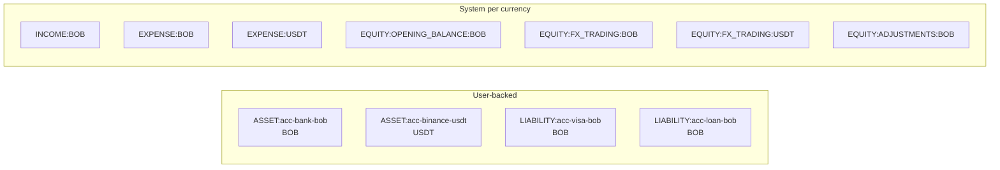
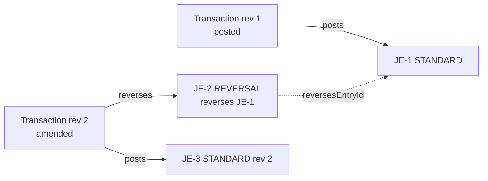
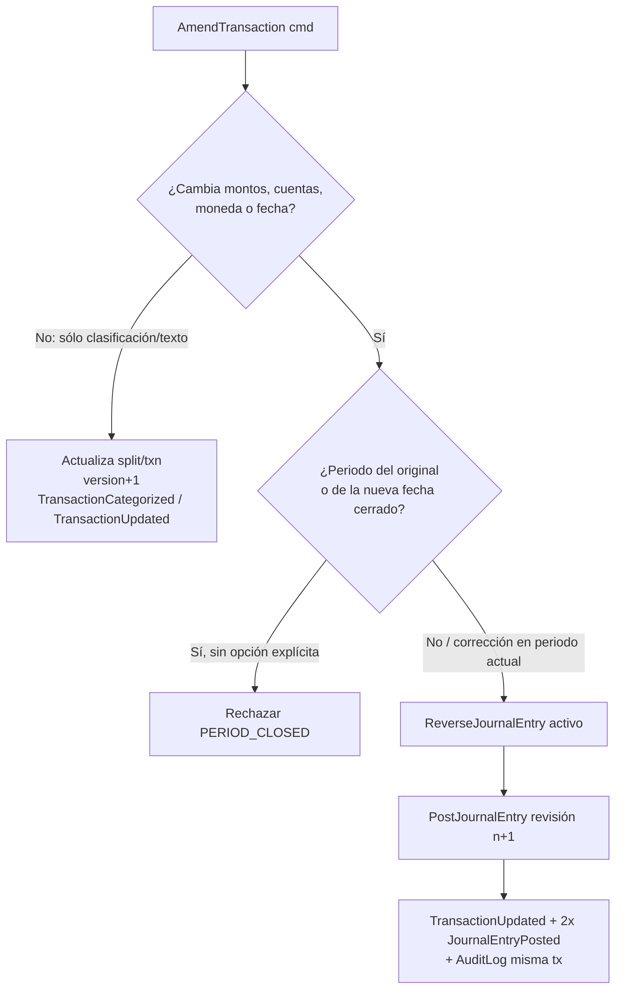
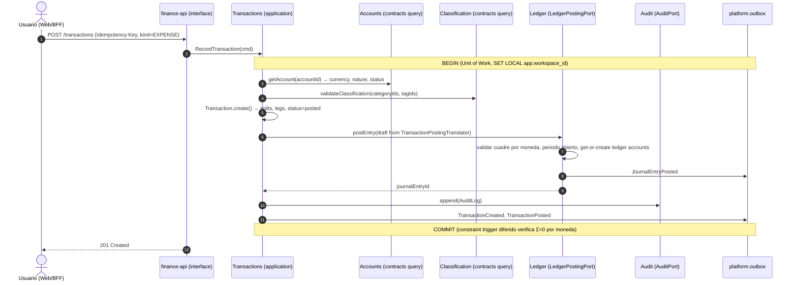
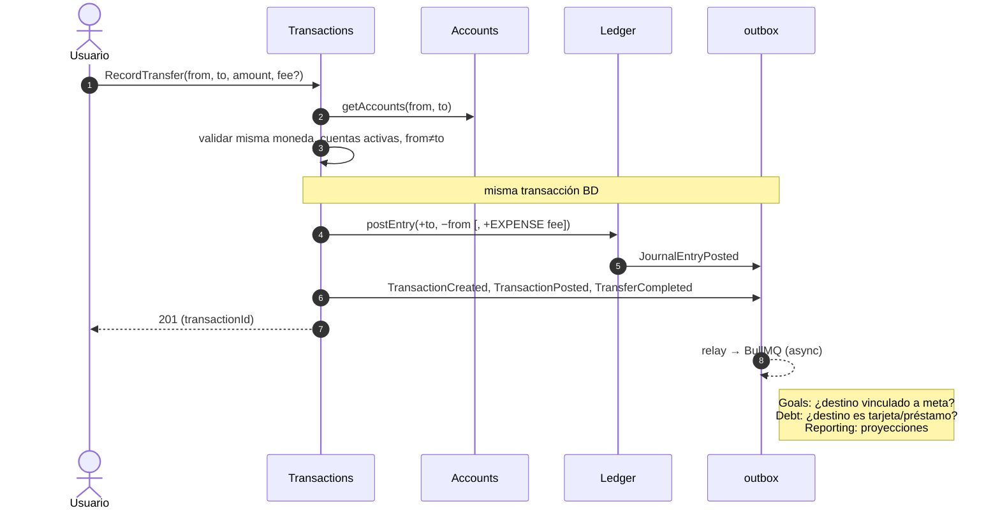
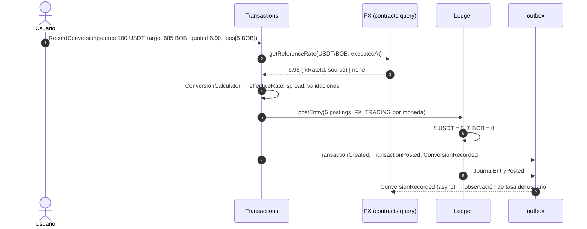
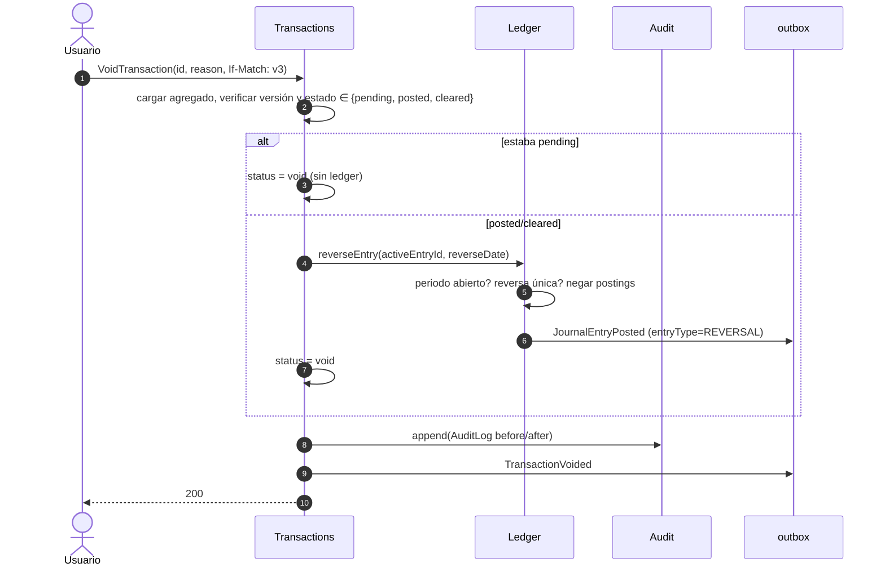

# 09 — Diseño del Ledger (doble entrada simplificada, multi-moneda)

> **Estado:** Propuesto · **Fecha:** 2026-10-01 · **Relacionado:** [ARCHITECTURE.md](ARCHITECTURE.md) §4, §7 · [04-domain-model.md](04-domain-model.md) · [05-bounded-contexts.md](05-bounded-contexts.md) · [06-context-map.md](06-context-map.md) · [08-data-model.md](08-data-model.md) · [11-domain-events.md](11-domain-events.md) · [16-testing-strategy.md](16-testing-strategy.md) · ADR-0004 (Ledger model) · ADR-0006 (Money representation)

Este documento es el corazón financiero del sistema. Define cómo **todo** movimiento de dinero se traduce a asientos contables, cómo se garantiza que cuadren, cómo se corrigen, cómo se redondea y qué invariantes financieras (`INV-NNN`) deben cumplirse siempre. Es la fuente del catálogo de invariantes referenciado por OpenSpec, `tests/cases` y la matriz de trazabilidad.

---

## 1. Principios

1. **Doble entrada simplificada.** El usuario nunca ve débitos/créditos: registra "gasté 150 BOB en supermercado". El contexto **Transactions** traduce ese documento de negocio a un `JournalEntry` en el contexto **Ledger** (sincrónicamente, en la misma transacción de BD, vía `LedgerPostingPort`).
2. **Multi-moneda por moneda.** Cada `LedgerAccount` tiene **una** moneda. Un asiento cuadra **por moneda**, nunca "en total". No existe conversión implícita dentro del ledger.
3. **Append-only.** Los postings jamás se actualizan ni borran. Corregir = reversa + nuevo asiento.
4. **El ledger no clasifica.** Categorías, tags y custom fields viven en `TransactionSplit`. El ledger sólo conoce cuentas contables y referencia `split_id` en los postings nominales (INCOME/EXPENSE).
5. **El ledger no valora.** Patrimonio en moneda de reporte, ganancias no realizadas, revaluaciones: asunto de **Reporting** usando tasas de **FX**. Nunca se generan asientos de revaluación.
6. **Saldos derivados.** Saldo = Σ postings. Snapshots son caché reconstruible.

## 2. Plan de cuentas contables (chart of ledger accounts)

### 2.1 Tipos y naturaleza

| Tipo (`nature`) | Aumenta con | Signo natural del saldo | Ejemplos |
|---|---|---|---|
| `ASSET` | débito (+) | positivo | Efectivo, banco, wallet cripto, broker, cuenta de ahorro |
| `LIABILITY` | crédito (−) | negativo | Tarjeta de crédito, préstamo, deuda con persona |
| `EQUITY` | crédito (−) | negativo (normalmente) | Saldos iniciales, FX trading, ajustes |
| `INCOME` | crédito (−) | negativo | Ingresos (salario, intereses, cashback) |
| `EXPENSE` | débito (+) | positivo | Gastos (todas las categorías, fees, intereses pagados) |

### 2.2 Cuentas respaldadas por cuentas del usuario

Cada `Account` (contexto Accounts) ↔ exactamente un `LedgerAccount` `ASSET` o `LIABILITY` en la **misma moneda**. Código lógico: `ASSET:<accountId>` / `LIABILITY:<accountId>`. Se crea con *get-or-create* idempotente la primera vez que se postea contra la cuenta (dentro de la misma transacción BD), de modo que el contexto Accounts no necesita llamar sincrónicamente a Ledger (ver [06-context-map.md](06-context-map.md)).

### 2.3 Cuentas de sistema (por workspace y moneda, bajo demanda)

| Código | Tipo | Uso |
|---|---|---|
| `INCOME:<CCY>` | INCOME | Todos los ingresos en esa moneda; la categoría está en el split |
| `EXPENSE:<CCY>` | EXPENSE | Todos los gastos en esa moneda (incluye fees, intereses pagados, seguros, impuestos) |
| `EQUITY:OPENING_BALANCE:<CCY>` | EQUITY | Contrapartida de saldos iniciales |
| `EQUITY:FX_TRADING:<CCY>` | EQUITY | Puente de conversiones (método de *trading accounts*) |
| `EQUITY:ADJUSTMENTS:<CCY>` | EQUITY | Ajustes de conciliación/descuadres no categorizados |

`<CCY>` es el código de `currency` (fiat, cripto, commodity o custom). Ej.: `EXPENSE:BOB`, `EQUITY:FX_TRADING:USDT`, `EQUITY:FX_TRADING:AAPL`.

> **Por qué un solo `INCOME`/`EXPENSE` por moneda:** la clasificación es mutable (recategorizar, fusionar categorías) y el ledger es inmutable. Si cada categoría fuese una cuenta contable, recategorizar exigiría reversas; con el split como portador de la categoría, recategorizar **no toca el ledger** (ARCHITECTURE §4.1).



## 3. Convención de signo

- **Débito = positivo, crédito = negativo** (ARCHITECTURE §4.1).
- Saldo contable de una cuenta = Σ `posting.amount`.
- **Saldo presentado al usuario**: `ASSET` → saldo contable; `LIABILITY` → `−saldo contable` (deuda como número positivo "debo 2,000.00 BOB"); `INCOME` → `−saldo`; `EXPENSE` → `saldo`.
- Los montos de un `Transaction` (legs) se expresan **desde la perspectiva de la cuenta del usuario** con el mismo signo contable: salida de dinero de un ASSET = negativo; cargo a una tarjeta (aumenta la deuda) = negativo.

## 4. Estructura: JournalEntry y Posting

```ts
// Ilustrativo — @pf/ledger/domain
type EntryType = 'STANDARD' | 'REVERSAL' | 'OPENING';

interface JournalEntry {               // Aggregate root
  id: JournalEntryId;                  // UUIDv7
  workspaceId: WorkspaceId;
  entryDate: LocalDate;                // fecha de negocio (TZ del workspace)
  entryType: EntryType;
  sourceRef: { context: 'TRANSACTIONS'; type: 'Transaction'; id: string; revision: number };
  reversesEntryId?: JournalEntryId;    // sólo REVERSAL
  reversedByEntryId?: JournalEntryId;  // proyección conveniente (no muta postings)
  memo?: string;
  postings: Posting[];                 // >= 2
  createdAt: Instant;                  // UTC
  sequence: bigint;                    // orden global monotónico por workspace (rebuild/snapshots)
}

interface Posting {                    // Entity (identidad propia para referencias/auditoría)
  id: PostingId;
  ledgerAccountId: LedgerAccountId;
  amount: Money;                       // signed; currency === ledgerAccount.currency
  splitId?: SplitId;                   // obligatorio en postings a INCOME/EXPENSE
  lineNo: number;                      // orden estable dentro del asiento
}
```

Reglas estructurales (ver invariantes §16): ≥ 2 postings; ningún posting con monto 0; la moneda del posting = moneda de su ledger account; Σ por moneda = 0; postings nominales (INCOME/EXPENSE) referencian `splitId`; todas las cuentas pertenecen al mismo workspace; `entryDate` no cae en periodo cerrado.

## 5. Inmutabilidad, reversa y versionado

- `ledger.posting` y `ledger.journal_entry` son **append-only**: el rol de aplicación tiene sólo `INSERT, SELECT` (sin `UPDATE/DELETE`); triggers `BEFORE UPDATE OR DELETE` lanzan excepción como segunda barrera (§13). `reversed_by_entry_id` se modela como tabla separada `ledger.entry_reversal(original_entry_id PK, reversal_entry_id UNIQUE)` para no necesitar UPDATE.
- **Reversa**: nuevo `JournalEntry` `REVERSAL` con los **mismos** ledger accounts, **mismos** `splitId`, montos **exactamente negados**, `reversesEntryId = original.id`. Un asiento se revierte **a lo sumo una vez** (PK en `entry_reversal`).
- **Void** de una transacción posteada = reversa de su asiento activo; la transacción pasa a `void`.
- **Edición de una transacción posteada** que afecte montos, cuentas, fecha o moneda = reversa del asiento activo + asiento nuevo con `sourceRef.revision = n+1`. Cambios sólo de clasificación (categoría/tags/custom fields/descripción/notas/contraparte) **no** generan asientos.
- **Fecha de la reversa**: por defecto la misma `entryDate` del original (la corrección "vive" donde vivió el error). Si ese periodo está `closed`, la operación se rechaza con `PERIOD_CLOSED`, salvo que el usuario elija explícitamente *"corregir en el periodo actual"*: la reversa y el nuevo asiento se fechan en la primera fecha abierta (§11).



Asiento **activo** de una transacción = el último `STANDARD` sin reversa. Invariante: transacción `posted|cleared|reconciled` ⇔ exactamente un asiento activo; `pending|void` ⇔ ninguno.

## 6. Mapeo de cada tipo de movimiento a postings (ejemplos numéricos)

Escalas usadas: BOB 2, USD 2, USDT 6, BTC 8, TRX 6, AAPL 4 (commodity, ejemplo). Todas las tablas cuadran **por moneda**; la columna "Σ por moneda" lo verifica. `split:` indica el split (y su categoría) referenciado por un posting nominal.

### 6.1 Ingreso (income)

Salario 8,000.00 BOB depositado en Banco BOB.

| # | Ledger account | Monto | Split |
|---|---|---|---|
| 1 | `ASSET:banco-bob` | +8,000.00 BOB | — |
| 2 | `INCOME:BOB` | −8,000.00 BOB | s1 · Salario |

Σ BOB = 8,000.00 − 8,000.00 = **0** ✔

### 6.2 Gasto (expense)

Supermercado 150.00 BOB en efectivo.

| # | Ledger account | Monto | Split |
|---|---|---|---|
| 1 | `EXPENSE:BOB` | +150.00 BOB | s1 · Alimentación |
| 2 | `ASSET:efectivo-bob` | −150.00 BOB | — |

Σ BOB = **0** ✔

### 6.3 Gasto dividido (split expense)

Compra de 300.00 BOB en hipermercado con tarjeta de débito: 220.00 alimentación, 50.00 limpieza, 30.00 bebidas.

| # | Ledger account | Monto | Split |
|---|---|---|---|
| 1 | `EXPENSE:BOB` | +220.00 BOB | s1 · Alimentación |
| 2 | `EXPENSE:BOB` | +50.00 BOB | s2 · Limpieza |
| 3 | `EXPENSE:BOB` | +30.00 BOB | s3 · Bebidas |
| 4 | `ASSET:banco-bob` | −300.00 BOB | — |

Σ BOB = 220 + 50 + 30 − 300 = **0** ✔ · Invariante: Σ splits = monto nominal de la transacción (300.00).

### 6.4 Transferencia misma moneda

Banco BOB → Efectivo BOB, 500.00.

| # | Ledger account | Monto |
|---|---|---|
| 1 | `ASSET:efectivo-bob` | +500.00 BOB |
| 2 | `ASSET:banco-bob` | −500.00 BOB |

Σ BOB = **0** ✔ · Patrimonio neto en BOB: sin cambio (INV-009).

**Variante con comisión** (transferencia interbancaria 1,000.00 BOB con fee 10.00 cobrado al origen):

| # | Ledger account | Monto | Split |
|---|---|---|---|
| 1 | `ASSET:banco-b-bob` | +1,000.00 BOB | — |
| 2 | `EXPENSE:BOB` | +10.00 BOB | s1 · Comisiones (sistema *Fees*) |
| 3 | `ASSET:banco-a-bob` | −1,010.00 BOB | — |

Σ BOB = 1,000 + 10 − 1,010 = **0** ✔ · El patrimonio baja exactamente el fee (10.00).

Transferencia entre monedas distintas **no es transferencia**: es conversión (§6.12+).

### 6.5 Reembolso (refund)

Devolución de 40.00 BOB de una compra de Alimentación, acreditada al Banco BOB. El crédito va a `EXPENSE:BOB` con la **misma categoría** (reduce el gasto neto de la categoría, ARCHITECTURE §4.3).

| # | Ledger account | Monto | Split |
|---|---|---|---|
| 1 | `ASSET:banco-bob` | +40.00 BOB | — |
| 2 | `EXPENSE:BOB` | −40.00 BOB | s1 · Alimentación (refund de txn X) |

Σ BOB = **0** ✔ · La transacción `REFUND` guarda `refundOfTransactionId` opcional.

### 6.6 Ajuste y ajuste de conciliación

Conciliación del Banco BOB: el extracto dice 1,234.56; el ledger dice 1,250.00. Diferencia −15.44. El usuario no identifica el origen ⇒ ajuste a `EQUITY:ADJUSTMENTS`.

| # | Ledger account | Monto |
|---|---|---|
| 1 | `ASSET:banco-bob` | −15.44 BOB |
| 2 | `EQUITY:ADJUSTMENTS:BOB` | +15.44 BOB |

Σ BOB = **0** ✔ · Si el usuario sí lo identifica (p. ej. "fue un cargo de mantenimiento"), se registra como gasto normal (split con categoría) en vez de ajuste. Los ajustes positivos (aparece dinero) son simétricos: `ASSET +x`, `EQUITY:ADJUSTMENTS −x`.

### 6.7 Saldo inicial (opening balance)

Al empezar a usar el sistema: Banco BOB tiene 10,000.00 y la tarjeta Visa BOB debe 2,000.00. Un asiento `OPENING` por cuenta (permite fechas distintas):

| Asiento | # | Ledger account | Monto |
|---|---|---|---|
| OB-1 | 1 | `ASSET:banco-bob` | +10,000.00 BOB |
| OB-1 | 2 | `EQUITY:OPENING_BALANCE:BOB` | −10,000.00 BOB |
| OB-2 | 1 | `LIABILITY:visa-bob` | −2,000.00 BOB |
| OB-2 | 2 | `EQUITY:OPENING_BALANCE:BOB` | +2,000.00 BOB |

Σ BOB por asiento = **0** ✔. Patrimonio inicial = 10,000.00 − 2,000.00 = 8,000.00 BOB = −saldo de `EQUITY:OPENING_BALANCE:BOB` (−(−10,000 + 2,000)).

### 6.8 Tarjeta de crédito: compra y pago

Compra de 350.00 BOB con Visa BOB (LIABILITY):

| # | Ledger account | Monto | Split |
|---|---|---|---|
| 1 | `EXPENSE:BOB` | +350.00 BOB | s1 · Restaurantes |
| 2 | `LIABILITY:visa-bob` | −350.00 BOB | — |

Pago de la tarjeta desde Banco BOB (transferencia ASSET→LIABILITY):

| # | Ledger account | Monto |
|---|---|---|
| 1 | `LIABILITY:visa-bob` | +350.00 BOB |
| 2 | `ASSET:banco-bob` | −350.00 BOB |

Σ BOB = **0** ✔ en ambos. El pago no es gasto; el gasto se reconoció en la compra.

**Compra en moneda extranjera cargada en BOB** (20.00 USD facturados 140.00 BOB). Default (simple): gasto en la moneda de la tarjeta, 140.00 BOB, con `originalAmount = 20.00 USD` como metadato del split (no contable). Opción avanzada (sólo si el usuario quiere rastrear el gasto en USD): conversión embebida:

| # | Ledger account | Monto | Split |
|---|---|---|---|
| 1 | `EXPENSE:USD` | +20.00 USD | s1 · Software |
| 2 | `EQUITY:FX_TRADING:USD` | −20.00 USD | — |
| 3 | `EQUITY:FX_TRADING:BOB` | +140.00 BOB | — |
| 4 | `LIABILITY:visa-bob` | −140.00 BOB | — |

Σ USD = 0 ✔ · Σ BOB = 0 ✔

### 6.9 Préstamo: desembolso y pago

**Desembolso** de 50,000.00 BOB con comisión de originación 500.00 retenida por el banco (se acreditan 49,500.00):

| # | Ledger account | Monto | Split |
|---|---|---|---|
| 1 | `ASSET:banco-bob` | +49,500.00 BOB | — |
| 2 | `EXPENSE:BOB` | +500.00 BOB | s1 · Comisiones de préstamo (sistema) |
| 3 | `LIABILITY:prestamo-bob` | −50,000.00 BOB | — |

Σ BOB = 49,500 + 500 − 50,000 = **0** ✔. Deuda reconocida por el principal completo.

**Pago de cuota** de 1,500.00 BOB: principal 1,100.00 · interés 320.00 · fees 30.00 · seguro de desgravamen 40.00 · impuestos 10.00.

| # | Ledger account | Monto | Split |
|---|---|---|---|
| 1 | `LIABILITY:prestamo-bob` | +1,100.00 BOB | — (principal) |
| 2 | `EXPENSE:BOB` | +320.00 BOB | s1 · Intereses pagados (sistema) |
| 3 | `EXPENSE:BOB` | +30.00 BOB | s2 · Comisiones de préstamo (sistema) |
| 4 | `EXPENSE:BOB` | +40.00 BOB | s3 · Seguros (sistema) |
| 5 | `EXPENSE:BOB` | +10.00 BOB | s4 · Impuestos (sistema) |
| 6 | `ASSET:banco-bob` | −1,500.00 BOB | — |

Σ BOB = 1,100 + 320 + 30 + 40 + 10 − 1,500 = **0** ✔ · INV-016: principal + interés + fees + seguro + impuestos = pago (1,500.00).

### 6.10 Aporte a meta de ahorro

**Real** (transferencia a cuenta vinculada a la meta): 1,000.00 BOB Banco → Caja de ahorro BOB.

| # | Ledger account | Monto |
|---|---|---|
| 1 | `ASSET:ahorro-bob` | +1,000.00 BOB |
| 2 | `ASSET:banco-bob` | −1,000.00 BOB |

Σ BOB = **0** ✔ + `GoalContribution{type: REAL_TRANSFER, amount: 1,000.00 BOB, transactionId}` en Goals.

**Virtual (earmark)**: "reservo 1,000.00 BOB del Banco BOB para Viaje". **No hay postings.** Sólo `GoalContribution{type: EARMARK, sourceAccountId: banco-bob, amount: 1,000.00 BOB}`. Reporting muestra "saldo disponible = saldo − earmarks". Invariante: Σ earmarks vigentes sobre una cuenta ≤ saldo de la cuenta (validado al aportar; vigilado después, INV-018).

### 6.11 Fees aislados, intereses ganados, cashback

**Fee de mantenimiento** 15.00 BOB:

| # | Ledger account | Monto | Split |
|---|---|---|---|
| 1 | `EXPENSE:BOB` | +15.00 BOB | s1 · Comisiones bancarias |
| 2 | `ASSET:banco-bob` | −15.00 BOB | — |

**Interés ganado** 12.34 BOB brutos con retención de impuesto 1.60 (se acreditan 10.74):

| # | Ledger account | Monto | Split |
|---|---|---|---|
| 1 | `ASSET:ahorro-bob` | +10.74 BOB | — |
| 2 | `EXPENSE:BOB` | +1.60 BOB | s2 · Impuestos (retención) |
| 3 | `INCOME:BOB` | −12.34 BOB | s1 · Intereses ganados |

Σ BOB = 10.74 + 1.60 − 12.34 = **0** ✔

**Cashback** 7.50 BOB abonado a la Visa (reduce la deuda). Default: ingreso categoría *Cashback* (alternativa configurable: refund contra la categoría original, ver Preguntas abiertas).

| # | Ledger account | Monto | Split |
|---|---|---|---|
| 1 | `LIABILITY:visa-bob` | +7.50 BOB | — |
| 2 | `INCOME:BOB` | −7.50 BOB | s1 · Cashback |

Σ BOB = **0** ✔

### 6.12 Conversión FIAT → FIAT (USD → BOB)

Venta de 100.00 USD al banco a tasa cotizada 6.96 BOB/USD (bruto 696.00 BOB), fee bancario 5.00 BOB, neto acreditado 691.00 BOB.

| # | Ledger account | Monto | Split |
|---|---|---|---|
| 1 | `ASSET:caja-usd` | −100.00 USD | — |
| 2 | `EQUITY:FX_TRADING:USD` | +100.00 USD | — |
| 3 | `EQUITY:FX_TRADING:BOB` | −696.00 BOB | — |
| 4 | `ASSET:banco-bob` | +691.00 BOB | — |
| 5 | `EXPENSE:BOB` | +5.00 BOB | s1 · Comisiones (fee BANK) |

Σ USD = −100 + 100 = **0** ✔ · Σ BOB = −696 + 691 + 5 = **0** ✔ · Tasa efectiva = 691.00 / 100.00 = **6.91 BOB/USD**.

### 6.13 Conversión FIAT → CRYPTO (BOB → USDT, P2P)

Compra P2P: pago 700.00 BOB por 100.000000 USDT (cotizada 7.00 BOB/USDT); la plataforma descuenta 0.100000 USDT de fee; llegan 99.900000 USDT.

| # | Ledger account | Monto | Split |
|---|---|---|---|
| 1 | `ASSET:banco-bob` | −700.00 BOB | — |
| 2 | `EQUITY:FX_TRADING:BOB` | +700.00 BOB | — |
| 3 | `EQUITY:FX_TRADING:USDT` | −100.000000 USDT | — |
| 4 | `ASSET:binance-usdt` | +99.900000 USDT | — |
| 5 | `EXPENSE:USDT` | +0.100000 USDT | s1 · Comisiones (fee PROVIDER) |

Σ BOB = **0** ✔ · Σ USDT = −100 + 99.9 + 0.1 = **0** ✔ · Tasa efectiva = 700.00 / 99.900000 = 7.007007007007007007 BOB/USDT (18 decimales, HALF_EVEN).

### 6.14 Conversión CRYPTO → FIAT (USDT → BOB) — ejemplo canónico

Ejemplo de ARCHITECTURE §4.2: vendo 100.000000 USDT; cotizada 6.90 BOB/USDT (bruto 690.00 BOB); fee 5.00 BOB; neto 685.00 BOB.

| # | Ledger account | Monto | Split |
|---|---|---|---|
| 1 | `ASSET:binance-usdt` | −100.000000 USDT | — |
| 2 | `EQUITY:FX_TRADING:USDT` | +100.000000 USDT | — |
| 3 | `EQUITY:FX_TRADING:BOB` | −690.00 BOB | — |
| 4 | `ASSET:banco-bob` | +685.00 BOB | — |
| 5 | `EXPENSE:BOB` | +5.00 BOB | s1 · Comisiones (fee PROVIDER) |

Σ USDT = **0** ✔ · Σ BOB = −690 + 685 + 5 = **0** ✔ · Tasa efectiva = 685.00/100 = **6.85 BOB/USDT**. Con tasa de referencia 6.95 (p. ej. mediana P2P registrada en FX): spread = (6.95 − 6.90)/6.95 × 100 = 0.719424460431654676 % → 5.00 BOB; costo total vs referencia = 100 × 6.95 − 685.00 = 10.00 BOB = spread 5.00 + fee 5.00 ✔.

### 6.15 Conversión CRYPTO → CRYPTO con fee de red en una tercera moneda

Swap de 1,000.000000 USDT → 0.01600000 BTC en un servicio; fee del proveedor 2.000000 USDT (se convierten 998.000000); fee de red 15.000000 TRX pagado desde la wallet TRX.

| # | Ledger account | Monto | Split |
|---|---|---|---|
| 1 | `ASSET:wallet-usdt` | −1,000.000000 USDT | — |
| 2 | `EQUITY:FX_TRADING:USDT` | +998.000000 USDT | — |
| 3 | `EXPENSE:USDT` | +2.000000 USDT | s1 · Comisiones (fee PROVIDER) |
| 4 | `EQUITY:FX_TRADING:BTC` | −0.01600000 BTC | — |
| 5 | `ASSET:wallet-btc` | +0.01600000 BTC | — |
| 6 | `ASSET:wallet-trx` | −15.000000 TRX | — |
| 7 | `EXPENSE:TRX` | +15.000000 TRX | s2 · Comisiones (fee NETWORK) |

Σ USDT = −1,000 + 998 + 2 = **0** ✔ · Σ BTC = **0** ✔ · Σ TRX = **0** ✔
Tasa cotizada = 998 / 0.016 = 62,375 USDT/BTC. Tasa efectiva en moneda origen = 1,000 / 0.016 = 62,500 USDT/BTC. Tasa *all-in* (incluye el fee TRX valorizado con referencia 0.25 USDT/TRX = 3.75 USDT) = 1,003.75 / 0.016 = 62,734.375 USDT/BTC — la all-in es un **cálculo de Reporting/FX**, no se persiste como verdad contable.

### 6.16 Inversiones: compra y venta como conversión a commodity

Activos no monetarios = monedas `kind = COMMODITY` (ARCHITECTURE §4.5). **Compra** de 2.0000 AAPL a 180.00 USD con comisión 1.00 USD, desde cuenta broker-cash USD hacia cuenta broker-AAPL (moneda AAPL):

| # | Ledger account | Monto | Split |
|---|---|---|---|
| 1 | `ASSET:broker-cash-usd` | −361.00 USD | — |
| 2 | `EQUITY:FX_TRADING:USD` | +360.00 USD | — |
| 3 | `EXPENSE:USD` | +1.00 USD | s1 · Comisiones de inversión |
| 4 | `EQUITY:FX_TRADING:AAPL` | −2.0000 AAPL | — |
| 5 | `ASSET:broker-aapl` | +2.0000 AAPL | — |

Σ USD = −361 + 360 + 1 = **0** ✔ · Σ AAPL = **0** ✔

**Venta** de 1.0000 AAPL a 200.00 USD, comisión 1.00 USD:

| # | Ledger account | Monto | Split |
|---|---|---|---|
| 1 | `ASSET:broker-aapl` | −1.0000 AAPL | — |
| 2 | `EQUITY:FX_TRADING:AAPL` | +1.0000 AAPL | — |
| 3 | `EQUITY:FX_TRADING:USD` | −200.00 USD | — |
| 4 | `ASSET:broker-cash-usd` | +199.00 USD | — |
| 5 | `EXPENSE:USD` | +1.00 USD | s1 · Comisiones de inversión |

Σ AAPL = **0** ✔ · Σ USD = −200 + 199 + 1 = **0** ✔
Ganancia realizada (200 − 180 = 20.00 USD bruto, por lote FIFO) **no** es un posting: Reporting la calcula desde `ConversionDetail` (costo por lote). Dividendos = ingreso normal (`INCOME:USD`, categoría Dividendos).

> **Propiedad útil del método trading accounts:** el saldo de `EQUITY:FX_TRADING:*`, valorizado en moneda de reporte a una fecha, es exactamente la ganancia/pérdida cambiaria acumulada (realizada + no realizada) de todas las conversiones. Reporting lo explota sin asientos de revaluación.

### 6.17 Resumen de mapeo

| `TransactionKind` | Postings (patrón) | Splits nominales |
|---|---|---|
| `INCOME` | +ASSET/LIAB, −INCOME | ≥1 (categoría ingreso) |
| `EXPENSE` | +EXPENSE, −ASSET/LIAB | ≥1 (categoría gasto) |
| `TRANSFER` | +destino, −origen (misma moneda) [+EXPENSE fee] | 0 (o 1 por fee) |
| `REFUND` | +ASSET/LIAB, −EXPENSE | ≥1 (categoría original) |
| `ADJUSTMENT` | ±ASSET/LIAB, ∓EQUITY:ADJUSTMENTS (o ±EXPENSE/INCOME si se categoriza) | 0 (o ≥1) |
| `OPENING_BALANCE` | ±ASSET/LIAB, ∓EQUITY:OPENING_BALANCE | 0 |
| `CONVERSION` | −origen, +FX_TRADING:src, −FX_TRADING:tgt, +destino, [+EXPENSE fees por moneda] | 0 (o 1 por fee) |
| `LOAN_DISBURSEMENT` | +ASSET, −LIABILITY [+EXPENSE fee retenido] | 0 (o fees) |
| `LOAN_PAYMENT` | +LIABILITY (principal), +EXPENSE (interés/fees/seguro/impuestos), −ASSET | 1 por componente no-principal |
| `CARD_PAYMENT` | subtipo de `TRANSFER` ASSET→LIABILITY | 0 |

## 7. `ConversionDetail` (propiedad de Transactions)

Una conversión es **una** `Transaction` de kind `CONVERSION` con **un** `ConversionDetail` inmutable (value object persistido 1:1). FX guarda la tasa de referencia histórica usada y puede registrar la operación como *observación de mercado* propia del usuario.

| Campo | Tipo | Descripción |
|---|---|---|
| `sourceAccountId` / `targetAccountId` | AccountId | Cuentas vinculadas (monedas deben coincidir) |
| `sourceAmount` | Money | Monto **bruto** entregado (incluye fees descontados en moneda origen) |
| `targetAmount` | Money | Monto **neto** recibido |
| `convertedSourceAmount` | Money | Parte de la fuente efectivamente convertida (= source − fees en moneda origen) |
| `grossTargetAmount` | Money | Monto destino antes de fees en moneda destino |
| `quotedRate` | `Rate {base, quote, value}` | Tasa anunciada por el proveedor (como la dio el proveedor) |
| `effectiveRate` | `Rate` | Derivada: `targetAmount / sourceAmount` normalizada a la orientación de display del par |
| `fees[]` | `{type: PROVIDER \| NETWORK \| BANK \| TAX \| OTHER, amount: Money, paidFromAccountId?}` | Fees por tipo y moneda (puede ser tercera moneda) |
| `referenceRate?` | `Rate + fxRateId + source` | Tasa de referencia de FX al `executedAt` (si existe) |
| `spread?` | `{percentage: Decimal, amount: Money}` | Sólo si `referenceRate` y `quotedRate` son conocidos (fórmula abajo) |
| `provider` | `{counterpartyId?, name}` | Binance P2P, banco, casa de cambio, persona |
| `executedAt` | Instant (UTC) | Momento de ejecución |
| `externalRef?` | string | ID de orden / tx hash |
| `documentIds[]` | DocumentId | Comprobantes (vía Documents, por referencia) |
| `notes`, `tagIds[]` | | Clasificación de la transacción (vía split/transaction) |

### 7.1 Matemática de tasas

- **Representación**: `Rate {base, quote, value}` significa *1 `base` = `value` `quote`* (p. ej. `USDT/BOB = 6.90`). `value > 0`, `base ≠ quote`. Persistencia `NUMERIC(38,18)`; cálculo con decimal.js precisión 40.
- **Orientación de display** por par, configurable por workspace (default: la moneda "más fuerte"/cripto como base: `USD/BOB`, `USDT/BOB`, `BTC/USDT`). Las tasas cotizadas se guardan **tal como el proveedor las dio** y además normalizadas.
- **Inversa**: `inverse(r) = 1 / r.value` calculado a 40 dígitos y redondeado HALF_EVEN a 18 decimales **sólo al persistir/mostrar**. Ej.: `USD/BOB 6.96` → `BOB/USD 0.143678160919540230`. **Nunca** se calcula un monto a partir de una inversa ya redondeada si existe la tasa original: se usa la original en su orientación (`amountUSD = amountBOB / 6.96`, no `× 0.14367816…`).
- **Conversión de monto**: `target = source × rate` (si `source` es la base) o `source / rate` (si es la quote), a precisión 40, y **una sola** cuantización HALF_EVEN a la escala de la moneda destino.
- **Tasa efectiva**: `effective = targetAmount(neto) / sourceAmount(bruto)` en orientación source→target, luego normalizada a la orientación de display. Fees en una tercera moneda **no** entran en la efectiva persistida (no son convertibles sin referencia); sí en la *all-in* calculada por Reporting.
- **Spread** (cuando es determinable). Sea `q` cotizada y `m` referencia, ambas en la orientación *quote por base* donde la base es el activo **vendido** por el usuario:
  - `spreadPct = (m − q) / m × 100` (positivo = desfavorable al usuario).
  - Si el usuario **compra** la base (paga quote): `spreadPct = (q − m) / m × 100`.
  - `spreadAmount` (en moneda quote) = `|q − m| × convertedBaseAmount`, redondeado HALF_EVEN a escala de quote.
  - Ejemplo §6.14: `(6.95 − 6.90)/6.95 × 100 = 0.719424460431654676 %`; `spreadAmount = 0.05 × 100 = 5.00 BOB`.
- **Triangulación** (FX `RateResolver`): si no hay tasa directa ni inversa, se permite pivote (USD por defecto) **sólo para valoración en Reporting**, nunca para registrar una conversión real.

### 7.2 Validaciones de una conversión

- `sourceAmount.currency = currency(sourceAccount)`, `targetAmount.currency = currency(targetAccount)`, `source.currency ≠ target.currency`.
- `convertedSourceAmount + Σ fees(moneda origen, descontados) = sourceAmount`.
- `targetAmount + Σ fees(moneda destino, descontados) = grossTargetAmount`.
- Si el usuario ingresa montos y tasa, `|grossTarget − convertedSource × quoted| ≤ 1 unidad mínima de la moneda destino` (tolerancia de redondeo del proveedor); si excede, se advierte y se guarda la tasa **derivada** de los montos (los montos reales mandan, la tasa es informativa).

## 8. Saldos y snapshots

- `balance(ledgerAccount, asOf) = Σ posting.amount` de asientos con `entryDate ≤ asOf` (incluye reversas).
- `AccountBalanceSnapshot(ledgerAccountId, asOfDate, balance, lastSequence)` en `ledger.balance_snapshot`: **derivado**. Se usa `balance = snapshot(asOf ≤ fecha) + Σ postings posteriores`.
- Un asiento con `entryDate` anterior a snapshots existentes (backdated) **invalida** los snapshots de esa cuenta con `asOfDate ≥ entryDate` (borrado de caché permitido: no es dato financiero) y se recalculan en el worker.
- Comando `RebuildBalanceSnapshots(ledgerAccountId?)` reconstruye desde cero; un job periódico verifica `snapshot = Σ postings` (INV-022) y alerta en discrepancia.
- **Saldo conciliado/cleared** (por estado de transacción) se calcula en Transactions con sus legs, no en Ledger (el ledger no conoce estados). INV-024 garantiza que legs = postings de cuentas de usuario.
- **Saldo disponible/proyectado** (incluye `pending`, earmarks, ocurrencias recurrentes futuras): proyección de Reporting, nunca del ledger.

## 9. Pending vs posted

| Estado de la transacción | ¿JournalEntry? | Impacto |
|---|---|---|
| `pending` | No | Proyecciones (saldo disponible, crédito disponible de tarjeta, presupuesto "comprometido") |
| `posted` | Sí (activo) | Saldos contables, reportes |
| `cleared` | Sí (el mismo) | Marca que el banco lo confirmó; sin asiento nuevo |
| `reconciled` | Sí (el mismo) | Bloqueado por una conciliación completada |
| `void` | No activo (revertido si estuvo posteado) | Ninguno |

`pending → posted` crea el asiento con la `businessDate` de la transacción (validando periodo abierto). Pasar de `posted` a `pending` **no** está permitido (se haría void + nueva).

## 10. Interacción con el cierre de periodo

- Planning (Phase 2) es dueño de `FinancialPeriod`. Al cerrar un mes (`CloseMonth`) escribe **sincrónicamente** en la misma transacción BD un registro en `ledger.period_lock(workspace_id, year_month, locked_at)` vía `LedgerPeriodLockPort` (contrato público de Ledger). Al reabrir, lo elimina (con auditoría).
- Ledger rechaza `PostJournalEntry` con `entryDate` en un mes bloqueado → error de dominio `PERIOD_CLOSED`. La verificación ocurre en dominio y en BD (trigger `BEFORE INSERT` en `journal_entry` consulta `period_lock`), cerrando la carrera *cerrar mes ↔ postear*.
- En Phase 1 (sin Planning) no hay locks: todos los periodos están abiertos.
- Correcciones sobre un mes cerrado: (a) reabrir (auditado, emite `PeriodReopened`), corregir, cerrar de nuevo; o (b) ajuste/reversa fechado en el periodo abierto actual. El resumen de cierre (`closeSummary`) guardado en el periodo permite detectar y mostrar diferencias tras reaperturas.

## 11. Edición de transacciones posteadas



- `Transaction.version` (optimistic locking, `If-Match`) se incrementa en cada cambio; `sourceRef.revision` del asiento = versión de la transacción que lo originó.
- Si la transacción estaba `cleared` y cambian montos/cuenta, vuelve a `posted` (debe re-confirmarse). Si está `reconciled`, los campos financieros son inmutables: primero `UnreconcileTransaction` (auditado).
- Historial completo = cadena de asientos + `AuditLog` (diff before/after).

## 12. Redondeo

**Reglas:**
1. Cálculos intermedios con decimal.js, **precisión 40 dígitos significativos**, sin redondear.
2. **HALF_EVEN** (banker's rounding) a `currency.scale` **sólo en puntos de materialización**: monto de posting, monto de split derivado de porcentaje, cuota/componente de amortización, monto convertido, asignación de presupuesto, fee porcentual.
3. Repartos (splits por porcentaje, cuotas iguales, distribución de un fee) con **largest remainder** determinista: se trunca cada parte a la escala **hacia cero** (no floor: así los montos negativos se reparten simétricamente), se reparte el residuo en unidades mínimas a las partes con mayor resto; empates → menor índice (orden estable de entrada).
4. Tasas: 18 decimales HALF_EVEN al persistir.
5. Reporting: convierte con precisión completa, suma, y redondea **una vez** al presentar (a escala de la moneda de reporte).
6. Montos ingresados por el usuario con más decimales que `currency.scale` se **rechazan** (`AMOUNT_SCALE_EXCEEDED`), no se redondean silenciosamente.

**Ejemplos:**

| Caso | Valor exacto | Resultado | Nota |
|---|---|---|---|
| HALF_EVEN BOB | 2.345 | 2.34 | 4 es par |
| HALF_EVEN BOB | 2.355 | 2.36 | 6 es par |
| HALF_EVEN USDT (6) | 1.2345665 | 1.234566 | 6 es par |
| Conversión 123.456789 USDT × 6.97 | 860.49381933 | 860.49 BOB | una sola cuantización |
| Interés mensual 50,000.00 × 11.5 % / 12 | 479.1666… | 479.17 BOB | |
| Inversa 1/6.96 | 0.14367816091954022988… | 0.143678160919540230 | 18 decimales |

**Largest remainder — 100.00 BOB en 3 partes iguales:** brutos 33.333…; truncados 33.33 ×3 = 99.99; residuo 1 centavo; restos iguales → índice menor: **33.34, 33.33, 33.33** (Σ = 100.00 ✔).

**Largest remainder — 99.99 BOB en 50/30/20 %:** brutos 49.995, 29.997, 19.998; truncados 49.99, 29.99, 19.99 (Σ 99.97); residuo 2 centavos; restos 0.005, 0.007, 0.008 → +0.01 a la 3ª y a la 2ª: **49.99, 30.00, 20.00** (Σ = 99.99 ✔). Contraejemplo: HALF_EVEN individual daría 50.00 + 30.00 + 20.00 = 100.00 ≠ 99.99 — por eso los repartos nunca redondean parte por parte.

**Amortización francesa** (1,000.00 BOB, 3 cuotas, 1 % mensual): cuota = 1000 × 0.01 / (1 − 1.01⁻³) = 340.02211… → 340.02.

| n | Interés (HALF_EVEN) | Principal | Cuota | Saldo |
|---|---|---|---|---|
| 1 | 10.00 | 330.02 | 340.02 | 669.98 |
| 2 | 6.6998 → 6.70 | 333.32 | 340.02 | 336.66 |
| 3 | 3.3666 → 3.37 | 336.66 | **340.03** | 0.00 |

Σ principal = 1,000.00 ✔ — la **última cuota absorbe el residuo** (INV-017).

> **Nota (SPIKE-03):** multiplicar por una tasa o porcentaje con precisión 40 y luego redondear a la escala puede producir *doble redondeo* (redondear al lado equivocado en casos límite). Las operaciones `multiply`/`divide`/porcentaje/conversión DEBEN calcular el producto exacto (enteros `bigint` escalados) y redondear **una sola vez** HALF_EVEN a la escala destino. Ver [spikes/SPIKE-03-money](../spikes/SPIKE-03-money/README.md).

## 13. Refuerzo en base de datos

```sql
-- Ilustrativo (SQL-first, dbmate). Detalle físico en docs/08-data-model.md.
-- 1) Moneda del posting = moneda de su ledger account (FK compuesta dentro del schema ledger)
ALTER TABLE ledger.ledger_account ADD CONSTRAINT ledger_account_id_ccy_uk UNIQUE (id, currency);
ALTER TABLE ledger.posting ADD CONSTRAINT posting_account_ccy_fk
  FOREIGN KEY (ledger_account_id, currency) REFERENCES ledger.ledger_account (id, currency);
ALTER TABLE ledger.posting ADD CONSTRAINT posting_nonzero CHECK (amount <> 0);

-- 2) Cuadre por moneda: constraint trigger diferido (se evalúa al COMMIT)
CREATE FUNCTION ledger.assert_entry_balanced() RETURNS trigger AS $$
BEGIN
  IF EXISTS (
    SELECT 1 FROM ledger.posting p
    WHERE p.journal_entry_id = NEW.journal_entry_id
    GROUP BY p.currency HAVING SUM(p.amount) <> 0
  ) OR (SELECT count(*) FROM ledger.posting WHERE journal_entry_id = NEW.journal_entry_id) < 2 THEN
    RAISE EXCEPTION 'LEDGER_UNBALANCED_ENTRY %', NEW.journal_entry_id USING ERRCODE = 'P0001';
  END IF;
  RETURN NULL;
END $$ LANGUAGE plpgsql;

CREATE CONSTRAINT TRIGGER posting_balanced
  AFTER INSERT ON ledger.posting
  DEFERRABLE INITIALLY DEFERRED
  FOR EACH ROW EXECUTE FUNCTION ledger.assert_entry_balanced();

-- 3) Append-only: sin grants + trigger de defensa
REVOKE UPDATE, DELETE, TRUNCATE ON ledger.posting, ledger.journal_entry, ledger.entry_reversal FROM pf_app;
GRANT INSERT, SELECT ON ledger.posting, ledger.journal_entry, ledger.entry_reversal TO pf_app;
CREATE FUNCTION ledger.forbid_mutation() RETURNS trigger AS $$
BEGIN RAISE EXCEPTION 'LEDGER_IMMUTABLE'; END $$ LANGUAGE plpgsql;
CREATE TRIGGER posting_immutable BEFORE UPDATE OR DELETE ON ledger.posting
  FOR EACH ROW EXECUTE FUNCTION ledger.forbid_mutation();

-- 4) Periodo bloqueado
--    BEFORE INSERT ON ledger.journal_entry: rechaza si existe period_lock para (workspace_id, to_char(entry_date,'YYYY-MM'))

-- 5) Reversa única
--    ledger.entry_reversal(original_entry_id PRIMARY KEY, reversal_entry_id UNIQUE)
```

Además: RLS por `workspace_id` en todas las tablas (ADR-0023) y `CHECK` de que `posting.workspace_id = journal_entry.workspace_id` (FK compuesta `(journal_entry_id, workspace_id)`).

## 14. Valoración del patrimonio neto (concern de Reporting)

```
netWorth(reportingCcy, date) =
  Σ_{a ∈ cuentas usuario ASSET ∪ LIABILITY, includeInNetWorth}
     convert(balance(a, date), currency(a) → reportingCcy, rateAt(date))
```

- `rateAt(date)`: política de FX `RateResolver` — tasa más reciente con `asOf ≤ fin del día date` (TZ del workspace), prioridad de fuente configurable (manual > proveedor oficial > proveedor de mercado), con marca `stale` si es más antigua que N días. Commodities usan su precio en la moneda de cotización.
- Identidad contable verificable (INV-031): como cada asiento cuadra por moneda, para **cualquier** conjunto de tasas, `Σ_{todas las cuentas} valor(balance) = 0`. Por lo tanto `netWorth = −valor(EQUITY + INCOME + EXPENSE)`; el componente `EQUITY:FX_TRADING:*` valorizado es la ganancia/pérdida cambiaria acumulada.
- Nunca se persiste un "patrimonio histórico" recalculado con tasas actuales como si fuese el de esa fecha (INV-012); las series de net worth guardan la tasa usada.

## 15. Diagramas de secuencia

### 15.1 Registrar gasto



### 15.2 Transferencia



### 15.3 Conversión



### 15.4 Void



## 16. Catálogo de invariantes financieras

Leyenda de "Dónde": **D** = dominio (agregado/VO), **A** = aplicación (caso de uso / orquestación), **BD** = PostgreSQL (constraint/trigger/grants), **L** = lint/architecture test. Tests: **U** unit, **PBT** property-based (fast-check), **I** integración (Testcontainers), **C** contract, **A** architecture test.

| ID | Enunciado | Dónde | Cómo se prueba | Propiedad PBT ejemplo |
|---|---|---|---|---|
| INV-001 | El dinero nunca usa punto flotante: todo monto es `Decimal` (decimal.js) en memoria, `NUMERIC(38,18)` en BD y string decimal en API/eventos. | L, D, BD, C | A (dependency-cruiser/ESLint: prohibido `number` en `Money`/DTOs de monto), C (JSON Schema `pattern`), PBT | ∀ string decimal válido s: `Money.parse(s).toString()` == forma canónica de s y round-trip NUMERIC↔string↔Decimal es idéntico |
| INV-002 | Todo monto tiene moneda; operaciones aritméticas sólo entre la misma moneda. | D | U, PBT | ∀ a, b con `a.ccy ≠ b.ccy`: `a.add(b)` lanza `CURRENCY_MISMATCH` |
| INV-003 | Montos materializados respetan `currency.scale` (sin decimales extra); ingreso de usuario con más escala se rechaza. | D, A | U, PBT | ∀ posting p: `p.amount.decimalPlaces() ≤ scale(p.ccy)` |
| INV-004 | Todo `JournalEntry` cuadra **por moneda**: ∀ moneda c, Σ postings(c) = 0. | D, BD | U, PBT, I (insert desbalanceado falla al COMMIT) | ∀ transacción generada aleatoriamente (cualquier kind/monedas): `groupBy(ccy).sum() == 0` para el asiento traducido |
| INV-005 | Un asiento tiene ≥ 2 postings y ningún posting tiene monto 0. | D, BD | U, I | ∀ entry: `postings.length ≥ 2 ∧ ∀p: p.amount ≠ 0` |
| INV-006 | La moneda de un posting = moneda de su ledger account; cuenta de usuario y su ledger account comparten moneda. | D, BD (FK compuesta) | U, I | ∀ posting: `ccy(p) == ccy(ledgerAccount(p))` |
| INV-007 | Postings y asientos son inmutables (append-only). | BD (grants + trigger), A | I (UPDATE/DELETE fallan con rol app) | — (integración) |
| INV-008 | Una reversa niega exactamente el original (mismas cuentas, splits, montos negados) y un asiento se revierte a lo sumo una vez. | D, BD (PK `entry_reversal`) | U, PBT, I | ∀ entry e: `postings(e) ⊕ postings(reverse(e))` suma 0 por (cuenta, split, moneda) y `reverse(reverse(e))` está prohibido |
| INV-009 | Una transferencia (misma moneda) preserva el patrimonio neto: Σ saldos ASSET+LIABILITY en esa moneda no cambia (salvo fee explícito, que lo reduce exactamente en el fee). | D | PBT | ∀ transfer(amt, fee): `ΔnetWorth(ccy) == −fee` |
| INV-010 | Conversiones: los montos de `ConversionDetail` coinciden con los postings (source bruto = −leg origen; target neto = +leg destino; fees por moneda = postings EXPENSE) y cada moneda cuadra vía `FX_TRADING`. | D | U, PBT | ∀ conversión válida: `convertedSource + feesSrc == source` ∧ `target + feesTgt == grossTarget` ∧ asiento balanceado |
| INV-011 | Las tasas históricas son inmutables: `ExchangeRate` y `ConversionDetail` no se actualizan; correcciones = nuevo registro que *supersede* (con auditoría). | D, BD (sin UPDATE grant en `fx.exchange_rate`), A | U, I | ∀ secuencia de comandos: el valor leído de `rate(id)` nunca cambia |
| INV-012 | Nunca se recalcula una operación histórica con tasas actuales (montos y `effectiveRate` de conversiones son hechos). | D, A | U, I | ∀ conversión c, ∀ nueva tasa r registrada después: `c.targetAmount` y `c.effectiveRate` permanecen iguales |
| INV-013 | Cada ocurrencia recurrente se genera **una sola vez** por `(definitionId, occurrenceDate)`; regenerar la ventana es idempotente. | D, BD (UNIQUE), A | PBT, I (concurrencia) | ∀ regla, ∀ ventanas solapadas w1, w2: `generate(w1) ∪ generate(w2)` sin duplicados y `generate(w)` dos veces = una vez |
| INV-014 | Los imports son idempotentes: el mismo archivo (sha256) o la misma fila (fingerprint/external id por cuenta) no crea transacciones duplicadas. | A, BD (UNIQUE fingerprint por cuenta) | PBT, I | ∀ archivo f: `import(f); import(f)` ⇒ #transacciones igual a `import(f)` una vez |
| INV-015 | Un periodo cerrado no cambia silenciosamente: ningún asiento con `entryDate` en mes bloqueado; reabrir exige razón, se audita y emite evento. | D, BD (trigger `period_lock`), A | U, I | ∀ entry con fecha en mes cerrado: `post` ⇒ `PERIOD_CLOSED` y saldos del mes inalterados |
| INV-016 | El desglose de un pago de préstamo reconcilia: principal + interés + fees + seguro + impuestos = monto pagado. | D (Debt + Transactions) | U, PBT | ∀ breakdown generado: `Σ componentes == payment` y asiento balanceado |
| INV-017 | El cronograma de amortización suma exactamente el principal (la última cuota absorbe el residuo); Σ principal pagado ≤ principal desembolsado (+ capitalizado). | D | U, PBT | ∀ (P, tasa, n): `Σ schedule.principal == P` y todas las cuotas ≥ 0 |
| INV-018 | Las contribuciones a metas reconcilian: progreso = Σ contribuciones − retiros; cada contribución REAL referencia una transferencia posteada del mismo monto hacia una cuenta vinculada; Σ earmarks vigentes de una cuenta ≤ su saldo (al registrar; vigilado después). | D, A | U, PBT, I | ∀ secuencia de aportes/retiros: `goal.progress == Σ(+) − Σ(−)` y `∀ cuenta: Σearmarks ≤ balance` tras cada comando aceptado |
| INV-019 | Categorías/tags/contrapartes archivadas nunca dejan transacciones huérfanas: sólo soft-archive; no se pueden asignar a splits nuevos; fusionar reasigna de forma idempotente. | D, A, BD (sin DELETE grant) | U, I | ∀ secuencia (crear, asignar, archivar, fusionar): toda referencia de split resuelve a una categoría existente |
| INV-020 | El redondeo es determinista: HALF_EVEN a escala de moneda en puntos de materialización; repartos por largest remainder con desempate por índice. | D (shared-kernel) | PBT | ∀ monto m, pesos w: `Σ allocate(m, w) == m` ∧ `allocate` es puro (mismo input ⇒ mismo output) ∧ `|parte_i − m·w_i/Σw| < 1 unidad` |
| INV-021 | Los splits suman el monto nominal de la transacción (por moneda) y cada posting nominal referencia un split existente de esa transacción. | D | U, PBT | ∀ transacción: `Σ split.amount == nominal` |
| INV-022 | Saldo = Σ postings = snapshot (cuando existe snapshot válido); snapshots son reconstruibles. | D, A (job verificador) | PBT, I | ∀ secuencia de asientos (incl. backdated): `balanceFromSnapshot(a, d) == Σ postings(a, ≤d)` |
| INV-023 | Transacción `posted|cleared|reconciled` ⇔ exactamente un asiento activo; `pending|void` ⇔ ninguno. | D, A | U, PBT, I | ∀ secuencia de transiciones válidas: `activeEntries(txn).length == (status ∈ POSTED_LIKE ? 1 : 0)` |
| INV-024 | Los legs de una transacción posteada son iguales a los postings de su asiento activo sobre cuentas de usuario. | D (translator), A | PBT | ∀ txn: `legs(txn) == userPostings(activeEntry(txn))` |
| INV-025 | Aislamiento de workspace: todos los postings de un asiento y sus ledger accounts pertenecen al mismo workspace. | D, BD (RLS + FK compuesta) | I (RLS tests) | — |
| INV-026 | Cuentas archivadas no reciben nuevos postings (incluidas reversas): hay que reactivarlas primero. | A, D | U, I | ∀ cuenta archivada: cualquier `post` que la toque ⇒ `ACCOUNT_ARCHIVED` |
| INV-027 | Comandos financieros idempotentes: mismo `Idempotency-Key` + mismo payload ⇒ mismo resultado sin efectos duplicados; payload distinto ⇒ 409. | A, BD (`platform.idempotency_key`) | I, PBT | ∀ cmd: `exec(k,cmd); exec(k,cmd)` ⇒ 1 transacción |
| INV-028 | Consumidores de eventos idempotentes: reprocesar un evento no cambia el resultado (inbox por `(consumer, eventId)`). | A, BD | I, PBT | ∀ stream con duplicados/reordenamiento entre agregados: proyección final == proyección sin duplicados |
| INV-029 | Toda mutación financiera escribe `AuditLog` en la misma transacción BD. | A | I (rollback ⇒ sin audit, commit ⇒ audit) | — |
| INV-030 | Un pago de tarjeta y un préstamo operan sobre cuentas `LIABILITY`; desembolso aumenta la deuda por el principal completo. | D | U | ∀ loan: `nature(liabilityAccount) == LIABILITY` |
| INV-031 | Identidad de valoración: para cualquier conjunto de tasas, Σ valor de todos los ledger accounts = 0; por lo tanto net worth = −valor(EQUITY+INCOME+EXPENSE). | D (Reporting sobre Ledger) | PBT | ∀ ledger generado y tasas aleatorias > 0: `Σ convert(balance) == 0` (a precisión 40) |
| INV-032 | Tasas válidas: `value > 0`, `base ≠ quote`, `inverse(inverse(r))` sólo se usa con la tasa original (no se encadenan inversas redondeadas). | D | U, PBT | ∀ r > 0: `|1/(1/r) − r| / r < 10⁻³⁸` a precisión 40 (error **relativo**; un umbral absoluto falla para tasas ≈ 10¹⁵ — hallazgo SPIKE-03) |
| INV-033 | Recategorizar (o etiquetar) nunca crea, modifica ni revierte asientos. | D, A | U, I | ∀ recategorización: #asientos y saldos por cuenta inalterados |
| INV-034 | Presupuesto: los "actuales" se derivan de transacciones posteadas (proyección reconstruible); nunca se editan a mano. | A | I, PBT | ∀ replay de eventos: `actuals(budget)` == Σ splits posteados por categoría y mes |

Los TC correspondientes viven en `tests/cases/ledger/` y `tests/cases/transactions/` (nombres `TC-LEDGER-*`, `TC-TRANSACTIONS-*`), ver [16-testing-strategy.md](16-testing-strategy.md) y [17-test-traceability.md](17-test-traceability.md).

### 16.1 Generadores fast-check sugeridos

```ts
// Ilustrativo
const currencyArb = fc.constantFrom(
  { code: 'BOB', scale: 2 }, { code: 'USD', scale: 2 }, { code: 'JPY', scale: 0 },
  { code: 'USDT', scale: 6 }, { code: 'BTC', scale: 8 }, { code: 'ETH', scale: 18 });
const moneyArb = (c) => fc.bigInt({ min: 1n, max: 10n ** 15n })
  .map((units) => Money.ofMinorUnits(units, c));            // nunca floats
const transactionArb = fc.oneof(expenseArb, incomeArb, transferArb, conversionArb, loanPaymentArb);

fc.assert(fc.property(transactionArb, (txn) => {
  const entry = translator.toJournalEntry(txn);
  return entry.totalsByCurrency().every((t) => t.isZero());  // INV-004
}));
```

## Preguntas abiertas

1. **Cashback**: ¿ingreso (`INCOME`, categoría Cashback) o reducción de gasto (refund contra la categoría original)? Default propuesto: ingreso; configurable por workspace.
2. **Compras en moneda extranjera con tarjeta local**: ¿basta el gasto en moneda de la tarjeta con `originalAmount` como metadato (default) o se requiere la conversión embebida en Phase 1?
3. **Fecha de reversa** cuando el periodo original está cerrado: ¿se permite la opción "corregir en el periodo actual" desde la UI o sólo vía reapertura?
4. **Archivar cuentas con saldo ≠ 0**: ¿bloquear, o exigir ajuste a `EQUITY:ADJUSTMENTS` automático?
5. **Cuentas multi-moneda reales** (Binance, Wise): se modelan como varias `Account` (una por moneda) bajo la misma `Institution`. ¿Se necesita un agrupador visual (`AccountGroup`) en Phase 1?
6. **Cost basis de inversiones** (FIFO vs promedio ponderado) para ganancias realizadas en Reporting.
7. **Política de prioridad de fuentes de tasas** y umbral de `stale` para valoración (oficial BCB vs mercado P2P para USDT/BOB) — muy relevante en el contexto boliviano con brecha cambiaria.
8. **`ledger.period_lock` escrito sincrónicamente por Planning**: requiere añadir `Planning → Ledger` a la lista de integraciones síncronas de ARCHITECTURE §7.
