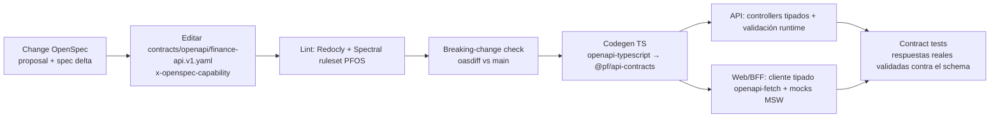

# 10 — Diseño de la API (REST `/api/v1`, contract-first)

> **Estado:** Aceptado — convenciones implementadas en `add-api-conventions` (§19, as-built 2026-10-02) · **Fecha:** 2026-10-01 · **Relacionado:** [ARCHITECTURE.md](ARCHITECTURE.md) §8, §12, §14 · [`contracts/openapi/finance-api.v1.yaml`](../contracts/openapi/finance-api.v1.yaml) · [03-openspec-strategy.md](03-openspec-strategy.md) · [07-c4-architecture.md](07-c4-architecture.md) · [08-data-model.md](08-data-model.md) · [09-ledger-design.md](09-ledger-design.md) · [11-domain-events.md](11-domain-events.md) · [12-security.md](12-security.md) · [13-import-architecture.md](13-import-architecture.md) · [14-reporting.md](14-reporting.md) · [16-testing-strategy.md](16-testing-strategy.md) · ADR-0010, ADR-0019, ADR-0022, ADR-0024

La API de `finance-api` es **REST sobre JSON**, versionada en la ruta (`/api/v1`), descrita **contract-first** en OpenAPI 3.1. Su único cliente en Phase 1–9 es el BFF de `finance-web` (ADR-0019), pero se diseña como API pública estable (otro cliente — CLI, móvil, asistente — debe poder usarla sin cambios).

---

## 1. Enfoque API-first (contract-first)

### 1.1 Flujo de trabajo



1. Toda capability con superficie HTTP empieza en un **change OpenSpec** ([03-openspec-strategy.md](03-openspec-strategy.md)); el delta de la spec y el delta del contrato se revisan en el mismo PR.
2. El contrato es la **fuente de verdad** de la forma HTTP: el código se adapta al contrato, no al revés. No se genera el YAML desde decoradores de Nest.
3. Ubicación: `contracts/openapi/finance-api.v1.yaml` (un archivo en Phase 0–1). Cuando supere ~3 000 líneas se divide en `contracts/openapi/{paths,components}/…` con `$ref` y se publica un bundle (`redocly bundle`) — el path del bundle se mantiene.

### 1.2 Lint y gobernanza

| Herramienta | Uso | Reglas destacadas |
|-------------|-----|-------------------|
| **Redocly CLI** (`redocly lint`) | Validez OpenAPI 3.1 + ruleset `recommended` | `operation-operationId`, `operation-4xx-response`, `security-defined`, `no-unused-components`, `no-ambiguous-paths` |
| **Spectral** (ruleset `contracts/openapi/.spectral.yaml`, Phase 1) | Reglas PFOS | (1) toda operación tiene `x-openspec-capability` con valor de la taxonomía ARCHITECTURE §14; (2) propiedades llamadas `amount`, `*Amount`, `balance`, `rate` deben ser `$ref` a `Money`/`DecimalString`/`Rate` — **prohibido `type: number`** para dinero; (3) `POST` con tag financiero exige parámetro `Idempotency-Key`; (4) `PATCH` exige `If-Match`; (5) respuestas de error `application/problem+json`; (6) propiedades `camelCase`; (7) paths `kebab-case` y plurales; (8) `operationId` `camelCase` único |
| **oasdiff** | Diff contra `main` en CI | Falla el PR si hay cambio *breaking* en `/api/v1` sin label `api-breaking` + ADR |

### 1.3 Generación de tipos

- `openapi-typescript` genera `packages/api-contracts/src/generated.ts` (tipos de paths, requests, responses). Paquete compartido por `apps/api` (capa `interface`) y `apps/web` (BFF y cliente).
- **Servidor:** los controllers Nest usan los tipos generados para requests/responses; la **validación runtime** se hace contra el mismo schema (Ajv 2020-12 compilado desde el contrato al arranque) en un pipe global → errores `400 VALIDATION_FAILED` uniformes. Los DTOs de `interface` se mapean a comandos de `application`; el dominio nunca ve tipos HTTP.
- **Cliente:** `openapi-fetch` tipado en el BFF; TanStack Query en el navegador consume el BFF con los mismos tipos.
- Los montos llegan como `string` y se convierten a `Money` (decimal.js) **en la capa interface**; nunca se parsean a `number`.

### 1.4 Contract testing

- **Provider side** ([16-testing-strategy.md](16-testing-strategy.md) §5.7): los tests de API (supertest) validan cada respuesta contra el schema de la operación (status, headers declarados, body). Una respuesta no declarada falla el test.
- **Consumer side:** mocks MSW generados desde el contrato para tests de `finance-web`; si el contrato cambia, los mocks cambian y los tests del cliente detectan incompatibilidades.
- **Cobertura de contrato:** CI reporta operaciones del YAML sin al menos un test de API que las ejercite (meta: 100 % de operaciones implementadas).

---

## 2. Diseño de URLs

| Regla | Ejemplo |
|-------|---------|
| Base versionada | `/api/v1` |
| Recursos de usuario (sin workspace) | `/api/v1/me`, `/api/v1/workspaces` |
| Recursos de negocio **siempre** bajo workspace | `/api/v1/workspaces/{workspaceId}/transactions` |
| Colecciones en plural, `kebab-case` | `/category-groups`, `/fx-rates`, `/audit-log` (singular por ser un log) |
| Identificadores UUIDv7 en la ruta | `/accounts/0192f3c4-7b2e-7c1a-9d8e-3f2a1b0c9d8e` |
| **Acciones de dominio** = `POST` a sub-recurso verbo | `POST /transactions/{id}/void`, `POST /accounts/{id}/archive`, `POST /periods/{id}/close`, `POST /imports/{id}/approve` |
| Bulk = `POST` a sub-recurso `bulk-<verbo>` de la colección | `POST /transactions/bulk-edit` |
| Sub-colecciones solo si hay pertenencia fuerte | `/imports/{id}/rows/{rowId}`, `/loans/{id}/installments` |
| Sin anidamiento > 2 niveles bajo el workspace | — |
| Sin extensiones de archivo; formato por `Accept` | `Accept: text/csv` en exports |

Verbos: `GET` (lectura, seguro), `POST` (crear / acción), `PATCH` (actualización parcial, `application/merge-patch+json` — RFC 7396), `PUT` solo para reemplazos completos idempotentes de recursos de configuración (p. ej. preferencias), `DELETE` solo para recursos no financieros (desvincular adjunto, revocar conexión). **Nunca `DELETE` sobre datos financieros ni sobre catálogos referenciables** (ARCHITECTURE §9; cuentas, instituciones, categorías, grupos de categorías, tags, counterparties): se usa `void` o `archive`. Un `DELETE` sobre esos recursos responde `405 Method Not Allowed` (problem+json) sin efectos.

---

## 3. Scoping por workspace

1. `{workspaceId}` es explícito en la ruta (ARCHITECTURE §8). No hay "workspace actual" implícito en el servidor.
2. Pipeline por request (ver [07-c4-architecture.md](07-c4-architecture.md) §3.1): JWT válido → `userId` → membership activa en `{workspaceId}` → rol suficiente para la operación → Unit of Work con `SET LOCAL app.workspace_id`.
3. Si el usuario no es miembro activo: `403 WORKSPACE_ACCESS_DENIED` (ADR-0010). Si es miembro pero el recurso no existe **en ese workspace** (incluido el caso de un ID de otro workspace): `404 RESOURCE_NOT_FOUND` — RLS hace que ambos casos sean indistinguibles.
4. Todo ID en el body (p. ej. `accountId`, `categoryId`) se resuelve **dentro** del workspace de la ruta; un ID de otro workspace produce `422 REFERENCE_NOT_FOUND` (nunca se filtra).
5. `GET /me` devuelve las memberships del usuario para que el BFF elija workspace.

---

## 4. Representación

| Aspecto | Convención |
|---------|-----------|
| Formato | `application/json; charset=utf-8`; propiedades `camelCase` |
| IDs | `string` formato `uuid` (UUIDv7). El cliente **puede** proponer el ID en creaciones (`id` opcional en el body) — útil para UIs optimistas e idempotencia natural |
| **Dinero** | Objeto `Money`: `{"amount": "685.00", "currency": "BOB"}`. `amount` es **string decimal** (`^-?\d{1,20}(\.\d{1,18})?$`), nunca number. El servidor rechaza escala mayor a `currency.scale` (`422 AMOUNT_SCALE_EXCEEDED`) y devuelve siempre la escala canónica de la moneda (`"685.00"`, no `"685"`) |
| Signo | En **comandos** los montos son **magnitudes positivas**; la dirección la da `kind` / el endpoint (gasto, ingreso, transferencia). En **representaciones** los `legs` muestran el signo contable desde la perspectiva de la cuenta (salida = negativo, 09 §3); `amount` de la transacción y de los splits es magnitud |
| Tasas | `Rate`: `{"base": "USDT", "quote": "BOB", "value": "6.950000000000000000"}` = 1 base vale `value` quote |
| Moneda | Código `string` (`^[A-Z0-9][A-Z0-9_.-]{1,15}$`): `BOB`, `USD`, `USDT`, `BTC`, … |
| Fecha de negocio | `YYYY-MM-DD` (`format: date`), en la timezone del workspace |
| Instante | RFC 3339 UTC con `Z` (`2026-10-01T14:03:22.123Z`) |
| Enumeraciones | `UPPER_SNAKE_CASE`. **Los clientes deben tolerar valores desconocidos** (las enums pueden crecer sin ser breaking) |
| Nulos | Campos opcionales ausentes **o** `null` explícito (documentado por campo con `type: [X, 'null']`) |
| Versionado del recurso | Campo `version` (int) en todos los agregados mutables + header `ETag` |
| Campos desconocidos en requests | Rechazados (`400 VALIDATION_FAILED`, `additionalProperties: false`) para detectar errores de cliente temprano |

---

## 5. Paginación, filtrado, ordenamiento, campos

### 5.1 Paginación por cursor

- Parámetros: `limit` (default 50, máx 200) y `cursor` (opaco, base64url de `(sortKey…, id)` firmado con HMAC para evitar manipulación).
- Respuesta de colección:

```json
{
  "data": [ { "...": "..." } ],
  "page": { "limit": 50, "nextCursor": "eyJrIjpbIjIwMjYtMDktMzAiLCIwMTkyLi4uIl19.sig", "hasMore": true }
}
```

- Sin `totalCount` por defecto (costoso con RLS y filtros). Reportes que necesiten totales usan endpoints de `reports`.
- Un cursor es válido solo para la misma combinación de filtros y `sort`; si cambian ⇒ `400 INVALID_CURSOR`.
- Orden estable garantizado con `id` como desempate (UUIDv7 ordenable).

### 5.2 Filtrado

- Parámetros **explícitos** por recurso (no un lenguaje de query genérico): `accountId`, `categoryId`, `tagId`, `counterpartyId`, `kind`, `status`, `currency`, `dateFrom`, `dateTo`, `amountMin`, `amountMax`, `q` (texto libre en descripción/notas), `includeArchived`.
- Multi-valor con parámetro repetido (`?accountId=a&accountId=b`, `style: form, explode: true`). Semántica: OR dentro del mismo parámetro, AND entre parámetros.
- Rangos inclusivos (`dateFrom ≤ transactionDate ≤ dateTo`). Montos de filtro como string decimal sobre la magnitud.

### 5.3 Ordenamiento

- `sort` con lista blanca por recurso; prefijo `-` = descendente; múltiples claves separadas por coma: `sort=-transactionDate,-createdAt`. Default documentado por recurso (transactions: `-transactionDate`).
- Clave no permitida ⇒ `400 INVALID_SORT`.

### 5.4 Sparse fieldsets / expansión

- **No** se implementan sparse fieldsets (`fields=`) en v1: payloads pequeños, el BFF da forma a las vistas y la caché HTTP es más simple. Se reevalúa si aparece un cliente móvil.
- Las relaciones "parte del agregado" van **inline** (splits y legs dentro de la transacción; detalle de conversión dentro de la transacción `CONVERSION`). Las referencias a otros agregados son IDs (`categoryId`); el cliente resuelve nombres desde catálogos cacheados (categorías, cuentas, tags), que cambian poco y se sirven con `ETag`.

---

## 6. Concurrencia: ETag / If-Match

| Situación | Comportamiento |
|-----------|---------------|
| `GET` de un recurso | `ETag: "<version>"` (strong; derivado de `version` del agregado) |
| `GET` con `If-None-Match` coincidente | `304 Not Modified` |
| `PATCH` / acciones sobre un agregado existente (`void`, `archive`, `close`…) | **`If-Match` obligatorio**. Ausente ⇒ `428 PRECONDITION_REQUIRED`. No coincide ⇒ `412 PRECONDITION_FAILED` (problem con `currentVersion`) |
| Conflicto detectado en BD (carrera entre check y UPDATE) | `409 CONCURRENCY_CONFLICT` |
| Respuesta de mutación | Nuevo `ETag` + representación completa actualizada |

Colecciones: `ETag` débil sobre catálogos pequeños (`/categories`, `/tags`, `/currencies`) para que el BFF los cachee.

---

## 7. Idempotencia (`Idempotency-Key`)

**Obligatoria** en todo `POST` que crea registros financieros o ejecuta acciones financieras (crear transacción/transferencia/conversión, crear cuenta con saldo inicial, `void`, aprobar import, materializar recurrente, pagar cuota…). Opcional (pero respetada) en el resto de `POST`. Ausente donde es obligatoria ⇒ `428 IDEMPOTENCY_KEY_REQUIRED`.

Semántica (tabla `platform.idempotency_key`, [08-data-model.md](08-data-model.md) §5.18):

1. Clave: string 16–128 chars `[A-Za-z0-9_-]` (el BFF genera UUIDv4/v7 por intento de usuario, no por reintento). Ámbito: `(workspaceId, key)` (o `(userId, key)` en endpoints sin workspace).
2. Se calcula `requestHash = SHA-256(method + routeTemplate + canonicalJSON(body))`.
3. Primera vez: se reserva la clave `IN_PROGRESS` (lock con `locked_until`), se ejecuta el comando y **en la misma transacción** se guarda status, headers relevantes (`Location`, `ETag`) y body de la respuesta (`COMPLETED`).
4. Reintento con misma clave y **mismo hash**: se devuelve la **respuesta almacenada** (mismo status y body) con header `Idempotent-Replayed: true`. No se re-ejecuta nada.
5. Misma clave con **hash distinto**: `422 IDEMPOTENCY_KEY_REUSED`.
6. Misma clave mientras la primera sigue `IN_PROGRESS`: `409 IDEMPOTENCY_REQUEST_IN_PROGRESS` + `Retry-After: 1`.
7. Se almacenan respuestas `2xx` y `4xx` de validación de dominio (determinísticas); **no** se almacenan `5xx` ni `429` (el cliente puede reintentar con la misma clave).
8. Retención: 24 h (configurable hasta 7 días). Pasado ese tiempo la clave puede reutilizarse.

---

## 8. Operaciones asíncronas (202 + operation)

Para trabajos largos (parseo/persistencia de imports, forecasts, exports, rebuilds, borrado de workspace):

```http
POST /api/v1/workspaces/{ws}/imports/{id}/approve
Idempotency-Key: 6f1c...
If-Match: "7"

HTTP/1.1 202 Accepted
Location: /api/v1/workspaces/{ws}/operations/0192f3c4-...
Retry-After: 2
Content-Type: application/json

{ "id": "0192f3c4-...", "kind": "IMPORT_COMMIT", "status": "PENDING", "progressPct": 0,
  "resource": { "type": "import", "id": "..." } }
```

- `GET /operations/{operationId}` → `status` `PENDING | RUNNING | SUCCEEDED | FAILED | CANCELLED`, `progressPct`, `resource` afectado, `result` (resumen) o `error` (Problem Details).
- `POST /operations/{operationId}/cancel` cuando el tipo lo soporte (Phase 6).
- El recurso de negocio (p. ej. `import`) mantiene además su propio estado detallado (máquina de estados de [13-import-architecture.md](13-import-architecture.md)); la operación es la vista genérica para polling.
- Sin webhooks/SSE en v1; el BFF hace polling con backoff respetando `Retry-After`.

---

## 9. Errores: RFC 9457 `application/problem+json`

```json
{
  "type": "https://pfos.dev/problems/ledger-unbalanced-entry",
  "title": "Journal entry is not balanced",
  "status": 422,
  "code": "LEDGER_UNBALANCED_ENTRY",
  "detail": "Postings in currency USDT sum to 0.000001",
  "instance": "/api/v1/workspaces/0192.../transactions",
  "requestId": "0192f3c4-...",
  "errors": [ { "pointer": "/splits/1/amount", "code": "AMOUNT_SCALE_EXCEEDED", "detail": "USDT allows 6 decimals" } ]
}
```

- `type` estable: `https://pfos.dev/problems/<code-en-kebab>` (dominio a confirmar; puede no ser resoluble en Phase 1, RFC 9457 lo permite). `code` = código de dominio `UPPER_SNAKE`, **contrato estable** para el cliente (la UI traduce por `code`, no por `title`).
- `title`/`detail` en inglés técnico (para logs y desarrolladores); la UI muestra copy en español mapeado por `code`.
- `errors[]` con JSON Pointer (RFC 6901) para validaciones por campo.
- Nunca se incluyen stack traces, SQL ni datos de otros workspaces. `5xx` devuelve `INTERNAL_ERROR` + `requestId` para correlación.

### 9.1 Catálogo de códigos (inicial)

| Contexto | Código | HTTP | Significado |
|----------|--------|------|-------------|
| platform | `VALIDATION_FAILED` | 400 | Request no cumple el schema |
| platform | `INVALID_CURSOR`, `INVALID_SORT`, `INVALID_FILTER` | 400 | Parámetros de colección inválidos |
| platform | `UNAUTHENTICATED` | 401 | Token ausente/inválido/expirado |
| platform | `WORKSPACE_ACCESS_DENIED` | 403 | No es miembro activo del workspace |
| platform | `INSUFFICIENT_ROLE` | 403 | Rol insuficiente para la operación |
| platform | `RESOURCE_NOT_FOUND` | 404 | No existe en el workspace |
| platform | `CONCURRENCY_CONFLICT` | 409 | Versión cambió durante la operación |
| platform | `IDEMPOTENCY_REQUEST_IN_PROGRESS` | 409 | Misma clave en ejecución |
| platform | `PRECONDITION_FAILED` | 412 | `If-Match` no coincide |
| platform | `PRECONDITION_REQUIRED`, `IDEMPOTENCY_KEY_REQUIRED` | 428 | Falta `If-Match` / `Idempotency-Key` |
| platform | `IDEMPOTENCY_KEY_REUSED` | 422 | Clave reutilizada con otro payload |
| platform | `REFERENCE_NOT_FOUND` | 422 | Un ID del body no existe en el workspace |
| platform | `RATE_LIMITED` | 429 | Límite excedido |
| platform | `INTERNAL_ERROR` / `SERVICE_UNAVAILABLE` | 500 / 503 | Error inesperado / dependencia caída |
| identity | `INVALID_TIMEZONE` | 422 | Zona horaria que no es un identificador IANA válido (`PATCH /me`, workspaces) |
| identity | `WORKSPACE_PENDING_DELETION` | 409 | Workspace en borrado; solo lectura |
| identity | `LAST_OWNER_CANNOT_LEAVE` | 409 | Debe existir un OWNER |
| accounts | `ACCOUNT_ARCHIVED` | 409 | La cuenta archivada no admite movimientos |
| accounts | `ACCOUNT_CURRENCY_IMMUTABLE` | 409 | No se cambia la moneda de una cuenta con movimientos |
| accounts | `ACCOUNT_NAME_TAKEN` | 409 | Nombre duplicado entre cuentas activas |
| ledger | `LEDGER_UNBALANCED_ENTRY` | 422 | Σ por moneda ≠ 0 (no debería llegar al cliente: indica bug) |
| ledger | `PERIOD_CLOSED` | 409 | Fecha en periodo cerrado |
| ledger | `CURRENCY_MISMATCH` | 422 | Moneda distinta a la de la cuenta |
| transactions | `SPLITS_DO_NOT_SUM` | 422 | Σ splits ≠ monto |
| transactions | `INVALID_STATUS_TRANSITION` | 409 | p. ej. anular una anulada |
| transactions | `TRANSACTION_RECONCILED` | 409 | Requiere des-reconciliar antes de editar montos |
| transactions | `TRANSFER_SAME_ACCOUNT` | 422 | Origen = destino |
| transactions | `CONVERSION_SAME_CURRENCY` | 422 | Conversión entre la misma moneda (usar transferencia) |
| transactions | `CONVERSION_AMOUNTS_INCONSISTENT` | 422 | Montos/fees no cuadran (09 §7.2) |
| shared | `AMOUNT_SCALE_EXCEEDED` | 422 | Más decimales que `currency.scale` |
| shared | `AMOUNT_NOT_POSITIVE` | 422 | Magnitud ≤ 0 en comando |
| classification | `CATEGORY_ARCHIVED`, `TAG_ARCHIVED`, `COUNTERPARTY_ARCHIVED` | 409 | No asignable a splits nuevos |
| classification | `CATEGORY_KIND_MISMATCH` | 422 | Categoría de ingreso en gasto, etc. |
| classification | `SYSTEM_CATEGORY_IMMUTABLE` | 409 | Categorías de sistema no se archivan |
| classification | `NAME_TAKEN` | 409 | Nombre duplicado |
| fx | `FX_RATE_NOT_FOUND` | 422 | Sin tasa para el par/fecha requerida |
| fx | `CURRENCY_NOT_ENABLED` | 422 | Moneda no habilitada en el workspace |
| planning (P2) | `BUDGET_ALREADY_EXISTS`, `PERIOD_OVERLAP`, `MONTH_CLOSING_IN_PROGRESS` | 409 | — |
| commitments (P3) | `INVALID_RRULE`, `OCCURRENCE_ALREADY_MATERIALIZED` | 422 / 409 | — |
| debt (P4) | `INSTALLMENT_ALREADY_PAID`, `PAYMENT_BREAKDOWN_MISMATCH` | 409 / 422 | — |
| goals (P4) | `EARMARK_EXCEEDS_BALANCE` | 422 | INV-018 |
| documents (P6) | `UPLOAD_TYPE_NOT_ALLOWED`, `UPLOAD_TOO_LARGE`, `UPLOAD_CHECKSUM_MISMATCH`, `DOCUMENT_REJECTED` | 422 / 413 | Ver [12-security.md](12-security.md) §10 |
| imports (P6) | `IMPORT_UNSUPPORTED_FORMAT`, `IMPORT_FILE_TOO_LARGE`, `IMPORT_REVIEW_INCOMPLETE`, `IMPORT_INVALID_STATE_TRANSITION`, `IMPORT_REVERT_BLOCKED`, `IMPORT_AMBIGUOUS_NUMBER`, `IMPORT_AMBIGUOUS_DATE`, `IMPORT_CONNECTION_EXPIRED` | 4xx | Definidos en [13-import-architecture.md](13-import-architecture.md) §15 |
| rules (P6) | `RULE_INVALID_DEFINITION` | 422 | JSON Schema de condiciones/acciones |

El catálogo vive en `components.schemas.ErrorCode` del contrato (enum abierto) y en `@pf/shared-kernel` (errores de dominio). Spectral verifica que todo `code` usado en ejemplos exista en el catálogo.

---

## 10. Rate limiting

- Algoritmo token bucket en Redis por `(userId)` y por `(workspaceId)`; límites más estrictos para endpoints costosos (reports, exports, imports) y para el BFF en endpoints de auth.
- Valores iniciales: 600 req/min por usuario en lecturas, 120 req/min en escrituras, 10/min en exports/imports.
- Headers (draft IETF `RateLimit` headers): `RateLimit-Policy: "default";q=600;w=60` y `RateLimit: "default";r=412;t=23` en todas las respuestas; `429 RATE_LIMITED` con `Retry-After` (segundos).
- El BFF propaga los headers al navegador y aplica su propio límite por sesión.

---

## 11. Versionado y deprecación

- **Cambios compatibles** (no requieren nueva versión): agregar endpoints, campos opcionales en requests, campos en responses, valores de enum (clientes deben tolerarlos), nuevos códigos de error dentro de un status existente.
- **Breaking** (requieren `/api/v2` del recurso afectado o ADR de excepción): quitar/renombrar campos, cambiar tipos, volver obligatorio un campo, cambiar semántica, cambiar status codes.
- Coexistencia: `/api/v1` y `/api/v2` conviven en el mismo proceso; v2 puede cubrir solo los recursos que cambian (versionado por recurso documentado en el contrato).
- Deprecación: header `Deprecation: @<epoch>` (RFC 9745) + `Sunset: <HTTP-date>` (RFC 8594) + `Link: <doc>; rel="deprecation"`. Plazo mínimo 90 días antes de remover (en la práctica BFF y API se despliegan juntos, pero la política protege clientes futuros). En el contrato: `deprecated: true` + `x-sunset`.
- `info.version` del contrato sigue SemVer (`1.MINOR.PATCH`), independiente de la versión del producto.

---

## 12. Bulk endpoints

`POST /workspaces/{ws}/transactions/bulk-edit` (capability `transactions/bulk-edit`, Phase 2):

```json
{
  "items": [ { "id": "0192...", "version": 4 }, { "id": "0192...", "version": 2 } ],
  "changes": { "categoryId": "0192...", "addTagIds": ["0192..."], "removeTagIds": [], "counterpartyId": null },
  "mode": "ALL_OR_NOTHING"
}
```

- Solo cambios de **clasificación** (categoría de split único, tags, counterparty, notas): no tocan el ledger (INV-033), por eso son baratos y seguros en lote.
- Máximo 500 items síncronos; `mode`: `ALL_OR_NOTHING` (una transacción BD; cualquier conflicto ⇒ `409` con detalle por item) o `BEST_EFFORT` (`207`-like: `200` con `results[]` por item: `UPDATED | CONFLICT | NOT_FOUND | INVALID`).
- Por encima de 500 o con selección por filtro (`"filter": {...}` en lugar de `items`) ⇒ `202` + operation.
- `Idempotency-Key` obligatorio; un audit log por item + uno agregado con `correlationId` común.
- Bulk `void` **no** se ofrece en v1 (riesgo alto; se hace uno por uno o vía revert de import).

---

## 13. Inventario de recursos

Prefijo `W` = `/api/v1/workspaces/{workspaceId}`.

| Recurso | Endpoints principales | Capability OpenSpec | Fase |
|---------|----------------------|---------------------|------|
| me | `GET/PATCH /api/v1/me` | `identity/authentication` | 1 |
| workspaces | `GET/POST /api/v1/workspaces`, `GET/PATCH /api/v1/workspaces/{id}` | `identity/workspace-membership` | 1 |
| members, invitations | `GET W/members`, `PATCH W/members/{userId}`, `POST W/invitations`, `POST /api/v1/invitations/{token}/accept` | `identity/workspace-membership` | 9 |
| accounts | `GET/POST W/accounts`, `GET/PATCH W/accounts/{id}`, `POST …/archive`, `POST …/close`, `POST …/reactivate` (estados `ACTIVE`/`CLOSED`/`ARCHIVED`), `GET …/balance-history` (P7) | `accounts/account-management` | 1 |
| institutions | `GET/POST W/institutions`, `GET/PATCH …/{id}`, `POST …/archive` | `accounts/institutions` | 1 |
| transactions | `GET/POST W/transactions`, `GET/PATCH …/{id}`, `POST …/{id}/void`, `POST …/{id}/post` | `transactions/transaction-recording`, `transactions/splits` | 1 |
| transactions bulk | `POST W/transactions/bulk-edit` | `transactions/bulk-edit` | 2 |
| transfers | `POST W/transfers` (fachada: crea transacción `TRANSFER`) | `transactions/transfers` | 1 |
| conversions | `GET/POST W/conversions`, `GET …/{transactionId}` | `transactions/conversions`, `fx/conversion-pricing` | 1 |
| reconciliations | `GET/POST W/reconciliations`, `PATCH …/{id}`, `POST …/{id}/complete` | `transactions/reconciliation` | 2 |
| duplicates | `GET W/duplicate-candidates`, `POST …/{id}/resolve` | `transactions/duplicate-detection` | 6 |
| categories | `GET/POST W/categories`, `GET/PATCH …/{id}`, `POST …/archive` | `classification/categories` | 1 |
| category-groups | `GET/POST W/category-groups`, `GET/PATCH …/{id}`, `POST …/archive` | `classification/categories` | 1 |
| tags | `GET/POST W/tags`, `GET/PATCH …/{id}`, `POST …/archive` | `classification/tags` | 1 |
| custom-fields | `GET/POST W/custom-fields`, `PATCH …/{id}`, `POST …/archive` | `classification/custom-fields` | 2 |
| counterparties | `GET/POST W/counterparties`, `GET/PATCH …/{id}`, `POST …/archive`, `POST …/merge` (P2) | `classification/counterparties` | 1 |
| currencies | `GET W/currencies`, `PUT W/currencies/{code}/enabled` (P1.x), `POST W/currencies` (custom, P5) | `fx/market-rates` (ver Preguntas abiertas) | 1 |
| fx-rates | `GET/POST W/fx-rates`, `GET W/fx-rates/latest?base=&quote=&asOf=` | `fx/market-rates` | 1 (manual) / 5 |
| periods | `GET/POST W/periods`, `POST …/{id}/close`, `POST …/{id}/reopen` | `planning/financial-periods`, `planning/month-closing` | 2 |
| budgets | `GET/POST W/budgets`, `GET/PATCH …/{id}`, `PATCH …/{id}/lines/{lineId}` | `planning/budgets` | 2 |
| templates | `GET/POST W/templates`, `GET …/{id}`, `POST …/{id}/versions`, `POST …/{id}/apply` | `planning/budget-templates` | 2 |
| recurring | `GET/POST W/recurring`, `GET/PATCH …/{id}`, `POST …/{id}/pause|resume|end`, `GET …/{id}/occurrences`, `POST …/occurrences/{occId}/materialize|skip` | `commitments/recurrence-engine` | 3 |
| subscriptions | `GET/POST W/subscriptions`, `PATCH …/{id}`, `POST …/{id}/cancel` | `commitments/subscriptions` | 3 |
| goals | `GET/POST W/goals`, `GET/PATCH …/{id}`, `POST …/{id}/contributions`, `POST …/{id}/archive` | `goals/savings-goals` | 4 |
| loans | `GET/POST W/loans`, `GET/PATCH …/{id}`, `GET …/{id}/installments`, `POST …/{id}/installments/{n}/pay`, `POST …/{id}/schedule-changes` | `debt/loans`, `debt/amortization` | 4 |
| credit-cards | `GET/POST W/credit-cards`, `GET …/{id}/statements`, `POST …/{id}/statements` | `debt/credit-cards` | 4 |
| documents | `POST W/documents/uploads`, `POST …/{id}/complete`, `GET …/{id}`, `GET …/{id}/download`, `POST/DELETE W/documents/{id}/links` | `documents/attachments` | 6 |
| imports | `POST W/imports`, `POST …/{id}/upload-complete`, `GET …/{id}`, `GET …/{id}/preview`, `PATCH …/{id}/rows/{rowId}`, `POST …/{id}/approve|cancel|revert|retry`, `…/mapping-profiles`, `…/connections` | `imports/import-pipeline`, `imports/banking-providers` | 6 (CSV P3) |
| rules | `GET/POST W/rules`, `GET/PATCH …/{id}`, `POST …/{id}/test`, `POST …/reorder`, `POST …/{id}/archive` | `rules/rule-engine` | 6 |
| reports | `GET W/reports/summary` (P1: calculado leyendo el ledger y las transacciones directamente, sin read models; consolidado en moneda de reporte siempre presente con `complete` y `unconverted[]`), `GET W/reports/{kpis,income-expenses,budget-vs-actual,expenses/by-category,…}` ([14-reporting.md](14-reporting.md)) | `reporting/*` | 1 / 7 |
| forecasts | `POST W/forecasts` (202), `GET …/{id}`, `GET W/forecasts/latest?kind=` | `forecast/expense-forecasting` | 8 |
| notifications | `GET W/notifications`, `POST …/{id}/read`, `GET/PUT W/notification-preferences` | `notifications/alerts` | 2 |
| audit-log | `GET W/audit-log?aggregateType=&aggregateId=&from=&to=&sort=` (`listAuditLog`, EDITOR+; filtro `actor` en Phase 2) y `POST /me/session-events` (`recordSessionEvent`, auditoría de login/logout que invoca el BFF) | `audit/audit-trail` | 1 |
| operations | `GET W/operations/{id}`, `POST …/{id}/cancel` | `platform/api-conventions` | 1 (contrato) / 6 (uso) |
| exports | `POST W/exports` (202), `GET W/exports/{id}` | `reporting/financial-reports` + privacidad | 7 |
| assistant | `POST W/assistant/conversations`, `POST …/{id}/messages` | `assistant/read-only-assistant` | 10 |
| health | `GET /health/live`, `GET /health/ready` (fuera de `/api/v1`, sin auth, red interna) | `platform/observability` | 1 |

---

## 14. Matriz de autorización (rol × operación)

Roles por workspace (ARCHITECTURE §5, ADR-0010). `✔` permitido, `—` denegado (`403 INSUFFICIENT_ROLE`), `self` solo sobre sí mismo.

| Operación | OWNER | EDITOR | VIEWER |
|-----------|:-----:|:------:|:------:|
| Leer cualquier recurso de negocio del workspace (accounts, transactions, reports, budgets…) | ✔ | ✔ | ✔ |
| Crear/editar/anular transacciones, transferencias, conversiones | ✔ | ✔ | — |
| Bulk edit de clasificación | ✔ | ✔ | — |
| Crear/editar/archivar cuentas, instituciones | ✔ | ✔ | — |
| Gestionar categorías, tags, counterparties, custom fields | ✔ | ✔ | — |
| Registrar tasas FX manuales | ✔ | ✔ | — |
| Presupuestos, templates, recurrentes, metas, préstamos | ✔ | ✔ | — |
| **Cerrar** periodo / mes | ✔ | ✔ | — |
| **Reabrir** periodo cerrado | ✔ | — | — |
| Subir documentos, adjuntar | ✔ | ✔ | — |
| Descargar documentos | ✔ | ✔ | ✔ |
| Imports: crear, revisar, aprobar | ✔ | ✔ | — |
| Imports: revertir | ✔ | — | — |
| Conexiones bancarias/exchange (crear, revocar) | ✔ | — | — |
| Reglas: crear/editar | ✔ | ✔ | — |
| Leer audit log | ✔ | ✔ | — |
| Exportar datos del workspace | ✔ | — | — |
| Editar settings del workspace (nombre, moneda base, timezone) | ✔ | — | — |
| Invitar/cambiar rol/revocar miembros | ✔ | — | — |
| Abandonar workspace | ✔ (si no es el último OWNER) | self | self |
| Solicitar/cancelar borrado del workspace | ✔ (re-auth reciente) | — | — |
| Preferencias de notificación propias | self | self | self |
| Asistente IA (consultas de solo lectura) | ✔ | ✔ | ✔ |

Implementación: cada operación del contrato declara el rol mínimo con la extensión `x-required-role: OWNER|EDITOR|VIEWER`; un test verifica que el decorador del controller coincide con el contrato. RLS no conoce roles (solo workspace); la autorización por rol es de la capa interface/application ([12-security.md](12-security.md) §5).

---

## 15. Vínculo con OpenSpec (`x-openspec-capability`)

- Cada operación lleva `x-openspec-capability` con el identificador de capability de la taxonomía (ARCHITECTURE §14): string, o array cuando la operación implementa varias (la primera es la principal).
- Opcional: `x-openspec-requirements: ["Requirement: Record expense with splits", …]` para trazabilidad fina hacia `### Requirement:` de la spec.
- CI (Spectral + script de trazabilidad, [17-test-traceability.md](17-test-traceability.md)): (1) la extensión existe en el 100 % de operaciones; (2) el valor existe en `openspec/specs/**` o en un change activo `openspec/changes/**/specs/**`; (3) la matriz de trazabilidad muestra, por capability, operaciones HTTP ↔ requirements ↔ TC ↔ tests.

---

## 16. Webhooks y eventos externos

- **Sin webhooks salientes ni entrantes** en v1. Los eventos de dominio son internos (outbox → BullMQ, [11-domain-events.md](11-domain-events.md)) y **no** forman parte del contrato HTTP.
- Integraciones bancarias/exchange se consultan por *polling* desde el worker (Phase 6). Si un proveedor exige webhooks, se agregará un endpoint dedicado fuera de `/api/v1/workspaces` con verificación de firma HMAC y su propio ADR.

---

## 17. Ejemplo end-to-end (Phase 1)

```http
POST /api/v1/workspaces/0192f3c4-0000-7000-8000-000000000001/conversions
Authorization: Bearer eyJ...
Idempotency-Key: 0192f3c5-6a1b-7c2d-8e3f-000000000042
Content-Type: application/json

{
  "transactionDate": "2026-09-30",
  "sourceAccountId": "0192...wallet-usdt",
  "targetAccountId": "0192...bank-bob",
  "sourceAmount": { "amount": "100.000000", "currency": "USDT" },
  "targetAmount": { "amount": "685.00", "currency": "BOB" },
  "quotedRate": { "base": "USDT", "quote": "BOB", "value": "6.90" },
  "fees": [ { "type": "PROVIDER", "amount": { "amount": "5.00", "currency": "BOB" } } ],
  "provider": { "name": "Binance P2P" },
  "executedAt": "2026-09-30T18:42:00Z"
}

HTTP/1.1 201 Created
Location: /api/v1/workspaces/0192.../transactions/0192f3c5-...
ETag: "1"
RateLimit: "default";r=118;t=60
```

(Asiento resultante: ejemplo canónico de ARCHITECTURE §4.2 y 09 §6.14.)

---

## 18. Preguntas abiertas

1. **Capability para el catálogo de monedas**: la taxonomía §14 no tiene `fx/currencies`; se usa `fx/market-rates`. ¿Agregar `fx/currencies`?
2. **`/reports/summary` vs `/reports/kpis` + `/reports/dashboard`** de [14-reporting.md](14-reporting.md): propuesta — `summary` es el endpoint mínimo de Phase 1 y se convierte en alias de `kpis` en Phase 7 (o se deprecia con `Sunset`).
3. **Dominio de `type` de problem details** (`https://pfos.dev/problems/...` es placeholder) — requiere decidir dominio del producto.
4. **Cliente propone IDs** (UUIDv7 en el body): simplifica idempotencia y UI optimista, pero exige validar versión/timestamp del UUID para evitar IDs "del futuro". ¿Se adopta en Phase 1?
5. **`POST /transactions/{id}/post`** (pending → posted) vs `PATCH status`: se propone acción explícita; confirmar con la spec `transactions/transaction-recording`.
6. **Signo en comandos**: magnitudes positivas + `kind`. ¿Se necesita algún comando con monto con signo (ajustes)? Propuesta: `ADJUSTMENT` usa `direction: INCREASE|DECREASE`.
7. **Bulk edit en Phase 2**: ARCHITECTURE no fija la fase de `transactions/bulk-edit`; se propone Phase 2.
8. **Reapertura de periodo por EDITOR**: hoy solo OWNER. Confirmar con el owner (impacta la integridad del cierre).

---

## 19. Estado de implementación — as-built (2026-10-02, change `add-api-conventions`)

Las convenciones de §2–§7 y §9–§11 son comportamiento verificable en `@pf/platform` y `@pf/shared-kernel` (spec `platform/api-conventions`, TC-PLATFORM-API-001..020 y TC-TRANSACTIONS-IDEMPOTENCY-001 automatizados). Todo controller nuevo las hereda sin código propio: basta con que su operación exista en el contrato.

| Convención | Implementación | Notas as-built |
|---|---|---|
| Versionado `/api/v1` (§11) | Prefijo global en `apps/api`; 404 `RESOURCE_NOT_FOUND` problem+json para rutas desconocidas **y** para versiones no publicadas (`/api/v2/...`) | Nest solo instala su 404 bajo el prefijo: `problemFallbackHandlers` cubre el resto |
| Problem Details (§9) | `ErrorCatalog` (`@pf/platform/errors`), `renderProblem`, `ProblemDetailsFilter` global | 500 sin stack/SQL (detalle solo en el log `error` con el mismo `requestId`); dependencia caída (errores de conexión, SQLSTATE 08xxx/57P0x) ⇒ 503 con `Retry-After` |
| Catálogo de códigos (§9.1) | Test de igualdad contrato ↔ `ErrorCatalog` ↔ `apps/web/messages/errors.{es,en,pt}.json` | Los estados se verifican contra los comentarios `# <status>` del enum `ErrorCode` del contrato |
| Validación contra el contrato (§1.3, §4) | `ContractValidationInterceptor` con Ajv 2020-12 compilado al arranque desde el YAML | Interceptor y no pipe (un pipe no ve ruta ni cabeceras). Parámetros de query desconocidos también ⇒ 400. `errors[].in` (`body`/`query`/`header`/`path`) agregado a `FieldError` (cambio compatible) |
| Idempotencia (§7) | `IdempotencyPolicy` + `PgIdempotencyStore` (`platform.idempotency_key`, RLS forzada) + `IdempotencyInterceptor` + `PgCommandTransaction` | Efectos y respuesta se confirman en la misma transacción; purga cada 15 min en el worker con `SET LOCAL ROLE pf_maintenance` (solo filas vencidas). 422 `IDEMPOTENCY_KEY_REUSED` (D1, INV-027) |
| ETag / If-Match (§6) | `ConditionalRequestInterceptor` (`@ExpectedVersion()`), `preconditionFailed()` / `concurrencyConflict()` | `If-Match` débil o mal formado ⇒ 400; `If-None-Match` con comparación débil |
| Cursor (§5.1) | `CursorCodec` (HMAC-SHA256, `kid`, ámbito recurso/workspace/filtros) + `buildPage` | `CURSOR_SIGNING_KEY` obligatoria en staging/production |
| Montos y fechas (§4) | `Money.parse`/`toFixed`, `LocalDate`, `Instant` en `@pf/shared-kernel` | Ceros finales no significativos (`"685.000"` BOB = 685.00); mutation score 84 % (`pnpm --filter @pf/shared-kernel test:mutation`) |
| Rate limiting (§10) | `RateLimitGuard` + `InMemoryRateLimiter` | **Ventana deslizante exacta** en vez de token bucket (garantiza 429 en la escritura 121 dentro de un minuto); en memoria (una réplica); `RATE_LIMIT_STORE=valkey` aún sin adapter |
| Deprecación (§11) | `DeprecationInterceptor` (`Deprecation: @<epoch>`, `Sunset`, `Link; rel="deprecation"`) | El contrato declara `deprecated: true` + `x-deprecated-at` + `x-sunset` (YYYY-MM-DD); regla Spectral `pfos-sunset-on-deprecated` exige ≥ 90 días |
| Gobernanza (§1.2) | Job `contract` de la PR: Redocly, Spectral (`contracts/openapi/.spectral.yaml` + `functions/`) y `oasdiff breaking` contra `main` (imagen fijada por digest) | Fixtures que fallan a propósito en `scripts/contract` (job `integration`). Excepción solo con label `api-breaking` + ADR |
| BFF (§1.3) | `apps/web/src/bff/finance-api-client.ts` | `Idempotency-Key` UUIDv7 por intento del usuario, reutilizada en reintentos técnicos; `If-Match`/`If-None-Match` |

Pendiente: generación de tipos con `openapi-typescript` (`@pf/api-contracts`, §1.3), mocks MSW y el informe de cobertura de operaciones del contrato (§1.4) llegan con el primer contexto de negocio; el E2E Playwright de doble clic / dos pestañas llega con el primer formulario que crea registros (ver `openspec/changes/add-api-conventions/tasks.md` 7.1).
