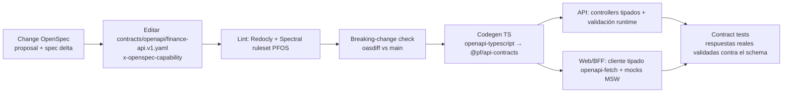

# 10 — Diseño de la API (REST `/api/v1`, contract-first)

> **Estado:** Aceptado — convenciones implementadas en `add-api-conventions` (§19, as-built 2026-10-02) · **Fecha:** 2026-10-01 · **Relacionado:** [ARCHITECTURE.md](ARCHITECTURE.md) §8, §12, §14 · [`contracts/openapi/finance-api.v1.yaml`](../contracts/openapi/finance-api.v1.yaml) · [03-openspec-strategy.md](03-openspec-strategy.md) · [07-c4-architecture.md](07-c4-architecture.md) · [08-data-model.md](08-data-model.md) · [09-ledger-design.md](09-ledger-design.md) · [11-domain-events.md](11-domain-events.md) · [12-security.md](12-security.md) · [13-import-architecture.md](13-import-architecture.md) · [14-reporting.md](14-reporting.md) · [16-testing-strategy.md](16-testing-strategy.md) · ADR-0010, ADR-0019, ADR-0022, ADR-0024

La API de `finance-api` es **REST sobre JSON**, versionada en la ruta (`/api/v1`), descrita **contract-first** en OpenAPI 3.1. Su único cliente en Phase 1–9 es el BFF de `finance-web` (ADR-0019), pero se diseña como API pública estable (otro cliente — CLI, móvil, asistente — debe poder usarla sin cambios).

---

## 1. Enfoque API-first (contract-first)

### 1.1 Flujo de trabajo



1. Toda capability con superficie HTTP empieza en un **change OpenSpec** ([03-openspec-strategy.md](03-openspec-strategy.md)); el delta de la spec y el delta del contrato se revisan en el mismo PR.
2. El contrato es la **fuente de verdad** de la forma HTTP: el código se adapta al contrato, no al revés. No se genera el YAML desde decoradores de Nest.
3. Ubicación: `contracts/openapi/finance-api.v1.yaml` (un archivo en Phase 0–1). Cuando supere ~3 000 líneas se divide en `contracts/openapi/{paths,components}/…` con `$ref` y se publica un bundle (`redocly bundle`) — el path del bundle se mantiene.

### 1.2 Lint y gobernanza

| Herramienta | Uso | Reglas destacadas |
|-------------|-----|-------------------|
| **Redocly CLI** (`redocly lint`) | Validez OpenAPI 3.1 + ruleset `recommended` | `operation-operationId`, `operation-4xx-response`, `security-defined`, `no-unused-components`, `no-ambiguous-paths` |
| **Spectral** (ruleset `contracts/openapi/.spectral.yaml`, Phase 1) | Reglas PFOS | (1) toda operación tiene `x-openspec-capability` con valor de la taxonomía ARCHITECTURE §14; (2) propiedades llamadas `amount`, `*Amount`, `balance`, `rate` deben ser `$ref` a `Money`/`DecimalString`/`Rate` — **prohibido `type: number`** para dinero; (3) `POST` con tag financiero exige parámetro `Idempotency-Key`; (4) `PATCH` exige `If-Match`; (5) respuestas de error `application/problem+json`; (6) propiedades `camelCase`; (7) paths `kebab-case` y plurales; (8) `operationId` `camelCase` único |
| **oasdiff** | Diff contra `main` en CI | Falla el PR si hay cambio *breaking* en `/api/v1` sin label `api-breaking` + ADR |

### 1.3 Generación de tipos

- `openapi-typescript` genera `packages/api-contracts/src/generated.ts` (tipos de paths, requests, responses). Paquete compartido por `apps/api` (capa `interface`) y `apps/web` (BFF y cliente).
- **Servidor:** los controllers Nest usan los tipos generados para requests/responses; la **validación runtime** se hace contra el mismo schema (Ajv 2020-12 compilado desde el contrato al arranque) en un pipe global → errores `400 VALIDATION_FAILED` uniformes. Los DTOs de `interface` se mapean a comandos de `application`; el dominio nunca ve tipos HTTP.
- **Cliente:** `openapi-fetch` tipado en el BFF; TanStack Query en el navegador consume el BFF con los mismos tipos.
- Los montos llegan como `string` y se convierten a `Money` (decimal.js) **en la capa interface**; nunca se parsean a `number`.

### 1.4 Contract testing

- **Provider side** ([16-testing-strategy.md](16-testing-strategy.md) §5.7): los tests de API (supertest) validan cada respuesta contra el schema de la operación (status, headers declarados, body). Una respuesta no declarada falla el test.
- **Consumer side:** mocks MSW generados desde el contrato para tests de `finance-web`; si el contrato cambia, los mocks cambian y los tests del cliente detectan incompatibilidades.
- **Cobertura de contrato:** CI reporta operaciones del YAML sin al menos un test de API que las ejercite (meta: 100 % de operaciones implementadas).

---

## 2. Diseño de URLs

| Regla | Ejemplo |
|-------|---------|
| Base versionada | `/api/v1` |
| Recursos de usuario (sin workspace) | `/api/v1/me`, `/api/v1/workspaces` |
| Recursos de negocio **siempre** bajo workspace | `/api/v1/workspaces/{workspaceId}/transactions` |
| Colecciones en plural, `kebab-case` | `/category-groups`, `/fx-rates`, `/audit-log` (singular por ser un log) |
| Identificadores UUIDv7 en la ruta | `/accounts/0192f3c4-7b2e-7c1a-9d8e-3f2a1b0c9d8e` |
| **Acciones de dominio** = `POST` a sub-recurso verbo | `POST /transactions/{id}/void`, `POST /accounts/{id}/archive`, `POST /periods/{id}/close`, `POST /imports/{id}/approve` |
| Bulk = `POST` a sub-recurso `bulk-<verbo>` de la colección | `POST /transactions/bulk-edit` |
| Sub-colecciones solo si hay pertenencia fuerte | `/imports/{id}/rows/{rowId}`, `/loans/{id}/installments` |
| Sin anidamiento > 2 niveles bajo el workspace | — |
| Sin extensiones de archivo; formato por `Accept` | `Accept: text/csv` en exports |

Verbos: `GET` (lectura, seguro), `POST` (crear / acción), `PATCH` (actualización parcial, `application/merge-patch+json` — RFC 7396), `PUT` solo para reemplazos completos idempotentes de recursos de configuración (p. ej. preferencias), `DELETE` solo para recursos no financieros (desvincular adjunto, revocar conexión). **Nunca `DELETE` sobre datos financieros ni sobre catálogos referenciables** (ARCHITECTURE §9; cuentas, instituciones, categorías, grupos de categorías, tags, counterparties): se usa `void` o `archive`. Un `DELETE` sobre esos recursos responde `405 Method Not Allowed` (problem+json) sin efectos.

---

## 3. Scoping por workspace

1. `{workspaceId}` es explícito en la ruta (ARCHITECTURE §8). No hay "workspace actual" implícito en el servidor.
2. Pipeline por request (ver [07-c4-architecture.md](07-c4-architecture.md) §3.1): JWT válido → `userId` → membership activa en `{workspaceId}` → rol suficiente para la operación → Unit of Work con `SET LOCAL app.workspace_id`.
3. Si el usuario no es miembro activo: `403 WORKSPACE_ACCESS_DENIED` (ADR-0010). Si es miembro pero el recurso no existe **en ese workspace** (incluido el caso de un ID de otro workspace): `404 RESOURCE_NOT_FOUND` — RLS hace que ambos casos sean indistinguibles.
4. Todo ID en el body (p. ej. `accountId`, `categoryId`) se resuelve **dentro** del workspace de la ruta; un ID de otro workspace produce `422 REFERENCE_NOT_FOUND` (nunca se filtra).
5. `GET /me` devuelve las memberships del usuario para que el BFF elija workspace.

---

## 4. Representación

| Aspecto | Convención |
|---------|-----------|
| Formato | `application/json; charset=utf-8`; propiedades `camelCase` |
| IDs | `string` formato `uuid` (UUIDv7). El cliente **puede** proponer el ID en creaciones (`id` opcional en el body) — útil para UIs optimistas e idempotencia natural |
| **Dinero** | Objeto `Money`: `{"amount": "685.00", "currency": "BOB"}`. `amount` es **string decimal** (`^-?\d{1,20}(\.\d{1,18})?$`), nunca number. El servidor rechaza escala mayor a `currency.scale` (`422 AMOUNT_SCALE_EXCEEDED`) y devuelve siempre la escala canónica de la moneda (`"685.00"`, no `"685"`) |
| Signo | En **comandos** los montos son **magnitudes positivas**; la dirección la da `kind` / el endpoint (gasto, ingreso, transferencia). En **representaciones** los `legs` muestran el signo contable desde la perspectiva de la cuenta (salida = negativo, 09 §3); `amount` de la transacción y de los splits es magnitud |
| Tasas | `Rate`: `{"base": "USDT", "quote": "BOB", "value": "6.950000000000000000"}` = 1 base vale `value` quote |
| Moneda | Código `string` (`^[A-Z0-9][A-Z0-9_.-]{1,15}$`): `BOB`, `USD`, `USDT`, `BTC`, … |
| Fecha de negocio | `YYYY-MM-DD` (`format: date`), en la timezone del workspace |
| Instante | RFC 3339 UTC con `Z` (`2026-10-01T14:03:22.123Z`) |
| Enumeraciones | `UPPER_SNAKE_CASE`. **Los clientes deben tolerar valores desconocidos** (las enums pueden crecer sin ser breaking) |
| Nulos | Campos opcionales ausentes **o** `null` explícito (documentado por campo con `type: [X, 'null']`) |
| Versionado del recurso | Campo `version` (int) en todos los agregados mutables + header `ETag` |
| Campos desconocidos en requests | Rechazados (`400 VALIDATION_FAILED`, `additionalProperties: false`) para detectar errores de cliente temprano |

---

## 5. Paginación, filtrado, ordenamiento, campos

### 5.1 Paginación por cursor

- Parámetros: `limit` (default 50, máx 200) y `cursor` (opaco, base64url de `(sortKey…, id)` firmado con HMAC para evitar manipulación).
- Respuesta de colección:

```json
{
  "data": [ { "...": "..." } ],
  "page": { "limit": 50, "nextCursor": "eyJrIjpbIjIwMjYtMDktMzAiLCIwMTkyLi4uIl19.sig", "hasMore": true }
}
```

- Sin `totalCount` por defecto (costoso con RLS y filtros). Reportes que necesiten totales usan endpoints de `reports`.
- Un cursor es válido solo para la misma combinación de filtros y `sort`; si cambian ⇒ `400 INVALID_CURSOR`.
- Orden estable garantizado con `id` como desempate (UUIDv7 ordenable).

### 5.2 Filtrado

- Parámetros **explícitos** por recurso (no un lenguaje de query genérico): `accountId`, `categoryId`, `tagId`, `counterpartyId`, `kind`, `status`, `currency`, `dateFrom`, `dateTo`, `amountMin`, `amountMax`, `q` (texto libre en descripción/notas), `includeArchived`.
- Multi-valor con parámetro repetido (`?accountId=a&accountId=b`, `style: form, explode: true`). Semántica: OR dentro del mismo parámetro, AND entre parámetros.
- Rangos inclusivos (`dateFrom ≤ transactionDate ≤ dateTo`). Montos de filtro como string decimal sobre la magnitud.

### 5.3 Ordenamiento

- `sort` con lista blanca por recurso; prefijo `-` = descendente; múltiples claves separadas por coma: `sort=-transactionDate,-createdAt`. Default documentado por recurso (transactions: `-transactionDate`).
- Clave no permitida ⇒ `400 INVALID_SORT`.

### 5.4 Sparse fieldsets / expansión

- **No** se implementan sparse fieldsets (`fields=`) en v1: payloads pequeños, el BFF da forma a las vistas y la caché HTTP es más simple. Se reevalúa si aparece un cliente móvil.
- Las relaciones "parte del agregado" van **inline** (splits y legs dentro de la transacción; detalle de conversión dentro de la transacción `CONVERSION`). Las referencias a otros agregados son IDs (`categoryId`); el cliente resuelve nombres desde catálogos cacheados (categorías, cuentas, tags), que cambian poco y se sirven con `ETag`.

---

## 6. Concurrencia: ETag / If-Match

| Situación | Comportamiento |
|-----------|---------------|
| `GET` de un recurso | `ETag: "<version>"` (strong; derivado de `version` del agregado) |
| `GET` con `If-None-Match` coincidente | `304 Not Modified` |
| `PATCH` / acciones sobre un agregado existente (`void`, `archive`, `close`…) | **`If-Match` obligatorio**. Ausente ⇒ `428 PRECONDITION_REQUIRED`. No coincide ⇒ `412 PRECONDITION_FAILED` (problem con `currentVersion`) |
| Conflicto detectado en BD (carrera entre check y UPDATE) | `409 CONCURRENCY_CONFLICT` |
| Respuesta de mutación | Nuevo `ETag` + representación completa actualizada |

Colecciones: `ETag` débil sobre catálogos pequeños (`/categories`, `/tags`, `/currencies`) para que el BFF los cachee.

---

## 7. Idempotencia (`Idempotency-Key`)

**Obligatoria** en todo `POST` que crea registros financieros o ejecuta acciones financieras (crear transacción/transferencia/conversión, crear cuenta con saldo inicial, `void`, aprobar import, materializar recurrente, pagar cuota…). Opcional (pero respetada) en el resto de `POST`. Ausente donde es obligatoria ⇒ `428 IDEMPOTENCY_KEY_REQUIRED`.

Semántica (tabla `platform.idempotency_key`, [08-data-model.md](08-data-model.md) §5.18):

1. Clave: string 16–128 chars `[A-Za-z0-9_-]` (el BFF genera UUIDv4/v7 por intento de usuario, no por reintento). Ámbito: `(workspaceId, key)` (o `(userId, key)` en endpoints sin workspace).
2. Se calcula `requestHash = SHA-256(method + routeTemplate + canonicalJSON(body))`.
3. Primera vez: se reserva la clave `IN_PROGRESS` (lock con `locked_until`), se ejecuta el comando y **en la misma transacción** se guarda status, headers relevantes (`Location`, `ETag`) y body de la respuesta (`COMPLETED`).
4. Reintento con misma clave y **mismo hash**: se devuelve la **respuesta almacenada** (mismo status y body) con header `Idempotent-Replayed: true`. No se re-ejecuta nada.
5. Misma clave con **hash distinto**: `422 IDEMPOTENCY_KEY_REUSED`.
6. Misma clave mientras la primera sigue `IN_PROGRESS`: `409 IDEMPOTENCY_REQUEST_IN_PROGRESS` + `Retry-After: 1`.
7. Se almacenan respuestas `2xx` y `4xx` de validación de dominio (determinísticas); **no** se almacenan `5xx` ni `429` (el cliente puede reintentar con la misma clave).
8. Retención: 24 h (configurable hasta 7 días). Pasado ese tiempo la clave puede reutilizarse.

---

## 8. Operaciones asíncronas (202 + operation)

Para trabajos largos (parseo/persistencia de imports, forecasts, exports, rebuilds, borrado de workspace):

```http
POST /api/v1/workspaces/{ws}/imports/{id}/approve
Idempotency-Key: 6f1c...
If-Match: "7"

HTTP/1.1 202 Accepted
Location: /api/v1/workspaces/{ws}/operations/0192f3c4-...
Retry-After: 2
Content-Type: application/json

{ "id": "0192f3c4-...", "kind": "IMPORT_COMMIT", "status": "PENDING", "progressPct": 0,
  "resource": { "type": "import", "id": "..." } }
```

- `GET /operations/{operationId}` → `status` `PENDING | RUNNING | SUCCEEDED | FAILED | CANCELLED`, `progressPct`, `resource` afectado, `result` (resumen) o `error` (Problem Details).
- `POST /operations/{operationId}/cancel` cuando el tipo lo soporte (Phase 6).
- El recurso de negocio (p. ej. `import`) mantiene además su propio estado detallado (máquina de estados de [13-import-architecture.md](13-import-architecture.md)); la operación es la vista genérica para polling.
- Sin webhooks/SSE en v1; el BFF hace polling con backoff respetando `Retry-After`.

---

## 9. Errores: RFC 9457 `application/problem+json`

```json
{
  "type": "https://pfos.dev/problems/ledger-unbalanced-entry",
  "title": "Journal entry is not balanced",
  "status": 422,
  "code": "LEDGER_UNBALANCED_ENTRY",
  "detail": "Postings in currency USDT sum to 0.000001",
  "instance": "/api/v1/workspaces/0192.../transactions",
  "requestId": "0192f3c4-...",
  "errors": [ { "pointer": "/splits/1/amount", "code": "AMOUNT_SCALE_EXCEEDED", "detail": "USDT allows 6 decimals" } ]
}
```

- `type` estable: `https://pfos.dev/problems/<code-en-kebab>` (dominio a confirmar; puede no ser resoluble en Phase 1, RFC 9457 lo permite). `code` = código de dominio `UPPER_SNAKE`, **contrato estable** para el cliente (la UI traduce por `code`, no por `title`).
- `title`/`detail` en inglés técnico (para logs y desarrolladores); la UI muestra copy en español mapeado por `code`.
- `errors[]` con JSON Pointer (RFC 6901) para validaciones por campo.
- Nunca se incluyen stack traces, SQL ni datos de otros workspaces. `5xx` devuelve `INTERNAL_ERROR` + `requestId` para correlación.

### 9.1 Catálogo de códigos (inicial)

| Contexto | Código | HTTP | Significado |
|----------|--------|------|-------------|
| platform | `VALIDATION_FAILED` | 400 | Request no cumple el schema |
| platform | `INVALID_CURSOR`, `INVALID_SORT`, `INVALID_FILTER` | 400 | Parámetros de colección inválidos |
| platform | `UNAUTHENTICATED` | 401 | Token ausente/inválido/expirado |
| platform | `WORKSPACE_ACCESS_DENIED` | 403 | No es miembro activo del workspace |
| platform | `INSUFFICIENT_ROLE` | 403 | Rol insuficiente para la operación |
| identity | `REAUTHENTICATION_REQUIRED` | 403 | Se requiere un inicio de sesión reciente (≤ 10 min) para esta operación (export/import del workspace) |
| identity | `EXPORT_IN_PROGRESS` / `IMPORT_IN_PROGRESS` / `EXPORT_NOT_READY` | 409 | Ya hay una exportación/importación en curso, o la exportación aún no está lista |
| identity | `EXPORT_EXPIRED` | 410 | La exportación venció o se eliminó |
| identity | `EXPORT_FILE_CORRUPTED` / `EXPORT_FORMAT_UNSUPPORTED` / `EXPORT_VERIFICATION_FAILED` | 422 | Archivo alterado o dañado; formato no soportado (versión futura, workspace demo); los datos importados no coinciden con el manifiesto |
| identity | `UPLOAD_TOO_LARGE` | 413 | El archivo supera `WORKSPACE_IMPORT_MAX_BYTES` (200 MB) |
| platform | `RESOURCE_NOT_FOUND` | 404 | No existe en el workspace |
| platform | `METHOD_NOT_ALLOWED` | 405 | `DELETE` sobre un recurso que solo se archiva (categorías, grupos, tags, counterparties; docs/31 D7) |
| platform | `CONCURRENCY_CONFLICT` | 409 | Versión cambió durante la operación |
| platform | `IDEMPOTENCY_REQUEST_IN_PROGRESS` | 409 | Misma clave en ejecución |
| platform | `PRECONDITION_FAILED` | 412 | `If-Match` no coincide |
| platform | `PRECONDITION_REQUIRED`, `IDEMPOTENCY_KEY_REQUIRED` | 428 | Falta `If-Match` / `Idempotency-Key` |
| platform | `IDEMPOTENCY_KEY_REUSED` | 422 | Clave reutilizada con otro payload |
| platform | `REFERENCE_NOT_FOUND` | 422 | Un ID del body no existe en el workspace |
| platform | `RATE_LIMITED` | 429 | Límite excedido |
| platform | `INTERNAL_ERROR` / `SERVICE_UNAVAILABLE` | 500 / 503 | Error inesperado / dependencia caída. Incluye la mutación prohibida de un registro inmutable (SQLSTATE `PF003`, `IMMUTABLE_RECORD`): siempre es un bug, se responde `500` + métrica y no tiene código propio (el antiguo `LEDGER_IMMUTABLE` quedó retirado, docs/31 D56) |
| identity | `INVALID_TIMEZONE` | 422 | Zona horaria que no es un identificador IANA válido (`PATCH /me`, workspaces) |
| identity | `WORKSPACE_PENDING_DELETION` | 409 | Workspace en borrado; solo lectura |
| identity | `LAST_OWNER_CANNOT_LEAVE` | 409 | Debe existir un OWNER |
| identity | `DEMO_WORKSPACE_ALREADY_EXISTS` | 409 | El usuario ya tiene un workspace demo no purgado (add-demo-data, FR-IDENTITY-016) |
| identity | `WORKSPACE_NOT_DEMO` | 409 | "Limpiar datos de demostración" sobre un workspace real (ADR-0026) |
| identity | `DEMO_DATA_DISABLED` | 403 | Carga de datos demo deshabilitada por entorno (`DEMO_DATA_ENABLED=false`) |
| accounts | `ACCOUNT_ARCHIVED` | 409 | La cuenta archivada no admite movimientos |
| accounts | `ACCOUNT_CLOSED` | 409 | La cuenta cerrada no admite movimientos (crear, editar, anular o registrar `pending`; INV-026) |
| accounts | `ACCOUNT_BALANCE_NOT_ZERO` | 409 | Solo se cierra una cuenta con saldo cero (`POST …/close`) |
| accounts | `ACCOUNT_CURRENCY_IMMUTABLE` | 409 | No se cambia la moneda de una cuenta con movimientos |
| accounts | `ACCOUNT_CURRENCY_KIND_MISMATCH` | 422 | La moneda no es compatible con el tipo de cuenta (p. ej. moneda fiat en `CRYPTO_WALLET`) |
| accounts | `ACCOUNT_NAME_TAKEN` | 409 | Nombre duplicado entre cuentas activas |
| accounts | `INSTITUTION_ARCHIVED` | 409 | Institución archivada: no asignable a cuentas (las existentes la conservan) |
| ledger | `LEDGER_UNBALANCED_ENTRY` | 422 | Σ por moneda ≠ 0 (no debería llegar al cliente: indica bug) |
| ledger | `LEDGER_ENTRY_TOO_FEW_POSTINGS` | 422 | Asiento con menos de 2 postings (SQLSTATE `PF005`, docs/31 D19) |
| ledger | `LEDGER_ZERO_AMOUNT_POSTING` | 422 | Posting con monto cero |
| ledger | `LEDGER_SPLIT_REQUIRED` | 422 | Posting nominal (`INCOME`/`EXPENSE`) sin split de origen |
| ledger | `LEDGER_ENTRY_ALREADY_REVERSED` | 409 | El asiento ya fue revertido (reversa única, también bajo concurrencia) |
| ledger | `LEDGER_ENTRY_NOT_REVERSIBLE` | 409 | No se revierte un asiento de tipo `REVERSAL` |
| ledger | `PERIOD_CLOSED` | 409 | Fecha en periodo cerrado |
| ledger | `CURRENCY_MISMATCH` | 422 | Moneda distinta a la de la cuenta |
| transactions | `SPLITS_DO_NOT_SUM` | 422 | Σ splits ≠ monto |
| transactions | `INVALID_STATUS_TRANSITION` | 409 | p. ej. anular una anulada |
| transactions | `TRANSACTION_RECONCILED` | 409 | Requiere des-reconciliar antes de editar montos |
| transactions (P2) | `RECONCILIATION_IN_PROGRESS` | 409 | La cuenta ya tiene una sesión de reconciliación en curso (`startReconciliation`, `add-reconciliation`) |
| transactions (P2) | `RECONCILIATION_STATEMENT_DATE_INVALID` | 422 | Fecha del extracto futura (hoy en la zona del workspace) o no posterior a la de la última sesión completada |
| transactions (P2) | `RECONCILIATION_DIFFERENCE_NOT_ZERO` | 422 | Finalizar con diferencia ≠ 0 sin ajuste confirmado; el problem incluye la extensión `difference` (`Money`) |
| transactions (P2) | `BULK_EDIT_NOT_APPLICABLE` | 422 | Edición masiva: el cambio no aplica a la transacción (categoría sobre una transacción con varios splits, transferencia o conversión; tags o custom fields sobre una sin splits clasificables); `errors[]` indica cada ítem |
| transactions | `REFUND_EXCEEDS_ORIGINAL` | 422 | Σ reembolsos vigentes + nuevo > monto del gasto original (salvo `confirmRefundExceedsOriginal: true`, auditado) |
| transactions | `TRANSFER_SAME_ACCOUNT` | 422 | Origen = destino |
| transactions | `TRANSFER_CURRENCY_MISMATCH` | 422 | Cuentas (o comisión) en otra moneda: la transferencia es de una sola moneda; el problem incluye `suggestedOperationId` (`createConversion`). Una comisión en otra moneda o desde otra cuenta se registra como conversión o gasto aparte (docs/31 D37, D40) |
| transactions | `CONVERSION_SAME_CURRENCY` | 422 | Conversión entre la misma moneda (usar transferencia) |
| transactions | `CONVERSION_AMOUNTS_INCONSISTENT` | 422 | Montos/fees no cuadran (09 §7.2) |
| shared | `MONEY_INVALID_AMOUNT` | 422 | El monto no es un decimal válido |
| shared | `AMOUNT_OUT_OF_RANGE` | 422 | Magnitud fuera de rango (\|x\| ≥ 10²⁰) |
| shared | `AMOUNT_SCALE_EXCEEDED` | 422 | Más decimales que `currency.scale` |
| shared | `AMOUNT_NOT_POSITIVE` | 422 | Magnitud ≤ 0 en comando |
| classification | `CATEGORY_ARCHIVED`, `TAG_ARCHIVED`, `COUNTERPARTY_ARCHIVED` | 409 | No asignable a splits nuevos |
| classification | `CATEGORY_KIND_MISMATCH` | 422 | Categoría de ingreso en gasto, etc. |
| classification | `CATEGORY_DEPTH_EXCEEDED` | 422 | Jerarquía de categorías con más de 2 niveles |
| classification | `CATEGORY_GROUP_NOT_EMPTY` | 409 | Un grupo solo se archiva si todas sus categorías están archivadas |
| classification | `SYSTEM_CATEGORY_IMMUTABLE` | 409 | Categorías de sistema no se archivan |
| classification | `COUNTERPARTY_ALIAS_TAKEN` | 409 | Alias (normalizado) ya usado por otra counterparty del workspace |
| classification | `NAME_TAKEN` | 409 | Nombre duplicado (en counterparties el problem incluye `existingId`) |
| fx | `FX_RATE_NOT_FOUND` | 422 | Sin tasa para el par/fecha requerida |
| fx | `FX_RATE_ALREADY_SUPERSEDED` | 409 | La versión de la tasa ya fue reemplazada (`POST …/supersede`) |
| fx | `FX_RATE_ANOMALY_ALREADY_REVIEWED` | 409 | La anomalía de la tasa de provider ya fue revisada (`POST …/anomaly-review`) |
| fx | `FX_RATE_NOT_ANOMALOUS` | 422 | Se pidió revisar una tasa que no está marcada como anómala |
| fx | `CURRENCY_NOT_ENABLED` | 422 | Moneda no habilitada en el workspace (también `reportingCurrency` de `/reports/summary`) |
| planning (P2) | `PERIOD_NOT_STARTED` | 409 | Activar un periodo cuya fecha de inicio es posterior a hoy en la zona del workspace (`activatePeriod`, add-financial-periods) |
| planning (P2) | `BUDGET_ALREADY_EXISTS` | 409 | El periodo ya tiene plan (`createBudget`, add-budgets) |
| planning (P2) | `BUDGET_LINE_DUPLICATE_TARGET` | 409 | El plan ya tiene una línea para esa categoría, grupo o tag (`addBudgetLine`) |
| planning (P2) | `BUDGET_TARGET_OVERLAP` | 409 | Categoría con su subcategoría, o grupo con una de sus categorías, en el mismo plan (el gasto contaría dos veces) |
| planning (P2) | `BUDGET_INVALID_AMOUNTS` | 422 | Monto negativo, mínimo mayor que el máximo o porcentaje fuera de (0, 100] |
| planning (P2) | `BUDGET_INVALID_LINE_KIND` | 422 | Un ingreso esperado solo admite `FIXED` sin umbrales ni rollover; `MINIMUM` no tiene umbrales |
| planning (P2) | `BUDGET_THRESHOLD_INVALID` | 422 | Umbrales fuera de (0, 1000], repetidos, con más de 2 decimales o más de 10 |
| planning (P2) | `BUDGET_TEMPLATE_ARCHIVED` | 409 | Aplicar, versionar o marcar como predeterminado un template archivado (`applyTemplate`, `createBudget` con `TEMPLATE`, `publishTemplateVersion`, `setDefaultTemplate`; add-budget-templates) |
| planning (P2) | `BUDGET_PROPAGATION_STALE` | 409 | Entre la vista previa y la confirmación cambió un plan, el template o el alcance (`confirmBudgetPropagation`); no se cambia nada |
| planning (P2) | `BUDGET_NO_TEMPLATE_ORIGIN` | 422 | Propagar desde un plan que no viene de un template (docs/33 D84): la UI ofrece crear un template con esas líneas |
| planning (P2) | `PERIOD_NOT_STARTED`, `PERIOD_NOT_ENDED`, `PERIOD_PREVIOUS_NOT_CLOSED`, `PERIOD_NEXT_CLOSED`, `MONTH_CLOSING_BLOCKED`, `MONTH_CLOSING_WARNINGS_NOT_ACKNOWLEDGED` | 409 | `PERIOD_OVERLAP` y `MONTH_CLOSING_IN_PROGRESS` se retiran (add-month-closing): los rangos los calcula el sistema y el cierre es síncrono y serializado. |
| commitments (P3) | `INVALID_RRULE` | 422 | RRULE fuera del subconjunto soportado, con `COUNT` y `UNTIL` a la vez, o sin fechas en 5 años |
| commitments | `RECURRING_KIND_NOT_AVAILABLE` | 422 | `CARD_PAYMENT` solo lo crea una tarjeta como definición administrada (`add-credit-cards`; el usuario sigue recibiendo este código); `LOAN_PAYMENT` solo lo crea Debt como definición administrada de un préstamo (`add-loans`) y en `POST/PATCH W/recurring-definitions` sigue rechazado |
| commitments | `RECURRING_INVALID_SCHEDULE` | 422 | Programación inválida (inicio, fin, intervalo, días del mes) |
| commitments | `RECURRING_INVALID_AMOUNT` | 422 | Monto incoherente con el tipo de monto (`MIN_MAX` fuera de rango, `min > max`, montos <= 0) |
| commitments | `RECURRING_MODE_NOT_ALLOWED` | 422 | `AUTO_CREATE` solo admite montos `FIXED` o `ESTIMATED` |
| commitments | `RECURRING_REVISION_DATE_INVALID` | 422 | La fecha efectiva de la revisión es anterior al inicio o no es posterior a la última ocurrencia resuelta |
| commitments | `OCCURRENCE_AMOUNT_REQUIRED` | 422 | La ocurrencia `VARIABLE` requiere un monto para aprobarla |
| commitments | `OCCURRENCE_LINK_MISMATCH` | 422 | La transacción no es compatible con la ocurrencia (`details.reasons[]`: `ACCOUNT`, `KIND`, `CURRENCY`, `VOIDED`) |
| commitments | `OCCURRENCE_ALREADY_MATERIALIZED` | 409 | La ocurrencia ya tiene una transacción (creada o vinculada) |
| commitments | `MATCH_SUGGESTION_NOT_PENDING` | 409 | La sugerencia de coincidencia ya fue confirmada, descartada o expiró (la ocurrencia se resolvió por otra vía, se canceló, la transacción se anuló o dejó de ser compatible) (`add-commitment-matching`) |
| commitments | `TRANSACTION_ALREADY_LINKED` | 409 | La transacción ya resuelve otra ocurrencia |
| commitments | `RECURRING_MANAGED_EXTERNALLY` | 409 | La definición la administra otro módulo (`managedBy` distinto de `USER`, hoy una suscripción): pausar, reanudar, terminar, revisar o editar la definición se hace desde la suscripción; las acciones sobre sus ocurrencias siguen permitidas (`add-subscriptions`). As-built `add-loans`: las ocurrencias `kind = LOAN_PAYMENT` (`managedBy = DEBT`) se protegen por el `kind`, no por `managedBy`: aprobar, vincular, omitir y editar monto o fecha responden este código con `details {managedBy, managedRef, scheduleKey}`, y la UI ofrece "Registrar pago", que abre el formulario del préstamo (D162) |
| commitments | `SUBSCRIPTION_PRICE_NOT_CHRONOLOGICAL` | 422 | La vigencia del precio nuevo no es posterior a la última entrada no reemplazada del historial |
| commitments | `SUBSCRIPTION_PROPOSAL_NOT_PENDING` | 409 | La propuesta de precio ya fue aceptada, rechazada, reemplazada o retirada |
| debt (P4) | `LOAN_METHOD_NOT_AVAILABLE` | 422 | Método distinto de `FRENCH` (`add-loans`; GERMAN, FIXED_PRINCIPAL y CUSTOM llegan con `add-loan-amortization-advanced`) |
| debt (P4) | `LOAN_ACCOUNT_INVALID` | 422 | La cuenta no es una cuenta `LOAN` activa de la moneda del préstamo |
| debt (P4) | `LOAN_ACCOUNT_IN_USE` | 409 | La cuenta ya respalda otro préstamo no cancelado |
| debt (P4) | `LOAN_ACCOUNT_NOT_EMPTY` | 409 | Un préstamo nuevo exige una cuenta del préstamo con saldo cero |
| debt (P4) | `LOAN_BALANCE_MISMATCH` | 422 | Préstamo en curso: el saldo de la cuenta difiere del pendiente declarado (`details {accountBalance, declared}`) |
| debt (P4) | `LOAN_NOT_DRAFT`, `LOAN_NOT_ACTIVE` | 409 | La operación exige un préstamo en borrador (desembolsar) o activo (pagar, anular un pago) |
| debt (P4) | `LOAN_TERMS_LOCKED` | 409 | Editar condiciones financieras de un préstamo que ya no es borrador (activo: solo nombre, prestamista y cuenta de pago) |
| debt (P4) | `LOAN_OVERPAYMENT` | 422 | El pago, o su principal, supera lo que aún se adeuda |
| debt (P4) | `LOAN_PAYMENT_NOT_LATEST` | 409 | Solo se anula el pago vigente más reciente |
| debt (P4) | `LOAN_HAS_PAYMENTS` | 409 | No se cancela un préstamo con pagos vigentes |
| debt (P4) | `LOAN_REFERENCE_INVALID` | 422 | La tabla del banco tiene filas inválidas (`details.rows[]` con número de fila) |
| debt (P4) | `CREDIT_CARD_ACCOUNT_INVALID` | 422 | La cuenta no es una cuenta `credit_card` activa, o dos cuentas de la tarjeta comparten moneda (`add-credit-cards`) |
| debt (P4) | `CREDIT_CARD_ACCOUNT_IN_USE` | 409 | La cuenta ya pertenece a otra tarjeta activa |
| debt (P4) | `CARD_PAYMENT_PLAN_CONFLICT` | 409 | Existe una transferencia recurrente activa del usuario hacia la cuenta de la tarjeta (`details.conflictingDefinitions[{definitionId, name}]`); el usuario la termina y activa el plan |
| debt (P4) | `INSTALLMENT_PLAN_INVALID` | 422 | La compra no es un gasto posteado de una cuenta de la tarjeta, ya tiene plan, o las cuotas están fuera de 2..60 |
| debt (P4) | `PAYMENT_BREAKDOWN_MISMATCH` | 422 | Σ del desglose distinta del monto (`details {sum, amount}`) |
| transactions (P4) | `TRANSACTION_MANAGED_EXTERNALLY` | 409 | La transacción `LOAN_DISBURSEMENT`/`LOAN_PAYMENT` la administra un préstamo: editar lo financiero o anularla se hace desde Debt (`details {managedBy: 'DEBT', loanId}`); descripción, notas y tags siguen editables. `POST W/transactions` con esos kinds responde `VALIDATION_FAILED` |

`INSTALLMENT_ALREADY_PAID` (previsto en este catálogo) no se usa: un pago se imputa a la siguiente cuota no pagada. En préstamos, `VALIDATION_FAILED` es 400, un préstamo en USD pagado desde una cuenta en BOB se rechaza con `CURRENCY_MISMATCH` (D157) y los `details` de los errores de dominio viajan en la extensión `details` del problem.
| goals (P4) | `EARMARK_EXCEEDS_BALANCE` | 422 | INV-018 |
| documents (P6) | `UPLOAD_TYPE_NOT_ALLOWED`, `UPLOAD_TOO_LARGE`, `UPLOAD_CHECKSUM_MISMATCH`, `DOCUMENT_REJECTED` | 422 / 413 | Ver [12-security.md](12-security.md) §10 |
| imports (P6) | `IMPORT_UNSUPPORTED_FORMAT`, `IMPORT_FILE_TOO_LARGE`, `IMPORT_REVIEW_INCOMPLETE`, `IMPORT_INVALID_STATE_TRANSITION`, `IMPORT_REVERT_BLOCKED`, `IMPORT_AMBIGUOUS_NUMBER`, `IMPORT_AMBIGUOUS_DATE`, `IMPORT_CONNECTION_EXPIRED` | 4xx | Definidos en [13-import-architecture.md](13-import-architecture.md) §15 |
| rules (P6) | `RULE_INVALID_DEFINITION` | 422 | JSON Schema de condiciones/acciones |

El catálogo vive en `components.schemas.ErrorCode` del contrato (enum abierto) y en `@pf/shared-kernel` (errores de dominio). Spectral verifica que todo `code` usado en ejemplos exista en el catálogo. Las filas de contextos sin fase indicada coinciden 1:1 con el enum `ErrorCode` del contrato (Phase 1, alineado el 2026-10-04); las filas marcadas `(P2)`…`(P6)` son códigos previstos que se agregan al contrato al implementar su fase.

---

## 10. Rate limiting

- Algoritmo token bucket en Redis por `(userId)` y por `(workspaceId)`; límites más estrictos para endpoints costosos (reports, exports, imports) y para el BFF en endpoints de auth.
- Valores iniciales: 600 req/min por usuario en lecturas, 120 req/min en escrituras, 10/min en exports/imports.
- **As-built (`fix-phase-2-gaps`):** bucket `costly` (`RATE_LIMIT_COSTLY_PER_MIN`, 10 por defecto, ventana de 60 s) por usuario y por workspace, que se consume además del de escrituras en las operaciones marcadas en el contrato con `x-rate-limit: costly`: `bulkEditTransactions` (no su vista previa), `requestWorkspaceExport`, `requestWorkspaceImport` y `exportAuditLog`. Una reproducción idempotente (`Idempotent-Replayed: true`) no consume cuota costosa; los 429 no se almacenan. Las cabeceras `RateLimit`/`RateLimit-Policy` de esas respuestas describen la política `costly`.
- Headers (draft IETF `RateLimit` headers): `RateLimit-Policy: "default";q=600;w=60` y `RateLimit: "default";r=412;t=23` en todas las respuestas; `429 RATE_LIMITED` con `Retry-After` (segundos).
- El BFF propaga los headers al navegador y aplica su propio límite por sesión.

---

## 11. Versionado y deprecación

- **Cambios compatibles** (no requieren nueva versión): agregar endpoints, campos opcionales en requests, campos en responses, valores de enum (clientes deben tolerarlos), nuevos códigos de error dentro de un status existente.
- **Breaking** (requieren `/api/v2` del recurso afectado o ADR de excepción): quitar/renombrar campos, cambiar tipos, volver obligatorio un campo, cambiar semántica, cambiar status codes.
- Coexistencia: `/api/v1` y `/api/v2` conviven en el mismo proceso; v2 puede cubrir solo los recursos que cambian (versionado por recurso documentado en el contrato).
- Deprecación: header `Deprecation: @<epoch>` (RFC 9745) + `Sunset: <HTTP-date>` (RFC 8594) + `Link: <doc>; rel="deprecation"`. Plazo mínimo 90 días antes de remover (en la práctica BFF y API se despliegan juntos, pero la política protege clientes futuros). En el contrato: `deprecated: true` + `x-sunset`.
- `info.version` del contrato sigue SemVer (`1.MINOR.PATCH`), independiente de la versión del producto.

---

## 12. Bulk endpoints

`POST /workspaces/{ws}/transactions/bulk-edit` (`bulkEditTransactions`, capability `transactions/bulk-edit`, Phase 2; EDITOR u OWNER):

```json
{
  "items": [ { "id": "0192...", "version": 4 }, { "id": "0192...", "version": 2 } ],
  "changes": { "categoryId": "0192...", "addTagIds": ["0192..."], "removeTagIds": [], "counterpartyId": null, "cleared": true }
}
```

- Solo cambios de **clasificación** (categoría de split único, tags, counterparty, notas, custom fields) y el estado `cleared` (`POSTED ↔ CLEARED`): no tocan el ledger (INV-033), por eso son baratos y seguros en lote. `changes` es `additionalProperties: false`: monto, cuenta, fecha, moneda, splits, otro estado o `systemFlags` (docs/33 D111) ⇒ `400 VALIDATION_FAILED` y no cambia nada.
- **Modo único `ALL_OR_NOTHING`** (docs/33 D94): una transacción BD con `SELECT … FOR UPDATE` ordenado por id (`lock_timeout` 5 s ⇒ `409 CONCURRENCY_CONFLICT` reintentable). Se evalúan **todos** los ítems y la respuesta lista todos los fallos en `errors[]` (`pointer: /items/<i>`, `code` por ítem); el estado HTTP es el del error de mayor prioridad: `404` > `403` > `412` (`PRECONDITION_FAILED`, versión obsoleta) > `409` (`PERIOD_CLOSED`, `TRANSACTION_RECONCILED`, `INVALID_STATUS_TRANSITION`, `CATEGORY_ARCHIVED`…) > `422` (`BULK_EDIT_NOT_APPLICABLE`, `CATEGORY_KIND_MISMATCH`, `CUSTOM_FIELD_VALUE_INVALID`…). No existe `BEST_EFFORT` ni ejecución asíncrona (`202`) en Phase 2; se evalúan con imports (Phase 6).
- Máximo **500** ítems (`maxItems`; 501 ⇒ `400 VALIDATION_FAILED`), cada uno con su `version` (el equivalente por ítem de `If-Match`). `Idempotency-Key` obligatorio: el reenvío devuelve la respuesta original (`Idempotent-Replayed: true`), la misma clave con otro contenido `422 IDEMPOTENCY_KEY_REUSED`.
- Periodos cerrados con el alcance único de D65: categoría, tags, contraparte, custom fields y `cleared` ⇒ `409 PERIOD_CLOSED` por ítem; las notas se permiten.
- Auditoría: un `AuditLog` por transacción cambiada (`changes` incluye `bulkOperationId`) más uno agregado (`transactions.transaction.bulk_edited`, agregado `TransactionBulkOperation`); el `bulkOperationId` (UUIDv7) es el `correlation_id` de la auditoría, del recorrido y del outbox de toda la operación. No hay "deshacer" (D95): se revierte con otra edición masiva a partir de la auditoría filtrada por `bulkOperationId`.
- **Vista previa** `POST /workspaces/{ws}/transactions/bulk-edit/preview` (`previewBulkEditTransactions`, sin efectos ni `Idempotency-Key`): `selection` es `{ "items": [{ "id" }] }` o `{ "filter": {…los filtros de listTransactions…} }` y devuelve `{ count, truncated, items: [{ id, version, applicable, reasons: [código] }] }` (hasta 500; `truncated` si el filtro devuelve más). La ejecución envía las transacciones y versiones que la vista previa mostró.
- Rate limit: cuenta como una escritura más (120/min). El bucket de 10/min de exports/imports (§10) no existe todavía en la plataforma; queda pendiente para cuando se implementen.
- Bulk `void` **no** se ofrece en v1 (riesgo alto; se hace uno por uno o vía revert de import).

---

## 13. Inventario de recursos

Prefijo `W` = `/api/v1/workspaces/{workspaceId}`.

| Recurso | Endpoints principales | Capability OpenSpec | Fase |
|---------|----------------------|---------------------|------|
| me | `GET/PATCH /api/v1/me` | `identity/authentication` | 1 |
| workspaces | `GET/POST /api/v1/workspaces`, `GET/PATCH /api/v1/workspaces/{id}` | `identity/workspace-membership` | 1 |
| members, invitations | `GET W/members`, `PATCH W/members/{userId}`, `POST W/invitations`, `POST /api/v1/invitations/{token}/accept` | `identity/workspace-membership` | 9 |
| accounts | `GET/POST W/accounts`, `PUT W/accounts/order` (`reorderAccounts`), `GET/PATCH W/accounts/{id}`, `POST …/archive`, `POST …/close` (saldo cero, si no `409 ACCOUNT_BALANCE_NOT_ZERO`), `POST …/reactivate` (estados `ACTIVE`/`CLOSED`/`ARCHIVED`), `GET …/balance-history` (P7) | `accounts/account-management` | 1 |
| institutions | `GET/POST W/institutions`, `GET/PATCH …/{id}`, `POST …/archive` | `accounts/institutions` | 1 |
| transactions | `GET/POST W/transactions`, `GET/PATCH …/{id}`, `POST …/{id}/post` (pending → posted), `POST …/{id}/void`, `GET …/{id}/history` (`getTransactionHistory`, revisiones), `POST W/transactions/duplicate-check` (`checkTransactionDuplicates`, EDITOR, sin efectos), `POST W/transactions/mark-cleared` (`markTransactionsCleared`, en lote), `POST …/{id}/unreconcile` (`unreconcileTransaction`) | `transactions/transaction-recording`, `transactions/splits`, `transactions/reconciliation`, `transactions/duplicate-detection` | 1 |
| transactions bulk | `POST W/transactions/bulk-edit` (`bulkEditTransactions`), `POST W/transactions/bulk-edit/preview` (`previewBulkEditTransactions`, sin efectos); EDITOR | `transactions/bulk-edit` | 2 |
| transfers | `POST W/transfers` (fachada: crea transacción `TRANSFER`) | `transactions/transfers` | 1 |
| conversions | `GET/POST W/conversions`, `POST W/conversions/preview` (`previewConversion`, VIEWER, sin efectos), `GET …/{transactionId}`, `PUT …/{transactionId}` (`amendConversion`, nueva revisión de `ConversionDetail`), `GET …/{transactionId}/revisions` (`listConversionRevisions`) | `transactions/conversions`, `fx/conversion-pricing` | 1 |
| reconciliations | `GET/POST W/reconciliations` (`listReconciliations`, `startReconciliation`), `GET …/{id}` (`getReconciliation`, saldo confirmado y diferencia en vivo), `POST …/{id}/cleared` (`toggleReconciliationCleared`), `POST …/{id}/complete` (`completeReconciliation`, con ajuste opcional), `POST …/{id}/cancel` (`cancelReconciliation`), `GET …/{id}/lifecycle` (`getReconciliationLifecycle`) y `GET …/{id}/lifecycle/export` (`exportReconciliationLifecycle`, CSV/PDF, D52), `GET W/accounts/{id}/reconciliation-status` (`getReconciliationStatus`); `PATCH …/transactions/{id}` con `status=RECONCILED` exige `reconciliationMode: WITHOUT_STATEMENT`; filtro `systemFlag` en `listTransactions` | `transactions/reconciliation`, `audit/lifecycle-timeline` | 2 |
| duplicates | `GET W/duplicate-candidates`, `POST …/{id}/resolve` | `transactions/duplicate-detection` | 6 |
| categories | `GET/POST W/categories`, `POST W/categories/reorder`, `POST W/categories/apply-default-catalog`, `GET/PATCH …/{id}`, `POST …/archive` (en cascada a subcategorías), `POST …/unarchive` | `classification/categories` | 1 |
| category-groups | `GET/POST W/category-groups`, `GET/PATCH …/{id}`, `POST …/archive`, `POST …/unarchive` | `classification/categories` | 1 |
| tags | `GET/POST W/tags`, `GET/PATCH …/{id}`, `POST …/archive`, `POST …/unarchive` | `classification/tags` | 1 |
| custom-fields | `GET/POST W/custom-fields` (`listCustomFields` con `target`/`includeArchived`, `createCustomField`), `GET/PATCH …/{id}` (`getCustomField`, `updateCustomField`, `If-Match`), `POST …/archive`, `POST …/unarchive` (`If-Match`); sin `DELETE` (405). Los valores viajan en `customFields` (mapa `clave → valor`, decimales como string) de los `splits[]` de la transacción y de la cuenta; filtro del listado `customField[<clave>]=v` y `customField[<clave>][gte|lte]=v` (`style: deepObject`). Códigos: `CUSTOM_FIELD_KEY_TAKEN`, `_ARCHIVED`, `_TYPE_LOCKED`, `_OPTION_IN_USE` (409), `_VALUE_INVALID`, `_REQUIRED`, `_TARGET_MISMATCH` (422); `PERIOD_CLOSED` al cambiar valores de una transacción de un periodo cerrado (D65) | `classification/custom-fields` | 2 (as-built `add-custom-fields`) |
| counterparties | `GET/POST W/counterparties`, `GET W/counterparties/resolve` (por alias), `GET/PATCH …/{id}`, `POST …/archive`, `POST …/unarchive`, `GET …/{id}/category-suggestion`, `POST …/merge` (P2) | `classification/counterparties` | 1 |
| currencies | `GET W/currencies`, `PUT W/currencies/{code}/enabled` (P1.x), `POST W/currencies` (custom, P5) | `fx/market-rates` (ver Preguntas abiertas) | 1 |
| fx-rates | `GET/POST W/fx-rates` (filtros `source`, `provider`), `GET W/fx-rates/{fxRateId}`, `GET W/fx-rates/latest?base=&quote=&asOf=` (con `provider`, `selection`, `stale`, `ageSeconds`, `attribution`), `POST W/fx-rates/{fxRateId}/supersede`, `POST W/fx-rates/{fxRateId}/anomaly-review` (EDITOR; `Idempotency-Key`; 409 `FX_RATE_ANOMALY_ALREADY_REVIEWED`, 422 `FX_RATE_NOT_ANOMALOUS`) | `fx/market-rates`, `fx/market-rate-providers` | 1 (manual y providers paralelo.bo / bo.dolarapi.com, D29) |
| fx-providers | `GET W/fx-providers/status` (VIEWER; salud, feeds, fallas, próximo intento, carga histórica, atribución; nunca llama a un provider) | `fx/market-rate-providers` | 1 |
| fx-rate-preferences | `GET/PUT W/fx-rate-preferences` (`listFxRatePreferences` VIEWER, `replaceFxRatePreferences` EDITOR; tipo de tasa preferido por par, sembrado `PARALLEL` para USD/BOB y USDT/BOB al crear el workspace) | `fx/market-rates` | 1 |
| ledger | `GET W/ledger/trial-balance` (`getLedgerTrialBalance`, solo lectura) | `ledger/balances` | 1 |
| periods | `GET/POST W/periods` (`listPeriods` VIEWER con `status`/`containsDate`, `ensurePeriods` EDITOR con `through` ≤ hoy + 24 meses), `GET …/{id}` (`getPeriod`, ETag), `POST …/{id}/activate` (`activatePeriod` EDITOR, `If-Match`; add-financial-periods), `POST …/{id}/close`, `POST …/{id}/reopen` (add-month-closing) | `planning/financial-periods`, `planning/month-closing` | 2 |
| budgets | `GET/POST W/budgets` (`listBudgets` VIEWER con `periodFrom`/`periodTo`, `createBudget` EDITOR con `Idempotency-Key`), `GET/PATCH …/{id}` (`getBudget` con el progreso de cada línea y `ETag`, `updateBudget` base cero con `If-Match`), `GET …/{id}/history` (`getBudgetHistory`, VIEWER), `GET W/periods/{periodId}/budget` (`getBudgetByPeriod`), `POST …/{id}/lines` (`addBudgetLine`, `Idempotency-Key`), `PATCH|DELETE …/{id}/lines/{lineId}` (`updateBudgetLine` con `If-Match`, `removeBudgetLine`); add-budgets. El gastado se deriva en cada lectura y se informa con las tasas usadas y los montos sin convertir (`actualComplete`, `unconverted`) | `planning/budgets` | 2 |
| templates | `GET/POST W/templates` (`listTemplates` VIEWER con `status`, `createTemplate` EDITOR con `Idempotency-Key`: versión 1, `NAME_TAKEN`), `GET …/{id}` (`getTemplate`: versión vigente e historial de versiones), `GET …/{id}/versions/{versionNo}` (`getTemplateVersion`), `POST …/{id}/versions` (`publishTemplateVersion`: instantánea completa con `baseVersionNo`, `CONCURRENCY_CONFLICT`), `POST …/{id}/clone` (`cloneTemplate`), `POST …/{id}/archive\|unarchive\|set-default`, `POST …/{id}/apply` (`applyTemplate`: atajo de `createBudget` con `source.kind = TEMPLATE`; devuelve `omittedLines`); `DELETE …/{id}` ⇒ 405 (se archiva). `createBudget` acepta `source.kind` `TEMPLATE {templateId, versionNo?}` y `CLONE_PREVIOUS`, y el plan informa `templateVersion`, `clonedFromBudgetId` y `omittedLines`; add-budget-templates | `planning/budget-templates` | 2 |
| budget-propagations | `POST W/budget-propagations/preview` (`previewBudgetPropagation`, sin efectos: cambios, conflictos y `token` de hash) y `POST …/confirm` (`confirmBudgetPropagation`, `Idempotency-Key`; `BUDGET_PROPAGATION_STALE` si algo cambió; `BUDGET_NO_TEMPLATE_ORIGIN` desde un plan sin template); solo alcanza planes de periodos `DRAFT` con inicio posterior a hoy; add-budget-templates | `planning/budget-templates` | 2 |
| recurring | `GET/POST W/recurring` (`listRecurringDefinitions`, `createRecurringDefinition`), `GET/PATCH W/recurring/{definitionId}` (PATCH solo `name`, `description`, `notes` y `matching {amountTolerancePercent, dateWindowDays}`, las tolerancias del matching sugerido; `null` restablece el valor por omisión), `POST …/{definitionId}/revisions` (`reviseRecurringDefinition`, "esta y las siguientes"), `POST …/{definitionId}/pause|resume|end`, `GET …/{definitionId}/occurrences`, `GET W/recurring/occurrences` (próximos pagos y bandeja por aprobar), `PATCH W/recurring/occurrences/{occurrenceId}` (editar monto o fecha), `POST …/occurrences/{occurrenceId}/materialize|skip|link` (`materialize` se mantiene como nombre de operación; "Aprobar" en la UI), `GET W/recurring/committed?periodId=` (total comprometido, Q4), `GET W/recurring/match-suggestions` (`listMatchSuggestions`: sugerencias de coincidencia entre una transacción y una ocurrencia por puntaje, con `proposedCount`; filtros `status`, `occurrenceId`, `transactionId`, `definitionId`; VIEWER) y `POST W/recurring/match-suggestions/{suggestionId}/confirm|dismiss` (`confirmMatchSuggestion`, `dismissMatchSuggestion`; EDITOR, `Idempotency-Key`, `If-Match` opcional; confirmar vincula la ocurrencia con `matchedBy = SUGGESTION`; `MATCH_SUGGESTION_NOT_PENDING` 409 si ya no está propuesta) (`add-commitment-matching`), `GET …/{definitionId}/lifecycle` y `GET …/occurrences/{occurrenceId}/lifecycle` (+ `/export`) | `commitments/recurrence-engine` | 3 |
| subscriptions | `GET/POST W/subscriptions` (`listSubscriptions` VIEWER sin canceladas por omisión, `createSubscription` EDITOR con `Idempotency-Key`), `GET W/subscriptions/cost-summary` (`getSubscriptionCostSummary`, VIEWER), `GET/PATCH …/{id}` (`getSubscription` con `ETag`, historial de precios y propuesta pendiente; `updateSubscription` con `If-Match`), `POST …/{id}/prices` (`addSubscriptionPrice`, `Idempotency-Key`), `POST …/{id}/prices/{priceId}/supersede`, `POST …/{id}/price-proposals/{proposalId}/accept\|reject`, `POST …/{id}/pause\|resume\|cancel`, `POST …/{id}/scheduled-cancellation/undo`, `GET …/{id}/charges`, `PATCH …/{id}/charges/{chargeId}` (monto del extracto en la moneda del precio), `GET …/{id}/lifecycle` (+ `/export`); add-subscriptions | `commitments/subscriptions` | 3 |
| goals | `GET/POST W/goals`, `GET/PATCH …/{id}`, `POST …/{id}/contributions`, `POST …/{id}/archive` | `goals/savings-goals` | 4 |
| loans | **Phase 4 (`add-loans`, tag Debt):** `GET/POST W/loans` (`listLoans` VIEWER; `registerLoan` EDITOR con `Idempotency-Key`), `POST W/loans/schedule-preview` (`previewLoanSchedule`, sin efectos), `GET/PATCH …/{id}` (`getLoan` con `ETag`; `updateLoan` con `If-Match`), `POST …/{id}/disburse` (`disburseLoan`, `Idempotency-Key`), `POST …/{id}/cancel` (`cancelLoan`, `If-Match`), `GET …/{id}/installments` (`listLoanInstallments`), `GET/POST …/{id}/payments` (`listLoanPayments`; `recordLoanPayment`, `Idempotency-Key`), `POST …/{id}/payments/{paymentId}/void` (`voidLoanPayment`, solo el último), `GET/POST …/{id}/reference-schedules` (`listLoanReferenceSchedules`; `uploadLoanReferenceSchedule`), `POST …/reference-schedules/preview` (`previewLoanReferenceSchedule`), `GET …/reference-schedules/{referenceId}/comparison` (`getLoanScheduleComparison`), `GET …/comparison/export` (`exportLoanScheduleComparison`, CSV), `POST …/comparison/explanation` (`explainLoanScheduleComparison`), `GET …/{id}/lifecycle` y `…/lifecycle/export` (`getLoanLifecycle`, `exportLoanLifecycle`). Reemplazan a `…/installments/{n}/pay` (un pago puede cubrir varias cuotas); `…/schedule-changes` llega con `add-loan-amortization-advanced`. | `debt/loans`, `debt/amortization` | 4 |
| credit-cards | **Phase 4 (`add-credit-cards`, tag Debt):** `GET/POST W/credit-cards` (`listCreditCards` VIEWER con `status` y `accountId`; `createCreditCard` EDITOR con `Idempotency-Key`; `paymentPlanConflicts[]` si algún plan pedido quedó sin activar), `GET/PATCH …/{id}` (`getCreditCard` con `ETag`; `updateCreditCard` con `If-Match`), `POST …/{id}/archive`, `GET …/{id}/statements` (emitidos y calculados hasta 12 ciclos, con `issued`, `current` y `difference`), `GET/PATCH …/{id}/statements/{statementId}` (PATCH `If-Match`: `reportedBilledBalance`/`reportedMinimumDue`, `null` borra), `PUT/DELETE …/{id}/accounts/{accountId}/payment-plan` (`If-Match`; 409 `CARD_PAYMENT_PLAN_CONFLICT`), `GET/POST …/{id}/installment-plans` (POST `Idempotency-Key`), `POST …/{id}/installment-plans/{planId}/cancel` y `GET …/{id}/future-charges?months=` (reemplaza a `POST …/{id}/statements`: el estado de cuenta lo emite el job) | `debt/credit-cards` | 4 |
| documents | `POST W/documents/uploads`, `POST …/{id}/complete`, `GET …/{id}`, `GET …/{id}/download`, `POST/DELETE W/documents/{id}/links` | `documents/attachments` | 6 |
| imports | `POST W/imports`, `POST …/{id}/upload-complete`, `GET …/{id}`, `GET …/{id}/preview`, `PATCH …/{id}/rows/{rowId}`, `POST …/{id}/approve|cancel|revert|retry`, `…/mapping-profiles`, `…/connections` | `imports/import-pipeline`, `imports/banking-providers` | 6 (CSV P3) |

**Imports en Phase 3 (`add-basic-csv-import`).** `POST W/imports` es `multipart/form-data` (`file` + `accountId`, tope `IMPORT_CSV_MAX_BYTES` = 2 MiB, `x-rate-limit: costly`, `Idempotency-Key` con el archivo y la cuenta en el hash de la petición); la variante JSON con subida presignada llega en Phase 6 en la misma ruta. Operaciones: `createImport`, `listImports`, `getImport` (polling con `ETag`), `setImportMapping` (`PUT …/{id}/mapping`, costly), `getImportPreview`, `decideImportRow` (`PATCH …/{id}/rows/{rowId}`, `If-Match` = versión del import), `approveImport` (202, costly), `cancelImport`, `retryImport` (202, costly) y `acceptImportErrors`. Códigos nuevos: `IMPORT_UNSUPPORTED_FORMAT` (422), `IMPORT_TOO_MANY_ROWS` (422), `IMPORT_MAPPING_INVALID` (422) e `IMPORT_REVIEW_INCOMPLETE` (409, extensión `pendingDecisions`); se reutilizan `UPLOAD_TOO_LARGE` e `INVALID_STATUS_TRANSITION` en lugar de los nombres `IMPORT_FILE_TOO_LARGE` e `IMPORT_INVALID_STATE_TRANSITION` de docs/13 §15 (un solo código por concepto). Los códigos de fila (`IMPORT_INVALID_DATE`, `IMPORT_INVALID_AMOUNT`, `IMPORT_FUTURE_DATE`, `PERIOD_CLOSED`, `IMPORT_DESCRIPTION_TRUNCATED`) no son HTTP: viajan en `issues[]` de la vista previa.
| rules | `GET/POST W/rules`, `GET/PATCH …/{id}`, `POST …/{id}/test`, `POST …/reorder`, `POST …/{id}/archive` | `rules/rule-engine` | 6 |
| reports | `GET W/reports/summary` (`getReportSummary`, VIEWER; ver §13.1), `GET W/reports/net-worth/history` (`getNetWorthHistory`, VIEWER; ver §13.2), `GET W/reports/upcoming-payments` (`getUpcomingPayments`, VIEWER) y `GET W/reports/surprise-payments` (`getSurprisePayments`, VIEWER; ver §13.3), `GET W/reports/{kpis,income-expenses,budget-vs-actual,expenses/by-category,…}` ([14-reporting.md](14-reporting.md)) | `reporting/dashboard`, `reporting/net-worth` (P1 y P2: evolución), `reporting/cash-flow-calendar` (P3, versión simple); `reporting/*` | 1 / 2 / 3 / 7 |
| forecasts | `POST W/forecasts` (202), `GET …/{id}`, `GET W/forecasts/latest?kind=` | `forecast/expense-forecasting` | 8 |
| notifications | `GET W/notifications?status=&cursor=&limit=` (`listNotifications`), `GET W/notifications/unread-count` (`getUnreadNotificationCount`, con `ETag`), `GET W/notifications/{id}` (`getNotification`), `POST W/notifications/{id}/read` (`markNotificationRead`), `POST W/notifications/read-all` (`markAllNotificationsRead`), `POST W/notifications/{id}/archive` (`archiveNotification`), `GET/PUT W/notification-preferences` (`getNotificationPreferences`/`updateNotificationPreferences`, `If-Match`). Todas "self" (`x-required-role: VIEWER`, solo sobre las propias; ajena o de otro workspace ⇒ 404 `RESOURCE_NOT_FOUND`); título y cuerpo renderizados en el locale del perfil; horario de silencio inválido ⇒ 400 `VALIDATION_FAILED`; sin códigos de error nuevos | `notifications/alerts` | 2 |
| audit-log | `GET W/audit-log?aggregateType=&aggregateId=&from=&to=&sort=` (`listAuditLog`, EDITOR+) y `POST /me/session-events` (`recordSessionEvent`, auditoría de login/logout que invoca el BFF). **Phase 2 (`add-global-audit-view`, FR-AUDIT-006, D105):** `listAuditLog` suma filtros combinables `actorUserId`, `action` (lista separada por comas), `origin`, `correlationId` (en una edición masiva es el `bulkOperationId`) y `category=SECURITY\|DATA` (eventos de seguridad: sesiones, `security.authorization.denied`, cambios de configuración, exports, reaperturas de periodo; el resto es `DATA`), más el campo aditivo `category` en cada entrada; un rango `from`–`to` de más de 366 días sin `aggregateId` ni `correlationId` ⇒ 400 `VALIDATION_FAILED`. `GET W/audit-log/export?format=csv&<mismos filtros>` (`exportAuditLog`, **solo OWNER**; EDITOR/VIEWER ⇒ 403 `INSUFFICIENT_ROLE`): `text/csv; charset=utf-8` con BOM, instantes en la zona del workspace con su desfase, diff resumido `campo: antes → después` con cada valor neutralizado contra CSV injection (D52), hasta 50 000 registros (más ⇒ 400 `VALIDATION_FAILED`), columnas `actorId` y `actorName` (nombre visible actual del usuario, vacío para procesos o si no se resuelve; `fix-phase-2-gaps`), cuota costosa de 10 por usuario y minuto (429 `RATE_LIMITED`); cada exportación se audita como `audit.log.exported`. Sin códigos de error nuevos | `audit/audit-trail` | 1–2 |
| lifecycle | `GET W/transactions/{id}/lifecycle` (`getTransactionLifecycle`, con `revisions[]`), `GET W/accounts/{id}/lifecycle` (`getAccountLifecycle`), `GET W/fx-rates/{id}/lifecycle` (`getRateLifecycle`), `GET W/lifecycle-machines/{Transaction\|Account\|ExchangeRate}` (`getLifecycleMachine`); VIEWER+ (D28), otro workspace ⇒ 404. Por docs/31 D52 (tareas 9.x de `add-lifecycle-timeline`): `GET W/categories/{id}/lifecycle` (`getCategoryLifecycle`), `GET W/counterparties/{id}/lifecycle` (`getCounterpartyLifecycle`), `lifecycle-machines/{Category\|Counterparty}` y la descarga `GET W/{transactions\|accounts\|fx-rates\|categories\|counterparties}/{id}/lifecycle/export?format=csv\|pdf` (`export*Lifecycle`, `text/csv` o `application/pdf` con `Content-Disposition: attachment`; `format` inválido ⇒ 400 `VALIDATION_FAILED`; cada descarga se audita como `audit.lifecycle.exported`); sin códigos de error nuevos (`INVALID_STATUS_TRANSITION` ya existía) | `audit/lifecycle-timeline` | 1 |
| operations | `GET W/operations/{id}`, `POST …/{id}/cancel` (P6, aún no en el contrato) | `platform/api-conventions` | 1 (contrato) / 6 (uso) |
| exports / workspace-imports | **Phase 2 (`add-workspace-export`, FR-IDENTITY-010/017, D98–D102/D108):** `POST W/exports` (`requestWorkspaceExport`, 202 + `operationId`; **OWNER** con autenticación reciente, una exportación en curso por workspace), `GET W/exports` (`listWorkspaceExports`), `GET W/exports/{id}` (`getWorkspaceExport`), `GET W/exports/{id}/download` (`downloadWorkspaceExport`, `application/zip` descifrado y verificado, `Content-Disposition: attachment`, `Repr-Digest`; sin presigned URL), `POST W/exports/{id}/discard` (`discardWorkspaceExport`), `GET W/operations/{id}` (`getOperation`, OWNER) y `POST /workspace-imports` (`requestWorkspaceImport`, multipart ≤ 200 MB, crea un workspace NUEVO), `GET /workspace-imports/{id}` (`getWorkspaceImport`). Códigos nuevos: `REAUTHENTICATION_REQUIRED` (403), `EXPORT_IN_PROGRESS` / `IMPORT_IN_PROGRESS` / `EXPORT_NOT_READY` (409), `EXPORT_EXPIRED` (410), `EXPORT_FILE_CORRUPTED` / `EXPORT_FORMAT_UNSUPPORTED` / `EXPORT_VERIFICATION_FAILED` (422), `UPLOAD_TOO_LARGE` (413) | `identity/workspace-portability` | 2 |
| assistant | `POST W/assistant/conversations`, `POST …/{id}/messages` | `assistant/read-only-assistant` | 10 |
| health | `GET /health/live`, `GET /health/ready` (fuera de `/api/v1`, sin auth, red interna) | `platform/observability` | 1 |


**Préstamos en Phase 4 (`add-loans`).** La tasa viaja como fracción decimal en texto (`"0.115"`) y los montos como `Money`. La carga de la tabla del banco es **JSON** (no hay multipart): el cliente lee el archivo como texto UTF-8 y lo envía (`source = CSV|PASTE|MANUAL`; ≤ 256 KiB y ≤ 600 filas; `LOAN_REFERENCE_INVALID` con `details.rows[]`). El export de la comparación es `…/comparison/export` (el diseño decía `comparison.csv`; Spectral exige paths en kebab-case). `RecurringCadence` pasa a `x-extensible-enum` con el valor `EXPLICIT` (cuotas administradas) y las peticiones de definiciones usan `RecurringCadenceInput`, sin `EXPLICIT`. `Transaction` gana `loanId` y `loanPaymentBreakdown` (`Money` por componente). `LoanPortfolioQuery` (`listLoans`, `interestPaid`) es el contrato público para `add-debt-summary`.

### 13.1 `GET W/reports/summary` (Phase 1)

Contrato: `getReportSummary` → `ReportSummary` (capabilities `reporting/dashboard`, `reporting/net-worth`; change `add-basic-dashboard`).

- **Fuente**: se calcula leyendo el ledger y las transacciones posteadas directamente, **sin read models** (docs/31 D15). `meta.dataFreshness` = instante del último dato incluido; ETag/`If-None-Match` ⇒ `304`.
- **Parámetros**: `month=YYYY-MM` (excluyente con `dateFrom`/`dateTo`; por defecto el mes en curso en la zona del workspace), `reportingCurrency` (por defecto la moneda base, BOB; una moneda no habilitada ⇒ `422 CURRENCY_NOT_ENABLED`), `topCategories` (0–20, por defecto 5) y `compare` (`PREVIOUS_PERIOD_TO_DATE` por defecto, `PREVIOUS_PERIOD`, `NONE`).
- **Por moneda y consolidado**: `byCurrency[]` con las cifras nativas; `consolidated` en la moneda de reporte está **siempre presente** con `complete: boolean` y `unconverted[]` (montos nativos excluidos por falta de tasa; nunca se inventa una tasa). `meta.complete` resume la completitud y `meta.approx` es `true` si alguna cifra consolidada usa tasas de referencia o cruzadas (`CROSS`); `meta.rateWindowDays` es la ventana de frescura aplicada.
- **Valoración**: los stocks (saldos, patrimonio) se valoran a la fecha de consulta y los flujos (ingresos, gastos) a la tasa de su propia fecha. La tasa sale del selector de valoración de FX (`fx/market-rate-providers`): tipo preferido del par (`PARALLEL` sembrado para USD/BOB y USDT/BOB, D29), niveles `PRIMARY` → `FALLBACK` → `LAST_KNOWN_STALE`/`MANUAL`; en el último nivel compiten también manuales de **otro tipo del mismo par** solo si son frescas (≤ `FX_MANUAL_FALLBACK_MAX_AGE` = 24 h, D34/D38) y confiables (no reemplazadas, no anómalas pendientes/rechazadas, desvío ≤ 5 % frente a la última de provider aceptada, D31). Cada tasa usada viaja en `meta.ratesUsed[]` (`ResolvedRate`: `selection`, `stale`, `requestedRateType` vs `rateType`, `derivation` `DIRECT`/`INVERSE`/`CROSS`, `ageSeconds`).
- **Atribución**: `meta.attributions[]` lista las atribuciones distintas de las tasas de provider usadas (p. ej. "Fuente: paralelo.bo", CC BY 4.0); el cliente **debe** mostrarlas junto a las cifras valorizadas ([ADR-0025](adr/0025-fuentes-de-tipo-de-cambio-bolivia.md)).
- **Resto del payload**: `comparison` (null con `compare=NONE`), `accounts[]` (saldo por cuenta), `topExpenseCategories[]` (gasto neto de reembolsos, puede ser negativo, con `complete` propio), `netWorth` (activos, pasivos, patrimonio) y `questions[]` (estado de las preguntas del home).

### 13.2 `GET W/reports/net-worth/history` (Phase 2)

Contrato: `getNetWorthHistory` → `NetWorthHistory` (capability `reporting/net-worth`; change `add-net-worth-evolution`, FR-REPORTING-006; VIEWER).

- **Fuente y puntos**: sin read models (docs/31 D15). Un punto por periodo financiero mensual del rango (`planning/financial-periods`), con `asOf` = fin del periodo (con día de inicio ≠ 1, el fin real del periodo, p. ej. 2026-02-24) u hoy en la zona del workspace para el periodo en curso (`partial: true`). Los periodos futuros no generan punto.
- **Parámetros**: `from`/`to` = etiquetas `YYYY-MM` de periodo (por defecto los últimos 12 periodos terminando en el actual; máximo 120; `to` no posterior al periodo actual, `from ≤ to`; si no ⇒ `400 VALIDATION_FAILED`) y `reportingCurrency` (por defecto la moneda base; no habilitada ⇒ `422 CURRENCY_NOT_ENABLED`).
- **Valoración**: cada punto se valora con la tasa que habría resuelto el selector de FX a la fecha del punto (fin de ese día en la zona del workspace) y la ventana `REPORTING_RATE_VALIDITY_WINDOW` (D53), nunca con la de hoy (INV-012). Sin tasa vigente ⇒ `complete: false` y los saldos nativos excluidos en `unconverted[]` (nunca 1:1); la variación con un punto incompleto es `comparable: false`. Importes como `DecimalString` en `reportingCurrency` (HALF_EVEN una vez al presentar).
- **Cerrados**: un periodo `CLOSED` con snapshot vigente de `planning/month-closing` en la misma moneda de reporte usa sus cifras (`source: SNAPSHOT`, `closed: true`, sin `ratesUsed`); con otra moneda de reporte se calcula (`COMPUTED`) y se marca `closed: true`. Un periodo reabierto se calcula como uno abierto.
- **Cuentas**: las incluidas en el patrimonio (valor vigente del flag para toda la serie calculada, D103), con su saldo a la fecha del punto, incluidas las hoy archivadas o cerradas.
- **Metadatos y caché**: `meta.ratesUsed[]`/`attributions[]` (unión de las tasas de los puntos; cada punto trae las suyas en `ratesUsed`), `meta.rateWindowDays`, `meta.dataFreshness`. `ETag` débil = versión de datos del workspace + hash del contenido; `If-None-Match` ⇒ `304`. La versión de datos se invalida también con `planning.MonthClosed` y `planning.PeriodReopened`.

### 13.3 `GET W/reports/upcoming-payments` y `GET W/reports/surprise-payments` (Phase 3)

Contratos: `getUpcomingPayments` → `UpcomingPayments` y `getSurprisePayments` → `SurprisePayments` (capability `reporting/cash-flow-calendar`, versión simple; change `add-upcoming-payments`, FR-REPORTING-016, FR-COMMITMENTS-011, FR-LEDGER-013; VIEWER).

- **Fuente**: lectura directa de los contratos públicos de Commitments, Transactions, Ledger, Planning y FX en una transacción de lectura (read-your-writes), **sin read model** (docs/35 D117). El read model por eventos queda documentado (design.md § "Evolución a read model") con las métricas `reporting_upcoming_payments_duration_seconds` y `reporting_upcoming_payments_rows` y la alerta `UpcomingPaymentsReadModelRecommended` (docs/18 §8).
- **`getUpcomingPayments`** (`days` 1–90, por defecto 30; fuera de rango ⇒ `400 INVALID_FILTER`; `reportingCurrency` no habilitada ⇒ `422 CURRENCY_NOT_ENABLED`): `items[]` de egresos no resueltos (ocurrencias `SCHEDULED`/`DUE`/`OVERDUE` y transacciones `PENDING`; las transferencias solo de una cuenta líquida a una no líquida, D127) por fecha y nombre, con los vencidos de cualquier antigüedad marcados `OVERDUE` y `daysOverdue`; una ocurrencia materializada como pendiente se lista una sola vez (la transacción con su monto real). Montos según `amountType` (`FIXED`, `ESTIMATED` marcado, `MIN_MAX` con `range` y el máximo en los totales, `VARIABLE` sin monto y fuera de los totales, `withoutAmountCount`, D115; `ACTUAL` = pendiente). `totals` por moneda y `consolidated` en la moneda de reporte, valorado con la tasa vigente **al consultar** (una conversión por moneda, `FlowValuation` con fecha = hoy; sin tasa en la ventana ⇒ `complete: false` y `unconverted[]`, nunca 1:1), `committed` (total del periodo financiero de hoy: compromisos + pendientes, y `overdueFromPreviousPeriods` aparte, D146), `projectedBalances[]` por cuenta no archivada (contable + ingresos pendientes − egresos pendientes, FR-LEDGER-013, D147) y `hasCommitments`. `ETag` débil = versión de datos + hash del contenido; `If-None-Match` ⇒ `304`.
- **`getSurprisePayments`** (`period=YYYY-MM`, por defecto el periodo de hoy; inexistente ⇒ `404 RESOURCE_NOT_FOUND`): pagos sorpresa del periodo (SM-07) y `partial` mientras no termina; `note: UNLINKED_PAYMENTS_NOT_DETECTED`.
- `GET W/reports/summary` suma `actionHint: CREATE_COMMITMENT` (conjunto abierto) a Q4/Q8 cuando no hay definiciones activas ni pendientes de egreso; con ellas son `AVAILABLE`.

---

## 14. Matriz de autorización (rol × operación)

Roles por workspace (ARCHITECTURE §5, ADR-0010). `✔` permitido, `—` denegado (`403 INSUFFICIENT_ROLE`), `self` solo sobre sí mismo.

| Operación | OWNER | EDITOR | VIEWER |
|-----------|:-----:|:------:|:------:|
| Leer cualquier recurso de negocio del workspace (accounts, transactions, reports, budgets…) | ✔ | ✔ | ✔ |
| Crear/editar/anular transacciones, transferencias, conversiones | ✔ | ✔ | — |
| Bulk edit de clasificación | ✔ | ✔ | — |
| Crear/editar/archivar cuentas, instituciones | ✔ | ✔ | — |
| Gestionar categorías, tags, counterparties, custom fields | ✔ | ✔ | — |
| Registrar/reemplazar tasas FX manuales, revisar anomalías de provider, fijar preferencias de tipo de tasa | ✔ | ✔ | — |
| Presupuestos, templates, recurrentes, suscripciones (crear, editar, cambiar precio, decidir propuestas, pausar, reanudar, cancelar), metas, préstamos | ✔ | ✔ | — |
| **Cerrar** periodo / mes | ✔ | ✔ | — |
| **Reabrir** periodo cerrado | ✔ | — | — |
| Subir documentos, adjuntar | ✔ | ✔ | — |
| Descargar documentos | ✔ | ✔ | ✔ |
| Imports: crear, revisar, aprobar | ✔ | ✔ | — |
| Imports: revertir | ✔ | — | — |
| Conexiones bancarias/exchange (crear, revocar) | ✔ | — | — |
| Reglas: crear/editar | ✔ | ✔ | — |
| Leer audit log | ✔ | ✔ | — |
| Exportar el audit log a CSV (`exportAuditLog`, D105) | ✔ | — | — |
| Exportar datos del workspace | ✔ | — | — |
| Editar settings del workspace (nombre, moneda base, timezone) | ✔ | — | — |
| Invitar/cambiar rol/revocar miembros | ✔ | — | — |
| Abandonar workspace | ✔ (si no es el último OWNER) | self | self |
| Solicitar/cancelar borrado del workspace | ✔ (re-auth reciente) | — | — |
| Preferencias de notificación propias | self | self | self |
| Asistente IA (consultas de solo lectura) | ✔ | ✔ | ✔ |

Implementación: cada operación del contrato declara el rol mínimo con la extensión `x-required-role: OWNER|EDITOR|VIEWER`; un test verifica que el decorador del controller coincide con el contrato. RLS no conoce roles (solo workspace); la autorización por rol es de la capa interface/application ([12-security.md](12-security.md) §5).

---

## 15. Vínculo con OpenSpec (`x-openspec-capability`)

- Cada operación lleva `x-openspec-capability` con el identificador de capability de la taxonomía (ARCHITECTURE §14): string, o array cuando la operación implementa varias (la primera es la principal).
- Opcional: `x-openspec-requirements: ["Requirement: Record expense with splits", …]` para trazabilidad fina hacia `### Requirement:` de la spec.
- CI (Spectral + script de trazabilidad, [17-test-traceability.md](17-test-traceability.md)): (1) la extensión existe en el 100 % de operaciones; (2) el valor existe en `openspec/specs/**` o en un change activo `openspec/changes/**/specs/**`; (3) la matriz de trazabilidad muestra, por capability, operaciones HTTP ↔ requirements ↔ TC ↔ tests.

---

## 16. Webhooks y eventos externos

- **Sin webhooks salientes ni entrantes** en v1. Los eventos de dominio son internos (outbox → BullMQ, [11-domain-events.md](11-domain-events.md)) y **no** forman parte del contrato HTTP.
- Integraciones bancarias/exchange se consultan por *polling* desde el worker (Phase 6). Si un proveedor exige webhooks, se agregará un endpoint dedicado fuera de `/api/v1/workspaces` con verificación de firma HMAC y su propio ADR.

---

## 17. Ejemplo end-to-end (Phase 1)

```http
POST /api/v1/workspaces/0192f3c4-0000-7000-8000-000000000001/conversions
Authorization: Bearer eyJ...
Idempotency-Key: 0192f3c5-6a1b-7c2d-8e3f-000000000042
Content-Type: application/json

{
  "transactionDate": "2026-09-30",
  "sourceAccountId": "0192...wallet-usdt",
  "targetAccountId": "0192...bank-bob",
  "sourceAmount": { "amount": "100.000000", "currency": "USDT" },
  "targetAmount": { "amount": "685.00", "currency": "BOB" },
  "quotedRate": { "base": "USDT", "quote": "BOB", "value": "6.90" },
  "fees": [ { "type": "PROVIDER", "amount": { "amount": "5.00", "currency": "BOB" } } ],
  "provider": { "name": "Binance P2P" },
  "executedAt": "2026-09-30T18:42:00Z"
}

HTTP/1.1 201 Created
Location: /api/v1/workspaces/0192.../transactions/0192f3c5-...
ETag: "1"
RateLimit: "default";r=118;t=60
```

(Asiento resultante: ejemplo canónico de ARCHITECTURE §4.2 y 09 §6.14.)

---

## 18. Preguntas abiertas

1. **Capability para el catálogo de monedas**: la taxonomía §14 no tiene `fx/currencies`; se usa `fx/market-rates`. ¿Agregar `fx/currencies`?
2. ~~**`/reports/summary` vs `/reports/kpis` + `/reports/dashboard`** de [14-reporting.md](14-reporting.md)~~ — resuelta por el owner el 2026-10-05 ([docs/31 D55](31-phase-1-consolidation-decisions.md)): Phase 1 mantiene `GET /reports/summary` como único endpoint del Home; el endpoint dedicado `GET /reports/kpis` pertenece a Phase 7, y el change de Phase 7 decide si `summary` pasa a alias de `kpis` o se depreca con `Sunset`.
3. **Dominio de `type` de problem details** (`https://pfos.dev/problems/...` es placeholder) — requiere decidir dominio del producto.
4. **Cliente propone IDs** (UUIDv7 en el body): simplifica idempotencia y UI optimista, pero exige validar versión/timestamp del UUID para evitar IDs "del futuro". ¿Se adopta en Phase 1?
5. **`POST /transactions/{id}/post`** (pending → posted) vs `PATCH status`: se propone acción explícita; confirmar con la spec `transactions/transaction-recording`.
6. **Signo en comandos**: magnitudes positivas + `kind`. ¿Se necesita algún comando con monto con signo (ajustes)? Propuesta: `ADJUSTMENT` usa `direction: INCREASE|DECREASE`.
7. **Bulk edit en Phase 2**: ARCHITECTURE no fija la fase de `transactions/bulk-edit`; se propone Phase 2.
8. **Reapertura de periodo por EDITOR**: hoy solo OWNER. Confirmar con el owner (impacta la integridad del cierre).

---

## 19. Estado de implementación — as-built (2026-10-02, change `add-api-conventions`)

Las convenciones de §2–§7 y §9–§11 son comportamiento verificable en `@pf/platform` y `@pf/shared-kernel` (spec `platform/api-conventions`, TC-PLATFORM-API-001..020 y TC-TRANSACTIONS-IDEMPOTENCY-001 automatizados). Todo controller nuevo las hereda sin código propio: basta con que su operación exista en el contrato.

| Convención | Implementación | Notas as-built |
|---|---|---|
| Versionado `/api/v1` (§11) | Prefijo global en `apps/api`; 404 `RESOURCE_NOT_FOUND` problem+json para rutas desconocidas **y** para versiones no publicadas (`/api/v2/...`) | Nest solo instala su 404 bajo el prefijo: `problemFallbackHandlers` cubre el resto |
| Problem Details (§9) | `ErrorCatalog` (`@pf/platform/errors`), `renderProblem`, `ProblemDetailsFilter` global | 500 sin stack/SQL (detalle solo en el log `error` con el mismo `requestId`); dependencia caída (errores de conexión, SQLSTATE 08xxx/57P0x) ⇒ 503 con `Retry-After` |
| Catálogo de códigos (§9.1) | Test de igualdad contrato ↔ `ErrorCatalog` ↔ `apps/web/messages/errors.{es,en,pt}.json` | Los estados se verifican contra los comentarios `# <status>` del enum `ErrorCode` del contrato |
| Validación contra el contrato (§1.3, §4) | `ContractValidationInterceptor` con Ajv 2020-12 compilado al arranque desde el YAML | Interceptor y no pipe (un pipe no ve ruta ni cabeceras). Parámetros de query desconocidos también ⇒ 400. `errors[].in` (`body`/`query`/`header`/`path`) agregado a `FieldError` (cambio compatible) |
| Idempotencia (§7) | `IdempotencyPolicy` + `PgIdempotencyStore` (`platform.idempotency_key`, RLS forzada) + `IdempotencyInterceptor` + `PgCommandTransaction` | Efectos y respuesta se confirman en la misma transacción; purga cada 15 min en el worker con `SET LOCAL ROLE pf_maintenance` (solo filas vencidas). 422 `IDEMPOTENCY_KEY_REUSED` (D1, INV-027). En operaciones multipart (`requestWorkspaceImport`) el hash usa `{ fileSha256 }` en lugar del cuerpo: un guard de la operación lee el archivo antes de la idempotencia (`fix-phase-2-gaps`) |
| ETag / If-Match (§6) | `ConditionalRequestInterceptor` (`@ExpectedVersion()`), `preconditionFailed()` / `concurrencyConflict()` | `If-Match` débil o mal formado ⇒ 400; `If-None-Match` con comparación débil |
| Cursor (§5.1) | `CursorCodec` (HMAC-SHA256, `kid`, ámbito recurso/workspace/filtros) + `buildPage` | `CURSOR_SIGNING_KEY` obligatoria en staging/production |
| Montos y fechas (§4) | `Money.parse`/`toFixed`, `LocalDate`, `Instant` en `@pf/shared-kernel` | Ceros finales no significativos (`"685.000"` BOB = 685.00); mutation score 84 % (`pnpm --filter @pf/shared-kernel test:mutation`) |
| Rate limiting (§10) | `RateLimitGuard` + `InMemoryRateLimiter` | **Ventana deslizante exacta** en vez de token bucket (garantiza 429 en la escritura 121 dentro de un minuto); en memoria (una réplica); `RATE_LIMIT_STORE=valkey` aún sin adapter |
| Deprecación (§11) | `DeprecationInterceptor` (`Deprecation: @<epoch>`, `Sunset`, `Link; rel="deprecation"`) | El contrato declara `deprecated: true` + `x-deprecated-at` + `x-sunset` (YYYY-MM-DD); regla Spectral `pfos-sunset-on-deprecated` exige ≥ 90 días |
| Gobernanza (§1.2) | Job `contract` de la PR: Redocly, Spectral (`contracts/openapi/.spectral.yaml` + `functions/`) y `oasdiff breaking` contra `main` (imagen fijada por digest) | Fixtures que fallan a propósito en `scripts/contract` (job `integration`). Excepción solo con label `api-breaking` + ADR |
| BFF (§1.3) | `apps/web/src/bff/finance-api-client.ts` | `Idempotency-Key` UUIDv7 por intento del usuario, reutilizada en reintentos técnicos; `If-Match`/`If-None-Match` |

Pendiente: generación de tipos con `openapi-typescript` (`@pf/api-contracts`, §1.3), mocks MSW y el informe de cobertura de operaciones del contrato (§1.4) llegan con el primer contexto de negocio; el E2E Playwright de doble clic / dos pestañas llega con el primer formulario que crea registros (ver `openspec/changes/add-api-conventions/tasks.md` 7.1).
