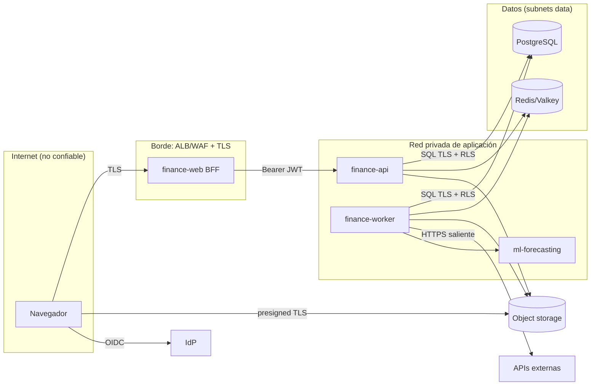
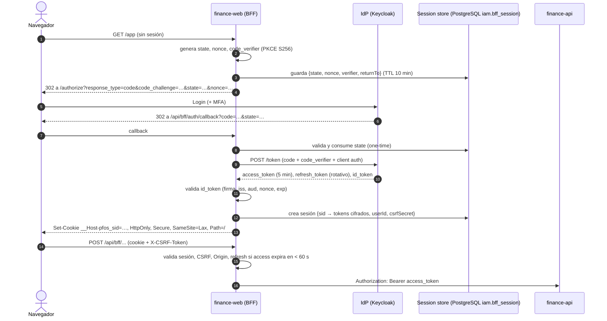

# 12 — Seguridad (threat model, authN/authZ, aislamiento, datos, supply chain)

> **Estado:** Propuesto · **Fecha:** 2026-10-01 · **Relacionado:** [ARCHITECTURE.md](ARCHITECTURE.md) §5, §7, §8, §9, §11 · [07-c4-architecture.md](07-c4-architecture.md) · [08-data-model.md](08-data-model.md) · [10-api-design.md](10-api-design.md) · [13-import-architecture.md](13-import-architecture.md) · [16-testing-strategy.md](16-testing-strategy.md) · [18-observability.md](18-observability.md) · [19-local-development.md](19-local-development.md) · [20-container-strategy.md](20-container-strategy.md) · [21-cloud-deployment-options.md](21-cloud-deployment-options.md) · [23-ci-cd.md](23-ci-cd.md) · [30-backup-and-disaster-recovery.md](30-backup-and-disaster-recovery.md) · ADR-0009, ADR-0010, ADR-0011, ADR-0019, ADR-0020, ADR-0021, ADR-0023 · OpenSpec `security/access-control`, `security/file-upload-security`

PFOS guarda el **mapa financiero completo** de una persona (saldos, deudas, ingresos, contrapartes, comprobantes). Aunque hoy hay un solo usuario, el impacto de una filtración es alto y la arquitectura es multi-workspace desde el modelo de datos, por lo que el objetivo es **OWASP ASVS 5.0 nivel 2** para `finance-web` + `finance-api`.

---

## 1. Activos y clasificación

| Activo | Ubicación | Clasificación | Impacto si se compromete |
|--------|-----------|---------------|--------------------------|
| Datos financieros (transacciones, saldos, conversiones, deudas, presupuestos) | PostgreSQL (`txn`, `ledger`, …) | **Confidencial-alto** | Exposición patrimonial, ingeniería social, extorsión |
| Integridad del ledger | `ledger.*`, `audit.*` | **Integridad crítica** | Decisiones sobre datos falsos; pérdida de confianza |
| Documentos (comprobantes, extractos, contratos) | Object storage | Confidencial-alto (pueden contener nº de cuenta, CI/NIT, direcciones) | PII + financiero |
| Archivos de import | Object storage (`imports/`, cuarentena) | Confidencial-alto | Ídem |
| Credenciales de usuario | **Solo en el IdP** (PFOS nunca ve contraseñas) | Secreto | Toma de cuenta |
| Tokens OIDC (access/refresh/id) | Store de sesión del BFF (server-side) | Secreto | Suplantación por la vida del token |
| Cookie de sesión del BFF | Navegador (httpOnly) | Secreto | Secuestro de sesión |
| Secretos de infraestructura (DB, Redis, S3, client secret OIDC, HMAC de cursores) | `.env` local / Secrets Manager | Secreto | Compromiso total |
| Credenciales de proveedores (bancos, exchanges, rates, LLM) | Secrets Manager (`secret_ref`) | Secreto | Acceso a cuentas externas (deben ser **read-only**) |
| Backups | S3 / snapshots RDS | Confidencial-alto | Equivalente a la BD completa |
| Logs y trazas | OTel backend | Interno (sin datos financieros, §12) | Bajo si se cumple higiene |

---

## 2. Threat model — STRIDE sobre containers C4

Diagrama de containers y fronteras de confianza en [07-c4-architecture.md](07-c4-architecture.md) §2.



| Container | S — Spoofing | T — Tampering | R — Repudiation | I — Information disclosure | D — DoS | E — Elevation of privilege |
|-----------|--------------|---------------|-----------------|----------------------------|---------|----------------------------|
| **Navegador ↔ finance-web** | Robo de cookie de sesión → cookie `__Host-` httpOnly/Secure/SameSite=Lax, rotación de session ID en login, TTL idle 30 min / absoluto 12 h; MFA en IdP | CSRF → SameSite + token anti-CSRF en mutaciones + verificación `Origin`; XSS → CSP estricta con nonces, sin `dangerouslySetInnerHTML` | Acciones atribuibles vía audit log con `actor_user_id` | Tokens nunca en JS; respuestas `Cache-Control: no-store` en datos financieros; sin datos en URLs | Rate limit por sesión/IP en BFF; WAF managed rules | Clickjacking → `frame-ancestors 'none'`; open redirect en login → allowlist de `returnTo` |
| **finance-web → finance-api** | JWT falsificado → firma vía JWKS, `iss`/`aud`/`exp`/`nbf`/`azp`; API no expuesta públicamente | Manipulación de `workspaceId` → guard de membership + RLS; mass assignment → `additionalProperties: false` | `X-Request-Id` + `traceparent` propagados; audit en misma tx | Errores RFC 9457 sin stack/SQL; 404 indistinguible entre "no existe" y "es de otro workspace" | Rate limit Redis por usuario/workspace; límites de tamaño de body (1 MiB); timeouts | Rol insuficiente → `x-required-role` verificado por guard y por test de contrato; IDOR → toda query scoped por RLS |
| **finance-api / worker → PostgreSQL** | Credenciales de BD robadas → Secrets Manager, rotación, TLS `verify-full`, SG solo desde tasks | Postings alterados → sin grants UPDATE/DELETE + triggers `forbid_mutation` + constraint trigger zero-sum | `audit.audit_log` append-only, particionado; opcional hash chain | Query sin workspace → RLS `FORCE` fail-closed; `pf_app` sin `BYPASSRLS`; SQL injection → Kysely parametrizado, prohibido `sql.raw` con input (lint) | Pool limitado; `statement_timeout` 5 s (API), 60 s (worker); índices | `pf_app` no es owner, no `CREATE`; migraciones con rol separado |
| **finance-worker** | Mensajes falsos en cola → Redis con AUTH+TLS, red privada; payload re-validado (JSON Schema de eventos) | Eventos duplicados/reordenados → inbox idempotente | `causationId`/`correlationId` en envelope | Logs sin payloads | Job veneno → reintentos con backoff + DLQ; límites de concurrencia por cola; import con límites de filas/tamaño | Handler opera con `SET LOCAL app.workspace_id` del envelope; jobs cross-workspace solo con rol `pf_maintenance` acotado |
| **Redis/Valkey** | Acceso no autorizado → AUTH/ACL, TLS en cloud, sin puerto público | Inyección de jobs → ACL por usuario (api: enqueue; worker: consume) | — | Datos en colas: solo IDs, nunca montos/PII | `maxmemory` + política `noeviction` para colas | — |
| **Object storage** | URL presignada reutilizada → expiración 5 min (PUT) / 60 s (GET), un objeto por URL | Archivo sustituido → checksum SHA-256 firmado en la URL, versioning en bucket | Metadatos de subida en `documents.document` + audit | Bucket público → Block Public Access, política solo VPC endpoint + presigned; claves de objeto sin nombre original | Subidas masivas → cuota por workspace, tamaño máx. | Malware → cuarentena + MIME sniffing (+ AV futuro); descarga siempre `Content-Disposition: attachment` |
| **IdP (Keycloak/Cognito)** | Phishing/credential stuffing → MFA (obligatorio OWNER en prod), brute-force detection, passkeys | Realm config alterada → realm-as-code versionado (local), IaC (cloud) | Eventos de login del IdP retenidos | Admin console no expuesta públicamente | Lockout progresivo | Roles de negocio **no** en claims (PFOS autoriza, ADR-0010) |
| **APIs externas** (rates, bancos, exchanges, LLM) | DNS/TLS spoofing → TLS con validación, allowlist de hosts salientes | Tasas manipuladas → valores fuera de banda (± X % vs última) quedan `SUSPECT`, no se usan automáticamente | Provider + `fetched_at` en `fx.exchange_rate` | Mínimo dato enviado (LLM: ver §15); API keys read-only | Rate limits del proveedor respetados; circuit breaker | Keys de exchange con permisos de trading ⇒ rechazadas (verificación de scopes al conectar) |
| **ml-forecasting** | Llamadas no autenticadas → red interna + token de servicio | Datasets manipulados → solo recibe agregados del worker | Runs registrados en `forecasting.forecast_run` | Sin acceso a BD; datasets agregados sin descripciones | Timeouts; fuera del camino crítico | Imagen non-root, sin credenciales de BD |
| **CI/CD y supply chain** | Commits suplantados → firma de commits, branch protection | Dependencia maliciosa → lockfile, Renovate con revisión, `pnpm audit`, SBOM, Trivy | Provenance de imágenes (SLSA/attestations) | Secretos en repo → gitleaks pre-commit + CI | — | GitHub Actions con OIDC → rol AWS mínimo; `permissions:` mínimos por workflow; acciones fijadas por SHA |

Riesgos residuales principales (se registran como `RISK-NNN` en el registro de riesgos): compromiso del endpoint del owner (fuera de alcance técnico, mitigado con MFA y sesiones cortas); proveedor de IdP gestionado; error humano de configuración cloud (mitigado con IaC + revisión + checks Trivy/tfsec).

---

## 3. Autenticación: OIDC vía BFF (ADR-0010, ADR-0019)



- **Cliente OIDC confidencial** (el BFF tiene client secret / `private_key_jwt` en cloud) + PKCE S256 aunque sea confidencial (defensa adicional, recomendado por OAuth 2.1).
- **Tokens**: access token corto (5 min), refresh token rotativo con detección de reutilización (IdP), guardados **cifrados** (AES-256-GCM, clave en Secrets Manager) en el store de sesión server-side, la tabla `iam.bff_session` de PostgreSQL ([08-data-model.md](08-data-model.md) §5.1), a la que solo accede el rol `pf_bff`; la cookie solo lleva un `sid` opaco de 256 bits y en BD se guarda `sha256(sid)`.
- **Cookie**: prefijo `__Host-`, `HttpOnly`, `Secure`, `SameSite=Lax`, `Path=/`, sin `Domain`. Rotación del `sid` en login y elevación de privilegio.
- **CSRF**: SameSite=Lax bloquea la mayoría; además *synchronizer token* (`X-CSRF-Token` derivado de `csrfSecret` de la sesión) obligatorio en métodos no seguros y verificación de `Origin`/`Sec-Fetch-Site`. Las rutas BFF solo aceptan `application/json` (no forms simples).
- **Logout**: borra sesión server-side, revoca refresh token en el IdP, RP-initiated logout (`end_session_endpoint`).
- **Implementación (as-built, `add-workspace-identity`)** — `apps/web/src/bff/` (`Bff`, sin dependencias de Next; las
  route handlers solo delegan):
  - Rutas: `GET /api/bff/auth/login?returnTo=…`, `GET /api/bff/auth/callback`, `POST /api/bff/auth/logout`,
    `GET|PUT /api/bff/session` (token CSRF y workspace activo; nunca tokens OAuth) y el proxy
    `/api/bff/v1/*` → `finance-api /api/v1/*` con `Authorization: Bearer`. Rutas internas de `finance-web`: no
    forman parte del contrato de `finance-api`.
  - El registro pre-sesión (`kind = 'PENDING_LOGIN'`, TTL 10 min, de un solo uso: se borra al consumirlo) se liga
    al navegador con una segunda cookie opaca `__Host-pfos_login` (mismos atributos, `Max-Age=600`): un `state`
    reutilizado o nunca emitido, o un callback sin esa cookie, terminan en la página de error en español
    (`/auth/error?reason=state`) sin crear sesión (CSRF de login).
  - Tras el canje del código, el BFF llama a `GET /api/v1/me` con el access token (provisión JIT del usuario y su
    workspace personal) y guarda el `userId`; un fallo (p. ej. email no verificado) termina en
    `/auth/error?reason=provision` y revoca el refresh token.
  - Cifrado: `BFF_SESSION_ENC_KEY` = `[kid:]secreto[,kid:secreto…]` (sin `kid` ⇒ `k0`); de cada secreto se deriva la clave AES-256-GCM
    con HKDF-SHA256 (rotación por `kid`: la primera cifra, todas descifran). El AAD liga cada blob a su fila y
    columna (`<id>:tokens|csrf|login`).
  - Expiración con el reloj del BFF: `SESSION_IDLE_TIMEOUT` (30 min, se desliza como máximo una vez por minuto) y
    `SESSION_ABSOLUTE_TIMEOUT` (12 h). Sesión expirada, cerrada o con refresh rechazado (`invalid_grant`) ⇒ se borra
    la fila y la respuesta es `401 application/problem+json` con `code: UNAUTHENTICATED` (la página muestra "sesión
    expirada" y pide un nuevo login).
  - Refresh de un solo vuelo: promesa compartida por sesión en el proceso + `pg_advisory_xact_lock(
    hashtextextended(id::text, 0))` con relectura de los tokens bajo el bloqueo (dos réplicas del BFF hacen un solo
    refresh; TC-IDENTITY-SESSION-001). Ante un 401 de la API se fuerza un único refresh y se reintenta una vez (la
    API rechaza la autenticación antes de ejecutar nada).
  - CSRF: `Origin` (o `Sec-Fetch-Site: same-origin`) igual a `WEB_PUBLIC_URL` y tipo de cuerpo
    `application/json`/`application/merge-patch+json` se verifican **antes** de cargar la sesión; luego
    `X-CSRF-Token = HMAC-SHA256(csrfSecret, sid)`. Fallo ⇒ `403` con `code: CSRF_REJECTED` (código propio del BFF,
    con mensaje en el catálogo de la UI) y nada se reenvía a la API. El logout también exige Origin + token.
  - En Compose (modo B) el BFF hace el discovery por el back-channel (`OIDC_DISCOVERY_URL=http://keycloak:8080/…`)
    y exige que el documento declare el emisor público `OIDC_ISSUER_URL`; finance-api lee el JWKS por
    `OIDC_JWKS_URI` interno y valida `iss` contra la URL pública.
- **Re-autenticación reciente** (`auth_time` ≤ 10 min, o `max_age` en nueva autorización) para acciones sensibles: exportar workspace, solicitar borrado, cambiar roles, crear conexiones bancarias.
- Local: Keycloak con realm `pfos` importado (`deploy/compose/keycloak/realm-pfos-dev.json`: client `pfos-web`, scope `pfos.api` con audiencia `finance-api`, access token 5 min, `refreshTokenMaxReuse=0`); usuarios de prueba de la Minimal Seed (`owner`, `editor`, `viewer`, `outsider` @demo.pfos.test) con contraseñas aleatorias generadas por `pnpm setup:env` en el `.env` local (nunca reutilizadas ni versionadas). Ver [19-local-development.md](19-local-development.md).

### 3.1 Validación de JWT en `finance-api`

| Check | Regla |
|-------|-------|
| Firma | `RS256`/`ES256` únicamente (allowlist de `alg`; `none` y HS* rechazados) con clave de JWKS por `kid` |
| JWKS | Cache en memoria 10 min; refetch ante `kid` desconocido con *rate limit* (1/min) para evitar DoS por `kid` aleatorios; fallo de JWKS ⇒ se siguen usando claves cacheadas hasta 24 h |
| `iss` | Igual al issuer configurado por entorno (exacto) |
| `aud` | Contiene `finance-api` (audience dedicado; el BFF pide el token con ese audience/scope) |
| `exp`, `nbf`, `iat` | Validados con skew máximo 30 s |
| `azp` | Igual al client id del BFF |
| `sub` | Mapeado a `iam.user` (JIT provisioning en primer acceso; `email_verified` requerido) |
| Scopes | `pfos.api` requerido; roles de negocio **no** se leen del token |

---

## 4. Autorización: RBAC por workspace

- Roles `OWNER`, `EDITOR`, `VIEWER` en `iam.workspace_membership` (ADR-0010). La matriz completa rol × operación está en [10-api-design.md](10-api-design.md) §14 y cada operación del contrato declara `x-required-role`.
- Aplicación en **dos capas**: (1) guard en `interface` (rol mínimo por operación); (2) políticas en `application` para reglas dependientes del estado (p. ej. solo OWNER reabre un periodo, no se puede quitar al último OWNER).
- Permisos agrupados (para tests y futura evolución a permisos finos):

| Permiso | OWNER | EDITOR | VIEWER |
|---------|:-----:|:------:|:------:|
| `finance:read` | ✔ | ✔ | ✔ |
| `finance:write` (transacciones, cuentas, catálogos, planificación) | ✔ | ✔ | — |
| `period:reopen` | ✔ | — | — |
| `import:revert`, `connection:manage` | ✔ | — | — |
| `audit:read` | ✔ | ✔ | — |
| `workspace:admin` (settings, miembros, export, borrado) | ✔ | — | — |

- Membership cacheada por request (no entre requests) para que una revocación tenga efecto inmediato.

---

## 5. Aislamiento de workspaces y RLS (ADR-0023)

**Primera línea:** el guard verifica membership para el `{workspaceId}` de la ruta. **Segunda línea (defense-in-depth):** PostgreSQL RLS, de modo que un bug en un repositorio (olvidar `WHERE workspace_id = …`) no pueda filtrar datos.

1. **Contexto por transacción**: el Unit of Work ejecuta, dentro de cada transacción, `SELECT set_config('app.workspace_id', $1, true)` (equivalente a `SET LOCAL`) y `app.user_id`. Al terminar la transacción el valor desaparece → seguro con *connection pooling* (incluido PgBouncer en modo transaction, si se usara).
2. **Políticas** `USING/WITH CHECK (workspace_id = platform.current_workspace_id())` en **todas** las tablas de negocio, con `FORCE ROW LEVEL SECURITY` (ver [08-data-model.md](08-data-model.md) §1.4, §10.3). Sin setting ⇒ la consulta **falla** con `SQLSTATE PF002` (fail-closed ruidoso, ADR-0023, validado en SPIKE-02); nunca un resultado vacío silencioso.
3. **Roles**:

| Rol | Uso | Atributos |
|-----|-----|-----------|
| `pf_migrator` | Migraciones (contenedor `migrate`, pipeline) | Owner de schemas/tablas; no `SUPERUSER`; credencial distinta, solo disponible en el job de migración |
| `pf_app` | Proceso `api` | `LOGIN NOSUPERUSER NOBYPASSRLS NOCREATEDB NOCREATEROLE`; grants DML mínimos por tabla; sin DDL |
| `pf_worker` | Proceso `worker` | Igual a `pf_app` + políticas del relay de outbox y escritura de read models |
| `pf_bff` | BFF (`finance-web`): store de sesiones | `LOGIN NOSUPERUSER NOBYPASSRLS`; `SELECT/INSERT/UPDATE/DELETE` **solo** sobre `iam.bff_session`; sin acceso a tablas de negocio; credencial separada (`BFF_DATABASE_URL`; `migrate` alinea su contraseña) |
| `pf_maintenance` | Purgas por retención (incl. sesiones expiradas de `iam.bff_session`) | DELETE solo en tablas técnicas/purgables |
| `pf_purge` | Borrado de workspace a pedido del usuario (función `SECURITY DEFINER`) | Único que desactiva triggers de inmutabilidad dentro de la función; auditado |
| `pf_backup` | Dumps lógicos | `BYPASSRLS`, solo lectura, usado únicamente por el job de backup |
| `pf_readonly` (opcional) | Soporte / análisis manual | `NOBYPASSRLS`; requiere fijar workspace explícitamente |

4. **FKs compuestas con `workspace_id`** impiden referencias cruzadas aunque RLS fallara.
5. **Tests que prueban que la fuga es imposible** (`TC-IDENTITY-RLS-*`, [16-testing-strategy.md](16-testing-strategy.md) §5.5):
   - Catálogo: toda tabla con columna `workspace_id` tiene `relrowsecurity = relforcerowsecurity = true` y al menos una política; ninguna tabla de negocio sin `workspace_id` salvo allowlist explícita.
   - Roles: `pf_app`/`pf_worker` no tienen `rolbypassrls`, no son owners de ninguna tabla.
   - Por tabla (parametrizado): con WS-A fijado no se leen filas de WS-B; `INSERT` con `workspace_id` de WS-B falla (`WITH CHECK`); sin setting la consulta **falla** con `SQLSTATE PF002` (nunca 0 filas).
   - API (property-based con fast-check): para operaciones aleatorias del contrato con IDs de otro workspace, la respuesta es siempre 403/404/422 y nunca contiene IDs de WS-B.
   - E2E: dos usuarios en dos workspaces; navegación manipulando URLs.

---

## 6. Validación de entrada y salida

- **Schema-first**: toda request validada contra el contrato OpenAPI (Ajv, `additionalProperties: false`, límites `maxLength`/`maxItems`, patrones de `DecimalString`, `CurrencyCode`, `uuid`). Body máx. 1 MiB (imports/documents van a object storage).
- **Dominio**: invariantes (escala de moneda, Σ splits, moneda de cuenta) en value objects; nunca confiar en el cliente para cálculos financieros.
- **SQL**: Kysely parametrizado; regla ESLint que prohíbe `sql.raw`/`sql.lit` con valores no constantes; `db.statement` sin parámetros en trazas.
- **Texto libre** (descripciones, notas): almacenado tal cual, **escapado en salida** (React escapa por defecto); prohibido renderizar HTML/Markdown de usuario sin sanitizar (si se agrega Markdown en notas: `rehype-sanitize`).
- **CSV/XLSX exports**: neutralizar *formula injection* (prefijo `'` a celdas que empiezan con `= + - @ \t \r`) — ver [13-import-architecture.md](13-import-architecture.md).
- **Regex de usuario** (rules engine, Phase 6): motor sin backtracking catastrófico (RE2 / `re2-wasm`) y timeout.
- **SSRF**: la app nunca hace fetch a URLs provistas por el usuario; los endpoints de proveedores son configuración (allowlist).
- **Deserialización**: solo JSON; sin YAML/XML de usuario salvo OFX (parser sin entidades externas — XXE deshabilitado).

---

## 7. Rate limiting y anti-abuso

| Capa | Mecanismo | Límite inicial |
|------|-----------|----------------|
| WAF (cloud) | AWS WAF managed rules (Core, Known bad inputs) + rate-based rule por IP | 2 000 req/5 min por IP |
| BFF | Por sesión e IP en rutas de auth (`/api/bff/auth/*`) | 20/min |
| API | Token bucket Redis por usuario y workspace; headers `RateLimit-*` ([10-api-design.md](10-api-design.md) §10) | 600 lecturas/min, 120 escrituras/min, 10 exports-imports/min |
| IdP | Brute-force detection / lockout progresivo | Config del IdP |
| Worker | Concurrencia por cola, tamaño máx. de import (filas, MB) | 50 000 filas / 25 MiB por archivo |

---

## 8. Subida segura de archivos (`security/file-upload-security`)

Flujo en [07-c4-architecture.md](07-c4-architecture.md) §4.2.

1. **Solicitud**: el cliente declara `filename`, `contentType`, `sizeBytes`, `sha256`. La API valida:
   - **Allowlist** de extensión + MIME: `pdf (application/pdf)`, `jpg/jpeg (image/jpeg)`, `png (image/png)`, `webp (image/webp)`, `heic (image/heic)`, `csv (text/csv)`, `ofx/qfx`, `qif`, `xlsx`. Nada ejecutable, ni SVG (XSS), ni HTML, ni archivos comprimidos (zip bombs) en v1.
   - Tamaño ≤ 25 MiB (documentos) / según 13 para imports; cuota por workspace (p. ej. 5 GiB).
2. **Presigned PUT** a `quarantine/{workspaceId}/{documentId}` con condiciones firmadas: `Content-Type` exacto, `Content-Length` exacto, `x-amz-checksum-sha256` igual al declarado, expiración 5 min, sin ACL pública. La clave de objeto **no** contiene el nombre original (que se guarda solo en BD, normalizado).
3. **Completar**: `HEAD` verifica tamaño y checksum; el estado pasa a `UPLOADED`.
4. **Verificación en worker** (antes de que el archivo sea utilizable):
   - **MIME sniffing por magic bytes** (`file-type`) debe coincidir con la allowlist y con lo declarado; PDFs con JavaScript/acciones embebidas se marcan (y se rechazan en v1).
   - Imágenes: re-encode opcional para eliminar metadatos EXIF (geolocalización) — propuesto.
   - **Malware scan** (futuro, Phase 6+): ClamAV en contenedor o Amazon GuardDuty Malware Protection for S3; mientras no exista, los archivos solo se sirven como descarga (`attachment`), nunca inline.
   - OK ⇒ copia a `documents/{workspaceId}/{documentId}` y borra de cuarentena; KO ⇒ `REJECTED` + borrado.
5. **Descarga**: presigned GET de 60 s con `response-content-disposition=attachment; filename*=UTF-8''…` y `response-content-type` forzado; `X-Content-Type-Options: nosniff`.
6. **Buckets**: Block Public Access, SSE-KMS, versioning (documents), lifecycle de cuarentena (borrar > 1 día), bucket policy que exige TLS (`aws:SecureTransport`) y acceso solo por VPC endpoint (excepto presigned).
7. Local: el mismo flujo contra el S3 compatible de Compose (SPIKE-07); nunca se sirven archivos desde el filesystem de la app.

---

## 9. Gestión de secretos

| Entorno | Fuente | Reglas |
|---------|--------|--------|
| Local | `.env` (gitignored) generado desde `.env.example` (**sin secretos reales**, valores dev obvios) por `pnpm env:init` ([19-local-development.md](19-local-development.md)) | Secretos dev distintos de cualquier secreto real; Keycloak dev con usuarios de prueba |
| CI | GitHub Actions secrets/OIDC federation | Sin credenciales AWS de larga duración: `aws-actions/configure-aws-credentials` con OIDC y rol con permisos mínimos por workflow |
| Cloud | **AWS Secrets Manager** (rotación automática para RDS) + SSM Parameter Store para config no secreta | Inyectados en la task definition (`secrets:`) al arranque; nunca en variables de imagen ni en Terraform state en claro (usar `manage_master_user_password` de RDS) |

- **Nunca** secretos en imágenes (multi-stage, `.dockerignore`), en el repo, en logs ni en mensajes de error.
- **gitleaks**: pre-commit (lefthook/husky) + job en CI sobre el diff y escaneo completo semanal.
- Rotación: credenciales de BD (30–90 días, automática), client secret OIDC (anual o ante incidente), clave de cifrado de sesiones (con *key ring* para rotación sin invalidar todo), HMAC de cursores.
- Credenciales de proveedores (bancos/exchanges): referenciadas por `secret_ref`; solo el worker tiene permiso `secretsmanager:GetSecretValue` sobre el prefijo `pfos/<env>/connections/*`.

---

## 10. Cifrado

- **En tránsito**: TLS 1.2+ (preferente 1.3) en ALB (certificado ACM, política `ELBSecurityPolicy-TLS13-1-2-2021-06`), HSTS `max-age=63072000; includeSubDomains; preload`; tráfico interno BFF→API con TLS (Service Connect TLS o ALB interno HTTPS) — decisión de costo en [21-cloud-deployment-options.md](21-cloud-deployment-options.md); PostgreSQL `sslmode=verify-full` con CA de RDS; Redis/Valkey con TLS in-transit; S3 solo HTTPS.
- **En reposo**: RDS con KMS (CMK por entorno), snapshots cifrados; S3 SSE-KMS con bucket key; ElastiCache at-rest encryption; EBS/ephemeral de Fargate cifrado por defecto; Secrets Manager con KMS.
- **Backups**: cifrados con KMS; copia cross-region/cross-account opcional (cuenta de backup separada con *Object Lock* para resistencia a ransomware) — ver [30-backup-and-disaster-recovery.md](30-backup-and-disaster-recovery.md). Backups locales (`backup:local`) cifrados con `age` antes de salir de la máquina.
- **A nivel de aplicación**: tokens de sesión cifrados (AES-GCM). No se cifran columnas financieras individualmente en v1 (la BD completa está cifrada y el acceso está segmentado por roles y RLS); se reevalúa si se almacenan datos tipo CI/NIT.

---

## 11. Supply chain: dependencias, contenedores, SBOM

| Control | Herramienta | Cuándo |
|---------|-------------|--------|
| Actualización de dependencias | **Renovate** (preferido por soporte pnpm monorepo y agrupación) o Dependabot | Continuo; parches de seguridad auto-PR priorizados |
| Vulnerabilidades en dependencias | `pnpm audit --prod --audit-level=high` + Trivy fs | Cada PR (falla en high/critical sin excepción documentada) |
| Lockfile íntegro | `pnpm install --frozen-lockfile`; `onlyBuiltDependencies` allowlist (scripts de postinstall) | CI |
| Imágenes | Base mínima (distroless/`node:*-slim` fijada por digest), non-root, read-only root FS, sin shell en runtime (si es viable) ([20-container-strategy.md](20-container-strategy.md)) | Build |
| Escaneo de imágenes | **Trivy** (vulns OS + libs, misconfig, secretos) | Cada build; falla en critical; reporte SARIF a GitHub Security |
| SBOM | Syft/Trivy → CycloneDX adjunto a cada imagen (attestation) | Release |
| Provenance | `actions/attest-build-provenance` (SLSA build L2+) + firma cosign (keyless) | Release |
| IaC | Trivy config / tfsec / Checkov sobre `infra/terraform` | Cada PR de infra |
| GitHub Actions | Acciones fijadas por SHA, `permissions: read-all` por defecto, sin `pull_request_target` con checkout de código externo | Política |

---

## 12. Headers de seguridad y CSP (`finance-web`)

```http
Content-Security-Policy: default-src 'self'; script-src 'self' 'nonce-{random}' 'strict-dynamic'; style-src 'self' 'nonce-{random}';
  img-src 'self' data: blob:; font-src 'self'; connect-src 'self' https://{object-storage-host};
  frame-ancestors 'none'; form-action 'self' https://{idp-host}; base-uri 'none'; object-src 'none'; upgrade-insecure-requests
Strict-Transport-Security: max-age=63072000; includeSubDomains; preload
X-Content-Type-Options: nosniff
Referrer-Policy: strict-origin-when-cross-origin
Permissions-Policy: camera=(), microphone=(), geolocation=(), payment=(), usb=()
Cross-Origin-Opener-Policy: same-origin
Cross-Origin-Resource-Policy: same-origin
Cache-Control: no-store            # en respuestas con datos financieros (BFF y API)
```

- Nonce por request generado en `middleware.ts` de Next.js; ECharts y shadcn/ui compatibles sin `unsafe-inline` para scripts (validar estilos inline de ECharts — puede requerir `style-src` con hashes; SPIKE-10/frontend).
- CSP primero en `Report-Only` con endpoint de reportes en staging; enforcement antes de producción.
- La API (`finance-api`) devuelve `Content-Type` estricto, `X-Content-Type-Options: nosniff`, `Cache-Control: no-store` y no sirve HTML.

---

## 13. Logging, auditoría y privacidad

### 13.1 Decisión sobre PII y montos en logs

**Decisión: no se registran montos, saldos, descripciones, nombres de cuentas/contrapartes, emails ni tokens en logs, spans ni métricas** — política detallada y mecanismos (pino `redact`, serializers allow-list, test "canario") en [18-observability.md](18-observability.md) §3.2. Justificación: (1) los logs tienen más lectores, más copias y menor control de acceso que la BD (proveedores de observabilidad, exports, soporte); (2) la retención de logs no está ligada al borrado del workspace (derecho al olvido); (3) los montos combinados con IDs y timestamps reconstruyen el comportamiento financiero; (4) **la necesidad legítima de "quién cambió qué monto" la cubre el audit log en BD**, sujeto a RLS, retención y borrado del workspace. Se permiten IDs opacos (`workspace_id`, `actor_id`, `transaction_id`) para correlación.

### 13.2 Audit trail (requisitos)

- Todo comando que muta datos financieros o de seguridad escribe `audit.audit_log` **en la misma transacción** (ARCHITECTURE §7): actor, acción, agregado, versión, diff campo a campo (`changes`), razón (obligatoria en void/reabrir/revertir), `correlationId`, `requestId`, hash de IP (HMAC con clave rotativa) y user agent.
- Eventos de seguridad auditados además: login/logout (desde el IdP + primer request), cambio de rol, invitaciones, export, solicitud/cancelación de borrado, creación/revocación de conexiones, acceso a descargas de documentos (registro de lectura), reapertura de periodo.
- Append-only (sin UPDATE/DELETE/TRUNCATE, [08-data-model.md](08-data-model.md) §5.16); consultable por OWNER/EDITOR vía `/audit-log`; retención = vida del workspace.

### 13.3 Privacidad y minimización

- Solo se pide lo necesario: no se almacenan números de cuenta completos (solo últimos 4), ni números de tarjeta, ni credenciales bancarias (solo tokens de proveedor por `secret_ref`), ni documentos de identidad como campos estructurados.
- **Exportación** completa del workspace (JSON + CSV + documentos) por el OWNER ([08-data-model.md](08-data-model.md) §13.2).
- **Borrado** del workspace con gracia de 30 días y purge verificable + tombstone; los backups expiran según su retención y al restaurar se re-aplican tombstones (§13.3 de 08).
- Emails de notificación sin montos ni descripciones ("Tienes una alerta de presupuesto"); el detalle se ve dentro de la app.
- Telemetría de producto (si se agrega) opt-in y sin datos financieros.
- Contexto regulatorio: la Ley N.° 164 y normativa boliviana de protección de datos personales son incipientes; se adoptan principios tipo GDPR (minimización, acceso, portabilidad, supresión) como estándar propio. Validación legal pendiente si el producto deja de ser de uso personal.

---

## 14. Seguridad de imports e integraciones (resumen)

- Parsers en el worker (nunca en la API), con límites de tamaño/filas/tiempo; XLSX leído como datos (sin macros/fórmulas); OFX sin entidades externas.
- Conexiones a bancos/exchanges: solo scopes de lectura; verificación al conectar (si la API key permite trading o retiro ⇒ rechazar); tokens en Secrets Manager; revocación desde la UI (soft) y en el proveedor.
- Detalle en [13-import-architecture.md](13-import-architecture.md).

---

## 15. Asistente IA (Phase 10, ADR-0021)

| Riesgo | Control |
|--------|---------|
| **Prompt injection** (descripciones de transacciones, nombres de counterparties, documentos importados contienen instrucciones) | Todo dato del usuario se trata como **dato no confiable**: se pasa en bloques delimitados, nunca concatenado a instrucciones; el modelo no puede ejecutar acciones con efectos; las respuestas que citan datos se generan desde resultados de tools, no desde texto libre de documentos |
| **Exceso de autoridad** | Solo **tools read-only** que envuelven casos de uso de lectura existentes (`GetBalances`, `ListTransactions`, `GetBudgetVsActual`…), ejecutadas **con la identidad y el workspace del usuario** (mismo guard, mismo RLS). Sin SQL generado por el modelo, **sin acceso directo a BD**, sin tools de escritura en v1 |
| **Autorización de tools** | Allowlist de tools por rol (VIEWER puede usar el asistente: todas las tools son de lectura); parámetros validados contra JSON Schema; límites de filas por respuesta |
| **Exfiltración** | El LLM no tiene acceso a red ni a URLs; la UI no renderiza links/imágenes generados por el modelo hacia dominios externos (evita exfiltración vía markdown image); CSP lo refuerza |
| **Privacidad con el proveedor** | Envío mínimo (agregados antes que transacciones crudas), proveedor con *zero data retention*/no-training contractual, opt-in explícito por workspace, indicador visible de qué datos se enviaron |
| **Abuso de costo** | Rate limit y presupuesto de tokens por usuario/día |
| **Auditoría** | Cada conversación y llamada a tool queda registrada (sin el texto completo en logs; en BD del asistente con retención corta) |

---

## 16. Plan de pruebas de seguridad

| Tipo | Herramienta / técnica | Cuándo | Gate |
|------|----------------------|--------|------|
| Estándar objetivo | **OWASP ASVS 5.0 L2** — checklist trazado a `NFR-SEC-*` y a TCs | Revisión por fase | Ítems L2 aplicables cubiertos antes de producción |
| SAST | ESLint security rules + `eslint-plugin-no-unsanitized`; CodeQL (GitHub) | Cada PR | Sin high nuevos |
| Secretos | gitleaks | Pre-commit + PR + semanal | Bloqueante |
| Dependencias | `pnpm audit`, Trivy fs, Renovate | Cada PR / continuo | high/critical bloqueante |
| Contenedores e IaC | Trivy image + config, tfsec/Checkov | Cada build / PR infra | critical bloqueante |
| Tests de autorización | Matriz rol × operación generada desde `x-required-role` del contrato: cada operación probada con OWNER/EDITOR/VIEWER/no-miembro/sin token | Cada PR (API tests) | 100 % operaciones |
| Aislamiento | Suite RLS + cross-workspace PBT (§5) | Cada PR (integración) | Bloqueante |
| Upload | Archivos maliciosos de prueba: polyglot PDF/HTML, SVG con script, EICAR, extensión falsa, tamaño excedido, checksum incorrecto | Phase 6 | Bloqueante |
| DAST | **OWASP ZAP baseline** contra el stack Compose en CI (BFF autenticado con usuario de prueba) | Nightly desde Phase 2; full scan antes de cada release mayor | Sin alertas high |
| Headers/CSP | Test automatizado de headers + observatorio (Mozilla) en staging | Cada deploy staging | Bloqueante |
| Pentest | Revisión manual/externa ligera | Antes de abrir a usuarios compartidos (Phase 9) | — |
| Respuesta a incidentes | Runbook: revocar sesiones (flush store), rotar secretos, invalidar JWKS/client secret, restaurar desde backup | Ensayo anual | — |

---

## 17. Preguntas abiertas

1. ~~**Store de sesión del BFF**~~: resuelta — PostgreSQL (`iam.bff_session`, rol `pf_bff`), según `add-workspace-identity` y [31-phase-1-consolidation-decisions.md](31-phase-1-consolidation-decisions.md) (D23).
2. **IdP en cloud** (Cognito vs Keycloak): afecta MFA/passkeys, paridad local y costo (ADR-0010/ADR-0013).
3. **TLS interno BFF→API** en cloud: Service Connect con TLS vs ALB interno HTTPS (costo) vs aceptar tráfico plano en subred privada con SG estrictos. Propuesta: TLS (ASVS L2).
4. **Malware scanning**: ClamAV self-hosted (costo de RAM) vs GuardDuty Malware Protection for S3 (costo por GB). ¿Desde Phase 6 o diferido?
5. **Hash chain del audit log** para evidencia de manipulación (ver [08-data-model.md](08-data-model.md) Preguntas abiertas).
6. **Cifrado a nivel de columna** para notas/descripciones: ¿necesario con un solo usuario? Propuesta: no en v1.
7. **Excepción de hard delete** para el borrado de workspace (rol `pf_purge`): requiere ADR que matice ARCHITECTURE §9.
8. **Respuesta 403 vs 404** para workspaces ajenos: se sigue ADR-0010 (403); revisar si se prefiere 404 para no revelar existencia (IDs UUIDv7 no son adivinables, riesgo bajo).
