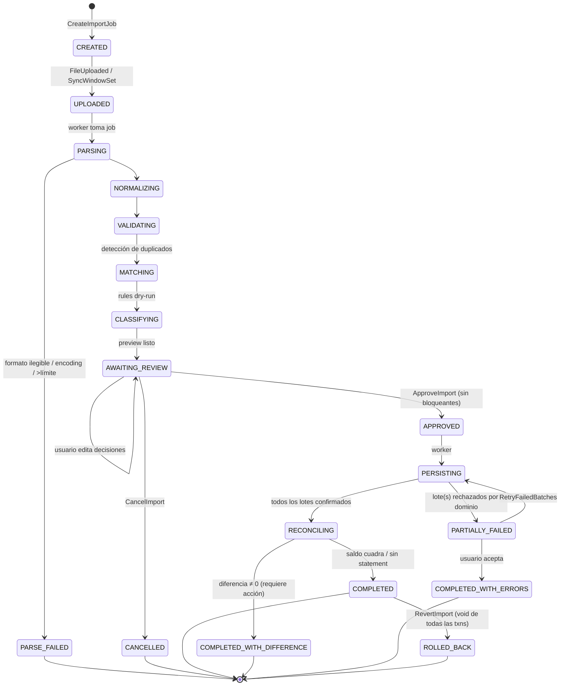
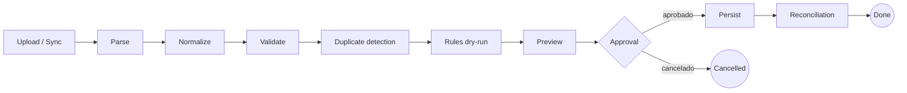
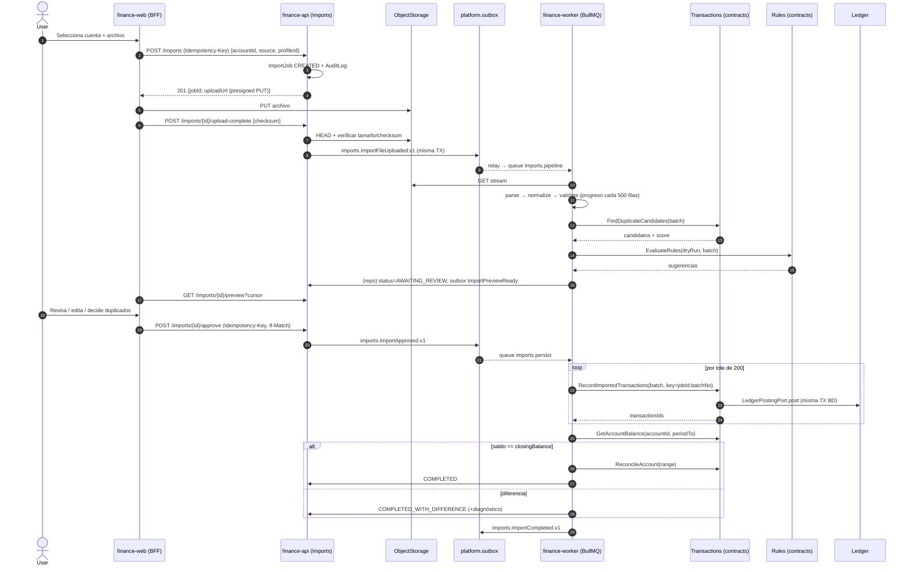
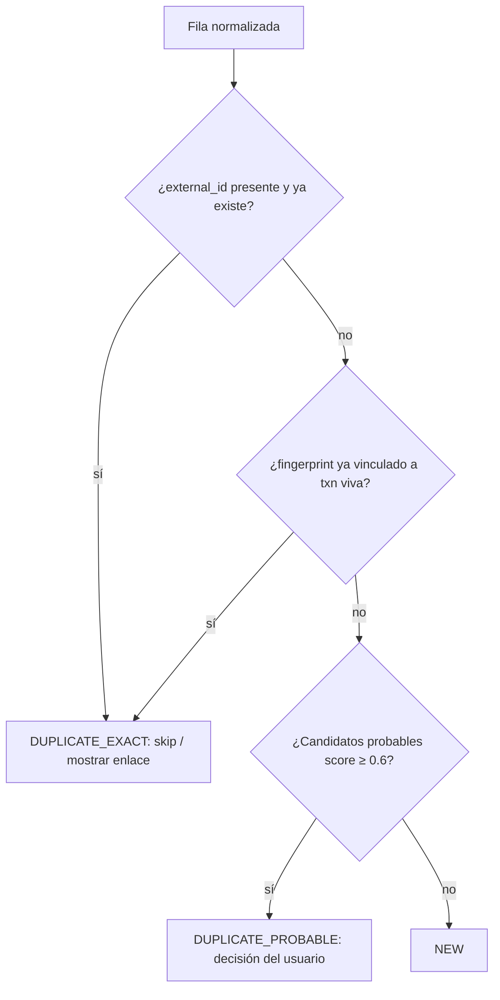

# 13 — Arquitectura de Imports & Banking Integrations

> **Estado:** Propuesto · **Fecha:** 2026-10-01 · **Relacionado:** [ARCHITECTURE.md](ARCHITECTURE.md) (§3, §4, §7, §9, §13), [05-bounded-contexts.md](05-bounded-contexts.md), [09-ledger-design.md](09-ledger-design.md), [08-data-model.md](08-data-model.md), [10-api-design.md](10-api-design.md), [12-security.md](12-security.md), [14-reporting.md](14-reporting.md), [16-testing-strategy.md](16-testing-strategy.md), [18-observability.md](18-observability.md), ADR-0008 (outbox), ADR-0009 (object storage), ADR-0016 (testing)
>
> **Contexto:** `IMPORTS` · schema `imports` · paquete `@pf/imports` · **Phase 6** (pipeline completo). CSV básico puede adelantarse a **Phase 3** (Could, ARCHITECTURE §13.5).
> **Capabilities OpenSpec:** `imports/import-pipeline`, `imports/banking-providers` (apoyadas en `transactions/duplicate-detection`, `transactions/reconciliation`, `rules/rule-engine`, `security/file-upload-security`).

---

## 1. Propósito y límites

El contexto Imports convierte **fuentes externas** (archivos de extracto, APIs bancarias, agregadores, exchanges cripto) en **transacciones del dominio** de forma **segura, idempotente, auditable y revisable por el usuario**.

Imports **NO**:

- escribe en el ledger (`ledger` schema) ni en `txn` directamente: crea transacciones exclusivamente vía la **API pública de Transactions** (`@pf/transactions/contracts`, comando `RecordImportedTransactions`), que a su vez usa `LedgerPostingPort` en la misma transacción BD (ARCHITECTURE §7);
- decide la clasificación definitiva: **propone** (rules dry-run + sugerencias) y el usuario aprueba;
- es dueño de la detección de duplicados ni de la reconciliación: esas capabilities pertenecen a **Transactions** (`transactions/duplicate-detection`, `transactions/reconciliation`). Imports las **invoca** vía queries/commands públicos y guarda el resultado en su staging;
- es dueño de los archivos: el binario vive en Object Storage y su metadato como `Document` del contexto **Documents** (Phase 6) — Imports guarda la referencia `document_id` + checksum.

| Responsabilidad | Dueño | Cómo lo usa Imports |
|---|---|---|
| Staging de filas, perfiles de mapeo, estado del job | `IMPORTS` | Propio (schema `imports`) |
| Crear transacciones (incl. transfers, conversions) | `TRANSACTIONS` | Command público `RecordImportedTransactions` (batch) |
| Postings / balances | `LEDGER` | Indirecto (a través de Transactions) |
| Matching de duplicados / reconciliación | `TRANSACTIONS` | Query `FindDuplicateCandidates`, command `ReconcileAccount` |
| Reglas de clasificación | `RULES` | Query `EvaluateRules` (dry-run, sin efectos) |
| Categorías, counterparties | `CLASSIFICATION` | Queries `ResolveCounterparty`, `ListCategories` |
| Cuentas, instituciones | `ACCOUNTS` | Query `GetAccount`, `GetInstitution` |
| Tasas de referencia (exchange trades) | `FX` | Query `GetReferenceRate` (solo para metadatos) |
| Archivo original | `DOCUMENTS` + `ObjectStorage` | `RegisterDocument`, presigned upload |
| Bitácora | `AUDIT` | `AuditLog` en la misma transacción de cada comando mutante |

## 2. Lenguaje ubicuo

| Término | Definición |
|---|---|
| **ImportSource** | Origen lógico: `FILE_CSV`, `FILE_OFX`, `FILE_QIF`, `FILE_JSON`, `FILE_XLS` (futuro), `FILE_PDF` (futuro OCR), `BANK_API`, `AGGREGATOR_API`, `EXCHANGE_API`, `MANUAL_PASTE`. |
| **ImportJob** | Agregado raíz que representa una ejecución de importación sobre **una cuenta destino** (o un conjunto declarado de cuentas para exchanges). |
| **RawRecord** | Fila/registro tal como fue leído (strings), con número de línea y hash del contenido crudo. |
| **StagedTransaction** | Registro normalizado (Money, fecha de negocio, descripción limpia, external id) con resultados de validación, duplicados, reglas y decisión del usuario. Vive solo en `imports`. |
| **MappingProfile** | Perfil reutilizable de mapeo de columnas/formato por **institución** (y opcionalmente por cuenta), versionado. |
| **RowFingerprint** | Hash determinista del registro normalizado (ver §7.2). |
| **FileChecksum** | SHA-256 del binario subido. |
| **Connection** | Vínculo con un proveedor API (Plaid, regional, exchange) con credenciales/token **referenciadas** desde un secret store, nunca en claro en `imports`. |
| **StatementBalance** | Saldo de apertura/cierre declarado por el extracto (si existe), usado para reconciliar. |

## 3. Agregado `ImportJob`

### 3.1 Estructura

```
ImportJob (aggregate root, schema imports)
├─ id: UUIDv7, workspaceId, version
├─ source: ImportSource
├─ targetAccountId: AccountId            # cuenta del usuario (Accounts)
├─ institutionId?: InstitutionId
├─ mappingProfileId? + mappingProfileVersion?
├─ fileRef?: { documentId, objectKey, checksumSha256, sizeBytes, mediaType, originalName }
├─ connectionId? + syncWindow?: { from: date, to: date }
├─ locale: { decimalSeparator, thousandsSeparator, dateFormat, encoding, timezone }
├─ statement?: { openingBalance?: Money, closingBalance?: Money, periodFrom?, periodTo? }
├─ status: ImportJobStatus
├─ counters: { total, parsed, invalid, duplicatesExact, duplicatesProbable, toCreate, skipped, created }
├─ progress: { stage, processed, total, updatedAt }
├─ errors: ImportError[]  (stage, code, rowNumber?, message — sin datos sensibles)
├─ approvedBy?, approvedAt?
├─ resultingTransactionIds (via staged rows)
└─ createdBy, createdAt, completedAt?
```

`StagedTransaction` es una **entidad interna** del agregado, pero por volumen se persiste en tabla propia (`imports.staged_transaction`) y se carga paginada; las invariantes de agregado que necesitan todas las filas (p. ej. "no aprobar si hay filas inválidas sin decisión") se validan con queries agregadas dentro de la misma transacción con `version` del job (optimistic locking).

### 3.2 Máquina de estados



Reglas:

- Transiciones de etapa técnica (`PARSING → … → AWAITING_REVIEW`) las ejecuta el **worker**; las de decisión (`APPROVED`, `CANCELLED`, `RevertImport`) las ejecuta un **usuario** con rol `OWNER` o `EDITOR`.
- `RevertImport` no borra nada: emite `void` (= entry de reversa, ARCHITECTURE §4.1) de cada transacción creada por el job vía Transactions. Si alguna transacción ya está `reconciled` o en periodo `closed`, el revert se rechaza para esa fila (`IMPORT_REVERT_BLOCKED`) y se informa.
- Un job en `AWAITING_REVIEW` expira tras **30 días** (configurable) → `CANCELLED` automático; el archivo se conserva según la política de retención de Documents.
- Todo cambio de estado emite evento de dominio vía outbox.

### 3.3 Eventos de dominio (envelope estándar ARCHITECTURE §7)

| Evento | Cuándo | Consumidores |
|---|---|---|
| `imports.ImportJobCreated.v1` | Job creado | Audit |
| `imports.ImportFileUploaded.v1` | Archivo validado y almacenado | Worker (inicia pipeline) |
| `imports.ImportPreviewReady.v1` | Fin de clasificación | Notifications ("tu import está listo para revisar") |
| `imports.ImportFailed.v1` | `PARSE_FAILED` / errores fatales | Notifications, métricas |
| `imports.ImportApproved.v1` | Usuario aprueba | Worker (persistencia) |
| `imports.ImportCompleted.v1` | Fin (cualquier `COMPLETED*`) | Reporting (invalidación), Notifications, Rules (post-import async si aplica) |
| `imports.ImportReverted.v1` | Revert | Reporting, Audit |

Las transacciones creadas emiten sus propios eventos (`transactions.TransactionPosted.v1` con `origin = IMPORT`, `importJobId`) — Reporting no necesita escuchar Imports para sus números.

## 4. Pipeline



### 4.1 Tabla de etapas

| # | Etapa | Responsabilidad | Puertos (application) | Fallos y manejo |
|---|---|---|---|---|
| 1 | **Upload** | Recibir el archivo vía **presigned PUT** a Object Storage (bucket `imports-raw`, key `ws/{workspaceId}/imports/{jobId}/{uuid}`), validar tamaño, media type por magic bytes (no por extensión), calcular SHA-256, escaneo antimalware (cuando exista, ver 12-security.md). Para APIs: fijar `syncWindow`. | `ObjectStorage`, `FileScanner`, `DocumentRegistryPort` | Archivo > límite → `IMPORT_FILE_TOO_LARGE`. Media type no soportado → `IMPORT_UNSUPPORTED_FORMAT`. Checksum ya importado en la misma cuenta → advertencia `IMPORT_FILE_ALREADY_IMPORTED` (no bloqueante, ver §7.1). |
| 2 | **Parse** | Leer **en streaming** y producir `RawRecord[]` (strings + nº de línea). Detectar encoding y delimitador. Extraer `StatementBalance` si el formato lo trae (OFX `LEDGERBAL`, cabeceras de CSV). | `FileParser` (adapter por formato), `EncodingDetector` | Error estructural (OFX inválido, CSV sin cabecera esperada) → `PARSE_FAILED` con línea y causa. Filas sueltas mal formadas → `RawRecord` marcado `parseError`, el job continúa. |
| 3 | **Normalize** | Aplicar `MappingProfile`: columnas → campos; parseo de **decimales con coma**, miles, signos (columna débito/crédito vs columna única con signo, sufijo `-`, paréntesis `(1.234,56)`); **fechas** `dd/mm/yyyy` y variantes; timezone del workspace; limpieza de descripción (trim, colapsar espacios, quitar prefijos bancarios conocidos como `POS `, `COMPRA `, nº de tarjeta enmascarado); `Money` con `currency.scale` del destino. Calcular `RowFingerprint`. | `MappingProfileRepository`, `CurrencyCatalogPort`, `Clock` | Valor no parseable → fila `INVALID` con código (`IMPORT_INVALID_AMOUNT`, `IMPORT_INVALID_DATE`, `IMPORT_AMBIGUOUS_DATE`). **Nunca** se usa `number`: el parser produce string → `Decimal`. |
| 4 | **Validate** | Reglas de negocio: moneda de la fila = moneda de la cuenta (o fila de conversión explícita); escala válida; fecha no futura más allá de tolerancia (+3 días); fecha no en periodo `closed` (se marca `REQUIRES_PERIOD_REOPEN`, bloqueante para esa fila); monto ≠ 0; duplicado **intra-archivo** por fingerprint. | `PeriodStatusPort` (Planning), `AccountsQueryPort` | Filas inválidas quedan en staging con motivo; el usuario puede corregir, excluir o reintentar. |
| 5 | **Duplicate detection** | (a) Exacto contra imports previos: `external_id` o `RowFingerprint` ya vinculado a una transacción viva → `DUPLICATE_EXACT` (skip por defecto). (b) Probable contra **transacciones manuales** u otros orígenes: heurística con score (§8) → `DUPLICATE_PROBABLE` con candidato(s). | `DuplicateDetectionPort` → `@pf/transactions/contracts` `FindDuplicateCandidates` | Si Transactions no responde (no debería: misma app) → etapa reintentable por BullMQ; nunca se omite. |
| 6 | **Rules (dry-run)** | Evaluar reglas del workspace sobre cada fila **sin efectos**: categoría, counterparty, tags, split, marcar como transfer (p. ej. "PAGO TARJETA" → transfer a cuenta LIABILITY), ignorar. Resolver counterparty por alias. Guardar `suggestion` + `ruleId` + `ruleVersion`. | `RulesEvaluationPort` → `@pf/rules/contracts` `EvaluateRules(dryRun=true)`, `CounterpartyResolverPort` | Regla con error → fila sin sugerencia + warning; no bloquea. |
| 7 | **Preview** | Exponer al usuario el staging paginado con filtros (`new`, `duplicate_exact`, `duplicate_probable`, `invalid`, `needs_category`), totales por moneda, saldo resultante proyectado y diferencia contra `StatementBalance`. Permitir editar fila (categoría, descripción, fecha, marcar transfer y elegir cuenta contraparte, merge con duplicado, excluir). | Query `GetImportPreview` | Ediciones concurrentes → `If-Match`/`version` (412). |
| 8 | **Approval** | Comando `ApproveImport` (Idempotency-Key). Precondiciones: sin filas `INVALID` ni `DUPLICATE_PROBABLE` **sin decisión**; sin filas en periodo cerrado no resueltas. Registra `AuditLog`. | `ImportJobRepository`, `AuditPort` | Precondición fallida → `409 IMPORT_REVIEW_INCOMPLETE` con conteos. |
| 9 | **Persist** | Worker envía filas aprobadas en **lotes de 200** a `RecordImportedTransactions`. Cada lote = 1 transacción BD: txns + postings + audit + outbox + vínculo `staged_row → transaction_id`. Estado inicial de las txns: `cleared` (vienen de un extracto) o `posted` si el origen no confirma liquidación; pendientes del banco (`pending=true` en API) → `pending` (sin ledger). | `TransactionsCommandPort` | Lote rechazado por dominio (p. ej. `PERIOD_CLOSED` aparecido entre preview y persist) → lote marcado `FAILED`, otros lotes continúan → `PARTIALLY_FAILED`. Reintento idempotente por `(jobId, batchNo)` como Idempotency-Key. |
| 10 | **Reconciliation** | Si hay `StatementBalance`: comparar saldo ledger de la cuenta al `periodTo` vs `closingBalance`. Diferencia 0 → ofrecer marcar txns del rango como `reconciled` (comando de Transactions). Diferencia ≠ 0 → `COMPLETED_WITH_DIFFERENCE` con diagnóstico (§9). | `ReconciliationPort` → `ReconcileAccount`, `LedgerBalanceQuery` (vía Transactions/Ledger contracts) | Nunca se crea un ajuste automático: el ajuste (`EQUITY:ADJUSTMENTS`) requiere confirmación explícita del usuario. |

### 4.2 Diagrama de secuencia (archivo CSV)



## 5. Adapters de entrada (parsers)

Puerto de application:

```ts
// ilustrativo — @pf/imports/application/ports
interface FileParser {
  readonly format: 'CSV' | 'OFX' | 'QIF' | 'JSON' | 'XLSX' | 'PDF';
  sniff(head: Uint8Array): SniffResult;                 // ¿es mi formato? encoding/delimitador sugeridos
  parse(stream: ReadableStream<Uint8Array>, opts: ParseOptions): AsyncIterable<RawRecord | ParseIssue>;
  extractStatement?(): StatementBalance | undefined;
}
```

| Adapter | Fase | Notas |
|---|---|---|
| **CSV** | 3 (Could) / 6 | Streaming (`csv-parse` o equivalente), delimitador `,` `;` `\t` `|` autodetectado, comillas RFC 4180, BOM UTF-8, filas de cabecera/pie a saltar (`skipHeaderRows`, `skipFooterRows`) frecuentes en extractos bolivianos. Mapeo vía `MappingProfile`. |
| **XLS/XLSX** | 6 | Muchos bancos bolivianos exportan Excel. Se lee la hoja indicada en el perfil y se trata como CSV (mismo `MappingProfile`). Celdas numéricas nativas se leen como string del valor **sin** pasar por float cuando la librería lo permita; si no, se redondea a la escala de la moneda y se marca en el test golden. |
| **OFX/QFX** | 6 | SGML (1.x) y XML (2.x). `FITID` → `external_id`. `LEDGERBAL`/`AVAILBAL` → `StatementBalance`. `DTPOSTED` con offset → fecha de negocio en TZ del workspace. |
| **QIF** | 6 | Sin ids externos (solo fingerprint). Formato de fecha ambiguo (`D1/2'26`) → requiere perfil. Tipos `!Type:Bank`, `!Type:CCard`. Splits `S/$`. |
| **JSON** | 6 | Esquema propio documentado (`contracts/imports/import-file.v1.schema.json`) para exportaciones de otras apps / migración desde planillas del owner. Validado con JSON Schema antes de normalizar. |
| **PDF** | Futuro (post-Phase 9) | Ver §6.3 — OCR/extracción tabular. No en alcance. |
| **Manual paste** | 6 (Could) | Pegar desde portapapeles una tabla → tratado como CSV con tab. |

### 5.1 `MappingProfile` (por institución)

```yaml
# ilustrativo
id: 01J...                 # UUIDv7
workspaceId: ...
institutionId: banco-x     # Accounts.Institution
accountId: null            # opcional: perfil específico de una cuenta
name: "Banco X — extracto cuenta corriente (XLSX)"
version: 3                 # inmutable por versión; jobs referencian (id, version)
format: CSV | XLSX
sheet: "Movimientos"
encoding: windows-1252     # o auto
delimiter: ";"
skipHeaderRows: 7
skipFooterRows: 2
headerRow: true
columns:
  date:         { source: "Fecha", format: "dd/MM/yyyy" }
  valueDate:    { source: "Fecha Valor", format: "dd/MM/yyyy", optional: true }
  description:  { source: ["Descripción", "Glosa"], join: " " }
  reference:    { source: "Nro. Doc.", role: externalId }
  amount:       { mode: DEBIT_CREDIT, debit: "Débito", credit: "Crédito" }   # o SIGNED: {source: "Monto"}
  balance:      { source: "Saldo", optional: true }                          # saldo corrido → reconciliación por fila
  currency:     { fixed: BOB }
numberFormat: { decimal: ",", thousands: ".", negativePattern: ["-n", "(n)", "n-"] }
signConvention: BANK_PERSPECTIVE   # crédito del banco = ingreso a la cuenta del usuario
descriptionCleanup: [ "^POS\\s+", "\\s{2,}→ " ]
```

- Se **auto-sugiere** el perfil por institución + `sniff` de cabeceras (similaridad de nombres de columna). Si ningún perfil coincide, la UI ofrece un **asistente de mapeo** con vista previa de las primeras 20 filas; al confirmar se guarda como nueva versión.
- Editar un perfil crea una **nueva versión**; jobs históricos conservan la versión usada (reproducibilidad).
- Perfiles "de comunidad" (plantillas predefinidas para bancos bolivianos comunes) pueden distribuirse como seeds; quedan copiados al workspace (no compartidos mutables).
- **Saldo corrido** (`balance` por fila): si existe, se verifica la continuidad `saldo[i] = saldo[i-1] + monto[i]`; una ruptura indica fila faltante/duplicada en el extracto → warning con la fila exacta.

## 6. `BankingProvider` (APIs) y adapters

### 6.1 Puerto

```ts
// ilustrativo
interface BankingProvider {
  readonly id: 'MANUAL' | 'CSV' | 'OFX' | 'PLAID' | 'BELVO' | 'EXCHANGE_BINANCE' | string;
  readonly capabilities: { accounts: boolean; transactions: boolean; balances: boolean; pending: boolean; webhooks: boolean };
  listAccounts(conn: ConnectionRef): Promise<ExternalAccount[]>;
  fetchTransactions(conn: ConnectionRef, window: { from: LocalDate; to: LocalDate }, cursor?: string)
    : AsyncIterable<ExternalTransaction>;              // incluye externalId estable y flag pending
  fetchBalances?(conn: ConnectionRef): Promise<ExternalBalance[]>;
  refreshConnection?(conn: ConnectionRef): Promise<ConnectionStatus>;
}
```

- `ConnectionRef` contiene un **secretRef** (ARN/ID en secret store o tabla cifrada con KMS), nunca tokens en `imports`. El adapter resuelve el secreto en runtime.
- Cada adapter API produce los mismos `RawRecord` que un archivo → **reutiliza el pipeline desde Normalize**. Un sync API también genera un `ImportJob` (source `BANK_API` etc.) y, por defecto, también pasa por **preview** (configurable a "auto-approve si 0 duplicados probables y 0 inválidos" en Phase 6+, opt-in por conexión).
- Webhooks del proveedor (cuando existan) solo **encolan** un sync; nunca escriben datos directamente.

### 6.2 Adapters

| Adapter | Tipo | Fase | Observaciones |
|---|---|---|---|
| `ManualProvider` | Null-object | 1 | Cuentas sin integración: todo se registra a mano. Es el default. |
| `CsvProvider` / `OfxProvider` | Archivo | 3/6 | Envuelven los `FileParser`. |
| `PlaidProvider` | Aggregator API | Futuro (≥6, Won't por ahora) | No cubre Bolivia. Incluido para demostrar el puerto y por si el usuario tiene cuentas en EE. UU. `transaction_id` → externalId; `pending_transaction_id` para reemplazar pendientes. |
| Regional (p. ej. Belvo u otros LatAm) | Aggregator API | Futuro | Cobertura de Bolivia **a confirmar**; no se asume. |
| `ExchangeProvider` (p. ej. Binance, otros) | Exchange API | 6 (Could) | Historial de **trades, P2P orders, depósitos, retiros, fees**. API keys **read-only** (se valida que la key no tenga permisos de trading/retiro; si los tiene, se rechaza). |
| Bank API directa | Bank API | Futuro | Solo si un banco local publica API; adapter específico. |

### 6.3 Realidad Bolivia

- La mayoría de bancos bolivianos **no ofrece APIs abiertas** ni agregadores con cobertura confiable. Formatos reales: **CSV/XLS(X)** desde banca en línea y **PDF** de extractos mensuales.
- Por eso el diseño prioriza: (1) **ingreso manual rápido** (Phase 1), (2) **CSV/XLSX con perfiles por institución** (Phase 3/6), (3) exchange APIs para USDT/P2P (Phase 6 Could), (4) **PDF extraction como feature futura de OCR** (puerto `DocumentExtractor`, posible uso de extracción tabular local o servicio externo con consentimiento; fuera de roadmap actual).
- Extractos P2P de USDT suelen venir como capturas o chats: no se importan; se registran como **conversión manual** (ver 28-ui-ux-design-system.md, flujo USDT→BOB).

### 6.4 Exchange API → transacciones de dominio

| Registro exchange | Transacción resultante (Transactions) | Ledger (resumen, ARCHITECTURE §4.2) |
|---|---|---|
| Trade spot `BTC/USDT` | `Conversion` USDT→BTC con fee en la moneda cobrada | patas por moneda vía `EQUITY:FX_TRADING:<CCY>`, fee a `EXPENSE:<CCY>` categoría *Fees* |
| Orden P2P USDT→BOB | `Conversion` (si el exchange registra ambas patas) o solo salida USDT + transfer pendiente de matching con depósito bancario BOB | `ConversionDetail` con quoted/effective rate del exchange |
| Depósito/retiro on-chain | `Transfer` entre wallet y exchange (matching por txid/monto) o income/expense si no hay contraparte conocida | Fee de red → `EXPENSE` *Fees* |
| Interés/staking reward | Income categoría de sistema *Crypto rewards* | `INCOME:<CCY>` |

El `ExchangeProvider` guarda en `ConversionDetail` el rate y fees **tal como los reporta el exchange** (inmutables); FX context solo aporta la tasa de referencia del día para comparativas (spread).

## 7. Idempotencia

Tres niveles complementarios:

### 7.1 Nivel archivo — `FileChecksum`

- `SHA-256` del binario. Índice `imports.import_job (workspace_id, target_account_id, file_checksum)` **no único** (permitimos reimportar adrede), pero al detectar coincidencia con un job `COMPLETED*` se advierte: "Este archivo ya fue importado el 2026-09-12 (job …). Las filas idénticas se omitirán." El usuario puede continuar: el nivel de fila garantiza que no se dupliquen.

### 7.2 Nivel fila — `RowFingerprint`

```
fingerprint = SHA-256( canonical_json([
   workspaceId,
   targetAccountId,
   bookingDate (YYYY-MM-DD),
   amount (Decimal normalizado a la escala de la moneda, string, signo incluido, sin separadores),
   currency,
   descriptionNormalized (NFKC, lower, sin acentos, espacios colapsados, sin dígitos de tarjeta enmascarada),
   externalId ?? "",
   occurrenceIndex
]))
```

- `occurrenceIndex`: ordinal de la fila **entre filas con la misma tupla** (fecha, monto, descripción) dentro de la misma fuente y día. Resuelve el caso legítimo de **dos compras idénticas el mismo día** (dos cafés de 15,00 BOB): la primera tiene índice 0, la segunda 1. En un reimport del mismo rango, se recalcula igual y coincide.
- Persistido en `imports.row_link (workspace_id, account_id, fingerprint) UNIQUE → transaction_id`. Si la transacción vinculada se anula (`void`), el link se marca `superseded` y deja de bloquear.

### 7.3 Nivel proveedor — `external_id`

- Cuando la fuente provee id estable (OFX `FITID`, Plaid `transaction_id`, trade id del exchange, nº de documento bancario fiable): `UNIQUE (workspace_id, account_id, source_namespace, external_id)` en `txn` (propiedad de Transactions; Imports pasa `externalRef = {namespace, id}` en el comando).
- `source_namespace` = `institutionId:format` o `providerId`, porque distintos bancos reutilizan ids.
- Si el proveedor reemplaza un `pending` por un `posted` con otro id (`pending_transaction_id`), el adapter emite una **actualización** (Transactions: `ConfirmPendingTransaction`) en lugar de una nueva fila.

### 7.4 Reimport de rangos solapados



- Importar "septiembre completo" tras haber importado "1–15 de septiembre" → las filas 1–15 salen `DUPLICATE_EXACT` y solo las nuevas se crean.
- Si el banco **cambia la descripción** entre exportaciones (ocurre: glosas truncadas), el fingerprint difiere → cae en heurística probable con score alto (misma cuenta, fecha, monto) → el usuario confirma. El sistema **aprende** guardando el par como alias (`row_link` adicional) para no preguntar de nuevo.
- Idempotencia de comandos HTTP: `Idempotency-Key` obligatorio en `POST /imports`, `/approve`, `/revert` (ARCHITECTURE §8).
- Idempotencia de jobs: jobId de BullMQ = `importJobId:stage[:batchNo]`; handlers comprueban estado antes de actuar (si el job ya pasó la etapa, no-op).

## 8. Detección de duplicados (heurística con confianza)

Implementada en **Transactions** (`transactions/duplicate-detection`); aquí se documenta el contrato que Imports consume.

### 8.1 Candidatos

Búsqueda en la **misma cuenta**, transacciones no anuladas con `|bookingDate − d| ≤ 3 días` (configurable; 5 para tarjetas de crédito por diferencia fecha de compra/fecha de proceso) y monto igual o dentro de tolerancia por FX (para cuentas multi-moneda/tarjeta en USD cobrada en BOB: ±2 %).

### 8.2 Score

```
score = 0.40·S_amount + 0.25·S_date + 0.20·S_desc + 0.10·S_counterparty + 0.05·S_origin
```

| Señal | Cálculo |
|---|---|
| `S_amount` | 1 si monto exacto; 1 − |Δ|/(tolerancia·|monto|) dentro de tolerancia; 0 fuera |
| `S_date` | 1 mismo día; 0.8 ±1; 0.5 ±2; 0.3 ±3; 0 más allá |
| `S_desc` | similitud trigram/Jaro-Winkler sobre descripciones normalizadas (0..1). Si la manual no tiene descripción: 0.5 neutro |
| `S_counterparty` | 1 si la counterparty resuelta por reglas/alias coincide con la de la manual; 0.5 desconocida; 0 distinta |
| `S_origin` | 1 si el candidato es **manual** sin `external_id` (caso típico: el usuario la cargó a mano antes del extracto); 0 si ya proviene de otro import con otro external_id (menos probable que sea la misma) |

Umbrales (configurables por workspace):

| Score | Clasificación | Acción por defecto |
|---|---|---|
| ≥ 0.90 y candidato único | `DUPLICATE_PROBABLE_HIGH` | Pre-seleccionado "**Fusionar**" (vincular la fila a la txn manual, enriqueciéndola con external_id y estado `cleared`), editable |
| 0.60 – 0.89 | `DUPLICATE_PROBABLE` | Sin pre-selección: el usuario decide **Fusionar / Crear nueva / Omitir** |
| < 0.60 | `NEW` | Crear |

- **Fusionar** no crea transacción nueva: emite `LinkImportedRecord` en Transactions (agrega external ref, actualiza estado `posted → cleared`; si el monto difiere —p. ej. propina— genera corrección vía reversa+nueva entry, nunca UPDATE de postings).
- Un candidato solo puede emparejarse con **una** fila (asignación greedy por score descendente, determinista por id para empates).
- Métrica de calidad: tasa de "fusiones deshechas" por usuario → ajuste de pesos (backlog).

## 9. Reconciliación contra extracto

Pertenece a Transactions (`transactions/reconciliation`); Imports aporta el `StatementBalance` y dispara.

```
expected_closing = ledger_balance(account, at = periodTo, states = posted|cleared|reconciled)
difference       = statement.closingBalance − expected_closing
```

- `difference = 0` → propuesta "Marcar N transacciones del {periodFrom}–{periodTo} como **reconciled**" (bloquea su edición casual; editar una reconciled requiere des-reconciliar, auditado).
- `difference ≠ 0` → diagnóstico asistido:
  1. Verificar `openingBalance` vs saldo ledger al día anterior a `periodFrom` (si difiere, el problema es anterior al extracto).
  2. Listar filas del extracto omitidas como duplicado/excluidas y txns manuales del rango **sin** contraparte en el extracto (candidatas a sobrar).
  3. Ruptura de saldo corrido (§5.1).
  4. Txns `pending` que el banco ya liquidó.
  5. Opción final, explícita: **ajuste** a `EQUITY:ADJUSTMENTS:<CCY>` con motivo obligatorio (auditado). Nunca automático.
- Para tarjetas de crédito (LIABILITY) la comparación usa el signo de la cuenta (saldo adeudado positivo en UI, negativo en ledger; ver 09-ledger-design.md).

## 10. Workers (BullMQ) y progreso

| Cola | Job | Concurrencia | Reintentos | Timeout |
|---|---|---|---|---|
| `imports.pipeline` | Upload→Preview de un job | 2 por worker (CPU-bound parse) | 3, backoff exponencial 10 s → 5 min | 10 min |
| `imports.persist` | Un lote de persistencia | 1 por `importJobId` (grupo/lock), 4 global | 5 (errores transitorios); errores de dominio **no** se reintentan | 2 min |
| `imports.sync` | Sync de una `Connection` API | 1 por conexión | 5 con backoff; respeta `Retry-After` / rate limit del proveedor | 15 min |
| `imports.scheduled-sync` | Repeatable (cron) por conexión | — | — | — |
| `imports.expire-reviews` | Diario: cancela jobs `AWAITING_REVIEW` vencidos | 1 | 3 | 5 min |

- **Disparo:** eventos outbox (`ImportFileUploaded`, `ImportApproved`) → relay → BullMQ (ADR-0008). El inbox (`platform.inbox`) evita doble procesamiento.
- **Progreso:** el worker actualiza `import_job.progress` cada **500 filas o 2 s** (lo que ocurra último) y publica `job.updateProgress()` en BullMQ. La UI hace **polling** a `GET /imports/{id}` cada 2 s con ETag (304 si no cambió); SSE (`/imports/{id}/events`) es mejora opcional posterior.
- **Cancelación:** `CancelImport` durante `PARSING..CLASSIFYING` marca flag; el worker lo verifica entre chunks y termina limpio.
- **Graceful shutdown:** el worker termina el chunk actual, persiste progreso y libera el lock; la etapa se reanuda desde el último checkpoint (`lastProcessedRow`).
- Errores de dominio (no transitorios) se registran en `errors[]` y en métricas, **no** van a DLQ; errores inesperados tras agotar reintentos → estado `FAILED` técnico + alerta (ver 18-observability.md).

## 11. Archivos grandes

- **Límites por defecto:** 20 MB por archivo, 100 000 filas por job (configurables). Archivos mayores → sugerencia de dividir por rango de fechas.
- **Streaming end-to-end:** GET de S3 como stream → parser incremental → normalización por **chunks de 1 000 filas** → `INSERT … ON CONFLICT DO NOTHING` en staging por chunk (Kysely, multi-row). Memoria acotada (objetivo < 150 MB RSS por job de 100k filas).
- Detección de duplicados por chunk con consulta set-based (`unnest` de fingerprints) en lugar de N consultas.
- Preview paginado por cursor; totales calculados con agregados SQL sobre staging (no en memoria).
- Persistencia por lotes (200) para mantener transacciones BD cortas y no bloquear el ledger; las invariantes del ledger se validan por entry.
- Staging purgado (filas `staged_transaction`) **90 días** después de `COMPLETED` (los `row_link` y el job se conservan; el archivo según retención de Documents). Esto no es borrado de datos financieros: el staging es dato técnico derivado.

## 12. Encoding y locale

| Aspecto | Regla |
|---|---|
| Encoding | Detección: BOM → UTF-8/UTF-16; si no, heurística (validación UTF-8 estricta; fallback `windows-1252`/`ISO-8859-1`, frecuentes en exportes bancarios en español). El perfil puede fijarlo. Se normaliza a UTF-8 NFC. Caracteres de reemplazo (`�`) → warning en la fila. |
| Decimales | Perfil define `decimal` y `thousands`. Por defecto para `es-BO`: decimal `,`, miles `.`. Detección asistida: si una columna tiene valores como `1.234,56` y `12,5`, se infiere coma decimal. Valores ambiguos (`1.234` sin decimales) → resolver con el perfil; si no hay perfil, **bloquear** la fila (`IMPORT_AMBIGUOUS_NUMBER`) en vez de adivinar. |
| Negativos | `-1.234,56`, `1.234,56-`, `(1.234,56)`, columnas Débito/Crédito separadas, indicador `D/C`. |
| Fechas | `dd/MM/yyyy` por defecto, `dd-MM-yyyy`, `dd/MM/yy` (pivot 2000–2099), `yyyy-MM-dd`, OFX `yyyyMMddHHmmss[offset]`. Fechas ambiguas (`03/04/2026`) **nunca** se resuelven por heurística silenciosa: el perfil manda; sin perfil, se analiza la columna completa (si algún valor tiene primer campo > 12 → dd/MM). Si sigue ambiguo → el usuario elige en el asistente. |
| Timezone | Instantes con hora se convierten a **fecha de negocio** en la TZ del workspace (`America/La_Paz` por defecto). Fechas sin hora se toman literales. |
| Monedas | Columna de moneda opcional; códigos locales (`Bs`, `Bs.`, `$us`, `USD`) mapeados a ISO (`BOB`, `USD`) por tabla de alias. |

## 13. Seguridad y auditoría

- Upload solo por presigned URL con expiración 10 min, `Content-Length` máximo y content-type fijado; bucket privado, SSE habilitado. Ver 12-security.md (`security/file-upload-security`).
- Prohibido ejecutar macros o fórmulas: XLSX se lee como datos; **CSV injection**: al **exportar** de vuelta cualquier texto importado que empiece con `= + - @` se escapa (relevante para 14-reporting.md exports).
- Las descripciones importadas son **datos no confiables**: se escapan en UI y se marcan como tales para el asistente IA (riesgo de prompt injection, ver 27-ai-assistant-roadmap.md).
- `AuditLog` (misma transacción) para: crear job, aprobar, cancelar, revertir, fusionar duplicado, crear ajuste de reconciliación, crear/editar MappingProfile, crear/revocar Connection.
- Logs: nunca montos ni descripciones completas en logs (ver 18-observability.md §3); solo `importJobId`, conteos, códigos de error, nº de fila.
- Credenciales de proveedores: secret store; rotación; API keys de exchange read-only verificadas.
- RLS en todas las tablas `imports.*` (`workspace_id`).

## 14. Modelo de datos (resumen; detalle en 08-data-model.md)

| Tabla | Clave / índices relevantes |
|---|---|
| `imports.import_job` | PK `id`; `(workspace_id, status)`; `(workspace_id, target_account_id, file_checksum)` |
| `imports.staged_transaction` | PK `id`; `(import_job_id, row_number)` UNIQUE; `(import_job_id, classification)`; `fingerprint` |
| `imports.row_link` | UNIQUE `(workspace_id, account_id, fingerprint)`; `transaction_id`; `status` (`active`/`superseded`) |
| `imports.mapping_profile` | PK `(id, version)`; `(workspace_id, institution_id)` |
| `imports.connection` | PK `id`; `provider`, `secret_ref`, `status`, `last_sync_at`, `sync_cursor` |
| `imports.import_error` | `(import_job_id, stage)` |

## 15. API (resumen; detalle en 10-api-design.md y `contracts/openapi/finance-api.v1.yaml`)

| Método | Ruta | Notas |
|---|---|---|
| POST | `/api/v1/workspaces/{ws}/imports` | Crea job; devuelve presigned URL. `Idempotency-Key`. |
| POST | `/imports/{id}/upload-complete` | Verifica checksum, encola pipeline |
| GET | `/imports/{id}` | Estado + progreso (ETag) |
| GET | `/imports/{id}/preview` | Filas staging paginadas, filtros |
| PATCH | `/imports/{id}/rows/{rowId}` | Decisión/edición de fila (`If-Match`) |
| POST | `/imports/{id}/approve` · `/cancel` · `/revert` · `/retry` | `Idempotency-Key` |
| GET/POST/PUT | `/imports/mapping-profiles[/{id}]` | Versionado |
| GET/POST/DELETE | `/imports/connections[/{id}]` · POST `/{id}/sync` | DELETE = revocar (soft) |

Errores RFC 9457 con códigos `IMPORT_*` (`IMPORT_UNSUPPORTED_FORMAT`, `IMPORT_FILE_TOO_LARGE`, `IMPORT_REVIEW_INCOMPLETE`, `IMPORT_INVALID_STATE_TRANSITION`, `IMPORT_REVERT_BLOCKED`, `IMPORT_AMBIGUOUS_NUMBER`, `IMPORT_AMBIGUOUS_DATE`, `IMPORT_CONNECTION_EXPIRED`).

## 16. Estrategia de testing de imports

Alineada con 16-testing-strategy.md y la cadena de trazabilidad (ARCHITECTURE §12). TC-IDs bajo `tests/cases/imports/` con prefijo `TC-IMPORTS-*`.

### 16.1 Golden files

```
tests/fixtures/imports/
├─ csv/banco-x-cuenta-corriente/
│  ├─ input.csv                 # anonimizado, windows-1252, ; , coma decimal, 7 filas cabecera
│  ├─ profile.yaml              # MappingProfile usado
│  └─ expected.normalized.json  # StagedTransaction[] esperado (montos string, fechas ISO, fingerprint)
├─ xlsx/…, ofx/ofx1-sgml/…, ofx/ofx2-xml/…, qif/…, json/…
├─ exchange/binance-trades/{input.json, expected.transactions.json}
└─ edge/
   ├─ ambiguous-dates.csv      # 03/04 vs 13/04
   ├─ identical-rows-same-day.csv
   ├─ running-balance-gap.csv
   ├─ utf8-bom.csv, utf16le.csv, latin1-accents.csv
   ├─ negatives-parentheses-and-suffix.csv
   └─ huge-100k.csv (generado por script, no versionado)
```

- Test parametrizado: para cada carpeta, `parse + normalize` y **comparación estructural exacta** con `expected.*.json`. Cambiar un expected requiere revisión explícita en PR (snapshot no auto-actualizable en CI).
- Los fixtures se **anonimizan** (script que reemplaza descripciones/ids conservando formato); nunca datos reales en el repo.

### 16.2 Niveles

| Nivel | Qué | Herramientas |
|---|---|---|
| Unit (domain) | Máquina de estados `ImportJob` (transiciones válidas/ inválidas), cálculo de fingerprint, `occurrenceIndex`, scoring de duplicados, parse de números/fechas por locale | Vitest |
| Property-based | `parse(format(x)) == x` para montos con cualquier locale/escala; fingerprint estable ante reordenamiento de filas no idénticas; reimport del mismo archivo ⇒ 0 creaciones; reimport de rango solapado ⇒ creaciones = filas nuevas exactas | fast-check |
| Contract | Adapters `BankingProvider` contra **fixtures grabadas** de APIs (Plaid sandbox / exchange) y suite de contrato común que todo adapter debe pasar | Vitest + nock/MSW |
| Integration | Pipeline completo con PG + Redis + S3 reales: upload → preview → approve → ledger balanceado (Σ postings = 0 por moneda) → reconciliación | Testcontainers |
| Idempotencia/concurrencia | Doble `approve` con misma key; dos workers sobre el mismo job; crash a mitad de persist y reanudación ⇒ sin duplicados | Testcontainers + kill del worker |
| Rendimiento | 100k filas: tiempo hasta preview < 60 s en hardware de referencia, RSS < 150 MB | Script bench (no en cada PR; nightly) |
| E2E | Flujo UI: subir CSV, mapear columnas, resolver probable duplicado, aprobar, ver reconciliación | Playwright |
| Seguridad | Archivo con magic bytes falsos, CSV con fórmulas, zip bomb en XLSX, path traversal en nombre | Integration |

Ejemplos de TC: `TC-IMPORTS-CSV-001` (coma decimal y dd/mm/yyyy), `TC-IMPORTS-IDEMPOTENCY-001` (reimport mismo archivo), `TC-IMPORTS-IDEMPOTENCY-002` (rango solapado), `TC-IMPORTS-DUPLICATE-001` (fusión con manual score ≥ 0.9), `TC-IMPORTS-RECONCILE-001` (diferencia ≠ 0 no crea ajuste automático), `TC-IMPORTS-REVERT-001` (revert = void, no delete).

## 17. Fases

| Fase | Entregable |
|---|---|
| 3 (Could) | CSV básico: un perfil por institución, preview, duplicados exactos por fingerprint, persistencia. Sin reglas (Rules llega en 6), sin reconciliación automática. |
| 6 | Pipeline completo: CSV/XLSX/OFX/QIF/JSON, perfiles versionados, duplicados probables con score, rules dry-run, reconciliación, revert, workers con progreso, ExchangeProvider (Could). |
| Futuro | Aggregators (Plaid/regionales), Bank APIs, PDF/OCR, auto-approve por conexión. |

## Preguntas abiertas

1. ¿Qué bancos bolivianos usa el owner y en qué formato exporta cada uno (CSV, XLS, PDF)? Determina las plantillas de `MappingProfile` iniciales y los golden files.
2. ¿Se adelanta el CSV básico a Phase 3 (Could) o se espera a Phase 6?
3. ARCHITECTURE §7 lista "Rules sobre transacciones importadas" como **asíncrono**; este documento propone además una evaluación **síncrona dry-run** (sin efectos) para el preview. ¿Se acepta, manteniendo la aplicación asíncrona post-commit solo para reglas que no se mostraron en preview?
4. Estado inicial de transacciones importadas: ¿`cleared` por defecto para extractos, o `posted` hasta reconciliar?
5. ¿Qué exchange(s) usa el owner para USDT (Binance P2P u otro)? ¿Hay API con historial P2P disponible para su cuenta?
6. Ventana de tolerancia de fechas para duplicados en tarjetas de crédito (3 vs 5 días) y tolerancia FX (±2 %): validar con datos reales.
7. Retención: ¿90 días de staging y retención indefinida del archivo original son aceptables?
8. ¿Se requiere antivirus (ClamAV) desde Phase 6 o basta validación de magic bytes + límites para uso personal?
9. ¿Auto-approve opcional para conexiones API confiables, o siempre preview obligatorio?
