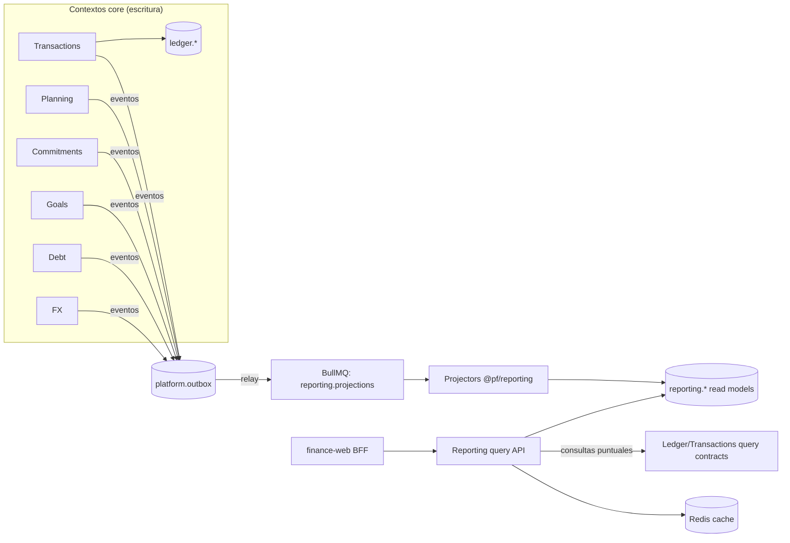

# 14 — Reporting & Analytics

> **Estado:** Propuesto · **Fecha:** 2026-10-01 · **Relacionado:** [ARCHITECTURE.md](ARCHITECTURE.md) (§3, §4, §7, §13), [05-bounded-contexts.md](05-bounded-contexts.md), [11-domain-events.md](11-domain-events.md), [09-ledger-design.md](09-ledger-design.md), [08-data-model.md](08-data-model.md), [10-api-design.md](10-api-design.md), [13-import-architecture.md](13-import-architecture.md), [15-ml-architecture.md](15-ml-architecture.md), [18-observability.md](18-observability.md), [28-ui-ux-design-system.md](28-ui-ux-design-system.md), ADR-0008 (outbox)
>
> **Contexto:** `REPORTING` · schema `reporting` · paquete `@pf/reporting` · **Phase 1** (básico) / **Phase 7** (avanzado).
> **Capabilities OpenSpec:** `reporting/dashboard`, `reporting/financial-reports`, `reporting/net-worth`, `reporting/cash-flow-calendar`.

---

## 1. Principios

1. **El ledger es la fuente de verdad** de montos; Reporting nunca es fuente de verdad. Todo read model es **derivado y reconstruible** desde ledger + eventos.
2. **CQRS**: los comandos viven en los contextos core; Reporting solo **lee** (proyecciones propias en schema `reporting` + queries públicas de otros contextos). Reporting **no escribe** en otros schemas.
3. **Clasificación fuera del ledger** (ARCHITECTURE §4.1): categoría/tags vienen de `TransactionSplit`; recategorizar actualiza la proyección vía evento, no el ledger.
4. **Transferencias y conversiones no son ingreso ni gasto.** Fees de conversión sí son gasto (categoría *Fees*).
5. **Refunds netean** contra la categoría de origen (reducen gasto, no son ingreso).
6. **Multi-moneda explícita**: todo número muestra su moneda; los consolidados declaran tasa y fecha de conversión (§5).
7. **Explicabilidad**: cada KPI tiene fórmula documentada aquí y drill-down hasta las transacciones que lo componen.
8. **Progresivo**: Phase 1 consulta ledger directo con índices; materializaciones se introducen cuando una métrica de latencia lo justifique (§11).

## 2. Arquitectura de lectura (CQRS)



### 2.1 Proyecciones (read models)

| Read model | Grano | Alimentado por | Uso |
|---|---|---|---|
| `reporting.txn_fact` | 1 fila por **split** de transacción con impacto nominal (income/expense) + filas de transfer/conversion marcadas | `transactions.TransactionPosted/Updated/Voided/Recategorized`, `SplitChanged` | Base de todos los reportes por categoría/tag/counterparty |
| `reporting.monthly_category_agg` | `(workspace, period_month, currency, category_id, kind)` → sum, count | Derivado de `txn_fact` (incremental) | Expenses by Category, Budget vs Actual, Trends |
| `reporting.monthly_account_agg` | `(workspace, period_month, account_id, currency)` → inflow, outflow, net, closing_balance | Postings (`ledger.EntryPosted`) | Account views, Cash Flow histórico |
| `reporting.daily_balance` | `(workspace, account_id, date)` → balance (moneda de la cuenta) | `ledger.EntryPosted` (delta acumulado) | Account Balance History, Net Worth histórico |
| `reporting.monthly_tag_agg` | `(workspace, period_month, currency, tag_id)` | `txn_fact` | Expenses by Tags |
| `reporting.fx_conversion_fact` | 1 fila por conversión: monedas, montos, quoted/effective rate, reference rate, spread, fees | `transactions.ConversionRecorded` + `transactions.ConversionRevised` (corrección, docs/31 D48) | FX/Crypto report |
| `reporting.fee_fact` | 1 fila por fee (conversión, bancaria, préstamo, tarjeta) | `txn_fact` filtrado categoría *Fees* + subtipos | Fees report |
| `reporting.commitment_occurrence` | Ocurrencias futuras/pasadas de compromisos (expected vs matched) | `commitments.*` | Recurring Costs, Subscriptions, Cash Flow Calendar |
| `reporting.goal_progress` | `(goal, date)` → saved, target | `goals.*` | Savings Goals |
| `reporting.debt_snapshot` | `(debt, month)` → principal outstanding, interest paid | `debt.*` + postings | Debt Evolution |
| `reporting.net_worth_snapshot` | `(workspace, month_end)` → assets/liabilities por moneda + consolidado a reporting currency | Job mensual + on-demand | Net Worth |
| `reporting.budget_snapshot` | `(budget, period, category)` → planned, actual, available | `planning.*` + `monthly_category_agg` | Budget vs Actual, dashboard |
| `reporting.forecast_vs_actual` | `(forecast_run, period, scope)` | `forecasting.ForecastGenerated` + actuals | Forecast vs Actual (Phase 8) |

**Reglas de proyección:**

- Consumidores **idempotentes** con `platform.inbox (consumer, event_id)`; orden garantizado solo por agregado (ARCHITECTURE §7) → cada fila de proyección guarda `source_aggregate_version` y descarta eventos más viejos (last-writer-wins por versión).
- **Rebuild**: comando operativo `reporting:rebuild --workspace <id> --projection <name>` que trunca la proyección del workspace y la recalcula **desde el ledger y las tablas fuente vía queries públicas** (no reprocesando todo el outbox, que puede haberse purgado). Se ejecuta en una tabla sombra y se hace swap atómico (`ALTER TABLE … RENAME` dentro de transacción, o vista que apunta a la versión activa).
- **Verificación de consistencia** (job nocturno): para cada cuenta, `Σ daily_balance deltas = ledger balance`; para cada mes, `Σ monthly_category_agg = Σ postings INCOME/EXPENSE` por moneda. Divergencia → métrica `reporting_projection_drift` + alerta + rebuild automático de esa partición (ver 18-observability.md).
- **Lag**: la UI muestra "actualizado hace X s" si el lag de proyección > 5 s; tras un comando del propio usuario, el frontend invalida queries de TanStack Query y el API puede leer **ledger directo** para los saldos de la cuenta afectada (read-your-writes, §2.2).

### 2.2 Ledger directo vs proyección

| Consulta | Fuente | Motivo |
|---|---|---|
| Saldo actual de una cuenta / lista de cuentas | **Ledger directo** (Σ postings con índice + `AccountBalanceSnapshot` como acelerador) | Debe ser exacto e inmediato tras registrar |
| Liquid balance / Safe to spend | Ledger directo (saldos) + Commitments/Planning queries | Exactitud de saldo; inputs de compromisos son pequeños |
| Ingresos/gastos del **mes actual** (dashboard) | Ledger directo + join a splits (Phase 1); `txn_fact` desde Phase 7 si la latencia lo requiere | Read-your-writes |
| Resumen del Home `GET /reports/summary` (Phase 1) | **Ledger directo** (saldos con `GetBalances` y flujos con la query pública de Transactions sobre postings `INCOME`/`EXPENSE`), **sin read models** | Exactitud y read-your-writes; las proyecciones llegan en Phase 7 |
| Saldo proyectado (contable + `pending`, FR-LEDGER-013) | Saldo del ledger + transacciones `pending` (Transactions query); capability `reporting/cash-flow-calendar`, **Phase 3** (docs/35 D147) | No es un dato del ledger: es una proyección de Reporting |
| Próximos pagos y comprometido del periodo (Phase 3, `add-upcoming-payments`) | **Contratos de Commitments directos** (`UpcomingPaymentsQuery`, `CommittedQuery`) + Transactions (`PendingFlowQuery`) + FX, en la misma transacción de lectura | Volumen pequeño (≤ 60 definiciones × 90 días) y read-your-writes tras aprobar/omitir/vincular; el read model por eventos (`reporting.upcoming_payment`) queda documentado y se activa con la alerta `UpcomingPaymentsReadModelRecommended` (docs/35 D117) |
| Reconciliación | Ledger directo (Transactions) | Exactitud contable |
| Reportes históricos (meses cerrados, tendencias, YoY) | **Proyecciones** | Volumen; los datos cerrados no cambian |
| Net worth histórico | `daily_balance` + FX rates | Evitar recomputar Σ postings por día |
| Cash Flow Calendar (futuro) | Commitments/Debt/Goals queries + saldo ledger | Datos futuros no están en el ledger |
| Drill-down a transacciones | Transactions query API (`ListTransactions` con filtros) | Fuente canónica de la lista |

## 3. Definiciones de dimensiones

| Dimensión | Fuente | Notas |
|---|---|---|
| Periodo | `entry_date` (fecha de negocio, TZ workspace). Mes calendario o **FinancialPeriod** de Planning (puede no coincidir con el mes, p. ej. del 25 al 24 por fecha de salario) | Setting `reportingPeriodMode = CALENDAR | FINANCIAL_PERIOD` |
| Categoría / grupo | `TransactionSplit.category_id` → Classification | Jerarquía grupo → categoría; categorías archivadas siguen apareciendo en histórico |
| Tag | `split_tag` (N:M) | Una transacción con 2 tags aparece en ambos: **no sumar totales de tags** (se advierte en UI) |
| Cuenta / tipo de cuenta / institución | Accounts | `liquidity` atributo de cuenta: `LIQUID` \| `SEMI_LIQUID` \| `ILLIQUID` |
| Counterparty | Classification | |
| Moneda | posting currency | |
| Kind | `INCOME | EXPENSE | TRANSFER | CONVERSION | ADJUSTMENT | OPENING` | Derivado del tipo de posting nominal |

## 4. KPIs — definiciones exactas

Notación: `P` = periodo `[d0, d1]`; `ws` = workspace; `RC` = reporting currency del workspace; `conv_t(x)` = conversión a RC con la tasa de la **fecha de transacción**; `conv_v(x, d)` = conversión con la tasa de **fecha de valoración** `d`. Solo transacciones en estado `posted | cleared | reconciled` (con JournalEntry), salvo donde se indique `pending`.

Convención de signos del ledger: débito +, crédito − (ARCHITECTURE §4.1). Las cuentas `INCOME:<CCY>` acumulan créditos (negativos); `EXPENSE:<CCY>` acumulan débitos (positivos); refunds son créditos a EXPENSE.

| KPI | Fórmula | Conversión | Notas |
|---|---|---|---|
| **Income** | `Income(P) = − Σ posting.amount` sobre postings a `INCOME:*` con `entry_date ∈ P` | `conv_t` por posting | Excluye transfers, conversiones, `EQUITY:*` (opening, FX_TRADING, adjustments). Reversas (void) se netean automáticamente. |
| **Expenses** | `Expenses(P) = Σ posting.amount` sobre postings a `EXPENSE:*` con `entry_date ∈ P` | `conv_t` | Incluye fees de conversión, intereses y fees de préstamo/tarjeta. **No** incluye pagos de principal de deuda ni pagos de tarjeta (son transfers). Refunds restan. |
| **Expenses por categoría c** | `Σ posting.amount` EXPENSE donde `split.category = c` | `conv_t` | Puede ser negativo si refunds > gastos en P (se muestra como "neto negativo", no se oculta). |
| **Net income / Savings (ahorro contable)** | `Savings(P) = Income(P) − Expenses(P)` | — | |
| **Savings rate** | `SR(P) = Savings(P) / Income(P)` si `Income(P) > 0`; si no, **indefinido** (se muestra "—", no 0 % ni −∞) | — | Se muestra con 1 decimal. |
| **Net cash flow (liquidez)** | `CF(P) = Σ_{a ∈ Liquid} (balance_a(d1) − balance_a(d0⁻))` en moneda de cada cuenta → convertido | Por cuenta: `conv_t` de cada posting (flujo) | Difiere de Savings: incluye pagos de principal, aportes a cuentas no líquidas, transfers a inversiones. Transfers **entre** cuentas líquidas se cancelan. Desglosado en Operating (income/expense), Debt (principal), Savings/Investments (a no líquidas), FX (efecto de conversiones: fees). |
| **Net worth** | `NW(d) = Σ_{a ∈ ASSET ∪ LIABILITY} conv_v(balance_a(d), d)` (liabilities ya son negativas) | **`conv_v` a la fecha de valoración `d`** | Activos no monetarios (`COMMODITY`, `CRYPTO`) valorados al precio de `d`. Ganancia no realizada = parte del cambio de NW no explicado por flujos (§4.1). |
| **Total debt** | `Debt(d) = − Σ_{a ∈ LIABILITY} conv_v(balance_a(d), d)` | `conv_v` | Positivo para display. |
| **Debt-to-income (DTI)** | `DTI = Σ pagos mensuales de deuda programados (cuotas de préstamo + mínimo de tarjetas) / Income promedio mensual de los últimos 3 meses completos` | Cuotas: moneda del préstamo `conv_v(hoy)`; income `conv_t` | Se usa income **neto** registrado (no hay gross en el sistema salvo que el usuario registre deducciones). Si income promedio = 0 → indefinido. Umbrales de color: < 20 % ok, 20–36 % atención, > 36 % alto (configurables). |
| **Liquid balance** | `LB(d) = Σ_{a ∈ Liquid, ASSET} conv_v(balance_a(d), d)` | `conv_v(hoy)` | Cuenta líquida = naturaleza `ASSET` **y** `liquidity = LIQUID` (efectivo, cuenta corriente/ahorro a la vista, wallets USDT de uso diario; no existe `includeInLiquidity`). Entran las cuentas **no archivadas**: `ACTIVE` y también `CLOSED` (saldo 0 por regla de cierre, visibles con su historia) (rev. 2026-10-04, D5/D35). Por defecto **sin** líneas de crédito disponibles. Mostrar también por moneda sin convertir. |
| **Pending outflows** | `PO = Σ` transacciones `pending` de salida en cuentas líquidas | `conv_v(hoy)` | No están en el ledger; vienen de Transactions. |
| **Recurring commitments (mensual)** | `RCm = Σ_{c ∈ active commitments, outflow} normalize_monthly(c.expectedAmount, c.frequency)` | `conv_v(hoy)` | `normalize_monthly`: semanal ×52/12, quincenal ×26/12, mensual ×1, trimestral /3, anual /12. Para montos variables: promedio de las últimas 3 ocurrencias emparejadas o el `expectedAmount`. |
| **Upcoming commitments(h)** | `UC(h) = Σ ocurrencias de compromisos de salida con due_date ∈ (hoy, hoy+h]` no emparejadas aún | `conv_v(hoy)` | Incluye cuotas de préstamos, pago de tarjeta (saldo del estado de cuenta o mínimo según setting), suscripciones, facturas. **As-built Phase 3** (`add-upcoming-payments`): se valora como `FlowValuation` con fecha = hoy (los pagos futuros no tienen tasa propia): una conversión por moneda con la tasa vigente al consultar, ventana `REPORTING_RATE_VALIDITY_WINDOW`, HALF_EVEN solo al presentar. |
| **Budget utilization** | `BU(c, P) = Expenses_c(P) / Budgeted_c(P)`; total: `Σ Expenses_budgeted_cats / Σ Budgeted` | Budget en su moneda; gasto convertido a la moneda del budget con `conv_t` | `Budgeted_c` incluye rollover si la plantilla lo habilita (Planning). Si `Budgeted_c = 0` y hay gasto → "sin presupuesto", no ∞. Estados: `< 80 %` ok, `80–100 %` warning, `> 100 %` over-budget. **As-built (Phase 2, `add-budgets`, docs/31 D29/D34/D53 y docs/33 D109):** Planning calcula el gastado de cada línea con la MISMA valoración de flujos que el Home (`FlowValuation` del shared-kernel: agregado por moneda y día, una conversión por agregado con la tasa del tipo preferido vigente al cierre del día en la zona del workspace, ventana `REPORTING_RATE_VALIDITY_WINDOW`, HALF_EVEN solo al presentar); sin tasa, la parte sin convertir se informa aparte y el gastado queda incompleto (nunca 1:1). El uso se redondea HALF_EVEN a 1 decimal y los estados de línea son `UNDER/ON_TARGET/OVER` (fijo), `WITHIN/OVER` (máximo, % de ingresos), `BELOW/WITHIN/ABOVE` (rango), `PENDING/MET` (mínimo) y `NO_BUDGET`. |
| **Budget pace** | `pace = BU(c, P) / (días transcurridos / días del periodo)` | — | > 1.1 → "gastando más rápido que lo previsto". **As-built (`add-budgets`, docs/33 D83):** la proyección lineal `gastado / días transcurridos × días del periodo` (días en la zona del workspace, hoy incluido; igual al gastado si el periodo terminó; `null` si no empezó) se muestra **solo** en líneas `MAXIMUM`, `RANGE` y `PERCENT_OF_INCOME`; las líneas `FIXED` y `MINIMUM` no proyectan (un alquiler pagado el día 1 no vale 30 veces su monto) y muestran *pendiente* o *cumplido*. |
| **Safe to spend (available to spend)** | Ver §4.2 | `conv_v(hoy)` | |
| **Average daily spend** | `Expenses(P) / días(P)` (variable, excluye compromisos recurrentes emparejados opcionalmente) | `conv_t` | |

### 4.1 Descomposición del cambio de Net worth

`ΔNW(P) = Savings(P) + FX_revaluation(P) + Asset_revaluation(P) + Adjustments(P)`

- `FX_revaluation`: efecto de valorar saldos en moneda extranjera (USD, USDT) a tasas distintas entre `d0` y `d1`.
- `Asset_revaluation`: cambio de precio de cripto/commodities.
- `Adjustments`: postings a `EQUITY:ADJUSTMENTS` / `OPENING_BALANCE` en P.
- Conversiones: la diferencia entre el valor de referencia y el efectivo (spread) aparece en `FX_TRADING` → se reporta como "costo/ganancia de conversión" dentro de FX_revaluation; los fees explícitos ya son Expenses.

Esto permite responder "¿mi patrimonio subió porque ahorré o porque subió el USDT?".

### 4.2 Safe to spend

```
SafeToSpend(h) = LiquidBalance(hoy)
               − PendingOutflows
               − UpcomingCommitments(hasta min(h, próximo ingreso esperado))
               − PlannedGoalContributions(mismo horizonte)
               − RemainingBudgetedEssentials(mismo horizonte)   # opcional, setting
               − SafetyBuffer                                   # setting, default 0
```

- Horizonte por defecto: **hasta el próximo ingreso esperado** (Commitments con `direction = INFLOW`, p. ej. salario); si no hay ingreso esperado, 30 días.
- **No suma ingresos esperados** (conservador): el ingreso futuro solo cuenta en el Cash Flow Calendar.
- Se presenta **por moneda** (BOB, USD, USDT) y consolidado en RC; un faltante en BOB con excedente en USDT se señala como "necesitas convertir".
- `RemainingBudgetedEssentials` = Σ `max(0, budgeted − spent)` de categorías marcadas `essential` en el budget del periodo.
- Si el resultado < 0 → estado `warning` con explicación desglosada (cada término visible).

### 4.3 Reglas transversales

- **Transfers excluidos**: ningún posting de transfer toca INCOME/EXPENSE → excluidos por construcción. Pago de tarjeta = transfer (ASSET→LIABILITY); el gasto se reconoce **al comprar** con la tarjeta.
- **Conversiones**: solo los fees (y eventualmente el spread si el usuario lo categoriza explícitamente) son gasto.
- **Refunds**: crédito a EXPENSE con la misma categoría → netean en el periodo de la **fecha del refund** (no se reescribe el mes original). Setting futuro "atribuir refund al periodo original" para reportes, sin tocar ledger.
- **Splits**: una transacción con 3 splits aporta a 3 categorías.
- **Pending**: excluidas de todos los KPIs históricos; incluidas solo en Safe to spend y Cash Flow Calendar.
- **Periodos cerrados**: los agregados de meses `closed` se marcan como definitivos (cacheables indefinidamente hasta un reopen, que invalida). Desde add-month-closing la fuente son `planning.MonthClosed.v1` / `planning.PeriodReopened.v1` y el snapshot inmutable (`ClosingSnapshotQuery.listCurrent`).

## 5. Reporting multi-moneda

- **Reporting currency (RC)** por workspace (default `BOB`), configurable; cambiarla no altera datos, solo la presentación (re-cálculo de agregados convertidos; los agregados nativos por moneda no cambian).
- **Siempre disponibles dos vistas**: (a) **por moneda nativa** sin conversión (exacta) y (b) **consolidada en RC** (aproximada, con nota de tasas). En `/reports/summary` el consolidado en RC (BOB) está **siempre presente**, con `complete: boolean` y la lista `unconverted[]` de los saldos o flujos excluidos por falta de tasa (spec `reporting/dashboard`).
- Fuente de tasas: FX context `GetReferenceRate(base, quote, date)`, alimentado por tasas manuales y, desde Phase 1, por **providers de tasa paralela** (docs/31 D29, ADR-0025, capability `fx/market-rate-providers`). Para BOB/USD distinguir tasa oficial vs paralela: el workspace elige `rateType` por par (setting); al crear el workspace se siembra `PARALLEL` para USD/BOB y USDT/BOB. **Phase 1**: la valoración de USD y USDT en BOB usa la **última tasa `PARALLEL` del provider a la fecha** (paralelo.bo — mediana P2P USDT/BOB; respaldo bo.dolarapi.com), mostrando tasa, tipo, **fuente con atribución** ("Fuente: paralelo.bo", CC BY 4.0), vigencia y antigüedad; si ningún provider tiene tasa no obsoleta (60 min) se usa la más reciente entre la última de provider (marcada obsoleta) y la última tasa manual del tipo preferido dentro de la ventana de 7 días; en ese último recurso también compiten las manuales de **otro tipo del mismo par** solo si son frescas (≤ `FX_MANUAL_FALLBACK_MAX_AGE` = 24 h, configurable) y confiables (no reemplazadas, no anómalas pendientes/rechazadas, desvío ≤ 5 % frente a la última de provider aceptada del tipo preferido si existe), y viajan con su `rateType` real y `selection = MANUAL` (rev. 2026-10-04, D34/D38); sin tasa en la ventana → `unconverted`. Los flujos de meses pasados usan el histórico diario del provider. El promedio de las conversiones propias quedó **descartado** como default (pregunta 9 cerrada).

| Medida | Tasa | Justificación |
|---|---|---|
| Income, Expenses, categorías, savings, savings rate, fees, budget actual | **Fecha de transacción** (`conv_t`) | Son flujos: deben reflejar el valor al momento del hecho; un gasto de marzo no cambia porque el USD subió en junio. |
| Conversiones (FX report) | **Tasa efectiva real** de `ConversionDetail` (inmutable) + referencia del día para spread | Nunca se recalcula una operación histórica (ARCHITECTURE §4.2). |
| Net worth, total debt, liquid balance, account balances consolidados | **Fecha de valoración** (`conv_v`): fin de mes para histórico, hoy para actual | Son stocks: se valoran al momento de la foto. |
| Safe to spend, Cash Flow Calendar, DTI (cuotas) | **Hoy** (última tasa disponible) | Proyecciones; no hay mejor estimación del futuro. |
| Budget vs Actual | Gasto en moneda del budget con `conv_t`; si el budget es multi-moneda, por moneda | Coherente con flujos. |
| Forecast | Moneda nativa; consolidado con tasa del `generatedAt` | Ver 15-ml-architecture.md. |

- **Tasa faltante**: se usa la tasa disponible más cercana **anterior** (máx. 7 días; configurable por workspace como **setting de REPORTING**, que se pasa a FX como parámetro `windowDays` de la consulta — docs/31 D53) y se marca el valor con `approx: true` + fecha de la tasa usada. Sin tasa en la ventana → el monto se excluye del consolidado (que queda `complete = false`) y se lista en `unconverted[]` ("no convertible") con link para cargar la tasa. Nunca se convierte con 1:1 implícito.
- Conversión aplicada **por agregado diario por moneda** (Σ por día × tasa del día) — equivalente a por-posting y mucho más barato.
- Redondeo: los agregados internos se mantienen en `Decimal` sin redondear; se redondea HALF_EVEN a la escala de RC **solo al presentar**. Los totales mostrados se calculan del valor sin redondear (pueden diferir ±0.01 de la suma de filas redondeadas; se documenta en el tooltip).

## 6. Comparaciones

| Comparación | Definición |
|---|---|
| **MoM** | P vs periodo inmediatamente anterior de igual tipo (mes calendario o FinancialPeriod). |
| **YoY** | P vs mismo periodo del año anterior. |
| **Custom** | Dos rangos arbitrarios; si difieren en longitud, se ofrece normalizar por día (`/días`). |
| **Periodo en curso** | Comparación "a la fecha": mes actual hasta el día N vs mes anterior hasta el día N (evita comparar medio mes con mes completo). Default del dashboard. |
| **Promedio móvil** | Media de los últimos 3/6/12 periodos completos como baseline. |

Variación: `Δabs = cur − prev`; `Δ% = (cur − prev) / |prev|` si `prev ≠ 0`, si no "nuevo". Para gastos, un aumento se muestra con semántica `expense-up` (ver 28-ui-ux-design-system.md), nunca solo con color.

## 7. Catálogo de reportes (16)

Convenciones de gráficos: ECharts, colores de categoría estables, signos según 28-ui-ux-design-system.md §7. Todos los reportes aceptan filtros globales: **periodo, comparación, cuentas, monedas/RC, categorías, tags, counterparties, incluir/excluir pending (solo donde aplique)**. Drill-down final siempre: **lista de transacciones filtrada → detalle de transacción (con splits, postings y documentos)**.

| # | Reporte | Propósito | Fuente | Dimensiones | Filtros específicos | Gráfico | Drill-down | Fase |
|---|---|---|---|---|---|---|---|---|
| 1 | **Income vs Expenses** | ¿Gano más de lo que gasto? | Ledger directo (mes actual) / `monthly_category_agg` (histórico) | periodo × kind | granularidad mes/semana | Barras agrupadas income/expense + línea de savings y savings rate | Periodo → categorías (income o expense) → transacciones | 1 (básico) / 7 |
| 2 | **Budget vs Actual** | ¿Estoy dentro del plan? | `budget_snapshot` + Planning | categoría/grupo × periodo | budget, solo esenciales, mostrar rollover | Barras horizontales planned vs actual con marcador de pace; tabla con disponible | Categoría → transacciones del periodo | 2 |
| 3 | **Expenses by Category** | ¿En qué gasto? | `monthly_category_agg` | grupo → categoría | top N, incluir fees | Treemap o barras ordenadas (donut solo ≤ 6 segmentos) | Grupo → categoría → counterparty → transacciones | 1 |
| 4 | **Expenses by Tags** | Gastos por proyecto/viaje/persona | `monthly_tag_agg` | tag | match any/all | Barras ordenadas; aviso de no-aditividad | Tag → categorías → transacciones | 2 |
| 5 | **Expenses by Account** | ¿Desde qué cuentas/tarjetas gasto? | `txn_fact` por cuenta origen | cuenta, tipo, institución | tipo de cuenta | Barras apiladas por categoría | Cuenta → categorías → transacciones | 1 |
| 6 | **Monthly Trends** | Evolución de categorías en el tiempo | `monthly_category_agg` | mes × categoría | 6/12/24 meses, normalizar por día | Líneas múltiples (≤ 7) o heatmap categoría × mes | Celda → transacciones | 2 |
| 7 | **Cash Flow** | Entradas/salidas de liquidez (histórico) y calendario (futuro) | `monthly_account_agg` (histórico) + algoritmo §8 (futuro) | periodo × componente (operating, debt, savings, FX) | cuentas líquidas | Waterfall (histórico); línea de saldo proyectado con banda (futuro) | Componente → transacciones / ocurrencia → compromiso | 3 (calendario) / 7 |
| 8 | **Net Worth** | ¿Cuánto valgo y por qué cambió? | `net_worth_snapshot` + `daily_balance` + FX | tiempo × assets/liabilities × moneda × cuenta | RC, incluir ilíquidos | Área apilada assets vs liabilities + línea NW; waterfall de descomposición (§4.1) | Mes → cuentas → balance history de la cuenta | 1 (actual) / 2 (evolución mensual parcial, sin read models) / 7 (histórico diario + descomposición) |
| 9 | **Savings Goals** | Progreso de metas | `goal_progress` + Goals | meta | activas/completadas | Barras de progreso + línea proyectada vs fecha objetivo | Meta → contribuciones (transfers/earmarks) | 4 |
| 10 | **Debt Evolution** | ¿Cómo baja mi deuda y cuánto pago de interés? | `debt_snapshot` + Debt | deuda × mes | préstamo/tarjeta | Área apilada de principal pendiente; barras principal vs interés pagado | Deuda → tabla de amortización → pagos | 4 |
| 11 | **Recurring Costs** | Costo fijo mensual y anual | `commitment_occurrence` + Commitments | compromiso, categoría, frecuencia | activos, tipo | Barras ordenadas por costo mensual normalizado; total anualizado | Compromiso → ocurrencias → transacciones emparejadas | 3 |
| 12 | **Subscription Evolution** | Altas, bajas y cambios de precio de suscripciones | `commitment_occurrence` + historial de versiones | suscripción × mes | moneda | Línea de costo total mensual + marcadores de eventos (alta/baja/aumento) | Suscripción → historial de precios → cargos | 3 |
| 13 | **FX / Crypto Conversion** | ¿A qué tasa convertí y cuánto me costó? | `fx_conversion_fact` | par, provider/contraparte, mes | par, provider | Scatter tasa efectiva vs referencia en el tiempo; barras de costo (fees + spread) por mes | Punto → conversión con `ConversionDetail` y documentos | 1 (tabla) / 5 (vs referencia automática) |
| 14 | **Fees** | Cuánto pierdo en comisiones | `fee_fact` | tipo de fee (conversión, bancaria, interés, mantenimiento, red), cuenta, mes | tipo | Barras apiladas por tipo; KPI total anual | Tipo → transacciones | 2 |
| 15 | **Account Balance History** | Evolución del saldo de una cuenta | `daily_balance` (ledger directo para el rango reciente) | cuenta × día | cuenta, moneda nativa / RC | Línea escalonada (step) con marcadores de reconciliación | Día → transacciones del día | 1 |
| 16 | **Forecast vs Actual** | ¿Qué tan bueno es el pronóstico? | `forecast_vs_actual` + forecasting results | scope (total/categoría/cuenta) × periodo | modelo/versión | Línea actual vs predicción con banda de intervalo; tabla de errores (MAE/MASE) | Periodo → categoría → transacciones | 8 |

## 8. Cash Flow Calendar

### 8.1 Entradas

| Tipo de evento | Fuente (query pública) | Certeza |
|---|---|---|
| Ingreso esperado (salario, alquiler cobrado) | Commitments (`direction = INFLOW`) | `EXPECTED` |
| Facturas / bills | Commitments | `KNOWN` (monto fijo) o `ESTIMATED` (variable: promedio) |
| Suscripciones | Commitments (subscriptions) | `KNOWN` |
| Pagos de tarjeta de crédito | Debt (`credit-cards`: due date, statement balance o mínimo según setting) | `KNOWN` tras cierre de estado de cuenta; `ESTIMATED` antes |
| Cuotas de préstamo | Debt (`amortization` schedule) | `KNOWN` |
| Aportes planificados a metas | Goals (plan de contribución) | `PLANNED` (solo si es transfer real a otra cuenta; earmarks no mueven dinero pero sí reducen *disponible* en una vista opcional) |
| Transacciones `pending` / programadas | Transactions | `KNOWN` |
| Gasto variable predicho | Forecasting (Phase 8) | `PREDICTED` (banda, nunca sumado a la línea "conocida") |

### 8.2 Algoritmo

```
input: workspace, horizon h ∈ {7, 30, 60, 90}, accounts = Liquid (default), threshold τ (default 0 o SafetyBuffer)
1. today = Clock.today(tz)
2. for each currency k among liquid accounts:
       B_k(today) = Σ balance ledger (posted|cleared|reconciled) − Σ pending outflows + Σ pending inflows (opcional)
3. events = expand all sources (8.1) for dates (today, today+h], each with {date, currency, amount (signed), certainty, sourceRef}
   - recurrence expansion: Commitments.ListOccurrences(from, to)  (motor de recurrencia es la única fuente; Reporting no reimplementa RRULE)
   - excluir ocurrencias ya emparejadas a una transacción (ya están en el saldo)
   - ocurrencias vencidas no pagadas (overdue) se colocan en `today` con flag overdue
4. sort events by (date, inflow-after-outflow)   # conservador: el mismo día, salidas antes que entradas
5. for each day d in (today, today+h]:
       B_k(d) = B_k(d−1) + Σ events_k(d)
6. outputs por moneda k y consolidado (conv_v hoy):
       series         = [(d, B_k(d))]
       lowest         = min_d B_k(d), argmin date
       endBalance     = B_k(today+h)
       shortfallRisk  = días con B_k(d) < τ  → nivel:
                          NONE     si lowest ≥ τ + margen(10 % del outflow total del horizonte)
                          LOW      si τ ≤ lowest < τ + margen
                          HIGH     si lowest < τ  (shortfall firme con eventos KNOWN)
                          POSSIBLE si lowest < τ solo al incluir ESTIMATED/PREDICTED
       firstShortfallDate, shortfallAmount = τ − lowest
7. escenarios: (a) solo KNOWN+EXPECTED (línea principal), (b) + ESTIMATED, (c) + PREDICTED (banda p10–p90, Phase 8)
8. sugerencias (no acciones): "convertir X USDT a BOB antes de D", "mover pago de suscripción", basadas en saldos de otras monedas
```

- **Multi-moneda**: cada moneda tiene su propia línea; el consolidado es informativo. Un faltante en BOB cubrible con USDT se muestra como `HIGH` en BOB + sugerencia de conversión (con tasa de hoy, sin ejecutar nada).
- **Ingresos esperados no confirmados** se dibujan con estilo distinto (línea punteada) y el usuario puede ver la serie "sin ingresos esperados" (peor caso).
- Coste: O(eventos + días); se calcula on-demand (no materializado) con caché Redis 5 min invalidada por eventos de Transactions/Commitments/Debt/Goals del workspace.

### 8.3 Salidas (contrato)

```json
{
  "horizonDays": 30,
  "asOf": "2026-10-01",
  "currencies": [{
    "currency": "BOB",
    "startBalance": "4850.00",
    "endBalance": "3120.50",
    "lowest": { "amount": "-210.00", "date": "2026-10-14" },
    "shortfallRisk": "HIGH",
    "firstShortfallDate": "2026-10-14",
    "series": [{ "date": "2026-10-02", "balance": "4700.00", "events": ["evt_…"] }]
  }],
  "events": [{ "id": "evt_…", "date": "2026-10-05", "type": "SUBSCRIPTION", "certainty": "KNOWN",
               "amount": { "amount": "-69.00", "currency": "BOB" }, "sourceRef": { "context": "COMMITMENTS", "id": "…" } }],
  "consolidated": { "reportingCurrency": "BOB", "rateDate": "2026-10-01", "lowest": { "amount": "1500.00", "date": "2026-10-14" } }
}
```

## 9. Dashboard configurable

### 9.1 Las 9 preguntas del home

La lista, la numeración y la redacción canónicas son las de [00-product-vision.md §6](00-product-vision.md#6-las-9-preguntas-del-home-contrato-del-dashboard); esta tabla solo asigna widgets y KPIs.

| # | Pregunta (docs/00 §6) | Widget | KPI / fuente | Disponible desde |
|---|---|---|---|---|
| Q1 | ¿Cuánto dinero tengo? | `LiquidBalanceCard` (por moneda + consolidado) + `NetWorthCard` | Liquid balance y Net worth (ledger directo) | Phase 1 |
| Q2 | ¿Cuánto ingresó? | `IncomeCard` | Income del periodo | Phase 1 |
| Q3 | ¿Cuánto gasté? | `ExpensesCard` + `TopCategoriesWidget` (+ `BudgetProgressWidget` desde Phase 2) | Expenses, expenses by category; Budget utilization y pace | Phase 1 / 2 |
| Q4 | ¿Cuánto está comprometido? | `CommittedCard` | Pending outflows + Upcoming commitments del periodo | Phase 3 (versión simple, `add-upcoming-payments`) |
| Q5 | ¿Cuánto puedo gastar? | `SafeToSpendCard` | Safe to spend §4.2 | Phase 2 / 4 |
| Q6 | ¿Cuánto ahorré? | `SavingsRateWidget` | Savings, savings rate (mes y promedio 3 m); aportes a metas | Phase 1 / 4 |
| Q7 | ¿Cómo estoy respecto al mes pasado? | `MonthComparisonWidget` | Variación de Q2, Q3, Q6 y top categorías (§6, "a la fecha") | Phase 1 (básico) / 7 |
| Q8 | ¿Qué pagos vienen? | `UpcomingPaymentsList` + `CashFlowMiniChart` | Upcoming commitments; Cash Flow Calendar (lowest, shortfallRisk) | Phase 3 (lista simple, 7 días y hasta 5 ítems en el Home, `add-upcoming-payments`) / 7 (calendario) |
| Q9 | ¿Voy a cumplir mis metas? | `GoalsSummary` | Goal progress, estado `behind/on-track/ahead` | Phase 4 |

**Phase 1** (rev. 2026-10-04, D14/D15/D35; spec `reporting/dashboard`, change `add-basic-dashboard`):

- El Home se sirve con `GET /reports/summary` calculado **leyendo el ledger directamente** (saldos con `GetBalances`; ingresos y gastos con la query pública de Transactions sobre los splits vigentes de asientos activos), **sin proyecciones ni read models** (§2.2); las proyecciones de §2.1 llegan en Phase 7.
- Responde Q1, Q2, Q3, Q6, Q7 básico (comparación "a la fecha" con el mes anterior y top N de categorías de gasto) y el patrimonio neto actual, por moneda y consolidado en la moneda de reporte (BOB). El consolidado está **siempre presente** con `complete: boolean` y `unconverted[]` (saldos líquidos sin tasa); lo no valorado del patrimonio va en `netWorth.unvalued` (§5).
- Cuenta líquida y cuentas incluidas según §4 (*Liquid balance*): `ASSET` + `LIQUID`, cuentas no archivadas (`ACTIVE` y `CLOSED`).
- La valoración usa la selección de tasa de §5 (provider `PARALLEL` → respaldo → última conocida marcada obsoleta o manual, D29/D34/D38); cada tasa usada viaja en `meta.ratesUsed` y su atribución en `meta.attributions`.
- La respuesta incluye `questions[]` con `Q1..Q9` y `status ∈ {AVAILABLE, NO_DATA, NOT_AVAILABLE_IN_PHASE}` + `actionHint`; la UI nunca rellena con 0 (FR-REPORTING-001). En la implementación de Phase 1, Q4 y Q8 se informan `NOT_AVAILABLE_IN_PHASE` (`AVAILABLE_IN_PHASE_3`), Q5 `AVAILABLE_IN_PHASE_2` y Q9 `AVAILABLE_IN_PHASE_4`: la respuesta parcial de Q4 con `pending` que anticipa docs/00 §6 no se expone aún en el resumen.

**Phase 2** (2026-10-09, D103/D104; spec `reporting/net-worth`, change `add-net-worth-evolution`, FR-REPORTING-006): la evolución mensual del patrimonio (reporte 8 parcial) se sirve con `GET …/reports/net-worth/history`, también **sin read models**: un punto por periodo financiero (`planning/financial-periods`) cortado al fin del periodo (hoy para el periodo en curso, `partial`), con los saldos de cada fecha (LEDGER, incluidas las cuentas hoy archivadas) valorados con la tasa vigente **a esa fecha** y la ventana `REPORTING_RATE_VALIDITY_WINDOW` (nunca la de hoy, INV-012; sin tasa ⇒ punto `complete: false` con `unconverted[]`). Los periodos cerrados con snapshot en la moneda de reporte muestran las cifras congeladas de `planning/month-closing` (`source: SNAPSHOT`, `closed: true`). El flag `includeInNetWorth` es el vigente para toda la serie calculada (la UI lo avisa); los periodos cerrados usan el valor congelado en su snapshot. UI: tarjeta compacta en el Home (6 periodos) con enlace a la vista completa `/patrimonio` (12 periodos, tabla de datos, tasas usadas y atribuciones). La descomposición del cambio (§4.1) y la granularidad diaria siguen en Phase 7.

**Phase 3** (2026-10-10, docs/35 D115/D117/D127/D145–D148; spec `reporting/cash-flow-calendar`, change `add-upcoming-payments`, FR-REPORTING-016, FR-COMMITMENTS-011, FR-LEDGER-013): Q4 y Q8 se responden en su versión simple, **sin calendario ni read model**: `GET …/reports/upcoming-payments` une las ocurrencias de egreso no resueltas de Commitments con las transacciones `PENDING` de egreso (sin doble conteo; transferencias solo de líquida a no líquida) para una ventana de 1 a 90 días (vencidos primero), con el monto según su tipo (`VARIABLE` no suma y se cuenta aparte), valorado en la moneda de reporte con la tasa vigente al consultar; incluye el total comprometido del periodo financiero de hoy (los vencidos de periodos anteriores aparte), el saldo proyectado por cuenta y, en `GET …/reports/surprise-payments`, el indicador de pagos sorpresa de SM-07 (ocurrencias generadas el mismo día del pago o después). UI: tarjetas Q4 y Q8 en el Home (7 días, hasta 5 ítems) con enlace a la vista completa `/pagos-proximos`. Los compromisos dentro del plan mensual (D145), el safe to spend con compromisos y el calendario 7/30/60/90 con saldo más bajo y riesgo de déficit siguen en changes posteriores o en Phase 7.

Widgets adicionales: `AttentionInbox` (transacciones sin categoría, pending vencidos, imports por revisar, cuentas no reconciliadas > 30 días, budgets excedidos, tasas faltantes), `RecentTransactions`, `FxRatesCard` (última tasa USDT/BOB usada), `FeesThisMonth`, `DebtSummary` (total debt, DTI).

### 9.2 Configuración

- `DashboardLayout` (por usuario y workspace) en schema `reporting`: lista de `{widgetId, type, position{x,y,w,h}, settings}` (grid de 12 columnas desktop, 1 columna mobile con orden).
- Cada widget declara: `query` (endpoint), `refreshPolicy` (`onEvent | interval:60s | static`), `phase` mínima (widgets de contextos no habilitados no se ofrecen).
- Layout default responde Q1–Q9 en orden; editable (ocultar, reordenar, redimensionar). Versión del esquema de layout para migraciones.
- Endpoint agregado `GET /reports/dashboard?widgets=…` devuelve todos los datos del layout en una llamada (BFF) para minimizar round-trips; cada sección es independiente y falla aislada (`{status: "error"}` por widget).

## 10. API (resumen)

Phase 1 expone solo `GET …/reports/summary` (Home) y Phase 2 añade `GET …/reports/net-worth/history` (`getNetWorthHistory`, evolución mensual del patrimonio por periodo financiero, VIEWER); el endpoint dedicado `kpis` y el resto de esta lista llegan en Phase 7 (docs/31 D55). El `net-worth` de la lista es el reporte completo de Phase 7 (con descomposición del cambio). `/api/v1/workspaces/{ws}/reports/...`: `kpis?period=&compare=`, `income-expenses`, `budget-vs-actual`, `expenses/by-category`, `expenses/by-tag`, `expenses/by-account`, `trends`, `cash-flow`, `cash-flow-calendar?horizon=30`, `net-worth`, `goals`, `debts`, `recurring`, `subscriptions`, `conversions`, `fees`, `accounts/{id}/balance-history`, `forecast-vs-actual`, `dashboard`, `exports`. Respuestas con `meta: { reportingCurrency, rateMode, approx, generatedAt, dataFreshness }`. Detalle en 10-api-design.md.

## 11. Rendimiento

| Técnica | Detalle |
|---|---|
| Agregados materializados incrementales | `monthly_category_agg`, `monthly_account_agg`, `monthly_tag_agg`, `daily_balance` actualizados por projectors (UPSERT con delta). Particionados lógicamente por `(workspace_id, period_month)`. No se usan `MATERIALIZED VIEW` de PG con `REFRESH` global (bloqueante/no incremental); si se usan para algo puntual, `REFRESH CONCURRENTLY` en job. |
| Índices | `ledger.posting (workspace_id, ledger_account_id, entry_date)` INCLUDE `(amount)`; `posting (workspace_id, entry_date)` para rangos; `txn_fact (workspace_id, period_month, category_id)`; `txn_fact (workspace_id, entry_date)` BRIN si el volumen crece; índices parciales `WHERE status IN ('posted','cleared','reconciled')`. |
| Snapshots de saldo | `AccountBalanceSnapshot` mensual (derivado) → saldo(d) = snapshot(mes anterior) + Σ postings del mes. |
| Caché Redis | Clave `rep:{ws}:{report}:{hash(params)}:{dataVersion}`. `dataVersion` = contador por workspace incrementado por cada evento financiero (invalidación por versión, sin borrar claves). TTL 10 min periodos abiertos; 24 h periodos `closed`. Nunca cachear en Redis datos de otro workspace bajo la misma clave (workspace en la clave + RLS en la consulta). |
| HTTP | ETag por respuesta (`dataVersion` + params) → 304. TanStack Query `staleTime` 30 s. |
| Presupuesto de latencia (p95) | Dashboard < 400 ms (cache caliente < 100 ms); reportes de 12 meses < 800 ms; cash flow calendar 90 d < 500 ms. Con dataset `large` (ver 29-seed-datasets.md). |
| Volumen de diseño | 1 workspace × 10 años × 5 000 txns/año = 50 k txns ≈ 150 k postings: Phase 1 sin materialización es viable; la materialización existe para escalar a multi-usuario. |

## 12. Exports

| Formato | Fase | Detalle |
|---|---|---|
| CSV | 2 | Por reporte y lista de transacciones. UTF-8 con BOM (Excel en Windows), separador `;` y coma decimal **o** `,` y punto (setting por locale). Montos como texto decimal exacto. Escape de CSV injection (`= + - @` → prefijo `'`). |
| CSV y PDF del **recorrido** de un elemento | 1 | Descarga síncrona por elemento (transacción, cuenta, tasa, categoría, contraparte), VIEWER+, sin job ni Object Storage: CSV UTF-8 con BOM, `,` y punto decimal, encabezado estable, instantes en la TZ del workspace con desfase, escape de CSV injection; PDF generado en la API sin navegador headless (pdfkit); cada descarga se audita (`audit.lifecycle.exported`, sin el contenido del archivo) (FR-AUDIT-013, docs/31 D52; spec `audit/lifecycle-timeline`). |
| XLSX | 7 (Could) | Hojas por reporte, celdas numéricas con formato de moneda. |
| PDF | 7 / later | Render server-side (headless Chromium en worker) de la vista del reporte; job asíncrono → archivo en Object Storage → link presigned (expira 15 min). |
| JSON | 7 | Export completo del workspace (portabilidad); formato compatible con el import JSON (13-import-architecture.md). |

Exports grandes son jobs BullMQ (`reporting.export`) con notificación al terminar; auditados (exportar datos financieros es acción sensible).

## 13. Testing

- KPIs como **funciones puras** sobre fixtures de postings: TC `TC-REPORTING-KPI-*` con datasets pequeños y valores esperados a mano (incluye refund > gasto, conversión con fee, pago de tarjeta, transfer entre cuentas líquidas, tasa faltante).
- Property-based: `Income − Expenses` = cambio de equity de resultados; transfers no alteran Income/Expenses; NW invariante ante transfers y conversiones sin fee (a tasa de referencia = efectiva).
- Proyección vs ledger: test de integración que reproduce eventos fuera de orden y duplicados y verifica igualdad con recomputación directa.
- Rebuild: proyección reconstruida == proyección incremental.
- Golden reports sobre seed `demo` (29-seed-datasets.md).

## Preguntas abiertas

1. ¿Reporting currency por defecto `BOB`? ~~¿Qué tasa BOB/USD usar para consolidar?~~ Resuelto 2026-10-02: tasa paralela del provider (ver pregunta 9).
2. ¿Periodo de reporte por mes calendario o por FinancialPeriod (p. ej. ciclo de salario)? ¿Configurable por reporte?
3. ~~Las **9 preguntas del home**~~: resuelta — docs/00 §6 es canónico y §9.1 se alineó ([31-phase-1-consolidation-decisions.md](31-phase-1-consolidation-decisions.md), D14).
4. ¿El pago de tarjeta en el Cash Flow Calendar usa saldo total del estado de cuenta o pago mínimo por defecto?
5. ¿Safe to spend debe restar "esenciales presupuestados restantes" por defecto?
6. Clasificación de liquidez de wallets cripto: ¿USDT es `LIQUID` y BTC `SEMI_LIQUID`?
7. Atribución de refunds: ¿al periodo del refund (default) o al del gasto original?
8. ¿PDF export en Phase 7 o posterior?
9. ~~**Valoración USDT↔BOB**~~ — **Resuelta por el owner el 2026-10-02** (docs/31 D29, ADR-0025), cerrando la pregunta abierta de D26: USD y USDT se valoran con la **tasa `PARALLEL` del provider** (paralelo.bo, respaldo bo.dolarapi.com) con fallback a la última tasa conocida (marcada obsoleta) o manual; la tasa manual prevalece como referencia de una operación concreta. El promedio de conversiones propias no se adopta como default (podría revisarse como vista informativa en el reporte FX, Phase 7).
