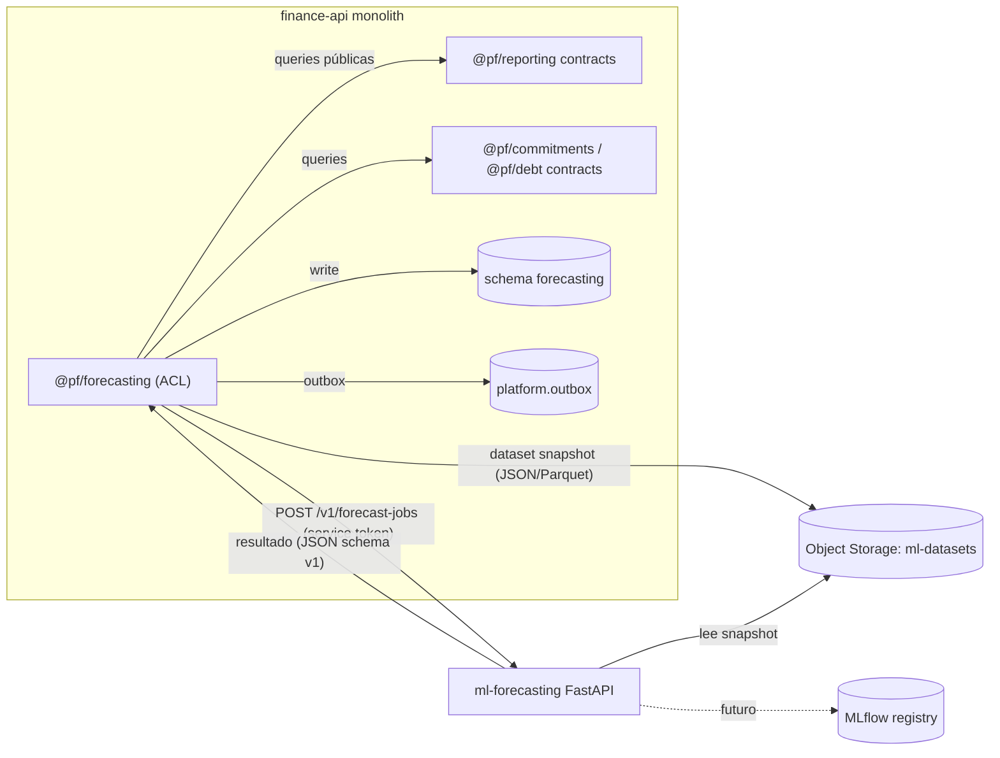
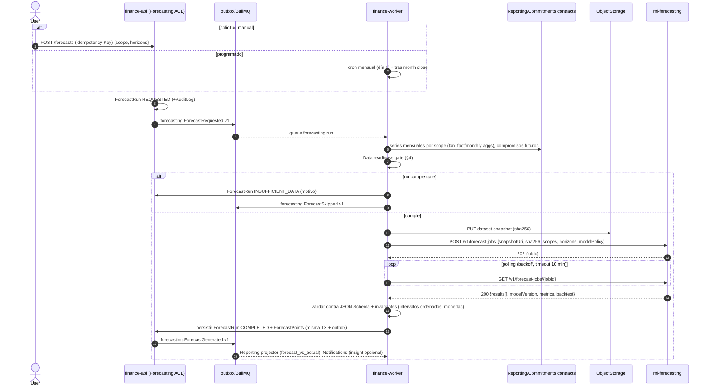

# 15 — Arquitectura de Machine Learning (Forecasting)

> **Estado:** Propuesto · **Fecha:** 2026-10-01 · **Relacionado:** [ARCHITECTURE.md](ARCHITECTURE.md) (§2, §3, §5, §7, §10), [05-bounded-contexts.md](05-bounded-contexts.md), [14-reporting.md](14-reporting.md), [18-observability.md](18-observability.md), [12-security.md](12-security.md), [16-testing-strategy.md](16-testing-strategy.md), [27-ai-assistant-roadmap.md](27-ai-assistant-roadmap.md), ADR-0017 (ML separation), ADR-0008 (outbox)
>
> **Contexto:** `FORECAST` · schema `forecasting` · `services/ml-forecasting` (Python/FastAPI) + `@pf/forecasting` (ACL TypeScript) · **Phase 8** (forecasting), **Phase 9** (anomalías, auto-clasificación, insights).
> **Capability OpenSpec:** `forecast/expense-forecasting`.

---

## 1. Principios

1. **El producto es completamente útil sin ML** (ARCHITECTURE §1). ML es aditivo; si `ml-forecasting` está caído, la app funciona igual y muestra el último forecast válido (o ninguno).
2. **Nunca en el camino crítico** del core (ARCHITECTURE §2): ningún comando financiero espera al servicio ML.
3. **El servicio ML no tiene acceso a la base de datos** (ni lectura ni escritura). Recibe datasets **exportados** y devuelve resultados; el contexto Forecasting (en `finance-api`) es el **único escritor** del schema `forecasting`.
4. **Predicciones honestas**: siempre con intervalo, baseline y versión; nunca "vas a gastar exactamente X".
5. **Separar lo conocido de lo estimado**: costos futuros conocidos (Commitments, Debt) no se "predicen"; se suman como componente determinista.
6. **Reproducibilidad**: todo forecast referencia el `datasetSnapshotId` (hash) y `modelVersion` con los que se generó.

## 2. Decisión: acceso a datos y escritura de resultados

### 2.1 Opciones evaluadas

| Opción | Descripción | Pros | Contras |
|---|---|---|---|
| A. ML lee BD con rol read-only | `ml-forecasting` consulta `ledger`/`reporting` vía réplica o rol RO | Simple para el data scientist | Acopla el servicio Python al modelo físico de varios schemas (rompe ARCHITECTURE §2: contexto solo expone `contracts`); RLS/credenciales adicionales; extracción a otra nube complicada |
| B. ML escribe directo en `forecasting` | ML con credenciales de escritura en su schema | Menos saltos | Dos escritores del schema (Python + TS), dos implementaciones de RLS/auditoría/outbox; la ACL `@pf/forecasting` pierde sentido |
| **C. Export → ML stateless → resultados vía `@pf/forecasting`** | `finance-worker` construye un **dataset snapshot** desde las queries públicas de Reporting/Commitments; lo entrega al ML (payload o Parquet en Object Storage); ML devuelve resultados; `@pf/forecasting` valida y persiste en `forecasting` con outbox | ML sin credenciales de BD; un solo escritor; contrato explícito y versionado; ML testeable con archivos; encaja con ACL del §3 | Un salto más; el dataset se materializa (tamaño pequeño en finanzas personales: < 5 MB) |

### 2.2 Decisión

**Opción C.** El contexto `FORECAST` está formado por dos piezas (ARCHITECTURE §3): `@pf/forecasting` (ACL TypeScript dentro del monolito, dueño del schema `forecasting`, publica eventos, expone la API `/forecasts`) y `services/ml-forecasting` (motor de cómputo **stateless** respecto a datos de usuario; solo guarda artefactos de modelo en MLflow/Object Storage en el futuro).

- El ML **no** escribe vía endpoint HTTP público de finance-api (evita exponer un endpoint de escritura con identidad de servicio): el flujo es **request/response asíncrono iniciado por el worker** (el worker hace `POST /v1/forecast-jobs`, luego hace polling `GET /v1/forecast-jobs/{id}` o recibe el resultado completo si el job es corto). El resultado vuelve al worker, que lo persiste.
- Comunicación interna en red privada (Compose network / VPC), autenticada con **token de servicio** (client credentials OIDC o mTLS en cloud). ML nunca se expone al navegador.
- Datos enviados: **seudonimizados** (IDs de categoría/cuenta en vez de nombres, sin descripciones libres, sin counterparties en texto) → minimización (ver §11).



## 3. Flujo ForecastRequested → ForecastGenerated



Estados de `ForecastRun`: `REQUESTED → BUILDING_DATASET → SUBMITTED → COMPLETED | FAILED | INSUFFICIENT_DATA | SUPERSEDED`. Un nuevo run completado para el mismo scope marca el anterior como `SUPERSEDED` (se conserva para Forecast vs Actual).

Fallos: ML caído → reintento con backoff (máx. 5, 24 h) → `FAILED` + métrica `ml_forecast_failures_total`; la UI sigue mostrando el último `COMPLETED` con su `generatedAt`.

## 4. Data readiness gate

Un scope solo se pronostica si cumple **todas** sus condiciones; si no, se informa al usuario exactamente qué falta ("necesitas 4 meses más de historia en *Restaurantes*").

| Condición | Umbral (default, configurable) | Aplica a |
|---|---|---|
| Historia mínima total | ≥ **6 meses** completos con transacciones | Cualquier modelo no ingenuo |
| Historia para modelos estacionales (ETS estacional, Prophet con estacionalidad anual) | ≥ **24 meses** (2 ciclos) ideal; ≥ **12 meses** mínimo, con estacionalidad anual desactivada si < 24 | Selección de candidatos |
| Densidad por categoría | ≥ **3 transacciones/mes** en ≥ 75 % de los meses, o ≥ **30 transacciones** totales | Forecast por categoría (si no, se agrega en "Otros variables") |
| Meses cerrados / reconciliados | ≥ 80 % de los meses de la historia en estado `closed` o con baja proporción de transacciones sin categoría (< 10 %) | Calidad de etiqueta |
| Ausencia de huecos | ≤ 1 mes sin datos consecutivo (un hueco > 1 mes trunca la serie al último tramo continuo) | Todas |
| Estabilidad de taxonomía | Si una categoría fue fusionada/dividida, se usa el mapeo histórico de Classification; si no existe, se trunca | Por categoría |

Política resultante: con 3–5 meses solo se ofrece **baseline ingenuo/moving average** etiquetado como "estimación simple"; con < 3 meses no hay forecast.

## 5. Features y dataset

**Grano**: serie mensual (y semanal para cash flow de corto plazo) por scope.

| Feature | Fuente | Notas |
|---|---|---|
| `y`: gasto neto del periodo por scope (total, categoría, cuenta) en moneda nativa y en RC (`conv_t`) | Reporting `monthly_category_agg` | Neto de refunds, sin transfers. Se pronostica **en la moneda dominante** de la serie; multi-moneda → en RC con nota. |
| Componente recurrente conocido del pasado | Commitments: ocurrencias emparejadas | Permite modelar `y_variable = y − y_recurrente_conocido` |
| Calendario | Derivado | mes, nº de días, nº de fines de semana, feriados de Bolivia (Carnaval, Navidad, aguinaldo en diciembre), días hasta cobro |
| Eventos de ingreso | Commitments inflows / Income histórico | Aguinaldo/bonos influyen el gasto de diciembre |
| Tendencia reciente | Derivado | pendiente de los últimos 3–6 meses |
| Outliers marcados | Usuario (`exclude_from_forecast` tag) / detección robusta | Compras únicas grandes (p. ej. un viaje) se pueden excluir |
| Inflación / tipo de cambio | FX (opcional) | Solo si mejora en backtest; no por defecto |

**Dataset snapshot** (contrato `contracts/ml/forecast-dataset.v1.schema.json`): `{snapshotId, workspaceRef (hash), generatedAt, reportingCurrency, series: [{scopeType, scopeRef (id opaco), currency, freq, points:[{period, value(string decimal), recurringKnown, isOutlier}]}], knownFuture: [...], calendar: [...]}`. Montos como **string decimal**; en Python se leen con `Decimal` para validación y se convierten a float64 **solo dentro del modelo** (aceptable para estimaciones estadísticas, nunca para datos contables); las salidas se redondean a la escala de la moneda y vuelven como string.

## 6. Primer caso de uso: Expense Forecasting

### 6.1 Scopes y horizontes

| Scope | Horizontes | Notas |
|---|---|---|
| Gasto total | 1, 3, 6, 12 meses | |
| Gasto por categoría (y grupo) | 1, 3, 6 meses (12 si ≥ 24 meses de historia) | Reconciliación jerárquica: suma de categorías vs total (bottom-up por defecto; se reporta la discrepancia con el modelo total) |
| Gasto por cuenta | 1, 3 meses | Útil para tarjetas de crédito |
| Cash flow (net) | 1, 3 meses (semanal para los próximos 90 días) | Alimenta la banda `PREDICTED` del Cash Flow Calendar (14-reporting.md §8) |
| Saldo esperado | 1, 3, 6 meses | `saldo_hoy + ingresos esperados − KNOWN_FUTURE − PREDICTED_VARIABLE` con banda |

### 6.2 Descomposición obligatoria

```
TotalExpected(h) = KnownFutureCosts(h)        # Commitments + Debt: suscripciones, cuotas, facturas fijas (determinista)
                 + PredictedVariableCosts(h)  # modelo ML sobre y_variable (con intervalo)
```

- `KnownFutureCosts` **no lo calcula ML**: lo provee `@pf/forecasting` desde Commitments/Debt (motor de recurrencia). Se envía al ML solo como regresor/contexto y para evitar doble conteo.
- Bills variables (luz, agua) son `ESTIMATED` en Commitments: se incluyen en la parte conocida con su banda propia (min/max histórico de las últimas 6 ocurrencias).

### 6.3 Contrato de salida (siempre)

```json
{
  "forecastRunId": "01J…",
  "scope": { "type": "CATEGORY", "id": "cat_…" },
  "currency": "BOB",
  "horizon": { "period": "2026-11", "monthsAhead": 1 },
  "prediction": "2350.00",
  "interval": { "level": 0.8, "lower": "1980.00", "upper": "2790.00" },
  "interval95": { "lower": "1810.00", "upper": "3050.00" },
  "components": { "knownFuture": "690.00", "predictedVariable": "1660.00" },
  "baseline": { "method": "MEAN_LAST_6", "value": "2210.00" },
  "drivers": [
    { "type": "HISTORICAL_AVERAGE", "value": "2210.00" },
    { "type": "SEASONALITY", "effect": "+120.00", "note": "noviembre históricamente +5 %" },
    { "type": "KNOWN_RECURRING", "value": "690.00", "refs": ["commitment_…"] },
    { "type": "RECENT_TREND", "effect": "+20.00", "note": "tendencia +1 %/mes en 6 meses" }
  ],
  "model": { "name": "ETS", "version": "ets-additive@1.3.0", "selectedBy": "rolling-origin-cv", "cvMetric": { "MASE": 0.82 } },
  "datasetSnapshotId": "sha256:…",
  "generatedAt": "2026-10-01T06:00:12Z"
}
```

Invariantes validadas al recibir: `lower ≤ prediction ≤ upper`; `interval95 ⊇ interval`; valores ≥ 0 para gasto (si el modelo da negativo se trunca a 0 y se registra); moneda conocida; `generatedAt` presente; `modelVersion` registrado.

## 7. Modelos candidatos

| Modelo | Cuándo es elegible | Intervalo |
|---|---|---|
| **Naive** (último periodo) | Siempre (≥ 1 mes) | Empírico de errores históricos del naive |
| **Seasonal naive** (mismo mes año anterior) | ≥ 13 meses | Empírico |
| **Moving Average** (3/6/12) | ≥ 3 meses | ± z·σ de residuos |
| **Exponential Smoothing / ETS** (statsmodels; aditivo/multiplicativo, amortiguado; estacional si ≥ 24 m) | ≥ 6 meses (no estacional) | Analítico / simulado |
| **Prophet** | ≥ 24 meses y serie densa; útil con feriados (aguinaldo, carnaval) | Simulación (uncertainty samples) |
| **Regresión / gradient boosting** (scikit-learn: Ridge, HistGradientBoosting con features de calendario y lags; modelo global entre categorías) | ≥ 24 meses y ≥ 5 categorías con densidad suficiente | **Quantile regression** (p10/p50/p90) o conformal prediction |

Regla de oro: un modelo complejo solo se selecciona si **supera al mejor baseline** (naive/seasonal naive/MA) en el backtest por un margen ≥ 5 % de MASE; si no, gana el baseline (más simple, más explicable).

## 8. Selección y backtesting

### 8.1 Rolling-origin temporal cross-validation

```
para cada scope:
  orígenes = últimos K = min(6, n − n_min) meses como puntos de corte
  para cada origen t:
     entrenar con y[1..t]
     pronosticar y[t+1 .. t+h] para h ∈ {1, 3, 6, 12} (si hay datos reales)
     registrar errores por horizonte
  métrica agregada por modelo y horizonte → seleccionar el modelo con menor MASE (h=1 y h=3 ponderados 0.5/0.5)
```

- **Expanding window** por defecto (las series personales son cortas); sliding window solo si hay > 48 meses y cambio de régimen detectado.
- Sin fuga de datos: features calculadas solo con información disponible en `t` (incluye compromisos conocidos **a la fecha `t`**, no los actuales).
- La selección se re-ejecuta en cada run mensual (barato: series pequeñas); se guarda la tabla completa de backtest en `forecasting.backtest_result`.

### 8.2 Métricas

| Métrica | Fórmula | Uso / cuidado |
|---|---|---|
| **MAE** | `mean(|y − ŷ|)` | En moneda; interpretable ("me equivoco en promedio 150 BOB"). Mostrado al usuario. |
| **RMSE** | `sqrt(mean((y − ŷ)²))` | Penaliza errores grandes; para comparar modelos en el mismo scope. |
| **MAPE** | `mean(|y − ŷ| / |y|)` | **Indefinido si y = 0** e inestable con y pequeño (categorías con meses sin gasto). Solo se calcula si `min |y| > 0` en la ventana y la serie no es intermitente; si no, se omite. |
| **sMAPE** | `mean(2|y − ŷ| / (|y| + |ŷ|))` | Acotado [0, 2]; indefinido si y = ŷ = 0 (se define 0 en ese caso). Asimétrico; solo informativo. |
| **MASE** | `MAE_modelo / MAE_naive_in-sample` (naive estacional si m=12 aplica) | **Métrica principal de selección**: libre de escala, robusta a ceros, < 1 = mejor que naive. |
| **Coverage** | `% de reales dentro del intervalo 80 %` | Calibración: objetivo 75–85 %; fuera → recalibrar (conformal). |
| **Pinball loss** | Para cuantiles | Modelos con quantile regression. |
| **Bias** | `mean(ŷ − y)` | Detecta sub/sobreestimación sistemática. |

### 8.3 Backtesting operacional

- `services/ml-forecasting/backtests/` con datasets sintéticos (seed `large`, ver 29-seed-datasets.md) y datasets anonimizados del owner (opt-in, nunca en el repo).
- CI del servicio ML: tests de contrato (JSON Schema in/out), tests de propiedades (intervalos ordenados, no negativos, determinismo con semilla fija) y un **backtest de regresión**: el MASE medio en el dataset sintético de referencia no puede empeorar > 5 % respecto a `main`.

## 9. Explicabilidad (UI y textos)

- Nunca: "Vas a gastar 2 350 BOB". Siempre: **"Esperado: ~2 350 BOB · Rango probable: 1 980 – 2 790 BOB (80 %)"**.
- Bloque **"¿Por qué?"** con los `drivers`: promedio histórico, estacionalidad, pagos recurrentes conocidos, tendencia reciente; cada driver con su contribución.
- Visual separado: **Costos futuros conocidos** (lista con fechas y montos, de Commitments/Debt) vs **Gastos variables estimados** (banda).
- Indicador de **confianza** basado en historia y coverage: `Baja` (< 12 meses o MASE > 1), `Media`, `Alta` (≥ 24 meses, MASE < 0.8, coverage OK).
- Mostrar `generatedAt` y "modelo: suavizado exponencial (v1.3)"; enlace a Forecast vs Actual del scope.
- Si el gate no se cumple: mensaje explicativo y alternativa (promedio simple con etiqueta).

## 10. Model registry, versionado y monitoreo

| Aspecto | Phase 8 | Futuro |
|---|---|---|
| Versionado | `modelVersion = <family>@<semver del código del servicio>` + hiperparámetros en el resultado; la imagen `finance-ml` con tag `sha-<git>` | **MLflow** (tracking + registry) con artefactos en Object Storage |
| Entrenamiento | Por run, on-the-fly (series pequeñas; no hay modelos persistidos) | Modelos globales (multi-serie) entrenados y registrados; promoción `staging → production` en registry |
| Reproducibilidad | `datasetSnapshotId` + `modelVersion` + seed | Lineage en MLflow |
| Monitoreo de calidad | Job mensual post month-close: compara forecasts `SUPERSEDED` del mes cerrado vs actual → `forecasting.forecast_accuracy` (MAE, MASE, coverage por scope) | Dashboards de drift |
| Drift | Data drift: cambio de distribución del gasto mensual (test de Page-Hinkley o z-score de los últimos 3 meses vs histórico); concept drift: MASE rolling > 1.2 durante 3 meses | Alertas + reentrenamiento/re-selección automática |
| Métricas operativas | `ml_forecast_duration_seconds`, `ml_forecast_failures_total`, `ml_forecast_insufficient_data_total`, `ml_forecast_mase` (gauge por scope agregado) → 18-observability.md | |

## 11. Seguridad y privacidad

- `ml-forecasting` sin credenciales de BD; acceso a Object Storage limitado a prefijo `ml-datasets/` con lectura; snapshots con TTL 7 días (lifecycle rule).
- Datos seudonimizados: `workspaceRef = HMAC(workspaceId)`, scopes por ID opaco; sin descripciones, nombres de counterparties ni notas.
- Logs del servicio ML: sin valores de series (solo tamaños, ids opacos, métricas). Ver 18-observability.md §3.
- Ningún dato de usuario sale a servicios externos de ML/LLM. Sin entrenamiento cruzado entre workspaces salvo opt-in explícito (modelos globales futuros).

## 12. Phase 9 (posterior)

| Feature | Enfoque | Integración |
|---|---|---|
| **Anomaly detection** | Robust z-score / MAD por categoría y counterparty; Isolation Forest con suficientes datos; reglas para "cargo duplicado de suscripción", "monto inusual", "nueva counterparty con monto alto" | `forecasting.AnomalyDetected.v1` → Notifications ("posible cargo inusual"); nunca bloquea ni modifica transacciones |
| **Auto-classification** | Clasificador (TF-IDF de descripción normalizada + monto + cuenta + día → categoría) entrenado por workspace; complementa Rules (las reglas explícitas siempre ganan) | Se expone como sugerencia en el preview de imports (13-import-architecture.md §4, etapa Rules) y en quick-add; precisión mínima 85 % top-1 en validación para activarse; el usuario confirma |
| **Predictive insights** | "Con la tendencia actual excederás *Restaurantes* el día 22", "tu meta *Viaje* se retrasa 2 meses" | Combina budgets (Planning) + forecasts; textos generados por plantillas, no por LLM |

## 13. API (resumen)

finance-api: `POST /api/v1/workspaces/{ws}/forecasts` (Idempotency-Key), `GET /forecasts?scope=&status=`, `GET /forecasts/{runId}`, `GET /forecasts/latest?scope=&horizon=`, `GET /forecasts/accuracy`.
ml-forecasting (interno): `POST /v1/forecast-jobs`, `GET /v1/forecast-jobs/{id}`, `GET /health/live`, `GET /health/ready`, `GET /v1/models` (catálogo de familias y versiones). OpenAPI propio en `contracts/openapi/ml-forecasting.v1.yaml` (generado por FastAPI y verificado contra el contrato en CI).

## 14. Testing

- Python: pytest + hypothesis (properties), contract tests de JSON Schema compartidos con TS, backtest de regresión en CI.
- TS (`@pf/forecasting`): tests del ACL con fake ML (fixtures de respuesta), validación de invariantes, gate de readiness (TC `TC-FORECAST-READINESS-*`), idempotencia de runs.
- E2E: perfil Compose `ml` + seed `large` → run → ver forecast en UI con rango y drivers.

## Preguntas abiertas

1. ¿Intervalo por defecto 80 % (recomendado para finanzas personales) con 95 % opcional?
2. ¿El owner acepta usar datos anonimizados propios para backtests locales (nunca en el repo)?
3. ¿Moneda de pronóstico: nativa por serie o siempre RC? (Propuesta: nativa cuando la serie es monomoneda; RC para totales.)
4. ¿Feriados/eventos bolivianos a modelar (aguinaldo, segundo aguinaldo cuando aplica, carnaval)?
5. ¿Prophet merece su dependencia pesada en la imagen o se difiere hasta tener ≥ 24 meses reales?
6. ¿Re-selección de modelo mensual automática o con aprobación del owner?
