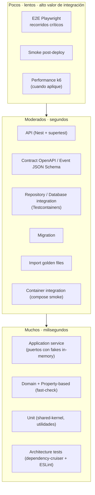

# 16 — Estrategia de testing

> **Estado:** Propuesto · **Fecha:** 2026-10-01 · **Owner:** Principal Architect / QA Lead
> **Relacionado:** [ARCHITECTURE.md](./ARCHITECTURE.md) · [03-openspec-strategy.md](./03-openspec-strategy.md) · [09-ledger-design.md](./09-ledger-design.md) (catálogo `INV-NNN`) · [17-test-traceability.md](./17-test-traceability.md) · [23-ci-cd.md](./23-ci-cd.md) · [29-seed-datasets.md](./29-seed-datasets.md) · [ADR-0016](./adr/0016-testing-strategy.md) · [ADR-0024](./adr/0024-spec-driven-development-with-openspec.md) · [tests/cases/README.md](../tests/cases/README.md)

---

## 1. Propósito y alcance

Este documento define **cómo se prueba PFOS**: filosofía, niveles de test, herramientas, ubicación en el repositorio, qué se simula y qué es real, presupuestos de velocidad, gates de CI y la gestión progresiva del catálogo de test cases.

Es coherente con [ARCHITECTURE §5](./ARCHITECTURE.md#5-stack-tecnológico-propuesto-cada-punto-con-adr) (Vitest, Testcontainers, Playwright, fast-check, Spectral/Redocly, JSON Schema, dependency-cruiser) y con la cadena de trazabilidad de [ARCHITECTURE §12](./ARCHITECTURE.md#12-calidad-spec--test-traceability-adr-0016-adr-0024). En Phase 0 **no existe código de test ejecutable**: los fragmentos incluidos son ilustrativos.

## 2. Filosofía

1. **Los tests son documentación viva.** Cada test automatizado de comportamiento lleva un TC-ID (`it('[TC-LEDGER-TRANSFER-001] la transferencia preserva el patrimonio neto', …)`) que enlaza con un test case en `tests/cases/`, un Scenario de OpenSpec y un FR. Leer los nombres de los tests de un contexto debe equivaler a leer su especificación.
   - **Idioma:** los test cases (`tests/cases/`), las specs de OpenSpec y los nombres de los tests automatizados se escriben **en español** e incluyen el TC-ID. Los IDs se mantienen como códigos (`TC-LEDGER-…`, `FR-…`, `INV-…`) y los identificadores del código fuente siguen en inglés; el glosario de lenguaje ubicuo de [04-domain-model.md](./04-domain-model.md) mapea español↔inglés.
   - **Convención OpenSpec:** las palabras clave estructurales quedan en inglés porque el CLI las parsea (`## Purpose`, `### Requirement:`, `#### Scenario:`, `## ADDED Requirements`…); el texto del Requirement usa "DEBE (MUST)" / "NO DEBE (MUST NOT)" porque `openspec validate --strict` exige SHALL/MUST; los Scenarios usan `- **CUANDO** …` / `- **ENTONCES** …` / `- **Y** …` (verificado con OpenSpec 1.14.0, incluido `openspec archive`). Detalle en [17-test-traceability.md §4.2](./17-test-traceability.md).
2. **TDD obligatorio en componentes financieros críticos.** Para los siguientes componentes el test (rojo) se escribe **antes** que el código, y el PR debe mostrarlo (commit de test previo o descripción explícita en el change de OpenSpec):
   - `Money`, `Currency`, rounding (`HALF_EVEN`) y allocation (largest remainder) en `@pf/shared-kernel`.
   - Ledger posting (`JournalEntry`, `Posting`, validación de balance por moneda, reversas).
   - Conversiones (pricing, effective rate, fees, patas `FX_TRADING`).
   - Amortization (Debt), recurrence (Commitments), budgeting math (Planning).
3. **Las invariantes financieras (`INV-001..INV-020`) se prueban en varias capas**: en dominio (unit/property), en base de datos (constraints/triggers) y de extremo a extremo cuando aplica. Una invariante con un solo nivel de defensa es un hallazgo de revisión.
4. **No simular la infraestructura cuando el comportamiento importa.** PostgreSQL (RLS, `NUMERIC`, constraint triggers diferidos, `SET LOCAL`), Valkey/BullMQ y almacenamiento S3 se prueban con **Testcontainers reales**, no con mocks ni con bases en memoria.
5. **Determinismo total.** Ningún test depende de la hora real, de `Math.random`, del orden de ejecución ni de la red externa. `Clock` e `IdGenerator` se inyectan (ver §6).
6. **Rápido por defecto.** La gran mayoría de tests de dominio corre en milisegundos sin I/O; los tests lentos están aislados en proyectos de Vitest separados y en jobs de CI distintos.
7. **Un test nunca se elimina sin entender su intención** (ver §11 y [17-test-traceability.md](./17-test-traceability.md)).

## 3. Forma de la suite: pirámide adaptada por capa

PFOS no sigue una pirámide pura ni un trofeo puro: el **núcleo financiero** (shared-kernel, ledger, transactions) tiene una base ancha de tests de dominio y property-based; los **adaptadores** reciben tests de integración reales (forma de trofeo en esa capa); la UI recibe pocos E2E de recorridos críticos.



| Capa de código | Forma dominante | Justificación |
|---|---|---|
| `shared-kernel` (Money, rounding, allocation) | Unit + Property-based (muy ancha) | Errores aquí contaminan todo el sistema; TDD + PBT. |
| `contexts/*/domain` | Domain + Property-based | Agregados e invariantes puros, sin I/O. |
| `contexts/*/application` | Application service con fakes de puertos | Orquestación, autorización por caso de uso, idempotencia. |
| `contexts/*/infrastructure` | Repository/Database integration (Testcontainers) | El comportamiento real está en PostgreSQL. |
| `contexts/*/interface` + `apps/api` | API + Contract | Mapeo HTTP, errores RFC 9457, OpenAPI. |
| `apps/web` | Componentes (Vitest + Testing Library) + E2E selectivos | La lógica financiera **no** vive en el frontend. |
| Plataforma (compose, imágenes, pipeline) | Container integration + Smoke | Paridad local/CI/cloud. |

## 4. Convenciones de ubicación y nombres (propuesta)

`ARCHITECTURE §6` fija `tests/cases`, `tests/e2e` y `tests/traceability`. Se proponen además las siguientes convenciones (no contradicen el layout; lo detallan):

| Sufijo / carpeta | Nivel | Proyecto Vitest |
|---|---|---|
| `packages/**/src/**/*.test.ts` (colocado junto al código) | Unit, Domain, Application | `unit` |
| `packages/**/src/**/*.pbt.test.ts` | Property-based | `unit` (con `numRuns` reducido) y `pbt-nightly` (ampliado) |
| `packages/contexts/<ctx>/test/integration/*.int.test.ts` | Repository / Database integration | `integration` |
| `apps/api/test/api/*.api.test.ts` | API | `integration` |
| `tests/contract/openapi/*.contract.test.ts`, `tests/contract/events/*.contract.test.ts` | Contract / Event contract | `contract` |
| `db/test/*.migration.test.ts` | Migration | `migration` |
| `packages/contexts/imports/test/golden/**` | Import golden files | `integration` |
| `tests/platform/*.platform.test.ts` | Container integration | `platform` |
| `tests/e2e/**/*.e2e.ts` | E2E (Playwright) | Playwright |
| `tests/performance/*.k6.js` | Performance | k6 |
| `tests/smoke/*.smoke.test.ts` | Smoke post-deploy | `smoke` |
| `.dependency-cruiser.cjs`, `tools/eslint-plugin-pf/` | Architecture | `pnpm lint:arch` |

Ilustrativo (no ejecutable en Phase 0):

```ts
// vitest.workspace.ts (ilustrativo)
export default [
  { test: { name: 'unit', include: ['packages/**/src/**/*.test.ts'], exclude: ['**/*.int.test.ts'] } },
  { test: { name: 'integration', include: ['**/*.int.test.ts', 'apps/api/test/api/**/*.api.test.ts'],
            globalSetup: './tests/setup/testcontainers.global.ts', pool: 'forks', testTimeout: 60_000 } },
  { test: { name: 'contract', include: ['tests/contract/**/*.contract.test.ts'] } },
  { test: { name: 'migration', include: ['db/test/**/*.migration.test.ts'] } },
];
```

## 5. Niveles de test

Para cada nivel: **alcance · herramientas · ubicación · mock vs real · presupuesto de velocidad · cuándo corre en CI**. Los presupuestos son objetivos; superarlos de forma sostenida abre un ticket técnico (`TS-NNN`).

### 5.1 Unit

- **Alcance:** funciones y value objects aislados: `Money`, `Currency`, rounding, allocation, parsers, utilidades de fecha de negocio (timezone del workspace).
- **Herramientas:** Vitest.
- **Ubicación:** colocados (`*.test.ts`).
- **Mock vs real:** todo real (no hay dependencias). Prohibido mockear `Money`.
- **Velocidad:** < 5 ms por test; suite completa del paquete < 10 s.
- **CI:** cada PR y cada push (job `unit`).

### 5.2 Domain

- **Alcance:** agregados, entidades, domain services y eventos de dominio de cada contexto (`JournalEntry`, `Transaction`, `TransactionSplit`, `Conversion`, `FinancialPeriod`, `Loan`, `RecurringDefinition`, `Budget`…). Verifica invariantes y emisión de eventos.
- **Herramientas:** Vitest + test data builders (§7) + fast-check cuando hay propiedades.
- **Ubicación:** `packages/contexts/<ctx>/src/domain/**/*.test.ts`.
- **Mock vs real:** sin mocks; `Clock`/`IdGenerator` deterministas.
- **Velocidad:** < 10 ms por test; suite por contexto < 15 s.
- **CI:** cada PR (job `unit`). **TDD obligatorio** en componentes críticos (§2).

### 5.3 Application Service

- **Alcance:** casos de uso (commands/queries): orquestación, autorización por rol, idempotencia, interacción con puertos (`LedgerPostingPort`, repositorios, `AuditPort`, `OutboxPort`), traducción de errores de dominio.
- **Herramientas:** Vitest; **fakes in-memory** de puertos que implementan el mismo contrato que los adapters reales (y que se validan con una *port contract test suite* compartida, §5.4).
- **Ubicación:** `packages/contexts/<ctx>/src/application/**/*.test.ts`.
- **Mock vs real:** puertos con fakes (no mocks de interacción salvo para verificar que se publica un evento o se escribe auditoría). Dominio real.
- **Velocidad:** < 20 ms por test.
- **CI:** cada PR (job `unit`).

### 5.4 Repository Integration

- **Alcance:** adapters Kysely que implementan repositorios y puertos: mapping agregado ↔ filas, `NUMERIC(38,18)` ↔ `Decimal` sin pérdida, optimistic locking (`version`), paginación por cursor, outbox insert en la misma transacción.
- **Port contract suites:** la misma batería de tests se ejecuta contra el fake in-memory y contra el adapter real, garantizando que los fakes no mienten.
- **Herramientas:** Vitest + Testcontainers (`postgres:18`).
- **Ubicación:** `packages/contexts/<ctx>/test/integration/*.int.test.ts`.
- **Mock vs real:** PostgreSQL real, migraciones reales (dbmate), rol de aplicación real (sin `BYPASSRLS`).
- **Velocidad:** < 300 ms por test (tras arranque del contenedor); arranque compartido por worker de Vitest.
- **CI:** cada PR (job `integration`).

### 5.5 Database Integration (constraints / triggers / RLS)

- **Alcance:** defensas en la base de datos independientes de la aplicación:
  - Constraint trigger diferido de balance por moneda (`INV-004`).
  - Inmutabilidad de `ledger.posting` y `ledger.journal_entry` (UPDATE/DELETE rechazados para el rol de app).
  - Rechazo de entries en periodo `closed` (`INV-015`) si se refuerza en BD.
  - Políticas RLS por `workspace_id` (`SELECT/INSERT/UPDATE` cruzados), rol de app sin `BYPASSRLS` y no owner.
  - `CHECK` de escala y signo cuando aplique; FKs a `currency`.
- **Herramientas:** Vitest + Testcontainers; SQL directo con el **rol de aplicación** (no superusuario) para demostrar que la BD defiende sola.
- **Ubicación:** `db/test/*.db.int.test.ts` y `packages/contexts/<ctx>/test/integration/`.
- **Velocidad:** < 300 ms por test.
- **CI:** cada PR (job `integration`).

### 5.6 API (NestJS + supertest)

- **Alcance:** controllers y pipeline HTTP completo de `finance-api`: validación de DTO, mapeo de errores RFC 9457 (`code` de dominio estable), `Idempotency-Key`, ETag/`If-Match`, autenticación JWT y autorización por workspace, serialización de montos como string decimal.
- **Herramientas:** Vitest + `@nestjs/testing` + supertest; JWT firmados por un emisor de test (clave local) en lugar de Keycloak.
- **Ubicación:** `apps/api/test/api/*.api.test.ts`.
- **Mock vs real:** PostgreSQL y Valkey reales (Testcontainers); proveedor OIDC simulado por un JWKS local; reloj determinista.
- **Velocidad:** < 500 ms por test.
- **CI:** cada PR (job `integration`).

### 5.7 Contract (OpenAPI, ambos sentidos)

- **Alcance:**
  1. **Spec lint:** `contracts/openapi/finance-api.v1.yaml` validado con Spectral/Redocly (reglas: montos `type: string` con `pattern` decimal, errores `application/problem+json`, `Idempotency-Key` en POST financieros, camelCase).
  2. **Provider conformance (implementación → contrato):** cada respuesta de los tests API se valida contra el schema OpenAPI (middleware de validación de respuestas en modo test). Una respuesta no documentada falla el test.
  3. **Consumer conformance (contrato → implementación):** cada operación declarada en OpenAPI debe tener al menos un test API que la ejerza (cobertura de operaciones), y el cliente tipado del BFF (`apps/web`) se genera desde el contrato; `typecheck` falla si diverge.
  4. **Breaking change detection:** diff del contrato contra `main` (p. ej. `oasdiff`); cambios breaking requieren `/api/v2` o change de OpenSpec aprobado.
- **Ubicación:** `tests/contract/openapi/`.
- **Velocidad:** lint < 10 s; conformance embebida en tests API.
- **CI:** cada PR (job `contract`).

### 5.8 Event Contract (JSON Schema)

- **Alcance:** eventos `<context>.<EventName>.v<N>` en `contracts/events/<context>/<EventName>.v<N>.schema.json`: el envelope estándar (ARCHITECTURE §7) y el payload. Se verifica que (a) el productor genera eventos válidos contra el schema (Ajv), (b) los consumidores aceptan los ejemplos versionados (`examples/`), (c) un cambio incompatible exige `v<N+1>` (comparación de schemas contra `main`).
- **Herramientas:** Vitest + Ajv (draft 2020-12).
- **Ubicación:** `tests/contract/events/`.
- **CI:** cada PR (job `contract`).

### 5.9 Migration

- **Alcance:**
  1. **Up from empty:** BD vacía → todas las migraciones → schema esperado (snapshot de catálogo `pg_catalog` normalizado).
  2. **Up from previous release snapshot:** restaurar el dump de la última release (con seed `demo` aplicado) → migraciones nuevas → verificación de invariantes financieras con consultas SQL (`Σ postings = 0` por entry y moneda; saldos iguales antes/después).
  3. **Expand/contract checks:** lint de migraciones (p. ej. `squawk`) que bloquea operaciones destructivas (`DROP COLUMN`, `ALTER TYPE` con reescritura, `NOT NULL` sin default) fuera de una migración marcada `contract` con aprobación manual (ARCHITECTURE §9).
  4. **Compatibilidad N-1:** el código de la release anterior corre contra el schema expandido (smoke de queries críticas).
- **Herramientas:** dbmate + Testcontainers + Vitest + squawk.
- **Ubicación:** `db/test/`.
- **Velocidad:** < 3 min.
- **CI:** gate **posterior** (Phase 1 tardía): en PRs que tocan `db/migrations/**` y siempre en `main`.

### 5.10 Import (golden files)

- **Alcance:** parsers de CSV/OFX/extractos (Imports, Phase 3/6): archivo de entrada ficticio → transacciones normalizadas esperadas (`*.expected.json`). Incluye re-importación del mismo archivo (idempotencia, `INV-014`), encodings (UTF-8/Latin-1), separadores decimales `1.234,56` vs `1,234.56`, fechas ambiguas.
- **Ubicación:** `packages/contexts/imports/test/golden/<bank-format>/{input.*, expected.json}`.
- **Regla:** actualizar un golden exige revisión explícita en el PR (`pnpm test:golden -- --update` nunca en CI).
- **CI:** cada PR una vez que exista el contexto.

### 5.11 Container Integration (compose smoke)

- **Alcance:** `docker compose --profile core up` arranca y todos los servicios llegan a `healthy`; `finance-api` no reporta `/health/ready` hasta que PG, Valkey y object storage respondan; `migrate` y `seed` terminan con exit code 0; imágenes non-root.
- **Herramientas:** Testcontainers `DockerComposeEnvironment` o script TS (`scripts/stack`) + Vitest.
- **Ubicación:** `tests/platform/`.
- **Velocidad:** < 5 min.
- **CI:** cada PR que toca `docker/`, `deploy/compose/` o `apps/*` (tras build de imágenes); siempre en `main`.

### 5.12 E2E (Playwright contra compose)

- **Alcance:** recorridos críticos de usuario sobre el stack completo (`core` + seed `minimal`): login vía Keycloak dev realm, crear cuenta, registrar gasto, transferencia, conversión USDT→BOB, ver saldo y net worth. Pocos tests, alto valor.
- **Herramientas:** Playwright (Chromium en PR; Firefox/WebKit nightly).
- **Ubicación:** `tests/e2e/`.
- **Mock vs real:** nada mockeado salvo proveedores externos de tasas (Phase 5) — se usa un stub HTTP.
- **Velocidad:** < 8 min la suite smoke E2E.
- **CI:** gate posterior (cuando exista UI funcional): smoke E2E en PR, suite completa nightly.

### 5.13 Property-Based (fast-check)

Propiedades concretas (cada una es un TC con `type: property`):

| Área | Propiedad | INV | TC |
|---|---|---|---|
| Money | `a + b = b + a`; `(a + b) + c = a + (b + c)`; `a + b − b = a` (exacto, sin redondeo intermedio) | INV-001 | TC-LEDGER-MONEY-008 |
| Money | Operar dos monedas distintas siempre falla (`CURRENCY_MISMATCH`) | INV-002 | TC-LEDGER-MONEY-007 |
| Rounding | `round(round(x)) = round(x)` (idempotente); resultado con escala ≤ `currency.scale`; `|round(x) − x| ≤ ½ unidad mínima`; `round(−x) = −round(x)` (HALF_EVEN simétrico) | INV-020 | TC-LEDGER-MONEY-004 |
| Allocation | `Σ partes = total` exacto; cada parte difiere de su cuota exacta en < 1 unidad mínima; mismo input ⇒ mismo output; permutar pesos con el mismo índice de desempate es determinista | INV-020 | TC-LEDGER-MONEY-006 |
| Ledger balancing | Toda entry aceptada cumple `Σ amount = 0` por moneda; toda entry con desbalance en alguna moneda es rechazada; tras cualquier secuencia de entries válidas el *trial balance* por moneda es 0 | INV-009, INV-004 | TC-LEDGER-BALANCE-003 |
| Conversion inverse | Convertir `x` con tasa `r` y luego con `1/r` devuelve `x` con error ≤ 1 unidad mínima de la moneda de origen (sin fees) | INV-020 | TC-FX-CONVERSION-001 |
| Amortization | `Σ principal de cuotas = monto desembolsado` exacto; saldo final = 0; cada cuota = principal + interés + fees (Phase 4) | INV-016 | (por crear en Phase 4) |
| Recurrence | Ejecutar el generador N veces para la misma ventana produce las mismas ocurrencias (idempotente, sin duplicados); ocurrencias ordenadas y dentro de la ventana (Phase 3) | INV-013 | (por crear en Phase 3) |
| Transfers | Cualquier transferencia entre cuentas propias de la misma moneda deja el net worth invariante | INV-009 | TC-LEDGER-TRANSFER-001 (ejemplo) + propiedad asociada |

- **Configuración:** `numRuns` 100 en PR; 10 000 nightly (`pbt-nightly`). Semilla fija por defecto en PR (reproducible) y aleatoria nightly; toda falla imprime `seed` y `path` y se convierte en un **test de regresión de ejemplo** con el contraejemplo minimizado.
- **Arbitraries compartidos:** `@pf/shared-kernel/testing` exporta `arbMoney(currency)`, `arbCurrency()`, `arbDecimalString(scale)`, `arbBalancedEntry()`.

### 5.14 Security

- **Authz matrix tests:** tabla declarativa `rol × operación → permitido/denegado` (`OWNER`, `EDITOR`, `VIEWER`, no-miembro, anónimo) ejecutada como tests API parametrizados (TC-SECURITY-RBAC-002). Toda operación nueva en OpenAPI debe aparecer en la matriz (gate).
- **RLS leakage:** tests de BD con dos workspaces sembrados que intentan leer/escribir filas ajenas con el rol de app y `app.workspace_id` del otro workspace (TC-SECURITY-RLS-001); también se verifica que sin `SET LOCAL app.workspace_id` no se ve ninguna fila.
- **Escaneos:** dependencias (`pnpm audit`/OSV) e imágenes (Trivy) desde Phase 0/1; secret scanning (gitleaks). **OWASP ZAP baseline** contra staging en una fase posterior.
- **Uploads (Phase 6):** validación de tipo/tamaño, presigned URLs con expiración.

### 5.15 Performance

- **Cuándo:** solo cuando aplique (reportes, listados con filtros, net worth, imports grandes) y antes de releases mayores.
- **Herramientas:** k6 contra compose o staging con el **Large Dataset Seed** ([29-seed-datasets.md](./29-seed-datasets.md)).
- **Métricas:** p95/p99 por endpoint, contra los NFR-PERF de [02-non-functional-requirements.md](./02-non-functional-requirements.md).
- **CI:** manual/nightly; nunca bloquea PRs en Phase 1.

### 5.16 Smoke post-deployment

- **Alcance:** tras cada deploy a staging/producción: `/health/live`, `/health/ready`, login técnico de un usuario de smoke, lectura de un endpoint autenticado, versión desplegada = `sha-<git-sha>` esperado. En producción **solo lecturas**; ninguna mutación financiera.
- **Ubicación:** `tests/smoke/`.
- **CI:** job de deploy (ver [23-ci-cd.md](./23-ci-cd.md)); falla ⇒ rollback.

### 5.17 Architecture tests

Ejecutables con **dependency-cruiser** y un **plugin ESLint propio** (`tools/eslint-plugin-pf`). Reglas explícitas:

| ID regla | Regla | Herramienta |
|---|---|---|
| `domain-no-infra` | `packages/contexts/*/src/domain/**` no importa `infrastructure`, `interface`, `application` | dependency-cruiser |
| `domain-no-framework` | `domain` no importa `@nestjs/*`, `kysely`, `pg`, `bullmq`, `ioredis`, `@aws-sdk/*`, `node:fs`, `node:net`, `node:http` | dependency-cruiser |
| `domain-only-shared-kernel` | `domain` solo puede importar `@pf/shared-kernel` (y su propio contexto) | dependency-cruiser |
| `application-no-infra` | `application` no importa `infrastructure` ni `interface` | dependency-cruiser |
| `no-cross-context-internals` | Un contexto solo importa `@pf/<otro>/contracts`; prohibido `@pf/<otro>/src/{domain,application,infrastructure,interface}` | dependency-cruiser |
| `no-circular` | Sin ciclos entre paquetes ni entre contextos | dependency-cruiser |
| `shared-kernel-pure` | `@pf/shared-kernel` no depende de ningún otro paquete `@pf/*` | dependency-cruiser |
| `web-no-backend-internals` | `apps/web` no importa `packages/contexts/**` (solo el cliente generado desde OpenAPI) | dependency-cruiser |
| `pf/no-number-money` | Prohibido tipar como `number` propiedades/parámetros con nombres monetarios (`amount`, `balance`, `price`, `fee`, `rate`, `total`…) y prohibido `new Money(<number literal>)` / `Money.of(number)` | ESLint custom rule |
| `pf/no-float-parse` | Prohibido `parseFloat`, `Number(x)`, `+x`, `toFixed` sobre valores monetarios en `packages/**` | ESLint custom rule |
| `pf/no-nondeterminism` | Prohibido `Date.now()`, `new Date()` sin argumentos y `Math.random()` en `domain`/`application` y en `seeds/` (usar `Clock`, `IdGenerator`, PRNG sembrado) | ESLint custom rule |

Cada regla tiene su propio test de "fixture prohibido" que demuestra que la regla detecta la violación (TC-PLATFORM-ARCH-001/002).

## 6. Testcontainers, determinismo y datos de prueba

### 6.1 Testcontainers

| Servicio | Imagen | Uso |
|---|---|---|
| PostgreSQL | `postgres:18` (misma menor que compose) | Repositorios, BD, API, migraciones |
| Valkey | `valkey/valkey` (compatible Redis) | BullMQ, outbox relay, idempotency cache si aplica |
| S3-compatible | Imagen elegida en SPIKE-07 (MinIO / Garage / SeaweedFS) | `ObjectStorage` adapter (Phase 6) |

- **Un contenedor por worker de Vitest** (`globalSetup`) con migraciones aplicadas una vez; **aislamiento por test** mediante (a) transacción + rollback cuando el código bajo prueba no gestiona su propia transacción, o (b) `TEMPLATE` database clonada por test-file (`CREATE DATABASE t_x TEMPLATE pf_migrated`) cuando sí la gestiona.
- Conexiones con **dos roles**: `pf_migrator` (migraciones) y `pf_app` (tests), replicando producción.
- Reutilización local opcional (`TESTCONTAINERS_REUSE_ENABLE=true`) solo en máquinas de desarrollo, nunca en CI.

### 6.2 Clock e IdGenerator deterministas

- `Clock` (`@pf/shared-kernel`): `FixedClock('2026-03-15T12:00:00Z')` y `SteppingClock` en tests; `SystemClock` solo en composition root.
- `IdGenerator`: `SequentialUuidV7Generator(seed)` produce UUIDv7 válidos y ordenados a partir del `Clock` de test y un PRNG sembrado.
- Zona horaria: los tests fijan `TZ=UTC` en el proceso y pasan la timezone del workspace (`America/La_Paz`) explícitamente; existen tests de borde de medianoche local vs UTC.

### 6.3 Test data builders y object mothers

- **Builders** fluidos por agregado: `aTransaction().withAmount('150.00', 'BOB').withSplit(...).posted().build()`.
- **Object mothers** con escenarios con nombre, alineados con la Minimal Seed: `LedgerMother.bankA1000Bob()`, `ConversionMother.usdtToBobP2P()`.
- Montos siempre como **string decimal** en builders (nunca `number`).
- Los builders viven en `packages/<pkg>/src/testing/` y se exportan por un subpath `@pf/<ctx>/testing` excluido del bundle de producción.

## 7. Política de tests inestables (flaky)

1. Un test que falla de forma no determinista se **reporta** (issue con etiqueta `flaky`, TC-ID, logs, seed) el mismo día.
2. Se puede **cuarentenar** (`it.skip` con comentario `// QUARANTINE: <issue> <fecha>`, o tag `@quarantine` en Playwright) máximo **5 días hábiles**; tests `priority: critical` del catálogo **no se cuarentenan**: se arregla o se revierte el cambio que lo rompió.
3. Reintentos automáticos: **0** en unit/domain/integration; máximo **1** en E2E, y un test que pasa al reintento se registra como flaky en el reporte.
4. Causas típicas prohibidas por diseño: reloj real, orden de tests, puertos fijos, `sleep` arbitrarios (usar espera por condición/healthcheck).

## 8. Política de cobertura

- La cobertura de líneas es un **indicador**, no un objetivo. Umbrales mínimos (Vitest + v8) que solo pueden subir:
  - `shared-kernel`: 95 % líneas / 90 % ramas.
  - `contexts/*/domain` críticos (ledger, transactions, fx, debt, commitments, planning): 90 % / 85 %.
  - Resto: 70 % (informativo en Phase 1).
- **Mutation testing (Stryker)** sobre `shared-kernel` (Money/rounding/allocation), `ledger/domain`, `transactions/domain` (conversiones) y luego `debt/domain` (amortización): primero informativo (nightly), **gate posterior** con mutation score ≥ 80 % en esos módulos.
- **Cobertura de trazabilidad** (más importante que la de líneas): todo Requirement `Must` con al menos un TC y todo TC `automated` con test existente ([17-test-traceability.md](./17-test-traceability.md)).

## 9. Consideraciones Windows (Docker Desktop / WSL2)

- El entorno principal del owner es Windows: todos los scripts de test son **TS cross-platform vía `pnpm`** (sin bash-only), coherente con ADR-0012.
- Testcontainers requiere Docker Desktop con backend **WSL2**; se documenta `TESTCONTAINERS_HOST_OVERRIDE`/`DOCKER_HOST` solo si es necesario. Ryuk habilitado (limpieza de contenedores huérfanos).
- **Rendimiento de FS:** clonar el repo dentro del FS de WSL2 (`\\wsl$\...`) acelera mucho watch-mode y bind mounts; si se trabaja desde `D:\`, los tests de integración no dependen de bind mounts (los contenedores no montan el código).
- Line endings: `.gitattributes` con `eol=lf` para golden files, SQL y snapshots; los tests de golden files comparan normalizando `\r\n`.
- Rutas: usar `node:path` y `fileURLToPath`; prohibido concatenar con `/` en helpers de test.
- Playwright: navegadores instalados por `pnpm exec playwright install`; E2E contra compose usa nombres de servicio dentro de la red de compose o `localhost` mapeado solo en el runner.
- Ver SPIKE-08 ([ARCHITECTURE §15](./ARCHITECTURE.md#15-spikes-tecnológicos-de-phase-0--inicio-de-phase-1)).

## 10. Gates de calidad en CI (progresión)

Detalle de jobs y workflows en [23-ci-cd.md](./23-ci-cd.md); aquí se define **qué gate bloquea y desde cuándo**.

```mermaid
flowchart LR
  A[OpenSpec validate --strict] --> B[format]
  B --> C[lint + ESLint pf rules]
  C --> D[typecheck]
  D --> E[architecture<br/>dependency-cruiser]
  E --> F[unit + domain + PBT]
  F --> G[integration<br/>Testcontainers]
  G --> H[contract<br/>OpenAPI + events]
  H --> T[traceability check]
  T --> I[container build]
  I --> J[security scan<br/>Trivy + deps + secrets]
  J -.later.-> K[migration validation]
  K -.later.-> L[E2E smoke]
  L -.later.-> M[performance k6 nightly]
```



| Gate | Phase 0 | Phase 1 | Phase 2+ |
|---|---|---|---|
| `openspec validate --strict` | **Bloquea** | Bloquea | Bloquea |
| Format (Prettier) / Markdown lint de docs y TCs | **Bloquea** | Bloquea | Bloquea |
| Traceability check (front matter de TCs válido) | **Bloquea** (solo schema; ver doc 17) | Bloquea (reglas completas) | Bloquea |
| Lint + typecheck | n/a (sin código) | **Bloquea** | Bloquea |
| Architecture tests | n/a | **Bloquea** | Bloquea |
| Unit + domain + PBT (100 runs) | n/a | **Bloquea** | Bloquea |
| Integration (Testcontainers) + API | n/a | **Bloquea** | Bloquea |
| Contract OpenAPI (lint) | **Bloquea** (borrador del contrato) | Bloquea (+ conformance) | Bloquea (+ breaking diff) |
| Event contract | Informativo | **Bloquea** | Bloquea |
| Container build | n/a | **Bloquea** | Bloquea |
| Security scan (deps, Trivy, secrets) | Secrets bloquea | **Bloquea** (HIGH/CRITICAL) | Bloquea |
| Coverage thresholds | n/a | Informativo | **Bloquea** |
| Migration validation | n/a | Informativo → **Bloquea** al primer release | Bloquea |
| E2E smoke | n/a | Cuando exista UI | **Bloquea** |
| Mutation (Stryker) | n/a | Informativo nightly | **Bloquea** en módulos críticos |
| Performance (k6) | n/a | n/a | Nightly / pre-release |
| ZAP baseline | n/a | n/a | Pre-release (staging) |

## 11. Gestión progresiva de test cases

### 11.1 Declaración obligatoria en cada change de OpenSpec

Todo change en `openspec/changes/<change-id>/` incluye en `proposal.md` (o `tasks.md`) la sección **Test Impact** (formato detallado en [17-test-traceability.md §8](./17-test-traceability.md)):

```markdown
## Test Impact
- TEST CASES ADDED: TC-TRANSACTIONS-CONVERSION-003
- TEST CASES MODIFIED: TC-TRANSACTIONS-CONVERSION-001 (la comisión ahora se separa por tipo)
- TEST CASES DEPRECATED: ninguno
- REGRESSION IMPACT: Financial Regression Suite — conversiones, balanceo del ledger (INV-004)
```

Un change sin esta sección falla la revisión (y, cuando exista el generador, el gate de trazabilidad).

### 11.2 Reglas

- **Nunca borrar un test sin entender su intención.** Antes de eliminar o reescribir: leer el TC, el Scenario y el FR vinculados; si la intención sigue vigente, el test se adapta, no se borra. Si deja de aplicar, el TC pasa a `deprecated` con motivo y change que lo depreca; el ID nunca se reutiliza.
- Los TC `priority: critical` con invariantes `INV-*` solo pueden deprecarse con aprobación explícita del owner registrada en el change.
- Un bug financiero corregido **siempre** añade un TC de regresión (`tags: [regression]`, referencia al issue).

### 11.3 Financial Regression Suite

- Conjunto de TCs marcados `regression_suite: true`: todos los que cubren `INV-001..INV-020`, conversiones, transferencias, reversas, periodos cerrados, RLS y autorización, más cada bug financiero corregido.
- Se ejecuta completa en cada PR (es rápida porque la mayoría es domain/property/integration) y, en cada release, se publica su lista versionada (`tests/traceability/regression-suite.<version>.json`) generada por el script de trazabilidad.
- Crece release a release; **su tamaño nunca disminuye sin un change aprobado**.

## 12. Preguntas abiertas

1. ¿Se adopta `oasdiff` u otra herramienta para detección de breaking changes del OpenAPI? (Depende de [23-ci-cd.md](./23-ci-cd.md)).
2. ¿Imagen S3-compatible definitiva para Testcontainers? Depende de SPIKE-07.
3. ¿La validación de periodo cerrado (`INV-015`) se refuerza también con trigger en BD o solo en dominio? Afecta TC-LEDGER-PERIOD-001 (nivel `database-integration` adicional). Ver [09-ledger-design.md](./09-ledger-design.md).
4. ¿Umbral inicial de mutation score (80 %) es realista para un equipo de una persona, o se inicia en 70 %?
5. ¿Se ejecuta E2E en Windows (runner `windows-latest`) además de Linux para validar paridad del entorno del owner, o basta con SPIKE-08 y pruebas manuales?
6. Ubicación del código de Money (shared-kernel) frente al prefijo de TC: se usa `TC-LEDGER-MONEY-*` provisionalmente porque `ARCHITECTURE §3` no define un código de contexto para el shared-kernel (ver [17-test-traceability.md](./17-test-traceability.md)).
