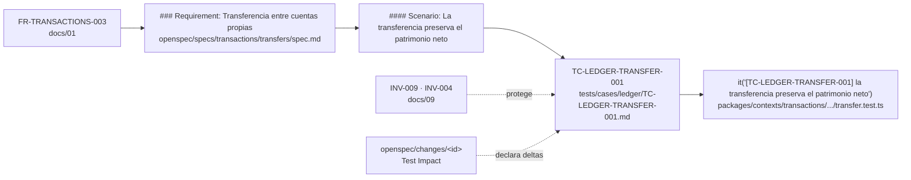
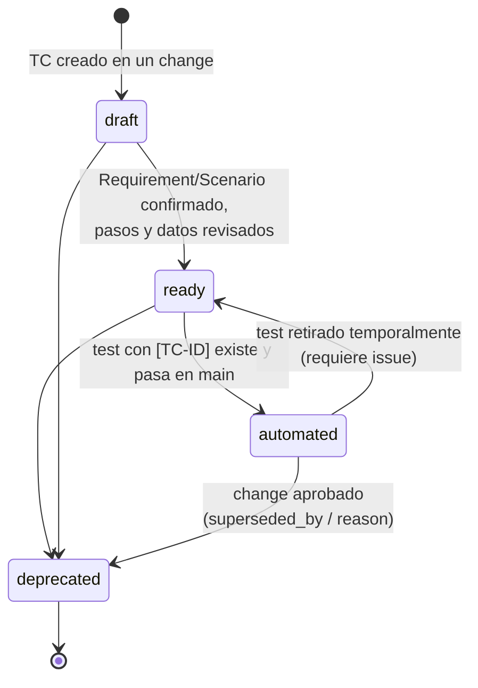
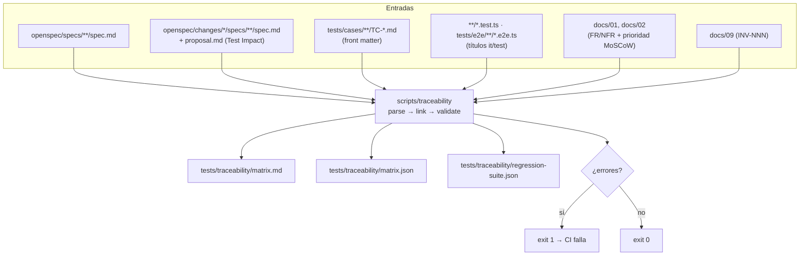

# 17 — Trazabilidad de tests (FR → Requirement → Scenario → TC → test)

> **Estado:** Propuesto · **Fecha:** 2026-10-01 · **Owner:** Principal Architect / QA Lead
> **Relacionado:** [ARCHITECTURE.md §12](./ARCHITECTURE.md#12-calidad-spec--test-traceability-adr-0016-adr-0024) · [01-functional-requirements.md](./01-functional-requirements.md) · [03-openspec-strategy.md](./03-openspec-strategy.md) · [09-ledger-design.md](./09-ledger-design.md) · [16-testing-strategy.md](./16-testing-strategy.md) · [23-ci-cd.md](./23-ci-cd.md) · [25-product-backlog.md](./25-product-backlog.md) · [ADR-0024](./adr/0024-spec-driven-development-with-openspec.md) · [tests/cases/README.md](../tests/cases/README.md)

---

## 1. Propósito

Garantizar que **cada comportamiento financiero exigido está especificado, tiene un caso de prueba y está automatizado**, y que se puede navegar en ambos sentidos: desde un requerimiento hasta el test que lo verifica, y desde un test fallido hasta el requerimiento y la invariante que protege. La capability OpenSpec correspondiente es `quality/test-traceability` ([ARCHITECTURE §14](./ARCHITECTURE.md#14-taxonomía-de-capabilities-openspec-openspecspecscontextcapabilityspecmd)).

## 2. La cadena



| Eslabón | Fuente | Identificador | Cardinalidad |
|---|---|---|---|
| FR / NFR | [01-functional-requirements.md](./01-functional-requirements.md) / [02-non-functional-requirements.md](./02-non-functional-requirements.md) | `FR-<CONTEXT>-NNN`, `NFR-<CAT>-NNN` | 1 FR → N Requirements |
| Requirement | `openspec/specs/<context>/<capability>/spec.md` (`### Requirement: <name>`) | `<capability path>#<requirement name>` | 1 Requirement → N Scenarios |
| Scenario | `#### Scenario: <name>` bajo el Requirement | `<capability path>#<requirement>/<scenario>` | 1 Scenario → 1..N TCs |
| Test case | `tests/cases/<context>/TC-*.md` | `TC-<CONTEXT>-<FEATURE>-NNN` | 1 TC → 0..N tests automatizados (0 solo si `manual`) |
| Test automatizado | `*.test.ts`, `*.e2e.ts`, … | TC-ID entre corchetes en el nombre | 1 test → 1..N TCs |
| Invariante | [09-ledger-design.md](./09-ledger-design.md) | `INV-NNN` | N:M con TCs |

## 3. Convenciones de IDs

Según [ARCHITECTURE §12](./ARCHITECTURE.md#12-calidad-spec--test-traceability-adr-0016-adr-0024):

- **TC:** `TC-<CONTEXT>-<FEATURE>-NNN`, regex `^TC-[A-Z]+-[A-Z0-9]+-\d{3}$`.
  - `CONTEXT` = código de contexto de §3 (`LEDGER`, `ACCOUNTS`, `TRANSACTIONS`, `CLASSIFICATION`, `FX`, `AUDIT`, `IDENTITY`, …). Se proponen además dos códigos **transversales** no listados en §3: `SECURITY` (autorización, RLS) y `PLATFORM` (entorno local, pipeline, arquitectura), alineados con las capabilities `security/*` y `platform/*` de §14. Ver Preguntas abiertas.
  - `FEATURE` = palabra corta en mayúsculas (`TRANSFER`, `BALANCE`, `MONEY`, `CONVERSION`…). Sin guiones dentro de `FEATURE`.
  - `NNN` correlativo por `CONTEXT-FEATURE`, nunca reutilizado (ni tras deprecación).
- **Directorio:** `tests/cases/<context-lowercase>/<TC-ID>.md` (p. ej. `tests/cases/ledger/TC-LEDGER-TRANSFER-001.md`).
- **Requirement:** se referencia por `spec` (capability path de §14) + `requirement` (nombre exacto tras `### Requirement:`). La comparación del generador normaliza mayúsculas y espacios.
- **Idioma:** los test cases, las specs de OpenSpec (nombres de Requirement y Scenario, texto normativo) y los nombres de los tests automatizados se escriben **en español**. Los IDs se mantienen como códigos (`TC-LEDGER-…`, `FR-…`, `INV-…`) y los identificadores de código fuente siguen en inglés; el glosario de lenguaje ubicuo de [04-domain-model.md](./04-domain-model.md) mapea español↔inglés. Ver §4.2 para la convención de OpenSpec.
- **Requerimientos provisionales:** mientras las specs de Phase 1 no estén escritas (se redactan tras el Design Gate), los TCs declaran `requirement_status: provisional` y `fr` provisional.

### 3.1 TC-ID en nombres de test

```ts
// Ilustrativo
describe('Transferencia entre cuentas propias', () => {
  it('[TC-LEDGER-TRANSFER-001] la transferencia preserva el patrimonio neto', () => { /* … */ });
});

// Varios TCs cubiertos por un mismo test
it('[TC-LEDGER-REVERSAL-001][TC-TRANSACTIONS-VOID-001] anular crea un asiento de reversa vinculado', …);

// Parametrizado: el TC-ID va en la plantilla del nombre
it.each(matrix)('[TC-SECURITY-RBAC-002] $role $operation → $expected', …);

// Playwright
test('[TC-TRANSACTIONS-CONVERSION-001] el usuario registra una conversión USDT→BOB', async ({ page }) => { … });
```

Reglas: el nombre del test se escribe en español; el TC-ID va al **inicio** del título del `it`/`test` (no en `describe`), entre corchetes; un test puede declarar varios TCs; un `describe` puede llevar un TC solo si **todos** sus `it` lo verifican (el generador lo propaga).

## 4. Formato del test case

Markdown con **YAML front matter** + cuerpo Gherkin en español (**Dado** / **Cuando** / **Entonces** / **Y**). Las claves del front matter y sus valores enumerados se mantienen en inglés porque se parsean. Plantilla: [tests/cases/_template.md](../tests/cases/_template.md). Guía de uso: [tests/cases/README.md](../tests/cases/README.md).

### 4.1 Schema del front matter (canónico)

Se materializará como `tests/cases/tc.schema.json` (JSON Schema 2020-12) cuando exista el generador; hasta entonces esta sección es la definición canónica.

```yaml
# JSON Schema expresado en YAML (ilustrativo, canónico para Phase 0)
$schema: https://json-schema.org/draft/2020-12/schema
title: PFOS Test Case front matter
type: object
additionalProperties: false
required: [id, title, spec, requirement, requirement_status, fr, invariants, priority, type, level,
           automation_status, status, preconditions, input, steps, expected_result]
properties:
  id:                 { type: string, pattern: '^TC-[A-Z]+-[A-Z0-9]+-\d{3}$' }
  title:              { type: string, minLength: 10, maxLength: 140 }   # español, se reutiliza como nombre del test
  spec:               { type: string, pattern: '^[a-z-]+/[a-z0-9-]+$' } # capability path de ARCHITECTURE §14
  related_specs:      { type: array, items: { type: string, pattern: '^[a-z-]+/[a-z0-9-]+$' } }
  requirement:        { type: string }                                   # nombre exacto del ### Requirement
  scenario:           { type: [string, 'null'] }                         # nombre del #### Scenario (cuando exista)
  requirement_status: { enum: [provisional, confirmed] }
  fr:                 { type: array, items: { type: string, pattern: '^FR-[A-Z]+-\d{3}$' } }
  nfr:                { type: array, items: { type: string, pattern: '^NFR-(SEC|PERF|REL|OBS|PORT|MAINT|USAB|DATA|COMP)-\d{3}$' } }
  invariants:         { type: array, items: { type: string, pattern: '^INV-\d{3}$' } }
  priority:           { enum: [critical, high, medium, low] }
  type:               { enum: [unit, domain, property, integration, api, e2e, security, platform] }
  level:              { enum: [unit, domain, application, repository-integration, database-integration, api,
                               contract, event-contract, migration, import, container-integration, e2e,
                               property, security, performance, smoke, architecture] }
  automation_status:  { enum: [not_automated, automated, manual] }
  automated_tests:    { type: array, items: { type: string } }   # rutas de archivo; lo rellena/verifica el generador
  status:             { enum: [draft, ready, automated, deprecated] }
  regression_suite:   { type: boolean, default: false }
  phase:              { type: integer, minimum: 0, maximum: 10 }
  tags:               { type: array, items: { type: string } }
  preconditions:      { type: array, items: { type: string } }
  input:              { type: [object, array, string] }
  steps:              { type: array, items: { type: string }, minItems: 1 }
  expected_result:    { type: array, items: { type: string }, minItems: 1 }
  error_code:         { type: [string, 'null'] }                 # code RFC 9457 esperado, p. ej. LEDGER_UNBALANCED_ENTRY
  deprecated_by_change: { type: [string, 'null'] }
  superseded_by:      { type: array, items: { type: string, pattern: '^TC-[A-Z]+-[A-Z0-9]+-\d{3}$' } }
  deprecation_reason: { type: [string, 'null'] }
  created:            { type: string, format: date }
  updated:            { type: string, format: date }
allOf:
  - if: { properties: { status: { const: automated } } }
    then: { properties: { automation_status: { const: automated } } }
  - if: { properties: { status: { const: deprecated } } }
    then: { required: [deprecated_by_change, deprecation_reason] }
  - if: { properties: { automation_status: { const: manual } } }
    then: { properties: { status: { enum: [ready, deprecated] } } }
```

**Reglas adicionales (no expresables en JSON Schema, las verifica el generador):** el `id` coincide con el nombre de archivo; el directorio coincide con el `CONTEXT` en minúsculas; `title` en español (no se valida el idioma por heurística: un título sin tildes es válido); al menos un `fr` o un `nfr`.

### 4.2 Convención de idioma en specs de OpenSpec

Las specs se escriben en español, con estas excepciones impuestas por el CLI (verificado con OpenSpec 1.14.0, incluido `openspec archive`):

- **Palabras clave estructurales en inglés**, porque el CLI las parsea: `## Purpose`, `## Requirements`, `### Requirement:`, `#### Scenario:`, `## ADDED Requirements` / `## MODIFIED Requirements` / `## REMOVED Requirements` / `## RENAMED Requirements`.
- **Texto normativo con "DEBE (MUST)" / "NO DEBE (MUST NOT)"**, porque `openspec validate --strict` exige `SHALL`/`MUST` en cada Requirement.
- **Pasos del Scenario** como viñetas `- **CUANDO** …` / `- **ENTONCES** …` / `- **Y** …`.

```markdown
### Requirement: Transferencia entre cuentas propias
El sistema DEBE (MUST) registrar una transferencia entre cuentas propias de la misma moneda como un único asiento balanceado, sin postings de INCOME ni EXPENSE.

#### Scenario: La transferencia preserva el patrimonio neto
- **CUANDO** el usuario transfiere 300.00 BOB de "Bank A" (saldo 1000.00 BOB) a "Bank B" (saldo 0.00 BOB)
- **ENTONCES** el saldo de "Bank A" es 700.00 BOB y el de "Bank B" es 300.00 BOB
- **Y** el patrimonio neto sigue siendo 1000.00 BOB
```

## 5. Ciclo de vida de un TC



| Estado | Significado | Requisitos |
|---|---|---|
| `draft` | Intención capturada; puede depender de un requirement provisional | Front matter válido |
| `ready` | Listo para automatizar (o ejecutable manualmente si `automation_status: manual`) | `requirement_status: confirmed`; Requirement existe en specs o en un change activo |
| `automated` | Al menos un test automatizado con su TC-ID existe y pasa | `automation_status: automated`; el generador encuentra el test |
| `deprecated` | Ya no aplica | `deprecated_by_change`, `deprecation_reason`, `superseded_by` si hay reemplazo |

**Reglas de deprecación:**
1. El archivo del TC **no se borra**: queda como registro histórico; el ID nunca se reutiliza.
2. Solo se depreca mediante un change de OpenSpec que lo declare en `TEST CASES DEPRECATED`.
3. El test automatizado se elimina o se renombra al TC sucesor **en el mismo PR**; un test con un TC-ID `deprecated` hace fallar el gate.
4. TCs `critical` o con `invariants` requieren aprobación explícita del owner en el change, y la invariante debe seguir cubierta por otro TC activo (el generador lo verifica: **toda invariante `INV-001..INV-020` tiene ≥ 1 TC no deprecado**).

## 6. Generador de trazabilidad (planificado)

Ubicación: `scripts/traceability/` (TypeScript, cross-platform, ejecutado con `pnpm traceability` vía `tsx`). Sin implementación en Phase 0.



### 6.1 Parsing

| Fuente | Técnica |
|---|---|
| Specs y deltas | Parser Markdown (remark) — `### Requirement:` y `#### Scenario:`; en changes, secciones `## ADDED/MODIFIED/REMOVED/RENAMED Requirements` (palabras clave estructurales en inglés, ver §4.2). Los pasos del Scenario se reconocen por las viñetas en español `- **CUANDO**`, `- **ENTONCES**`, `- **Y**` (no `WHEN`/`THEN`); el generador no depende de ellas para enlazar TCs, solo del nombre del Requirement/Scenario |
| Prioridad del Requirement | Línea de metadatos bajo el Requirement, p. ej. `Trace: FR-LEDGER-001 · Priority: Must` (formato a confirmar en [03-openspec-strategy.md](./03-openspec-strategy.md)); fallback: prioridad MoSCoW del FR en docs/01 |
| TCs | `gray-matter` + validación con el JSON Schema (§4.1) vía Ajv |
| Tests | Escaneo estático con el compilador de TypeScript (AST): llamadas `it`/`test`/`describe` (incl. `.each`, `.only`, `.skip`) con literal o template; regex `\[(TC-[A-Z]+-[A-Z0-9]+-\d{3})\]` |
| Estado de ejecución (opcional) | Reporte JUnit/JSON de Vitest y Playwright del job actual para marcar `pass/fail/skip` |

### 6.2 Reglas de validación (fallan CI)

| # | Regla | Severidad |
|---|---|---|
| R1 | TC que referencia un `spec`/`requirement` inexistente (ni en specs ni en un change activo) | **Error** (warning si `requirement_status: provisional` y estamos antes del cierre de Phase 1 specs) |
| R2 | Requirement con prioridad **Must** sin ningún TC no deprecado | **Error** |
| R3 | TC `status: automated` (o `automation_status: automated`) sin test que contenga su ID | **Error** |
| R4 | Test con un TC-ID que no existe en `tests/cases` | **Error** |
| R5 | Test con un TC-ID `deprecated` | **Error** |
| R6 | Front matter inválido según schema, ID ≠ nombre de archivo, directorio ≠ contexto | **Error** |
| R7 | Invariante `INV-NNN` sin ningún TC activo, para invariantes cuyo contexto ya está en una fase iniciada (INV-013 desde Phase 3, INV-014 desde el primer import, INV-016/INV-018 desde Phase 4) | **Error** |
| R8 | TC-ID duplicado | **Error** |
| R9 | TC `ready` sin test durante más de N días / tests marcados `skip` con TC `critical` | Warning |
| R10 | Change sin sección **Test Impact** o que lista TCs inexistentes | **Error** |

Ilustrativo:

```ts
// scripts/traceability/src/rules.ts (ilustrativo)
export const mustRequirementWithoutTc: Rule = (g) =>
  g.requirements
    .filter((r) => r.priority === 'Must' && !g.tcs.some((tc) => tc.status !== 'deprecated' && tc.links(r)))
    .map((r) => error('R2', `Must requirement "${r.spec}#${r.name}" has no active test case`));
```

### 6.3 Salidas

- `tests/traceability/matrix.md`: tabla legible (commit en cada release; en PR se adjunta como artefacto y comentario resumen).
- `tests/traceability/matrix.json`: grafo completo para dashboards y para el backlog ([25-product-backlog.md](./25-product-backlog.md) referencia TC-IDs).
- `tests/traceability/regression-suite.json`: lista de TCs `regression_suite: true` con sus tests (base de la Financial Regression Suite, [16-testing-strategy.md §11.3](./16-testing-strategy.md)).

### 6.4 Progresión del gate

- **Phase 0:** solo R6 y R8 (schema e IDs) — no hay specs de Phase 1 ni tests.
- **Phase 1 (tras Design Gate):** R1–R8 y R10 bloqueantes; R1 tolera `provisional` hasta que las specs de la capability se archiven.
- **Phase 2+:** todas; R9 como warning reportado en el PR.

## 7. Ejemplo de matriz

| FR | Spec / Requirement | Scenario | TC | INV | Prioridad | Estado TC | Test automatizado | Resultado |
|---|---|---|---|---|---|---|---|---|
| FR-TRANSACTIONS-003 | `transactions/transfers` / Transferencia entre cuentas propias | La transferencia preserva el patrimonio neto | TC-LEDGER-TRANSFER-001 | INV-009, INV-004 | critical | automated | `packages/contexts/transactions/src/application/record-transfer.test.ts` | pass |
| FR-LEDGER-001 | `ledger/journal-posting` / Asientos balanceados por moneda | Se rechaza un asiento desbalanceado | TC-LEDGER-BALANCE-001 | INV-004 | critical | automated | `packages/contexts/ledger/src/domain/journal-entry.test.ts` | pass |
| FR-LEDGER-001 | `ledger/journal-posting` / Asientos balanceados por moneda | La BD rechaza un asiento desbalanceado | TC-LEDGER-BALANCE-002 | INV-004 | critical | ready | — | — |
| FR-TRANSACTIONS-004 | `transactions/conversions` / Conversión de moneda con comisiones | USDT a BOB con comisión | TC-TRANSACTIONS-CONVERSION-001 | INV-002, INV-004, INV-011 | critical | draft | — | — |
| NFR-SEC-001 (provisional) | `security/access-control` / Aislamiento de datos por workspace | La lectura entre workspaces no devuelve nada | TC-SECURITY-RLS-001 | — | critical | draft | — | — |

En Phase 0 todos los TCs del catálogo inicial están en `draft` / `not_automated`.

## 8. Changes de OpenSpec y deltas de TCs

Todo change declara su impacto en tests (ver [16-testing-strategy.md §11](./16-testing-strategy.md) y [03-openspec-strategy.md](./03-openspec-strategy.md)):

```markdown
<!-- openspec/changes/add-crypto-network-fees/proposal.md (ilustrativo) -->
## Test Impact
- TEST CASES ADDED:
  - TC-TRANSACTIONS-CONVERSION-002 — BTC→USDT con comisión de red en BTC
- TEST CASES MODIFIED:
  - TC-FX-PRICING-001 — la tasa efectiva ahora excluye las comisiones de red pagadas en la moneda de origen
- TEST CASES DEPRECATED:
  - ninguno
- REGRESSION IMPACT:
  - Financial Regression Suite: conversiones (INV-004, INV-011); propiedad de balance de comprobación del ledger (TC-LEDGER-BALANCE-003)
```

- Los archivos de TC nuevos o modificados se incluyen **en el mismo PR** que el change (en `tests/cases/`), con `status: draft` → `ready` al aprobarse el change.
- `tasks.md` del change incluye una tarea por TC a automatizar (`- [ ] Automatizar TC-TRANSACTIONS-CONVERSION-002`).
- Al archivar el change (`openspec archive`), el generador exige que los TCs `ADDED` estén `automated` (o `manual` justificado).

## 9. Preguntas abiertas

1. **Códigos de contexto transversales:** `SECURITY` y `PLATFORM` no están en [ARCHITECTURE §3](./ARCHITECTURE.md#3-bounded-contexts-nombres-canónicos); ¿se aceptan como códigos de TC/FR transversales (alineados con capabilities `security/*`, `platform/*`) o se reasignan (p. ej. `TC-IDENTITY-RLS-*`)?
2. **Money / shared-kernel:** no tiene código de contexto; provisionalmente `TC-LEDGER-MONEY-*`. ¿Se crea un código `KERNEL`?
3. **Prioridad Must en specs:** ¿el formato de la línea `Trace: … · Priority: …` bajo cada Requirement lo fija [03-openspec-strategy.md](./03-openspec-strategy.md)? Sin él, R2 depende de docs/01.
4. **Capabilities anidadas** (`openspec/specs/<context>/<capability>/spec.md`): confirmar en SPIKE-01 que `openspec validate --strict` las soporta; si no, el generador debe mapear `ledger/journal-posting` ↔ `ledger-journal-posting`.
5. ¿Se publica la matriz como artefacto de CI únicamente o también como página (GitHub Pages) por release?
