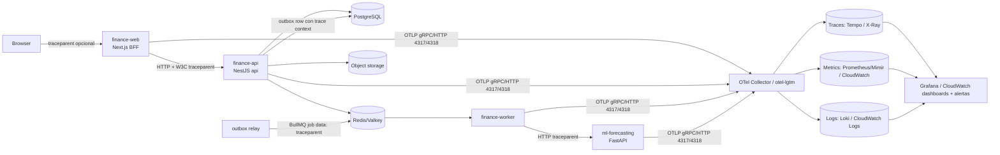

# 18 — Observabilidad

> **Estado:** Propuesto · **Fecha:** 2026-10-01 · **Relacionado:** [ARCHITECTURE.md](ARCHITECTURE.md) (§5, §7, §10, §15 SPIKE-10), [07-c4-architecture.md](07-c4-architecture.md), [12-security.md](12-security.md), [13-import-architecture.md](13-import-architecture.md), [14-reporting.md](14-reporting.md), [15-ml-architecture.md](15-ml-architecture.md), [19-local-development.md](19-local-development.md), [21-cloud-deployment-options.md](21-cloud-deployment-options.md), ADR-0020 (observability), ADR-0008 (outbox)
>
> **Capability OpenSpec:** `platform/observability`. NFR: `NFR-OBS-*`.

---

## 1. Objetivos

1. Poder responder **"¿qué pasó con esta operación?"** de punta a punta (navegador → BFF → API → outbox → worker → ML) con un `trace_id`.
2. Detectar fallos silenciosos propios de un sistema financiero asíncrono: **outbox atascado, proyecciones divergentes, imports fallidos, jobs muertos**.
3. **No filtrar datos financieros ni personales** en telemetría.
4. **No sobrecargar el MVP**: Phase 1 = logs estructurados + health checks + trazas básicas opcionales; el resto crece por fase (§10).
5. Vendor-neutral: **OpenTelemetry** (SDK + OTLP) en todos los procesos; backend intercambiable (otel-lgtm local, CloudWatch/ADOT o Grafana Cloud en cloud).


> **Hallazgos de SPIKE-10 (2026-10-02), obligatorios en la implementación:** (1) `OTEL_NODE_RESOURCE_DETECTORS=env,os,serviceinstance` por defecto — los detectores por defecto adjuntan usuario de SO, hostname y argumentos del proceso a toda la telemetría (fuga de PII); (2) NestJS 12 es solo ESM: el SDK se carga con `node --import ./otel.mjs` registrando el hook de `import-in-the-middle`; (3) `instrumentation-nestjs-core` no soporta Nest 12 → interceptor propio que fija `http.route`; (4) desactivar instrumentaciones express/router (~30 spans de ruido por request); (5) el `traceparent` viaja en el payload del job/outbox; (6) costo medido: +3 ms p50 / +9–15 ms p99 a 100 req/s, ~70 MiB por proceso; `otel-lgtm` 0.34.0 pesa 3.66 GB y usa 0.4–1.1 GiB — mantenerlo solo en el profile `observability`. Evidencia: [spikes/SPIKE-10-observability](../spikes/SPIKE-10-observability/README.md).

## 2. Componentes instrumentados



| Proceso | Traces | Metrics | Logs |
|---|---|---|---|
| `finance-web` (Next.js BFF) | `@vercel/otel` o `@opentelemetry/sdk-node` en `instrumentation.ts`; spans de route handlers y fetch al API | Web vitals agregados (opcional), RED de rutas BFF | pino JSON (server) |
| `finance-api` (Nest, cmd api) | `@opentelemetry/sdk-node` + auto-instrumentations (http, pg, ioredis, aws-sdk) + spans manuales por **use case** | RED por endpoint, pool PG, negocio | pino JSON (`nestjs-pino`) |
| `finance-worker` (cmd worker) | Spans por job BullMQ (contexto propagado desde el outbox), por handler de evento | Colas, outbox, proyecciones, imports | pino JSON |
| `ml-forecasting` (FastAPI) | `opentelemetry-instrumentation-fastapi` | Duración/errores de forecast, métricas de modelo | `structlog`/`python-json-logger` con el mismo esquema de campos |

Inicialización: el SDK OTel se carga **antes** que Nest/Next (`--import ./otel.js` / `instrumentation.ts`). La instrumentación vive en `@pf/platform/observability` (nunca en `domain`, ARCHITECTURE §6). Los use cases se instrumentan con un decorador/wrapper en la capa `application` vía un puerto `Tracer` neutral (sin importar OTel en el dominio).

## 3. Logs estructurados (pino JSON)

### 3.1 Esquema de campos

| Campo | Ejemplo | Notas |
|---|---|---|
| `time` | `2026-10-01T14:03:22.123Z` | ISO UTC |
| `level` | `info` | `trace/debug/info/warn/error/fatal` |
| `msg` | `transaction recorded` | Mensaje estable (en inglés, para búsquedas) |
| `service.name` | `finance-api` | Recurso OTel; también `service.version` (`sha-…`), `deployment.environment` |
| `process.role` | `api` \| `worker` \| `web` \| `ml` | |
| `trace_id`, `span_id`, `trace_flags` | `4bf92f…` | Inyectados por la integración pino-OTel → correlación log↔trace |
| `request_id` | `01J…` | `X-Request-Id` entrante (si viene del BFF) o generado; devuelto en la respuesta |
| `correlation_id` | `01J…` | Del envelope de eventos (ARCHITECTURE §7); igual al `request_id` del comando origen |
| `causation_id` | | id del evento/comando causante |
| `workspace_id` | UUID | **Permitido** (ID opaco). Útil para soporte/RLS debugging |
| `actor_id` | UUID usuario | ID opaco; **nunca email/nombre** |
| `http.method`, `http.route`, `http.status_code`, `duration_ms` | `POST`, `/api/v1/workspaces/:ws/transactions` | **Ruta plantilla**, no URL con IDs/query |
| `use_case` | `RecordTransaction` | |
| `event_type`, `event_id` | `transactions.TransactionPosted.v1` | En consumers |
| `job.queue`, `job.id`, `job.attempt` | `imports.persist`, `…:3`, `2` | En worker |
| `error.code`, `error.type`, `error.stack` | `LEDGER_UNBALANCED_ENTRY` | Stack solo en `error` y sin valores |
| `import_job_id`, `row_number` | | Imports |

### 3.2 Higiene de datos financieros (obligatoria)

**Nunca** en logs, atributos de span ni labels de métricas:

- montos, saldos, tasas personales, descripciones/glosas, notas, nombres de counterparties, nombres de cuentas, números de cuenta/tarjeta (ni enmascarados), contenido de archivos importados, datos de documentos;
- tokens, cookies, `Authorization`, API keys de proveedores, presigned URLs, secretos;
- emails, nombres, IPs completas (IP truncada /24 solo en logs de seguridad, ver 12-security.md);
- payloads completos de requests/responses o de eventos.

Mecanismos:

1. **pino `redact`** con lista de rutas (`req.headers.authorization`, `req.headers.cookie`, `*.amount`, `*.balance`, `*.description`, `*.note`, `*.accountNumber`, `*.token`, `*.password`, `*.apiKey`, `body`, …) con `censor: '[REDACTED]'`.
2. **Serializers allow-list**: los logs de request solo emiten campos de la tabla §3.1; no se loguea `body`.
3. Spans: desactivar captura de bodies/headers en auto-instrumentación; `db.statement` **sanitizado** (parámetros como `$1`, nunca valores) — configuración `enhancedDatabaseReporting: false`.
4. **Lint/test**: test de integración que ejecuta un flujo con montos/descripciones "canario" (`CANARY-7731.42`) y falla si aparecen en la salida de logs o spans exportados (exporter en memoria).
5. Datos de auditoría (quién cambió qué monto) van al **AuditLog** en BD (ARCHITECTURE §7), no a logs.
6. Niveles: `info` en prod; `debug` solo local; nunca `trace` en prod. Logs de error de validación de dominio son `warn` (esperables), no `error`.

### 3.3 Correlación

- **BFF** genera `X-Request-Id` (UUIDv7) y propaga `traceparent` (W3C) al API.
- **API**: el `correlationId` de los eventos de dominio emitidos = `request_id`; el outbox guarda `trace_context` (`traceparent`) en la fila.
- **Relay** copia `traceparent` a los datos del job BullMQ; el **worker** crea un span hijo (o un *link* si el job se procesa mucho después — recomendado: span nuevo con **link** al span origen para no generar trazas de horas).
- **ML**: el worker propaga `traceparent` en la llamada HTTP.
- Respuestas de error RFC 9457 incluyen `instance` con el `request_id` para soporte; nunca el stack.

## 4. Trazas

- Spans manuales: `usecase.<Name>`, `ledger.post_entry`, `outbox.relay.batch`, `projection.<name>.apply`, `import.stage.<stage>`, `forecast.run`.
- Atributos permitidos: ids opacos, conteos (`import.rows_total`), códigos, nombres de cola/evento. Prohibidos: los de §3.2.
- **Sampling**: local 100 %; prod **parent-based + ratio 10 %** para requests OK + **tail sampling** en collector (100 % de trazas con error o duración > 1 s) cuando el backend lo soporte. Jobs de import/forecast: 100 % (bajo volumen, alto valor).

## 5. Catálogo de métricas

Nombres OTel (semantic conventions donde existen); unidades explícitas. **Labels de baja cardinalidad**: nunca `workspace_id`, `user_id`, `transaction_id` como label (en un futuro multi-usuario explotaría la cardinalidad y expondría actividad por usuario); esos van a trazas/logs.

### 5.1 HTTP (RED por endpoint)

| Métrica | Tipo | Labels |
|---|---|---|
| `http.server.request.duration` (s) | Histogram | `http.request.method`, `http.route`, `http.response.status_code`, `service.name` |
| `http.server.active_requests` | UpDownCounter | `http.route` |
| `http.client.request.duration` (BFF→API, worker→ML) | Histogram | `server.address`, `http.response.status_code` |
| `api.problem.total` | Counter | `code` (código de dominio RFC 9457, p. ej. `PERIOD_CLOSED`) |

Rate = conteo del histograma; Errors = status ≥ 500 (4xx contabilizados aparte; 409/422 de dominio no son errores del servicio); Duration = p50/p95/p99.

### 5.2 Base de datos y caché

`db.client.connection.count` (state used/idle), `db.client.connection.wait_time`, `db.client.operation.duration` (por operación, no por query text), `pf.db.rls_context_missing.total` (debe ser 0), `pf.cache.requests.total{result=hit|miss}`.

### 5.3 Async: outbox, colas y jobs

| Métrica | Tipo | Descripción |
|---|---|---|
| `pf.outbox.pending` | Gauge | Filas no publicadas (NFR-OBS-004 `outbox_pending`); leídas de PostgreSQL, no de las estadísticas cacheadas de pg-boss |
| `pf.outbox.lag` (s) | Gauge | `now − min(created_at)` de filas pendientes — **métrica clave** (Prometheus: `pf_outbox_lag_seconds`; NFR-OBS-004 `outbox_lag_seconds`) |
| `pf.outbox.published` | Counter | `event_type` (Prometheus: `pf_outbox_published_total`) |
| `pf.outbox.publish_failures` | Counter | lotes del relay fallidos |
| `pf.inbox.duplicates` | Counter | `consumer` — eventos duplicados descartados (sano si > 0, alarmante si se dispara) |
| `pf.events.dead_lettered` | Counter | `consumer` — eventos que agotaron sus reintentos |
| `pf.events.consumer.backlog` | Gauge | `consumer` — eventos publicados aún sin procesar (en la cola, en reintento o en curso) por consumidor, leídos de PostgreSQL (`pgboss.job`); 0 sin pendientes (NFR-OBS-004 `event_consumer_backlog`; Prometheus: `pf_events_consumer_backlog`). Sin etiquetas de workspace, usuario ni agregado |
| `pf.events.consumer.duration` (s) | Histogram | `consumer` — duración del procesamiento de un evento (transacción con inbox y efecto del handler) con cualquier resultado (NFR-OBS-004 `event_consumer_duration_seconds`; Prometheus: `pf_events_consumer_duration_seconds`) |
| `pf.queue.depth` | Gauge | `queue`, `state` (waiting/active/delayed/failed) |
| `pf.queue.job.wait_time` (s) | Histogram | `queue` — de encolado a inicio |
| `pf.queue.job.duration` (s) | Histogram | `queue`, `outcome` (completed/failed/retried) |
| `pf.queue.job.failures.total` | Counter | `queue`, `error_class` (transient/domain/unexpected) |
| `pf.queue.dead_letter` | Gauge | Dead-letters abiertos (`platform.dead_letter` con `status = OPEN`) |
| `pf.worker.heartbeat` | Gauge (timestamp) | Último latido por proceso worker |
| `pf.scheduler.last_run` | Gauge (timestamp) | `job` (month-close reminders, recurrence expansion, consistency check) |

### 5.4 Negocio / dominio

| Métrica | Tipo | Labels |
|---|---|---|
| `pf.ledger.entries_posted.total` | Counter | `kind` (income/expense/transfer/conversion/adjustment/reversal) |
| `pf.ledger.posting_failures.total` | Counter | `code` (`LEDGER_UNBALANCED_ENTRY`, `PERIOD_CLOSED`) |
| `pf.ledger.unbalanced_detected.total` | Counter | **Debe ser 0** (constraint trigger) — alerta inmediata |
| `pf.reporting.projection_lag` (s) | Gauge | `projection` |
| `pf.reporting.projection_drift.total` | Counter | `projection` — divergencias detectadas por el job de consistencia (14-reporting.md §2.1) |
| `pf.imports.jobs.total` | Counter | `source`, `outcome` (completed/with_difference/partially_failed/failed/cancelled) |
| `pf.imports.rows.total` | Counter | `source`, `classification` (new/duplicate_exact/duplicate_probable/invalid) |
| `pf.imports.throughput` (rows/s) | Histogram | `source`, `stage` |
| `pf.imports.stage.duration` (s) | Histogram | `stage` |
| `pf.imports.reconciliation_difference.total` | Counter | `source` (solo conteo; nunca el monto) |
| `pf.banking.sync.failures.total` | Counter | `provider`, `reason` |
| `pf.fx.rate_missing.total` | Counter | `pair` — consultas sin tasa disponible |
| `pf.ml.forecast.duration` (s) | Histogram | `outcome` |
| `pf.ml.forecast.failures.total` | Counter | `reason` (timeout/unavailable/invalid_output) |
| `pf.ml.forecast.insufficient_data.total` | Counter | |
| `pf.ml.forecast.mase` | Gauge | `scope_type` (total/category/account), agregado sin ids |
| `pf.auth.login_failures.total` | Counter | `reason` |
| `pf.audit.write_failures.total` | Counter | **Debe ser 0** |
| `pf.authz.denied` | Counter | `code` (`INSUFFICIENT_ROLE`/`WORKSPACE_ACCESS_DENIED`; Prometheus: `pf_authz_denied_total`). Cada rechazo de autorización, se audite o no (nunca usuario ni workspace) |
| `pf.authz.denial_audit_failures` | Counter | Falló la escritura de auditoría de un rechazo (el rechazo sigue siendo 403; Prometheus: `pf_authz_denial_audit_failures_total`). **Debe ser 0** |

## 6. Health checks

Consistente con ARCHITECTURE §10.

| Endpoint | Proceso | Semántica | Checks |
|---|---|---|---|
| `GET /health/live` | api, worker (puerto interno de admin, p. ej. 9464), web, ml | El proceso está vivo y el event loop responde. **Sin dependencias** (no reiniciar el contenedor porque PG cayó). | event loop lag < 1 s |
| `GET /health/ready` | api | Puede atender tráfico | PG (`SELECT 1` con timeout 1 s, y migraciones en versión esperada), Redis (`PING`), object storage (`HeadBucket`), Keycloak JWKS cacheado (no bloqueante: degraded) |
| `GET /health/ready` | worker | Puede procesar jobs | PG, Redis, conexión BullMQ activa, no en shutdown |
| `GET /health/ready` | ml | Modelos cargables, librerías OK | Import de dependencias, acceso a Object Storage (prefijo ml) |
| `GET /api/health` | web (BFF) | | API `/health/ready` alcanzable (degraded si no) |

- Respuesta: `200 {"status":"ok","checks":{"postgres":{"status":"up","latencyMs":3},…}}` o `503` con `status: "down"`. Detalle de checks solo en red interna; externamente solo status.
- Los checks se ejecutan con timeouts estrictos y caché de 2–5 s para no amplificar carga.
- Compose: `healthcheck` usa `/health/ready` para `finance-api` (`depends_on: condition: service_healthy`). ECS: health check de contenedor → `/health/live`; target group del ALB → `/health/ready`.
- Shutdown: al recibir SIGTERM, `ready` pasa a 503 inmediatamente, se drenan requests/jobs (timeout 25 s) y luego se cierra.

## 7. Monitoreo de jobs (BullMQ)

- Métricas §5.3 exportadas por un collector interno en el worker (lectura periódica de `getJobCounts()` cada 15 s, una sola instancia vía lock).
- **Bull Board** (UI) montado en `finance-api` **solo** en entornos no productivos o tras autenticación de rol admin y red interna; nunca público.
- Eventos `failed` con `attemptsMade = attempts` → log `error` + incremento `pf.queue.job.failures.total{error_class="unexpected"}`.
- Jobs programados (repeatable): registrar `pf.scheduler.last_run`; alerta si no corrió en 2× su intervalo ("dead man's switch").
- Outbox relay: un único líder (advisory lock PG); métrica de líder activo.

## 8. Alertas (básicas)

| Alerta | Condición | Severidad | Fase |
|---|---|---|---|
| API caída | `/health/ready` falla 3 checks seguidos (1 min) | crítica | 1 (prod) |
| Error rate 5xx | > 2 % de requests en 5 min (mín. 20 requests) | alta | 1 |
| Latencia | p95 > 1 s en rutas de escritura financiera por 10 min | media | 2 |
| **Outbox lag** | `pf.outbox.lag` > 60 s por 5 min | alta | 1 |
| Worker sin latido | `pf.worker.heartbeat` > 2 min | alta | 1 |
| Jobs fallidos | `pf.queue.dead_letter` > 0 (nuevo) | media | 2 |
| **Ledger desbalanceado** | `pf.ledger.unbalanced_detected.total` incrementa | crítica | 1 |
| Audit write failure | > 0 | crítica | 1 |
| Projection drift | > 0 en 24 h | media | 7 |
| Import fallido técnico | `outcome="failed"` | baja (notificación) | 6 |
| ML forecast falla | 3 runs seguidos fallidos | baja | 8 |
| Scheduler perdido | `last_run` > 2× intervalo | media | 2 |
| Disco/BD | uso storage > 80 %, conexiones > 80 % del pool | media | 1 (cloud) |
| Certificados / backups | backup diario no completado | alta | 1 (prod), ver 22/23 |

Canal: email (SES/Mailpit en local) o push al owner; para un equipo de 1 persona, evitar paging nocturno salvo críticas. Cada alerta enlaza a un **runbook** (runbooks en `docs/runbooks/`, a crear en el Hito H; ver [30-backup-and-disaster-recovery.md](30-backup-and-disaster-recovery.md)).

## 9. Entornos

### 9.1 Local — profile `observability`

ARCHITECTURE §10: servicio `otel-lgtm` (`grafana/otel-lgtm`), puertos 3001 (Grafana), 4317/4318 (OTLP). Opcional: `pnpm stack:up -- --profile observability`.

```yaml
# ilustrativo — deploy/compose/compose.yaml (fragmento)
otel-lgtm:
  image: grafana/otel-lgtm:<pinned>
  profiles: [observability]
  ports: ["3001:3000", "4317:4317", "4318:4318"]
finance-api:
  environment:
    OTEL_SERVICE_NAME: finance-api
    OTEL_EXPORTER_OTLP_ENDPOINT: http://otel-lgtm:4318
    OTEL_SDK_DISABLED: ${OTEL_SDK_DISABLED:-true}   # true si el profile no está activo
    LOG_LEVEL: debug
```

- Sin el profile: `OTEL_SDK_DISABLED=true` y logs pino a stdout (con `pino-pretty` solo en dev host, nunca en imagen).
- Dashboards provisionados como JSON en `deploy/compose/observability/dashboards/` (RED API, colas/outbox, imports, ledger).
- SPIKE-10 valida: correlación trace↔log en Grafana (Tempo ↔ Loki por `trace_id`), propagación por BullMQ.

### 9.2 Cloud (ver 21-cloud-deployment-options.md)

| Opción | Composición | Pros | Contras |
|---|---|---|---|
| **A. CloudWatch + ADOT** (recomendada con ECS/Fargate, ADR-0013) | Sidecar ADOT Collector en la task → X-Ray (traces), CloudWatch Metrics (EMF), CloudWatch Logs (awslogs/FireLens) | Nativo, IAM, sin otro proveedor, free tier | UX de consultas inferior a Grafana; costos de custom metrics por dimensión (mantener cardinalidad baja) |
| **B. Grafana Cloud** | Collector OTel → OTLP endpoint de Grafana Cloud | Misma UX que local (otel-lgtm), free tier generoso | Datos fuera de AWS (revisar privacidad — telemetría ya está sanitizada), otra cuenta/secreto |
| Plan B Cloud Run | Cloud Trace/Logging/Monitoring vía OTel | | |

Recomendación: el código emite **solo OTLP**; la elección del backend es config del collector. Arrancar con A por costo/simplicidad; migrar a B si la UX lo justifica.

## 10. Adopción progresiva por fase

| Fase | Entregable de observabilidad |
|---|---|
| **1 (MVP)** | pino JSON con esquema §3.1 y redact; `request_id` + `correlation_id`; `/health/live` y `/health/ready`; métricas mínimas: RED HTTP, `pf.outbox.lag`, `pf.queue.depth`, `pf.ledger.unbalanced_detected.total`, `pf.audit.write_failures.total`; trazas OTel habilitadas pero opcionales (profile `observability`); test canario de higiene de logs. Alertas: API caída, 5xx, outbox lag, worker heartbeat, ledger desbalanceado. |
| 2–3 | Métricas de colas/jobs completas, scheduler dead-man switch, dashboards provisionados, Bull Board interno, latencia p95. |
| 5 | Métricas de FX providers (`pf.fx.rate_missing`, fallos de provider). |
| 6 | Métricas y trazas de imports por etapa, banking sync. |
| 7 | Projection lag/drift, caché, SLOs formales con error budget. |
| 8 | Instrumentación ML (FastAPI), métricas de forecast y calidad (MASE, coverage). |
| 10 | Telemetría del asistente IA: tokens, costo, latencia, tool calls, rechazos de autorización (sin prompts con datos en logs; ver 27-ai-assistant-roadmap.md). |

## 11. SLOs (producción)

Uso personal: SLOs modestos, medidos en ventana de 30 días. Sirven para decidir prioridades, no para paging agresivo.

| SLI | SLO | Medición |
|---|---|---|
| Disponibilidad API (requests no-5xx / total, excluyendo `/health`) | **99.5 %** (≈ 3.6 h/mes de error budget) | `http.server.request.duration` count por status |
| Latencia escrituras financieras (POST transactions/transfers/conversions) | 95 % < **500 ms** | histograma por ruta |
| Latencia lecturas dashboard | 95 % < **800 ms** | |
| Frescura de proyecciones (outbox → read model) | 99 % de eventos aplicados < **30 s** | `pf.outbox.lag` + `projection_lag` |
| Imports | 99 % de jobs llegan a `AWAITING_REVIEW` o `PARSE_FAILED` (estado terminal explicado) en < 5 min para ≤ 10k filas | `pf.imports.stage.duration` |
| Integridad | **100 %**: 0 entries desbalanceadas, 0 fallos de audit | contadores críticos (no tienen error budget) |
| Backups | 100 % de backups diarios exitosos y restore test mensual | ver operaciones |

Burn-rate alerts (multi-window 1 h/6 h) cuando haya volumen suficiente (Phase 7+).

## 12. Testing de la observabilidad

- Test canario de redacción (§3.2) en CI (`TC-PLATFORM-OBS-001`).
- Test de propagación: request → evento → job → span con mismo `trace_id` o link (`TC-PLATFORM-OBS-002`, integración con exporter en memoria).
- Health: `ready` devuelve 503 con PG detenido (Testcontainers) y `live` sigue 200 (`TC-PLATFORM-OBS-003`).
- Cardinalidad: test que verifica que ningún instrumento usa labels prohibidos (`workspace_id`, `user_id`, ids).

## Preguntas abiertas

1. Backend cloud: ¿CloudWatch + ADOT (recomendado para empezar) o Grafana Cloud por paridad con local?
2. Canal de alertas para el owner: ¿email, Telegram, push? ¿Horario de silencio?
3. ¿Retención de logs en prod: 30 días es suficiente (auditoría vive en BD)?
4. ¿Se instrumenta el navegador (RUM / web vitals) o solo el BFF?
5. ¿El worker expone un puerto HTTP de admin para health/metrics o se usa solo el comando `healthcheck` del contenedor?
