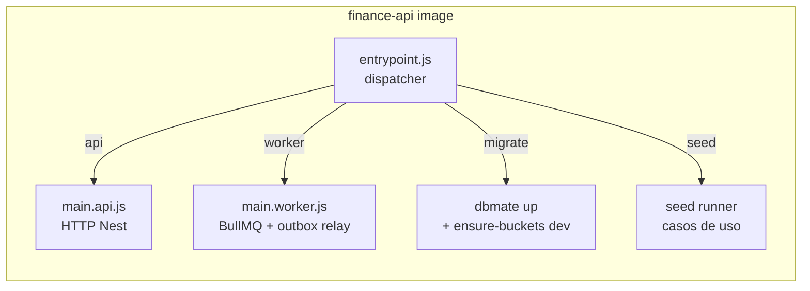
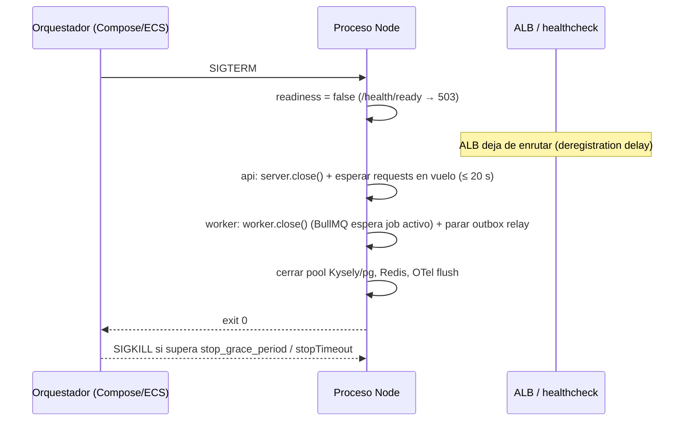

# 20 — Estrategia de contenedores

> **Estado:** Propuesto · **Fecha:** 2026-10-01 · **Relacionado:** [ARCHITECTURE.md](ARCHITECTURE.md) §2, §5, §10, §11 · [07-c4-architecture.md](07-c4-architecture.md) · [12-security.md](12-security.md) · [18-observability.md](18-observability.md) · [19-local-development.md](19-local-development.md) · [21-cloud-deployment-options.md](21-cloud-deployment-options.md) · [23-ci-cd.md](23-ci-cd.md) · ADR-0011 (container strategy), ADR-0015, ADR-0017, ADR-0019 · SPIKE-05, SPIKE-08

> Los Dockerfiles de este documento son **ilustrativos** (Phase 0). Se materializan en `docker/` tras el DESIGN GATE.


---

## 1. Principios

1. **Una imagen por deployable** (ADR-0011): `finance-web`, `finance-api`, `finance-ml`.
2. **Build once, run anywhere**: la misma imagen (por **digest**) pasa por CI → staging → producción. Diferencias solo por config y secretos (ARCHITECTURE §11).
3. **Un binario, varios procesos**: `finance-api` ejecuta `api | worker | migrate | seed` según el comando (`CMD`), sin rebuild.
4. **Mínima superficie**: multi-stage, solo artefactos de runtime, **non-root**, FS de solo lectura, sin shell de build en runtime cuando sea posible.
5. **Sin secretos en imágenes** ni en build args; todo por env vars/secret managers en runtime.
6. **Supply chain verificable**: SBOM + provenance (attestations de BuildKit), escaneo Trivy, imágenes de terceros fijadas por digest.

## 2. Catálogo de imágenes

| Imagen | Contenido | Comandos / procesos | Puerto | Fase |
|---|---|---|---|---|
| `finance-web` | Next.js (App Router) en modo `output: 'standalone'` — UI + BFF | `node apps/web/server.js` | 3000 | 1 |
| `finance-api` | Composition root NestJS (`apps/api`) + paquetes `@pf/*` compilados + `db/migrations` + `seeds/` + `dbmate` | `api` (`dist/main.api.js`), `worker` (`dist/main.worker.js`), `migrate` (dbmate up + ensure-buckets), `seed --profile=…` | 8080 (api), 8082 (health worker, interno) | 1 |
| `finance-ml` | FastAPI + Polars + statsmodels/scikit-learn/Prophet | `uvicorn app.main:app` | 8090 | 8 |



¿Por qué `seeds/` en la imagen de producción? El comando `seed` rechaza ejecutarse si `PFOS_ENV ∈ {staging, production}` salvo el dataset `minimal`-sin-usuarios en staging para smoke (decisión abierta). Alternativa: una imagen `finance-api-tools` con seeds/fixtures solo para local/CI. Se prefiere **una sola imagen** (paridad) con guard en runtime; los seeds pesan poco. Ver Preguntas abiertas.

## 3. Imagen base

### 3.1 Node.js

| Opción | Pros | Contras | Veredicto |
|---|---|---|---|
| `node:<LTS>-bookworm-slim` (Debian 12, glibc) | Compatibilidad total con prebuilds nativos (`sharp` de Next.js, `argon2`, `@swc`, `esbuild`); shell disponible para debugging; parches frecuentes | ~70–80 MB comprimida; trae `npm`, `corepack`, shell | **Elegida** para build y runtime en Phase 1 |
| `node:<LTS>-trixie-slim` (Debian 13) | Paquetes más nuevos | Verificar disponibilidad para la línea Node elegida | Revisar en SPIKE-08 |
| `gcr.io/distroless/nodejs<N>-debian12` | Sin shell ni package manager; menos CVEs | Disponibilidad por línea de Node con retraso; healthcheck debe ser binario/JS; debugging difícil | **Candidata de hardening** (Phase 2+) para `finance-api` |
| Docker Hardened Images (Node) | Minimal, SBOM/provenance firmados | Ecosistema y términos a verificar | Evaluar junto a distroless |
| `node:<LTS>-alpine` (musl) | Pequeña | **musl**: prebuilds nativos no siempre disponibles (compilación en build, diferencias de comportamiento DNS/locale/ICU); soporte "experimental" de Node sobre musl | **Rechazada** |
| Chainguard/Wolfi | Muy pocas CVEs | Tags gratuitos solo `latest` (sin fijar versión sin suscripción) | Rechazada (pinning) |

- **Línea de Node:** Node 24 pasa a *Maintenance* el 2026-10-20 (EOL 2028-04-30); **Node 26 entra en LTS el 2026-10-28** (EOL ~2029-04). Propuesta: Phase 1 sobre **Node 26 LTS** si SPIKE-08 confirma compatibilidad de Next.js, NestJS, Kysely, BullMQ y Testcontainers; si no, Node 24 con plan de upgrade documentado. La versión exacta (`26.x.y`) la fija Renovate vía digest.
- Las tres capas (host `.nvmrc`, CI `setup-node`, imagen base) leen la **misma** versión (fuente única: `.node-version`; Renovate actualiza las tres).

### 3.2 Python (`finance-ml`, Phase 8)

`python:3.13-slim-bookworm` (o 3.14 si las wheels de Prophet/statsmodels lo soportan al llegar la Phase 8), dependencias con **uv** y lockfile (`uv.lock`), venv copiado al runtime. Alpine rechazado (wheels manylinux vs musllinux para numpy/scipy/prophet).

## 4. Dockerfiles multi-stage (ilustrativos)

### 4.1 `docker/finance-api.Dockerfile`

```dockerfile
# syntax=docker/dockerfile:1.10
# ILUSTRATIVO — Phase 0
ARG NODE_IMAGE=node:26-bookworm-slim@sha256:<digest>   # gestionado por Renovate

############################ base ############################
FROM ${NODE_IMAGE} AS base
ENV PNPM_HOME=/pnpm PATH=/pnpm:$PATH CI=true
RUN corepack enable
WORKDIR /repo

############################ prune ###########################
# Reduce el monorepo a lo que necesita apps/api (turbo prune)
FROM base AS prune
COPY . .
RUN pnpm dlx turbo@<x.y.z> prune @pf/api --docker

############################ deps ############################
FROM base AS deps
COPY --from=prune /repo/out/json/ .
COPY --from=prune /repo/out/pnpm-lock.yaml ./pnpm-lock.yaml
RUN --mount=type=cache,id=pnpm-store,target=/pnpm/store \
    pnpm install --frozen-lockfile

############################ build ###########################
FROM deps AS build
COPY --from=prune /repo/out/full/ .
RUN pnpm turbo run build --filter=@pf/api... \
 && pnpm --filter=@pf/api deploy --prod /out/api   # node_modules de producción aislado

############################ dbmate ##########################
FROM base AS dbmate
ARG DBMATE_VERSION=<x.y.z>
ARG TARGETARCH
ADD --checksum=sha256:<sha-por-arch> \
    https://github.com/amacneil/dbmate/releases/download/v${DBMATE_VERSION}/dbmate-linux-${TARGETARCH} /usr/local/bin/dbmate
RUN chmod 0555 /usr/local/bin/dbmate

############################ runtime #########################
FROM ${NODE_IMAGE} AS runtime
ARG GIT_SHA=unknown
ARG VERSION=0.0.0-dev
ARG BUILD_DATE
LABEL org.opencontainers.image.title="finance-api" \
      org.opencontainers.image.description="PFOS backend: api | worker | migrate | seed" \
      org.opencontainers.image.source="https://github.com/<owner>/personal-finances" \
      org.opencontainers.image.revision="${GIT_SHA}" \
      org.opencontainers.image.version="${VERSION}" \
      org.opencontainers.image.created="${BUILD_DATE}" \
      org.opencontainers.image.licenses="UNLICENSED" \
      org.opencontainers.image.vendor="PFOS"
ENV NODE_ENV=production \
    PFOS_VERSION=${VERSION} \
    PFOS_GIT_SHA=${GIT_SHA} \
    NODE_OPTIONS="--enable-source-maps --max-old-space-size=384"
# Eliminar herramientas no necesarias en runtime
RUN rm -rf /usr/local/lib/node_modules/npm /usr/local/lib/node_modules/corepack \
           /usr/local/bin/npm /usr/local/bin/npx /usr/local/bin/corepack
WORKDIR /app
COPY --from=dbmate /usr/local/bin/dbmate /usr/local/bin/dbmate
COPY --from=build --chown=root:root --chmod=0555 /out/api/ ./
COPY --from=build --chown=root:root /repo/db/migrations ./db/migrations
COPY --from=build --chown=root:root /repo/seeds ./seeds
# Ficheros propiedad de root, no escribibles; proceso corre como `node` (uid 1000)
USER node:node
EXPOSE 8080
# Sin HEALTHCHECK en la imagen: depende del comando (api/worker/migrate) → se define en compose / task definition
ENTRYPOINT ["node", "dist/entrypoint.js"]
CMD ["api"]
```

`dist/entrypoint.js` valida el comando (`api|worker|migrate|seed`), carga config validada y hace `import()` del módulo correspondiente; para `migrate` lanza `dbmate --no-dump-schema --wait up` con `spawn` (sin shell) y propaga código de salida. Node es PID 1 solo si el orquestador no aporta init: en Compose se usa `init: true`; en ECS `initProcessEnabled: true` (ver §6).

### 4.2 `docker/finance-web.Dockerfile`

```dockerfile
# syntax=docker/dockerfile:1.10
# ILUSTRATIVO — Phase 0
ARG NODE_IMAGE=node:26-bookworm-slim@sha256:<digest>

FROM ${NODE_IMAGE} AS base
ENV PNPM_HOME=/pnpm PATH=/pnpm:$PATH CI=true NEXT_TELEMETRY_DISABLED=1
RUN corepack enable
WORKDIR /repo

FROM base AS prune
COPY . .
RUN pnpm dlx turbo@<x.y.z> prune @pf/web --docker

FROM base AS deps
COPY --from=prune /repo/out/json/ .
COPY --from=prune /repo/out/pnpm-lock.yaml ./pnpm-lock.yaml
RUN --mount=type=cache,id=pnpm-store,target=/pnpm/store pnpm install --frozen-lockfile

FROM deps AS build
COPY --from=prune /repo/out/full/ .
# NUNCA pasar secretos ni URLs por entorno aquí: next.config usa output:'standalone'
# y toda la config se lee en runtime (server-side). NEXT_PUBLIC_* solo con valores
# no sensibles e idénticos en todos los entornos (o servidos por /api/config).
RUN --mount=type=cache,id=next-cache,target=/repo/apps/web/.next/cache \
    pnpm turbo run build --filter=@pf/web...

FROM ${NODE_IMAGE} AS runtime
ARG GIT_SHA=unknown VERSION=0.0.0-dev BUILD_DATE
LABEL org.opencontainers.image.title="finance-web" \
      org.opencontainers.image.source="https://github.com/<owner>/personal-finances" \
      org.opencontainers.image.revision="${GIT_SHA}" \
      org.opencontainers.image.version="${VERSION}" \
      org.opencontainers.image.created="${BUILD_DATE}"
ENV NODE_ENV=production PORT=3000 HOSTNAME=0.0.0.0 NEXT_TELEMETRY_DISABLED=1
RUN rm -rf /usr/local/lib/node_modules/npm /usr/local/lib/node_modules/corepack \
           /usr/local/bin/npm /usr/local/bin/npx /usr/local/bin/corepack
WORKDIR /app
COPY --from=build --chown=root:root /repo/apps/web/.next/standalone ./
COPY --from=build --chown=root:root /repo/apps/web/.next/static ./apps/web/.next/static
COPY --from=build --chown=root:root /repo/apps/web/public ./apps/web/public
COPY --from=build --chown=root:root /repo/docker/healthcheck.js ./healthcheck.js
USER node:node
EXPOSE 3000
CMD ["node", "apps/web/server.js"]
```

- La caché de ISR/imágenes (`.next/cache`) se monta como `tmpfs` (local) o volumen efímero (ECS) para mantener `readonlyRootFilesystem`.
- Assets estáticos (`/_next/static`) se sirven detrás de CloudFront con `Cache-Control: immutable` ([21-cloud-deployment-options.md](21-cloud-deployment-options.md)).

### 4.3 `docker/finance-ml.Dockerfile` (Phase 8)

```dockerfile
# syntax=docker/dockerfile:1.10
# ILUSTRATIVO — Phase 8
ARG PY_IMAGE=python:3.13-slim-bookworm@sha256:<digest>
FROM ${PY_IMAGE} AS build
COPY --from=ghcr.io/astral-sh/uv:<x.y.z>@sha256:<digest> /uv /usr/local/bin/uv
ENV UV_COMPILE_BYTECODE=1 UV_LINK_MODE=copy
WORKDIR /app
COPY pyproject.toml uv.lock ./
RUN --mount=type=cache,target=/root/.cache/uv uv sync --frozen --no-dev --no-install-project
COPY src ./src
RUN --mount=type=cache,target=/root/.cache/uv uv sync --frozen --no-dev

FROM ${PY_IMAGE} AS runtime
RUN groupadd -g 10001 app && useradd -u 10001 -g app -s /usr/sbin/nologin app
WORKDIR /app
COPY --from=build --chown=root:root /app /app
ENV PATH=/app/.venv/bin:$PATH PYTHONDONTWRITEBYTECODE=1 PYTHONUNBUFFERED=1
USER 10001:10001
EXPOSE 8090
CMD ["uvicorn", "pfos_ml.main:app", "--host", "0.0.0.0", "--port", "8090", "--timeout-graceful-shutdown", "20"]
```

### 4.4 `.dockerignore` (raíz)

```gitignore
**/node_modules
**/.next
**/dist
**/.turbo
**/coverage
.git
.env*
!.env.example
.backups
infra
docs
tests/e2e/**/test-results
**/*.dump
```

## 5. Seguridad del contenedor

| Control | Local (Compose) | Cloud (ECS/Fargate) |
|---|---|---|
| Usuario non-root | `USER node` (uid 1000) / `10001` en ML | Igual (imagen); `user` en task def opcional |
| FS solo lectura | `read_only: true` + `tmpfs: /tmp` | `readonlyRootFilesystem: true` + volúmenes efímeros para `/tmp` y `.next/cache` |
| Capabilities | `cap_drop: [ALL]` | Fargate ya restringe; no se añaden caps |
| `no-new-privileges` | `security_opt` | Implícito en Fargate |
| Secretos | `.env` local (dev-only) | `secrets` de task def desde Secrets Manager/SSM → env vars en runtime |
| Red | red Compose `pfos` | `awsvpc`, SG por servicio |
| Imagen inmutable | tags locales | ECR con **tag immutability** + deploy por digest |

**Secretos nunca en imágenes:** sin `ARG`/`ENV` con secretos; si un build requiere token (p. ej. registro npm privado futuro) se usa `RUN --mount=type=secret,id=npmrc`. CI corre **gitleaks** sobre el repo y Trivy `--scanners secret` sobre la imagen.

## 6. Señales y graceful shutdown

Objetivo (spec `local-environment` → *Graceful shutdown*): al recibir `SIGTERM`, dejar de aceptar trabajo nuevo y terminar/soltar lo en curso dentro del grace period.



| Proceso | Mecanismo | Timeout interno | Grace del orquestador |
|---|---|---|---|
| `api` (Nest) | `app.enableShutdownHooks()`; `OnApplicationShutdown` para marcar no-ready, `server.close()`, `keepAliveTimeout` < idle timeout del ALB (ALB 60 s → Node `keepAliveTimeout` 65 s y `headersTimeout` 66 s) | 20 s | Compose `stop_grace_period: 30s`; ECS `stopTimeout: 30`; ALB `deregistration_delay` 20–30 s |
| `worker` | `worker.close()` de BullMQ (espera a que termine el job activo; los no iniciados quedan en cola), outbox relay detiene el polling tras el batch actual (el batch es transaccional: o se marca publicado o se reintenta) | 25 s | `stop_grace_period: 45s`; ECS `stopTimeout: 60` (máx. Fargate 120 s). Jobs largos (imports) deben ser **reanudables/idempotentes** — validado en SPIKE-05 |
| `migrate` / `seed` | Proceso corto; ante `SIGTERM` aborta la transacción en curso (dbmate usa transacción por migración) | — | — |
| `finance-web` (Next.js standalone) | El servidor standalone gestiona `SIGTERM`/`SIGINT`; si se requiere lógica propia (flush OTel), `NEXT_MANUAL_SIG_HANDLE=true` + handler en `instrumentation.ts` (verificar en SPIKE-08) | 15 s | 30 s |
| `finance-ml` | `uvicorn --timeout-graceful-shutdown 20` | 20 s | 30 s |

Reglas: el `ENTRYPOINT` usa forma exec (sin `sh -c`), nunca `pnpm start`/`npm start` como PID 1 (no reenvían señales de forma fiable); `init: true` / `initProcessEnabled` para reaping de procesos hijo (dbmate).

## 7. Configuración (12-factor)

- Todo por env vars validadas al arranque (`zod` en `@pf/platform/config`); proceso termina con `78` si falta config.
- **Nada de config de entorno horneada en build**: Next.js no usa `NEXT_PUBLIC_*` para URLs de entorno; el BFF expone lo necesario vía rutas server-side. Esto es requisito de *build once/promote*.
- Variables documentadas en [19-local-development.md](19-local-development.md) §6; en cloud, valores no secretos en la task definition (Terraform) y secretos vía `secrets` (`valueFrom` ARN de Secrets Manager/SSM).

## 8. Healthchecks: imagen vs orquestador

| Nivel | Decisión |
|---|---|
| `HEALTHCHECK` en Dockerfile | **No** para `finance-api` (la misma imagen corre procesos con y sin HTTP; un HEALTHCHECK fijo marcaría `migrate` como unhealthy). Opcional para `finance-web`/`finance-ml`, pero se prefiere consistencia: **ninguna imagen declara HEALTHCHECK**. |
| Compose | `healthcheck` por servicio con `node dist/healthcheck.js <url>` (script de ~20 líneas con `fetch`, sin curl en la imagen). |
| ECS | `healthCheck` del contenedor en task def (mismo comando) **+** health check del target group del ALB contra `/health/ready` (api, web). El worker solo usa el health de contenedor (`/health/ready` en puerto interno 8082). |
| Endpoints | `/health/live`: proceso vivo, sin dependencias. `/health/ready`: PG + Redis + object storage (api/worker); web: BFF + alcance a `finance-api` `/health/live` (no ready, para evitar cascadas). Detalle en [18-observability.md](18-observability.md). |
| Kubernetes (si algún día) | `livenessProbe` → `/health/live`, `readinessProbe` → `/health/ready`, `startupProbe` para arranque lento. |

## 9. Versionado, tags y promoción

| Tag | Cuándo | Mutable |
|---|---|---|
| `sha-<git-sha-40>` | Cada build en `main` (y en PR si se publica a registro de PR) | No (ECR tag immutability) |
| `vX.Y.Z` | `release.yml` re-etiqueta el **mismo digest** al crear la release (release-please) | No |
| `main` / `latest` | **No se usan** para deploy (solo conveniencia local, opcional) | — |

- Deploy siempre por **digest** (`…/finance-api@sha256:…`), resuelto en el workflow a partir de `sha-<sha>` y registrado en el artefacto de despliegue (ver [23-ci-cd.md](23-ci-cd.md)).
- Re-tag sin rebuild: `docker buildx imagetools create --tag <repo>:vX.Y.Z <repo>@sha256:<digest>` (o `crane tag`).

## 10. SBOM, provenance, firma y escaneo

```yaml
# Fragmento ilustrativo (job build en main.yml)
- uses: docker/build-push-action@<sha>   # pinned por SHA
  with:
    context: .
    file: docker/finance-api.Dockerfile
    target: runtime
    platforms: linux/arm64
    push: true
    tags: ${{ env.ECR }}/finance-api:sha-${{ github.sha }}
    build-args: |
      GIT_SHA=${{ github.sha }}
      VERSION=${{ steps.ver.outputs.version }}
      BUILD_DATE=${{ steps.ver.outputs.date }}
    sbom: true                     # attestation SPDX (BuildKit)
    provenance: mode=max           # SLSA provenance
    cache-from: type=gha,scope=finance-api
    cache-to: type=gha,scope=finance-api,mode=max
```

- **Attestations** de BuildKit (SBOM + provenance) quedan junto a la imagen en el registro (ECR soporta OCI artifacts/referrers). Adicionalmente `actions/attest-build-provenance` (GitHub artifact attestations, Sigstore) — opcional; firma con **cosign keyless** evaluable en Phase 2.
- **Trivy** (`trivy image --severity HIGH,CRITICAL --ignore-unfixed --exit-code 1`) en PR (imagen local) y nightly sobre los digests desplegados. Excepciones en `.trivyignore.yaml` con fecha de expiración y justificación (spec *Critical vulnerabilities block the gate*).
  - **Aviso de supply chain (verificado):** en mar-2026 se comprometieron tags de `aquasecurity/trivy-action` y `setup-trivy` (tags reescritos a código malicioso, ventana ~12 h). Por ello: **toda action de terceros se fija por commit SHA** (Renovate actualiza), y se prefiere ejecutar el binario de Trivy verificado por checksum/firma o vía imagen fijada por digest.
- Dependency scan: `pnpm audit --prod` + Trivy `fs` / OSV-Scanner sobre lockfiles.

## 11. Presupuesto de tamaño de imagen

| Imagen | Objetivo (comprimida) | Alarma (CI falla) | Medición |
|---|---|---|---|
| `finance-api` | ≤ 150 MB | > 220 MB | `docker image inspect` / `dive --ci` en PR |
| `finance-web` | ≤ 180 MB | > 250 MB | idem |
| `finance-ml` | ≤ 450 MB | > 700 MB | idem (Prophet/numpy pesan) |

Palancas: `turbo prune`, `pnpm deploy --prod`, eliminar npm/corepack en runtime, `output: 'standalone'`, distroless en Phase 2+.

## 12. Caché de build en CI

- BuildKit con `cache-to/cache-from: type=gha` (scope por imagen); alternativa `type=registry` en ECR (`:buildcache`) si el límite de caché de Actions (10 GB/repo) se queda corto.
- `--mount=type=cache` para el store de pnpm y `.next/cache`.
- `turbo prune --docker` separa `package.json`/lockfile de fuentes ⇒ la capa de `pnpm install` solo se invalida al cambiar dependencias.
- Remote cache de Turborepo (opcional) para jobs no-Docker.

## 13. Multi-arquitectura

- **Objetivo cloud: `linux/arm64`** (Fargate Graviton ≈ 20 % más barato por vCPU/GB que x86 — ver [21-cloud-deployment-options.md](21-cloud-deployment-options.md)).
- **Local:** Windows x86_64 ⇒ `linux/amd64`. Para paridad se publican imágenes **multi-arch** (`linux/amd64,linux/arm64`) en `main`.
- Build arm64 en CI: runners **arm64 nativos** de GitHub (`ubuntu-24.04-arm`, disponibles para repos públicos y planes de pago — verificar disponibilidad para el plan del owner) y merge del manifest; fallback QEMU (lento, ×3–10) solo si no hay runners arm.
- PR: solo `linux/amd64` (rápido) para tests/escaneo; `main`: ambas.
- Riesgo: dependencias nativas sin prebuild arm64 — verificado en SPIKE-08.

## 14. Paridad entre entornos

| Aspecto | Local (Compose) | CI | Staging | Producción |
|---|---|---|---|---|
| Imagen app | build local o digest publicado | build del commit (amd64) | digest `sha-<sha>` (arm64) | **mismo digest** que staging |
| PostgreSQL | `postgres:18` contenedor | Testcontainers `postgres:18` (mismo digest) | RDS PostgreSQL 18.x | RDS PostgreSQL 18.x (misma minor) |
| Redis | Valkey 8 contenedor | Testcontainers Valkey | ElastiCache for Valkey (serverless) | idem |
| Object storage | SeaweedFS/Garage (S3 API) | Testcontainers S3-compatible | S3 | S3 |
| OIDC | Keycloak dev realm | Keycloak (E2E) / JWKS stub (integración) | IdP cloud (ADR-0010/0013) | idem |
| Email | Mailpit | Mailpit | SES sandbox / Mailpit-like | SES |
| TLS | no (http) | no | sí (ACM en ALB/CloudFront) | sí |
| Secretos | `.env` dev-only | GitHub Actions secrets/ephemeral | Secrets Manager | Secrets Manager |
| Observabilidad | `otel-lgtm` opcional | logs de job | CloudWatch/ADOT o Grafana Cloud | idem |
| FS solo lectura / non-root | sí | sí | sí | sí |
| Arquitectura CPU | amd64 | amd64 | arm64 | arm64 |

Diferencias aceptadas y su mitigación: CPU arch (tests multi-arch nightly), S3 real vs compatible (tests de contrato S3 en staging smoke), IdP distinto (solo OIDC estándar como contrato).

## 15. Imágenes de terceros: pinning

- Todas fijadas por **tag + digest** (`postgres:18-bookworm@sha256:…`) en compose, Testcontainers (`tests/containers.ts` centraliza las referencias) y Dockerfiles.
- **Renovate** actualiza digests (`pinDigests: true`) agrupados por servicio, con automerge solo para digest/patch en dependencias de dev cuando CI pasa.
- Proveniencia permitida: Docker Official Images, `quay.io/keycloak`, `grafana/*`, `axllent/mailpit`, `valkey/valkey`, proyecto de object storage elegido. **No Bitnami**: desde ago–sep 2025 Bitnami movió sus tags versionados a `bitnamilegacy` (sin parches) y las imágenes gratuitas restantes (`bitnamisecure`) solo publican `latest` — incompatible con pinning y parches.
- Política de mirror (opcional, Phase 2): ECR pull-through cache para Docker Hub/Quay en cloud (evita rate limits y desapariciones de upstream como el caso MinIO).

## 16. Preguntas abiertas

1. Node 26 LTS vs Node 24 para Phase 1 (depende de SPIKE-08).
2. ¿`seeds/` dentro de la imagen de producción (con guard) o imagen `finance-api-tools` separada?
3. ¿Distroless/hardened para `finance-api` desde Phase 1 o Phase 2? (impacta debugging con ECS Exec).
4. ¿Firmar imágenes con cosign keyless desde Phase 1 o basta con attestations de BuildKit/GitHub?
5. Runners arm64 nativos: confirmar disponibilidad y coste para el plan de GitHub del owner; si no, ¿arm64 vía QEMU solo en `main` o desplegar amd64 en Fargate (≈ +25 % coste)?
6. Registro: ¿solo ECR (cuenta `shared`) o GHCR para PR + ECR para despliegue?
