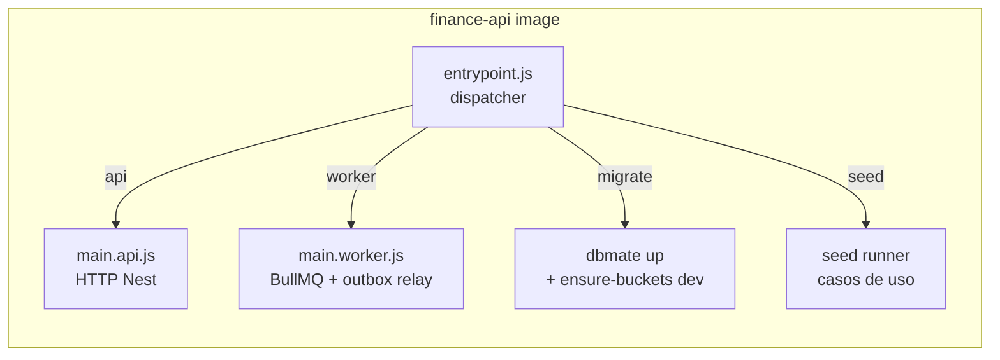
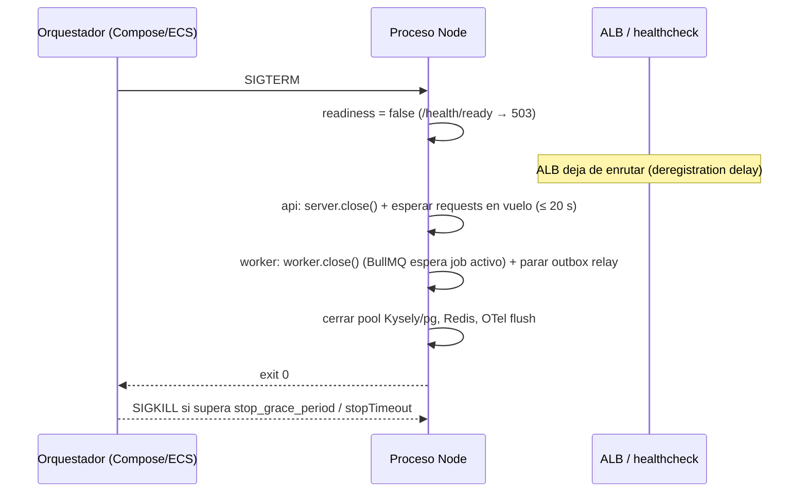

# 20 — Estrategia de contenedores

> **Estado:** Aceptado — implementado en Phase 0 (`bootstrap-platform-foundation`); secciones marcadas **as-built (2026-10-02)** · **Fecha:** 2026-10-01 (diseño) / 2026-10-02 (as-built) · **Relacionado:** [ARCHITECTURE.md](ARCHITECTURE.md) §2, §5, §10, §11 · [07-c4-architecture.md](07-c4-architecture.md) · [12-security.md](12-security.md) · [18-observability.md](18-observability.md) · [19-local-development.md](19-local-development.md) · [21-cloud-deployment-options.md](21-cloud-deployment-options.md) · [23-ci-cd.md](23-ci-cd.md) · ADR-0011 (container strategy), ADR-0015, ADR-0017, ADR-0019 · SPIKE-05, SPIKE-08

> **As-built (2026-10-02).** Los Dockerfiles ya existen y son la fuente de verdad: [`docker/api.Dockerfile`](../docker/api.Dockerfile), [`docker/web.Dockerfile`](../docker/web.Dockerfile), [`docker/healthcheck.mjs`](../docker/healthcheck.mjs) y [`.dockerignore`](../.dockerignore); el build/publicación está en [`.github/workflows/pr.yml`](../.github/workflows/pr.yml) y [`.github/workflows/main.yml`](../.github/workflows/main.yml). Las secciones marcadas **as-built (2026-10-02)** resumen lo implementado y señalan dónde difiere del diseño; el resto conserva el análisis. `finance-ml` (Phase 8) sigue siendo ilustrativo.

---

## 1. Principios

1. **Una imagen por deployable** (ADR-0011): `finance-web`, `finance-api`, `finance-ml`.
2. **Build once, run anywhere**: la misma imagen (por **digest**) pasa por CI → staging → producción. Diferencias solo por config y secretos (ARCHITECTURE §11).
3. **Un binario, varios procesos**: `finance-api` ejecuta `api | worker | migrate | seed` según el comando (`CMD`), sin rebuild.
4. **Mínima superficie**: multi-stage, solo artefactos de runtime, **non-root**, FS de solo lectura, sin shell de build en runtime cuando sea posible.
5. **Sin secretos en imágenes** ni en build args; todo por env vars/secret managers en runtime.
6. **Supply chain verificable**: SBOM + provenance (attestations de BuildKit), escaneo Trivy, imágenes de terceros fijadas por digest.

## 2. Catálogo de imágenes

| Imagen | Contenido | Comandos / procesos | Puerto | Fase |
|---|---|---|---|---|
| `finance-web` | Next.js (App Router) en modo `output: 'standalone'` — UI + BFF | `node apps/web/server.js` | 3000 | 1 (as-built) |
| `finance-api` | Composition root NestJS (`apps/api`) + paquetes `@pf/*` compilados + `db/migrations` + `dbmate` (npm) | `api` (`dist/main.api.js`), `worker` (`dist/main.worker.js`), `migrate` (dbmate up + rol `pf_app` + cola + bucket), `seed --profile=…` | 8080 (api), 8082 (health worker, interno) | 1 (as-built) |
| `finance-ml` | FastAPI + Polars + statsmodels/scikit-learn/Prophet | `uvicorn app.main:app` | 8090 | 8 |



¿Por qué `seeds/` en la imagen de producción? El comando `seed` rechaza ejecutarse si `PFOS_ENV ∈ {staging, production}` salvo el dataset `minimal`-sin-usuarios en staging para smoke (decisión abierta). Alternativa: una imagen `finance-api-tools` con seeds/fixtures solo para local/CI. Se prefiere **una sola imagen** (paridad) con guard en runtime; los seeds pesan poco. Ver Preguntas abiertas.

> **As-built (2026-10-02):** se adoptó **una sola imagen**: el código del seed vive en `apps/api/src/seed` y viaja compilado en `finance-api`; el guard rechaza `staging` y `production` sin excepciones.

## 3. Imagen base

### 3.1 Node.js

| Opción | Pros | Contras | Veredicto |
|---|---|---|---|
| `node:<LTS>-bookworm-slim` (Debian 12, glibc) | Compatibilidad total con prebuilds nativos (`sharp` de Next.js, `argon2`, `@swc`, `esbuild`); shell disponible para debugging; parches frecuentes | ~70–80 MB comprimida; trae `npm`, `corepack`, shell | **Elegida** para build y runtime en Phase 1 |
| `node:<LTS>-trixie-slim` (Debian 13) | Paquetes más nuevos | Verificar disponibilidad para la línea Node elegida | Revisar en SPIKE-08 |
| `gcr.io/distroless/nodejs<N>-debian12` | Sin shell ni package manager; menos CVEs | Disponibilidad por línea de Node con retraso; healthcheck debe ser binario/JS; debugging difícil | **Candidata de hardening** (Phase 2+) para `finance-api` |
| Docker Hardened Images (Node) | Minimal, SBOM/provenance firmados | Ecosistema y términos a verificar | Evaluar junto a distroless |
| `node:<LTS>-alpine` (musl) | Pequeña | **musl**: prebuilds nativos no siempre disponibles (compilación en build, diferencias de comportamiento DNS/locale/ICU); soporte "experimental" de Node sobre musl | **Rechazada** |
| Chainguard/Wolfi | Muy pocas CVEs | Tags gratuitos solo `latest` (sin fijar versión sin suscripción) | Rechazada (pinning) |

- **As-built (2026-10-02): Node 24** — `node:24.21.0-bookworm-slim` fijada por digest en ambos Dockerfiles, `.nvmrc` = `24` (CI lo lee con `node-version-file`). La migración a Node 26 LTS queda para cuando Renovate la proponga con CI verde. Análisis original: Node 24 pasa a *Maintenance* el 2026-10-20 (EOL 2028-04-30); **Node 26 entra en LTS el 2026-10-28** (EOL ~2029-04). Propuesta: Phase 1 sobre **Node 26 LTS** si SPIKE-08 confirma compatibilidad de Next.js, NestJS, Kysely, BullMQ y Testcontainers; si no, Node 24 con plan de upgrade documentado. La versión exacta (`26.x.y`) la fija Renovate vía digest.
- Las tres capas (host `.nvmrc`, CI `setup-node`, imagen base) leen la **misma** línea; la fuente única es `.nvmrc` (no existe `.node-version`).

### 3.2 Python (`finance-ml`, Phase 8)

`python:3.13-slim-bookworm` (o 3.14 si las wheels de Prophet/statsmodels lo soportan al llegar la Phase 8), dependencias con **uv** y lockfile (`uv.lock`), venv copiado al runtime. Alpine rechazado (wheels manylinux vs musllinux para numpy/scipy/prophet).

## 4. Dockerfiles multi-stage — as-built (2026-10-02)

### 4.1 `docker/api.Dockerfile` (imagen `finance-api`)

Fichero real: [`docker/api.Dockerfile`](../docker/api.Dockerfile). Resumen:

- **Base:** `ARG NODE_IMAGE=node:24.21.0-bookworm-slim@sha256:…` (versión + digest; misma línea que `.nvmrc`).
- **Etapas:** `base` (corepack + pnpm) → `deps` (`pnpm fetch` solo con `pnpm-lock.yaml`, `pnpm-workspace.yaml`, `package.json` y `.npmrc`: la capa del store se reutiliza mientras no cambien las dependencias; caché `--mount=type=cache,id=pfos-pnpm-store`) → `build` (`pnpm install --offline --frozen-lockfile --filter "@pf/api..."`, build de `@pf/api` y sus paquetes, `pnpm --filter @pf/api deploy --prod --legacy /out`) → `runtime`.
- **Runtime:** labels OCI (`revision` = `GIT_SHA`, `version`, `created`, `source`, `base.name`), `NODE_ENV=production`, `NODE_OPTIONS=--enable-source-maps`, sin npm/npx/corepack/yarn, ficheros propiedad de root no escribibles, `USER node:node` (uid 1000), `EXPOSE 8080 8082`.
- **Comandos:** `ENTRYPOINT ["node", "dist/entrypoint.js"]` en forma exec, `CMD ["api"]`; el dispatcher acepta `api | worker | migrate | seed [--profile=…]` (exit 64 ante un comando desconocido) y registra OpenTelemetry antes de cargar Nest solo en `api`/`worker`.
- **Migraciones:** `dbmate` llega como dependencia npm de `@pf/api` (no como binario descargado en una etapa aparte) y las migraciones viajan en `apps/api/db/migrations` dentro del paquete desplegado. `migrate` = `dbmate up` + contraseña del rol `pf_app` + esquema de la cola + bucket (solo con `OBJECT_STORAGE_ENSURE_BUCKET=true`).
- **Diferencias con el diseño:** sin `turbo prune` (se usa `pnpm fetch` + `--filter`), Node 24 en lugar de 26, y la imagen **sí** declara `HEALTHCHECK` (ver §8).

### 4.2 `docker/web.Dockerfile` (imagen `finance-web`)

Fichero real: [`docker/web.Dockerfile`](../docker/web.Dockerfile). Mismas etapas `base`/`deps`/`build` (filtro `@pf/web...`, `NEXT_TELEMETRY_DISABLED=1`) y `runtime` con la salida `output: 'standalone'` de Next.js (`.next/standalone`, `.next/static`, `public`). Ninguna configuración de entorno se hornea en el build: la web la lee y valida en runtime (`instrumentation.ts`). `.next/cache` es el único directorio escribible (propiedad de `node`; `tmpfs` en Compose con `read_only: true`). `USER node:node`, `EXPOSE 3000`, `HEALTHCHECK` contra `/api/health/ready` y `ENTRYPOINT ["node", "apps/web/server.js"]`.

### 4.3 `docker/finance-ml.Dockerfile` (Phase 8)

```dockerfile
# syntax=docker/dockerfile:1.10
# ILUSTRATIVO — Phase 8
ARG PY_IMAGE=python:3.13-slim-bookworm@sha256:<digest>
FROM ${PY_IMAGE} AS build
COPY --from=ghcr.io/astral-sh/uv:<x.y.z>@sha256:<digest> /uv /usr/local/bin/uv
ENV UV_COMPILE_BYTECODE=1 UV_LINK_MODE=copy
WORKDIR /app
COPY pyproject.toml uv.lock ./
RUN --mount=type=cache,target=/root/.cache/uv uv sync --frozen --no-dev --no-install-project
COPY src ./src
RUN --mount=type=cache,target=/root/.cache/uv uv sync --frozen --no-dev

FROM ${PY_IMAGE} AS runtime
RUN groupadd -g 10001 app && useradd -u 10001 -g app -s /usr/sbin/nologin app
WORKDIR /app
COPY --from=build --chown=root:root /app /app
ENV PATH=/app/.venv/bin:$PATH PYTHONDONTWRITEBYTECODE=1 PYTHONUNBUFFERED=1
USER 10001:10001
EXPOSE 8090
CMD ["uvicorn", "pfos_ml.main:app", "--host", "0.0.0.0", "--port", "8090", "--timeout-graceful-shutdown", "20"]
```

### 4.4 `.dockerignore` (raíz)

Fichero real: [`.dockerignore`](../.dockerignore). Excluye dependencias y artefactos (`node_modules`, `.next`, `dist`, `.turbo`, `coverage`, `*.tsbuildinfo`), `.git`, `.github`, `.claude`, todo `.env*` salvo `.env.example`, `backups`, `spikes`, `docs`, `openspec`, `tests/cases`, `tests/traceability`, `*.dump` y `*.log`.

## 5. Seguridad del contenedor

| Control | Local (Compose) | Cloud (ECS/Fargate) |
|---|---|---|
| Usuario non-root | `USER node` (uid 1000) / `10001` en ML | Igual (imagen); `user` en task def opcional |
| FS solo lectura | `read_only: true` + `tmpfs: /tmp` | `readonlyRootFilesystem: true` + volúmenes efímeros para `/tmp` y `.next/cache` |
| Capabilities | `cap_drop: [ALL]` | Fargate ya restringe; no se añaden caps |
| `no-new-privileges` | `security_opt` | Implícito en Fargate |
| Secretos | `.env` local (dev-only) | `secrets` de task def desde Secrets Manager/SSM → env vars en runtime |
| Red | red Compose `pfos` | `awsvpc`, SG por servicio |
| Imagen inmutable | tags locales | ECR con **tag immutability** + deploy por digest |

**Secretos nunca en imágenes:** sin `ARG`/`ENV` con secretos; si un build requiere token (p. ej. registro npm privado futuro) se usa `RUN --mount=type=secret,id=npmrc`. CI corre **gitleaks** sobre el repo y Trivy `--scanners secret` sobre la imagen.

## 6. Señales y graceful shutdown

Objetivo (spec `local-environment` → *Graceful shutdown*): al recibir `SIGTERM`, dejar de aceptar trabajo nuevo y terminar/soltar lo en curso dentro del grace period.



| Proceso | Mecanismo | Timeout interno | Grace del orquestador |
|---|---|---|---|
| `api` (Nest) | `app.enableShutdownHooks()`; `OnApplicationShutdown` para marcar no-ready, `server.close()`, `keepAliveTimeout` < idle timeout del ALB (ALB 60 s → Node `keepAliveTimeout` 65 s y `headersTimeout` 66 s) | 20 s | Compose `stop_grace_period: 30s`; ECS `stopTimeout: 30`; ALB `deregistration_delay` 20–30 s |
| `worker` | `worker.close()` de BullMQ (espera a que termine el job activo; los no iniciados quedan en cola), outbox relay detiene el polling tras el batch actual (el batch es transaccional: o se marca publicado o se reintenta) | 25 s | `stop_grace_period: 45s`; ECS `stopTimeout: 60` (máx. Fargate 120 s). Jobs largos (imports) deben ser **reanudables/idempotentes** — validado en SPIKE-05 |
| `migrate` / `seed` | Proceso corto; ante `SIGTERM` aborta la transacción en curso (dbmate usa transacción por migración) | — | — |
| `finance-web` (Next.js standalone) | El servidor standalone gestiona `SIGTERM`/`SIGINT`; si se requiere lógica propia (flush OTel), `NEXT_MANUAL_SIG_HANDLE=true` + handler en `instrumentation.ts` (verificar en SPIKE-08) | 15 s | 30 s |
| `finance-ml` | `uvicorn --timeout-graceful-shutdown 20` | 20 s | 30 s |

Reglas: el `ENTRYPOINT` usa forma exec (sin `sh -c`), nunca `pnpm start`/`npm start` como PID 1 (no reenvían señales de forma fiable); `init: true` / `initProcessEnabled` para reaping de procesos hijo (dbmate).

## 7. Configuración (12-factor)

- Todo por env vars validadas al arranque (`zod` en `@pf/platform/config`); proceso termina con `78` si falta config.
- **Nada de config de entorno horneada en build**: Next.js no usa `NEXT_PUBLIC_*` para URLs de entorno; el BFF expone lo necesario vía rutas server-side. Esto es requisito de *build once/promote*.
- Variables documentadas en [19-local-development.md](19-local-development.md) §6; en cloud, valores no secretos en la task definition (Terraform) y secretos vía `secrets` (`valueFrom` ARN de Secrets Manager/SSM).

## 8. Healthchecks: imagen vs orquestador — as-built (2026-10-02)

| Nivel | Decisión implementada |
|---|---|
| `HEALTHCHECK` en Dockerfile | **Sí, en ambas imágenes** (cambio respecto al diseño, que proponía ninguno): `finance-api` declara el del comando por defecto `api` (`:8080/health/ready`); `finance-web` el de `/api/health/ready`. Así `docker run` y cualquier orquestador sin configuración propia obtienen un health útil. |
| Compose | Sobrescribe por servicio: `finance-worker` → `:8082/health/ready`; `migrate` y `seed` → `healthcheck: disable: true` (one-shot, un HEALTHCHECK fijo los marcaría unhealthy). |
| Script | [`docker/healthcheck.mjs`](../docker/healthcheck.mjs) en `/usr/local/lib/pfos/healthcheck.mjs`: `fetch` con timeout, exit 0 si 2xx; sin curl/wget en la imagen. La URL siempre es el loopback del propio contenedor. |
| ECS | `healthCheck` del contenedor en la task def (mismo comando) **+** health check del target group del ALB contra `/health/ready` (api, web). El worker solo usa el health de contenedor (puerto interno 8082). |
| Endpoints | `/health/live`: proceso vivo, sin dependencias. `/health/ready`: dependencias (PG, object storage; Valkey si está activo) en api/worker; web: `/api/health/ready`. Detalle en [18-observability.md](18-observability.md). |
| Docker 29 | `--start-interval` exige `--start-period` (SPIKE-08); ambos están declarados. |
| Kubernetes (si algún día) | `livenessProbe` → `/health/live`, `readinessProbe` → `/health/ready`, `startupProbe` para arranque lento. |

## 9. Versionado, tags y promoción

| Tag | Cuándo | Mutable |
|---|---|---|
| `sha-<git-sha-40>` | Cada build en `main` (y en PR si se publica a registro de PR) | No (ECR tag immutability) |
| `vX.Y.Z` | `release.yml` re-etiqueta el **mismo digest** al crear la release (release-please) | No |
| `main` / `latest` | **No se usan** para deploy (solo conveniencia local, opcional) | — |

- Deploy siempre por **digest** (`…/finance-api@sha256:…`), resuelto en el workflow a partir de `sha-<sha>` y registrado en el artefacto de despliegue (ver [23-ci-cd.md](23-ci-cd.md)).
- Re-tag sin rebuild: `docker buildx imagetools create --tag <repo>:vX.Y.Z <repo>@sha256:<digest>` (o `crane tag`).

> **As-built (2026-10-02):** `main.yml` publica `ghcr.io/manuxd270516/finance-api` y `finance-web` con tag `sha-<commit>` y registra cada digest (artefacto `digest-<imagen>`, 90 días, + resumen del job); el job `verify-by-digest` las descarga **por digest**, comprueba digest y label `org.opencontainers.image.revision` y levanta el perfil `core` sin reconstruir. Aún no hay ECR, `release.yml` ni deploy. Local: `pfos/finance-*:local`; PR: `pfos/finance-*:ci` (no se publican).

## 10. SBOM, provenance, firma y escaneo — as-built (2026-10-02)

Implementado en [`.github/workflows/main.yml`](../.github/workflows/main.yml) (job `build-push`) y [`.github/workflows/pr.yml`](../.github/workflows/pr.yml) (jobs `image` y `dependency-scan`); el fragmento ilustrativo de Phase 0 se eliminó.

- **Build:** `docker/build-push-action` fijada por SHA, `target: runtime`, `platforms: linux/amd64`, build args `GIT_SHA`/`VERSION`/`BUILD_DATE`, `sbom: true` y `provenance: mode=max` (attestations de BuildKit junto a la imagen en GHCR), caché `type=gha` por imagen. Firma con cosign / `actions/attest-build-provenance`: no implementada (evaluable en Phase 2).
- **Trivy** como binario con versión y SHA-256 fijados (no `trivy-action`): `trivy image --scanners vuln --severity CRITICAL --ignore-unfixed --exit-code 1 --ignorefile .trivyignore.yaml` sobre cada imagen del PR. La política implementada bloquea **CRITICAL con corrección disponible** (el diseño proponía HIGH,CRITICAL). Excepciones en [`.trivyignore.yaml`](../.trivyignore.yaml) con motivo y `expired_at` obligatorio (máx. 90 días; hoy vacío).
  - **Aviso de supply chain (verificado):** en mar-2026 se comprometieron tags de `aquasecurity/trivy-action` y `setup-trivy` (tags reescritos a código malicioso, ventana ~12 h). Por ello **toda action de terceros se fija por commit SHA** y Trivy/gitleaks se ejecutan como binarios verificados por checksum.
- **Non-root:** el job `image` falla si `Config.User` es vacío, `0` o `root`.
- **Dependency scan:** `trivy fs` (misma política y mismo `.trivyignore.yaml`) sobre `pnpm-lock.yaml`, excluyendo `spikes/`. `pnpm audit` se descartó porque no admite excepciones con vencimiento.
- **Secretos:** gitleaks sobre los commits del PR. Trivy `--scanners secret` sobre la imagen: no implementado.
- Rescan nocturno de digests desplegados: pendiente (no hay `nightly.yml` ni despliegue).

## 11. Presupuesto de tamaño de imagen

| Imagen | Objetivo (comprimida) | Alarma (CI falla) | Medición |
|---|---|---|---|
| `finance-api` | ≤ 150 MB | > 220 MB | `docker image inspect` / `dive --ci` en PR |
| `finance-web` | ≤ 180 MB | > 250 MB | idem |
| `finance-ml` | ≤ 450 MB | > 700 MB | idem (Prophet/numpy pesan) |

Palancas: `pnpm deploy --prod`, eliminar npm/corepack en runtime, `output: 'standalone'`, distroless en Phase 2+.

> **As-built (2026-10-02):** el presupuesto **no** se verifica todavía en CI (no hay paso de tamaño en `pr.yml`). Medición local de referencia (`docker images`, sin comprimir): `pfos/finance-api:local` ≈ 548 MB, `pfos/finance-web:local` ≈ 386 MB.

## 12. Caché de build en CI — as-built (2026-10-02)

- BuildKit con `cache-to/cache-from: type=gha` (scope por imagen) en `pr.yml` y `main.yml`; alternativa `type=registry` si el límite de caché de Actions (10 GB/repo) se queda corto.
- `--mount=type=cache,id=pfos-pnpm-store` para el store de pnpm.
- En lugar de `turbo prune --docker`, la etapa `deps` copia solo lockfile y manifiestos raíz y ejecuta `pnpm fetch`: la capa del store solo se invalida al cambiar dependencias.
- Jobs no-Docker: `actions/setup-node` con `cache: pnpm` (acción compuesta `.github/actions/setup-workspace`). Remote cache de Turborepo: no configurada.

## 13. Multi-arquitectura

- **Objetivo cloud: `linux/arm64`** (Fargate Graviton ≈ 20 % más barato por vCPU/GB que x86 — ver [21-cloud-deployment-options.md](21-cloud-deployment-options.md)).
- **Local:** Windows x86_64 ⇒ `linux/amd64`. Para paridad se publicarán imágenes **multi-arch** (`linux/amd64,linux/arm64`) en `main`.
- Build arm64 en CI: runners **arm64 nativos** de GitHub (`ubuntu-24.04-arm`) y merge del manifest; fallback QEMU (lento, ×3–10) solo si no hay runners arm.
- Riesgo: dependencias nativas sin prebuild arm64.

> **As-built (2026-10-02):** PR y `main` construyen solo `linux/amd64`. Multi-arch queda pendiente hasta que exista despliegue en cloud.

## 14. Paridad entre entornos

| Aspecto | Local (Compose) | CI | Staging | Producción |
|---|---|---|---|---|
| Imagen app | build local o digest publicado | build del commit (amd64) | digest `sha-<sha>` (arm64) | **mismo digest** que staging |
| PostgreSQL | `postgres:18` contenedor | Testcontainers `postgres:18` (mismo digest) | RDS PostgreSQL 18.x | RDS PostgreSQL 18.x (misma minor) |
| Redis / Valkey | Valkey 9.1, opcional (perfil `valkey`) | no se usa (cola `pgboss`) | ElastiCache for Valkey (serverless) | idem |
| Object storage | SeaweedFS 4.48 (S3 API) | Testcontainers SeaweedFS (mismo digest) | S3 | S3 |
| OIDC | Keycloak dev realm | Keycloak (E2E) / JWKS stub (integración) | IdP cloud (ADR-0010/0013) | idem |
| Email | Mailpit | Mailpit | SES sandbox / Mailpit-like | SES |
| TLS | no (http) | no | sí (ACM en ALB/CloudFront) | sí |
| Secretos | `.env` dev-only | GitHub Actions secrets/ephemeral | Secrets Manager | Secrets Manager |
| Observabilidad | `otel-lgtm` opcional | logs de job | CloudWatch/ADOT o Grafana Cloud | idem |
| FS solo lectura / non-root | sí | sí | sí | sí |
| Arquitectura CPU | amd64 | amd64 | arm64 | arm64 |

Diferencias aceptadas y su mitigación: CPU arch (tests multi-arch nightly), S3 real vs compatible (tests de contrato S3 en staging smoke), IdP distinto (solo OIDC estándar como contrato).

## 15. Imágenes de terceros: pinning

- Todas fijadas por **tag + digest** (`postgres:18-bookworm@sha256:…`) en compose, Testcontainers y Dockerfiles.
- **As-built (2026-10-02):** compose fija por tag + digest `postgres:18.6-trixie`, `chrislusf/seaweedfs:4.48`, `axllent/mailpit:v1.27.7`, `quay.io/keycloak/keycloak:26.8.0`, `valkey/valkey:9.1.2-alpine` y `grafana/otel-lgtm:0.34.0`; los Dockerfiles, `node:24.21.0-bookworm-slim`. Las referencias de Testcontainers viven en `apps/api/test/support/images.ts`: SeaweedFS va con digest, pero `postgres:18.6-trixie` **solo con tag** (pendiente de alinear). Renovate aún no está configurado.
- **Renovate** actualiza digests (`pinDigests: true`) agrupados por servicio, con automerge solo para digest/patch en dependencias de dev cuando CI pasa.
- Proveniencia permitida: Docker Official Images, `quay.io/keycloak`, `grafana/*`, `axllent/mailpit`, `valkey/valkey`, proyecto de object storage elegido. **No Bitnami**: desde ago–sep 2025 Bitnami movió sus tags versionados a `bitnamilegacy` (sin parches) y las imágenes gratuitas restantes (`bitnamisecure`) solo publican `latest` — incompatible con pinning y parches.
- Política de mirror (opcional, Phase 2): ECR pull-through cache para Docker Hub/Quay en cloud (evita rate limits y desapariciones de upstream como el caso MinIO).

## 16. Preguntas abiertas

1. ~~Node 26 LTS vs Node 24 para Phase 1~~ — resuelto (as-built): Node 24.
2. ¿`seeds/` dentro de la imagen de producción (con guard) o imagen `finance-api-tools` separada?
3. ¿Distroless/hardened para `finance-api` desde Phase 1 o Phase 2? (impacta debugging con ECS Exec).
4. ¿Firmar imágenes con cosign keyless desde Phase 1 o basta con attestations de BuildKit/GitHub?
5. Runners arm64 nativos: confirmar disponibilidad y coste para el plan de GitHub del owner; si no, ¿arm64 vía QEMU solo en `main` o desplegar amd64 en Fargate (≈ +25 % coste)?
6. Registro: ¿solo ECR (cuenta `shared`) o GHCR para PR + ECR para despliegue? As-built: GHCR para `main` (sha-<commit>); PR no publica. ECR se decide con el despliegue.
