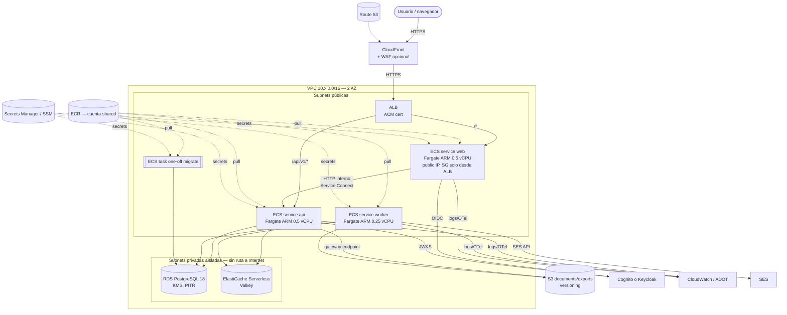
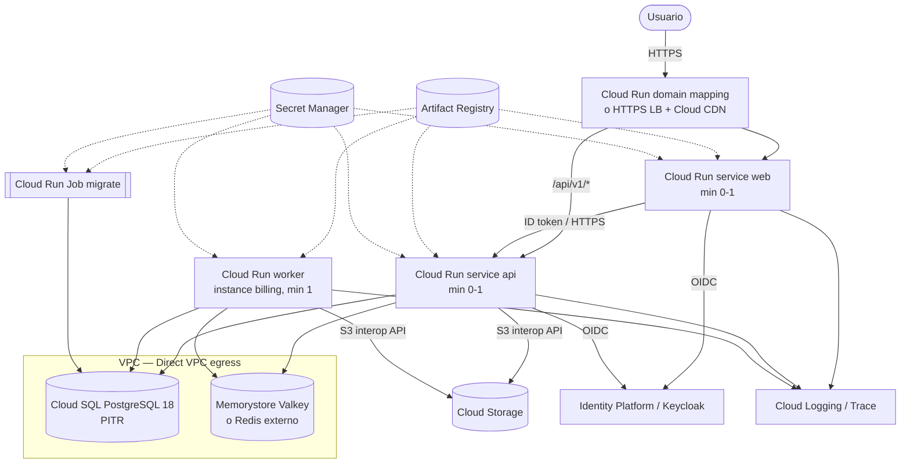
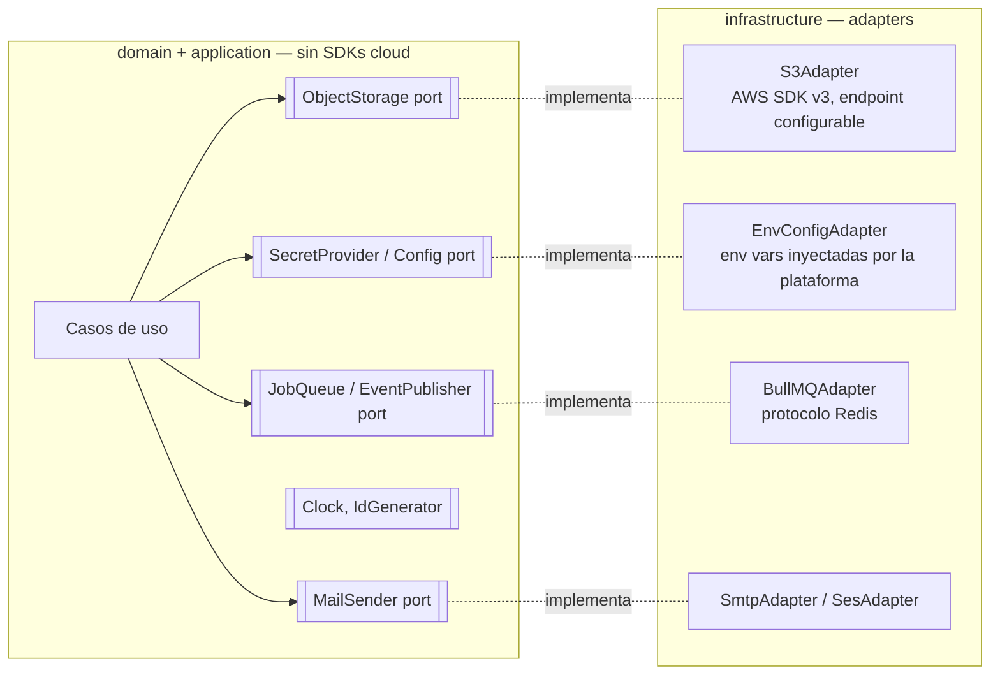

# 21 — Opciones de despliegue cloud

> **Estado:** Propuesto · **Fecha:** 2026-10-01 · **Relacionado:** [ARCHITECTURE.md](ARCHITECTURE.md) §2, §5 (ADR-0013), §11, §15 · [07-c4-architecture.md](07-c4-architecture.md) · [12-security.md](12-security.md) · [18-observability.md](18-observability.md) · [20-container-strategy.md](20-container-strategy.md) · [22-infrastructure.md](22-infrastructure.md) · [23-ci-cd.md](23-ci-cd.md) · [30-backup-and-disaster-recovery.md](30-backup-and-disaster-recovery.md) · ADR-0009, ADR-0010, ADR-0013, ADR-0014, ADR-0020 · SPIKE-09

> **Actualización 2026-10-03:** [SPIKE-09](../spikes/SPIKE-09-deploy-costs/README.md) re-verificó precios, midió latencia desde Bolivia y amplió el análisis a VPS único + Compose, PostgreSQL gestionado barato, object storage, IdP y observabilidad; propone [ADR-0027](adr/0027-destino-de-despliegue-inicial-vps-compose.md) (default ≈ USD 27–30/mes). Este documento se conserva como análisis de las opciones de plataforma (nivel N4 y alternativas).

> **Precios:** todas las cifras son **aproximadas**, en USD, región `us-east-1` (o equivalente más barata del proveedor) salvo indicación, consultadas en fuentes públicas a **2026-10-01**, sin impuestos ni free tier salvo que se diga. **Verificar en SPIKE-09** con la calculadora oficial y un PoC real antes de decidir.

---

## 1. Contexto y requisitos de despliegue

| Requisito | Valor / fuente |
|---|---|
| Deployables | `finance-web` (Next.js BFF), `finance-api` (procesos `api` + `worker` + one-shot `migrate`), `finance-ml` (Phase 8, opcional) |
| Contratos externos (portabilidad) | **PostgreSQL** (wire protocol + SQL estándar + RLS), **protocolo Redis** (BullMQ), **API S3**, **OIDC** |
| Carga | 1 usuario inicialmente; picos irrelevantes. Multi-workspace en el modelo de datos. |
| Datos | Financieros personales sensibles ⇒ cifrado en reposo y tránsito, backups con PITR ([30](30-backup-and-disaster-recovery.md)) |
| Entornos | `staging` y `production` (más `dev` efímero opcional — ver [22-infrastructure.md](22-infrastructure.md)) |
| Presupuesto | **Decisión del owner** (ARCHITECTURE §5: "Propuesto (decisión del owner sobre presupuesto)") |
| Objetivos secundarios | *Learning value* (plataforma cloud mainstream), paridad con local, IaC madura |
| Ubicación del usuario | Bolivia (latencia: `sa-east-1` São Paulo ≈ 30–60 ms vs `us-east-1` ≈ 90–130 ms, aprox.; `sa-east-1` cuesta ≈ 30–50 % más) |

## 2. Option A — AWS ECS on Fargate (recomendada)

### 2.1 Componentes

| Necesidad | Servicio AWS | Perfil costo mínimo |
|---|---|---|
| Registro de imágenes | **ECR** (tag immutability, scan on push, lifecycle) | Repos en cuenta `shared`, pull cross-account |
| Cómputo | **ECS on Fargate** (ARM64/Graviton), un *service* por proceso: `web`, `api`, `worker`; `migrate` como **task one-off** (`RunTask`) | Tareas 0.25–0.5 vCPU; staging programado a 0 fuera de horario |
| Entrada HTTP | **ALB** (HTTPS con ACM, reglas por host/path) | 1 ALB por entorno; alternativas en §2.4 |
| CDN / estáticos | **CloudFront** delante del ALB (cache `/_next/static/*`, compresión, TLS) + opcional WAF | Price class 100 |
| Base de datos | **RDS for PostgreSQL 18** (`db.t4g.micro`/`small`, gp3, cifrado KMS, PITR) | Single-AZ en ambos entornos inicialmente; Multi-AZ prod cuando el uso lo justifique |
| Cache / colas | **ElastiCache Serverless for Valkey** (o nodo `cache.t4g.micro`) | Serverless: mínimo 100 MB facturable |
| Objetos | **S3** (SSE-KMS o SSE-S3, versioning, Block Public Access, presigned URLs) | Lifecycle a IA/Glacier para versiones antiguas |
| Secretos | **Secrets Manager** (credenciales RDS gestionadas por RDS, secretos app) + **SSM Parameter Store** (config no secreta) | Agrupar secretos por servicio (JSON) para reducir nº de secretos |
| Identidad (usuarios) | **Cognito** (OIDC) *o* Keycloak en ECS — decisión ADR-0010/ADR-0013 | Cognito: free tier generoso para pocos MAU (verificar tier/precio actual); Keycloak en Fargate añade ≈ 15–30 USD/mes/entorno + DB |
| Email | **SES** | Céntimos |
| Observabilidad | **CloudWatch Logs/Metrics/Alarms** + ADOT/OTel collector sidecar o export directo a Grafana Cloud free tier (ADR-0020, [18](18-observability.md)) | Retención logs 14–30 días |
| DNS / TLS | **Route 53** + **ACM** | 0.50 USD/zona |
| Auditoría / seguridad | CloudTrail (trail de organización), GuardDuty (opcional), AWS Budgets + alarmas de costo | Budgets gratis (2 primeros) |
| Backups | RDS automated backups + **AWS Backup** (copia cross-account/cross-region) | Ver [30](30-backup-and-disaster-recovery.md) |

### 2.2 Diagrama de despliegue (Option A, por entorno)



### 2.3 La trampa del NAT Gateway y alternativas

Las tareas Fargate necesitan salida a Internet (o endpoints) para: pull de ECR, Secrets Manager, CloudWatch Logs, SES, Cognito/JWKS, proveedores de tasas FX (Phase 5).

| Alternativa | Costo aprox./mes (por entorno) | Pros | Contras |
|---|---|---|---|
| **NAT Gateway** ×1 (1 AZ) | ≈ 33 (0.045 USD/h) + 0.045 USD/GB procesado + IPv4 3.65 | Patrón "de libro"; tareas sin IP pública | Caro para una app personal; ×2 si se quiere HA por AZ (≈ 66+) |
| **VPC interface endpoints** (ecr.api, ecr.dkr, logs, secretsmanager, ssm, sts…) | ≈ 7.3 por endpoint por AZ ⇒ 6 endpoints × 2 AZ ≈ 88 | Tráfico privado | **Más caro** que NAT a esta escala; no cubre APIs externas |
| **Subnets públicas + IP pública por tarea + SG estricto** | ≈ 3.65 por tarea (IPv4 0.005 USD/h) | Barato; sin NAT | Tareas con IP pública (mitigado: SG inbound solo desde SG del ALB; sin puertos abiertos a Internet) |
| NAT instance (p. ej. `fck-nat` en `t4g.nano`) | ≈ 3–5 | Muy barato | Se opera una EC2 (parches, HA manual) |
| IPv6 + egress-only IGW | ≈ 0 | Sin cargo IPv4 | ECR/servicios AWS y terceros con soporte IPv6 desigual; complejidad — evaluar en SPIKE-09 |

**Propuesta (perfil costo mínimo):** subnets **públicas** para tareas Fargate con `assignPublicIp=ENABLED`, SG inbound exclusivamente desde el SG del ALB (api/web) y **sin inbound** para worker; **S3 gateway endpoint** (gratis) para tráfico a S3; RDS y ElastiCache en subnets **privadas sin ruta a Internet**. Revisar al crecer (pasar a NAT si se exige que ninguna tarea tenga IP pública — requisito a confirmar con [12-security.md](12-security.md)).

### 2.4 Palancas de costo adicionales (a medir en SPIKE-09)

- **ALB compartido**: un ALB por entorno cuesta ≈ 16.4 USD/mes fijos + LCU + 2 IPv4. Opciones: (a) un único ALB con reglas por host para staging y prod (solo si comparten cuenta — choca con el aislamiento por cuenta de [22-infrastructure.md](22-infrastructure.md)); (b) **ECS Express Mode** (anunciado 2025; comparte un ALB entre hasta 25 servicios — verificar encaje con Terraform); (c) **API Gateway HTTP API + VPC Link + Cloud Map** en lugar de ALB (≈ 1 USD/millón de requests; sin costo fijo relevante).
- **Staging programado**: Application Auto Scaling *scheduled actions* a `desiredCount=0` noches/fines de semana; RDS staging detenido (se auto-arranca a los 7 días; script de re-stop) o **staging efímero** creado/destruido por Terraform cuando se necesita.
- **Graviton/ARM64** (≈ −20 % vs x86) y **Fargate Spot** para `worker` de staging.
- **Compute Savings Plans** (1 año) cuando el consumo se estabilice.
- **Logs**: retención corta, nivel `info`, muestreo de traces.
- Nota: **AWS App Runner dejó de aceptar clientes nuevos (2026-04-30)**; AWS recomienda ECS Express Mode. Por eso App Runner no figura como opción.

### 2.5 Estimación de costo Option A (aprox., 2026-10-01, verificar en SPIKE-09)

Supuestos: `us-east-1`, ARM64, on-demand, 730 h/mes; Fargate ARM ≈ 0.0324 USD/vCPU-h y ≈ 0.0036 USD/GB-h; IPv4 0.005 USD/h; ALB ≈ 0.0225 USD/h + LCU; RDS `db.t4g.micro` ≈ 0.016 USD/h, gp3 ≈ 0.115 USD/GB-mes; ElastiCache Serverless Valkey mínimo ≈ 6 USD/mes.

| Componente | Producción | Staging (programado ~30 % del tiempo) |
|---|---|---|
| Fargate: web 0.5 vCPU/1 GB, api 0.5/1 GB, worker 0.25/0.5 GB | ≈ 36 | ≈ 6–8 (tareas 0.25 vCPU) |
| IPv4 públicas (3 tareas + ALB 2) | ≈ 18 | ≈ 10 |
| ALB (fijo + ~1 LCU) | ≈ 22 | ≈ 22 (o 0 si efímero / compartido) |
| RDS `db.t4g.micro` Single-AZ + 20 GB gp3 | ≈ 14 (Multi-AZ ≈ 28) | ≈ 8 (parado fuera de horario) |
| ElastiCache Serverless Valkey | ≈ 7–10 | ≈ 7 |
| S3 + CloudFront (bajo volumen) | ≈ 1–3 | ≈ 1 |
| Secrets Manager (~6 secretos) + KMS (1–2 CMK) | ≈ 4–5 | ≈ 4 |
| CloudWatch (logs ~5 GB, métricas, alarmas) | ≈ 5–8 | ≈ 3 |
| Route 53, ECR, SES, Budgets | ≈ 2–3 | ≈ 1 |
| AWS Backup cross-region/cross-account copy | ≈ 1–3 | — |
| **Total aprox.** | **≈ 110–130 USD/mes** | **≈ 55–65 USD/mes** (≈ 10–20 si es efímero) |

**Staging + producción ≈ 125–195 USD/mes** según el perfil (efímero vs programado). Con Keycloak en Fargate en lugar de Cognito: **+30–60 USD/mes** (dos entornos). Con NAT Gateway por entorno: **+35–40 USD/mes por entorno**. Con WAF: **+6–10 USD/mes por Web ACL**.

## 3. Option B — Kubernetes (EKS)

### 3.1 Cómo sería

- **EKS** (control plane ≈ 73 USD/mes por clúster en soporte estándar) + nodos (Karpenter/managed node groups) o **EKS Auto Mode** / Fargate profiles.
- Empaquetado: **Helm chart** `pfos` (o Kustomize) con `Deployment` web/api/worker, `Job` (pre-upgrade hook o Argo CD *PreSync*) para `migrate`, `Service`, `Ingress` (AWS Load Balancer Controller → ALB), `ConfigMap` (config no secreta), `Secret` sincronizados desde Secrets Manager con **External Secrets Operator**, `HorizontalPodAutoscaler`, `PodDisruptionBudget`, `NetworkPolicy`, `ServiceAccount` con IRSA/Pod Identity.
- Observabilidad: OTel Collector (DaemonSet/Deployment), Prometheus/Grafana (o AMP/AMG), Fluent Bit.
- GitOps: Argo CD o Flux.

```yaml
# Ilustrativo — fragmento values.yaml (NO se implementa)
api:
  image: { repository: <ecr>/finance-api, digest: sha256:<digest> }
  args: ["api"]
  resources: { requests: { cpu: 250m, memory: 512Mi }, limits: { memory: 768Mi } }
  probes: { liveness: /health/live, readiness: /health/ready, startup: /health/live }
  hpa: { minReplicas: 1, maxReplicas: 3, targetCPUUtilizationPercentage: 70 }
worker:
  args: ["worker"]
  terminationGracePeriodSeconds: 60
migrate:
  hook: pre-upgrade
  args: ["migrate"]
```

### 3.2 Por qué no ahora

| Factor | Evaluación |
|---|---|
| Costo | Control plane (≈ 73/mes **por clúster**) + nodos/ALB ⇒ staging+prod ≥ 250–350 USD/mes aprox. |
| Complejidad operativa | Upgrades de versión de K8s (cadencia ~4 meses, soporte estándar ~14 meses), add-ons, CNI, controllers, RBAC, GitOps — desproporcionado para 1 persona y 3 procesos |
| Beneficio | Portabilidad multi-cloud y ecosistema; ninguno es necesario para 1 usuario |
| Learning value | Alto, pero se puede obtener fuera del camino crítico del producto |

**Rechazada por ahora** (ARCHITECTURE §5). Reconsiderar si: ≥ 8–10 servicios desplegables, equipo ≥ 3 ingenieros con experiencia K8s, necesidad multi-cloud/on-prem real, o requisito de aislamiento por tenant a nivel de namespace. Las imágenes, probes y config 12-factor ya son compatibles: la migración sería de empaquetado, no de aplicación.

## 4. Option C — Plataformas simplificadas

### 4.1 Google Cloud Run (plan B documentado)

| Necesidad | Servicio |
|---|---|
| Cómputo | Cloud Run services `web`, `api` (request-based billing, `min-instances=0` en staging, `0–1` en prod); `worker` como service con **instance-based billing** y `min-instances=1` (o *worker pools* — verificar estado GA); `migrate` como **Cloud Run Job** |
| BD | Cloud SQL for PostgreSQL 18 (`db-f1-micro`/`db-g1-small` shared-core para empezar; PITR) |
| Redis | Memorystore for Valkey (costo mínimo alto para este tamaño) **o** Redis gestionado externo con protocolo Redis (p. ej. Upstash) — verificar compatibilidad BullMQ (requiere comandos bloqueantes/Lua) |
| Objetos | Cloud Storage con **XML API interoperable S3** (HMAC keys) — el puerto `ObjectStorage` sigue hablando S3; validar presigned URLs (firma V4) en SPIKE-09 |
| Secretos | Secret Manager montado como env vars |
| Registro | Artifact Registry |
| Observabilidad | Cloud Logging/Trace/Monitoring (OTel nativo) |
| IdP | Identity Platform / Keycloak en Cloud Run |
| CI/CD | GitHub Actions + Workload Identity Federation (OIDC, sin claves) |

Precios aprox. (2026-10-01): Cloud Run ≈ 0.000024 USD/vCPU-s con free tier mensual (≈ 180 000 vCPU-s, 360 000 GiB-s, 2 M requests); Cloud SQL `db-f1-micro` ≈ 8–10 USD/mes + almacenamiento.

### 4.2 Otras plataformas

| Plataforma | Modelo | BD gestionada | Redis | Notas (aprox., 2026-10-01) |
|---|---|---|---|---|
| **Fly.io** | Machines (micro-VMs) por región, cerca del usuario (región `gru`/`scl` posible) | Managed Postgres desde ≈ 38 USD/mes; Postgres "no gestionado" barato pero lo operas tú | Upstash vía Fly | Muy buena latencia LATAM; menos IaC madura (Terraform provider limitado) |
| **Render** | Web services + background workers + cron jobs | Postgres desde ≈ 7 USD/mes (sin HA); planes superiores con PITR | Key Value (Valkey) desde ≈ 10 USD/mes | DX excelente; Blueprints (YAML) como IaC; observabilidad básica |
| **Railway** | Uso medido por recurso + plan (Hobby/Pro) | Postgres en contenedor con backups | Redis plantilla | Muy rápido para empezar; menor control de red/seguridad; backups menos robustos |
| **DigitalOcean App Platform** | Componentes desde ≈ 5 USD/mes | Managed PostgreSQL desde ≈ 15 USD/mes (PITR incluido) | Managed Valkey ≈ 15 USD/mes | Simple y predecible; Terraform provider oficial |
| **Azure Container Apps** | Consumption (free grant mensual ≈ 180 000 vCPU-s / 360 000 GiB-s / 2 M req), scale-to-zero, **jobs** para migrate, KEDA | Azure Database for PostgreSQL Flexible (Burstable B1ms ≈ 13–15 USD/mes + storage) | Azure Managed Redis / Cache for Redis (mínimo relativamente alto) | Buen encaje técnico (jobs, Dapr/KEDA, revisiones); learning value medio |

### 4.3 Diagrama de despliegue (Option C — Cloud Run)



## 5. Costos comparados (staging + producción, tamaño mínimo)

Todas las cifras **aprox., USD/mes, 2026-10-01, verificar en SPIKE-09**. Incluyen cómputo para web+api+worker, PostgreSQL gestionado, Redis-compatible, almacenamiento de objetos, secretos y logs básicos. No incluyen dominio ni IdP de pago.

| Opción | Producción | Staging | Total aprox. | Comentario |
|---|---|---|---|---|
| A — ECS/Fargate (costo mínimo, sin NAT, staging programado) | 110–130 | 55–65 | **165–195** | Con staging efímero y/o API GW en lugar de ALB: **≈ 120–150** |
| A' — ECS/Fargate "de libro" (NAT ×2, Multi-AZ, WAF) | 210–250 | 150–180 | 360–430 | Referencia de lo que **no** se hará inicialmente |
| B — EKS | 180–230 | 120–150 | **300–380** | Dominado por control plane + nodos + ALB |
| C1 — Cloud Run + Cloud SQL | 45–80 | 15–30 | **60–110** | Worker always-on es la partida principal; Memorystore subiría el costo |
| C2 — Render | 40–75 | 30–45 | **70–120** | Planes fijos por servicio |
| C3 — Railway | 20–45 | 10–25 | **30–70** | Uso medido; menor robustez de backups |
| C4 — Fly.io | 50–80 | 15–40 | **65–120** | Managed Postgres domina |
| C5 — DO App Platform | 45–70 | 40–60 | **85–130** | PG + Valkey gestionados ≈ 30/entorno |
| C6 — Azure Container Apps | 35–60 | 25–45 | **60–105** | Scale-to-zero; PG flexible + Redis dominan |

## 6. Matriz comparativa cualitativa

| Criterio | A — ECS/Fargate | B — EKS | C1 — Cloud Run | C2/C3 — Render/Railway | C4 — Fly.io | C5 — DO App Platform | C6 — Azure Container Apps |
|---|---|---|---|---|---|---|---|
| Costo (§5) | Medio | Alto | Bajo | Bajo | Bajo-medio | Medio | Bajo |
| Complejidad operativa | Media (VPC, IAM, ALB) | Alta | Baja | Muy baja | Media-baja | Muy baja | Baja-media |
| Vendor lock-in | Medio (task defs, IAM; contratos estándar) | Bajo-medio | Medio | Medio | Medio | Medio | Medio |
| Escalabilidad | Alta | Muy alta | Muy alta | Media | Alta | Media | Alta |
| Observabilidad | Buena (CloudWatch + ADOT/OTel) | Muy buena (si se opera) | Muy buena (nativa OTel) | Básica | Media (Prometheus/Grafana gestionado) | Básica | Buena (Log Analytics, costo) |
| BD gestionada | Excelente (RDS PG 18, PITR, snapshots, cross-region) | Excelente (RDS) | Muy buena (Cloud SQL) | Buena (Render) / Básica (Railway) | Media | Buena | Buena |
| Velocidad de despliegue | Media (rolling ECS ~3–6 min) | Media | Alta (~1 min) | Muy alta | Alta | Alta | Alta |
| Integración CI/CD | Muy buena (OIDC, actions oficiales) | Buena (GitOps) | Muy buena (WIF) | Muy buena (git push / API) | Buena (flyctl) | Buena | Buena (OIDC) |
| Autoscaling | Target tracking / scheduled | HPA/KEDA/Karpenter | Automático, scale-to-zero | Limitado | Autostop/autostart | Limitado | KEDA, scale-to-zero |
| Backups | RDS PITR + AWS Backup (cross-account/region, vault lock) | idem | Cloud SQL PITR + exports | Según plan | Según oferta | PITR incluido | PITR (7–35 días) |
| Disaster recovery | Muy bueno (cross-region snapshots, IaC) | Muy bueno | Bueno | Limitado | Medio (multi-región nativo) | Medio | Bueno |
| Learning value | **Muy alto** (AWS mainstream: VPC, IAM, ECS, RDS) | Muy alto (pero costoso) | Medio | Bajo | Medio | Bajo | Medio |

## 7. Scoring ponderado

Escala 1 (peor) – 5 (mejor). Dos perfiles de pesos para hacer explícita la dependencia de la decisión con las prioridades del owner.

| Criterio | Peso "Costo primero" | Peso "Plataforma/aprendizaje" | A ECS | B EKS | C1 Cloud Run | C2 Render | C3 Railway | C4 Fly | C5 DO | C6 ACA |
|---|---|---|---|---|---|---|---|---|---|---|
| Costo | 20 | 10 | 2 | 1 | 4 | 4 | 4 | 4 | 3 | 4 |
| Complejidad operativa (5 = simple) | 15 | 10 | 3 | 1 | 4 | 5 | 5 | 4 | 5 | 4 |
| Lock-in (5 = bajo) | 10 | 10 | 3 | 4 | 3 | 3 | 3 | 3 | 3 | 3 |
| BD gestionada | 10 | 10 | 5 | 5 | 4 | 3 | 3 | 3 | 4 | 4 |
| Observabilidad | 8 | 10 | 4 | 4 | 4 | 2 | 2 | 3 | 2 | 3 |
| Learning value | 10 | 25 | 5 | 5 | 3 | 2 | 2 | 3 | 2 | 3 |
| CI/CD | 5 | 5 | 4 | 3 | 4 | 4 | 4 | 4 | 4 | 4 |
| Autoscaling | 5 | 5 | 4 | 5 | 5 | 3 | 3 | 4 | 3 | 5 |
| Backup/DR | 7 | 5 | 5 | 5 | 4 | 2 | 2 | 2 | 4 | 4 |
| Velocidad de despliegue | 5 | 5 | 3 | 2 | 5 | 5 | 5 | 5 | 5 | 4 |
| Escalabilidad | 5 | 5 | 5 | 5 | 5 | 3 | 3 | 4 | 3 | 5 |
| **Total "Costo primero"** (÷100) | 100 | — | **3.62** | 3.17 | **3.95** | 3.40 | 3.40 | 3.53 | 3.44 | 3.82 |
| **Total "Plataforma/aprendizaje"** (÷100) | — | 100 | **4.00** | 3.75 | 3.80 | 3.05 | 3.05 | 3.40 | 3.15 | 3.65 |

Lectura: con prioridad a costo, **Cloud Run** gana (y ACA queda segunda); con prioridad a plataforma/aprendizaje y robustez de datos, **ECS/Fargate** gana. EKS no gana en ningún perfil (queda segundo en "Plataforma/aprendizaje" por learning value, pero su costo y complejidad lo descartan). Las PaaS (Render/Railway/DO) pierden por backup/DR y learning value, críticos para datos financieros.

## 8. Recomendación

Consistente con ARCHITECTURE §5 / ADR-0013:

1. **Primaria: AWS ECS on Fargate con perfil de costo mínimo** — ARM64, sin NAT Gateway (subnets públicas + SG estrictos + S3 gateway endpoint), RDS `db.t4g.micro` Single-AZ con PITR, ElastiCache Serverless Valkey, CloudFront + ALB, staging programado/efímero, Cognito como IdP si ADR-0010 lo acepta. Presupuesto objetivo **≈ 120–195 USD/mes** staging+prod (aprox., verificar SPIKE-09).
2. **Plan B documentado: Google Cloud Run** + Cloud SQL (+ Redis-compatible gestionado), mismo pipeline (build once, OIDC/WIF), **≈ 60–110 USD/mes**.
3. **Rechazada por ahora: EKS** (§3.2).

### 8.1 Condiciones que cambian la recomendación

| Condición | Cambio |
|---|---|
| Presupuesto del owner **< ~120 USD/mes** para staging+prod | Option C: **Cloud Run** (preferente) o Azure Container Apps |
| Presupuesto **< ~50 USD/mes** | Railway/Render con backups lógicos propios diarios a S3/R2 (pg_dump cifrado) — aceptando RPO ≤ 24 h — o una sola VM con Compose (fuera de este análisis; requeriría ADR) |
| El owner no valora el learning value de AWS | Cloud Run |
| SPIKE-09 mide ECS > 1.5× la estimación | Re-evaluar con API Gateway/Express Mode; si persiste, Cloud Run |
| Requisito de latencia < 50 ms desde Bolivia | `sa-east-1` (+30–50 % costo) o Fly.io región cercana |
| Requisito de "ninguna tarea con IP pública" (security review) | ECS con NAT (instance o gateway) ⇒ +5 a +40 USD/mes/entorno |
| ≥ 8–10 servicios / equipo ≥ 3 / multi-cloud | Reabrir EKS (ADR nuevo) |

## 9. Portabilidad: cómo se mantiene independiente el dominio



- **Contratos externos únicos:** PostgreSQL, protocolo Redis, API S3, OIDC (+ SMTP/SES detrás de un puerto). Nada de DynamoDB, SQS, EventBridge, Lambda ni Cognito SDK en el código de app.
- **Secretos**: la app no llama a Secrets Manager; la plataforma inyecta env vars (ECS `secrets`, Cloud Run `--set-secrets`, Compose `.env`). Cambiar de cloud = cambiar IaC, no código.
- **OIDC genérico**: el BFF y la API usan discovery (`OIDC_ISSUER`) y JWKS; Cognito/Keycloak/Identity Platform intercambiables (salvo claims custom, mapeados en un adapter).
- **IaC por proveedor**: módulos Terraform específicos por cloud; las imágenes y el pipeline de build son idénticos.
- **Datos**: exportables por `pg_dump` + sync S3 ⇒ migración entre clouds en horas ([30](30-backup-and-disaster-recovery.md)).

## 10. Preguntas abiertas

1. **Presupuesto mensual máximo** del owner para staging+prod (determina A vs C — §8.1).
2. **Región**: `us-east-1` (barata) vs `sa-east-1` (latencia desde Bolivia). ¿Hay requisitos de residencia de datos?
3. **IdP cloud**: Cognito vs Keycloak en Fargate (ADR-0010). Impacta costo (+30–60 USD/mes) y paridad con local.
4. ¿Se acepta que las tareas Fargate tengan IP pública (SG estricto, sin inbound) para evitar NAT? Validar con [12-security.md](12-security.md).
5. ¿Staging programado (siempre existe) o efímero (Terraform apply/destroy bajo demanda)?
6. ¿WAF desde el día 1 en producción (+6–10 USD/mes) o rate limiting en app + CloudFront?
7. RDS Multi-AZ en producción: ¿desde el inicio (+≈14 USD/mes) o cuando RTO lo requiera?
8. Validar en SPIKE-09: ECS Express Mode y API Gateway HTTP API como sustitutos baratos del ALB; BullMQ sobre ElastiCache Serverless (compatibilidad de comandos y latencia).
