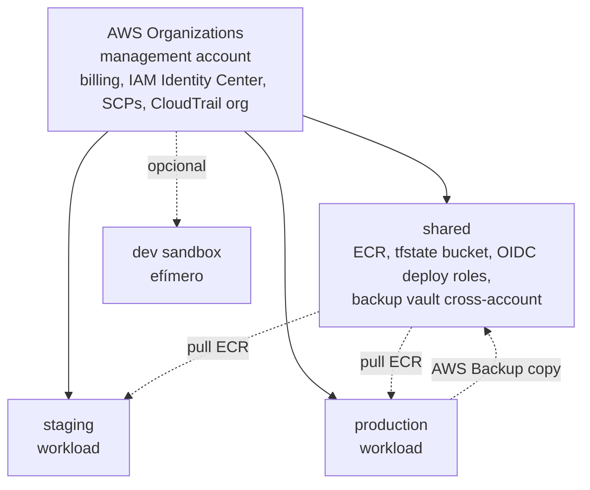
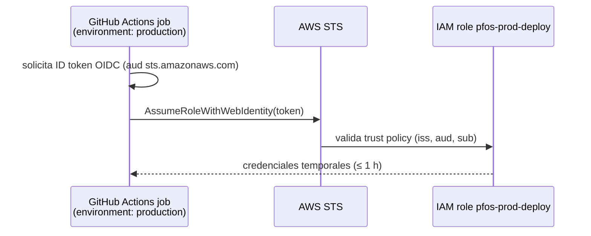
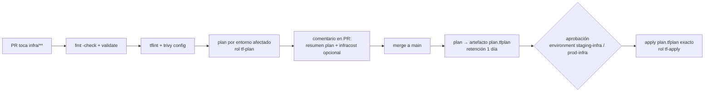

# 22 — Infraestructura como código (Terraform / OpenTofu)

> **Estado:** Propuesto · **Fecha:** 2026-10-01 · **Relacionado:** [ARCHITECTURE.md](ARCHITECTURE.md) §5 (ADR-0013, ADR-0014), §6, §11 · [12-security.md](12-security.md) · [20-container-strategy.md](20-container-strategy.md) · [21-cloud-deployment-options.md](21-cloud-deployment-options.md) · [23-ci-cd.md](23-ci-cd.md) · [30-backup-and-disaster-recovery.md](30-backup-and-disaster-recovery.md) · ADR-0014 · SPIKE-09

> Todo HCL de este documento es **ilustrativo** (Phase 0). No se crea `infra/terraform/` hasta después del DESIGN GATE.

> **Actualización 2026-10-05:** con [ADR-0027](adr/0027-destino-de-despliegue-inicial-vps-compose.md) aceptado (presupuesto USD 10–20/mes), la IaC real del nivel N1 vive en **`infra/`** (OpenTofu, sin `terraform/` intermedio): ver §14. El layout multi-cuenta/ECS de §2–§11 queda como diseño del nivel N4.

---

## 1. Principios

1. **Todo lo reproducible, en código** (Terraform ≥ 1.11, compatible con **OpenTofu** ≥ 1.10): red, cómputo, datos, IAM, DNS, observabilidad, presupuestos.
2. **Módulos por capa** (ARCHITECTURE §6): `network, compute, database, cache, storage, security, observability, dns, cicd`; composición por entorno.
3. **State remoto por entorno**, cifrado, versionado, con locking nativo de S3.
4. **Cero secretos en código, tfvars o state cuando sea evitable** (write-only/ephemeral, RDS-managed secrets).
5. **Cero credenciales de larga vida**: GitHub Actions → AWS por **OIDC**.
6. **Plan en PR, apply con aprobación**; drift detection programado.
7. **Cloud-specific en IaC, cloud-agnostic en la app** ([21](21-cloud-deployment-options.md) §9).

## 2. Organización de cuentas AWS (propuesta)



- **management**: sin workloads; solo Organizations, IAM Identity Center (acceso humano con MFA), SCPs (denegar regiones no usadas, denegar desactivar CloudTrail/GuardDuty, denegar `iam:CreateUser` access keys salvo break-glass), CloudTrail de organización, Budgets consolidados.
- **shared**: ECR (repos `finance-web`, `finance-api`, `finance-ml`), bucket de state, rol OIDC de build/push, **vault de AWS Backup** receptor de copias (aislamiento ante compromiso de la cuenta prod — [30](30-backup-and-disaster-recovery.md)).
- **staging / production**: workloads aislados (blast radius, permisos, costos por cuenta).
- Alternativa simplificada (si el owner prefiere): una cuenta con separación por VPC + tags + IAM — **no recomendada** para datos financieros (un error de IAM afecta a prod). Ver Preguntas abiertas.

## 3. Layout del repositorio

```
infra/terraform/
├─ modules/
│  ├─ network/        # VPC, subnets públicas/privadas aisladas, IGW, S3 gateway endpoint, flow logs (opcional)
│  ├─ compute/        # ECS cluster, task definitions (web/api/worker/migrate), services, ALB, target groups, autoscaling, scheduled scaling
│  ├─ database/       # RDS PostgreSQL 18, parameter group, subnet group, KMS, managed master secret, backups/PITR
│  ├─ cache/          # ElastiCache Serverless Valkey (o node-based), SG
│  ├─ storage/        # S3 buckets (documents, exports, logs), versioning, lifecycle, BPA, CORS, replicación opcional
│  ├─ security/       # KMS keys, IAM roles de tareas (task/execution), Secrets Manager (contenedores), SG base, GuardDuty opcional
│  ├─ observability/  # Log groups, métricas, alarmas, dashboards, SNS, Budgets/anomaly detection, ADOT config
│  ├─ dns/            # Route 53 zone/records, ACM certs, CloudFront distribution (+ WAF opcional)
│  └─ cicd/           # GitHub OIDC provider, roles plan/apply/deploy, ECR repos + lifecycle (en shared)
├─ environments/
│  ├─ dev/            # sandbox efímero opcional (apply/destroy bajo demanda)
│  ├─ staging/
│  │  ├─ backend.tf   # state: s3://pfos-tfstate-<shared-acct>/staging/terraform.tfstate
│  │  ├─ providers.tf
│  │  ├─ main.tf      # composición de módulos
│  │  ├─ variables.tf
│  │  ├─ terraform.tfvars   # SOLO valores no secretos
│  │  └─ outputs.tf
│  └─ prod/
├─ bootstrap/         # (extensión propuesta) bucket de state + OIDC provider inicial; apply manual una vez
├─ global/            # (extensión propuesta) recursos de cuenta shared/management (ECR, Organizations SCPs, budgets org)
├─ .tflint.hcl
├─ .trivyignore.yaml
└─ versions.tf        # required_version y required_providers comunes (copiado/symlink por entorno)
```

> `bootstrap/` y `global/` **extienden** el layout de ARCHITECTURE §6 (`modules` + `environments/{dev,staging,prod}`); se proponen para resolver el problema huevo-gallina del state y los recursos compartidos. Alternativa sin extender: tratar `shared` como un entorno más (`environments/shared/`). Ver Preguntas abiertas.

## 4. State remoto y locking

**Verificado (2026-10-01):** el backend S3 soporta **locking nativo** con `use_lockfile = true` (GA en Terraform 1.11; escribe un objeto `.tflock` junto al state usando escrituras condicionales de S3). Los argumentos de DynamoDB (`dynamodb_table`) están **deprecados** y se eliminarán en una versión futura. OpenTofu soporta `use_lockfile` desde 1.10 (verificar en el momento de materializar). ⇒ **No se crea tabla DynamoDB**.

```hcl
# environments/prod/backend.tf — ILUSTRATIVO
terraform {
  backend "s3" {
    bucket       = "pfos-tfstate-<shared-account-id>"
    key          = "prod/terraform.tfstate"
    region       = "us-east-1"
    encrypt      = true
    kms_key_id   = "alias/pfos-tfstate"
    use_lockfile = true                     # locking nativo S3, sin DynamoDB
    assume_role = {
      role_arn = "arn:aws:iam::<shared-account-id>:role/pfos-tfstate-access"
    }
  }
}
```

- Bucket de state: versioning ON, SSE-KMS, Block Public Access, política que niega `s3:DeleteObject` salvo rol break-glass, lifecycle de versiones no actuales a 90 días, Object Lock **no** (incompatible con limpieza del `.tflock`; verificar).
- **Un state por entorno** (`dev/`, `staging/`, `prod/`, `global/`); nunca workspaces CLI para separar entornos (dificulta permisos por entorno).
- El state puede contener valores sensibles (endpoints, ARNs; nunca contraseñas — §6): acceso limitado a los roles `plan`/`apply` del entorno.

## 5. Naming y tagging

- Nombre: `pfos-<env>-<component>[-<qualifier>]` (p. ej. `pfos-prod-api`, `pfos-staging-rds`, `pfos-prod-documents-<acct>` para buckets globalmente únicos).
- `default_tags` en el provider (aplica a todo recurso):

```hcl
provider "aws" {
  region = var.region
  assume_role { role_arn = var.deploy_role_arn }
  default_tags {
    tags = {
      Project            = "pfos"
      Environment        = var.environment          # dev | staging | prod
      ManagedBy          = "terraform"
      Repository         = "github.com/<owner>/personal-finances"
      Owner              = "owner"                  # alias, no email
      CostCenter         = "personal"
      DataClassification = var.data_classification  # confidential (prod) | internal (staging)
    }
  }
}
```

- Tags obligatorios verificados por política (§9) y por **Tag Policies** de Organizations.
- Cost allocation tags `Project`, `Environment` activados en Billing.

## 6. Variables y secretos

| Tipo | Dónde | Ejemplo |
|---|---|---|
| Config no sensible | `terraform.tfvars` versionado | tamaños de tarea, `desired_count`, CIDR, retención |
| Contraseña maestra RDS | **RDS-managed**: `manage_master_user_password = true` (RDS crea/rota el secreto en Secrets Manager; nunca pasa por Terraform/state) | — |
| Roles de app/migración de PostgreSQL (`pfos_app`, `pfos_migrator`) | Creados por la **migración bootstrap** (SQL) con contraseña leída de Secrets Manager en runtime; el secreto se crea vacío en Terraform y su valor se genera **out-of-band** (`aws secretsmanager put-secret-value` con valor aleatorio) o con un **write-only attribute** (`secret_string_wo`, Terraform ≥ 1.11) alimentado por un `ephemeral "random_password"` | — |
| Secretos de app (cookie secret, OIDC client secret) | Secrets Manager; valor out-of-band o `secret_string_wo` + recurso `ephemeral` | `pfos/prod/web` (JSON) |
| Inyección a tareas | `secrets = [{ name, valueFrom = "<arn>:key::" }]` en task definition | — |
| Variables CI | GitHub Environments (vars/secrets) — nunca credenciales AWS ([23](23-ci-cd.md)) | `AWS_ROLE_ARN` |

```hcl
# modules/security/secrets.tf — ILUSTRATIVO
ephemeral "random_password" "session_cookie" {
  length  = 48
  special = false
}

resource "aws_secretsmanager_secret" "web" {
  name       = "pfos/${var.environment}/web"
  kms_key_id = aws_kms_key.app.arn
  recovery_window_in_days = 30
}

resource "aws_secretsmanager_secret_version" "web" {
  secret_id                = aws_secretsmanager_secret.web.id
  secret_string_wo         = jsonencode({ SESSION_COOKIE_SECRET = ephemeral.random_password.session_cookie.result })
  secret_string_wo_version = 1          # incrementar para rotar
}
```

> Write-only/ephemeral: requieren Terraform ≥ 1.11 y provider AWS con soporte (`secret_string_wo`); comprobar compatibilidad OpenTofu en el momento de implementar. Fallback: secreto creado vacío + `put-secret-value` manual documentado en runbook.

**Prohibido**: `*.auto.tfvars` con secretos, `TF_VAR_*` con secretos en CI, outputs no marcados `sensitive`.

## 7. GitHub OIDC → AWS IAM



```hcl
# modules/cicd/oidc.tf — ILUSTRATIVO
resource "aws_iam_openid_connect_provider" "github" {
  url            = "https://token.actions.githubusercontent.com"
  client_id_list = ["sts.amazonaws.com"]
  # thumbprint ya no es necesario para GitHub (AWS valida vía CA de confianza)
}

data "aws_iam_policy_document" "deploy_trust" {
  statement {
    actions = ["sts:AssumeRoleWithWebIdentity"]
    principals {
      type        = "Federated"
      identifiers = [aws_iam_openid_connect_provider.github.arn]
    }
    condition {
      test     = "StringEquals"
      variable = "token.actions.githubusercontent.com:aud"
      values   = ["sts.amazonaws.com"]
    }
    condition {
      test     = "StringEquals"            # exacto, nunca StringLike con comodines amplios
      variable = "token.actions.githubusercontent.com:sub"
      values   = ["repo:<owner>/personal-finances:environment:${var.environment}"]
    }
  }
}
```

| Rol | Cuenta | Trust (`sub`) | Permisos |
|---|---|---|---|
| `pfos-ci-build` | shared | `repo:<owner>/personal-finances:ref:refs/heads/main` | `ecr:*` push solo en repos `finance-*` |
| `pfos-<env>-tf-plan` | env | `…:pull_request` (plan) y `…:environment:<env>-infra` | ReadOnly + lectura de state |
| `pfos-<env>-tf-apply` | env | `…:environment:<env>-infra` (requiere aprobación) | Admin acotado por **permissions boundary** (sin IAM users, sin Organizations) |
| `pfos-<env>-deploy` | env | `…:environment:<env>` | `ecs:RunTask/UpdateService/RegisterTaskDefinition`, `iam:PassRole` a roles de tareas, `rds:CreateDBSnapshot` (pre-migración), lectura de logs |

## 8. Flujo plan/apply



- Workflow `infra.yml` (detalle YAML en [23-ci-cd.md](23-ci-cd.md) §5.6): `concurrency: tf-<env>` sin cancelación; staging se aplica primero, prod tras aprobación manual separada.
- El artefacto de plan se cifra/retiene 1 día (puede contener datos sensibles).
- Apply local **prohibido** salvo break-glass documentado (rol con MFA vía Identity Center, registrado en CloudTrail).

## 9. Calidad y políticas

| Herramienta | Uso | Gate |
|---|---|---|
| `terraform fmt -check`, `validate` | Sintaxis/estilo | Bloquea |
| **tflint** + ruleset AWS | Errores de tipos de instancia, naming, variables sin usar | Bloquea |
| **Trivy config** (`trivy config infra/terraform`) — absorbió tfsec | Misconfiguraciones (S3 público, SG 0.0.0.0/0, RDS sin cifrado, logs) | Bloquea HIGH/CRITICAL |
| **Checkov** (alternativa/complemento) | Políticas adicionales, custom policies (tags obligatorios) | Informativo en Phase 1 |
| **infracost** (opcional) | Delta de costo mensual en el comentario del PR; umbral de alerta (p. ej. +20 USD/mes) | Informativo |
| `terraform test` | Tests de módulos (plan-only con mocks de provider) | Bloquea para módulos `network`, `database`, `storage` |

Excepciones de políticas: `#trivy:ignore:<ID>` en línea con justificación y fecha de revisión.

## 10. Drift detection

- `nightly.yml` (o semanal) ejecuta `terraform plan -detailed-exitcode -lock=false` por entorno con el rol `tf-plan`. Exit code 2 ⇒ abre/actualiza issue `infra-drift` con el resumen.
- Cambios manuales de emergencia se reconcilian en < 48 h (import o revert).
- AWS Config (opcional, costo) no se activa en Phase 1.

## 11. Bocetos de módulos (ilustrativos)

### 11.1 `network`

```hcl
module "network" {
  source             = "../../modules/network"
  environment        = var.environment
  cidr               = "10.20.0.0/16"
  azs                = ["us-east-1a", "us-east-1b"]
  public_subnets     = ["10.20.0.0/24", "10.20.1.0/24"]     # ALB + tareas Fargate (IP pública, SG estricto)
  isolated_subnets   = ["10.20.10.0/24", "10.20.11.0/24"]   # RDS, ElastiCache — sin ruta a Internet
  nat_mode           = "none"                               # none | instance | gateway  (ver doc 21 §2.3)
  s3_gateway_endpoint = true
  flow_logs          = var.environment == "prod" ? "reject-only" : "off"
}
```

### 11.2 `database`

```hcl
resource "aws_db_instance" "this" {
  identifier                   = "pfos-${var.environment}-pg"
  engine                       = "postgres"
  engine_version               = var.engine_version          # "18.x" fijada (misma minor en staging y prod)
  instance_class               = var.instance_class          # db.t4g.micro (staging) / db.t4g.small (prod, a decidir)
  allocated_storage            = 20
  max_allocated_storage        = 100
  storage_type                 = "gp3"
  storage_encrypted            = true
  kms_key_id                   = var.kms_key_arn
  db_name                      = "pfos"
  username                     = "pfos_admin"
  manage_master_user_password  = true                          # secreto gestionado por RDS
  multi_az                     = var.multi_az
  db_subnet_group_name         = aws_db_subnet_group.this.name
  vpc_security_group_ids       = [aws_security_group.db.id]
  publicly_accessible          = false
  backup_retention_period      = var.backup_retention_days     # prod 14, staging 3
  backup_window                = "06:00-06:30"                 # UTC (02:00 La Paz)
  maintenance_window           = "sun:07:00-sun:08:00"
  copy_tags_to_snapshot        = true
  deletion_protection          = var.environment == "prod"
  skip_final_snapshot          = var.environment != "prod"
  final_snapshot_identifier    = "pfos-${var.environment}-pg-final"
  auto_minor_version_upgrade   = false                         # minors via PR (paridad con local/CI)
  performance_insights_enabled = true                          # free tier 7 días
  iam_database_authentication_enabled = false                  # evaluar en Phase 2
  parameter_group_name         = aws_db_parameter_group.pg18.name   # rds.force_ssl=1, log_min_duration_statement, pg_stat_statements
  enabled_cloudwatch_logs_exports = ["postgresql"]
}
```

### 11.3 `compute` (fragmento de task definition del api)

```hcl
resource "aws_ecs_task_definition" "api" {
  family                   = "pfos-${var.environment}-api"
  requires_compatibilities = ["FARGATE"]
  network_mode             = "awsvpc"
  cpu                      = var.api_cpu        # 512
  memory                   = var.api_memory     # 1024
  runtime_platform {
    cpu_architecture        = "ARM64"
    operating_system_family = "LINUX"
  }
  execution_role_arn = aws_iam_role.execution.arn   # pull ECR + leer secretos
  task_role_arn      = aws_iam_role.api_task.arn    # S3 bucket documents/exports, SES (sin más)
  ephemeral_storage { size_in_gib = 21 }
  volume { name = "tmp" }

  container_definitions = jsonencode([{
    name       = "api"
    image      = "${var.ecr_repo_api}@${var.api_image_digest}"   # SIEMPRE digest
    command    = ["api"]
    essential  = true
    user       = "1000:1000"
    readonlyRootFilesystem = true
    linuxParameters = { initProcessEnabled = true }
    stopTimeout = 30
    portMappings = [{ containerPort = 8080, protocol = "tcp", name = "api" }]
    mountPoints  = [{ sourceVolume = "tmp", containerPath = "/tmp" }]
    environment = [
      { name = "PFOS_ENV", value = var.environment },
      { name = "REDIS_URL", value = var.redis_url },
      { name = "OBJECT_STORAGE_BUCKET_DOCUMENTS", value = var.documents_bucket },
      { name = "OIDC_ISSUER", value = var.oidc_issuer },
      { name = "OTEL_SERVICE_NAME", value = "finance-api" },
    ]
    secrets = [
      { name = "DATABASE_URL", valueFrom = "${var.app_db_secret_arn}:url::" },
    ]
    healthCheck = {
      command     = ["CMD", "node", "dist/healthcheck.js", "http://127.0.0.1:8080/health/ready"]
      interval    = 15, timeout = 5, retries = 3, startPeriod = 30
    }
    logConfiguration = {
      logDriver = "awslogs"
      options = {
        awslogs-group         = "/pfos/${var.environment}/api"
        awslogs-region        = var.region
        awslogs-stream-prefix = "api"
        mode                  = "non-blocking"
        max-buffer-size       = "25m"
      }
    }
  }])
}

resource "aws_ecs_service" "api" {
  name            = "api"
  cluster         = aws_ecs_cluster.this.id
  task_definition = aws_ecs_task_definition.api.arn
  desired_count   = var.api_desired_count
  launch_type     = "FARGATE"
  enable_execute_command = var.environment != "prod"   # ECS Exec solo en staging por defecto
  deployment_circuit_breaker { enable = true, rollback = true }
  deployment_minimum_healthy_percent = 100
  deployment_maximum_percent         = 200
  network_configuration {
    subnets          = var.public_subnet_ids
    security_groups  = [aws_security_group.api.id]   # inbound 8080 solo desde SG del ALB
    assign_public_ip = true                          # ver doc 21 §2.3 (sin NAT)
  }
  load_balancer {
    target_group_arn = aws_lb_target_group.api.arn
    container_name   = "api"
    container_port   = 8080
  }
  lifecycle { ignore_changes = [task_definition] }    # el deploy (CI) registra revisiones; Terraform crea la base
}
```

> **Frontera Terraform ↔ deploy:** Terraform crea servicios, roles, SG y una task definition base; el workflow `deploy.yml` registra nuevas revisiones con el **digest** y actualiza el servicio (`ignore_changes = [task_definition]`). Así el deploy de una imagen no requiere `terraform apply`. Alternativa evaluada: deploy vía Terraform con `-var api_image_digest=…` (más "puro", más lento y con locking de state en cada deploy).

### 11.4 `storage`

```hcl
module "documents_bucket" {
  source              = "../../modules/storage"
  name                = "pfos-${var.environment}-documents-${data.aws_caller_identity.this.account_id}"
  versioning          = true
  kms_key_arn         = var.kms_key_arn           # SSE-KMS con bucket key (reduce costo KMS)
  block_public_access = true
  enforce_tls         = true                      # deny aws:SecureTransport=false
  cors_allowed_origins = [var.web_origin]          # subida directa con presigned PUT
  lifecycle_rules = [
    { id = "noncurrent", noncurrent_days_to_ia = 30, noncurrent_expiration_days = 365 },
    { id = "abort-mpu",  abort_incomplete_multipart_days = 7 },
  ]
  replication = var.environment == "prod" ? { destination_region = var.dr_region, destination_account = var.shared_account_id } : null
}
```

### 11.5 `observability` (mínimos)

Log groups con retención (prod 30 d, staging 14 d) y KMS; alarmas → SNS → email: ALB 5xx > 1 %, target unhealthy, RDS CPU > 80 %/storage libre < 20 %/conexiones, ElastiCache memoria/ECPU, cola BullMQ (métrica custom `queue_waiting` > N durante 15 min), `outbox_lag_seconds` > 300, falla del job de restore drill; **AWS Budgets** (alerta 50/80/100 % del presupuesto aprobado) y **Cost Anomaly Detection**.

## 12. Lo que NO está en Terraform (pasos manuales excepcionales)

Documentados en `docs/runbooks/bootstrap-aws.md` (a crear en Phase 1):

| Paso | Por qué manual | Control |
|---|---|---|
| Crear la cuenta **management**, activar **MFA (hardware/passkey) del root**, guardar credenciales root offline, eliminar access keys de root | Huevo-gallina; seguridad del root no debe automatizarse | Checklist firmado + fecha |
| Contacto alternativo (billing/security) y datos de facturación | Datos personales/financieros del owner | — |
| **Alarma de facturación inicial** (Budget de arranque) antes de cualquier recurso | Protección temprana de costo | Luego se importa a Terraform (`global/`) |
| Registro del **dominio** en el registrar (si no es Route 53 Registrar) y delegación de NS | Fuera de AWS / pago | Registro en runbook; la zona hospedada sí es Terraform |
| `bootstrap/` apply inicial (bucket de state, OIDC provider, rol `tf-apply` inicial) con credenciales de Identity Center | Huevo-gallina del state | Una vez; luego state migrado al bucket |
| Habilitar IAM Identity Center y crear el usuario humano del owner | Identidad humana | MFA obligatorio |
| Verificación de dominio/salida de sandbox de **SES** (ticket a AWS) | Proceso de soporte | Runbook |
| Valores iniciales de secretos sin soporte write-only (fallback) | Evitar secretos en state | `put-secret-value` documentado |
| Configuración de GitHub (environments, reviewers, branch protection) | Fuera de AWS; se puede automatizar con el provider `github` más adelante | Checklist en [23-ci-cd.md](23-ci-cd.md) |

## 13. Preguntas abiertas

1. ¿Multi-cuenta (management/shared/staging/prod) o cuenta única con separación lógica? Recomendación: multi-cuenta (costo cero adicional; algo más de complejidad inicial).
2. ¿Se aceptan las extensiones `bootstrap/` y `global/` al layout de ARCHITECTURE §6, o se modela `shared` como `environments/shared/`?
3. ¿Qué es el entorno `dev` cloud (ARCHITECTURE §6 lo lista, §11 no)? Propuesta: sandbox efímero opcional, apagado por defecto.
4. Terraform (BUSL) vs OpenTofu (MPL) como binario por defecto. Propuesta: código compatible con ambos; CI con **OpenTofu** si no se usan features exclusivas (p. ej. confirmar soporte de `*_wo`/ephemeral en OpenTofu).
5. Deploy de imágenes vía CLI/API (fuera de Terraform, `ignore_changes`) vs vía Terraform — propuesta: CLI/API.
6. Región de DR para copias cross-region (p. ej. `us-west-2` o `sa-east-1`).
7. ¿Infracost (requiere API key gratuita) en PRs desde Phase 1?

## 14. Implementación N1 (2026-10-05, ADR-0027)

Estado: código validado **sin aplicar** (`tofu fmt -check` y `tofu validate` con OpenTofu 1.12.7, `init -backend=false`, sin credenciales). Operación: [runbook de despliegue y restauración](runbooks/deploy-and-restore.md).

```
infra/
├─ modules/
│  ├─ lightsail-host/   # aws_lightsail_instance (Ubuntu 24.04, small_3_0 = 2 GB) + IP estática + firewall (80/443; 22 solo
│  │                    # alias lightsail-connect) + snapshots diarios; cloud-init: Docker, Tailscale, ufw, unattended-upgrades,
│  │                    # swap 2 GiB, usuario pfos-deploy con comando forzado
│  └─ b2-backups/       # bucket B2 (SSE-B2, Object Lock governance 21 d, lifecycle por prefijo) + clave del host
│                       # (sin bypassGovernance) + clave de solo lectura para restore drills
└─ environments/
   └─ prod/             # composición + AWS Budgets (USD 20) + VM de drill opcional (drill_enabled); backend S3 parcial
                        # (backend.hcl local) con lockfile nativo; .terraform.lock.hcl versionado (linux/darwin/windows)
```

Diferencias deliberadas con §2–§11 (que describen el N4):

| Tema | N1 (implementado) | Motivo |
|---|---|---|
| Cuentas | Una cuenta AWS (Identity Center + MFA), sin Organizations | 1 recurso de cómputo; multi-cuenta llega con el N4 |
| Secretos | Archivos `/etc/pfos/*.env` (root, 0600) en el host, copia cifrada en el gestor del owner; nunca en el state ni en CI | Sin Secrets Manager (costo y complejidad para un host) |
| State | S3 + **cifrado del lado cliente de OpenTofu** (`encryption` pbkdf2 + AES-GCM, `enforced`): el state contiene la clave B2 del host | Defensa en profundidad además de SSE-S3 |
| CI/CD | **Sin plan/apply en CI**; el deploy de imágenes va por `deploy.yml` (SSH por Tailscale a un comando forzado), fuera de OpenTofu (§13 P5: CLI/API) | Superficie mínima: CI no tiene credenciales de AWS ni de B2 |
| Providers | `hashicorp/aws ~> 6.67`, `Backblaze/b2 ~> 0.14` | Los mínimos del N1; DNS (Cloudflare) y Grafana quedan manuales hasta que haya más de un registro/alerta |

Responde §13 P4: el binario por defecto es **OpenTofu** (el cifrado de state es exclusivo de OpenTofu). Validación local reproducible:

```bash
TOFU=ghcr.io/opentofu/opentofu:1.12.7@sha256:3f068ee39a7233d39d9179fb2116a052a6fecdc350dfe2fccebb45b17ef1aa86
docker run --rm -v "$PWD/infra:/infra" -w /infra "$TOFU" fmt -check -recursive
docker run --rm --entrypoint sh -v "$PWD/infra:/infra" -w /infra/environments/prod "$TOFU" -c "tofu init -backend=false && tofu validate"
```
