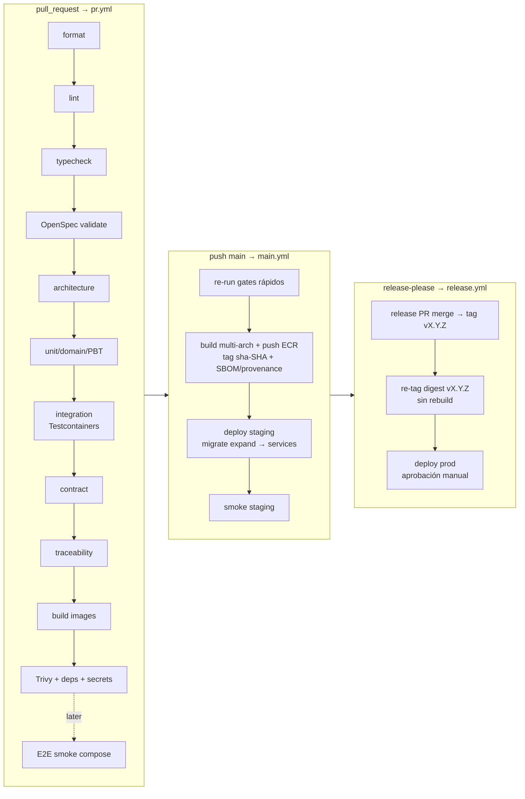
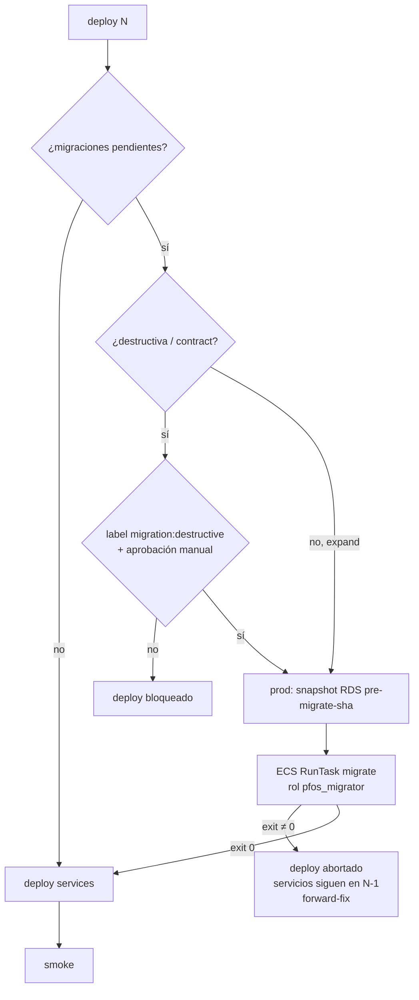

# 23 — CI/CD y estrategia de release

> **Estado:** Propuesto · **Fecha:** 2026-10-01 · **Relacionado:** [ARCHITECTURE.md](ARCHITECTURE.md) §5 (ADR-0015), §9, §11, §12, §15 · [03-openspec-strategy.md](03-openspec-strategy.md) · [16-testing-strategy.md](16-testing-strategy.md) §10 · [17-test-traceability.md](17-test-traceability.md) · [19-local-development.md](19-local-development.md) · [20-container-strategy.md](20-container-strategy.md) · [21-cloud-deployment-options.md](21-cloud-deployment-options.md) · [22-infrastructure.md](22-infrastructure.md) · [30-backup-and-disaster-recovery.md](30-backup-and-disaster-recovery.md) · ADR-0015, ADR-0016, ADR-0024 · Spec: `openspec/changes/bootstrap-platform-foundation/specs/platform/delivery-pipeline/spec.md` · SPIKE-01

> Los workflows de este documento son **ilustrativos** (Phase 0). No se crean ficheros en `.github/workflows/` hasta el DESIGN GATE, salvo que el lead decida adelantar el gate de Phase 0 (OpenSpec validate + format + secrets). Todas las actions de terceros se fijan por **commit SHA** (aquí abreviado como `@<sha>`).

---

## 1. Visión general



Orden de gates alineado con ARCHITECTURE §11 y la progresión de [16-testing-strategy.md](16-testing-strategy.md) §10 (que define **qué bloquea y desde cuándo**; este documento define **cómo se ejecuta**).

## 2. Estrategia de ramas y repositorio

- **Trunk-based**: `main` siempre desplegable; ramas cortas (`feat/…`, `fix/…`, `chore/…`, ≤ 2–3 días), PR obligatorio; **squash merge** con título Conventional Commit.
- **Ruleset/branch protection en `main`**: PR requerido (1 aprobación — para un owner único, ver nota), checks requeridos (`pr / gate`), historial lineal, sin force-push, sin borrado, conversaciones resueltas, *require branches up to date* (o **merge queue** cuando haya colaboradores).
  - Nota equipo de 1: GitHub no permite aprobar el propio PR. Opciones: (a) 0 aprobaciones requeridas pero checks obligatorios + autorevisión con plantilla; (b) revisión asistida por bot. Se propone (a) mientras el equipo sea 1 (Preguntas abiertas).
- **CODEOWNERS** (ilustrativo):

```text
# .github/CODEOWNERS
*                                   @<owner>
/packages/contexts/ledger/          @<owner>
/db/migrations/                     @<owner>
/infra/                             @<owner>
/.github/                           @<owner>
/contracts/                         @<owner>
/openspec/                          @<owner>
```

- **Conventional Commits** validados en el título del PR (`amannn/action-semantic-pull-request` o `commitlint`); scopes = códigos de contexto en minúscula (`ledger`, `transactions`, `platform`, `infra`, `deps`…). `feat!:`/`BREAKING CHANGE:` ⇒ major.
- Etiquetas con semántica de pipeline: `migration:destructive`, `skip-e2e` (solo docs), `deploy:hold`.

## 3. Versionado y release

- **SemVer de producto único** (web + api comparten versión `vX.Y.Z`) gestionado por **release-please** (GitHub Action de googleapis, manifest mode, `release-type: node` en la raíz). Mantiene `CHANGELOG.md` y abre un *release PR* acumulativo.
- Pre-1.0: `0.x` hasta que el producto esté en uso real (Phase 1 completa); `bump-minor-pre-major: true`.
- Tags de imagen ([20](20-container-strategy.md) §9): `sha-<git-sha>` en cada build de `main`; `vX.Y.Z` = re-tag del **mismo digest** al publicar la release.
- `finance-ml` (Phase 8) podrá versionarse aparte (componente propio en el manifest de release-please).

## 4. Entornos de GitHub

| Environment | Uso | Protección | Secrets/vars |
|---|---|---|---|
| `ci` | PR/main (sin acceso cloud salvo build) | — | ninguno (OIDC al rol `pfos-ci-build` solo en `main`) |
| `staging` | deploy de app a staging | Solo rama `main`; sin reviewers | `AWS_ROLE_ARN`, `AWS_REGION`, `ECS_CLUSTER`, URLs smoke (vars) |
| `production` | deploy de app a prod | **Required reviewer: owner**, wait timer opcional (5 min), solo tags `v*` | idem prod |
| `staging-infra` / `production-infra` | `terraform apply` | Reviewer obligatorio (ambos) | `TF_APPLY_ROLE_ARN` |

**Sin credenciales AWS de larga vida**: todo vía OIDC ([22](22-infrastructure.md) §7). Los únicos secrets en GitHub son tokens no-AWS (p. ej. `RELEASE_PLEASE_TOKEN` si se usa una GitHub App para que el release PR dispare workflows; infracost API key opcional).

## 5. Workflows (ilustrativos)

### 5.1 `pr.yml`

```yaml
name: pr
on:
  pull_request:
    branches: [main]
  workflow_call:                    # reutilizado por main.yml con full=true (sin --affected)
    inputs:
      full: { type: boolean, default: false }
permissions:
  contents: read
concurrency:
  group: pr-${{ github.event.pull_request.number || github.sha }}
  cancel-in-progress: true          # un push nuevo cancela el run anterior

env:
  TURBO_TELEMETRY_DISABLED: 1
  NODE_OPTIONS: --max-old-space-size=4096

jobs:
  changes:
    runs-on: ubuntu-24.04
    outputs:
      code: ${{ steps.f.outputs.code }}
      images: ${{ steps.f.outputs.images }}
      migrations: ${{ steps.f.outputs.migrations }}
      infra: ${{ steps.f.outputs.infra }}
    steps:
      - uses: actions/checkout@<sha>
      - id: f
        uses: dorny/paths-filter@<sha>
        with:
          filters: |
            code: ['apps/**','packages/**','contracts/**','db/**','seeds/**','package.json','pnpm-lock.yaml']
            images: ['docker/**','apps/**','packages/**','deploy/compose/**','pnpm-lock.yaml']
            migrations: ['db/migrations/**']
            infra: ['infra/**']

  static:
    name: format · lint · typecheck · openspec · architecture
    runs-on: ubuntu-24.04
    timeout-minutes: 15
    steps:
      - uses: actions/checkout@<sha>
        with: { fetch-depth: 0 }                 # turbo --affected necesita base
      - uses: pnpm/action-setup@<sha>             # lee packageManager de package.json
      - uses: actions/setup-node@<sha>
        with: { node-version-file: .node-version, cache: pnpm }
      - run: pnpm install --frozen-lockfile
      - run: pnpm format:check                    # Prettier + markdownlint (docs, TCs)
      - run: pnpm turbo run lint typecheck --affected
      - name: OpenSpec validate (flags confirmados en SPIKE-01)
        env: { OPENSPEC_TELEMETRY: "0", DO_NOT_TRACK: "1", OPENSPEC_NO_UPDATE_CHECK: "1" }
        run: pnpm exec openspec validate --all --strict --no-interactive   # devDependency fijada 1.14.0
      - run: pnpm arch:check                      # dependency-cruiser (reglas ARCHITECTURE §6)
      - run: pnpm contracts:lint                  # Spectral/Redocly OpenAPI + JSON Schema de eventos + oasdiff vs main (Phase 2+)
      - run: pnpm traceability:check              # front matter TCs + reglas doc 17

  unit:
    needs: [changes]
    if: needs.changes.outputs.code == 'true'
    runs-on: ubuntu-24.04
    timeout-minutes: 15
    steps:
      - uses: actions/checkout@<sha>
        with: { fetch-depth: 0 }
      - uses: pnpm/action-setup@<sha>
      - uses: actions/setup-node@<sha>
        with: { node-version-file: .node-version, cache: pnpm }
      - run: pnpm install --frozen-lockfile
      - run: pnpm turbo run test --affected -- --reporter=junit --outputFile=reports/unit.xml   # incluye PBT numRuns=100
      - uses: actions/upload-artifact@<sha>
        if: always()
        with: { name: unit-reports, path: '**/reports/*.xml', retention-days: 7 }

  integration:
    needs: [changes]
    if: needs.changes.outputs.code == 'true'
    runs-on: ubuntu-24.04            # Docker disponible en runners hosted Linux → Testcontainers
    timeout-minutes: 25
    env:
      TESTCONTAINERS_RYUK_DISABLED: "false"
    steps:
      - uses: actions/checkout@<sha>
      - uses: pnpm/action-setup@<sha>
      - uses: actions/setup-node@<sha>
        with: { node-version-file: .node-version, cache: pnpm }
      - run: pnpm install --frozen-lockfile
      - name: Pre-pull imágenes de Testcontainers (fijadas por digest en tests/containers.ts)
        run: pnpm tsx scripts/ci/prepull-test-images.ts
      - run: pnpm test:integration              # PG 18, Valkey, S3-compatible; API + contract conformance
      - if: needs.changes.outputs.migrations == 'true'
        name: Migration validation (informativo → bloquea al primer release)
        run: pnpm test:migrations               # up-from-empty, up-from-release-snapshot, squawk, N-1
        continue-on-error: ${{ vars.MIGRATION_GATE_BLOCKING != 'true' }}

  images:
    needs: [changes]
    if: needs.changes.outputs.images == 'true'
    runs-on: ubuntu-24.04
    timeout-minutes: 30
    strategy:
      matrix:
        image: [finance-api, finance-web]
    steps:
      - uses: actions/checkout@<sha>
      - uses: docker/setup-buildx-action@<sha>
      - uses: docker/build-push-action@<sha>
        with:
          context: .
          file: docker/${{ matrix.image }}.Dockerfile
          target: runtime
          platforms: linux/amd64
          load: true                              # no se publica en PR
          tags: pfos/${{ matrix.image }}:pr-${{ github.event.pull_request.number }}
          cache-from: type=gha,scope=${{ matrix.image }}
          cache-to: type=gha,scope=${{ matrix.image }},mode=max
      - name: Image size budget
        run: pnpm tsx scripts/ci/image-budget.ts pfos/${{ matrix.image }}:pr-${{ github.event.pull_request.number }}
      - name: Trivy image scan (binario verificado, versión fijada)
        run: |
          pnpm tsx scripts/ci/install-trivy.ts      # descarga versión fijada + verifica checksum/firma
          trivy image --severity HIGH,CRITICAL --ignore-unfixed --exit-code 1 \
            --ignorefile .trivyignore.yaml pfos/${{ matrix.image }}:pr-${{ github.event.pull_request.number }}
      - name: Non-root assertion
        run: docker run --rm --entrypoint id pfos/${{ matrix.image }}:pr-${{ github.event.pull_request.number }} -u | grep -qv '^0$'

  security:
    runs-on: ubuntu-24.04
    timeout-minutes: 10
    steps:
      - uses: actions/checkout@<sha>
        with: { fetch-depth: 0 }
      - name: Secret scan (gitleaks, binario fijado)
        run: pnpm tsx scripts/ci/gitleaks.ts --log-opts="${{ github.event.pull_request.base.sha }}..HEAD"
      - name: Dependency scan
        run: pnpm tsx scripts/ci/deps-scan.ts       # osv-scanner/trivy fs sobre pnpm-lock.yaml (+ uv.lock en Phase 8)
      - uses: actions/dependency-review-action@<sha>
        with: { fail-on-severity: high }

  e2e-smoke:
    needs: [images]
    if: vars.E2E_GATE_ENABLED == 'true' && !contains(github.event.pull_request.labels.*.name, 'skip-e2e')
    runs-on: ubuntu-24.04
    timeout-minutes: 20
    steps:
      - uses: actions/checkout@<sha>
      - uses: pnpm/action-setup@<sha>
      - uses: actions/setup-node@<sha>
        with: { node-version-file: .node-version, cache: pnpm }
      - run: pnpm install --frozen-lockfile
      - run: pnpm env:init --ci                   # credenciales dev aleatorias efímeras
      - run: pnpm test:platform                   # compose smoke: todos healthy, migrate/seed exit 0
      - run: pnpm test:e2e -- --project=chromium  # core + seed minimal
      - uses: actions/upload-artifact@<sha>
        if: failure()
        with: { name: playwright-report, path: tests/e2e/playwright-report, retention-days: 7 }

  infra-plan:
    needs: [changes]
    if: needs.changes.outputs.infra == 'true'
    uses: ./.github/workflows/infra.yml
    with: { mode: plan }
    permissions: { id-token: write, contents: read, pull-requests: write }

  gate:                                         # ÚNICO check requerido en branch protection
    if: always()
    needs: [static, unit, integration, images, security, e2e-smoke, infra-plan]
    runs-on: ubuntu-24.04
    steps:
      - run: |
          echo '${{ toJSON(needs) }}' | node -e "
            const n=JSON.parse(require('fs').readFileSync(0,'utf8'));
            const bad=Object.entries(n).filter(([,v])=>!['success','skipped'].includes(v.result));
            if(bad.length){console.error('Failed:',bad.map(([k])=>k).join(', '));process.exit(1)}"
```

> Patrón "gate job": un único check requerido que tolera jobs `skipped` por path filters (evita PRs bloqueados por checks que no corrieron). Phase 0: solo `static` (format, OpenSpec, traceability schema) y `security` (secrets) tienen contenido; el resto se salta.

### 5.2 `main.yml`

```yaml
name: main
on:
  push:
    branches: [main]
permissions:
  contents: read
concurrency:
  group: main
  cancel-in-progress: false         # nunca cancelar un build/deploy en curso; se encolan

jobs:
  verify:
    uses: ./.github/workflows/pr.yml     # reutilizable (workflow_call) — mismos gates, sin --affected
    with: { full: true }

  build-push:
    needs: [verify]
    runs-on: ${{ matrix.runner }}
    permissions: { id-token: write, contents: read, attestations: write }
    strategy:
      matrix:
        image: [finance-api, finance-web]
        include:
          - { platform: linux/amd64, runner: ubuntu-24.04 }
          - { platform: linux/arm64, runner: ubuntu-24.04-arm }   # runner arm nativo (verificar plan)
    steps:
      - uses: actions/checkout@<sha>
      - uses: aws-actions/configure-aws-credentials@<sha>
        with:
          role-to-assume: ${{ vars.CI_BUILD_ROLE_ARN }}   # cuenta shared, solo push ECR
          aws-region: ${{ vars.AWS_REGION }}
      - uses: aws-actions/amazon-ecr-login@<sha>
        id: ecr
      - uses: docker/setup-buildx-action@<sha>
      - id: build
        uses: docker/build-push-action@<sha>
        with:
          context: .
          file: docker/${{ matrix.image }}.Dockerfile
          target: runtime
          platforms: ${{ matrix.platform }}
          outputs: type=image,name=${{ steps.ecr.outputs.registry }}/${{ matrix.image }},push-by-digest=true,name-canonical=true,push=true
          build-args: |
            GIT_SHA=${{ github.sha }}
            VERSION=0.0.0-sha.${{ github.sha }}
            BUILD_DATE=${{ github.event.head_commit.timestamp }}
          sbom: true
          provenance: mode=max
          cache-from: type=gha,scope=${{ matrix.image }}-${{ matrix.platform }}
          cache-to: type=gha,scope=${{ matrix.image }}-${{ matrix.platform }},mode=max
      # … export digest como artefacto; job `merge-manifest` crea el índice multi-arch:
      #   docker buildx imagetools create -t <repo>:sha-${{ github.sha }} <repo>@<digest-amd64> <repo>@<digest-arm64>
      # y publica deploy-manifest.json { image: digest } como artefacto + attestation (actions/attest-build-provenance)

  deploy-staging:
    needs: [build-push]
    uses: ./.github/workflows/deploy.yml
    with:
      environment: staging
      git_sha: ${{ github.sha }}
    secrets: inherit

  release-please:
    needs: [deploy-staging]
    runs-on: ubuntu-24.04
    permissions: { contents: write, pull-requests: write }
    steps:
      - uses: googleapis/release-please-action@<sha>
        with:
          token: ${{ secrets.RELEASE_PLEASE_TOKEN }}   # GitHub App token para que el tag dispare release.yml
          config-file: release-please-config.json
          manifest-file: .release-please-manifest.json
```

### 5.3 `release.yml`

```yaml
name: release
on:
  release:
    types: [published]               # creada por release-please al mergear el release PR
permissions:
  contents: read
  id-token: write
concurrency:
  group: release-${{ github.event.release.tag_name }}
  cancel-in-progress: false

jobs:
  promote-tag:
    runs-on: ubuntu-24.04
    steps:
      - uses: aws-actions/configure-aws-credentials@<sha>
        with: { role-to-assume: "${{ vars.CI_BUILD_ROLE_ARN }}", aws-region: "${{ vars.AWS_REGION }}" }
      - uses: aws-actions/amazon-ecr-login@<sha>
        id: ecr
      - name: Verificar que el digest pasó staging y re-etiquetar (sin rebuild)
        run: |
          SHA=$(git rev-list -n 1 ${{ github.event.release.tag_name }})
          for img in finance-api finance-web; do
            pnpm tsx scripts/ci/assert-staging-passed.ts "$img" "$SHA"   # consulta registro de deploys (artefacto/SSM)
            docker buildx imagetools create \
              --tag ${{ steps.ecr.outputs.registry }}/$img:${{ github.event.release.tag_name }} \
              ${{ steps.ecr.outputs.registry }}/$img:sha-$SHA
          done

  deploy-production:
    needs: [promote-tag]
    uses: ./.github/workflows/deploy.yml
    with:
      environment: production         # environment con required reviewer → pausa para aprobación
      git_sha: ${{ github.sha }}
    secrets: inherit
```

> `release.yml` corre scripts con shell bash **en el runner Linux de CI** (permitido: la regla "nada solo-bash" de ADR-0012 aplica a los comandos de desarrollo local; aun así la lógica no trivial vive en scripts TS).

### 5.4 `deploy.yml` (reutilizable)

```yaml
name: deploy
on:
  workflow_call:
    inputs:
      environment: { type: string, required: true }
      git_sha:     { type: string, required: true }
  workflow_dispatch:                 # redeploy/rollback manual a un SHA/versión concretos
    inputs:
      environment: { type: choice, options: [staging, production], required: true }
      git_sha:     { type: string, required: true }
permissions:
  contents: read
  id-token: write
concurrency:
  group: deploy-${{ inputs.environment }}
  cancel-in-progress: false          # deploys serializados por entorno

jobs:
  deploy:
    runs-on: ubuntu-24.04
    environment:
      name: ${{ inputs.environment }}
      url: ${{ vars.APP_URL }}
    timeout-minutes: 45
    steps:
      - uses: actions/checkout@<sha>
        with: { ref: "${{ inputs.git_sha }}" }
      - uses: pnpm/action-setup@<sha>
      - uses: actions/setup-node@<sha>
        with: { node-version-file: .node-version, cache: pnpm }
      - run: pnpm install --frozen-lockfile --filter @pf/deploy-tools...
      - uses: aws-actions/configure-aws-credentials@<sha>
        with: { role-to-assume: "${{ vars.DEPLOY_ROLE_ARN }}", aws-region: "${{ vars.AWS_REGION }}" }

      - name: Resolver digests de sha-<sha> (inmutables)
        id: digests
        run: pnpm deploy:resolve --sha ${{ inputs.git_sha }} >> "$GITHUB_OUTPUT"

      - name: Clasificar migraciones pendientes
        id: mig
        run: pnpm deploy:migrations-plan --env ${{ inputs.environment }} --sha ${{ inputs.git_sha }} >> "$GITHUB_OUTPUT"
        # outputs: pending=<n>, destructive=true|false (marcador `-- pfos:contract` / squawk)

      - name: Bloquear destructivas sin etiqueta/aprobación
        if: steps.mig.outputs.destructive == 'true'
        run: pnpm deploy:assert-destructive-approved --sha ${{ inputs.git_sha }}
        # exige: PR origen con label migration:destructive + este job en environment con reviewer
        # (staging: usa environment `staging-destructive` con reviewer; prod ya tiene reviewer)

      - name: Snapshot previo (solo producción y si hay migraciones)
        if: inputs.environment == 'production' && steps.mig.outputs.pending != '0'
        run: pnpm deploy:rds-snapshot --id pre-migrate-${{ inputs.git_sha }} --wait

      - name: Migrate (ECS RunTask one-off, comando `migrate`, rol de migración)
        if: steps.mig.outputs.pending != '0'
        run: pnpm deploy:run-task --task migrate --image ${{ steps.digests.outputs.finance_api }} --wait --fail-on-nonzero

      - name: Deploy services (nueva revisión de task def por digest)
        run: |
          pnpm deploy:ecs --service worker --image ${{ steps.digests.outputs.finance_api }}
          pnpm deploy:ecs --service api    --image ${{ steps.digests.outputs.finance_api }}
          pnpm deploy:ecs --service web    --image ${{ steps.digests.outputs.finance_web }}
          pnpm deploy:wait-stable --services worker,api,web --timeout 15m   # circuit breaker con rollback automático

      - name: Smoke tests
        run: pnpm test:smoke -- --base-url ${{ vars.APP_URL }}
        # /health/ready (api, web), versión expuesta == sha, login OIDC con usuario técnico de smoke (staging),
        # GET de lectura autenticado, presigned URL round-trip en bucket smoke (staging)

      - name: Registrar deploy
        if: success()
        run: pnpm deploy:record --env ${{ inputs.environment }} --sha ${{ inputs.git_sha }}   # SSM parameter /pfos/<env>/deployed + summary

      - name: Rollback de app si smoke falla
        if: failure() && steps.digests.outcome == 'success'
        run: pnpm deploy:rollback --env ${{ inputs.environment }}   # redeploy del digest anterior registrado
```

Los comandos `pnpm deploy:*` son scripts TypeScript (`tools/deploy/`) sobre AWS SDK v3 — testeables, cross-platform y reutilizables desde el portátil del owner en break-glass.

### 5.5 `nightly.yml`

```yaml
name: nightly
on:
  schedule: [{ cron: "0 7 * * *" }]   # 03:00 America/La_Paz
  workflow_dispatch:
permissions: { contents: read, id-token: write, issues: write }
concurrency: { group: nightly, cancel-in-progress: true }
jobs:
  full-tests:        # suite completa sin --affected, PBT numRuns=10000 (seed aleatoria, se imprime)
  e2e-full:          # Playwright Chromium + Firefox + WebKit sobre compose core + seed demo
  mutation:          # Stryker (informativo → gate en módulos críticos, doc 16)
  multi-arch-smoke:  # compose smoke con imágenes arm64 (runner arm)
  rescan-deployed:   # Trivy sobre digests desplegados en staging/prod (CVE nuevos) → issue
  infra-drift:       # terraform plan -detailed-exitcode por entorno → issue infra-drift
  traceability:      # genera matriz FR→Spec→TC→test y la publica como artefacto
  restore-drill:     # semanal/mensual (if: github.event.schedule…): ver doc 30 §8
  perf:              # k6 con seed large (Phase 2+)
```

### 5.6 `infra.yml` (reutilizable; detalle conceptual en [22-infrastructure.md](22-infrastructure.md) §8)

```yaml
name: infra
on:
  workflow_call:
    inputs: { mode: { type: string, required: true } }   # plan | apply
  push:
    branches: [main]
    paths: ['infra/**']
jobs:
  terraform:
    concurrency: { group: 'tf-${{ matrix.env }}', cancel-in-progress: false }   # job-level: admite contexto matrix
    strategy:
      max-parallel: 1
      matrix: { env: [staging, prod] }
    runs-on: ubuntu-24.04
    environment: ${{ inputs.mode == 'plan' && 'ci' || format('{0}-infra', matrix.env == 'prod' && 'production' || 'staging') }}
    steps:
      - uses: actions/checkout@<sha>
      - uses: opentofu/setup-opentofu@<sha>       # o hashicorp/setup-terraform
      - uses: aws-actions/configure-aws-credentials@<sha>
        with: { role-to-assume: "${{ inputs.mode == 'plan' && vars.TF_PLAN_ROLE_ARN || vars.TF_APPLY_ROLE_ARN }}", aws-region: "${{ vars.AWS_REGION }}" }
      - run: tofu -chdir=infra/terraform/environments/${{ matrix.env }} init -input=false
      - run: tofu fmt -check -recursive infra/terraform && tflint --recursive && trivy config infra/terraform
      - run: tofu -chdir=infra/terraform/environments/${{ matrix.env }} plan -input=false -out=plan.tfplan
      - if: inputs.mode == 'apply'
        run: tofu -chdir=infra/terraform/environments/${{ matrix.env }} apply -input=false plan.tfplan
```

## 6. Progresión de quality gates

| Gate | Phase 0 | Phase 1 | Phase 2+ |
|---|---|---|---|
| Format (Prettier, markdownlint) | **Bloquea** | Bloquea | Bloquea |
| `openspec validate --all --strict` | **Bloquea** | Bloquea | Bloquea |
| Traceability check | **Bloquea** (schema) | Bloquea (reglas completas) | Bloquea |
| Secret scan | **Bloquea** | Bloquea | Bloquea |
| OpenAPI lint | **Bloquea** (borrador) | Bloquea + conformance | + breaking diff |
| Lint / typecheck / architecture | n/a | **Bloquea** | Bloquea |
| Unit + domain + PBT | n/a | **Bloquea** | Bloquea |
| Integration (Testcontainers) | n/a | **Bloquea** | Bloquea |
| Build imágenes + size budget | n/a | **Bloquea** | Bloquea |
| Trivy + dependency scan (HIGH/CRITICAL con fix) | n/a | **Bloquea** | Bloquea |
| Migration validation | n/a | Informativo → **bloquea al primer release** | Bloquea |
| E2E smoke (compose) | n/a | Cuando exista UI (`E2E_GATE_ENABLED`) | **Bloquea** |
| Compose smoke (`test:platform`) | n/a | **Bloquea** si cambian `docker/`/`deploy/compose/` | Bloquea |
| Coverage thresholds | n/a | Informativo | Bloquea |
| Mutation / performance / ZAP | n/a | Nightly informativo | Según doc 16 |

Fuente de verdad de la progresión: [16-testing-strategy.md](16-testing-strategy.md) §10.

### 6.1 OpenSpec en CI

- CLI `@fission-ai/openspec` fijada como **devDependency** (lockfile) — el lead verificó que la v1.14.0 expone `validate`. Comando **confirmado en SPIKE-01** (2026-10-01): `openspec validate --all --strict --no-interactive [--json]` — exit 0/1; `--json` entrega `summary.totals` y `byType` para anotaciones. Variables de entorno en CI: `OPENSPEC_TELEMETRY=0`, `DO_NOT_TRACK=1`, `OPENSPEC_NO_UPDATE_CHECK=1`. Ver [spikes/SPIKE-01-openspec-ci](../spikes/SPIKE-01-openspec-ci/README.md).
- Corre en todo PR (no tiene path filter): una spec inválida bloquea el merge (scenario *Invalid spec blocks merge*).

### 6.2 Architecture checks

`pnpm arch:check` = dependency-cruiser con las reglas de capas de ARCHITECTURE §6 (domain → solo shared-kernel; contextos solo vía `contracts`) + ESLint custom (`pf/no-float-money`, `pf/no-nondeterminism`). Salida nombra el import ofensor (scenario *Architecture violation blocks merge*).

### 6.3 Testcontainers en CI

- Runners `ubuntu-24.04` hosted (Docker disponible). Imágenes fijadas por digest en un único módulo (`tests/containers.ts`) y **pre-pulled** en un paso previo para aislar el tiempo de red.
- Reutilización por suite (un contenedor PG por worker de Vitest, schemas/databases aislados por test file) para mantener < 10 min.
- Ryuk activo para limpieza. Logs de contenedores adjuntos como artefacto en fallo.

## 7. Migraciones de base de datos en el pipeline



Reglas (ARCHITECTURE §9):

1. **Expand → migrate → contract**. Una release solo contiene cambios *expand* (aditivos, compatibles con el código N-1) salvo migraciones marcadas `-- pfos:contract` en un fichero dedicado.
2. `migrate` corre **antes** de actualizar servicios (spec *Controlled database migrations*); si falla, no se despliega la nueva versión.
3. **Destructivas** (DROP, renames, `ALTER TYPE` con reescritura, `NOT NULL` sin default, borrado de datos) detectadas por **squawk** + marcador; requieren label `migration:destructive` en el PR **y** aprobación manual en el deploy de **cualquier** entorno compartido (staging y prod).
4. **Backup antes de prod**: snapshot manual de RDS `pre-migrate-<sha>` (además de PITR) cuando hay migraciones pendientes; retención 30 días.
5. Migraciones largas (backfills) no van en `migrate`: se implementan como **jobs del worker** idempotentes y reanudables, desacoplados del deploy.
6. `lock_timeout` y `statement_timeout` cortos en la sesión de migración para no bloquear tráfico (`SET lock_timeout = '5s'`); `CREATE INDEX CONCURRENTLY` en ficheros sin transacción.

## 8. Rollback

| Escenario | Acción | Tiempo objetivo |
|---|---|---|
| Deploy no estabiliza (health) | **ECS deployment circuit breaker** con rollback automático a la revisión anterior | automático, < 10 min |
| Smoke post-deploy falla | `deploy:rollback` redeploya el **digest anterior** registrado (SSM `/pfos/<env>/deployed`) | < 10 min |
| Bug detectado después | `deploy.yml` (`workflow_dispatch`) con el `git_sha` de la versión previa | < 15 min |
| Migración expand ya aplicada | **No se revierte** la BD: el código N-1 es compatible con el schema expandido (expand/contract) | — |
| Migración defectuosa que corrompe datos | **Forward-fix** (nueva migración correctiva). Restaurar (PITR a instancia nueva + reconciliación) solo como último recurso — runbook en [30](30-backup-and-disaster-recovery.md) §7 | según RTO |

Política: **no hay "down migrations" en entornos compartidos** (dbmate `down` solo local).

## 9. Smoke tests post-deploy

`pnpm test:smoke` (Vitest + fetch, < 2 min):
- `GET /health/ready` (api) y `/api/health/ready` (web) = 200; `GET /api/v1/version` devuelve el SHA desplegado.
- Staging: login OIDC con **usuario técnico de smoke** (credenciales en Secrets Manager, solo staging), `GET /api/v1/me`, `GET /api/v1/workspaces/{id}/accounts`, round-trip de presigned URL en bucket `smoke`.
- Producción: solo verificaciones **de solo lectura** sin usuario real (health, version, TLS, cabeceras de seguridad, redirect a IdP). Nada que cree datos financieros.

## 10. Dependencias: Renovate vs Dependabot

| Criterio | Renovate | Dependabot |
|---|---|---|
| pnpm workspaces / monorepo | Muy bueno (grouping, `rangeStrategy`) | Bueno |
| Digests de Docker (Dockerfile, compose, Testcontainers TS) | **Sí** (`pinDigests`, regex managers) | Parcial (Dockerfile; compose sí; TS no) |
| Actions por SHA | **Sí** (`helpers:pinGitHubActionDigests`) | Actualiza SHAs ya fijados |
| Terraform providers/módulos | Sí | Sí |
| Python (uv.lock) | Sí | Sí |
| Automerge, schedules, dashboard | Muy flexible | Básico |
| Security advisories | Sí (vulnerabilityAlerts) | Nativo (Dependabot alerts) |

**Decisión propuesta: Renovate** (GitHub App gratuita) para actualizaciones + **Dependabot alerts** activadas (solo alertas de seguridad). Config: agrupar por ecosistema, `minimumReleaseAge: "3 days"` (mitiga paquetes npm comprometidos recién publicados), automerge solo patch/digest de devDependencies con CI verde, ventana semanal, `.node-version` + imagen base + `setup-node` en el mismo grupo.

## 11. Caché

| Qué | Cómo |
|---|---|
| pnpm store | `actions/setup-node` `cache: pnpm` (clave = hash de `pnpm-lock.yaml`) |
| Turborepo | `--affected` en PR; remote cache opcional (Vercel remote cache o self-hosted en S3) |
| Docker layers | BuildKit `type=gha` por imagen/plataforma (límite 10 GB/repo; si se excede, `type=registry` en ECR) |
| Playwright browsers | `actions/cache` con clave = versión de Playwright |
| Testcontainers images | pre-pull (no hay caché de imágenes entre runs hosted) |
| Terraform providers | `TF_PLUGIN_CACHE_DIR` + `actions/cache` |

## 12. Controles de concurrencia

- PR: `cancel-in-progress: true` por número de PR.
- `main`: grupo `main`, sin cancelación (cada commit produce un artefacto y un deploy a staging en orden).
- `deploy-<env>`: serializado, sin cancelación. `release-<tag>`: idem.
- Terraform: `tf-<env>` serializado + locking de state.
- Nightly: cancela el anterior si sigue corriendo.

## 13. Costo de minutos de CI (aprox., 2026-10-01 — verificar)

- **Repo público**: minutos de runners hosted estándar gratuitos.
- **Repo privado**: plan Free incluye ≈ 2 000 min/mes Linux (Pro ≈ 3 000). Linux x64 2-core ≈ 0.006–0.008 USD/min por encima de la cuota (GitHub anunció rebajas de precio de runners hosted para 2026; confirmar tarifas vigentes y si los runners **arm64** están incluidos para repos privados del plan del owner).
- Estimación de consumo: PR típico ≈ 25–35 min-runner (jobs paralelos), `main` ≈ 40–60 (multi-arch), nightly ≈ 60–90. Con ~40 PR/mes y ~40 merges ⇒ ≈ 3 500–5 000 min/mes + nightly ≈ 2 000–2 700 ⇒ **≈ 6 000–7 500 min/mes** ⇒ en repo privado Free ≈ **25–45 USD/mes** de excedente.
- Palancas: path filters + `--affected`, nightly a días laborables, E2E solo cuando cambia UI/API, arm64 solo en `main`, cachés.

## 14. Seguridad del pipeline

- `permissions:` mínimos por workflow/job; `id-token: write` solo donde se asume rol.
- Actions de terceros **fijadas por SHA** (lección del compromiso de `aquasecurity/trivy-action`, mar-2026, donde se reescribieron tags). Allowlist de actions en la configuración del repo.
- `pull_request` (no `pull_request_target`) para código no confiable; forks sin acceso a secrets/OIDC.
- Artefactos con retención corta (7 días; planes de Terraform 1 día).
- `CODEOWNERS` sobre `.github/` e `infra/`.
- Harden-runner (egress audit) evaluable en Phase 2.

## 15. Preguntas abiertas

1. Owner único: ¿0 aprobaciones requeridas + checks obligatorios, o revisión asistida?
2. ¿Repo público o privado? (impacta costo de CI y runners arm64).
3. ¿Deploy a producción **solo** desde release (tag `v*`) o también `workflow_dispatch` de cualquier SHA que pasó staging (hotfix)? Propuesta: ambos, ambos con aprobación.
4. ~~Flags exactos de `openspec validate` (SPIKE-01)~~ — resuelto.
5. ¿Usuario técnico de smoke también en producción (datos aislados en un workspace técnico) o solo verificaciones anónimas?
6. Merge queue: ¿desde que haya ≥ 2 colaboradores?
7. ¿Un único `vX.Y.Z` de producto o versiones por deployable desde Phase 1?

## 16. Workflows implementados y checks requeridos (bootstrap-platform-foundation, 2026-10-02)

Implementados en `.github/workflows/pr.yml` y `.github/workflows/main.yml` (setup común en `.github/actions/setup-workspace`). Diferencias con los ejemplos ilustrativos de §5: sin path filters ni `--affected` (todos los jobs corren en cada PR), sin job `gate` agregador, GHCR en lugar de ECR y sin deploy. Trivy y gitleaks se instalan como **binarios con versión y SHA-256 fijados** (no `trivy-action`); el escaneo de dependencias usa `trivy fs` sobre `pnpm-lock.yaml` para compartir política y excepciones con vencimiento (`.trivyignore.yaml`) con el escaneo de imágenes — `pnpm audit` no admite excepciones con vencimiento. Actions fijadas por SHA de commit completo con el tag verificado como comentario (Renovate `helpers:pinGitHubActionDigests` las mantendrá).

**Branch protection / ruleset de `main` — checks requeridos (nombres exactos de los jobs de `pr.yml`):**

| Check | Qué verifica |
|---|---|
| `format` | `pnpm format:check` |
| `lint` | `pnpm lint` (incluye `process.env` solo en `@pf/platform`) |
| `typecheck` | `pnpm typecheck` |
| `openspec` | `pnpm spec:validate` (`--all --strict --no-interactive`, telemetría off) |
| `config-docs` | `pnpm config:docs:check` |
| `architecture` | `pnpm arch:check` (dependency-cruiser) |
| `traceability` | `pnpm traceability:check -- --base origin/main` + matriz como artefacto |
| `unit` | `pnpm test` (incluye las pruebas de fixtures de arquitectura, TC-PLATFORM-ARCH-001) |
| `integration` | `pnpm test:integration` (Testcontainers) |
| `image (finance-api)` | build buildx sin push, non-root, Trivy CRITICAL con fix |
| `image (finance-web)` | idem |
| `stack-smoke` | `pnpm test:stack` (perfil core) con las imágenes del job `image`, sin reconstruir |
| `dependency-scan` | `trivy fs` CRITICAL con fix |
| `secrets` | gitleaks sobre los commits de la PR |

Además: PR obligatorio, 0 aprobaciones (owner único, §15.1), *require branches up to date*, historial lineal, sin force-push ni borrado. `main.yml` (jobs `build-push (finance-api)`, `build-push (finance-web)`, `verify-by-digest`) corre tras el merge y **no** es un check requerido.
