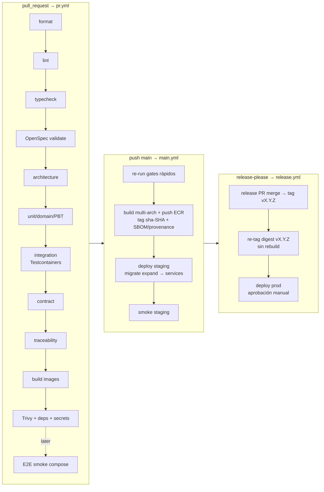
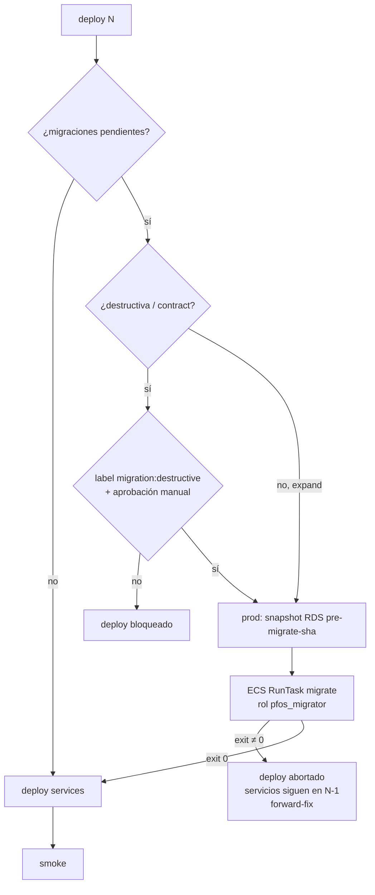

# 23 — CI/CD y estrategia de release

> **Estado:** Aceptado — PR gate y build once implementados en Phase 0 (`bootstrap-platform-foundation`); secciones marcadas **as-built (2026-10-02)** · **Fecha:** 2026-10-01 (diseño) / 2026-10-02 (as-built) · **Relacionado:** [ARCHITECTURE.md](ARCHITECTURE.md) §5 (ADR-0015), §9, §11, §12, §15 · [03-openspec-strategy.md](03-openspec-strategy.md) · [16-testing-strategy.md](16-testing-strategy.md) §10 · [17-test-traceability.md](17-test-traceability.md) · [19-local-development.md](19-local-development.md) · [20-container-strategy.md](20-container-strategy.md) · [21-cloud-deployment-options.md](21-cloud-deployment-options.md) · [22-infrastructure.md](22-infrastructure.md) · [30-backup-and-disaster-recovery.md](30-backup-and-disaster-recovery.md) · ADR-0015, ADR-0016, ADR-0024 · Spec: `openspec/changes/bootstrap-platform-foundation/specs/platform/delivery-pipeline/spec.md` · SPIKE-01

> **As-built (2026-10-02).** Existen y son la fuente de verdad [`.github/workflows/pr.yml`](../.github/workflows/pr.yml), [`.github/workflows/main.yml`](../.github/workflows/main.yml) y la acción compuesta [`.github/actions/setup-workspace`](../.github/actions/setup-workspace/action.yml); la política de excepciones de vulnerabilidades está en [`.trivyignore.yaml`](../.trivyignore.yaml) y las reglas de arquitectura en [`.dependency-cruiser.cjs`](../.dependency-cruiser.cjs). §5.1 y §5.2 se reemplazaron por un resumen de esos ficheros; el estado real del gate está en §16. `release.yml`, `deploy.yml` e `infra.yml` (§5.3, §5.4, §5.6) siguen siendo **ilustrativos** (no hay despliegue en cloud todavía); [`.github/workflows/nightly.yml`](../.github/workflows/nightly.yml) existe desde 2026-10-04 (§5.5, as-built). Todas las actions de terceros se fijan por **commit SHA** completo (en los ejemplos ilustrativos, abreviado como `@<sha>`).

---

## 1. Visión general



> **As-built (2026-10-02):** hoy existen solo el subgrafo `PR` (sin E2E ni contract) y, de `MAIN`, el build único con push a **GHCR** (`sha-<commit>`) + verificación por digest; no hay ECR, deploy ni `release.yml`. Detalle en §5.1, §5.2 y §16.

Orden de gates alineado con ARCHITECTURE §11 y la progresión de [16-testing-strategy.md](16-testing-strategy.md) §10 (que define **qué bloquea y desde cuándo**; este documento define **cómo se ejecuta**).

## 2. Estrategia de ramas y repositorio

- **Trunk-based**: `main` siempre desplegable; ramas cortas (`feat/…`, `fix/…`, `chore/…`, ≤ 2–3 días), PR obligatorio; **squash merge** con título Conventional Commit.
- **Ruleset/branch protection en `main`**: PR requerido (1 aprobación — para un owner único, ver nota), checks requeridos (`pr / gate`), historial lineal, sin force-push, sin borrado, conversaciones resueltas, *require branches up to date* (o **merge queue** cuando haya colaboradores). **As-built (2026-10-02):** se aplicó con 0 aprobaciones y los **14 jobs de `pr.yml` como checks requeridos** (no hay job `gate`); ver §16.1. Desde el 2026-10-05 son **17** (§16, docs/31 D57).
  - Nota equipo de 1: GitHub no permite aprobar el propio PR. Opciones: (a) 0 aprobaciones requeridas pero checks obligatorios + autorevisión con plantilla; (b) revisión asistida por bot. Se propone (a) mientras el equipo sea 1 (Preguntas abiertas).
- **CODEOWNERS** (ilustrativo):

```text
# .github/CODEOWNERS
*                                   @<owner>
/packages/contexts/ledger/          @<owner>
/db/migrations/                     @<owner>
/infra/                             @<owner>
/.github/                           @<owner>
/contracts/                         @<owner>
/openspec/                          @<owner>
```

- **Conventional Commits** validados en el título del PR (`amannn/action-semantic-pull-request` o `commitlint`); scopes = códigos de contexto en minúscula (`ledger`, `transactions`, `platform`, `infra`, `deps`…). `feat!:`/`BREAKING CHANGE:` ⇒ major.
- Etiquetas con semántica de pipeline: `migration:destructive`, `skip-e2e` (solo docs), `deploy:hold`.

## 3. Versionado y release

- **SemVer de producto único** (web + api comparten versión `vX.Y.Z`) gestionado por **release-please** (GitHub Action de googleapis, manifest mode, `release-type: node` en la raíz). Mantiene `CHANGELOG.md` y abre un *release PR* acumulativo.
- Pre-1.0: `0.x` hasta que el producto esté en uso real (Phase 1 completa); `bump-minor-pre-major: true`.
- Tags de imagen ([20](20-container-strategy.md) §9): `sha-<git-sha>` en cada build de `main`; `vX.Y.Z` = re-tag del **mismo digest** al publicar la release.
- `finance-ml` (Phase 8) podrá versionarse aparte (componente propio en el manifest de release-please).

## 4. Entornos de GitHub

| Environment | Uso | Protección | Secrets/vars |
|---|---|---|---|
| `ci` | PR/main (sin acceso cloud salvo build) | — | ninguno (OIDC al rol `pfos-ci-build` solo en `main`) |
| `staging` | deploy de app a staging | Solo rama `main`; sin reviewers | `AWS_ROLE_ARN`, `AWS_REGION`, `ECS_CLUSTER`, URLs smoke (vars) |
| `production` | deploy de app a prod | **Required reviewer: owner**, wait timer opcional (5 min), solo tags `v*` | idem prod |
| `staging-infra` / `production-infra` | `terraform apply` | Reviewer obligatorio (ambos) | `TF_APPLY_ROLE_ARN` |

**Sin credenciales AWS de larga vida**: todo vía OIDC ([22](22-infrastructure.md) §7). Los únicos secrets en GitHub son tokens no-AWS (p. ej. `RELEASE_PLEASE_TOKEN` si se usa una GitHub App para que el release PR dispare workflows; infracost API key opcional).

## 5. Workflows

### 5.1 `pr.yml` — as-built (2026-10-02)

Fichero real: [`.github/workflows/pr.yml`](../.github/workflows/pr.yml). Resumen:

- **Disparo:** `pull_request` hacia `main`; `permissions: contents: read`; `concurrency` por número de PR con `cancel-in-progress: true`; telemetría desactivada (`TURBO_TELEMETRY_DISABLED`, `DO_NOT_TRACK`, `OPENSPEC_TELEMETRY=0`, `OPENSPEC_NO_UPDATE_CHECK=1`).
- **Setup común:** `.github/actions/setup-workspace` = `pnpm/action-setup` (versión de `packageManager`) + `actions/setup-node` (`node-version-file: .nvmrc`, `cache: pnpm`) + `pnpm install --frozen-lockfile`.
- **14 jobs, todos en paralelo salvo `stack-smoke`** (que depende de `image`), sin path filters ni `--affected` y sin job `gate` agregador: `format`, `lint`, `typecheck`, `openspec`, `config-docs`, `architecture`, `traceability` (con `fetch-depth: 0`, `--base origin/main` y la matriz como artefacto), `unit`, `integration`, `image (finance-api)`, `image (finance-web)`, `stack-smoke`, `dependency-scan`, `secrets`. Qué ejecuta cada uno: tabla de §16.
- **Build once en el PR:** `image` construye con buildx (`linux/amd64`, `load: true`, sin push, caché `type=gha`), verifica non-root, escanea con Trivy y exporta la imagen como artefacto; `stack-smoke` la carga con `docker load` y corre `pnpm test:stack` con `PF_STACK_PREBUILT_IMAGES=1` (sin reconstruir).
- **Binarios verificados:** Trivy 0.74.0 y gitleaks 8.30.1 se descargan por versión y se comprueban con SHA-256 (`sha256sum --check --strict`).

Diferencias con el diseño ilustrativo de Phase 0: sin `changes`/path filters, sin `--affected`, sin job `gate` (cada job es un check requerido), sin `contracts:lint`, sin pre-pull de imágenes de Testcontainers, sin reportes JUnit, sin `dependency-review-action` ni presupuesto de tamaño de imagen, y Trivy bloquea solo **CRITICAL con fix** (no HIGH).

### 5.2 `main.yml` — as-built (2026-10-02)

Fichero real: [`.github/workflows/main.yml`](../.github/workflows/main.yml). En cada `push` a `main` (concurrencia `main`, sin cancelación):

1. `build-push (finance-api)` / `build-push (finance-web)`: **un solo build** por imagen (`linux/amd64`, `sbom: true`, `provenance: mode=max`), push a `ghcr.io/manuxd270516/<imagen>:sha-<commit>` y registro del digest (artefacto `digest-<imagen>` 90 días + resumen del job).
2. `verify-by-digest`: sin buildx ni pasos de build; descarga cada imagen **por digest**, verifica digest y label `org.opencontainers.image.revision` = commit, y corre `pnpm test:stack` (perfil `core`) con esas imágenes.

No re-ejecuta los gates del PR, no publica multi-arch y no despliega (no hay cloud). Primera ejecución: run `37046732572` (merge de PR #1, commit `ff6b8e0`), 3/3 jobs en verde.

### 5.3 `release.yml` (ilustrativo — no implementado)

```yaml
name: release
on:
  release:
    types: [published]               # creada por release-please al mergear el release PR
permissions:
  contents: read
  id-token: write
concurrency:
  group: release-${{ github.event.release.tag_name }}
  cancel-in-progress: false

jobs:
  promote-tag:
    runs-on: ubuntu-24.04
    steps:
      - uses: aws-actions/configure-aws-credentials@<sha>
        with: { role-to-assume: "${{ vars.CI_BUILD_ROLE_ARN }}", aws-region: "${{ vars.AWS_REGION }}" }
      - uses: aws-actions/amazon-ecr-login@<sha>
        id: ecr
      - name: Verificar que el digest pasó staging y re-etiquetar (sin rebuild)
        run: |
          SHA=$(git rev-list -n 1 ${{ github.event.release.tag_name }})
          for img in finance-api finance-web; do
            pnpm tsx scripts/ci/assert-staging-passed.ts "$img" "$SHA"   # consulta registro de deploys (artefacto/SSM)
            docker buildx imagetools create \
              --tag ${{ steps.ecr.outputs.registry }}/$img:${{ github.event.release.tag_name }} \
              ${{ steps.ecr.outputs.registry }}/$img:sha-$SHA
          done

  deploy-production:
    needs: [promote-tag]
    uses: ./.github/workflows/deploy.yml
    with:
      environment: production         # environment con required reviewer → pausa para aprobación
      git_sha: ${{ github.sha }}
    secrets: inherit
```

> `release.yml` corre scripts con shell bash **en el runner Linux de CI** (permitido: la regla "nada solo-bash" de ADR-0012 aplica a los comandos de desarrollo local; aun así la lógica no trivial vive en scripts TS).

### 5.4 `deploy.yml` (reutilizable; ilustrativo — no implementado)

```yaml
name: deploy
on:
  workflow_call:
    inputs:
      environment: { type: string, required: true }
      git_sha:     { type: string, required: true }
  workflow_dispatch:                 # redeploy/rollback manual a un SHA/versión concretos
    inputs:
      environment: { type: choice, options: [staging, production], required: true }
      git_sha:     { type: string, required: true }
permissions:
  contents: read
  id-token: write
concurrency:
  group: deploy-${{ inputs.environment }}
  cancel-in-progress: false          # deploys serializados por entorno

jobs:
  deploy:
    runs-on: ubuntu-24.04
    environment:
      name: ${{ inputs.environment }}
      url: ${{ vars.APP_URL }}
    timeout-minutes: 45
    steps:
      - uses: actions/checkout@<sha>
        with: { ref: "${{ inputs.git_sha }}" }
      - uses: pnpm/action-setup@<sha>
      - uses: actions/setup-node@<sha>
        with: { node-version-file: .node-version, cache: pnpm }
      - run: pnpm install --frozen-lockfile --filter @pf/deploy-tools...
      - uses: aws-actions/configure-aws-credentials@<sha>
        with: { role-to-assume: "${{ vars.DEPLOY_ROLE_ARN }}", aws-region: "${{ vars.AWS_REGION }}" }

      - name: Resolver digests de sha-<sha> (inmutables)
        id: digests
        run: pnpm deploy:resolve --sha ${{ inputs.git_sha }} >> "$GITHUB_OUTPUT"

      - name: Clasificar migraciones pendientes
        id: mig
        run: pnpm deploy:migrations-plan --env ${{ inputs.environment }} --sha ${{ inputs.git_sha }} >> "$GITHUB_OUTPUT"
        # outputs: pending=<n>, destructive=true|false (marcador `-- pfos:contract` / squawk)

      - name: Bloquear destructivas sin etiqueta/aprobación
        if: steps.mig.outputs.destructive == 'true'
        run: pnpm deploy:assert-destructive-approved --sha ${{ inputs.git_sha }}
        # exige: PR origen con label migration:destructive + este job en environment con reviewer
        # (staging: usa environment `staging-destructive` con reviewer; prod ya tiene reviewer)

      - name: Snapshot previo (solo producción y si hay migraciones)
        if: inputs.environment == 'production' && steps.mig.outputs.pending != '0'
        run: pnpm deploy:rds-snapshot --id pre-migrate-${{ inputs.git_sha }} --wait

      - name: Migrate (ECS RunTask one-off, comando `migrate`, rol de migración)
        if: steps.mig.outputs.pending != '0'
        run: pnpm deploy:run-task --task migrate --image ${{ steps.digests.outputs.finance_api }} --wait --fail-on-nonzero

      - name: Deploy services (nueva revisión de task def por digest)
        run: |
          pnpm deploy:ecs --service worker --image ${{ steps.digests.outputs.finance_api }}
          pnpm deploy:ecs --service api    --image ${{ steps.digests.outputs.finance_api }}
          pnpm deploy:ecs --service web    --image ${{ steps.digests.outputs.finance_web }}
          pnpm deploy:wait-stable --services worker,api,web --timeout 15m   # circuit breaker con rollback automático

      - name: Smoke tests
        run: pnpm test:smoke -- --base-url ${{ vars.APP_URL }}
        # /health/ready (api, web), versión expuesta == sha, login OIDC con usuario técnico de smoke (staging),
        # GET de lectura autenticado, presigned URL round-trip en bucket smoke (staging)

      - name: Registrar deploy
        if: success()
        run: pnpm deploy:record --env ${{ inputs.environment }} --sha ${{ inputs.git_sha }}   # SSM parameter /pfos/<env>/deployed + summary

      - name: Rollback de app si smoke falla
        if: failure() && steps.digests.outcome == 'success'
        run: pnpm deploy:rollback --env ${{ inputs.environment }}   # redeploy del digest anterior registrado
```

Los comandos `pnpm deploy:*` son scripts TypeScript (`tools/deploy/`) sobre AWS SDK v3 — testeables, cross-platform y reutilizables desde el portátil del owner en break-glass.

### 5.5 `nightly.yml` — as-built (2026-10-04)

Fichero real: [`.github/workflows/nightly.yml`](../.github/workflows/nightly.yml). Disparo `schedule` `0 6 * * *` (06:00 UTC = 02:00 America/La_Paz) + `workflow_dispatch`; `permissions: contents: read` a nivel de workflow (solo `fx-smoke-live` agrega `issues: write`); `concurrency: nightly` con `cancel-in-progress: true`; mismas actions fijadas por SHA que `pr.yml`. **No es un check requerido** y no altera los de `pr.yml` (§16). Cuatro jobs independientes:

| Job | Qué ejecuta | Falla si | Artefacto |
|---|---|---|---|
| `regression (Financial Regression Suite)` | `pnpm turbo run build` + `NIGHTLY=1 pnpm traceability:regression --run`: TC con `regression_suite: true` derivados de `tests/cases` (`@pf/traceability`), grupos unit + integración (Testcontainers) filtrados por TC-ID; `NIGHTLY=1` sube los PBT a 10 000 corridas con semilla aleatoria | algún grupo falla | `regression-suite` (JSON + MD, 30 días) |
| `mutation (shared-kernel)` | `test:coverage` (Vitest + v8) y `test:mutation` (Stryker 10, command runner) | líneas < 95 % o ramas < 90 % (`vitest.config.ts`); mutation score < 80 % (`stryker.config.json`, `break: 80`) | `shared-kernel-quality` (coverage + reporte Stryker HTML/JSON) |
| `perf (Large Seed + NFR-PERF)` | `pnpm perf:bench` (`apps/api/test/perf/nightly.perf.ts`): PostgreSQL 18 por Testcontainers, Large Seed (docs/29 §2.3) por los casos de uso, API en proceso con JWT locales; mide NFR-PERF-001/003/004/005 y el overhead de RLS | algún p95 supera su umbral de docs/02 o el overhead de RLS ≥ 10 % (sobre el piso de ruido de 0.5 ms) en la consulta real de saldos (`PgBalanceQuery`, sentencias capturadas y medidas con EXPLAIN ANALYZE) o en las consultas de índice; el agregado sintético de todo el workspace se reporta como informativo y no falla (docs/31 D43) | `perf-report` (`perf-results.json` + `perf-summary.md`, 90 días) |
| `fx-smoke-live (no bloqueante)` | `pnpm fx:smoke-live`: una solicitud a cada endpoint real de paralelo.bo y bo.dolarapi.com con el cliente/adapters del worker, validación contra el consumer contract del adapter y SHA-256 de `https://paralelo.bo/api/v1/openapi.json` (URL canónica, docs/31 D46) contra la línea base grabada (`<sha256>  <url>` en `packages/contexts/fx/test/fixtures/providers/paralelo-bo/openapi.sha256`). **Único job con red hacia terceros** | nunca rompe el pipeline (`continue-on-error: true`); ante falla abre o comenta el issue «fx:smoke-live: revisar los adapters de providers de tasas» con `GITHUB_TOKEN` (`issues: write`) | `fx-smoke-live` (JSON + MD) |

Diferencias con el ejemplo ilustrativo: sin `e2e-full` multi-navegador, `multi-arch-smoke`, `rescan-deployed`, `infra-drift` ni `restore-drill` (no hay cloud ni imágenes multi-arch todavía); performance con un harness Node (no k6) que mide ida y vuelta HTTP en el mismo host (cota superior del server time) y EXPLAIN ANALYZE para RLS; la seed `large` se genera en cada corrida (sin snapshot `pg_dump` restaurable aún, docs/29 §7 pregunta 1). Los mismos comandos corren en local: `pnpm traceability:regression --run`, `pnpm --filter @pf/shared-kernel run test:coverage` / `test:mutation`, `pnpm perf:bench` (variables `PF_PERF_SCALE`, `PF_PERF_MONTHS`, `PF_PERF_SATELLITES`, `PF_PERF_ITERATIONS` para corridas rápidas) y `pnpm fx:smoke-live`.

### 5.6 `infra.yml` (ilustrativo — no implementado; reutilizable; detalle conceptual en [22-infrastructure.md](22-infrastructure.md) §8)

```yaml
name: infra
on:
  workflow_call:
    inputs: { mode: { type: string, required: true } }   # plan | apply
  push:
    branches: [main]
    paths: ['infra/**']
jobs:
  terraform:
    concurrency: { group: 'tf-${{ matrix.env }}', cancel-in-progress: false }   # job-level: admite contexto matrix
    strategy:
      max-parallel: 1
      matrix: { env: [staging, prod] }
    runs-on: ubuntu-24.04
    environment: ${{ inputs.mode == 'plan' && 'ci' || format('{0}-infra', matrix.env == 'prod' && 'production' || 'staging') }}
    steps:
      - uses: actions/checkout@<sha>
      - uses: opentofu/setup-opentofu@<sha>       # o hashicorp/setup-terraform
      - uses: aws-actions/configure-aws-credentials@<sha>
        with: { role-to-assume: "${{ inputs.mode == 'plan' && vars.TF_PLAN_ROLE_ARN || vars.TF_APPLY_ROLE_ARN }}", aws-region: "${{ vars.AWS_REGION }}" }
      - run: tofu -chdir=infra/terraform/environments/${{ matrix.env }} init -input=false
      - run: tofu fmt -check -recursive infra/terraform && tflint --recursive && trivy config infra/terraform
      - run: tofu -chdir=infra/terraform/environments/${{ matrix.env }} plan -input=false -out=plan.tfplan
      - if: inputs.mode == 'apply'
        run: tofu -chdir=infra/terraform/environments/${{ matrix.env }} apply -input=false plan.tfplan
```

## 6. Progresión de quality gates

| Gate | Phase 0 | Phase 1 | Phase 2+ |
|---|---|---|---|
| Format (Prettier, markdownlint) | **Bloquea** | Bloquea | Bloquea |
| `openspec validate --all --strict` | **Bloquea** | Bloquea | Bloquea |
| Traceability check | **Bloquea** (schema) | Bloquea (reglas completas) | Bloquea |
| Secret scan | **Bloquea** | Bloquea | Bloquea |
| OpenAPI lint | **Bloquea** (borrador) | Bloquea + conformance | + breaking diff |
| Lint / typecheck / architecture | n/a | **Bloquea** | Bloquea |
| Unit + domain + PBT | n/a | **Bloquea** | Bloquea |
| Integration (Testcontainers) | n/a | **Bloquea** | Bloquea |
| Build imágenes + size budget | n/a | **Bloquea** | Bloquea |
| Trivy + dependency scan (HIGH/CRITICAL con fix) | n/a | **Bloquea** | Bloquea |
| Migration validation | n/a | Informativo → **bloquea al primer release** | Bloquea |
| E2E smoke (compose) | n/a | Cuando exista UI (`E2E_GATE_ENABLED`) | **Bloquea** |
| Compose smoke (`test:platform`) | n/a | **Bloquea** si cambian `docker/`/`deploy/compose/` | Bloquea |
| Coverage thresholds | n/a | Informativo | Bloquea |
| Mutation / performance / ZAP | n/a | Nightly informativo | Según doc 16 |

Fuente de verdad de la progresión: [16-testing-strategy.md](16-testing-strategy.md) §10.

> **As-built (2026-10-04):** mutation (shared-kernel, `break: 80`), coverage del shared-kernel (95/90) y performance (NFR-PERF-001/003/004/005 + RLS) corren en `nightly.yml` (§5.5) y fallan ese workflow ante una brecha, pero no son checks del PR. La Financial Regression Suite se **lista** en cada PR (job `traceability`, artefacto `regression-suite.{json,md}`; sus tests ya corren completos en `unit` e `integration`) y se **ejecuta agrupada** con `NIGHTLY=1` en el nightly.

> **As-built (2026-10-02):** el bootstrap adelantó a Phase 0 los gates de la columna Phase 1 que ya tienen contenido: format, lint, typecheck, OpenSpec, `config-docs`, architecture, traceability, unit, integration, build de imágenes (sin size budget), Trivy imagen + `trivy fs` (**CRITICAL** con fix), secretos y el compose smoke (`stack-smoke` = `pnpm test:stack`, en todo PR). Aún no existen: markdownlint, OpenAPI lint, migration validation, E2E, coverage ni mutation.

### 6.1 OpenSpec en CI

- CLI `@fission-ai/openspec` fijada como **devDependency** (lockfile) — el lead verificó que la v1.14.0 expone `validate`. Comando **confirmado en SPIKE-01** (2026-10-01): `openspec validate --all --strict --no-interactive [--json]` — exit 0/1; `--json` entrega `summary.totals` y `byType` para anotaciones. Variables de entorno en CI: `OPENSPEC_TELEMETRY=0`, `DO_NOT_TRACK=1`, `OPENSPEC_NO_UPDATE_CHECK=1`. Ver [spikes/SPIKE-01-openspec-ci](../spikes/SPIKE-01-openspec-ci/README.md).
- Corre en todo PR (no tiene path filter): una spec inválida bloquea el merge (scenario *Invalid spec blocks merge*).

### 6.2 Architecture checks

`pnpm arch:check` = dependency-cruiser con las reglas de capas de ARCHITECTURE §6 (domain → solo shared-kernel; contextos solo vía `contracts`) + ESLint custom (`pf/no-float-money`, `pf/no-nondeterminism`). Salida nombra el import ofensor (scenario *Architecture violation blocks merge*).

> **As-built (2026-10-02):** `pnpm arch:check` ejecuta dependency-cruiser con [`.dependency-cruiser.cjs`](../.dependency-cruiser.cjs) sobre `apps`, `packages` y `scripts`; cada regla tiene un fixture que la hace fallar (`scripts/architecture`, TC-PLATFORM-ARCH-001, en el job `unit`). La prohibición de leer `process.env` fuera de `@pf/platform` es la regla ESLint `no-restricted-properties` (job `lint`). Las reglas ESLint propias `pf/no-float-money` y `pf/no-nondeterminism` aún no existen.

### 6.3 Testcontainers en CI

- **As-built (2026-10-02):** runners `ubuntu-latest` hosted (Docker disponible); las imágenes de Testcontainers están en `apps/api/test/support/images.ts` (mismas que Compose) y **no** se pre-descargan. `pnpm test:integration` corre con `--concurrency=1`.
- Diseño: imágenes fijadas por digest en un único módulo y **pre-pulled** en un paso previo para aislar el tiempo de red.
- Reutilización por suite (un contenedor PG por worker de Vitest, schemas/databases aislados por test file) para mantener < 10 min.
- Ryuk activo para limpieza. Logs de contenedores adjuntos como artefacto en fallo.

## 7. Migraciones de base de datos en el pipeline



Reglas (ARCHITECTURE §9):

1. **Expand → migrate → contract**. Una release solo contiene cambios *expand* (aditivos, compatibles con el código N-1) salvo migraciones marcadas `-- pfos:contract` en un fichero dedicado.
2. `migrate` corre **antes** de actualizar servicios (spec *Controlled database migrations*); si falla, no se despliega la nueva versión.
3. **Destructivas** (DROP, renames, `ALTER TYPE` con reescritura, `NOT NULL` sin default, borrado de datos) detectadas por **squawk** + marcador; requieren label `migration:destructive` en el PR **y** aprobación manual en el deploy de **cualquier** entorno compartido (staging y prod).
4. **Backup antes de prod**: snapshot manual de RDS `pre-migrate-<sha>` (además de PITR) cuando hay migraciones pendientes; retención 30 días.
5. Migraciones largas (backfills) no van en `migrate`: se implementan como **jobs del worker** idempotentes y reanudables, desacoplados del deploy.
6. `lock_timeout` y `statement_timeout` cortos en la sesión de migración para no bloquear tráfico (`SET lock_timeout = '5s'`); `CREATE INDEX CONCURRENTLY` en ficheros sin transacción.

## 8. Rollback

| Escenario | Acción | Tiempo objetivo |
|---|---|---|
| Deploy no estabiliza (health) | **ECS deployment circuit breaker** con rollback automático a la revisión anterior | automático, < 10 min |
| Smoke post-deploy falla | `deploy:rollback` redeploya el **digest anterior** registrado (SSM `/pfos/<env>/deployed`) | < 10 min |
| Bug detectado después | `deploy.yml` (`workflow_dispatch`) con el `git_sha` de la versión previa | < 15 min |
| Migración expand ya aplicada | **No se revierte** la BD: el código N-1 es compatible con el schema expandido (expand/contract) | — |
| Migración defectuosa que corrompe datos | **Forward-fix** (nueva migración correctiva). Restaurar (PITR a instancia nueva + reconciliación) solo como último recurso — runbook en [30](30-backup-and-disaster-recovery.md) §7 | según RTO |

Política: **no hay "down migrations" en entornos compartidos** (dbmate `down` solo local).

## 9. Smoke tests post-deploy

`pnpm test:smoke` (Vitest + fetch, < 2 min):
- `GET /health/ready` (api) y `/api/health/ready` (web) = 200; `GET /api/v1/version` devuelve el SHA desplegado.
- Staging: login OIDC con **usuario técnico de smoke** (credenciales en Secrets Manager, solo staging), `GET /api/v1/me`, `GET /api/v1/workspaces/{id}/accounts`, round-trip de presigned URL en bucket `smoke`.
- Producción: solo verificaciones **de solo lectura** sin usuario real (health, version, TLS, cabeceras de seguridad, redirect a IdP). Nada que cree datos financieros.

## 10. Dependencias: Renovate vs Dependabot

| Criterio | Renovate | Dependabot |
|---|---|---|
| pnpm workspaces / monorepo | Muy bueno (grouping, `rangeStrategy`) | Bueno |
| Digests de Docker (Dockerfile, compose, Testcontainers TS) | **Sí** (`pinDigests`, regex managers) | Parcial (Dockerfile; compose sí; TS no) |
| Actions por SHA | **Sí** (`helpers:pinGitHubActionDigests`) | Actualiza SHAs ya fijados |
| Terraform providers/módulos | Sí | Sí |
| Python (uv.lock) | Sí | Sí |
| Automerge, schedules, dashboard | Muy flexible | Básico |
| Security advisories | Sí (vulnerabilityAlerts) | Nativo (Dependabot alerts) |

**Decisión propuesta: Renovate** (GitHub App gratuita) para actualizaciones + **Dependabot alerts** activadas (solo alertas de seguridad). Config: agrupar por ecosistema, `minimumReleaseAge: "3 days"` (mitiga paquetes npm comprometidos recién publicados), automerge solo patch/digest de devDependencies con CI verde, ventana semanal, `.node-version` + imagen base + `setup-node` en el mismo grupo.

## 11. Caché

| Qué | Cómo |
|---|---|
| pnpm store | `actions/setup-node` `cache: pnpm` (clave = hash de `pnpm-lock.yaml`) |
| Turborepo | `--affected` en PR; remote cache opcional (Vercel remote cache o self-hosted en S3) |
| Docker layers | BuildKit `type=gha` por imagen/plataforma (límite 10 GB/repo; si se excede, `type=registry` en ECR) |
| Playwright browsers | `actions/cache` con clave = versión de Playwright |
| Testcontainers images | pre-pull (no hay caché de imágenes entre runs hosted) |
| Terraform providers | `TF_PLUGIN_CACHE_DIR` + `actions/cache` |

## 12. Controles de concurrencia

- PR: `cancel-in-progress: true` por número de PR.
- `main`: grupo `main`, sin cancelación (cada commit produce un artefacto y un deploy a staging en orden).
- `deploy-<env>`: serializado, sin cancelación. `release-<tag>`: idem.
- Terraform: `tf-<env>` serializado + locking de state.
- Nightly: cancela el anterior si sigue corriendo.

## 13. Costo de minutos de CI (aprox., 2026-10-01 — verificar)

- **Repo público**: minutos de runners hosted estándar gratuitos.
- **Repo privado**: plan Free incluye ≈ 2 000 min/mes Linux (Pro ≈ 3 000). Linux x64 2-core ≈ 0.006–0.008 USD/min por encima de la cuota (GitHub anunció rebajas de precio de runners hosted para 2026; confirmar tarifas vigentes y si los runners **arm64** están incluidos para repos privados del plan del owner).
- Estimación de consumo: PR típico ≈ 25–35 min-runner (jobs paralelos), `main` ≈ 40–60 (multi-arch), nightly ≈ 60–90. Con ~40 PR/mes y ~40 merges ⇒ ≈ 3 500–5 000 min/mes + nightly ≈ 2 000–2 700 ⇒ **≈ 6 000–7 500 min/mes** ⇒ en repo privado Free ≈ **25–45 USD/mes** de excedente.
- Palancas: path filters + `--affected`, nightly a días laborables, E2E solo cuando cambia UI/API, arm64 solo en `main`, cachés.

## 14. Seguridad del pipeline

- `permissions:` mínimos por workflow/job; `id-token: write` solo donde se asume rol.
- Actions de terceros **fijadas por SHA** (lección del compromiso de `aquasecurity/trivy-action`, mar-2026, donde se reescribieron tags). Allowlist de actions en la configuración del repo.
- `pull_request` (no `pull_request_target`) para código no confiable; forks sin acceso a secrets/OIDC.
- Artefactos con retención corta (7 días; planes de Terraform 1 día).
- `CODEOWNERS` sobre `.github/` e `infra/`.
- Harden-runner (egress audit) evaluable en Phase 2.

## 15. Preguntas abiertas

1. Owner único: ¿0 aprobaciones requeridas + checks obligatorios, o revisión asistida?
2. ¿Repo público o privado? (impacta costo de CI y runners arm64).
3. ¿Deploy a producción **solo** desde release (tag `v*`) o también `workflow_dispatch` de cualquier SHA que pasó staging (hotfix)? Propuesta: ambos, ambos con aprobación.
4. ~~Flags exactos de `openspec validate` (SPIKE-01)~~ — resuelto.
5. ¿Usuario técnico de smoke también en producción (datos aislados en un workspace técnico) o solo verificaciones anónimas?
6. Merge queue: ¿desde que haya ≥ 2 colaboradores?
7. ¿Un único `vX.Y.Z` de producto o versiones por deployable desde Phase 1?

## 16. Workflows implementados y checks requeridos (bootstrap-platform-foundation, 2026-10-02)

Implementados en `.github/workflows/pr.yml` y `.github/workflows/main.yml` (setup común en `.github/actions/setup-workspace`). Diferencias con los ejemplos ilustrativos de §5: sin path filters ni `--affected` (todos los jobs corren en cada PR), sin job `gate` agregador, GHCR en lugar de ECR y sin deploy. Trivy y gitleaks se instalan como **binarios con versión y SHA-256 fijados** (no `trivy-action`); el escaneo de dependencias usa `trivy fs` sobre `pnpm-lock.yaml` para compartir política y excepciones con vencimiento (`.trivyignore.yaml`) con el escaneo de imágenes — `pnpm audit` no admite excepciones con vencimiento. Actions fijadas por SHA de commit completo con el tag verificado como comentario (Renovate `helpers:pinGitHubActionDigests` las mantendrá).

**Branch protection / ruleset de `main` — checks requeridos (nombres exactos de los jobs de `pr.yml`):**

| Check | Qué verifica |
|---|---|
| `format` | `pnpm format:check` |
| `lint` | `pnpm lint` (incluye `process.env` solo en `@pf/platform`) |
| `typecheck` | `pnpm typecheck` |
| `openspec` | `pnpm spec:validate` (`--all --strict --no-interactive`, telemetría off) |
| `config-docs` | `pnpm config:docs:check` |
| `contract` | Redocly lint + Spectral (reglas PFOS) del contrato OpenAPI y `oasdiff` breaking contra `main` (salvo label `api-breaking`), add-api-conventions |
| `architecture` | `pnpm arch:check` (dependency-cruiser) |
| `traceability` | `pnpm traceability:check -- --base origin/main` + matriz como artefacto |
| `unit` | `pnpm test` (incluye las pruebas de fixtures de arquitectura, TC-PLATFORM-ARCH-001) |
| `integration` | `pnpm test:integration` (Testcontainers) |
| `image (finance-api)` | build buildx sin push, non-root, Trivy CRITICAL con fix |
| `image (finance-web)` | idem |
| `image (pfos-postgres)` | idem para la imagen propia de PostgreSQL de producción N1 (`docker/postgres.Dockerfile`, ADR-0027); requerido desde el 2026-10-05 (docs/31 D57) |
| `stack-smoke` | `pnpm test:stack` (perfil core) con las imágenes del job `image`, sin reconstruir |
| `dependency-scan` | `trivy fs` CRITICAL con fix |
| `secrets` | gitleaks sobre los commits de la PR |
| `e2e` | Playwright/Chromium contra el stack desechable `pfos-e2e` con Keycloak real y las imágenes del job `image` (add-workspace-identity) |

Son **17 checks requeridos** (verificado el 2026-10-05 con `gh api repos/manuXD270516/personal-finances/branches/main/protection`): los 14 originales, `contract` (add-api-conventions), `e2e` (agregado a la protección tras acumular corridas estables) e `image (pfos-postgres)` (2026-10-05, docs/31 D57).

Además: PR obligatorio, 0 aprobaciones (owner único, §15.1), *require branches up to date*, historial lineal, sin force-push ni borrado y `enforce_admins` activo (desde 2026-10-03: el owner tampoco puede saltarse los checks). `main.yml` (jobs `build-push (finance-api)`, `build-push (finance-web)`, `verify-by-digest`) corre tras el merge y **no** es un check requerido.

### 16.1 Estado real — as-built (2026-10-02)

- **Gate verificado en GitHub:** run [`37045925393`](https://github.com/manuXD270516/personal-finances/actions/runs/37045925393) del workflow `pr` sobre el PR #1 (`feat/bootstrap-platform-foundation`, commit `a3a7bed`): **14/14 jobs en verde** (los 14 checks de la tabla anterior).
- **Branch protection aplicada en `main`** (verificada con `gh api repos/manuXD270516/personal-finances/branches/main/protection`): **14 checks requeridos** (los de la tabla), *require branches up to date* (`strict`), **PR obligatorio** con 0 aprobaciones, resolución de conversaciones obligatoria, **historial lineal**, **sin force push** y sin borrado de la rama. `enforce_admins` está desactivado (el owner puede saltarse la protección en una emergencia).
- **Tras el merge:** el PR #1 se fusionó en `main` (commit `ff6b8e0`) y el run `37046732572` de `main.yml` terminó en verde (`build-push` ×2 y `verify-by-digest`).
- Reproducción local de los checks que no necesitan GitHub (verificado en Windows 11, PowerShell y Git Bash): `pnpm format:check`, `pnpm turbo run typecheck lint test`, `pnpm spec:validate`, `pnpm config:docs:check`, `pnpm arch:check`, `pnpm traceability:check`, `pnpm test:integration`. `pnpm test:stack` y `pnpm test:e2e` requieren Docker y tardan varios minutos.
- **Actualización (add-api-conventions / add-workspace-identity):** la protección de `main` pasa a **15 checks requeridos** (se agregó `contract`). `e2e` existe en `pr.yml` pero aún **no** es requerido (pendiente de agregar a la protección).
- **Actualización (2026-10-05, docs/31 D57):** la protección de `main` tiene **17 checks requeridos**: se sumaron `e2e` e `image (pfos-postgres)` (este último aplicado por el lead el 2026-10-05), con `enforce_admins` activo. El comentario de cabecera de `pr.yml` que dice que `e2e` no es requerido quedó desactualizado.

### 16.2 Nightly — as-built (2026-10-04)

- `.github/workflows/nightly.yml` (§5.5) **no** agrega checks requeridos ni cambia los de esta sección; se valida con `actionlint` 1.7.12 (`docker run rhysd/actionlint`, incluye shellcheck). Mientras no se fusione en `main`, ni `schedule` ni `workflow_dispatch` pueden ejecutarlo en GitHub: lo verificado es la corrida local de cada job.
- Corrida local (Windows 11 + Docker Desktop): `regression` 23/23 grupos en verde con `NIGHTLY=1` (~3.5 min); `mutation` líneas 98.05 % / ramas 91.49 %, mutation score 83.26 % (~7 min); `perf` carga del Large Seed ≈ 32 min y **3 brechas** (NFR-PERF-004 p95 311 ms, NFR-PERF-005 todas las cuentas p95 259 ms, overhead de RLS 19.7 % en el agregado de todo el workspace; detalle en [16-testing-strategy.md §5.15](16-testing-strategy.md)) — el job queda en rojo hasta corregirlas; `fx-smoke-live` 3/3 endpoints conformes y `https://paralelo.bo/openapi.json` → **404** (hoy responde `/api/v1/openapi.json`): el smoke lo marca y, en GitHub, abriría el issue de revisión. Resuelto el 2026-10-05 (docs/31 D46): la URL canónica es `/api/v1/openapi.json`, con línea base grabada; `pnpm fx:smoke-live` 4/4 en verde.
- Corrección en `@pf/traceability`: el CLI ignoraba en silencio las opciones tras el separador `--` que reenvía pnpm (`pnpm traceability:check -- --base origin/main` corría **sin** `--base`, es decir sin la regla R11 de TC borrados). Ahora filtra `--` y el job `traceability` aplica R11 de verdad.

