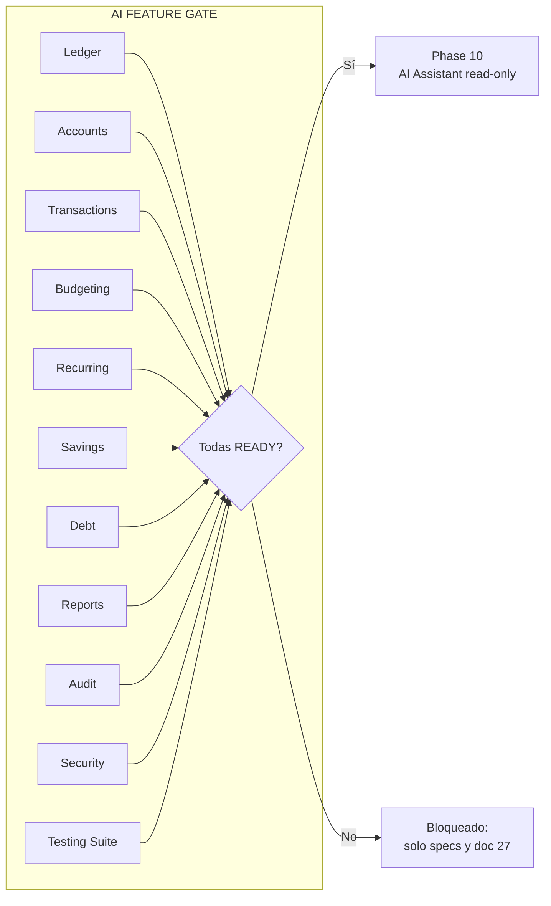
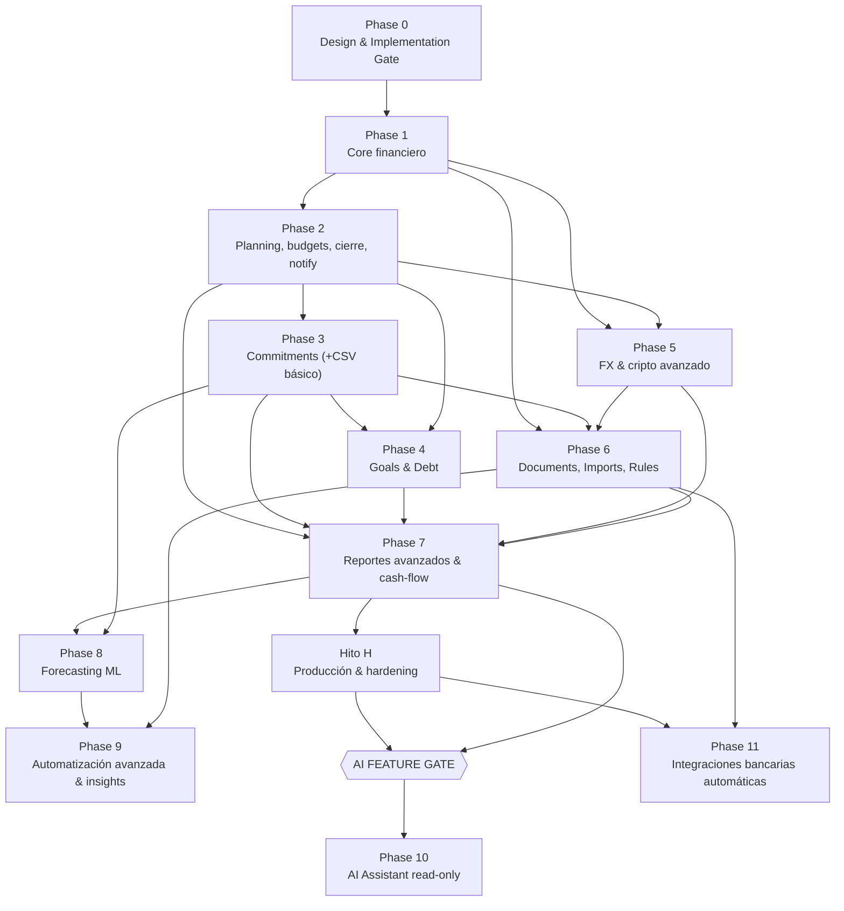
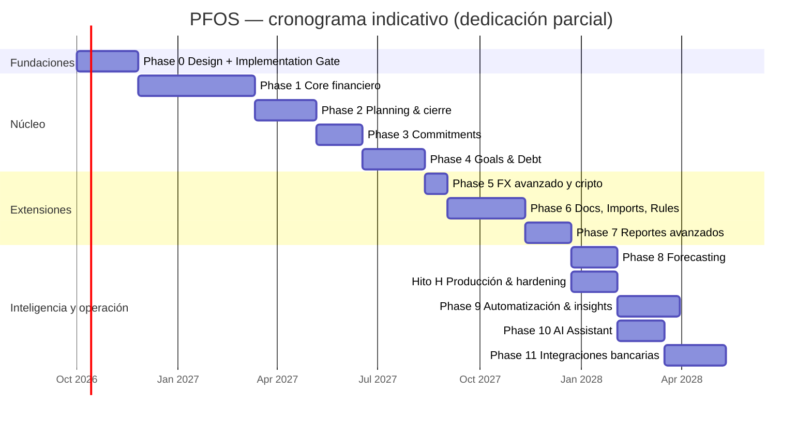

# 24 — Roadmap

> **Estado:** Propuesto · **Fecha:** 2026-10-01 · **Owner:** Product Owner + Principal Architect
> **Relacionado:** [ARCHITECTURE.md §13–§16](./ARCHITECTURE.md#13-roadmap-ajustes-justificados-respecto-a-la-propuesta) · [00-product-vision.md](./00-product-vision.md) · [01-functional-requirements.md](./01-functional-requirements.md) · [02-non-functional-requirements.md](./02-non-functional-requirements.md) · [03-openspec-strategy.md](./03-openspec-strategy.md) · [25-product-backlog.md](./25-product-backlog.md) · [26-risk-register.md](./26-risk-register.md) · [27-ai-assistant-roadmap.md](./27-ai-assistant-roadmap.md) · [30-backup-and-disaster-recovery.md](./30-backup-and-disaster-recovery.md)

---

## 1. Principios de secuenciación

1. **Dependencias de dominio primero**: nada se construye sobre un contexto que no esté `READY` (ver definición en §3). El ledger multi-moneda es la base de todo.
2. **Vertical slices end-to-end, uno a la vez**: cada slice atraviesa spec → TC → dominio → aplicación → persistencia → API → UI → E2E, y se archiva su change OpenSpec antes del siguiente.
3. **Valor diario para el owner en cada fase** (PP-12): al salir de Phase 1 el owner ya registra sus finanzas reales.
4. **Capacidad realista**: un desarrollador. Las duraciones son **indicativas** (semanas de dedicación parcial) y se re-estiman al cerrar cada fase ([RISK-004](./26-risk-register.md)).
5. **Inteligencia al final**: ML (Phase 8) y asistente IA (Phase 10) solo con núcleo maduro; el asistente está bloqueado por el **AI Feature Gate** (§4).

## 2. Ajustes justificados respecto a la propuesta original

Los ajustes provienen de [ARCHITECTURE §13](./ARCHITECTURE.md#13-roadmap-ajustes-justificados-respecto-a-la-propuesta); aquí se justifican por dependencia. Los marcados *(este doc)* son precisiones adicionales que no contradicen ARCHITECTURE y quedan sujetas a aprobación en el DESIGN GATE.

| # | Ajuste | Justificación por dependencia |
|---|--------|-------------------------------|
| A1 | **Multi-moneda en el ledger desde Phase 1** | El invariante "Σ por moneda = 0" y la existencia de una moneda por `LedgerAccount` definen el schema de `ledger.posting`; retro-adaptar un ledger mono-moneda implicaría migrar todos los postings y reescribir el dominio. Además el owner opera BOB/USD/USDT desde el día 1. |
| A2 | **Conversiones manuales (USDT↔BOB↔USD) en Phase 1**; **providers automáticos de tasa paralela también en Phase 1** (rev. 2026-10-02, docs/31 D29, ADR-0025); más providers, cripto y commodities en Phase 5 | La conversión es un caso de uso diario del owner; depende solo de LEDGER (FX_TRADING) + TRANSACTIONS + FX (tasas manuales), todos en Phase 1. El owner adelantó la tasa paralela automática (paralelo.bo principal, bo.dolarapi.com respaldo) porque cargarla a mano a diario es la mayor fricción del Home; el scheduler ya existe (pg-boss, ADR-0008) y el core sigue funcionando sin providers (degradación a tasas manuales). |
| A3 | **Audit trail base en Phase 1** | Las transacciones son editables desde Phase 1 (reversa + nueva entry); sin audit síncrono no hay forma de explicar cambios ni de cumplir NFR-DATA-007. Audit es prerrequisito de integridad, no un "nice to have" posterior. |
| A4 | **Reporting básico incremental desde Phase 1**; avanzado en Phase 7 | El dashboard (Q1, Q2, Q3, Q6, Q7 básico) es lo que hace útil Phase 1. Los reportes avanzados dependen de Planning (2), Commitments (3), Goals/Debt (4) y FX avanzado (5). |
| A5 | **Notifications base en Phase 2** | Las alertas de umbral de presupuesto (FR-PLANNING-022) son el primer productor real de notificaciones; antes no hay casos de uso que lo justifiquen. |
| A6 | **CSV import básico adelantable a Phase 3 (Could)**; pipeline completo en Phase 6 | Permite cargar histórico real temprano para que Planning/Commitments tengan datos. El pipeline completo depende de DOCUMENTS (almacenamiento de archivos) y RULES, ambos de Phase 6. El CSV básico de Phase 3 procesa el archivo en memoria/temporal sin depender de DOCUMENTS. |
| A7 *(este doc)* | **Reconciliación por sesiones y bulk edit en Phase 2** (marcar `cleared` en Phase 1) | La reconciliación formal se integra con el cierre de mes (Phase 2); en Phase 1 basta con estados `cleared`. Reduce el alcance del MVP sin comprometer integridad. |
| A8 *(este doc)* | **Hardening de producción como Hito H del Platform track**, no como fase propia | Las Phases 9 y 11 están definidas en el brief original (9 = automatización avanzada, detección de anomalías, clasificación, insights predictivos; 11 = integraciones bancarias automáticas) y se respetan. El AI Feature Gate exige Security y Testing Suite `READY`; por eso el hardening (cloud prod, DR drills, ASVS L2, SLOs) se ejecuta como **Hito H** en paralelo a Phases 8–9 y es prerrequisito de G10/G11. |
| A9 *(este doc)* | **Colaboración (workspaces compartidos, rol asesor) como track posterior no numerado (Could)** | No está en el roadmap original; el modelo multi-workspace la soporta desde Phase 1, pero su UX y flujos se difieren hasta después de Phase 11, salvo decisión del owner. |

## 3. Definiciones: estados de capability y gates

| Estado | Significado |
|--------|-------------|
| `SPECIFIED` | Change OpenSpec aprobado (`openspec validate --strict` OK) y TC catalogados. |
| `IN PROGRESS` | Implementación en curso en un vertical slice. |
| `READY` | Todos los Requirements `Must` implementados; TCs `Must` automatizados y verdes; cobertura según NFR-MAINT-002/003; spec archivada en `openspec/specs/`; documentación y runbooks actualizados; usado por el owner ≥ 2 semanas sin defectos críticos abiertos. |

**Gates del proyecto:**

- **DESIGN GATE** (fin del bloque documental de Phase 0): docs 00–30, ADRs 0001–0024 en estado *Propuesto/Aceptado*, specs OpenSpec de Phase 1 como changes, catálogo de TCs de Phase 1, riesgos con dueño. Checklist en [DESIGN-GATE.md](./DESIGN-GATE.md).
- **IMPLEMENTATION GATE** (fin de Phase 0): spikes concluidos con ADRs aceptados + pasos de §5.0.
- **PHASE EXIT** (fin de cada fase): criterios de salida de la fase cumplidos y revisados.
- **AI FEATURE GATE** (antes de Phase 10): §4.

## 4. AI FEATURE GATE

> **Regla:** el trabajo de implementación del asistente IA (EPIC-23, capability `assistant/read-only-assistant`) **no puede comenzar** —ni siquiera prototipos conectados a datos reales— hasta que **todas** las áreas siguientes estén `READY`. La redacción de specs y del doc 27 sí está permitida antes.

| # | Área requerida | Capabilities que deben estar `READY` | Fase origen |
|---|----------------|--------------------------------------|-------------|
| G1 | **Ledger** | ledger/journal-posting, ledger/balances | 1 |
| G2 | **Accounts** | accounts/account-management, accounts/institutions | 1 |
| G3 | **Transactions** | transactions/* (las 7) | 1–2, 6 |
| G4 | **Budgeting** | planning/financial-periods, planning/budgets, planning/budget-templates, planning/month-closing | 2 |
| G5 | **Recurring** | commitments/recurrence-engine, commitments/subscriptions | 3 |
| G6 | **Savings** | goals/savings-goals | 4 |
| G7 | **Debt** | debt/loans, debt/amortization, debt/credit-cards | 4 |
| G8 | **Reports** | reporting/dashboard, reporting/financial-reports, reporting/net-worth, reporting/cash-flow-calendar | 7 |
| G9 | **Audit** | audit/audit-trail (incl. FR-AUDIT-006) | 1–2 |
| G10 | **Security** | security/access-control, security/file-upload-security; ASVS L2 ≥ 90 % (NFR-SEC-010); threat model actualizado incluyendo IA (NFR-SEC-019 diseñado) | Hito H |
| G11 | **Testing Suite** | quality/test-traceability al 100 % para G1–G10; NFR-MAINT-002/005/007 cumplidos; suite adversarial y golden questions del asistente diseñadas (doc 27) | Hito H |

Evidencia requerida: matriz de trazabilidad generada, reporte de cobertura, checklist ASVS, registro de uso del owner, ADR-0021 aceptado. La aprobación del gate queda registrada como ADR o anexo de DESIGN-GATE.

## 5. Fases

### 5.0 Phase 0 — Discovery, Design Gate & Implementation Gate

- **Objetivo:** dejar decidido y especificado *qué* construir y *cómo*, validar el stack con spikes y preparar el esqueleto ejecutable sin lógica de negocio productiva.
- **Alcance:**
  1. **Bloque documental (DESIGN GATE):** docs 00–30, ADRs 0001–0024, ARCHITECTURE canónico, catálogo de riesgos, backlog.
  2. **Spikes (ARCHITECTURE §15):**

     | Spike | Pregunta | Time-box | Resultado esperado |
     |-------|----------|----------|--------------------|
     | SPIKE-01 | OpenSpec workflow + `validate --strict` en CI | 0.5 d | ADR-0024 aceptado; job CI |
     | SPIKE-02 | Kysely vs Prisma vs Drizzle (RLS `SET LOCAL`, NUMERIC, constraint triggers, agregados) | 2 d | ADR-0007 aceptado |
     | SPIKE-03 | Money & rounding (decimal.js, HALF_EVEN, largest remainder, PBT, round-trip) | 1 d | ADR-0006 aceptado; prototipo de `Money` descartable o promovible |
     | SPIKE-04 | Modular monolith en NestJS + dependency-cruiser | 1.5 d | ADR-0002/0003 aceptados |
     | SPIKE-05 | Outbox + BullMQ (at-least-once, inbox, graceful shutdown) | 1.5 d | ADR-0008 aceptado |
     | SPIKE-06 | Keycloak + Next.js BFF + JWT en Nest | 2 d | ADR-0010/0019 aceptados |
     | SPIKE-07 | Object storage local: **SeaweedFS vs Garage** (MinIO community archivado, sin imágenes desde oct-2025 — RISK-006 materializado) | 0.5 d | ADR-0009 aceptado |
     | SPIKE-08 | Compose en Windows/WSL2 | 1 d | ADR-0012 aceptado; tiempos NFR-PORT-002 medidos |
     | SPIKE-09 | Cloud cost PoC ECS/Fargate vs Cloud Run | 1 d | ADR-0013 con costo real (estimación previa staging+prod: ECS/Fargate ~120–195 USD/mes, Cloud Run ~60–110 USD/mes); decisión de presupuesto del owner |
     | SPIKE-10 | Observabilidad local OTel + otel-lgtm | 1 d | ADR-0020 aceptado |

  3. **Implementation Gate — pasos secuenciales:**
     1. **OpenSpec Phase 1**: changes de todas las capabilities de Phase 1 propuestos, validados y aprobados (`openspec validate --strict`).
     2. **Test cases Phase 1** catalogados en `tests/cases/<context>/TC-*.md` y enlazados a scenarios.
     3. **Repo skeleton**: monorepo pnpm + Turborepo, paquetes `shared-kernel`, `platform`, contextos vacíos con capas, reglas dependency-cruiser, lint/format/typecheck.
     4. **Containers**: Dockerfiles multi-stage non-root para `finance-api` (cmd api/worker/migrate/seed) y `finance-web`.
     5. **Local stack**: Compose con profiles `deps`/`core`/`seed`/`observability`; `pnpm stack:*`; healthchecks.
     6. **CI**: pipeline PR (format → lint → typecheck → OpenSpec validate → architecture tests → unit → integration → build → scans).
     7. **Migrations**: dbmate SQL-first, schemas por contexto, roles `migrator`/`app`, RLS base, tablas `platform` (outbox, inbox, idempotency).
     8. **Vertical slices uno a la vez**: el primer slice (*crear cuenta con saldo inicial*) inicia Phase 1.
- **Capabilities:** `platform/local-environment`, `platform/delivery-pipeline`, `platform/observability`, `platform/api-conventions`, `quality/test-traceability` (specs); specs de Phase 1 como changes.
- **Exit criteria:** DESIGN GATE aprobado; 10 spikes cerrados con ADR; `pnpm stack:up` levanta `core` healthy en Windows/WSL2 en ≤ 90 s (con un endpoint `/health` y una página vacía autenticada); CI verde en `main`; migración base aplicada; matriz de trazabilidad generada (vacía pero funcional).
- **Dependencias:** ninguna.
- **Riesgos clave:** RISK-004 (alcance), RISK-005 (sobre-ingeniería), RISK-011 (OpenSpec), RISK-012 (ORM), RISK-019 (Windows), RISK-006 (MinIO).

### 5.1 Phase 1 — Core financiero (MVP)

- **Objetivo:** el owner registra **todas** sus finanzas reales en BOB/USD/USDT con integridad garantizada y ve un dashboard básico confiable.
- **Alcance:** autenticación y workspace; cuentas e instituciones; ledger multi-moneda; transacciones (6 tipos), splits, transferencias, conversiones manuales con `ConversionDetail`; categorías, tags, counterparties; tasas manuales; **providers automáticos de tasa paralela** (paralelo.bo + bo.dolarapi.com, histórico diario, fallback, anomalías, atribución; ADR-0025); audit síncrono; **recorrido trazable del ciclo de vida** de transacciones, transferencias, conversiones y cuentas (máquinas de estado explícitas, `GET …/{id}/lifecycle` y reporte en la UI; docs/31 D37); dashboard básico (Q1, Q2, Q3, Q6, Q7 básico); **datos de demostración** cargables y removibles por acción explícita del OWNER en un workspace demo dedicado (docs/31 D36, ADR-0026); backup/restore local.
- **Capabilities:** `identity/authentication`, `identity/workspace-membership`, `accounts/account-management`, `accounts/institutions`, `ledger/journal-posting`, `ledger/balances`, `transactions/transaction-recording`, `transactions/transfers`, `transactions/conversions`, `transactions/splits`, `transactions/reconciliation` (solo `cleared`), `transactions/duplicate-detection` (advertencia manual), `classification/categories`, `classification/tags`, `classification/counterparties`, `fx/market-rates` (manual), `fx/market-rate-providers` (tasa paralela y oficial de Bolivia), `fx/conversion-pricing`, `audit/audit-trail`, `audit/lifecycle-timeline`, `identity/demo-data`, `reporting/dashboard`, `reporting/net-worth` (actual), `security/access-control`.
- **Orden de vertical slices:** (1) cuenta + saldo inicial → (2) gasto/ingreso con categoría → (3) transferencia → (4) edición/void con reversa + audit → (5) splits → (6) tasas manuales + conversión USDT→BOB → (7) refund y adjustment → (7b) providers de tasa paralela (paralelo.bo/bo.dolarapi.com) → (8) dashboard básico valorado con la tasa paralela → (8b) recorrido del ciclo de vida (`add-lifecycle-timeline`) → (8c) datos de demostración (`add-demo-data`) → (9) tags/counterparties/filtros → (10) backup/restore local.
- **Exit criteria:** todos los FR `Must` de Phase 1 `READY`; invariant checker sin violaciones con seed `large`; NFR-PERF-001/003/004 cumplidos; NFR-DATA-* de Phase 1 verificados; owner usa el sistema 2 semanas con ≥ 90 % de movimientos registrados; backup/restore local probado.
- **Dependencias:** Phase 0 (Implementation Gate).
- **Riesgos clave:** RISK-001, RISK-002, RISK-003, RISK-008 (auth), RISK-017 (multi-moneda), RISK-023 (providers de tasa de terceros), RISK-004.

### 5.2 Phase 2 — Planificación, presupuestos y cierre

- **Objetivo:** planificar el mes, controlar presupuestos con alertas y cerrar meses con snapshot inmutable.
- **Alcance:** periodos (draft/active/closed/reopened), plan mensual, templates versionados, presupuestos (fixed/maximum Must; minimum/range/rollover/% ingreso Should; zero-based Could), umbrales 50/75/90/100/custom, month closing con checklist y snapshot, reconciliación por sesiones (con el evento dedicado `transactions.TransactionCleared`, que en Phase 1 se cubre con `TransactionUpdated` + `changedFields=[status]`; docs/31 D47), bulk edit, custom fields, notificaciones in-app/email, export de workspace, evolución de net worth, audit global.
- **Capabilities:** `planning/financial-periods`, `planning/budgets`, `planning/budget-templates`, `planning/month-closing`, `notifications/alerts`, `transactions/reconciliation` (completa), `transactions/bulk-edit`, `classification/custom-fields`.
- **Exit criteria:** owner cierra ≥ 1 mes real con reconciliación de todas las cuentas a diferencia 0; reabrir/re-cerrar genera nuevo snapshot sin alterar el anterior; alertas de umbral entregadas exactamente una vez; export→import round-trip reproduce saldos.
- **Dependencias:** Phase 1 (LEDGER para bloqueo de periodos, TRANSACTIONS/CLASSIFICATION para presupuesto vs real, FX para conversión a base).
- **Riesgos clave:** RISK-020 (bordes de fecha/TZ), RISK-004, RISK-005 (tipos de presupuesto exóticos).

### 5.3 Phase 3 — Compromisos recurrentes y suscripciones

- **Objetivo:** anticipar todos los pagos conocidos (Q4, Q8) y detectar cambios de precio.
- **Alcance:** motor de recurrencia (cadencias + RRULE subset, montos fixed/estimated/min-max/variable, idempotencia, auto-create/pending approval/notify-only, skip/pause/change future/end date), suscripciones con historial de precios y detección de cambios, próximos pagos en dashboard; **(Could)** CSV import básico.
- **Capabilities:** `commitments/recurrence-engine`, `commitments/subscriptions`, `reporting/cash-flow-calendar` (lista simple), `imports/import-pipeline` (subconjunto CSV básico, Could).
- **Exit criteria:** generación re-ejecutada N veces sin duplicados (PBT); todas las suscripciones reales del owner modeladas; 0 pagos recurrentes sorpresa en un mes (SM-07), medido con el indicador de pagos sorpresa de `GET /reports/surprise-payments` (`add-upcoming-payments`: pagos cuya ocurrencia se generó el mismo día o después; solo ve pagos vinculados a un compromiso) sobre un periodo cerrado del owner.
- **Dependencias:** Phase 1 (TRANSACTIONS para materializar ocurrencias), Phase 2 (PLANNING para compromisos en plan mensual; NOTIFY para recordatorios).
- **Riesgos clave:** RISK-020 (RRULE/TZ/fin de mes), RISK-016 (CSV bancario heterogéneo).

### 5.4 Phase 4 — Metas de ahorro y deudas

- **Objetivo:** responder Q5 completo y Q9; controlar préstamos y tarjetas.
- **Alcance:** savings goals (contribución real y earmark, cálculos, what-if), préstamos (French Must; German/fixed principal/custom Should; desglose, extra payments, tasa variable, payoff simulator), tarjetas de crédito (ciclos, mínimo, vencimiento, utilización).
- **Capabilities:** `goals/savings-goals`, `debt/loans`, `debt/amortization`, `debt/credit-cards`.
- **Exit criteria:** cronograma French coincide al centavo con una tabla real del banco del owner (o diferencia explicada); Σ principal de cuotas = principal; pagos de tarjeta no cuentan como gasto; metas del owner con estado calculado.
- **Dependencias:** Phase 1 (TRANSACTIONS/LEDGER para desembolsos/pagos/contribuciones), Phase 2 (PLANNING para aportes y pagos en el plan), Phase 3 (COMMITMENTS para cuotas como compromisos).
- **Riesgos clave:** RISK-001 (redondeo de cuotas), RISK-017, RISK-005 (sobre-modelar amortización).

### 5.5 Phase 5 — FX y cripto avanzado

- **Objetivo:** ampliar las tasas automáticas más allá del dólar paralelo y analizar el costo real de convertir.
- **Alcance:** (el puerto `MarketRateProvider`, el scheduler, el fallback, staleness/anomalías y los providers paralelo.bo / bo.dolarapi.com ya están en Phase 1, ADR-0025) **más providers** (casas de cambio, bancos, exchanges cripto), precios cripto (BTC, ETH) y de commodities/inversiones, alertas de staleness/anomalía vía Notifications, análisis de spread/fees por provider (FR-FX-011), valoración de activos no monetarios (FR-FX-012).
- **Capabilities:** `fx/market-rate-providers` (nuevos adapters), `fx/market-rates`, `fx/conversion-pricing`, `reporting/net-worth` (valoración).
- **Exit criteria:** tasas diarias de todos los pares del owner (incl. cripto) sin intervención manual por 30 días; ninguna tasa histórica modificada (test de inmutabilidad); alertas de staleness funcionando.
- **Dependencias:** Phase 1 (FX manual, providers de tasa paralela, conversiones), Phase 2 (NOTIFY para alertas).
- **Riesgos clave:** RISK-023 (fuentes FX/ToS), RISK-003.

### 5.6 Phase 6 — Documentos, imports y reglas

- **Objetivo:** reducir la captura manual mediante imports confiables y clasificación automática.
- **Alcance:** ([13-import-architecture.md](./13-import-architecture.md)) documentos (presigned upload, validaciones, adjuntos N:M), pipeline de import completo (CSV/OFX/QIF/JSON/XLSX, perfiles de mapeo, dedupe, preview, idempotencia, undo), BankingProvider port + adapter de exchange, rules engine (WHEN/THEN, prioridad, preview, dry-run).
- **Capabilities:** `documents/attachments`, `security/file-upload-security`, `imports/import-pipeline`, `imports/banking-providers`, `rules/rule-engine`, `transactions/duplicate-detection` (imports).
- **Exit criteria:** importar 3 meses de extractos reales del owner sin duplicados y con ≥ 70 % de transacciones clasificadas por reglas; re-import del mismo archivo crea 0 transacciones; uploads maliciosos de prueba rechazados.
- **Dependencias:** Phase 1 (TRANSACTIONS/CLASSIFICATION), Phase 3 (matching con ocurrencias), Phase 5 (conversiones importadas con tasas de referencia).
- **Riesgos clave:** RISK-016, RISK-010 (archivos sensibles), RISK-006.

### 5.7 Phase 7 — Reportes avanzados y cash-flow calendar

- **Objetivo:** las 9 preguntas del Home respondidas por completo; 16 reportes con drill-down.
- **Alcance:** catálogo de 16 reportes, MoM/YoY/custom/rolling, drill-down, política de conversión explícita, export CSV, cash-flow calendar 7/30/60/90 con lowest expected balance y shortfall risk, digest por email, average/historical-based budgets, sugerencia de reglas.
- **Capabilities:** `reporting/dashboard`, `reporting/financial-reports`, `reporting/net-worth`, `reporting/cash-flow-calendar`.
- **Exit criteria:** SM-05 cumplido; NFR-PERF-006/010 cumplidos con seed `large`; reportes cuadran contra ledger (test de reconciliación reporte↔ledger).
- **Dependencias:** Phases 2–6 (cada reporte consume los read models de su contexto).
- **Riesgos clave:** RISK-029 (rendimiento), RISK-017.

### 5.8 Phase 8 — Forecasting (ML)

- **Objetivo:** forecasting explicable y honesto sobre gastos, ingresos y saldo.
- **Alcance:** ([15-ml-architecture.md](./15-ml-architecture.md)) servicio `ml-forecasting` (Python/FastAPI), ACL `@pf/forecasting`, horizontes 1/3/6/12, intervalos, baseline, versión de modelo, conocidos vs predichos, backtesting, degradación sin ML.
- **Capabilities:** `forecast/expense-forecasting`.
- **Exit criteria:** modelos superan baseline en backtesting para las series publicadas; con datos insuficientes se muestra solo baseline + conocidos; apagar `ml-forecasting` no afecta el core (test).
- **Dependencias:** Phase 3 (conocidos), Phase 4 (cuotas), Phase 7 (read models históricos); ≥ 6 meses de datos reales cerrados (Phase 2).
- **Riesgos clave:** RISK-014 (datos insuficientes), RISK-005.

### 5.9 Phase 9 — Automatización avanzada e insights predictivos

- **Objetivo:** reducir aún más el trabajo manual y anticipar problemas, siempre explicable y nunca como fuente de verdad.
- **Alcance:** detección de anomalías (gastos atípicos por categoría/merchant, cargos duplicados, cambios de precio no anunciados); clasificación automática de transacciones (modelo entrenado sobre el histórico categorizado, como *sugerencia* con confianza y revisable; las reglas explícitas del Rules Engine siempre tienen prioridad); insights predictivos (riesgo de exceder presupuesto antes de fin de mes, riesgo de shortfall en el cash-flow calendar, metas en riesgo); automatizaciones avanzadas (acciones encadenadas sobre eventos, p. ej. contribución a meta al recibir salario, con confirmación). Ver [15-ml-architecture.md](./15-ml-architecture.md).
- **Capabilities:** extensión de `forecast/expense-forecasting`; nuevas a proponer vía OpenSpec: `forecast/anomaly-detection`, `classification/auto-classification`, `reporting/predictive-insights`, `rules/automation-workflows`.
- **Exit criteria:** precisión de la clasificación sugerida ≥ umbral acordado en backtesting temporal y tasa de aceptación del owner medida; anomalías evaluadas (precision/recall) contra las anomalías etiquetadas del seed `large` ([29-seed-datasets.md](./29-seed-datasets.md)); toda sugerencia muestra razones; apagar ML deja el core intacto.
- **Dependencias:** Phase 8 (servicio ML, backtesting), Phase 6 (Rules Engine, imports), Phase 7 (read models).
- **Riesgos clave:** RISK-014 (datos insuficientes), RISK-005 (sobre-ingeniería), RISK-015 (confianza indebida en sugerencias).

### Hito H (Platform track) — Producción y hardening

- **Objetivo:** operar en producción con seguridad, backups y DR verificados; completar la suite de testing (prerrequisitos G10 y G11 del AI gate). Corre en paralelo a Phases 8–9.
- **Alcance:** Terraform staging/prod (ADR-0013/0014; [21-cloud-deployment-options.md](./21-cloud-deployment-options.md), [22-infrastructure.md](./22-infrastructure.md)), despliegue por digest, PITR, retención y restore drills mensuales ([30-backup-and-disaster-recovery.md](./30-backup-and-disaster-recovery.md)), TLS/HSTS/CSP, MFA, ASVS L2, threat model, malware scan hook, alertas, SLOs, E2E multi-navegador, mutation testing, performance nightly.
- **Capabilities:** `platform/delivery-pipeline`, `platform/observability`, `security/access-control`, `security/file-upload-security`, `quality/test-traceability`.
- **Exit criteria:** NFR-REL-001..005 verificados con drill; ASVS L2 ≥ 90 %; costo mensual dentro del presupuesto (SM-14); trazabilidad 100 % de fases 1–7.
- **Riesgos clave:** RISK-007 (costo), RISK-009 (pérdida de datos), RISK-010 (privacidad), RISK-008.

### 5.10 Phase 10 — Asistente IA (solo lectura)

- **Objetivo:** preguntas en lenguaje natural sobre datos propios, con respuestas citadas y verificables.
- **Alcance:** tools autorizadas sobre queries de aplicación, RBAC/RLS, opt-in, minimización de datos, golden questions, suite adversarial (prompt injection), auditoría de interacciones. Detalle en [27-ai-assistant-roadmap.md](./27-ai-assistant-roadmap.md).
- **Capabilities:** `assistant/read-only-assistant`.
- **Exit criteria:** golden questions ≥ umbral del doc 27; 0 tool calls fuera de allowlist; 0 cifras sin cita en evaluación.
- **Dependencias:** **AI FEATURE GATE (§4)**.
- **Riesgos clave:** RISK-015 (alucinación/mal uso), RISK-010, RISK-007 (costo LLM).

### 5.11 Phase 11 — Integraciones bancarias automáticas

- **Objetivo:** alimentar el sistema automáticamente desde fuentes externas donde existan, sin que el producto dependa de ellas.
- **Alcance:** adapters reales del port `BankingProvider` (aggregators tipo Plaid donde aplique, providers regionales, APIs de exchanges cripto para historial de trades y saldos), sincronización programada e incremental, consentimiento y revocación, tokens del provider (nunca credenciales bancarias en el sistema), reconciliación automática contra saldos del provider; como fuentes semi-automáticas, parsers PDF de extractos de bancos bolivianos y OCR de recibos. Ver [13-import-architecture.md](./13-import-architecture.md).
- **Capabilities:** `imports/banking-providers`, `imports/import-pipeline`, `documents/attachments` (OCR).
- **Exit criteria:** al menos una fuente automática productiva con sincronización idempotente (re-sync = 0 duplicados) **o** decisión documentada de no hacerlo por falta de APIs en Bolivia ([RISK-016](./26-risk-register.md)); el producto sigue 100 % funcional con el provider caído.
- **Dependencias:** Phase 6 (pipeline de imports, rules), Hito H (seguridad en producción).
- **Riesgos clave:** RISK-016, RISK-010, RISK-023 (ToS de terceros).

### Track posterior (no numerado, Could) — Colaboración

Invitaciones y roles, transferencia de ownership, borrado de workspace, rol asesor/viewer, canal webhook/Telegram. Requiere tests de aislamiento RLS reforzados (RISK-021). Pendiente de decisión del owner.

## 6. Platform track (transversal)

Trabajo de plataforma que avanza en paralelo, en pequeños incrementos, para no concentrar todo en el Hito H:

| Momento | Incremento |
|---------|------------|
| Phase 0 | Compose, CI, migraciones, observabilidad local (SPIKE-08/10); ver [19-local-development.md](./19-local-development.md), [20-container-strategy.md](./20-container-strategy.md), [23-ci-cd.md](./23-ci-cd.md) |
| Phase 1 | Backup/restore local automatizado + invariant checker; rate limiting básico; CSP |
| Fin Phase 2 *(opcional, decisión del owner tras SPIKE-09)* | **Despliegue personal mínimo** en cloud (staging = prod de bajo costo) con backups diarios, para acceder desde el teléfono; o continuar local-only |
| Fin Phase 2, antes de Phase 6 | **Rendimiento de las colas de eventos** (`improve-event-throughput`, docs/33 D112): concurrencia entre agregados y lotes en los consumidores, objetivo ≥ 42 eventos/s por consumidor para que los imports cumplan NFR-PERF-008 |
| Phase 5–7 | Nightly de rendimiento con seed `large`; Renovate; SBOM |
| Hito H (paralelo a Phases 8–9) | Hardening completo, DR drills, SLOs |

## 7. Dependencias entre fases

> Phases 8 y 9 no son prerrequisito del AI gate: el asistente puede consultar forecasts si existen, pero no los requiere.

## 8. Cronograma indicativo

Supuesto: un desarrollador con dedicación parcial (~20 h/semana). Las fechas **no son compromisos**; se re-planifica al cerrar cada fase.

## 9. Resumen por fase

| Fase | Contextos | Q del Home habilitadas | FR Must (aprox.) | Duración indicativa |
|------|-----------|------------------------|------------------|---------------------|
| 0 | Platform, Quality | — | — | 8 sem |
| 1 | IDENTITY, ACCOUNTS, LEDGER, TRANSACTIONS, CLASSIFICATION, FX (manual + providers de tasa paralela), AUDIT, REPORTING (básico) | Q1, Q2, Q3, Q6, Q7 básico | ~100 | 15 sem |
| 2 | PLANNING, NOTIFY (+ reconciliación, bulk edit, custom fields) | Q5 (presupuesto) | ~25 | 8 sem |
| 3 | COMMITMENTS (+ CSV básico) | Q4, Q8 (lista) | ~12 | 6 sem |
| 4 | GOALS, DEBT | Q5 completo, Q9 | ~15 | 8 sem |
| 5 | FX (más providers, cripto, commodities) | — (mejora Q1) | ~1 | 3 sem |
| 6 | DOCUMENTS, IMPORTS, RULES | — | ~25 | 10 sem |
| 7 | REPORTING (avanzado) | Q7, Q8 completos | ~10 | 6 sem |
| 8 | FORECAST | — | ~6 | 6 sem |
| 9 | FORECAST (anomalías, insights), CLASSIFICATION (auto), RULES (automatizaciones) | mejora Q5, Q8, Q9 | ~8 | 8 sem |
| H | Platform, Security, Quality | — | (NFR) | 6 sem (paralelo) |
| 10 | ASSISTANT | — | ~8 | 6 sem |
| 11 | IMPORTS (banking providers), DOCUMENTS (OCR) | — | ~3 | 8 sem |

## Preguntas abiertas

1. ¿Aprueba el owner tratar el hardening de producción como Hito H paralelo (no como fase) y la Colaboración como track posterior no numerado?
2. ¿Se hará el **despliegue personal mínimo** al final de Phase 2 o el owner prefiere operar local-only hasta el Hito H? (Depende de SPIKE-09 y del presupuesto.) *Presupuesto fijado por el owner el 2026-10-05: USD 10–20/mes (docs/31 D51); el host lo elige el change de despliegue (ADR-0027).*
3. ~~¿Phase 5 (FX providers) puede adelantarse?~~ Resuelta 2026-10-02: los providers de tasa paralela se adelantan a Phase 1 (docs/31 D29, ADR-0025); Phase 5 conserva más providers, cripto y commodities.
4. ¿El CSV básico (Phase 3, Could) se considera necesario para cargar el histórico del owner, o el owner empezará "desde cero" con saldos iniciales?
5. ¿El umbral "≥ 6 meses de datos cerrados" para Phase 8 se cumplirá a tiempo según el cronograma? Si no, Phase 8 puede posponerse sin bloquear Phase 9/10.
6. ¿Qué dedicación semanal real tiene el owner? Las duraciones asumen ~20 h/semana.
