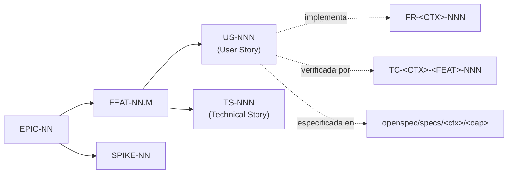

# 25 — Product backlog

> **Estado:** Propuesto · **Fecha:** 2026-10-01 · **Owner:** Product Owner
> **Relacionado:** [ARCHITECTURE.md](./ARCHITECTURE.md) · [00-product-vision.md](./00-product-vision.md) · [01-functional-requirements.md](./01-functional-requirements.md) · [02-non-functional-requirements.md](./02-non-functional-requirements.md) · [03-openspec-strategy.md](./03-openspec-strategy.md) · [24-roadmap.md](./24-roadmap.md) · [26-risk-register.md](./26-risk-register.md) · [29-seed-datasets.md](./29-seed-datasets.md) · `tests/cases/`

---

## 1. Estructura y convenciones

- **EPIC-NN**: objetivo de negocio grande, normalmente alineado a un bounded context y una fase.
- **FEAT-NN.M**: capacidad entregable dentro de la épica (≈ una capability OpenSpec o parte de ella).
- **US-NNN**: historia de usuario ("Como … quiero … para …") con criterios Given/When/Then.
- **TS-NNN**: historia técnica (habilitadora, sin valor directo visible) con criterios verificables.
- **SPIKE-NN**: investigación con time-box (ARCHITECTURE §15).
- Numeración de US por fase (rangos reservados): Phase 1 `US-001–099`, Phase 2 `US-101–130`, Phase 3 `US-131–150`, Phase 4 `US-151–180`, Phase 5 `US-181–190`, Phase 6 `US-191–220`, Phase 7 `US-221–240`, Phase 8 `US-241–255`, Phase 10 `US-261–275`, Phase 11 `US-281–299`. TS: Phase 0 `TS-001–015`, Phase 1 `TS-016–040`, Phase 9 `TS-101–130`.
- **Prioridad** MoSCoW relativa a la fase. **Definition of Ready**: FR enlazado, capability con change OpenSpec validado, ACs, TCs catalogados, dependencias resueltas. **Definition of Done**: ACs verdes como tests automatizados con TC-ID en el nombre, cobertura según NFR-MAINT-002/003, audit/observabilidad incluidas, OpenAPI actualizado, revisión de accesibilidad (axe) si hay UI, change OpenSpec archivado al cerrar la feature.
- **Test cases**: los IDs listados son **IDs preliminares, ver `tests/cases/`**; los que ya existen en el catálogo se citan tal cual (p.ej. TC-LEDGER-TRANSFER-001, TC-TRANSACTIONS-CONVERSION-001, TC-SECURITY-RLS-001), el resto son propuestas (el catálogo definitivo lo mantiene el equipo de testing con el patrón `TC-<CONTEXT>-<FEATURE>-NNN`). Si difieren, prevalece `tests/cases/` y se actualiza este documento.

## 2. Mapa de épicas

| Épica | Nombre | Fase | Contexto(s) | Prioridad |
|-------|--------|------|-------------|-----------|
| EPIC-01 | Design Gate y especificación | 0 | Quality / todos | Must |
| EPIC-02 | Spikes tecnológicos | 0 | Platform | Must |
| EPIC-03 | Implementation Gate: plataforma base | 0 | Platform | Must |
| EPIC-04 | Identidad, workspace y app shell | 1 | IDENTITY | Must |
| EPIC-05 | Cuentas e instituciones | 1 | ACCOUNTS | Must |
| EPIC-06 | Ledger multi-moneda y fundaciones de dominio | 1 | LEDGER, shared-kernel, platform | Must |
| EPIC-07 | Transacciones | 1 (2 parcial) | TRANSACTIONS | Must |
| EPIC-08 | Clasificación | 1 (2 parcial) | CLASSIFICATION | Must |
| EPIC-09 | FX manual y conversiones | 1 | FX, TRANSACTIONS | Must |
| EPIC-10 | Audit trail | 1 | AUDIT | Must |
| EPIC-11 | Dashboard básico, calidad y operación local | 1 | REPORTING, Platform | Must |
| EPIC-12 | Planificación, presupuestos y cierre de mes | 2 | PLANNING, TRANSACTIONS | Must |
| EPIC-13 | Notificaciones | 2 | NOTIFY | Must |
| EPIC-14 | Compromisos recurrentes y suscripciones | 3 | COMMITMENTS | Must |
| EPIC-15 | Metas de ahorro | 4 | GOALS | Must |
| EPIC-16 | Deudas y crédito | 4 | DEBT | Must |
| EPIC-17 | FX providers y cripto avanzado | 5 | FX | Should |
| EPIC-18 | Documentos y adjuntos | 6 | DOCUMENTS | Must |
| EPIC-19 | Imports e integraciones bancarias | 3 (Could) / 6 | IMPORTS | Must |
| EPIC-20 | Rules engine | 6 | RULES | Must |
| EPIC-21 | Reportes avanzados y cash-flow calendar | 7 | REPORTING | Must |
| EPIC-22 | Forecasting | 8 | FORECAST | Should |
| EPIC-23 | Asistente IA de solo lectura | 10 (AI Gate) | ASSISTANT | Could |
| EPIC-24 | Producción y hardening | Hito H (paralelo a 8–9) | Platform, Security, Quality | Must |
| EPIC-25 | Integraciones bancarias automáticas | 11 | IMPORTS, DOCUMENTS | Could |
| EPIC-26 | Automatización avanzada, anomalías, clasificación e insights predictivos | 9 | FORECAST, CLASSIFICATION, RULES, REPORTING | Should |
| EPIC-27 | Colaboración (track posterior no numerado) | — | IDENTITY, NOTIFY | Could |

---

# PHASE 0 — Design Gate & Implementation Gate (detalle completo)

## EPIC-01 — Design Gate y especificación

**Objetivo:** decidir y especificar el producto antes de implementarlo (PP-01). **Exit:** DESIGN GATE aprobado.

### FEAT-01.1 — Documentación de producto y arquitectura

#### TS-001 — Conjunto documental 00–30
- **Descripción:** redactar y revisar los documentos `docs/00`–`docs/30` y `ARCHITECTURE.md` consistentes entre sí.
- **Valor:** base compartida de decisiones; evita retrabajo.
- **Prioridad:** Must · **Capability:** — · **Dependencias:** ninguna.
- **Criterios de aceptación:**
  - **AC1** Given los documentos 00–30, When se revisan contra ARCHITECTURE.md, Then no existe contradicción no registrada (las discrepancias tienen pregunta abierta o change propuesto).
  - **AC2** Given cada documento, When se abre, Then tiene header (Estado · Fecha · Relacionado) y sección "Preguntas abiertas".
  - **AC3** Given un FR de docs/01, When se busca su capability, Then existe en la taxonomía de ARCHITECTURE §14.

#### TS-002 — ADRs 0001–0024
- **Descripción:** redactar los 24 ADRs (MADR) de la lista canónica; los dependientes de spikes quedan *Propuesto (spike)*.
- **Prioridad:** Must · **Dependencias:** TS-001 · **Capability:** —
- **Criterios de aceptación:**
  - **AC1** Given la lista canónica de ARCHITECTURE §5, When se listan `docs/adr/`, Then existen los 24 ADRs con estado, contexto, opciones, decisión y consecuencias.
  - **AC2** Given un ADR dependiente de un SPIKE, When el spike concluye, Then el ADR pasa a *Aceptado* o *Rechazado* con evidencia enlazada.

### FEAT-01.2 — OpenSpec y contratos

#### TS-003 — Inicializar OpenSpec
- **Descripción:** `openspec/config.yaml`, convenciones de nombres, plantilla de change y validación local (ver [03-openspec-strategy.md](./03-openspec-strategy.md)).
- **Prioridad:** Must · **Dependencias:** SPIKE-01 · **Capability:** `quality/test-traceability`
- **Criterios de aceptación:**
  - **AC1** Given el repo, When se ejecuta `openspec validate --strict`, Then termina con código 0.
  - **AC2** Given un change de ejemplo, When se recorre propose → apply → archive, Then la spec resultante aparece en `openspec/specs/<context>/<capability>/spec.md`.

#### TS-004 — Changes OpenSpec de Phase 1
- **Descripción:** un change por capability de Phase 1 (identity/*, accounts/*, ledger/*, transactions/*, classification/{categories,tags,counterparties}, fx/*, audit/audit-trail, reporting/{dashboard,net-worth}, security/access-control, platform/api-conventions).
- **Prioridad:** Must · **Dependencias:** TS-003, TS-001
- **Criterios de aceptación:**
  - **AC1** Given cada FR `Must` de Phase 1, When se busca en las specs, Then está cubierto por ≥ 1 `### Requirement:` con ≥ 1 `#### Scenario:`.
  - **AC2** Given todos los changes, When se ejecuta `openspec validate --strict`, Then no hay errores.

#### TS-005 — Borrador de contratos API y eventos de Phase 1
- **Descripción:** `contracts/openapi/finance-api.v1.yaml` (recursos de Phase 1) y `contracts/events/<context>/*.v1.schema.json`.
- **Prioridad:** Must · **Dependencias:** TS-004 · **Capability:** `platform/api-conventions`
- **Criterios de aceptación:**
  - **AC1** Given el OpenAPI, When se ejecuta Spectral/Redocly lint, Then 0 errores.
  - **AC2** Given un endpoint POST financiero, When se inspecciona, Then declara `Idempotency-Key` requerido y respuestas `application/problem+json`.
  - **AC3** Given los montos en schemas, When se inspeccionan, Then son `string` con patrón decimal, nunca `number`.

### FEAT-01.3 — Catálogo de test cases y trazabilidad

#### TS-006 — Catálogo de TCs de Phase 1
- **Descripción:** `tests/cases/<context>/TC-*.md` para todos los scenarios de Phase 1 (ver [29-seed-datasets.md](./29-seed-datasets.md) para datos).
- **Prioridad:** Must · **Dependencias:** TS-004
- **Criterios de aceptación:**
  - **AC1** Given cada `#### Scenario:` de Phase 1, When se busca en `tests/cases`, Then existe ≥ 1 TC que lo referencia.
  - **AC2** Given un TC, When se abre, Then contiene ID, scenario de origen, precondiciones, datos, pasos, resultado esperado y tipo (unit/integration/e2e/pbt).

#### TS-007 — Generador de matriz de trazabilidad
- **Descripción:** script TS cross-platform que cruza FR ↔ Requirements ↔ Scenarios ↔ TCs ↔ tests (`[TC-…]` en nombres) y genera `tests/traceability/matrix.md`.
- **Prioridad:** Must · **Dependencias:** TS-006 · **Capability:** `quality/test-traceability`
- **Criterios de aceptación:**
  - **AC1** Given un TC sin test automatizado, When se genera la matriz, Then aparece como "no automatizado".
  - **AC2** Given un test con TC-ID inexistente, When corre el script en CI, Then el job falla.

## EPIC-02 — Spikes tecnológicos

Cada spike produce: informe breve en el ADR correspondiente, código desechable en rama `spike/*` (nunca mergeado tal cual) y decisión. Criterio común: **Given** la pregunta del spike, **When** vence el time-box, **Then** existe decisión documentada (aun si es "insuficiente evidencia → opción conservadora").

### FEAT-02.1 — Datos y dinero

| ID | Spike | Time-box | Criterios de aceptación específicos | ADR | Riesgos |
|----|-------|----------|-------------------------------------|-----|---------|
| SPIKE-02 | Kysely vs Prisma vs Drizzle | 2 d | Demuestra `SET LOCAL app.workspace_id` por transacción con pool; NUMERIC(38,18) ↔ string sin pérdida; constraint trigger diferido funcionando; mapping de un agregado con optimistic locking; migración dbmate | ADR-0007 | RISK-012 |
| SPIKE-03 | Money & rounding | 1 d | Propiedades fast-check: HALF_EVEN, largest remainder Σ exacta, round-trip NUMERIC↔string↔Decimal para escalas 0/2/6/8/18 | ADR-0006 | RISK-001 |

### FEAT-02.2 — Runtime de la arquitectura

| ID | Spike | Time-box | Criterios de aceptación específicos | ADR | Riesgos |
|----|-------|----------|-------------------------------------|-----|---------|
| SPIKE-04 | Modular monolith NestJS | 1.5 d | Dos contextos de juguete; dependency-cruiser falla si `domain` importa Nest o si un contexto importa internals de otro | ADR-0002, ADR-0003 | RISK-005 |
| SPIKE-05 | Outbox + BullMQ | 1.5 d | Kill del worker durante relay ⇒ 0 eventos perdidos; reentrega ⇒ 0 efectos duplicados (inbox); SIGTERM ⇒ shutdown limpio | ADR-0008 | RISK-022 |

### FEAT-02.3 — Seguridad

| ID | Spike | Time-box | Criterios de aceptación específicos | ADR | Riesgos |
|----|-------|----------|-------------------------------------|-----|---------|
| SPIKE-06 | Keycloak + Next.js BFF + JWT | 2 d | Login PKCE; cookie httpOnly; token ausente en JS; Nest valida JWT (iss/aud/exp) y resuelve rol por workspace | ADR-0010, ADR-0019 | RISK-008 |

### FEAT-02.4 — Plataforma

| ID | Spike | Time-box | Criterios de aceptación específicos | ADR | Riesgos |
|----|-------|----------|-------------------------------------|-----|---------|
| SPIKE-01 | OpenSpec workflow + CI | 0.5 d | `openspec validate --strict` en GitHub Actions; versión del CLI fijada | ADR-0024 | RISK-011 |
| SPIKE-07 | Object storage local (SeaweedFS vs Garage; MinIO descartado por archivado) | 0.5 d | Presigned PUT/GET compatibles con AWS SDK v3 contra la opción elegida; licencia y canal de distribución verificados | ADR-0009 | RISK-006 |
| SPIKE-08 | Compose en Windows/WSL2 | 1 d | `stack:up` profile `core` healthy ≤ 90 s; hot reload con profile `deps`; documentación de dónde clonar (FS de WSL vs NTFS) | ADR-0012 | RISK-019 |
| SPIKE-09 | Cloud cost PoC | 1 d | Costo mensual estimado y medido (≥ 48 h) de staging+prod mínimo en ECS/Fargate y Cloud Run | ADR-0013 | RISK-007 |
| SPIKE-10 | Observabilidad local | 1 d | Traza web→api→PG visible en Grafana (`otel-lgtm`); logs pino con `traceId` correlacionado (TC-PLATFORM-TRACE-001) | ADR-0020 | — |

## EPIC-03 — Implementation Gate: plataforma base

**Objetivo:** esqueleto ejecutable, reproducible y verificado por CI, sin lógica de negocio. Pasos en orden estricto (ver [24-roadmap.md §5.0](./24-roadmap.md#50-phase-0--discovery-design-gate--implementation-gate)).

### FEAT-03.1 — Repo skeleton

#### TS-008 — Monorepo pnpm + Turborepo
- **Descripción:** estructura de ARCHITECTURE §6; paquetes vacíos por contexto con capas `domain/application/infrastructure/interface/contracts`; TypeScript strict; ESLint/Prettier; commitlint; `.gitattributes` LF.
- **Prioridad:** Must · **Dependencias:** SPIKE-04, TS-004 · **Capability:** `platform/local-environment`
- **Criterios de aceptación:**
  - **AC1** Given un clone limpio en Windows, When se ejecuta `pnpm install && pnpm build && pnpm lint && pnpm typecheck`, Then todo termina en verde.
  - **AC2** Given el lint, When un archivo de dinero usa `number` para un monto (fixture), Then la regla custom falla (NFR-DATA-001).

#### TS-009 — Reglas de arquitectura
- **Descripción:** dependency-cruiser con reglas de capas y de contratos entre contextos.
- **Prioridad:** Must · **Dependencias:** TS-008 · **Capability:** `quality/test-traceability`
- **Criterios de aceptación:**
  - **AC1** Given un import de `@pf/ledger/src/domain` desde `@pf/transactions`, When corre `pnpm test:arch`, Then falla con mensaje explícito.
  - **AC2** Given `domain` importando `@nestjs/*` o `kysely`, When corre `pnpm test:arch`, Then falla.
- **Test cases:** TC-PLATFORM-ARCH-001, TC-PLATFORM-ARCH-002

### FEAT-03.2 — Contenedores

#### TS-010 — Dockerfiles multi-stage
- **Descripción:** `docker/finance-api.Dockerfile` (comandos `api`, `worker`, `migrate`, `seed`) y `docker/finance-web.Dockerfile`; non-root; healthcheck.
- **Prioridad:** Must · **Dependencias:** TS-008 · **Capability:** `platform/local-environment`
- **Criterios de aceptación:**
  - **AC1** Given la imagen `finance-api`, When se inspecciona, Then el usuario no es root y existe `HEALTHCHECK`.
  - **AC2** Given la misma imagen, When se ejecuta con `api`, `worker`, `migrate` o `seed`, Then arranca el proceso correspondiente (build once, run with different command).
  - **AC3** Given Trivy, When escanea la imagen, Then 0 vulnerabilidades Critical.

### FEAT-03.3 — Stack local

#### TS-011 — Compose con profiles y scripts `stack:*`
- **Descripción:** `deploy/compose/compose.yaml` con servicios y profiles de ARCHITECTURE §10; scripts `pnpm stack:up|down|restart|logs|reset`; `.env.example`.
- **Prioridad:** Must · **Dependencias:** TS-010, SPIKE-07, SPIKE-08 · **Capability:** `platform/local-environment`
- **Criterios de aceptación:**
  - **AC1** Given imágenes cacheadas, When se ejecuta `pnpm stack:up`, Then todos los servicios `core` están `healthy` en ≤ 90 s (NFR-PORT-002).
  - **AC2** Given profile `deps`, When se ejecuta `pnpm stack:up -- --profile=deps`, Then solo arrancan postgres, redis, object-storage, mailpit, keycloak.
  - **AC3** Given `pnpm stack:reset`, When se confirma, Then se eliminan volúmenes nombrados y el siguiente `stack:up` parte de cero.
  - **AC4** Given el repo, When se busca `localhost` fuera de `.env.example`/docs, Then no hay coincidencias (NFR-PORT-005).
- **Test cases:** TC-PLATFORM-STACK-001, TC-PLATFORM-STACK-002

#### TS-012 — Keycloak realm dev + login esqueleto
- **Descripción:** realm import con cliente BFF, usuario de prueba (credenciales solo en seed/realm de dev); página autenticada vacía.
- **Prioridad:** Must · **Dependencias:** SPIKE-06, TS-011 · **Capability:** `identity/authentication`
- **Criterios de aceptación:**
  - **AC1** Given el stack `core`, When el usuario de prueba inicia sesión, Then ve la página vacía autenticada y la cookie es `httpOnly`.

### FEAT-03.4 — CI

#### TS-013 — Pipeline de PR
- **Descripción:** GitHub Actions: format → lint → typecheck → OpenSpec validate → architecture tests → unit → integration (Testcontainers) → build images → Trivy + dependency scan + gitleaks + license check.
- **Prioridad:** Must · **Dependencias:** TS-008..TS-011 · **Capability:** `platform/delivery-pipeline`
- **Criterios de aceptación:**
  - **AC1** Given un PR que rompe `openspec validate`, When corre CI, Then el pipeline falla en esa etapa.
  - **AC2** Given un PR válido, When corre CI, Then el pipeline termina en ≤ 15 min (NFR-MAINT-007).
  - **AC3** Given un secreto de prueba commiteado (fixture), When corre gitleaks, Then falla.
- **Test cases:** TC-PLATFORM-PIPELINE-001

### FEAT-03.5 — Base de datos

#### TS-014 — Migraciones base
- **Descripción:** dbmate SQL-first; schemas por contexto; roles `migrator`, `app`, `readonly_reporting`, `backup`; tablas `platform.outbox`, `platform.inbox`, `platform.idempotency_key`; `iam.workspace`; tabla `currency`; helper RLS.
- **Prioridad:** Must · **Dependencias:** SPIKE-02, TS-011 · **Capability:** `platform/local-environment`
- **Criterios de aceptación:**
  - **AC1** Given PG vacío, When corre el servicio `migrate`, Then se aplican las migraciones y es idempotente al re-ejecutar.
  - **AC2** Given el rol `app`, When intenta `ALTER TABLE` o `SET app.workspace_id` a nivel de sesión fuera de transacción, Then no tiene privilegios / la política lo impide.
  - **AC3** Given el catálogo PG, When se ejecuta el test de tipos, Then no hay columnas float ni `timestamp without time zone` (NFR-DATA-001/011).

#### TS-015 — Framework de seeds
- **Descripción:** comando `seed` con profiles `minimal|demo|large` ([29-seed-datasets.md](./29-seed-datasets.md)); en Phase 0 solo `minimal` (monedas, workspace de prueba).
- **Prioridad:** Must · **Dependencias:** TS-014
- **Criterios de aceptación:**
  - **AC1** Given el stack, When se ejecuta `pnpm db:seed -- --profile=minimal` dos veces, Then el resultado es idéntico (idempotente).

---

# PHASE 1 — Core financiero (detalle completo)

## EPIC-04 — Identidad, workspace y app shell

### FEAT-04.1 — Autenticación (`identity/authentication`)

#### US-001 — Iniciar sesión
- **Historia:** Como owner quiero iniciar sesión de forma segura para acceder solo yo a mis datos financieros.
- **Valor:** protege información altamente sensible; prerrequisito de todo.
- **Prioridad:** Must · **FR:** FR-IDENTITY-001, FR-IDENTITY-003 · **Capability:** `identity/authentication` · **Dependencias:** TS-012
- **Criterios de aceptación:**
  - **AC1** Given un usuario no autenticado, When accede a cualquier ruta de la app, Then es redirigido al IdP con Authorization Code + PKCE.
  - **AC2** Given un login exitoso, When vuelve al BFF, Then se crea una cookie `httpOnly`, `Secure`, `SameSite=Lax` y ningún token es accesible desde `document.cookie`, `localStorage` ni `sessionStorage`.
  - **AC3** Given una sesión válida, When se llama `GET /api/v1/me`, Then responde id, nombre, email, locale, zona horaria y workspaces con rol.
  - **AC4** Given un JWT con `aud` incorrecto o expirado, When llega a la API, Then responde 401 `application/problem+json`.
- **Test cases (IDs preliminares, ver tests/cases):** TC-IDENTITY-AUTH-001, TC-IDENTITY-AUTH-002, TC-IDENTITY-AUTH-003, TC-IDENTITY-AUTH-006

#### US-002 — Cerrar sesión y expiración
- **Historia:** Como owner quiero cerrar sesión y que la sesión expire por inactividad para que nadie use mi sesión abierta.
- **Valor:** reduce riesgo en dispositivos compartidos.
- **Prioridad:** Must · **FR:** FR-IDENTITY-002 · **Capability:** `identity/authentication` · **Dependencias:** US-001
- **Criterios de aceptación:**
  - **AC1** Given una sesión activa, When el usuario hace logout, Then la sesión del BFF se invalida, se cierra la sesión del IdP y un request posterior con la cookie antigua responde 401.
  - **AC2** Given 30 min sin actividad (configurable), When el usuario intenta una acción, Then debe re-autenticarse y no se pierde el formulario en curso salvo datos financieros no enviados (se advierte).
  - **AC3** Given 12 h desde el login, When el usuario navega, Then se exige re-autenticación aunque haya actividad.
- **Test cases:** TC-IDENTITY-AUTH-004, TC-IDENTITY-AUTH-005, TC-IDENTITY-SESSION-001

### FEAT-04.2 — Workspace y autorización (`identity/workspace-membership`, `security/access-control`)

#### US-003 — Workspace personal automático
- **Historia:** Como owner quiero que al entrar por primera vez se cree mi workspace personal para empezar a registrar sin configuración previa.
- **Valor:** onboarding sin fricción.
- **Prioridad:** Must · **FR:** FR-IDENTITY-004 · **Capability:** `identity/workspace-membership` · **Dependencias:** US-001
- **Criterios de aceptación:**
  - **AC1** Given un usuario sin workspaces, When inicia sesión por primera vez, Then se crea un workspace con el usuario como `OWNER`, moneda base BOB, zona `America/La_Paz`, locale `es-BO`.
  - **AC2** Given dos requests de primer login concurrentes, When ambos se procesan, Then existe exactamente un workspace (idempotencia).
  - **AC3** Given el workspace creado, When se consulta el audit log, Then existe el evento de creación.
- **Test cases:** TC-IDENTITY-MEMBERSHIP-001, TC-IDENTITY-WORKSPACE-001, TC-IDENTITY-WORKSPACE-002

#### US-004 — Configurar workspace
- **Historia:** Como owner quiero configurar moneda base, zona horaria, locale y día de inicio de mes para que los totales y fechas reflejen mi realidad.
- **Valor:** números y fechas correctos para Bolivia.
- **Prioridad:** Must · **FR:** FR-IDENTITY-005 · **Capability:** `identity/workspace-membership` · **Dependencias:** US-003
- **Criterios de aceptación:**
  - **AC1** Given un `OWNER`, When cambia la moneda base de BOB a USD, Then los totales del dashboard se recalculan en USD y ningún posting ni `ConversionDetail` histórico cambia.
  - **AC2** Given un `EDITOR`, When intenta modificar la configuración, Then recibe 403 `FORBIDDEN_ROLE`.
  - **AC3** Given una zona horaria inválida, When se envía, Then responde 422 con `code` de validación.
- **Test cases:** TC-IDENTITY-WORKSPACE-003, TC-IDENTITY-WORKSPACE-004, TC-SECURITY-RBAC-003

#### US-005 — Autorización por rol y aislamiento
- **Historia:** Como owner quiero que cada persona solo pueda hacer lo que su rol permite y nunca ver otros workspaces para que mis datos estén protegidos cuando el producto sea multi-usuario.
- **Valor:** seguridad y preparación multi-usuario.
- **Prioridad:** Must · **FR:** FR-IDENTITY-006, FR-IDENTITY-007 · **Capability:** `security/access-control` · **Dependencias:** US-003, TS-018
- **Criterios de aceptación:**
  - **AC1** Given un usuario `VIEWER`, When envía cualquier POST/PATCH/DELETE de negocio, Then recibe 403 y no se escribe nada (ni audit de cambio).
  - **AC2** Given dos workspaces A y B, When un miembro de A solicita un recurso de B (por ID adivinado), Then recibe 404 y la consulta SQL directa con contexto A no devuelve filas de B (RLS).
  - **AC3** Given requests intercalados de A y B en el mismo pool de conexiones, When se ejecutan concurrentemente, Then ningún resultado mezcla workspaces.
- **Test cases:** TC-SECURITY-RBAC-001, TC-SECURITY-RBAC-002, TC-SECURITY-RLS-001, TC-SECURITY-RLS-002

#### TS-018 — Contexto de request y RLS
- **Descripción:** middleware que resuelve usuario, workspace y rol; UoW que ejecuta `SET LOCAL app.workspace_id` al abrir transacción.
- **Prioridad:** Must · **Dependencias:** TS-014, TS-017
- **Criterios de aceptación:**
  - **AC1** Given una query fuera de UoW sobre tabla de negocio, When se ejecuta con el rol `app`, Then devuelve 0 filas (fail-closed).
  - **AC2** Given una transacción, When termina, Then `app.workspace_id` no persiste en la conexión devuelta al pool.

### FEAT-04.3 — App shell

#### TS-026 — Shell web, i18n y formatters
- **Descripción:** layout Next.js (App Router), navegación, design tokens claro/oscuro ([28-ui-ux-design-system.md](./28-ui-ux-design-system.md)), catálogo i18n `es`, formatters de `Money` (desde string, sin float) y fechas, manejo de errores RFC 9457 → mensajes en español.
- **Prioridad:** Must · **Dependencias:** TS-012
- **Criterios de aceptación:**
  - **AC1** Given el monto `"1234.5"` BOB y locale `es-BO`, When se formatea, Then se muestra `Bs 1.234,50` sin pasar por `number`.
  - **AC2** Given el shell, When se ejecuta axe, Then 0 violaciones serious/critical (NFR-USAB-101).
  - **AC3** Given un error `PERIOD_CLOSED` de la API, When se muestra, Then aparece un mensaje en español accionable, no el código crudo.

## EPIC-05 — Cuentas e instituciones

### FEAT-05.1 — Instituciones (`accounts/institutions`)

#### US-006 — Gestionar instituciones
- **Historia:** Como owner quiero registrar mis bancos, billeteras y exchanges para asociar mis cuentas a ellos sin depender de una lista fija.
- **Valor:** soporta instituciones bolivianas y cripto sin cambios de código.
- **Prioridad:** Must · **FR:** FR-ACCOUNTS-012, FR-ACCOUNTS-013 · **Capability:** `accounts/institutions` · **Dependencias:** US-003
- **Criterios de aceptación:**
  - **AC1** Given el formulario, When creo "Banco X" tipo `bank` país BO con color e icono, Then aparece en el selector de instituciones.
  - **AC2** Given una institución con cuentas asociadas, When intento eliminarla, Then el sistema solo ofrece archivarla y las cuentas conservan la referencia.
  - **AC3** Given una institución archivada, When abro el selector al crear cuenta, Then no aparece; en cuentas existentes se sigue mostrando su nombre.
- **Test cases:** TC-ACCOUNTS-INSTITUTION-001, TC-ACCOUNTS-INSTITUTION-002, TC-ACCOUNTS-INSTITUTION-003

### FEAT-05.2 — Gestión de cuentas (`accounts/account-management`)

#### US-007 — Crear cuenta con saldo inicial
- **Historia:** Como owner quiero crear una cuenta con su moneda y saldo inicial para empezar a registrar desde mi situación real.
- **Valor:** primer vertical slice; fija la base de Q1.
- **Prioridad:** Must · **FR:** FR-ACCOUNTS-001..004, FR-LEDGER-004 · **Capability:** `accounts/account-management` · **Dependencias:** TS-019, TS-023
- **Criterios de aceptación:**
  - **AC1** Given el tipo `bank`, moneda BOB y saldo inicial `"1500.00"` al 2026-10-01, When creo la cuenta, Then se crea un `LedgerAccount` ASSET BOB y una entry `+1500.00` cuenta / `−1500.00` `EQUITY:OPENING_BALANCE:BOB`, y el saldo mostrado es `Bs 1.500,00`.
  - **AC2** Given el tipo `credit_card` en USD con saldo adeudado `"200.00"`, When creo la cuenta, Then el `LedgerAccount` es LIABILITY y el saldo se muestra como deuda de US$ 200,00.
  - **AC3** Given saldo inicial `"10.005"` en BOB (escala 2), When envío, Then recibo 422 `AMOUNT_SCALE_EXCEEDED` y no se crea nada.
  - **AC4** Given saldo inicial 0, When creo la cuenta, Then no se crea ninguna entry.
  - **AC5** Given el mismo `Idempotency-Key` reenviado, When repito el POST, Then obtengo la misma cuenta y no hay duplicado.
- **Test cases:** TC-ACCOUNTS-LEDGERLINK-001, TC-ACCOUNTS-CREDITCARD-001, TC-LEDGER-OPENING-001, TC-LEDGER-SCALE-001, TC-ACCOUNTS-CREATE-001, TC-ACCOUNTS-CREATE-004, TC-ACCOUNTS-CREATE-006

#### US-008 — Editar metadatos de cuenta
- **Historia:** Como owner quiero renombrar una cuenta y cambiar su icono, color, notas o tags para organizarlas a mi gusto sin afectar saldos.
- **Valor:** personalización segura.
- **Prioridad:** Must · **FR:** FR-ACCOUNTS-005, FR-ACCOUNTS-009 · **Capability:** `accounts/account-management` · **Dependencias:** US-007
- **Criterios de aceptación:**
  - **AC1** Given una cuenta con movimientos, When cambio su nombre y color, Then no se crea ninguna entry y el audit registra el diff.
  - **AC2** Given una cuenta con postings, When intento cambiar su moneda, Then recibo 409 `ACCOUNT_CURRENCY_LOCKED`.
  - **AC3** Given una actualización con `If-Match` obsoleto, When la envío, Then recibo 412.
  - **AC4** Given un identificador de cuenta `"1234567890"`, When se muestra en la UI, Then aparece como `••••7890`.
- **Test cases:** TC-ACCOUNTS-UPDATE-001, TC-ACCOUNTS-CURRENCY-001, TC-ACCOUNTS-UPDATE-003, TC-ACCOUNTS-UPDATE-004

#### US-009 — Cerrar y archivar cuentas
- **Historia:** Como owner quiero cerrar o archivar cuentas que ya no uso para que no ensucien mis vistas sin perder su historia.
- **Valor:** orden sin pérdida de datos.
- **Prioridad:** Must · **FR:** FR-ACCOUNTS-007, FR-ACCOUNTS-008 · **Capability:** `accounts/account-management` · **Dependencias:** US-007
- **Criterios de aceptación:**
  - **AC1** Given una cuenta con saldo `Bs 10,00`, When intento cerrarla, Then recibo 409 `ACCOUNT_BALANCE_NOT_ZERO` con sugerencia de transferir o ajustar.
  - **AC2** Given una cuenta con saldo 0, When la cierro, Then su estado es `closed` y no acepta nuevas transacciones (`ACCOUNT_NOT_ACTIVE`).
  - **AC3** Given una cuenta archivada, When listo cuentas por defecto, Then no aparece; con filtro `status=archived` sí, y sus transacciones históricas siguen en reportes.
  - **AC4** Given cualquier cuenta, When se intenta DELETE, Then la API no expone esa operación (405/404).
- **Test cases:** TC-ACCOUNTS-ARCHIVE-001, TC-ACCOUNTS-ARCHIVE-002, TC-ACCOUNTS-ARCHIVE-003, TC-ACCOUNTS-ARCHIVE-004

#### US-010 — Ver mis cuentas con saldos
- **Historia:** Como owner quiero ver todas mis cuentas con su saldo en moneda original y en moneda base para saber dónde está mi dinero.
- **Valor:** responde parte de Q1.
- **Prioridad:** Must · **FR:** FR-ACCOUNTS-006, FR-ACCOUNTS-010, FR-ACCOUNTS-011, FR-FX-006 · **Capability:** `accounts/account-management` · **Dependencias:** US-007, US-037
- **Criterios de aceptación:**
  - **AC1** Given cuentas en BOB, USD y USDT y tasas manuales vigentes, When abro la lista, Then veo cada saldo en su moneda y el equivalente en BOB con fecha y fuente de la tasa.
  - **AC2** Given una cuenta USDT sin tasa disponible, When abro la lista, Then el equivalente muestra "sin tasa" (no 0 ni un valor inventado) y se ofrece registrar una tasa.
  - **AC3** Given filtros por tipo y moneda, When los aplico, Then la lista y los totales se actualizan acordes.
  - **AC4** Given que el saldo mostrado proviene del ledger, When comparo con Σ postings de la cuenta, Then coinciden exactamente.
- **Test cases:** TC-ACCOUNTS-LIST-001, TC-ACCOUNTS-LIST-002, TC-ACCOUNTS-LIST-003, TC-LEDGER-BALANCE-002

#### US-011 — Cuenta cripto con escala propia
- **Historia:** Como owner quiero crear mi wallet USDT con 6 decimales y su red para registrar mis saldos cripto exactos.
- **Valor:** soporte nativo de USDT, central en el caso del owner.
- **Prioridad:** Should · **FR:** FR-ACCOUNTS-014, FR-FX-001 · **Capability:** `accounts/account-management` · **Dependencias:** US-007
- **Criterios de aceptación:**
  - **AC1** Given moneda USDT (escala 6), When creo una `crypto_wallet` con saldo `"250.123456"` y red `TRC20`, Then se acepta y se muestra con 6 decimales.
  - **AC2** Given `"250.1234567"`, When envío, Then recibo `AMOUNT_SCALE_EXCEEDED`.
- **Test cases:** TC-ACCOUNTS-CREATE-005, TC-LEDGER-SCALE-001

#### US-012 — Cuentas virtuales sin doble conteo
- **Historia:** Como owner quiero una cuenta virtual (p.ej. "Fondo viaje") alimentada por transferencias y decidir si cuenta en mi liquidez para no contar dos veces el mismo dinero.
- **Valor:** organización por sobres sin distorsionar Q1.
- **Prioridad:** Should · **FR:** FR-ACCOUNTS-011, FR-ACCOUNTS-015 · **Capability:** `accounts/account-management` · **Dependencias:** US-007, US-026
- **Criterios de aceptación:**
  - **AC1** Given una cuenta `virtual` con `includeInLiquidity=false`, When transfiero Bs 500 a ella, Then la liquidez total disminuye en Bs 500 y el net worth no cambia.
  - **AC2** Given `includeInLiquidity=true`, When transfiero, Then la liquidez total no cambia.
- **Test cases:** TC-ACCOUNTS-VIRTUAL-001, TC-ACCOUNTS-VIRTUAL-002

## EPIC-06 — Ledger multi-moneda y fundaciones de dominio

### FEAT-06.0 — Fundaciones compartidas

#### TS-016 — Shared kernel
- **Descripción:** `Money`, `Currency`, `UUIDv7`, `Clock`, `Result`, `DomainEvent`, errores de dominio, allocator *largest remainder*, rounding HALF_EVEN (promoción de SPIKE-03).
- **Prioridad:** Must · **Dependencias:** SPIKE-03, TS-008
- **Criterios de aceptación:**
  - **AC1** Given `Money("0.1","USD") + Money("0.2","USD")`, When se suma, Then el resultado es exactamente `"0.30"`.
  - **AC2** Given monedas distintas, When se suman, Then se produce `CURRENCY_MISMATCH`.
  - **AC3** Given PBT con ≥ 1 000 casos, When se reparte un monto en N partes con pesos arbitrarios, Then Σ partes = total y el resultado es determinista.
  - **AC4** Given mutation testing (Stryker), When corre sobre `Money`, Then score ≥ 80 %.
- **Test cases:** TC-LEDGER-MONEY-001..008 *(shared-kernel catalogado bajo LEDGER en tests/cases)*

#### TS-017 — Runtime de plataforma
- **Descripción:** Unit of Work Kysely, outbox writer + relay → BullMQ, inbox idempotente, almacén de `Idempotency-Key`, graceful shutdown (promoción de SPIKE-05).
- **Prioridad:** Must · **Dependencias:** SPIKE-05, TS-014
- **Criterios de aceptación:**
  - **AC1** Given un comando que escribe agregado + outbox, When falla después de escribir el agregado, Then no queda ni agregado ni evento (atomicidad).
  - **AC2** Given un evento reentregado, When el consumidor lo procesa de nuevo, Then no produce efectos (inbox).
  - **AC3** Given SIGTERM al worker, When hay jobs en curso, Then terminan o se re-encolan sin pérdida en ≤ 30 s.
- **Test cases:** TC-PLATFORM-OUTBOX-001..003, TC-PLATFORM-IDEMPOTENCY-001

### FEAT-06.1 — Journal posting (`ledger/journal-posting`)

#### US-013 — Saldos que siempre cuadran
- **Historia:** Como owner quiero que cada movimiento quede registrado con doble entrada balanceada por moneda para confiar en que mis saldos son exactos al centavo.
- **Valor:** confianza (pilar 1); evita el abandono por "no cuadra".
- **Prioridad:** Must · **FR:** FR-LEDGER-001..003, FR-LEDGER-005..010 · **Capability:** `ledger/journal-posting` · **Dependencias:** TS-019, TS-020
- **Criterios de aceptación:**
  - **AC1** Given una entry con postings BOB `+100.00` y `−99.99`, When se intenta registrar, Then se rechaza con `LEDGER_UNBALANCED_ENTRY` y no se persiste nada.
  - **AC2** Given una entry multi-moneda balanceada por moneda (conversión), When se registra, Then se acepta; si una sola moneda no suma 0, se rechaza.
  - **AC3** Given un INSERT SQL directo de postings desbalanceados (bypass del dominio), When hace commit, Then el constraint trigger diferido lo rechaza.
  - **AC4** Given un posting existente, When el rol `app` intenta UPDATE o DELETE, Then la BD lo rechaza.
  - **AC5** Given la misma transacción y versión enviada dos veces al `LedgerPostingPort`, When se procesa, Then existe una sola entry vigente.
- **Test cases:** TC-LEDGER-BALANCES-001, TC-LEDGER-IMMUTABILITY-001, TC-LEDGER-POSTING-001, TC-LEDGER-POSTING-002, TC-LEDGER-POSTING-003, TC-LEDGER-IDEMPOTENCY-001 · **Invariantes:** INV-004, INV-027

#### TS-019 — Agregado JournalEntry y LedgerPostingPort
- **Descripción:** dominio del ledger, cuentas de sistema bajo demanda, puerto público para Transactions/Accounts.
- **Prioridad:** Must · **Dependencias:** TS-016, TS-017
- **Criterios de aceptación:**
  - **AC1** Given un workspace sin `EXPENSE:USDT`, When se registra el primer gasto en USDT, Then la cuenta de sistema se crea una sola vez aun con requests concurrentes.
  - **AC2** Given PBT de entries aleatorias balanceadas, When se aplican, Then Σ global por moneda de todas las ledger accounts = 0.
- **Test cases:** TC-LEDGER-SYSTEMACCOUNT-001, TC-LEDGER-POSTING-004 (PBT)

#### TS-020 — Barreras de integridad en BD
- **Descripción:** constraint trigger diferido de balance por moneda; trigger anti-UPDATE/DELETE; grants mínimos.
- **Prioridad:** Must · **Dependencias:** TS-014
- **Criterios de aceptación:**
  - **AC1** Given el rol `app`, When se revisan grants de `ledger.posting`, Then solo tiene INSERT y SELECT.
- **Test cases:** TC-LEDGER-IMMUTABILITY-002

### FEAT-06.2 — Saldos (`ledger/balances`)

#### US-014 — Saldo contable vs proyectado
- **Historia:** Como owner quiero distinguir el saldo confirmado del saldo proyectado con movimientos pendientes para saber cuánto tengo realmente y cuánto tendré.
- **Valor:** evita sorpresas por cargos pendientes.
- **Prioridad:** Must · **FR:** FR-LEDGER-006, FR-LEDGER-012, FR-LEDGER-013 · **Capability:** `ledger/balances` · **Dependencias:** US-015
- **Criterios de aceptación:**
  - **AC1** Given saldo contable Bs 1.000 y un gasto `pending` de Bs 200, When veo la cuenta, Then saldo contable = Bs 1.000 y proyectado = Bs 800, claramente rotulados.
  - **AC2** Given el gasto pasa a `posted`, When veo la cuenta, Then ambos saldos = Bs 800.
  - **AC3** Given una fecha pasada, When consulto saldo as-of, Then coincide con Σ postings con `entry_date ≤` esa fecha.
- **Test cases:** TC-LEDGER-BALANCE-001, TC-LEDGER-BALANCE-003, TC-TRANSACTIONS-PENDING-001

#### TS-021 — Snapshots de saldo reconstruibles
- **Prioridad:** Should · **FR:** FR-LEDGER-014 · **Dependencias:** TS-019
- **Criterios de aceptación:**
  - **AC1** Given el seed `large`, When se ejecuta `rebuild-balances`, Then termina en < 5 min y los snapshots coinciden con Σ postings (NFR-DATA-009).
- **Test cases:** TC-LEDGER-SNAPSHOT-001

#### TS-022 — Invariant checker
- **Prioridad:** Should (Must para salir de Phase 1 según exit criteria) · **FR:** FR-LEDGER-015 · **Dependencias:** TS-019
- **Criterios de aceptación:**
  - **AC1** Given una violación inyectada en una BD de test, When corre el job, Then emite métrica `ledger_invariant_violations > 0` y log de nivel error con el `INV-ID`.
  - **AC2** Given el seed `large` íntegro, When corre, Then 0 violaciones en < 60 s.
- **Test cases:** TC-LEDGER-INVARIANT-001, TC-LEDGER-INVARIANT-002

## EPIC-07 — Transacciones

### FEAT-07.1 — Registro (`transactions/transaction-recording`)

#### US-015 — Registrar un gasto
- **Historia:** Como owner quiero registrar un gasto con cuenta, monto, fecha, categoría y payee para saber en qué gasto mi dinero.
- **Valor:** caso de uso más frecuente; base de Q3.
- **Prioridad:** Must · **FR:** FR-TRANSACTIONS-001, 002, 004, 005, 007, 010 · **Capability:** `transactions/transaction-recording` · **Dependencias:** US-007, US-031, TS-019
- **Criterios de aceptación:**
  - **AC1** Given la cuenta "Banco BOB" con Bs 1.500, When registro un gasto `posted` de `"85.50"` categoría *Alimentación* payee "Supermercado", Then el saldo queda Bs 1.414,50, se crea una entry (cuenta −85.50 / `EXPENSE:BOB` +85.50 con `split_id`), un AuditLog y el evento `transactions.TransactionPosted.v1`.
  - **AC2** Given un gasto en USD sobre una cuenta BOB, When lo envío, Then recibo `CURRENCY_MISMATCH` sugiriendo usar conversión.
  - **AC3** Given el gasto en estado `pending`, When se guarda, Then no existe entry y el saldo proyectado refleja el gasto.
  - **AC4** Given una cuenta `closed`, When registro un gasto, Then recibo `ACCOUNT_NOT_ACTIVE`.
  - **AC5** Given un reintento con el mismo `Idempotency-Key` y payload, When se procesa, Then devuelve la transacción original; con payload distinto, `IDEMPOTENCY_KEY_REUSED`.
- **Test cases:** TC-TRANSACTIONS-EXPENSE-001, TC-TRANSACTIONS-EXPENSE-002, TC-TRANSACTIONS-PENDING-001, TC-TRANSACTIONS-EXPENSE-004, TC-TRANSACTIONS-IDEMPOTENCY-001

#### US-016 — Registrar un ingreso
- **Historia:** Como owner quiero registrar mi salario y otros ingresos para saber cuánto ingresó cada mes.
- **Valor:** base de Q2 y Q6.
- **Prioridad:** Must · **FR:** FR-TRANSACTIONS-001, 002 · **Capability:** `transactions/transaction-recording` · **Dependencias:** US-015
- **Criterios de aceptación:**
  - **AC1** Given la cuenta USD, When registro un ingreso de `"1200.00"` categoría *Salario*, Then la cuenta aumenta US$ 1.200 y `INCOME:USD` se acredita −1200.00.
  - **AC2** Given una categoría de tipo `expense`, When intento usarla en un ingreso, Then recibo `CATEGORY_TYPE_MISMATCH`.
- **Test cases:** TC-TRANSACTIONS-INCOME-001, TC-TRANSACTIONS-INCOME-002

#### US-017 — Editar una transacción con trazabilidad
- **Historia:** Como owner quiero corregir el monto, la fecha o la categoría de una transacción para arreglar errores sin perder el rastro de lo que cambió.
- **Valor:** corrección segura; integridad e historia.
- **Prioridad:** Must · **FR:** FR-TRANSACTIONS-008, FR-TRANSACTIONS-011, FR-LEDGER-005 · **Capability:** `transactions/transaction-recording` · **Dependencias:** US-015, TS-023
- **Criterios de aceptación:**
  - **AC1** Given un gasto `posted` de Bs 85,50, When cambio el monto a Bs 58,50, Then se crea una entry de reversa (enlazada con `reverses_entry_id`) y una nueva entry; el saldo refleja Bs 58,50; los postings originales permanecen intactos.
  - **AC2** Given el mismo gasto, When cambio solo la categoría, Then no se crea ninguna entry y el AuditLog registra el diff de categoría.
  - **AC3** Given dos ediciones concurrentes con la misma versión, When la segunda llega, Then recibe 412 y no sobrescribe la primera.
- **Test cases:** TC-TRANSACTIONS-EDIT-001, TC-CLASSIFICATION-RECATEGORIZE-001, TC-TRANSACTIONS-EDIT-003, TC-LEDGER-REVERSAL-001

#### US-018 — Anular una transacción
- **Historia:** Como owner quiero anular una transacción registrada por error para que deje de afectar mis saldos sin borrarla.
- **Valor:** corrige errores conservando auditoría.
- **Prioridad:** Must · **FR:** FR-TRANSACTIONS-009 · **Capability:** `transactions/transaction-recording` · **Dependencias:** US-017
- **Criterios de aceptación:**
  - **AC1** Given un gasto `posted`, When lo anulo con motivo "duplicado", Then su estado es `void`, existe una entry de reversa y el saldo vuelve al valor previo.
  - **AC2** Given una transacción `void`, When intento editarla o anularla de nuevo, Then recibo `INVALID_STATUS_TRANSITION`.
  - **AC3** Given el listado por defecto, When lo abro, Then las anuladas están ocultas pero accesibles con filtro `status=void`.
- **Test cases:** TC-TRANSACTIONS-VOID-001, TC-TRANSACTIONS-VOID-002, TC-TRANSACTIONS-VOID-003

#### US-019 — Ciclo de estados y marcar como confirmado
- **Historia:** Como owner quiero marcar transacciones como `pending`, `posted` o `cleared` para reflejar si ya se confirmaron contra mi banco.
- **Valor:** prepara la reconciliación.
- **Prioridad:** Must · **FR:** FR-TRANSACTIONS-006, FR-TRANSACTIONS-029 · **Capability:** `transactions/reconciliation` · **Dependencias:** US-015
- **Criterios de aceptación:**
  - **AC1** Given una transacción `pending`, When la paso a `posted`, Then se crea su entry en la misma transacción de BD.
  - **AC2** Given 10 transacciones `posted` seleccionadas, When las marco `cleared` en lote, Then las 10 cambian de estado sin crear entries nuevas y se auditan.
  - **AC3** Given una transacción `pending`, When intento pasarla directamente a `reconciled`, Then recibo `INVALID_STATUS_TRANSITION`.
- **Test cases:** TC-TRANSACTIONS-STATUS-001, TC-TRANSACTIONS-STATUS-002, TC-TRANSACTIONS-STATUS-003

#### US-020 — Listar y filtrar transacciones
- **Historia:** Como owner quiero filtrar mis transacciones por fecha, cuenta, categoría, tag, payee, monto y estado para encontrar rápidamente lo que busco.
- **Valor:** navegación diaria; base del drill-down futuro.
- **Prioridad:** Must · **FR:** FR-TRANSACTIONS-012 · **Capability:** `transactions/transaction-recording` · **Dependencias:** US-015, TS-028
- **Criterios de aceptación:**
  - **AC1** Given el seed `large` (workspace principal con ≥ 50k transacciones), When filtro por cuenta y mes con `limit=50`, Then la API responde con p95 ≤ 200 ms (NFR-PERF-001) y un `cursor` para la página siguiente.
  - **AC2** Given filtro por categoría padre, When se aplica, Then incluye transacciones de sus subcategorías.
  - **AC3** Given rango de monto `min=100&max=500`, When se aplica, Then compara decimales exactos (sin float).
- **Test cases:** TC-TRANSACTIONS-LIST-001, TC-TRANSACTIONS-LIST-002, TC-TRANSACTIONS-LIST-003, TC-TRANSACTIONS-LIST-PERF-001

#### US-021 — Buscar por texto
- **Historia:** Como owner quiero buscar "farmacia" y encontrar transacciones aunque escriba sin tilde para hallar gastos sin recordar la fecha.
- **Prioridad:** Should · **FR:** FR-TRANSACTIONS-013 · **Capability:** `transactions/transaction-recording` · **Dependencias:** US-020
- **Criterios de aceptación:**
  - **AC1** Given una transacción con descripción "Farmacía Central", When busco "farmacia", Then aparece en resultados.
  - **AC2** Given 50k transacciones, When busco, Then p95 ≤ 400 ms.
- **Test cases:** TC-TRANSACTIONS-SEARCH-001, TC-TRANSACTIONS-SEARCH-002

#### US-022 — Registrar un reembolso
- **Historia:** Como owner quiero registrar la devolución de una compra para que reduzca mi gasto en esa categoría y no aparezca como ingreso.
- **Valor:** Q3 correcto.
- **Prioridad:** Must · **FR:** FR-TRANSACTIONS-016 · **Capability:** `transactions/transaction-recording` · **Dependencias:** US-015
- **Criterios de aceptación:**
  - **AC1** Given un gasto de Bs 300 en *Ropa*, When registro un refund de Bs 100 vinculado, Then `EXPENSE:BOB` se acredita −100 con categoría *Ropa*, el gasto del mes en *Ropa* es Bs 200 y los ingresos no cambian.
  - **AC2** Given refunds acumulados que exceden el original, When registro uno nuevo, Then el sistema pide confirmación explícita.
- **Test cases:** TC-TRANSACTIONS-REFUND-001, TC-TRANSACTIONS-REFUND-002

#### US-023 — Ajuste de saldo explicado
- **Historia:** Como owner quiero registrar un ajuste con motivo cuando mi saldo no coincide con el banco para cuadrar sin inventar ingresos o gastos.
- **Valor:** reconciliación honesta (SM-02).
- **Prioridad:** Must · **FR:** FR-TRANSACTIONS-017 · **Capability:** `transactions/transaction-recording` · **Dependencias:** US-015
- **Criterios de aceptación:**
  - **AC1** Given saldo calculado Bs 1.000 y banco Bs 995, When registro un ajuste de −5 con motivo, Then la contrapartida es `EQUITY:ADJUSTMENTS:BOB` y no afecta ingresos ni gastos del mes.
  - **AC2** Given un ajuste sin motivo, When lo envío, Then recibo 422.
- **Test cases:** TC-TRANSACTIONS-ADJUSTMENT-001, TC-TRANSACTIONS-ADJUSTMENT-002

#### US-024 — Historial de cambios de una transacción
- **Historia:** Como owner quiero ver quién cambió qué y cuándo en una transacción para entender diferencias en mis números.
- **Prioridad:** Must · **FR:** FR-TRANSACTIONS-014, FR-AUDIT-004 · **Capability:** `audit/audit-trail` · **Dependencias:** US-017, TS-023
- **Criterios de aceptación:**
  - **AC1** Given una transacción creada y editada dos veces, When abro su historial, Then veo 3 eventos en orden con actor, fecha y diff legible en español.
- **Test cases:** TC-AUDIT-TRAIL-002

#### US-025 — Duplicar transacción
- **Historia:** Como owner quiero duplicar una transacción frecuente para registrarla más rápido.
- **Prioridad:** Could · **FR:** FR-TRANSACTIONS-015 · **Dependencias:** US-015
- **Criterios de aceptación:**
  - **AC1** Given una transacción, When la duplico, Then se abre el formulario prellenado con fecha de hoy y nuevo `Idempotency-Key`.
- **Test cases:** TC-TRANSACTIONS-DUPLICATE-COPY-001

#### TS-025 — Catálogo de errores de dominio
- **Descripción:** códigos estables (`LEDGER_UNBALANCED_ENTRY`, `PERIOD_CLOSED`, `CURRENCY_MISMATCH`, `AMOUNT_SCALE_EXCEEDED`, `INVALID_STATUS_TRANSITION`, …) con `type` URI RFC 9457 y mensajes es.
- **Prioridad:** Must · **Capability:** `platform/api-conventions`
- **Criterios de aceptación:**
  - **AC1** Given cualquier código de dominio, When se busca en el catálogo i18n, Then existe mensaje en español (NFR-USAB-009).
- **Test cases:** TC-PLATFORM-ERRORS-001

### FEAT-07.2 — Transferencias (`transactions/transfers`)

#### US-026 — Transferir entre mis cuentas
- **Historia:** Como owner quiero mover dinero entre mis cuentas de la misma moneda para reflejar retiros, depósitos y pagos de tarjeta sin que cuenten como gasto.
- **Valor:** saldos correctos y Q3 sin inflar.
- **Prioridad:** Must · **FR:** FR-TRANSACTIONS-018, FR-TRANSACTIONS-020 · **Capability:** `transactions/transfers` · **Dependencias:** US-015
- **Criterios de aceptación:**
  - **AC1** Given "Banco BOB" Bs 1.000 y "Efectivo BOB" Bs 0, When transfiero Bs 300, Then Banco = Bs 700, Efectivo = Bs 300, net worth sin cambio, ingresos y gastos del mes sin cambio.
  - **AC2** Given origen = destino, When envío, Then recibo `TRANSFER_SAME_ACCOUNT`.
  - **AC3** Given origen BOB y destino USD, When intento una transferencia, Then el sistema responde `CURRENCY_MISMATCH` y la UI ofrece convertirla en conversión.
  - **AC4** Given una transferencia, When se inspecciona el ledger, Then hay una única entry con 2 postings balanceados.
- **Test cases:** TC-TRANSACTIONS-TRANSFER-001, TC-LEDGER-TRANSFER-001, TC-TRANSACTIONS-TRANSFER-002, TC-TRANSACTIONS-TRANSFER-003 · **Invariantes:** INV-009

#### US-027 — Transferencia con comisión
- **Historia:** Como owner quiero registrar la comisión de una transferencia interbancaria junto con ella para no olvidar ese costo.
- **Prioridad:** Should · **FR:** FR-TRANSACTIONS-019 · **Capability:** `transactions/transfers` · **Dependencias:** US-026
- **Criterios de aceptación:**
  - **AC1** Given transferencia de Bs 1.000 con fee Bs 5, When la registro, Then origen −1.005, destino +1.000, `EXPENSE:BOB` +5 con categoría *Fees*, en una sola entry.
- **Test cases:** TC-TRANSACTIONS-TRANSFER-004

### FEAT-07.3 — Splits (`transactions/splits`)

#### US-028 — Dividir una transacción en categorías
- **Historia:** Como owner quiero dividir una compra del supermercado entre *Alimentación* y *Limpieza* para que mis reportes por categoría sean precisos.
- **Valor:** precisión de presupuestos y reportes.
- **Prioridad:** Must · **FR:** FR-TRANSACTIONS-026, FR-TRANSACTIONS-028, FR-LEDGER-008 · **Capability:** `transactions/splits` · **Dependencias:** US-015
- **Criterios de aceptación:**
  - **AC1** Given un gasto de Bs 200, When lo divido en Bs 150 *Alimentación* + Bs 50 *Limpieza*, Then existen 2 splits y 2 postings a `EXPENSE:BOB` cada uno con su `split_id`.
  - **AC2** Given splits que suman Bs 199,99, When guardo, Then recibo `SPLITS_DO_NOT_SUM`.
  - **AC3** Given un split existente, When cambio solo su categoría, Then no se crea ninguna entry.
- **Test cases:** TC-TRANSACTIONS-SPLIT-001, TC-TRANSACTIONS-SPLIT-002, TC-TRANSACTIONS-SPLIT-003

#### US-029 — Repartir por porcentaje sin perder centavos
- **Historia:** Como owner quiero repartir un gasto en partes iguales o por porcentaje para dividir gastos compartidos sin errores de redondeo.
- **Prioridad:** Must · **FR:** FR-TRANSACTIONS-027 · **Capability:** `transactions/splits` · **Dependencias:** US-028, TS-016
- **Criterios de aceptación:**
  - **AC1** Given Bs 100,00 en 3 partes iguales, When se reparte, Then resultan 33,34 + 33,33 + 33,33 (largest remainder, orden estable) y suman 100,00.
  - **AC2** Given PBT con montos y pesos aleatorios, When se reparte, Then Σ = total en el 100 % de casos.
- **Test cases:** TC-TRANSACTIONS-SPLIT-004, TC-TRANSACTIONS-SPLIT-005 (PBT) · **Invariantes:** INV-020

### FEAT-07.4 — Duplicados (manual) (`transactions/duplicate-detection`)

#### US-030 — Advertencia de posible duplicado
- **Historia:** Como owner quiero que el sistema me avise si estoy registrando algo que parece repetido para no contar dos veces un gasto.
- **Prioridad:** Should · **FR:** FR-TRANSACTIONS-031 · **Capability:** `transactions/duplicate-detection` · **Dependencias:** US-015
- **Criterios de aceptación:**
  - **AC1** Given un gasto de Bs 85,50 en "Supermercado" ayer en la misma cuenta, When registro uno igual hoy, Then veo una advertencia con enlace al posible duplicado y puedo continuar.
  - **AC2** Given montos distintos, When registro, Then no hay advertencia.
- **Test cases:** TC-TRANSACTIONS-DUPLICATE-001, TC-TRANSACTIONS-DUPLICATE-002

## EPIC-08 — Clasificación

### FEAT-08.1 — Categorías (`classification/categories`)

#### US-031 — Gestionar categorías y subcategorías
- **Historia:** Como owner quiero crear categorías y subcategorías con icono y color para clasificar mis movimientos a mi manera.
- **Valor:** base de presupuestos y reportes.
- **Prioridad:** Must · **FR:** FR-CLASSIFICATION-001, FR-CLASSIFICATION-004 · **Capability:** `classification/categories` · **Dependencias:** US-003
- **Criterios de aceptación:**
  - **AC1** Given un workspace nuevo con seed de categorías opcional aceptado, When abro categorías, Then veo el catálogo sugerido editable.
  - **AC2** Given la categoría *Vivienda*, When creo la subcategoría *Alquiler*, Then aparece anidada; intentar un tercer nivel devuelve `CATEGORY_MAX_DEPTH`.
  - **AC3** Given dos categorías activas hermanas con el mismo nombre, When creo la segunda, Then recibo `CATEGORY_NAME_DUPLICATE`.
- **Test cases:** TC-CLASSIFICATION-CATEGORY-001, TC-CLASSIFICATION-CATEGORY-002, TC-CLASSIFICATION-CATEGORY-003

#### US-032 — Archivar y renombrar sin perder historia
- **Historia:** Como owner quiero archivar o renombrar categorías que ya no uso para mantener ordenado el selector sin alterar mis reportes pasados.
- **Prioridad:** Must · **FR:** FR-CLASSIFICATION-002 · **Capability:** `classification/categories` · **Dependencias:** US-031
- **Criterios de aceptación:**
  - **AC1** Given una categoría con splits, When la archivo, Then no aparece en selectores y los reportes históricos la siguen mostrando.
  - **AC2** Given una categoría renombrada, When veo transacciones antiguas, Then muestran el nombre nuevo (referencia por ID).
- **Test cases:** TC-CLASSIFICATION-ARCHIVE-001, TC-CLASSIFICATION-DELETE-001, TC-CLASSIFICATION-CATEGORY-005 · **Invariantes:** INV-019

#### US-033 — Categorías de sistema protegidas
- **Historia:** Como owner quiero que categorías como *Fees* o *Uncategorized* existan siempre para que conversiones, préstamos y ajustes se clasifiquen de forma consistente.
- **Prioridad:** Must · **FR:** FR-CLASSIFICATION-003 · **Capability:** `classification/categories` · **Dependencias:** US-031
- **Criterios de aceptación:**
  - **AC1** Given la categoría de sistema *Fees*, When intento archivarla o eliminarla, Then recibo `SYSTEM_CATEGORY_PROTECTED`.
  - **AC2** Given un gasto sin categoría, When se guarda, Then su split queda en *Uncategorized*.
- **Test cases:** TC-CLASSIFICATION-CATEGORY-006, TC-CLASSIFICATION-CATEGORY-007

#### US-034 — Ordenar categorías y agrupar
- **Historia:** Como owner quiero ordenar mis categorías y agruparlas (p.ej. "Gastos fijos") para encontrarlas rápido y preparar presupuestos por grupo.
- **Prioridad:** Should · **FR:** FR-CLASSIFICATION-005, FR-CLASSIFICATION-006 · **Capability:** `classification/categories` · **Dependencias:** US-031
- **Criterios de aceptación:**
  - **AC1** Given un orden manual, When recargo la app, Then el orden persiste en selectores y listas.
  - **AC2** Given un grupo "Gastos fijos" con 3 categorías, When filtro transacciones por grupo, Then aparecen las de esas 3 categorías.
- **Test cases:** TC-CLASSIFICATION-CATEGORY-008, TC-CLASSIFICATION-GROUP-001

### FEAT-08.2 — Tags (`classification/tags`)

#### US-035 — Etiquetar transacciones
- **Historia:** Como owner quiero añadir tags como "viaje-2026" a mis transacciones para analizar gastos transversales a las categorías.
- **Prioridad:** Must · **FR:** FR-CLASSIFICATION-008 · **Capability:** `classification/tags` · **Dependencias:** US-015
- **Criterios de aceptación:**
  - **AC1** Given un split, When le añado 2 tags, Then se guardan sin tocar el ledger y puedo filtrar por cualquiera de ellos.
  - **AC2** Given un tag archivado, When abro el selector, Then no aparece, pero sigue visible en transacciones antiguas.
- **Test cases:** TC-CLASSIFICATION-TAG-001, TC-CLASSIFICATION-TAG-002

### FEAT-08.3 — Counterparties (`classification/counterparties`)

#### US-036 — Payees con categoría por defecto
- **Historia:** Como owner quiero que al elegir un payee se sugiera su categoría habitual para registrar más rápido.
- **Valor:** reduce tiempo de captura (SM-03).
- **Prioridad:** Must (gestión, creación inline) / Should (sugerencia) · **FR:** FR-CLASSIFICATION-010, 011, 012 · **Capability:** `classification/counterparties` · **Dependencias:** US-015, US-031
- **Criterios de aceptación:**
  - **AC1** Given el formulario de gasto, When escribo un payee inexistente "Café Roma", Then puedo crearlo inline sin salir del formulario.
  - **AC2** Given "Café Roma" con categoría por defecto *Restaurantes*, When lo selecciono, Then la categoría se prellena y puedo cambiarla.
  - **AC3** Given un payee sin categoría por defecto pero con uso previo en *Transporte*, When lo selecciono, Then se sugiere *Transporte*.
- **Test cases:** TC-CLASSIFICATION-COUNTERPARTY-001, TC-CLASSIFICATION-COUNTERPARTY-002, TC-CLASSIFICATION-COUNTERPARTY-003

## EPIC-09 — FX manual y conversiones

### FEAT-09.1 — Monedas y tasas manuales (`fx/market-rates`)

#### US-037 — Registrar tasas de cambio manuales
- **Historia:** Como owner quiero registrar la tasa USDT/BOB P2P y la USD/BOB del día para valorar mis saldos y conversiones con tasas reales.
- **Valor:** habilita Q1 multi-moneda sin providers.
- **Prioridad:** Must · **FR:** FR-FX-001..004 · **Capability:** `fx/market-rates` · **Dependencias:** TS-014
- **Criterios de aceptación:**
  - **AC1** Given el par USDT/BOB, When registro `"6.95"` tipo `p2p` fuente "Binance P2P" el 2026-10-01 10:00, Then queda guardada con valor exacto y es la vigente para ese tipo.
  - **AC2** Given una tasa registrada, When la corrijo a `"6.93"`, Then se crea una nueva versión que `supersedes` la anterior y la anterior sigue consultable.
  - **AC3** Given que no hay tasa USDT/BOB en los últimos 7 días, When se solicita lookup as-of hoy, Then se obtiene `FX_RATE_NOT_FOUND` (nunca un valor por defecto).
- **Test cases:** TC-FX-RATE-001, TC-FX-HISTORICAL-001, TC-FX-RATE-003, TC-FX-CURRENCY-001 · **Invariantes:** INV-011

#### US-038 — Tasa cruzada trazable
- **Historia:** Como owner quiero obtener USDT→BOB a partir de USDT→USD y USD→BOB cuando no hay tasa directa para no tener que registrar todos los pares.
- **Prioridad:** Should · **FR:** FR-FX-005 · **Capability:** `fx/market-rates` · **Dependencias:** US-037
- **Criterios de aceptación:**
  - **AC1** Given USDT/USD `"1.000"` y USD/BOB `"6.96"`, When pido USDT/BOB sin tasa directa, Then obtengo `"6.96"` con referencia a ambas tasas componentes.
- **Test cases:** TC-FX-RATE-004

### FEAT-09.2 — Conversiones (`transactions/conversions`, `fx/conversion-pricing`)

#### US-039 — Registrar una conversión USDT → BOB (P2P)
- **Historia:** Como owner quiero registrar la venta de USDT por BOB con la tasa cotizada, lo recibido y las comisiones para conocer el costo real de cada conversión.
- **Valor:** caso de uso diario del owner (ajuste A2); SM-06.
- **Prioridad:** Must · **FR:** FR-TRANSACTIONS-021..024, FR-FX-007, FR-FX-008 · **Capability:** `transactions/conversions` · **Dependencias:** US-011, US-037, TS-019
- **Criterios de aceptación:**
  - **AC1** Given wallet USDT con 250 USDT y Banco BOB, When registro envío `"100.000000"` USDT, tasa cotizada `"6.90"`, fee del provider `"5.00"` BOB y recibido `"685.00"` BOB, Then se crea **una** entry: USDT Wallet −100.000000 USDT; `FX_TRADING:USDT` +100.000000; `FX_TRADING:BOB` −690.00; Banco BOB +685.00; `EXPENSE:BOB` +5.00 (split *Fees*), balanceada por moneda.
  - **AC2** Given la conversión anterior, When consulto su detalle, Then veo tasa cotizada 6,90, tasa efectiva 6,85, fees por tipo, spread vs tasa de referencia vigente (si existe), provider y timestamp.
  - **AC3** Given que la tasa de referencia del día cambia después, When consulto la conversión, Then sus montos y tasas no cambian (inmutabilidad histórica).
  - **AC4** Given que edito el monto recibido, When guardo, Then se crean reversa + nueva entry + nuevo `ConversionDetail` y el anterior se conserva.
- **Test cases:** TC-TRANSACTIONS-CONVERSION-001, TC-TRANSACTIONS-CONVERSION-002, TC-FX-CONVERSION-001, TC-FX-PRICING-001, TC-FX-HISTORICAL-001, TC-TRANSACTIONS-CONVERSION-004

#### US-040 — Conversiones en las 4 direcciones
- **Historia:** Como owner quiero registrar compras de USD con BOB, compras de USDT con USD y swaps entre criptos para cubrir todos mis movimientos de cambio.
- **Prioridad:** Must · **FR:** FR-TRANSACTIONS-021 · **Capability:** `transactions/conversions` · **Dependencias:** US-039
- **Criterios de aceptación:**
  - **AC1** Given cada dirección (fiat→fiat BOB→USD, fiat→crypto USD→USDT, crypto→fiat USDT→BOB, crypto→crypto USDT→BTC), When registro una conversión válida, Then la entry está balanceada por moneda y respeta la escala de cada moneda.
  - **AC2** Given un fee de red en USDT, When se registra, Then el posting de fee está en USDT (`EXPENSE:USDT`).
- **Test cases:** TC-TRANSACTIONS-CONVERSION-005, TC-TRANSACTIONS-CONVERSION-006, TC-TRANSACTIONS-CONVERSION-007, TC-TRANSACTIONS-CONVERSION-008

#### US-041 — Calculadora de conversión
- **Historia:** Como owner quiero ingresar dos de {enviado, recibido, tasa} y que el sistema calcule el tercero y el costo total antes de confirmar para evitar errores al registrar.
- **Prioridad:** Should · **FR:** FR-TRANSACTIONS-025, FR-FX-007 · **Capability:** `fx/conversion-pricing` · **Dependencias:** US-039
- **Criterios de aceptación:**
  - **AC1** Given enviado 100 USDT y tasa 6,90, When no ingreso recibido, Then se propone 690,00 BOB (HALF_EVEN a escala 2) editable.
  - **AC2** Given todos los valores, When reviso, Then veo costo total (fees + spread) en BOB antes de confirmar.
- **Test cases:** TC-FX-PRICING-002, TC-FX-PRICING-003

## EPIC-10 — Audit trail

### FEAT-10.1 — Audit síncrono (`audit/audit-trail`)

#### TS-023 — AuditPort en la Unit of Work
- **Descripción:** schema `audit`, puerto `AuditPort` invocado por todo command handler mutante dentro de la UoW; enmascarado de campos sensibles; append-only.
- **Prioridad:** Must · **FR:** FR-AUDIT-001..003 · **Dependencias:** TS-017
- **Criterios de aceptación:**
  - **AC1** Given un fallo inyectado al escribir el audit, When se ejecuta un comando de creación de transacción, Then toda la transacción de BD hace rollback.
  - **AC2** Given el test de arquitectura, When un command handler mutante no invoca `AuditPort`, Then falla.
  - **AC3** Given el rol `app`, When intenta UPDATE/DELETE en `audit.audit_log`, Then la BD lo rechaza.
- **Test cases:** TC-AUDIT-ATOMIC-001, TC-AUDIT-CONTENT-001, TC-AUDIT-TRAIL-004 · **Invariantes:** INV-029

#### US-042 — Auditoría de eventos de seguridad
- **Historia:** Como owner quiero que mis inicios de sesión y exportaciones queden registrados para detectar accesos indebidos.
- **Prioridad:** Must · **FR:** FR-AUDIT-005 · **Capability:** `audit/audit-trail` · **Dependencias:** US-001, TS-023
- **Criterios de aceptación:**
  - **AC1** Given un login exitoso y uno fallido por autorización, When consulto el audit, Then ambos aparecen con fecha, actor (si existe) y origen, sin tokens ni datos sensibles.
- **Test cases:** TC-AUDIT-SECURITY-001

## EPIC-11 — Dashboard básico, calidad y operación local

### FEAT-11.1 — Dashboard básico (`reporting/dashboard`, `reporting/net-worth`)

#### TS-024 — Infraestructura de read models
- **Descripción:** proyecciones idempotentes alimentadas por outbox en schema `reporting`, comando `rebuild`, metadato `asOf`.
- **Prioridad:** Must · **FR:** FR-REPORTING-007 · **Dependencias:** TS-017
- **Criterios de aceptación:**
  - **AC1** Given el mismo evento entregado dos veces, When se proyecta, Then los totales no cambian en la segunda entrega.
  - **AC2** Given read models borrados, When se ejecuta `rebuild`, Then se reconstruyen idénticos.
  - **AC3** Given una transacción nueva, When pasan ≤ 5 s (p95), Then el dashboard la refleja (NFR-PERF-008).
- **Test cases:** TC-REPORTING-PROJECTION-001, TC-REPORTING-PROJECTION-002, TC-REPORTING-PROJECTION-003

#### US-043 — ¿Cuánto dinero tengo? (Q1)
- **Historia:** Como owner quiero ver mi liquidez total en BOB y desglosada por moneda al abrir la app para saber de inmediato con cuánto cuento.
- **Valor:** pregunta principal del producto.
- **Prioridad:** Must · **FR:** FR-REPORTING-001..003, FR-FX-006 · **Capability:** `reporting/dashboard` · **Dependencias:** US-010, TS-024
- **Criterios de aceptación:**
  - **AC1** Given Bs 1.000, US$ 200 (USD/BOB 6,96) y 100 USDT (USDT/BOB 6,95), When abro el Home, Then veo liquidez total Bs 3.087,00 y el desglose por moneda con la fecha y fuente de cada tasa.
  - **AC2** Given una cuenta con `includeInLiquidity=false`, When abro el Home, Then no suma en la liquidez.
  - **AC3** Given una moneda sin tasa, When abro el Home, Then el total indica "parcial: falta tasa USDT/BOB" y no suma esa moneda como 0 silenciosamente.
  - **AC4** Given el seed `large`, When cargo el Home, Then API p95 ≤ 300 ms y LCP ≤ 2,5 s (NFR-PERF-004).
- **Test cases:** TC-REPORTING-DASHBOARD-001, TC-REPORTING-DASHBOARD-002, TC-REPORTING-DASHBOARD-003, TC-REPORTING-DASHBOARD-PERF-001

#### US-044 — ¿Cuánto ingresó y cuánto gasté este mes? (Q2, Q3)
- **Historia:** Como owner quiero ver los ingresos y gastos del mes con las categorías principales para entender mi flujo mensual.
- **Prioridad:** Must · **FR:** FR-REPORTING-004 · **Capability:** `reporting/financial-reports` · **Dependencias:** US-015, US-016, US-022, TS-024
- **Criterios de aceptación:**
  - **AC1** Given ingresos US$ 1.200 y gastos Bs 3.000 en el mes, When abro el Home, Then veo ambos totales en moneda base usando la tasa histórica de cada transacción (o de la fecha) y el top 5 de categorías de gasto.
  - **AC2** Given transferencias y conversiones en el mes, When se calculan totales, Then no cuentan como ingreso ni gasto, salvo los fees que sí suman a gasto.
  - **AC3** Given un refund de Bs 100, When se calcula el gasto, Then lo reduce en su categoría.
- **Test cases:** TC-REPORTING-DASHBOARD-004, TC-REPORTING-DASHBOARD-005, TC-REPORTING-DASHBOARD-006

#### US-045 — ¿Cuánto ahorré? (Q6) y comparación con el mes pasado (Q7 básico)
- **Historia:** Como owner quiero ver mi ahorro neto y tasa de ahorro, y su variación contra el mes pasado, para saber si voy mejorando.
- **Prioridad:** Must (Q6) / Should (Q7) · **FR:** FR-REPORTING-002, FR-REPORTING-018 · **Capability:** `reporting/dashboard` · **Dependencias:** US-044
- **Criterios de aceptación:**
  - **AC1** Given ingresos Bs 8.000 y gastos Bs 6.000, When abro el Home, Then ahorro neto = Bs 2.000 y tasa = 25,0 %.
  - **AC2** Given el mes anterior con ahorro Bs 1.500, When abro el Home, Then veo +Bs 500 (+33,3 %) con indicador de tendencia que no depende solo del color.
  - **AC3** Given que no hay datos del mes anterior, When abro el Home, Then el widget indica "sin datos del mes anterior".
- **Test cases:** TC-REPORTING-DASHBOARD-007, TC-REPORTING-DASHBOARD-008, TC-REPORTING-DASHBOARD-009

#### US-046 — Net worth actual
- **Historia:** Como owner quiero ver mi patrimonio neto (activos − deudas) en moneda base para conocer mi situación global.
- **Prioridad:** Must · **FR:** FR-REPORTING-005 · **Capability:** `reporting/net-worth` · **Dependencias:** US-010
- **Criterios de aceptación:**
  - **AC1** Given activos Bs 10.000 y tarjeta con deuda Bs 2.000, When veo net worth, Then es Bs 8.000 con desglose por tipo de cuenta y moneda.
  - **AC2** Given una cuenta con `includeInNetWorth=false`, When veo net worth, Then se excluye.
- **Test cases:** TC-REPORTING-NETWORTH-001, TC-REPORTING-NETWORTH-002

### FEAT-11.2 — Calidad continua

#### TS-027 — Harness E2E con accesibilidad
- **Descripción:** Playwright (Chromium/Firefox/WebKit, desktop + móvil) contra compose `core` + seed `demo`; axe en cada página; login automatizado con usuario de prueba del realm dev.
- **Prioridad:** Must · **Dependencias:** TS-011, TS-012
- **Criterios de aceptación:**
  - **AC1** Given el flujo "crear cuenta → gasto → ver dashboard", When corre en CI, Then pasa en los 3 motores y axe reporta 0 violaciones serious/critical.
- **Test cases:** TC-E2E-SMOKE-001

#### TS-028 — Seeds `demo` y `large` + benchmarks
- **Descripción:** seeds de Phase 1 ([29-seed-datasets.md](./29-seed-datasets.md)) y harness de rendimiento nightly (k6/autocannon) para NFR-PERF-001/003/004/005.
- **Prioridad:** Must · **Dependencias:** TS-015
- **Criterios de aceptación:**
  - **AC1** Given seed `large` restaurado desde snapshot ([29-seed-datasets.md](./29-seed-datasets.md): ~100 000 transacciones + 20 workspaces satélite), When se carga, Then el invariant checker reporta 0 violaciones y el workspace principal tiene ≥ 50 000 transacciones.
  - **AC2** Given el nightly, When un NFR-PERF se excede, Then el job falla y publica el reporte.
- **Test cases:** TC-PERF-BASELINE-001

### FEAT-11.3 — Operación local

#### US-047 — Respaldar y restaurar mis datos localmente
- **Historia:** Como owner quiero respaldar y restaurar toda mi información con un comando para no perder mis finanzas si falla mi equipo.
- **Valor:** uso real seguro antes de cloud (RISK-009).
- **Prioridad:** Must · **FR:** — (NFR-REL-004, NFR-REL-005) · **Capability:** `platform/local-environment` · **Dependencias:** TS-029
- **Criterios de aceptación:**
  - **AC1** Given el stack con datos, When ejecuto `pnpm backup:local`, Then se genera un archivo con timestamp (dump PG + objetos + manifest con checksums) en el directorio configurado.
  - **AC2** Given un stack reseteado, When ejecuto `pnpm restore:local -- <archivo>`, Then los saldos, conteos y Σ de control coinciden con el manifest y el invariant checker no reporta violaciones.
  - **AC3** Given un archivo de backup corrupto, When intento restaurar, Then el proceso aborta antes de modificar datos y lo informa.
- **Test cases:** TC-PLATFORM-BACKUP-001, TC-PLATFORM-BACKUP-002, TC-PLATFORM-BACKUP-003

#### TS-029 — Scripts de backup/restore cross-platform
- **Prioridad:** Must · **Dependencias:** TS-011
- **Criterios de aceptación:**
  - **AC1** Given Windows (PowerShell) y Linux, When se ejecutan los scripts vía `pnpm`, Then funcionan sin bash obligatorio (NFR-PORT-004).
  - **AC2** Given el nightly de CI, When corre backup → reset → restore → invariant checker, Then termina en verde.
- **Test cases:** TC-PLATFORM-BACKUP-004

#### TS-030 — Cierre de Phase 1: specs archivadas y matriz
- **Prioridad:** Must · **Dependencias:** todas las US Must de Phase 1
- **Criterios de aceptación:**
  - **AC1** Given el cierre de fase, When se ejecuta el generador de matriz, Then 100 % de Requirements de Phase 1 tienen TCs automatizados y los changes están archivados en `openspec/specs/`.

### Resumen Phase 1

| Épica | US Must | US Should | US Could | TS |
|-------|--------:|----------:|---------:|---:|
| EPIC-04 | 5 | 0 | 0 | 2 (TS-018, TS-026) |
| EPIC-05 | 5 | 2 | 0 | 0 |
| EPIC-06 | 2 | 0 | 0 | 6 (TS-016, 017, 019–022) |
| EPIC-07 | 12 | 3 | 1 | 1 (TS-025) |
| EPIC-08 | 5 | 1 | 0 | 0 |
| EPIC-09 | 3 | 2 | 0 | 0 |
| EPIC-10 | 1 | 0 | 0 | 1 (TS-023) |
| EPIC-11 | 5 | 0 | 0 | 5 (TS-024, 027–030) |

*(US-036 y US-045 cuentan como Must.)*

---

# PHASES 2–11 — Épicas, features e historias resumidas

> Historias en formato breve; se detallan (ACs Given/When/Then, TCs) en el refinamiento previo a cada fase, cuando sus changes OpenSpec se propongan.

## EPIC-12 — Planificación, presupuestos y cierre de mes (Phase 2)

| Feature | Prioridad | Capability | Historias |
|---------|-----------|------------|-----------|
| FEAT-12.1 Periodos financieros | Must | planning/financial-periods | **US-101** Como owner quiero que los meses se creen solos con estado draft/active para planificar con anticipación. **US-102** Como owner quiero reabrir un mes cerrado con motivo para corregir un error sin perder el cierre anterior. |
| FEAT-12.2 Plan mensual y templates versionados | Must | planning/budget-templates | **US-103** Crear plan del mes clonando el anterior. **US-104** Crear plan desde un template (versión elegida). **US-105** Editar el template creando nueva versión inmutable. **US-106** Modificar solo el plan actual. **US-107** (Should) Aplicar un cambio a meses futuros en draft con preview. **US-108** (Should) Clonar un template. |
| FEAT-12.3 Presupuestos | Must | planning/budgets | **US-109** Presupuesto por categoría tipo fixed/maximum. **US-110** (Should) Presupuestos por grupo. **US-111** (Should) Tipos minimum/range. **US-112** (Should) Rollover con tope. **US-113** (Should) % de ingresos. **US-114** (Could) Zero-based con "por asignar". **US-115** (Could) Presupuesto por tag. **US-116** Ver planificado/gastado/restante/proyección y "disponible para gastar" (Q5 parcial). **US-117** Umbrales 50/75/90/100/custom con alerta única por umbral. |
| FEAT-12.4 Cierre de mes | Must | planning/month-closing | **US-118** Checklist previo al cierre (pendientes, sin reconciliar, duplicados, uncategorized). **US-119** Cerrar mes generando snapshot inmutable y reporte de cierre. **US-120** Bloqueo de registros en meses cerrados (`PERIOD_CLOSED`, INV-015, TC-LEDGER-PERIOD-001). **US-121** (Should) Reporte de cierre con MoM. |
| FEAT-12.5 Reconciliación completa | Must | transactions/reconciliation | **US-122** Sesión de reconciliación por cuenta con saldo de extracto y ajuste auditado si hay diferencia. **US-123** Des-reconciliar con motivo. |
| FEAT-12.6 Edición masiva | Should | transactions/bulk-edit | **US-124** Cambiar categoría/tags/payee/estado de una selección con preview y audit por transacción. |
| FEAT-12.7 Custom fields y merges | Should/Could | classification/custom-fields, classification/categories | **US-125** (Should) Definir custom fields y usarlos en transacciones. **US-126** (Could) Fusionar categorías. **US-127** (Could) Fusionar counterparties. |
| FEAT-12.8 Export y evolución patrimonial | Must/Should | identity/workspace-membership, reporting/net-worth | **US-128** (Must) Exportar todo mi workspace en JSON/CSV. **US-129** (Should) Ver la evolución mensual de mi net worth. **US-130** (Should) Consultar el audit global con filtros. |

## EPIC-13 — Notificaciones (Phase 2, crece hasta 7)

| Feature | Prioridad | Capability | Historias |
|---------|-----------|------------|-----------|
| FEAT-13.1 Centro in-app | Must | notifications/alerts | Notificaciones con leído/no leído y enlace al origen; deduplicación por evento (incluida en US-117). |
| FEAT-13.2 Email y preferencias | Should | notifications/alerts | Canal email vía SMTP (Mailpit local), preferencias por tipo/canal, horario de silencio; emails sin montos salvo opt-in. |
| FEAT-13.3 Tipos por fase | Must | notifications/alerts | Se añaden tipos en Phases 3–7 (próximos pagos, cambio de precio, hitos de metas, vencimientos, tasas obsoletas, imports, déficit). |
| FEAT-13.4 Digest | Should (Phase 7) | notifications/alerts | Resumen semanal/mensual por email. |

## EPIC-14 — Compromisos recurrentes y suscripciones (Phase 3)

| Feature | Prioridad | Capability | Historias |
|---------|-----------|------------|-----------|
| FEAT-14.1 Motor de recurrencia | Must | commitments/recurrence-engine | **US-131** Definir un pago recurrente mensual de monto fijo. **US-132** Cadencias estándar e intervalos. **US-133** (Should) Regla custom RRULE. **US-134** Montos estimated/min-max/variable. **US-135** Ajuste de fin de mes y fines de semana. **US-136** Generación idempotente en lote (`commitments.OccurrencesGenerated.v1`, INV-013; TS asociado: PBT de re-ejecución). **US-137** Modos auto-create / pending approval / notify-only. |
| FEAT-14.2 Gestión de ocurrencias | Must | commitments/recurrence-engine | **US-138** Aprobar, editar, saltar o vincular una ocurrencia a una transacción existente. **US-139** Pausar/reanudar, fecha fin, cambiar a futuro. **US-140** (Should) Matching automático sugerido con transacciones. |
| FEAT-14.3 Suscripciones | Must | commitments/subscriptions | **US-141** Registrar suscripciones con provider, precio, ciclo, trial y método de pago. **US-142** Historial de precios. **US-143** (Should) Detección de cambio de precio con propuesta de actualización. **US-144** (Should) Costo mensualizado/anualizado. **US-145** (Should) Recordatorios de renovación/fin de trial. **US-146** Cancelar suscripción sin afectar historia. |
| FEAT-14.4 Comprometido y próximos pagos | Must | reporting/cash-flow-calendar | **US-147** Ver cuánto está comprometido este mes (Q4). **US-148** Ver próximos pagos (Q8, lista). |
| FEAT-19.1 CSV básico *(de EPIC-19)* | Could | imports/import-pipeline | **US-149** (Could) Importar un CSV simple de una cuenta con mapeo manual y preview. |

## EPIC-15 — Metas de ahorro (Phase 4)

| Feature | Prioridad | Capability | Historias |
|---------|-----------|------------|-----------|
| FEAT-15.1 Metas y contribuciones | Must | goals/savings-goals | **US-151** Crear meta con objetivo, fecha y cuenta vinculada. **US-152** Contribuir con transferencia real. **US-153** Contribuir con earmark virtual sin exceder saldo (INV-018). **US-154** Retirar/reasignar fondos de una meta. **US-155** Vincular una transacción a una meta. |
| FEAT-15.2 Seguimiento | Must | goals/savings-goals | **US-156** Ver %, aporte mensual requerido, fecha esperada y estado behind/on-track/ahead (Q9). **US-157** (Should) What-if de aporte/fecha. **US-158** (Should) Metas con moneda distinta a las contribuciones. **US-159** (Should) Notificación de hitos. **US-160** (Should) Aportes planificados en el plan mensual y en "disponible para gastar" (Q5 completo). |

## EPIC-16 — Deudas y crédito (Phase 4)

| Feature | Prioridad | Capability | Historias |
|---------|-----------|------------|-----------|
| FEAT-16.1 Préstamos | Must | debt/loans | **US-161** Registrar préstamo nuevo con desembolso. **US-162** Registrar préstamo existente con saldo pendiente. **US-163** Registrar pago con desglose principal/interés/fees/seguro/impuestos. **US-164** Cuotas como compromisos recurrentes. **US-165** (Could) Resumen de deudas e intereses pagados YTD. |
| FEAT-16.2 Amortización | Must/Should | debt/amortization | **US-166** Cronograma French exacto al centavo (última cuota absorbe residuo; `debt.LoanScheduleGenerated.v1`; INV-016). **US-167** (Should) German y fixed principal. **US-168** (Should) Cronograma custom importado. **US-169** (Should) Pagos extraordinarios (reducir plazo/cuota) con nueva versión de cronograma. **US-170** (Should) Cambios de tasa variable. **US-171** (Should) Payoff simulator con avalanche/snowball. |
| FEAT-16.3 Tarjetas de crédito | Must | debt/credit-cards | **US-172** Configurar tarjeta (límite, cierre, vencimiento, mínimo; cuenta LIABILITY base cubierta por TC-ACCOUNTS-CREDITCARD-001). **US-173** Ver ciclo: compras, saldo de cierre, mínimo, pago sin intereses y recordatorio. **US-174** Pagar tarjeta como transferencia (no gasto). **US-175** (Should) Utilización con alerta. **US-176** (Should) Tarjeta bimoneda BOB/USD. **US-177** (Could) Compras en cuotas. |

## EPIC-17 — FX providers y cripto avanzado (Phase 5)

| Feature | Prioridad | Capability | Historias |
|---------|-----------|------------|-----------|
| FEAT-17.1 MarketRateProvider | Must | fx/market-rates | **US-181** Obtener tasas diarias automáticas de los pares configurados. **US-182** (Should) Fallback entre providers y alerta de tasa obsoleta o anómala. |
| FEAT-17.2 Análisis de costo FX | Should | fx/conversion-pricing | **US-183** (Should) Ver spread y fees promedio por provider/canal. |
| FEAT-17.3 Valoración de activos | Should | reporting/net-worth, fx/market-rates | **US-184** (Should) Valorar inversiones/activos manuales con precios periódicos y ver ganancia no realizada. |

## EPIC-18 — Documentos y adjuntos (Phase 6)

| Feature | Prioridad | Capability | Historias |
|---------|-----------|------------|-----------|
| FEAT-18.1 Upload seguro | Must | documents/attachments, security/file-upload-security | **US-191** Adjuntar el comprobante de una transacción o conversión con subida directa segura. **US-192** Rechazo de archivos con MIME/extensión/tamaño inválido. **US-193** Descargar adjuntos con enlace temporal. |
| FEAT-18.2 Gestión | Should | documents/attachments | **US-194** (Should) Deduplicar por checksum. **US-195** (Should) Archivar y purgar huérfanos por retención. |

## EPIC-19 — Imports e integraciones bancarias (Phase 3 Could / Phase 6)

| Feature | Prioridad | Capability | Historias |
|---------|-----------|------------|-----------|
| FEAT-19.1 CSV básico | Could (Phase 3) | imports/import-pipeline | US-149 (ver EPIC-14). |
| FEAT-19.2 Pipeline completo | Must | imports/import-pipeline | **US-196** Importar CSV/OFX/QIF/JSON con preview y aprobación. **US-197** Guardar perfiles de mapeo por institución. **US-198** Ver errores por fila. **US-199** Resolver duplicados (keep/skip/merge). **US-200** Re-importar el mismo archivo sin duplicados (INV-014). **US-201** (Should) Reconciliar saldo del extracto tras importar. **US-202** (Should) Deshacer un import. **US-203** (Could) Importar XLSX. |
| FEAT-19.3 BankingProvider port | Should | imports/banking-providers | **US-204** (Should) Importar historial de un exchange como conversiones con `ConversionDetail`. TS: contrato de sync incremental. |

## EPIC-20 — Rules engine (Phase 6)

| Feature | Prioridad | Capability | Historias |
|---------|-----------|------------|-----------|
| FEAT-20.1 Reglas WHEN/THEN | Must | rules/rule-engine | **US-205** Crear regla con condiciones y acciones de clasificación. **US-206** Prioridad, orden y `stopProcessing`. **US-207** (Should) Condiciones ALL/ANY. **US-208** Reglas aplicadas en imports con trazabilidad de `ruleId`. |
| FEAT-20.2 Prueba de reglas | Must/Should | rules/rule-engine | **US-209** Preview de una regla contra una transacción. **US-210** (Should) Dry-run histórico y aplicación como bulk edit auditado. |

## EPIC-21 — Reportes avanzados y cash-flow calendar (Phase 7)

| Feature | Prioridad | Capability | Historias |
|---------|-----------|------------|-----------|
| FEAT-21.1 Catálogo de reportes | Must | reporting/financial-reports | **US-221** Ver los 16 reportes con filtros comunes. **US-222** Comparar MoM/YoY/rango custom/rolling. **US-223** Drill-down a transacciones. **US-224** Elegir moneda de reporte con política de conversión visible. **US-225** Exportar CSV. **US-226** (Could) Exportar PDF. **US-227** (Should) Guardar vistas. |
| FEAT-21.2 Cash-flow calendar | Must | reporting/cash-flow-calendar | **US-228** Ver saldo esperado día a día a 7/30/60/90 días. **US-229** Ver saldo más bajo esperado y riesgo de déficit con alerta. |
| FEAT-21.3 Dashboard completo | Must | reporting/dashboard | **US-230** Las 9 preguntas del Home respondidas (SM-05). |
| FEAT-21.4 Presupuestos estadísticos | Could | planning/budgets | **US-231** (Could) Presupuestos average-based e historical-based. |
| FEAT-21.5 Sugerencia de reglas | Could | rules/rule-engine | **US-232** (Could) Sugerir reglas a partir de recategorizaciones repetidas. |

## EPIC-22 — Forecasting (Phase 8)

| Feature | Prioridad | Capability | Historias |
|---------|-----------|------------|-----------|
| FEAT-22.1 Servicio ML y ACL | Must | forecast/expense-forecasting | TS: servicio `ml-forecasting`, contrato ACL, degradación sin ML. |
| FEAT-22.2 Forecasts explicables | Must | forecast/expense-forecasting | **US-241** Ver forecast de gasto 1/3/6/12 meses con intervalo, baseline, versión y fecha. **US-242** Ver separados costos conocidos vs variables predichos. **US-243** Aviso claro de datos insuficientes. |
| FEAT-22.3 Calidad del modelo | Should | forecast/expense-forecasting | **US-244** (Should) Ver precisión histórica forecast vs real. TS: backtesting vs baseline como gate de publicación. |
| FEAT-22.4 Extensiones | Should | forecast/expense-forecasting | **US-245** (Should) Probabilidad de déficit de saldo. (Detección de anomalías → EPIC-26.) |

## EPIC-26 — Automatización avanzada e insights predictivos (Phase 9)

| Feature | Prioridad | Capability (a proponer) | Historias |
|---------|-----------|------------|-----------|
| FEAT-26.1 Detección de anomalías | Should | forecast/anomaly-detection | **US-246** Ver gastos atípicos por categoría/merchant con razones. **US-247** Alertar cargos duplicados o cambios de precio no anunciados. |
| FEAT-26.2 Clasificación automática | Should | classification/auto-classification | **US-248** Recibir sugerencia de categoría con nivel de confianza, aceptarla o corregirla (las reglas explícitas tienen prioridad). |
| FEAT-26.3 Insights predictivos | Should | reporting/predictive-insights | **US-249** Aviso temprano de riesgo de exceder un presupuesto antes de fin de mes. **US-250** Aviso de metas en riesgo y de shortfall proyectado. |
| FEAT-26.4 Automatizaciones avanzadas | Could | rules/automation-workflows | **US-251** (Could) Encadenar acciones sobre eventos (p. ej. al recibir salario proponer contribución a meta), siempre con confirmación y audit. |

## EPIC-24 — Producción y hardening (Hito H, paralelo a Phases 8–9)

| Feature | Prioridad | Capability | Historias técnicas |
|---------|-----------|------------|--------------------|
| FEAT-24.1 Infraestructura cloud | Must | platform/delivery-pipeline | **TS-101** Terraform staging/prod (ADR-0013/0014). **TS-102** Deploy por digest con aprobación manual a prod. **TS-103** Migraciones expand/contract en pipeline. |
| FEAT-24.2 Backup y DR | Must | platform/delivery-pipeline | **TS-104** PITR + retención (NFR-REL-001..003). **TS-105** Restore drill mensual automatizado (`restore-drill`) con invariant checker y RTO observado < 1 h. |
| FEAT-24.3 Seguridad | Must | security/access-control, security/file-upload-security | **TS-106** TLS/HSTS/CSP endurecidos. **TS-107** MFA para OWNER. **TS-108** ASVS L2 checklist. **TS-109** Threat model actualizado (incl. IA). **TS-110** (Could) Hook de malware scan. **TS-111** (Could) Hash chain del audit. |
| FEAT-24.4 Observabilidad prod | Must | platform/observability | **TS-112** Alertas y SLOs (NFR-OBS-005). **TS-113** Retención de telemetría. |
| FEAT-24.5 Testing suite completa | Must | quality/test-traceability | **TS-114** E2E multi-navegador nightly. **TS-115** Mutation testing en dominio core. **TS-116** Trazabilidad 100 % fases 1–7. |

## EPIC-23 — Asistente IA de solo lectura (Phase 10 — bloqueado por AI FEATURE GATE)

| Feature | Prioridad | Capability | Historias |
|---------|-----------|------------|-----------|
| FEAT-23.1 Tools autorizadas | Must | assistant/read-only-assistant | TS: catálogo de tools read-only sobre queries de aplicación con RBAC/RLS. |
| FEAT-23.2 Conversación | Must | assistant/read-only-assistant | **US-261** Preguntar en español sobre mis gastos/saldos/metas y recibir respuestas citadas. **US-262** Que el asistente diga "no lo sé" cuando no hay datos. **US-263** Activar/desactivar el asistente (opt-in) y elegir proveedor. **US-264** (Should) Ver y borrar historial de conversaciones. |
| FEAT-23.3 Evaluación y seguridad | Must | assistant/read-only-assistant | TS: golden questions, suite adversarial de prompt injection, auditoría de interacciones (doc 27). |

## EPIC-25 — Integraciones bancarias automáticas (Phase 11)

| Feature | Prioridad | Capability | Historias |
|

## EPIC-27 — Colaboración (track posterior no numerado, Could)

| Feature | Prioridad | Capability | Historias |
|---------|-----------|------------|-----------|

---------|-----------|------------|-----------|
| FEAT-25.1 Workspaces compartidos | Should | identity/workspace-membership | **US-281** Invitar a mi pareja como EDITOR a un workspace "Hogar". **US-282** Revocar o cambiar roles. **US-283** (Could) Transferir ownership. |
| FEAT-25.2 Asesor / viewer | Could | identity/workspace-membership | **US-284** Dar acceso de solo lectura a un asesor, revocable y auditado. |
| FEAT-25.3 Integraciones | Could | imports/banking-providers, imports/import-pipeline | **US-285** Sync automático con un banco/agregador si existe API. **US-286** Importar extractos PDF de bancos bolivianos. |
| FEAT-25.4 Documentos inteligentes | Could | documents/attachments | **US-287** OCR de recibos que sugiere datos (con confirmación). |
| FEAT-25.5 Canales extra | Could | notifications/alerts | **US-288** Notificaciones por webhook/Telegram. |

---

## 3. Won't for now

Explícitamente fuera del horizonte actual (se revisan al cerrar Phase 9):

| # | Ítem | Motivo |
|---|------|--------|
| W-01 | Ejecutar pagos, transferencias o trades reales desde PFOS | Fuera de la visión (registro, no movimiento de dinero); riesgo regulatorio y de seguridad. |
| W-02 | Almacenar credenciales bancarias / scraping de banca en línea | Seguridad y ToS (NFR-COMP-008). |
| W-03 | App móvil nativa (iOS/Android) | Web responsive cubre el caso; costo de mantenimiento. PWA evaluable. |
| W-04 | Escritura de datos por el asistente IA (FR-ASSISTANT-010) | Principio PP-05; requiere madurez y controles adicionales. |
| W-05 | Asesoría de inversión / recomendaciones de compra-venta | Non-goal y riesgo legal. |
| W-06 | Contabilidad fiscal/empresarial (facturas, impuestos, nómina) | Anti-persona. |
| W-07 | Microservicios / Kubernetes | ADR-0003, ADR-0013. |
| W-08 | Multi-tenant SaaS comercial (billing, planes, onboarding público) | Fuera del horizonte; el modelo de datos lo permite. |
| W-09 | Valoración en tiempo real de portafolios / trading | Non-goal. |
| W-10 | Push notifications nativas (FR-NOTIFY-009) | Sin app nativa. |
| W-11 | Borrado definitivo de workspace (FR-IDENTITY-012) antes de multi-usuario | Riesgo de pérdida de datos; export cubre portabilidad. |
| W-12 | Custodia de cripto / manejo de llaves privadas / conexión a wallets on-chain | Seguridad; fuera de alcance. |
| W-13 | Categorización por ML en Phase 1–7 | Rules engine primero; ML solo tras Phase 8 y si aporta. |
| W-14 | Más de 2 niveles de jerarquía de categorías | Complejidad sin valor claro para el owner. |

## Preguntas abiertas

1. ¿Los rangos de numeración de US por fase son aceptables o se prefiere numeración secuencial global?
2. ¿El shared-kernel debe tener su propio código de TC (p.ej. `TC-KERNEL-MONEY-*`) en vez de catalogarse bajo `LEDGER`? Requiere decisión del equipo de testing y posiblemente enmienda de ARCHITECTURE §12 (CONTEXT = código de §3).
3. ¿Los TCs de plataforma (`TC-PLATFORM-*`, `TC-SECURITY-*`, `TC-E2E-*`, `TC-PERF-*`) son aceptables aunque `PLATFORM`/`SECURITY` no sean contextos de §3? Propuesta: aceptarlos como códigos transversales documentados en ADR-0024.
4. ¿US-012 (cuentas virtuales) aporta valor real al owner en Phase 1 o puede pasar a Phase 4 junto con earmarks de metas?
5. ¿US-149 (CSV básico en Phase 3) se compromete o queda como Could?
6. ¿Se requiere una historia de onboarding guiado (asistente de primeras cuentas y tasas) en Phase 1?
