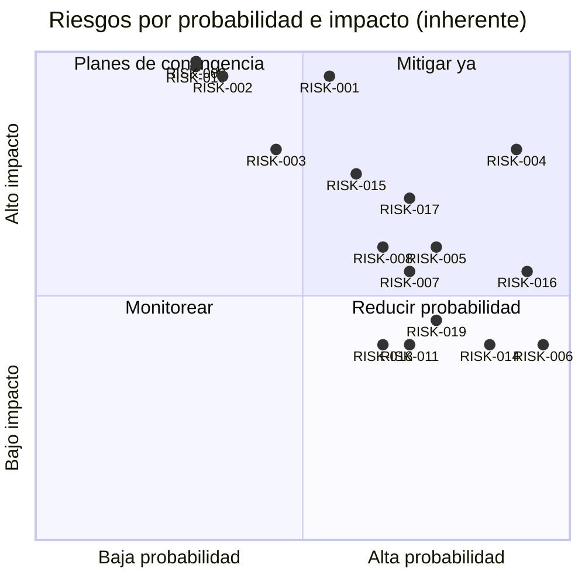

# 26 — Registro de riesgos

> **Estado:** Propuesto · **Fecha:** 2026-10-01 · **Owner:** Product Owner + Principal Architect
> **Relacionado:** [ARCHITECTURE.md](./ARCHITECTURE.md) · [02-non-functional-requirements.md](./02-non-functional-requirements.md) · [24-roadmap.md](./24-roadmap.md) · [25-product-backlog.md](./25-product-backlog.md) · [09-ledger-design.md](./09-ledger-design.md) · [27-ai-assistant-roadmap.md](./27-ai-assistant-roadmap.md) · [30-backup-and-disaster-recovery.md](./30-backup-and-disaster-recovery.md) · `docs/adr/`

---

## 1. Metodología

- **Probabilidad (P)** y **Impacto (I)** en escala 1–5:

  | Valor | Probabilidad | Impacto |
  |------:|--------------|---------|
  | 1 | Rara (< 10 %) | Insignificante: molestia menor |
  | 2 | Improbable (10–30 %) | Menor: retraso de días, defecto cosmético |
  | 3 | Posible (30–50 %) | Moderado: retraso de semanas, defecto funcional con workaround |
  | 4 | Probable (50–80 %) | Mayor: fase en riesgo, datos incorrectos detectables, costo relevante |
  | 5 | Casi segura (> 80 %) | Crítico: pérdida/corrupción de datos financieros, filtración, abandono del producto |

- **Score = P × I** (1–25). Nivel: **Crítico ≥ 15**, **Alto 10–14**, **Medio 5–9**, **Bajo ≤ 4**.
- **Categorías:** financial integrity, security, technical, operational, product, cost, vendor, schedule, knowledge.
- **Owner:** rol responsable (en Phase 0–9 todos los roles los ejerce el owner; se nombra el sombrero): `PO` (Product Owner), `ARCH` (Principal Architect), `DEV` (desarrollo), `OPS` (plataforma/operación), `SEC` (seguridad), `QA` (calidad).
- **Estado:** `Abierto`, `Mitigando`, `Monitoreando`, `Cerrado`, `Aceptado`.
- **Revisión:** al cierre de cada fase y ante cualquier trigger. Los riesgos con score ≥ 15 se revisan en cada planificación de slice.
- Los scores reflejan el **riesgo inherente antes de mitigación**; la columna "Residual" estima el score tras aplicar la mitigación.

## 2. Mapa de calor

## 3. Registro

| ID | Riesgo (descripción) | Categoría | P | I | Score | Nivel | Mitigación | Owner | Trigger / señal temprana | Estado | Residual |
|----|----------------------|-----------|--:|--:|------:|-------|------------|-------|--------------------------|--------|---------:|
| RISK-001 | **Errores de redondeo/precisión**: uso accidental de float, redondeo inconsistente o repartos que pierden/crean centavos (splits, cuotas, conversiones con escala 6/8/18). | financial integrity | 3 | 5 | 15 | Crítico | `Money` decimal.js obligatorio; lint rule + architecture test anti-`number`; NUMERIC(38,18); HALF_EVEN solo en materialización; largest remainder determinista; PBT fast-check (≥ 1 000 casos CI, 100 000 nightly); mutation testing en `Money`; API con montos string (ADR-0006, NFR-DATA-001..003, 010). SPIKE-03. | ARCH | Diferencia de 0,01 en reconciliación; test PBT intermitente; un `parseFloat` en code review; `number` en DTO. | Mitigando | 4 |
| RISK-002 | **Ledger desbalanceado o mutado**: entries con Σ ≠ 0 por moneda, postings editados o borrados, doble posting por reintento. | financial integrity | 2 | 5 | 10 | Alto | Validación en dominio + constraint trigger diferido; grants solo INSERT/SELECT; trigger anti-UPDATE/DELETE; idempotencia por origen; invariant checker diario y tras restore; alerta crítica (ADR-0004, NFR-DATA-004/005/008). | ARCH | Métrica `ledger_invariant_violations > 0`; saldo snapshot ≠ Σ postings; test de concurrencia fallando. | Mitigando | 3 |
| RISK-003 | **Corrupción del FX histórico**: recalcular conversiones o reportes pasados con tasas actuales; sobrescritura de tasas; provider que reescribe históricos. | financial integrity | 3 | 4 | 12 | Alto | Tasas inmutables con versionado `supersedes`; `ConversionDetail` inmutable con ID+versión de tasa de referencia; reportes con política de conversión explícita; providers nunca sobrescriben tasas manuales ni existentes (FR-FX-003/008/010, NFR-DATA-006). | ARCH | Cambio de totales de meses cerrados sin reapertura; diff en snapshot de cierre vs recálculo. | Mitigando | 4 |
| RISK-004 | **Scope creep / ancho de banda de un solo desarrollador**: el brief es enorme; el owner es PO, arquitecto, dev y ops con dedicación parcial; riesgo de nunca terminar Phase 1 o de abandono. | schedule | 5 | 4 | 20 | Crítico | MoSCoW estricto por fase; vertical slices de ≤ 1 semana; Phase 1 recortada (reconciliación por sesiones, bulk edit y custom fields a Phase 2); re-estimación al cierre de cada fase; "Won't for now" explícito; WIP = 1 slice; usar el producto a diario para priorizar por dolor real. | PO | Slice > 2× estimado; > 3 semanas sin merge a `main`; crecimiento de Must durante una fase; owner deja de registrar movimientos. | Abierto | 12 |
| RISK-005 | **Sobre-ingeniería para un solo usuario**: DDD/hexagonal/outbox/RLS/OTel/ML para 1 usuario pueden consumir el tiempo que necesita el producto. | product | 4 | 3 | 12 | Alto | Cada patrón justificado en ADR con su costo; plataforma mínima en Phase 0; observabilidad y cloud diferidos/opcionales; microservicios y K8s rechazados; revisar en cada exit si algún componente puede simplificarse; "simplest thing that preserves invariants". | ARCH | Más tiempo en plataforma que en features 2 slices seguidos; abstracciones con una sola implementación sin plan de segunda. | Abierto | 6 |
| RISK-006 | **Cambio de distribución/licencia de MinIO** — **MATERIALIZADO**: el repositorio community de MinIO fue archivado y no publica imágenes desde oct-2025; usar MinIO local implicaría una imagen sin parches de seguridad. | vendor | 5 | 2 | 10 | Alto | Puerto `ObjectStorage` (API S3) desacoplado; **no usar MinIO**: SPIKE-07 decide entre SeaweedFS y Garage (presigned URLs compatibles con AWS SDK v3); tests de contrato S3 ejecutables contra cualquier backend; imagen fijada por digest; licencias revisadas (NFR-COMP-003); ADR-0009 actualizado con la decisión. | OPS | (Ya ocurrido.) Señales residuales: el backend elegido deja de publicar releases > 6 meses o rompe compatibilidad S3 en presigned URLs. | Mitigando (materializado) | 3 |
| RISK-007 | **Sobrecosto cloud**: Fargate + RDS + NAT gateway + ALB + observabilidad gestionada pueden superar el presupuesto de un proyecto personal (estimación preliminar staging+prod: **ECS/Fargate ~120–195 USD/mes** vs **Cloud Run ~60–110 USD/mes**); costos LLM en Phase 10. | cost | 4 | 3 | 12 | Alto | SPIKE-09 con costo medido; perfil mínimo (sin NAT gateway si es posible, single-AZ, instancias pequeñas, scale-to-zero en staging); budgets y alertas de facturación; Cloud Run como plan B; despliegue cloud opcional hasta el Hito H; límite de gasto LLM por mes. | OPS | Factura mensual > 80 % del presupuesto; alerta de AWS Budgets; costo LLM por consulta en aumento. | Abierto | 4 |
| RISK-008 | **Complejidad de autenticación**: OIDC + PKCE + BFF + Keycloak + JWT + RLS + roles por workspace es fácil de configurar mal (cookies, CSRF, refresh, logout del IdP). | security | 4 | 3 | 12 | Alto | SPIKE-06 temprano; librerías OIDC maduras (no implementación propia); E2E de seguridad (tokens fuera del JS, expiración, logout); tests de aislamiento multi-workspace; Keycloak solo como IdP estándar (sustituible); revisión ASVS en el Hito H. | SEC | SPIKE-06 excede time-box; bugs de sesión recurrentes; refresh token loops; fallos de logout. | Abierto | 6 |
| RISK-009 | **Pérdida de datos / backups inválidos**: fallo de disco local, `stack:reset` accidental, migración destructiva, backup que no restaura. | operational | 2 | 5 | 10 | Alto | `backup:local` desde Phase 1 con manifest y checksums; restore probado nightly en CI y mensual por el owner; confirmación explícita en `stack:reset`; migraciones expand/contract con aprobación de destructivas; PITR + copias en cuenta separada/WORM en prod; export portable (doc 30, NFR-REL-*). | OPS | Último backup exitoso > 48 h; restore drill fallido; volumen sin espacio. | Mitigando | 3 |
| RISK-010 | **Privacidad de datos financieros**: filtración por logs, adjuntos, bucket público, LLM externo, telemetría o acceso cross-workspace. | security | 2 | 5 | 10 | Alto | RLS + RBAC; redacción de logs; buckets privados y presigned URLs cortas; claves de objeto sin PII; cifrado en tránsito/reposo; asistente opt-in con minimización; sin telemetría de contenido; threat model por fase; secret scanning (NFR-SEC-*, NFR-COMP-001). | SEC | Hallazgo de PII en logs; objeto accesible sin firma; test de aislamiento fallido; alerta de secret scanning. | Mitigando | 4 |
| RISK-011 | **Evolución rápida de la herramienta OpenSpec** (CLI v1.x con cambios frecuentes de comandos, formato o validación) que rompa el flujo spec-driven o CI. | vendor | 4 | 2 | 8 | Medio | Versión del CLI fijada en `package.json`/CI; SPIKE-01; upgrades deliberados con changelog revisado; specs en Markdown plano (portables aunque la herramienta cambie); validación propia mínima de IDs en el script de trazabilidad (ADR-0024). | QA | Fallo de `openspec validate` tras upgrade; deprecaciones en release notes; comandos renombrados. | Mitigando | 4 |
| RISK-012 | **Elección de ORM/acceso a datos**: Prisma (elegido inicialmente por muchos) no encaja con RLS por transacción/constraint triggers/NUMERIC; Kysely requiere más código manual; cambiar después es caro. | technical | 3 | 3 | 9 | Medio | SPIKE-02 con criterios objetivos (RLS `SET LOCAL`, NUMERIC sin pérdida, constraint triggers, agregados, DX); repositorios detrás de puertos (el dominio no conoce Kysely); migraciones SQL-first independientes del ORM (ADR-0007). | ARCH | Workarounds repetidos en repositorios; pérdida de precisión en tests; boilerplate excesivo. | Mitigando | 4 |
| RISK-013 | **Complejidad de Next.js** (App Router, Server Components, caching, BFF, cambios de versión mayor) que ralentiza el frontend o introduce fugas de datos por caching. | technical | 3 | 3 | 9 | Medio | Uso acotado: BFF + páginas cliente con TanStack Query para datos financieros; caching de Next desactivado para datos de usuario; versión fijada; upgrades mayores tras evaluación; ADR-0019 con criterios de salida (p.ej. Vite SPA + BFF ligero). | DEV | Bugs de caching/datos de otra sesión; upgrades que rompen build; tiempo de build creciente. | Abierto | 4 |
| RISK-014 | **ML con datos insuficientes**: un único usuario genera pocas series y poca historia; modelos que no superan baseline o sobreajustan. | technical | 4 | 2 | 8 | Medio | Phase 8 al final y opcional; baseline obligatorio; publicación solo si supera baseline en backtesting; `insufficientData` explícito; conocidos (compromisos) separados de predichos; seed `large` sintético solo para pruebas, no para validar calidad (FR-FORECAST-005/007). | ARCH | < 6 meses cerrados al iniciar Phase 8; MASE ≥ 1 vs baseline. | Aceptado | 4 |
| RISK-015 | **Alucinación del LLM / mal uso de IA**: cifras inventadas, prompt injection vía descripciones de transacciones, consejos de inversión, filtración a proveedor. | product | 3 | 4 | 12 | Alto | AI Feature Gate; solo lectura; tools allowlisted sobre casos de uso; toda cifra citada desde tool; "no sé" obligatorio; datos de usuario tratados como datos (no instrucciones); golden questions + suite adversarial; disclaimers; opt-in; minimización (FR-ASSISTANT-*, NFR-SEC-019, doc 27). | SEC | Respuesta con cifra no presente en tool results; tool call fuera de allowlist en evaluación; quejas del owner por respuestas erróneas. | Abierto | 6 |
| RISK-016 | **Indisponibilidad de datos bancarios regionales**: bancos bolivianos sin API, extractos PDF/XLS heterogéneos y cambiantes, CSV con formatos de fecha/decimal locales. | vendor | 5 | 3 | 15 | Crítico | Producto útil sin bancos (PP-04); captura manual rápida; perfiles de mapeo CSV configurables; parsers PDF por institución como Could; BankingProvider port listo para cuando existan APIs; reglas para clasificar imports; no prometer sync automático. | PO | Owner no logra importar extractos de su banco; cambios de formato frecuentes; tiempo de captura > SM-03. | Aceptado | 9 |
| RISK-017 | **Complejidad multi-moneda**: conversión a moneda base en reportes, presupuestos en base con gastos en USD/USDT, tasas faltantes, metas en otra moneda, tarjetas bimoneda; errores sutiles de UX y de cálculo. | financial integrity | 4 | 4 | 16 | Crítico | Ledger por moneda desde Phase 1 (A1); nunca operar entre monedas sin tasa explícita; política de conversión visible (histórica vs a fecha de corte); `FX_RATE_NOT_FOUND` en lugar de valores por defecto; totales marcados "parciales" cuando falta tasa; seeds con 6 monedas; TCs específicos multi-moneda en cada contexto. | ARCH | Totales que cambian al cambiar tasa en meses cerrados; reportes con suma de monedas distintas; confusión del owner sobre "en qué moneda está esto". | Mitigando | 8 |
| RISK-018 | **Lentitud de la suite de tests**: Testcontainers, E2E multi-navegador, PBT y mutation testing hacen el feedback lento y desincentivan los tests. | technical | 4 | 2 | 8 | Medio | Pirámide: dominio puro rápido; contenedores reutilizados por worker; paralelismo Vitest; PBT y mutation completos solo nightly; E2E smoke en PR y completo nightly; presupuestos de tiempo (NFR-MAINT-007) con alerta; Turborepo cache por paquete afectado. | QA | PR pipeline > 15 min; unit > 2 min; desarrolladores saltan tests localmente. | Abierto | 4 |
| RISK-019 | **Fricción del entorno Windows**: Docker Desktop + WSL2, rendimiento de bind mounts sobre NTFS, CRLF, rutas con espacios (`C:\Users\Nombre Apellido`), scripts solo-bash, watchers de hot reload. | operational | 4 | 2 | 8 | Medio | SPIKE-08; repo clonado en FS de WSL2 o en ruta sin espacios recomendada; scripts Node/tsx cross-platform; `.gitattributes` LF; CI con smoke en Windows runner; documentación de setup Windows-first (ADR-0012, NFR-PORT-001/004/010). | OPS | `stack:up` > 90 s; hot reload > 3 s; fallos por rutas con espacios; scripts que solo funcionan en Linux. | Mitigando | 4 |
| RISK-020 | **Errores de fechas, zonas horarias y bordes de periodo**: transacciones cerca de medianoche asignadas al mes equivocado; RRULE y fin de mes; DST de otras zonas. | financial integrity | 3 | 3 | 9 | Medio | Fecha de negocio `date` separada de instantes UTC; zona del workspace explícita; tests con TZ forzada (`America/La_Paz`, UTC, zonas con DST); librería de fechas única; PBT en recurrencia (NFR-USAB-004). | DEV | Discrepancias de totales mensuales vs extracto en días 1/último; ocurrencias duplicadas u omitidas. | Abierto | 4 |
| RISK-021 | **Fuga entre workspaces por RLS mal configurada**: `SET` a nivel de sesión en pool, rol con `BYPASSRLS`, tabla nueva sin política. | security | 2 | 5 | 10 | Alto | `SET LOCAL` en UoW; rol app sin BYPASSRLS ni ownership; test de catálogo que falla si una tabla con `workspace_id` no tiene política RLS; suite de aislamiento en CI (ADR-0023, NFR-SEC-003/004). | SEC | Test de catálogo RLS fallando; consulta sin UoW devolviendo filas. | Mitigando | 3 |
| RISK-022 | **Inconsistencia eventual visible**: read models atrasados o eventos procesados dos veces que muestran totales erróneos en el dashboard; DLQ silenciosa. | technical | 3 | 3 | 9 | Medio | Outbox + inbox idempotente; `asOf` visible; métricas de lag y DLQ con alerta; rebuild de read models; operaciones críticas (saldos) leídas del ledger, no de proyecciones (ADR-0008, NFR-PERF-008). | ARCH | `outbox_lag_seconds` p95 > 60 s; DLQ > 0; dashboard ≠ ledger en test de reconciliación. | Abierto | 4 |
| RISK-023 | **Fuentes de tasas FX no confiables o sin ToS adecuado** (tasa paralela/P2P en Bolivia volátil, APIs públicas que cambian o prohíben uso automatizado). | vendor | 4 | 2 | 8 | Medio | Tasas manuales siempre posibles; múltiples providers con fallback; revisión de ToS por adapter (NFR-COMP-007); detección de anomalías y staleness; tasas por tipo (`official`, `parallel`, `p2p`). | PO | Provider sin datos > 24 h; variación anómala; cambio de ToS. | Abierto | 4 |
| RISK-024 | **Vulnerabilidades en la cadena de suministro** (paquetes npm comprometidos, imágenes base con CVEs). | security | 3 | 4 | 12 | Alto | Lockfile, Renovate, `pnpm audit`/OSV, Trivy, SBOM, pin por digest, mínimo de dependencias en dominio (shared-kernel casi sin deps), revisión de nuevas dependencias (NFR-SEC-013). | SEC | Alerta Critical/High; paquete con cambio de maintainer sospechoso. | Mitigando | 6 |
| RISK-025 | **Baja adopción por el propio owner**: la captura manual resulta tediosa y el owner vuelve a la hoja de cálculo; el producto no se usa y pierde sentido. | product | 3 | 5 | 15 | Crítico | Optimizar captura (defaults, payee→categoría, duplicar, móvil responsive); Phase 1 enfocada en el uso diario; métricas SM-01/SM-03; CSV básico adelantable; dogfooding obligatorio en exit criteria; PWA evaluable. | PO | Días sin registros; backlog de movimientos sin cargar; owner usa hoja de cálculo en paralelo. | Abierto | 8 |
| RISK-026 | **Concentración de conocimiento (bus factor = 1)**: decisiones y operación dependen de una sola persona; recuperación difícil tras pausas largas. | knowledge | 4 | 3 | 12 | Alto | ADRs, ARCHITECTURE canónico, OpenSpec como fuente de verdad de comportamiento, runbooks (backup, restore, deploy), README por contexto, onboarding ≤ 15 min (NFR-PORT-003), matriz de trazabilidad. | ARCH | Tiempo de "re-entrada" tras una pausa > 1 día; decisiones sin ADR; runbooks desactualizados. | Mitigando | 6 |
| RISK-027 | **Deriva entre specs, docs y código**: specs OpenSpec o docs que dejan de reflejar el comportamiento real; TCs huérfanos. | knowledge | 4 | 3 | 12 | Alto | Spec-first obligatorio en PR (NFR-MAINT-001); `openspec validate --strict` en CI; matriz de trazabilidad que falla con TC-IDs inexistentes; archivado de changes como parte del DoD; revisión de docs en cada exit. | QA | PRs con cambio de comportamiento sin change-id; Requirements sin TC; docs con fecha antigua. | Abierto | 6 |
| RISK-028 | **Migraciones de esquema con pérdida o bloqueo de datos**: migración destructiva o lenta en tablas grandes (`ledger.posting`). | operational | 2 | 4 | 8 | Medio | expand → migrate → contract; aprobación manual para destructivas; prueba de migración contra seed `large` y copia anonimizada; backup previo automático en el pipeline (NFR-DATA-013, NFR-REL-013). | OPS | Migración > 60 s en seed `large`; locks largos en staging. | Abierto | 3 |
| RISK-029 | **Degradación de rendimiento con el crecimiento de datos** (años de historia, cálculos de saldo as-of y reportes sobre 100k+ postings). | technical | 3 | 3 | 9 | Medio | Índices por `(workspace_id, account_id, entry_date)`; snapshots de saldo derivados; read models para reportes; benchmarks nightly con seed `large` y presupuestos NFR-PERF; particionado evaluable más adelante. | DEV | Benchmarks nightly en rojo; p95 en aumento sostenido > 20 %. | Monitoreando | 4 |
| RISK-030 | **Incertidumbre regulatoria sobre cripto y divisas en Bolivia** (restricciones a operaciones con cripto o con dólares que cambien qué y cómo se registra). | product | 2 | 2 | 4 | Bajo | PFOS solo registra hechos del usuario, no intermedia; monedas configurables; no integrar exchanges sin revisar ToS; nada específico de regulación hardcodeado. | PO | Cambios normativos publicados que afecten registro o reporte. | Monitoreando | 2 |
| RISK-031 | **Keycloak como carga operativa** (actualizaciones, base de datos propia, memoria en local; costo de operarlo en cloud). | operational | 3 | 2 | 6 | Medio | Keycloak solo en local/dev vía realm import; en cloud evaluar IdP gestionado (Cognito u otro) por ADR-0010/0013; integración solo vía OIDC estándar para poder sustituirlo. | OPS | Consumo de RAM local > 1 GB; upgrades que rompen el realm. | Abierto | 3 |

## 4. Top riesgos (score inherente ≥ 15)

| Rank | ID | Riesgo | Score | Acción inmediata (Phase 0) |
|-----:|----|--------|------:|----------------------------|
| 1 | RISK-004 | Scope creep / ancho de banda | 20 | Aprobar MoSCoW de Phase 1 en DESIGN GATE; fijar WIP=1 slice; definir dedicación semanal real. |
| 2 | RISK-017 | Complejidad multi-moneda | 16 | TCs multi-moneda en catálogo Phase 1; política de conversión en specs de reporting. |
| 3 | RISK-001 | Redondeo/precisión | 15 | SPIKE-03 antes de cualquier código de dominio. |
| 4 | RISK-016 | Datos bancarios regionales | 15 | Validar con extractos reales del owner qué formatos existen (input para Phase 3/6). |
| 5 | RISK-025 | Baja adopción por el owner | 15 | Prototipo de baja fidelidad del flujo de captura en doc 28; medir SM-03 desde Phase 1. |

**Riesgos materializados:** RISK-006 (MinIO community archivado) — respuesta: SPIKE-07 restringido a SeaweedFS vs Garage.

## 5. Mapeo riesgo ↔ controles

| Riesgo | ADRs | NFRs | Spikes | Backlog |
|--------|------|------|--------|---------|
| RISK-001 | ADR-0006 · INV-001, INV-020 | NFR-DATA-001..003, 010 | SPIKE-03 | TS-016, US-029 |
| RISK-002 | ADR-0004 · INV-004, INV-027, INV-029 | NFR-DATA-004, 005, 008 | SPIKE-02 | US-013, TS-019, TS-020, TS-022 |
| RISK-003 | ADR-0004, ADR-0006 · INV-011 | NFR-DATA-006 | — | US-037, US-039 |
| RISK-004 | — | — | — | Roadmap §2 (A7), Won't for now |
| RISK-006 | ADR-0009 | NFR-COMP-003 | SPIKE-07 | TS-011 |
| RISK-007 | ADR-0013 | NFR-OBS-008 | SPIKE-09 | EPIC-24 |
| RISK-008 | ADR-0010, ADR-0019 | NFR-SEC-001, 002, 017 | SPIKE-06 | US-001, US-002, TS-012 |
| RISK-009 | ADR-0005 | NFR-REL-001..005 | — | US-047, TS-029, TS-104, TS-105 |
| RISK-011 | ADR-0024 | NFR-MAINT-001 | SPIKE-01 | TS-003 |
| RISK-012 | ADR-0007 | NFR-DATA-010 | SPIKE-02 | TS-014 |
| RISK-015 | ADR-0021 | NFR-SEC-019, NFR-COMP-004 | — | EPIC-23 |
| RISK-019 | ADR-0012 | NFR-PORT-001..004, 010 | SPIKE-08 | TS-011, TS-029 |
| RISK-021 | ADR-0023 | NFR-SEC-003, 004 | SPIKE-02 | US-005, TS-018 |
| RISK-022 | ADR-0008 | NFR-PERF-008, NFR-REL-007, 008 | SPIKE-05 | TS-017, TS-024 |

## Preguntas abiertas

1. ¿Cuál es el presupuesto mensual tope para cloud y para LLM? Define el umbral de trigger de RISK-007. Con la estimación preliminar, Cloud Run (~60–110 USD/mes) cuesta aprox. la mitad que ECS/Fargate (~120–195 USD/mes): ¿se mantiene la recomendación de ADR-0013?
2. ¿Qué dedicación semanal real tendrá el owner? Recalibra P de RISK-004 y el cronograma de [24-roadmap.md](./24-roadmap.md).
3. ¿Qué bancos usa el owner y qué formatos de extracto ofrecen hoy? (RISK-016)
4. ¿Se acepta el riesgo residual de RISK-014 (forecast poco útil) o se posterga Phase 8 indefinidamente si los datos no alcanzan?
5. ¿Se requiere un revisor externo (segundo par de ojos) para cambios del ledger y de seguridad, mitigando RISK-026?
6. ¿La ruta del repositorio en Windows (`D:\projects\personal-finances`) se mantiene o se recomienda clonar dentro del FS de WSL2 tras SPIKE-08?
