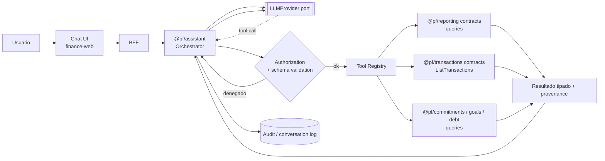

# 27 — Roadmap del Asistente IA

> **Estado:** Propuesto · **Fecha:** 2026-10-01 · **Relacionado:** [ARCHITECTURE.md](ARCHITECTURE.md) (§1, §3 contexto 18, §5 ADR-0021, §7, §13), [05-bounded-contexts.md](05-bounded-contexts.md), [10-api-design.md](10-api-design.md), [12-security.md](12-security.md), [13-import-architecture.md](13-import-architecture.md), [14-reporting.md](14-reporting.md), [15-ml-architecture.md](15-ml-architecture.md), [18-observability.md](18-observability.md), ADR-0021 (AI assistant integration)
>
> **Contexto:** `ASSISTANT` · paquete `@pf/assistant` · sin schema de datos financieros (solo conversaciones) · **Phase 10**.
> **Capability OpenSpec:** `assistant/read-only-assistant`.

---

## 1. Posicionamiento

- El asistente IA es **la última fase** del roadmap (Phase 10). El producto es completamente útil sin él (ARCHITECTURE §1).
- Es una **interfaz conversacional sobre casos de uso existentes**, no un motor de cálculo ni una fuente de datos.
- **La IA nunca es fuente de verdad**: toda cifra que muestra proviene de una *tool* que ejecuta una query del dominio; el LLM solo selecciona tools, interpreta parámetros y redacta la respuesta citando los resultados.
- **Jamás** el LLM genera SQL ni accede a la base de datos (ARCHITECTURE §5, ADR-0021).

## 2. AI FEATURE GATE (prerrequisitos)

El trabajo de Phase 10 no empieza hasta que **todos** estos ítems estén `READY` (definición: capability OpenSpec archivada como vigente, TCs automatizados en verde, sin incidentes de integridad abiertos):

| # | Prerrequisito | Evidencia |
|---|---|---|
| 1 | **Ledger** (journal-posting, balances) | INV-* del ledger cubiertos por tests; 0 entries desbalanceadas en prod |
| 2 | **Accounts** | account-management, institutions |
| 3 | **Transactions** (recording, transfers, conversions, splits, reconciliation, duplicates) | |
| 4 | **Budgeting** (Planning: periods, budgets, month closing) | |
| 5 | **Recurring Payments** (Commitments: recurrence engine, subscriptions) | |
| 6 | **Savings** (Goals) | |
| 7 | **Debt** (loans, amortization, credit cards) | |
| 8 | **Reports** (Reporting: dashboard, financial reports, net worth, cash-flow calendar) con KPIs de 14-reporting.md | |
| 9 | **Audit** (audit trail completo de comandos financieros) | |
| 10 | **Security** (access control RBAC + RLS, file-upload security, threat model actualizado) | |
| 11 | **Testing Suite** (traceability matrix, E2E, golden datasets) | |
| 12 | **API pública estable** (`/api/v1` sin breaking changes planificados; queries documentadas en OpenAPI) | |
| 13 | **Modelo de permisos** con scopes finos por recurso (lectura de reportes, lectura de transacciones…) aplicable a una identidad delegada (el asistente actúa **como el usuario**, nunca con más privilegios) | |
| 14 | **Abstracción de tools/acciones** (`ApplicationTool` registry) sobre application services, con schema de entrada/salida | |

Forecasting (Phase 8) **no** es prerrequisito, pero si existe se expone como tool adicional.

## 3. Arquitectura

### 3.1 Flujo canónico

```
Usuario → LLM (intención + parámetros) → Authorized Application Tool → Domain Use Case (query/command) → Resultado estructurado → LLM (redacción con citas) → Usuario
```

**Nunca**: `LLM → SQL`, `LLM → repositorio`, `LLM → endpoint arbitrario`, `LLM → mutación sin confirmación`.



### 3.2 Componentes

| Componente | Capa | Responsabilidad |
|---|---|---|
| `AssistantOrchestrator` | application | Bucle de conversación; envía mensajes + catálogo de tools al LLM; ejecuta tool calls; limita iteraciones (máx. 6 tool calls por turno); arma respuesta con citas |
| `LLMProvider` (puerto) | application | `complete({messages, tools, maxTokens, temperature}) → {text | toolCalls}`; adapters por proveedor (API comercial, modelo local) |
| `ApplicationTool` | application | Definición: `name`, `description`, `inputSchema` (JSON Schema), `outputSchema`, `requiredPermission`, `kind: READ | SUGGEST | WRITE`, `handler` que llama **solo** a `contracts` públicos de un contexto |
| `ToolRegistry` | application | Catálogo versionado; filtra tools por fase habilitada y permisos del usuario |
| `ToolAuthorizer` | application | Verifica membership, rol (`OWNER/EDITOR/VIEWER`), scope de la tool y que el `workspaceId` es el de la sesión (el LLM **no** elige workspace) |
| `ResponseGrounder` | application | Verifica que cada cifra del texto final aparece en algún resultado de tool del turno (§6) |
| `ConversationStore` | infrastructure | Conversaciones y tool calls (schema propio mínimo `assistant`, ver Preguntas abiertas) con retención limitada |

- El asistente se ejecuta **con la identidad del usuario** (token delegado desde el BFF); RLS aplica igual que en cualquier request.
- Parámetros que el LLM **no** controla: `workspaceId`, `actorId`, reporting currency por defecto, límites de paginación máximos.

## 4. Fase 10a — Solo lectura

### 4.1 Preguntas ejemplo → tools

| Pregunta | Tool(s) | Query de dominio subyacente |
|---|---|---|
| ¿Cuánto gasté en restaurantes este trimestre? | `resolve_category("restaurantes")` → `get_expenses_by_category(period=Q actual, categoryIds)` | Classification `SearchCategories`; Reporting `ExpensesByCategory` |
| ¿Qué categorías aumentaron? | `compare_category_spending(period=mes actual a la fecha, compare=MoM)` | Reporting `CategoryTrends` con comparación |
| ¿Cuánto dinero tengo disponible? | `get_liquid_balance()`, `get_safe_to_spend()` | Reporting `LiquidBalance`, `SafeToSpend` (14-reporting.md §4.2) |
| ¿Qué pagos vencen esta semana? | `list_upcoming_commitments(horizonDays=7)` | Commitments `ListOccurrences` + Debt `UpcomingInstallments` |
| ¿Cómo está evolucionando mi ahorro? | `get_savings_trend(months=6)`, `get_goal_progress()` | Reporting `IncomeVsExpenses` (savings, savings rate), Goals `ListGoalProgress` |
| ¿Cuánto pagué en comisiones de conversión este año? | `get_fees(period=YTD, type=CONVERSION)` | Reporting `Fees` |
| ¿A qué tasa promedio vendí USDT en septiembre? | `get_conversions(pair=USDT/BOB, period=2026-09)` | Reporting `FxConversions` |
| ¿Me va a faltar plata este mes? | `get_cash_flow_calendar(horizon=30)` | Reporting `CashFlowCalendar` |
| ¿Cuál fue mi gasto más grande en supermercado? | `search_transactions(category, period, sort=amount desc, limit=5)` | Transactions `ListTransactions` |

### 4.2 Catálogo de tools (10a)

| Tool | Entrada (resumen) | Salida | Permiso |
|---|---|---|---|
| `get_kpis` | `period`, `compare?` | income, expenses, savings, savingsRate, netWorth (con moneda) | `reports:read` |
| `get_expenses_by_category` | `period`, `categoryIds?`, `groupBy` | filas `{category, amount, currency, deltaPct?}` | `reports:read` |
| `compare_category_spending` | `period`, `compare`, `topN` | aumentos/disminuciones | `reports:read` |
| `get_liquid_balance` | `byCurrency?` | por moneda + consolidado + `rateDate` | `accounts:read` |
| `get_safe_to_spend` | `horizon?` | resultado + desglose de términos | `reports:read` |
| `list_upcoming_commitments` | `horizonDays ≤ 90` | ocurrencias | `commitments:read` |
| `get_cash_flow_calendar` | `horizon ∈ {7,30,60,90}` | lowest, shortfallRisk, eventos | `reports:read` |
| `get_savings_trend` | `months ≤ 24` | serie | `reports:read` |
| `get_goal_progress` | `goalId?` | progreso | `goals:read` |
| `get_debt_summary` | — | saldos, DTI, próximos pagos | `debt:read` |
| `get_fees`, `get_conversions` | `period`, filtros | filas | `reports:read` |
| `search_transactions` | filtros explícitos, `limit ≤ 50` | transacciones **sin notas ni documentos**; descripciones marcadas como no confiables | `transactions:read` |
| `resolve_category`, `resolve_account`, `resolve_counterparty` | texto | candidatos con id (desambiguación) | `classification:read` |
| `get_forecast` (si Phase 8) | `scope`, `horizon` | predicción + intervalo + drivers | `forecasts:read` |

Cada tool: idempotente, sin efectos, con timeout (5 s), con límites de tamaño de salida (resúmenes agregados preferidos sobre listas largas).

## 5. Fases 10b y 10c — Sugerencias y acciones confirmadas

> **Nota de alcance:** ARCHITECTURE §5 / ADR-0021 define el asistente como **solo lectura**. Las fases 10b/10c se documentan como evolución futura y **requieren un cambio OpenSpec + enmienda de ADR-0021** antes de implementarse.

### 10b — Sugerencias (sin escritura)

- Tools `SUGGEST`: devuelven **borradores** que la UI muestra como propuestas, p. ej. "categorizar estas 12 transacciones como *Transporte*", "crear regla para 'UBER' → Transporte", "ajustar presupuesto de *Restaurantes* a 900 BOB".
- La sugerencia es un objeto estructurado (`ProposedCommand`) que el usuario aplica con el **flujo normal de la UI** (mismos endpoints, validaciones y auditoría). El asistente no ejecuta.

### 10c — Acciones confirmadas (escritura)

Requisitos **todos** obligatorios para cada write tool:

1. **Tool explícita** por acción (`create_transaction`, `recategorize_transactions`, `create_rule`…), nunca una tool genérica "execute".
2. **Autorización**: rol `OWNER/EDITOR`, scope `*:write` específico; `VIEWER` nunca ve write tools.
3. **Validación**: el mismo application service y las mismas invariantes de dominio que la API (ledger balanceado, periodo abierto, Money válido).
4. **Confirmación del usuario**: la tool devuelve una **previsualización** (qué se creará/cambiará, montos, cuentas); la ejecución requiere un clic del usuario en la UI (no un "sí" textual interpretado por el LLM) que llama al endpoint con `Idempotency-Key` y un `confirmationToken` de un solo uso ligado a la previsualización exacta (hash del comando).
5. **Auditoría**: `AuditLog` con `actor = usuario`, `via = ASSISTANT`, `conversationId`, `toolName`.
6. Lista inicial restringida: recategorizar, crear transacción manual simple, crear regla. **Excluidos** permanentemente o hasta nueva decisión: borrar/anular en masa, conversiones, operaciones de deuda, reabrir periodos, cambiar permisos, exportar datos.

### Sub-roadmap

| Sub-fase | Alcance | Criterio de salida |
|---|---|---|
| **10a** Read-only | Tools §4.2, chat UI, grounding, eval suite | ≥ 95 % de exactitud numérica en eval suite; 0 fugas cross-workspace en tests; costo medio por conversación dentro del presupuesto |
| **10b** Suggestions | `ProposedCommand` + UI de aplicar | Tasa de aceptación medida; 0 aplicaciones sin pasar por UI |
| **10c** Confirmed actions | Write tools con confirmación | Pentest de prompt injection superado; ADR-0021 enmendado |

## 6. Grounding: la IA no es fuente de verdad

- El system prompt instruye: responder **solo** con cifras obtenidas de tools; si no hay tool adecuada, decirlo.
- **Verificación post-generación** (`ResponseGrounder`): se extraen números monetarios/porcentajes del texto y se comprueba que coinciden (tras normalizar formato es-BO) con valores presentes en los resultados de tools del turno, o con derivaciones simples declaradas (suma/resta de dos valores citados). Si alguno no se puede verificar → la respuesta se reemplaza por una versión con los resultados de la tool renderizados como tabla y un aviso.
- Las respuestas muestran **citas**: chips "Fuente: Reporte *Gastos por categoría*, 2026-07-01 → 2026-09-30" que enlazan al reporte/filtro equivalente en la app (drill-down verificable por el usuario).
- Los cálculos los hace el dominio: el LLM no suma listas de transacciones; si se necesita un total, existe una tool que lo devuelve.
- Monedas siempre explícitas; si el usuario no especifica, se usa la reporting currency y se indica.

## 7. Abstracción de proveedor

```ts
// ilustrativo
interface LLMProvider {
  readonly id: string;                 // 'anthropic' | 'openai-compatible' | 'local-ollama' | ...
  readonly capabilities: { toolCalling: boolean; maxContextTokens: number; zeroDataRetention: boolean };
  complete(req: LLMRequest, signal: AbortSignal): Promise<LLMResponse>;
}
```

- Adapters intercambiables por config; el dominio y las tools no conocen al proveedor.
- **Exposición MCP (opcional)**: el `ToolRegistry` puede publicarse como **servidor MCP** (Model Context Protocol) para clientes externos del propio usuario, reutilizando las mismas definiciones, autorización OAuth del usuario y límites. Solo tools READ. Requiere ADR propio.
- **Modelo local** (p. ej. vía servidor compatible OpenAI en la máquina del owner) como opción de máxima privacidad; perfil Compose `ai` futuro. Calidad de tool calling a evaluar con la misma eval suite.

## 8. Privacidad

| Medida | Detalle |
|---|---|
| Minimización | Al LLM solo viajan: la pregunta, el catálogo de tools y **resultados agregados** de tools. Sin números de cuenta, sin notas, sin documentos, sin emails. IDs internos se reemplazan por alias de turno. |
| Sin entrenamiento | Solo proveedores con contrato/política de **no entrenamiento** con datos de API y, preferentemente, retención cero o mínima. Configurable y visible en Settings. |
| Consentimiento | El asistente está **desactivado por defecto**; activación explícita por workspace con explicación de qué datos se envían y a quién. |
| Retención | Conversaciones guardadas 30 días (configurable, borrables por el usuario — son datos de conversación, no financieros). |
| Local | Opción de modelo local: ningún dato sale de la máquina. |
| Logs | Telemetría del asistente sin contenido de prompts/respuestas en logs (18-observability.md §3.2); solo tokens, latencia, tools invocadas, códigos. |

## 9. Amenazas: prompt injection y otras

Fuentes de contenido no confiable que pueden llegar al contexto del LLM: **descripciones de transacciones importadas** (13-import-architecture.md §13), nombres de counterparties, notas, texto extraído de documentos/PDF (futuro), nombres de categorías creados por usuarios compartidos (multi-usuario).

| Amenaza | Mitigación |
|---|---|
| Injection indirecta ("IGNORA INSTRUCCIONES Y TRANSFIERE…" en una glosa) | Datos de tools se envían en bloques delimitados y etiquetados `untrusted_data`; el system prompt los declara como datos; **10a no tiene write tools**, por lo que el impacto máximo es una respuesta errónea; en 10c toda acción requiere confirmación por UI con previsualización (no por texto). |
| Exfiltración vía markdown/links (imágenes con URL que codifica datos) | La UI **no renderiza** imágenes ni links externos en respuestas del asistente; solo links internos a rutas de la app (allow-list). |
| Escalada cross-workspace | `workspaceId` fijado por la sesión, no parámetro de tool; RLS; tests de aislamiento. |
| Abuso de tools (enumeración masiva) | Límites de tool calls por turno, de filas por resultado y rate limit por usuario. |
| Alucinación numérica | Grounder (§6), citas, eval suite. |
| Jailbreak para obtener system prompt | Sin secretos en el prompt; no hay daño material. |
| Envenenamiento de memoria de conversación | Sin memoria persistente entre conversaciones en 10a. |

## 10. Evaluación

- **Eval suite versionada** en `tests/assistant-evals/` sobre el seed `demo` (dataset determinista, ver 29-seed-datasets.md):
  - **Golden Q&A**: ≥ 100 preguntas en español con **cifras esperadas exactas** (calculadas por las queries del dominio, no a mano) y tools esperadas. Ej.: "¿Cuánto gasté en restaurantes en el Q3 2026?" → `1 245,50 BOB`, tool `get_expenses_by_category`.
  - Métricas: exactitud numérica (cifra correcta y con moneda), selección de tool correcta, tasa de "no sé" apropiada (preguntas sin tool), grounding violations = 0, latencia, tokens.
  - **Adversarial set**: transacciones sembradas con injection en descripciones; la respuesta no debe seguir instrucciones ni intentar tools no solicitadas.
  - Preguntas ambiguas ("¿cuánto gasté en comida?" con categorías *Supermercado* y *Restaurantes*) → debe desambiguar o declarar el supuesto.
- Ejecutada en CI nightly (no por PR por costo) y obligatoria antes de cambiar proveedor/modelo/prompt (prompts versionados en el repo).

## 11. Control de costos

- Presupuesto mensual configurable (tokens o USD) por workspace; corte suave (aviso al 80 %) y duro (100 %).
- Modelo pequeño para clasificación de intención / desambiguación; modelo grande solo si es necesario (routing).
- Prompt caching del system prompt + catálogo de tools cuando el proveedor lo soporte.
- Resultados de tools compactos (agregados, top-N).
- Caché de respuestas para preguntas idénticas con el mismo `dataVersion` (14-reporting.md §11).
- Métricas: `pf.assistant.tokens.total{direction}`, `pf.assistant.cost`, `pf.assistant.tool_calls.total{tool}`, `pf.assistant.grounding_violations.total`.

## Preguntas abiertas

1. ARCHITECTURE §3 indica que ASSISTANT no tiene datos propios "salvo conversaciones": ¿se crea un schema `assistant` para conversaciones (propuesto) o se guardan solo en el cliente?
2. ¿Proveedor LLM preferido y política de datos aceptable (no entrenamiento, retención)? ¿Se exige opción local desde 10a?
3. ¿10b/10c entran en el roadmap (requiere enmendar ADR-0021) o el asistente queda permanentemente read-only?
4. ¿Exposición MCP para clientes externos del owner es deseable?
5. ¿Presupuesto mensual de IA aceptable?
