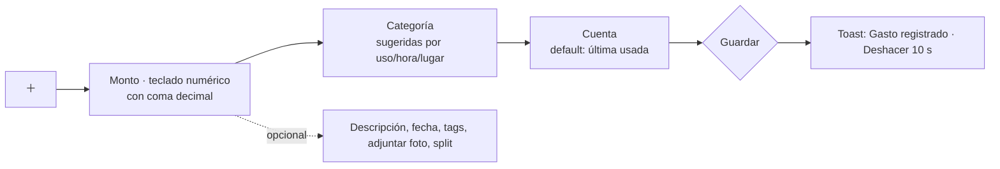

# 28 — UI/UX & Design System

> **Estado:** Propuesto · **Fecha:** 2026-10-01 · **Relacionado:** [ARCHITECTURE.md](ARCHITECTURE.md) (§1, §4, §5 ADR-0019, §8, §12), [01-functional-requirements.md](01-functional-requirements.md), [13-import-architecture.md](13-import-architecture.md), [14-reporting.md](14-reporting.md), [15-ml-architecture.md](15-ml-architecture.md), [27-ai-assistant-roadmap.md](27-ai-assistant-roadmap.md), ADR-0019 (Frontend: Next.js + BFF)
>
> **Stack UI:** Next.js (App Router) + TypeScript + Tailwind + shadcn/ui + TanStack Query + ECharts. Idioma: **español** primero (`es-BO`); i18n preparado para inglés (`en`) y portugués (`pt-BR`). NFR: `NFR-USAB-*`.

---

## 1. Principios de experiencia

1. **Registrar en segundos**: el quick add es la acción más frecuente; ≤ 3 interacciones para un gasto típico en móvil.
2. **El ledger es invisible**: el usuario ve *gasto, ingreso, transferencia, conversión*; nunca débitos/créditos ni cuentas de sistema (`EQUITY:FX_TRADING`…). Excepción: vista "Detalle contable" plegada para usuarios avanzados.
3. **Números honestos**: siempre con moneda, signo y fuente; los consolidados indican tasa y fecha; los pronósticos son rangos.
4. **Nunca solo color**: estado financiero = icono + signo + etiqueta + color (WCAG 1.4.1).
5. **Revisión antes de efectos masivos**: imports, bulk edit, cierres de mes y acciones del asistente pasan por preview y confirmación.
6. **Errores accionables**: mensajes de dominio (`PERIOD_CLOSED`) traducidos a texto y acción ("El periodo de agosto está cerrado. ¿Registrar en septiembre o reabrir agosto?").

## 2. Navegación y arquitectura de información

### 2.1 Navegación principal

| Sección | Ruta | Contenido | Fase |
|---|---|---|---|
| **Inicio** (Dashboard) | `/` | Widgets Q1–Q9 | 1 |
| **Transacciones** | `/transactions` | Lista, filtros, búsqueda, bulk edit, detalle | 1 |
| **Cuentas** | `/accounts` | Cuentas por tipo/institución, saldos, historial, reconciliación | 1 |
| **Plan** | `/plan` | Periodo actual, presupuesto, plantillas, cierre de mes | 2 |
| **Recurrentes** | `/recurring` | Pestañas **Próximos** (7/30/60/90 días), **Por aprobar** (bandeja; contador en la sidebar), **Coincidencias por revisar** (add-commitment-matching: sugerencias de vincular una transacción con una ocurrencia, con contador en la pestaña) y **Definiciones**; detalle de definición, tarjeta "Comprometido del periodo"; **Suscripciones** (`/recurring/suscripciones`, add-subscriptions: listado con estado y próxima renovación, alta con aviso de moneda distinta, detalle con historial de precios, propuesta de cambio de precio, cargos con tasa implícita, recorrido y cancelación ahora o al fin del ciclo, y vista de costo mensual/anual en moneda base con las tasas usadas); después calendario | 3 |
| **Metas** | `/goals` | Savings goals | 4 |
| **Deudas** | `/debts` | Préstamos, tarjetas, amortización | 4 |
| **Cripto & FX** | `/fx` | Conversiones, tasas, wallets, costo de conversión | 1 (manual) / 5 |
| **Reportes** | `/reports` | 16 reportes (14-reporting.md §7) | 1 / 7 |
| **Pronóstico** | `/forecast` | Forecasts con rangos y drivers | 8 |
| **Documentos** | `/documents` | Archivos, adjuntos, extractos | 6 |
| **Reglas** | `/rules` | Rules engine, perfiles de import | 6 |
| **Ajustes** | `/settings` | Workspace, monedas, categorías, tags, counterparties, miembros, preferencias, importaciones, seguridad | 1 |

Las secciones de fases no habilitadas no se muestran (feature flags por fase). Imports vive dentro de **Cuentas** (importar extracto en una cuenta) y como entrada en **Transacciones** (botón "Importar").

- **Desktop**: sidebar izquierda colapsable con grupos (Día a día: Inicio, Transacciones, Cuentas · Planificar: Plan, Recurrentes, Metas, Deudas · Analizar: Reportes, Pronóstico, Cripto & FX · Organizar: Documentos, Reglas · Ajustes). Selector de workspace arriba; búsqueda global / command palette `Ctrl+K`.
- **Contador "por aprobar"** (Phase 3, `add-recurrence-engine`): el ítem **Recurrentes** de la sidebar muestra el número de ocurrencias `DUE`/`OVERDUE` de definiciones en modo `PENDING_APPROVAL`; los modos `AUTO_CREATE` y `NOTIFY_ONLY` no cuentan (D114).
- **Mobile**: bottom navigation de 5 ítems: **Inicio · Transacciones · [＋] · Plan · Más**; el botón central abre el quick add. "Más" lista el resto.

### 2.2 Sitemap

```mermaid
flowchart TD
    ROOT[PFOS] --> HOME[Inicio]
    ROOT --> TX[Transacciones]
    TX --> TXL[Lista + filtros]
    TX --> TXD[Detalle: splits, documentos, historial, detalle contable]
    TX --> TXN[Nueva: gasto / ingreso / transferencia / conversión]
    TX --> IMP[Importar → Preview → Aprobación]
    ROOT --> ACC[Cuentas]
    ACC --> ACCD[Detalle cuenta: saldo, historial, transacciones]
    ACCD --> REC[Reconciliar]
    ACC --> INST[Instituciones]
    ROOT --> PLAN[Plan]
    PLAN --> BUD[Presupuesto del periodo]
    PLAN --> TPL[Plantillas]
    PLAN --> CLOSE[Cierre de mes]
    ROOT --> RECU[Recurrentes]
    RECU --> NEXT[Próximos]
    RECU --> APPR[Por aprobar]
    RECU --> DEFS[Definiciones]
    RECU --> SUBS[Suscripciones]
    RECU --> CAL[Calendario de flujo]
    ROOT --> GOALS[Metas]
    ROOT --> DEBT[Deudas]
    DEBT --> LOAN[Préstamo: amortización]
    DEBT --> CARD[Tarjeta: estados de cuenta]
    ROOT --> FX[Cripto & FX]
    FX --> CONV[Conversiones]
    FX --> RATES[Tasas]
    ROOT --> REP[Reportes]
    REP --> R16[16 reportes con drill-down → Transacciones filtradas]
    ROOT --> FC[Pronóstico]
    ROOT --> DOCS[Documentos]
    ROOT --> RULES[Reglas]
    RULES --> PROF[Perfiles de importación]
    ROOT --> SET[Ajustes]
    SET --> SWS[Workspace y miembros]
    SET --> SCUR[Monedas y reporting currency]
    SET --> SCAT[Categorías, tags, custom fields, counterparties]
    SET --> SPREF[Preferencias: idioma, formato, tema]
    SET --> SSEC[Seguridad y sesiones]
    SET --> SAI[Asistente IA — Phase 10]
```



## 3. Inicio (Home)

Responde las 9 preguntas definidas en 14-reporting.md §9.1. Wireframe desktop (12 columnas):

```
┌──────────────────────────────────────────────────────────────────────────────────────┐
│ PFOS  [Workspace: Personal ▾]        🔍 Buscar (Ctrl+K)            [＋ Registrar]  👤 │
├──────────────┬───────────────────────────────────────────────────────────────────────┤
│ ▸ Inicio     │  Octubre 2026 · día 1 de 31            Comparar: [mes anterior a la fecha ▾]│
│   Transacc.  │ ┌─ Q1 ¿Cuánto tengo? ──────────┐ ┌─ Q2 Disponible para gastar ────────┐ │
│   Cuentas    │ │ Liquidez       Bs 12 480,00  │ │ Bs 3 210,00  hasta el 25/10 (cobro)│ │
│ Planificar   │ │  BOB  Bs 8 230,00            │ │  − pagos próximos   Bs 1 890,00    │ │
│   Plan       │ │  USD  $us 310,00             │ │  − metas            Bs   500,00    │ │
│   Recurrent. │ │  USDT 260,000000 USDT        │ │  ⓘ ver desglose                     │ │
│   Metas      │ │ tasa 6,96 · 01/10/2026 ⓘ     │ └────────────────────────────────────┘ │
│   Deudas     │ └──────────────────────────────┘                                        │
│ Analizar     │ ┌─ Q3 Presupuesto del mes ────────────────────────────────────────────┐ │
│   Reportes   │ │ Gastado Bs 4 120 / Bs 7 000  ███████░░░░░ 59 %  ▲ ritmo 1,1× ⚠        │ │
│   Pronóst.   │ │ Restaurantes  ██████████▌ 105 % ⛔ excedido   Supermercado ████░ 62 %  │ │
│   Cripto&FX  │ └──────────────────────────────────────────────────────────────────────┘ │
│ Organizar    │ ┌─ Q4 Vencen pronto (7 días) ──┐ ┌─ Q5 Próximos 30 días ──────────────┐ │
│   Documentos │ │ 03/10 Internet   − Bs 199,00 │ │  saldo proyectado  ╲__╱‾‾‾          │ │
│   Reglas     │ │ 05/10 Tarjeta X  − Bs 1 450  │ │  mínimo Bs −210 el 14/10 ⚠ RIESGO   │ │
│ ⚙ Ajustes    │ │ 06/10 Spotify    − $us 5,99  │ │  Sugerencia: convertir 40 USDT      │ │
│              │ └──────────────────────────────┘ └────────────────────────────────────┘ │
│              │ ┌─ Q6 Dónde gasto más ─────────┐ ┌─ Q7 ¿Estoy ahorrando? ─────────────┐ │
│              │ │ Supermercado Bs 1 210 ▲ 12 % │ │ Tasa de ahorro 18,4 % (3 m: 15,2 %) │ │
│              │ │ Transporte   Bs   640 ▼  5 % │ │ ▁▃▅▄▆ últimos 6 meses               │ │
│              │ └──────────────────────────────┘ └────────────────────────────────────┘ │
│              │ ┌─ Q8 Metas y deudas ──────────┐ ┌─ Q9 Requiere tu atención (5) ──────┐ │
│              │ │ Viaje ████░░ 64 %  a tiempo ✓│ │ • 3 transacciones sin categoría    │ │
│              │ │ Deuda total Bs 18 300  ▼ 2 % │ │ • Import Banco X listo para revisar│ │
│              │ │ DTI 22 % ⚠                   │ │ • Cuenta Ahorro sin reconciliar 34d │ │
│              │ └──────────────────────────────┘ └────────────────────────────────────┘ │
└──────────────┴───────────────────────────────────────────────────────────────────────┘
```

Mobile: una columna en orden Q2 → Q1 → Q4 → Q3 → Q5 → Q9 → Q6 → Q7 → Q8 (lo accionable primero); cada card colapsable; FAB/bottom-nav `＋`.

**Phase 3 (`add-upcoming-payments`, docs/35 D148):** el Home agrega la sección "Pagos y compromisos" justo después del dinero disponible, con la tarjeta del total comprometido del periodo (Q4 de docs/00 §6) y la de próximos pagos (Q8 de docs/00 §6): 7 días y hasta 5 ítems (vencidos y pendientes primero, estado con texto y glifo, nunca solo color) con "y N más" y enlace a la vista completa `/pagos-proximos` (selector 7/14/30/60/90 días, por defecto 30; tabla accesible con totales por moneda y consolidado, "valorado con la tasa de hoy", comprometido del periodo, saldo proyectado por cuenta rotulado como proyección e indicador de pagos sorpresa con su limitación). Sin compromisos ni pendientes ambas tarjetas dicen que no hay datos y ofrecen crear un compromiso (sin 0,00). Aprobar, omitir y vincular se hacen en Pagos recurrentes.

## 4. Flujos clave

### 4.1 Quick add (gasto/ingreso)



- Tipo por defecto: **Gasto**; segmented control `Gasto | Ingreso | Transferencia | Conversión`.
- Monto primero, con moneda de la cuenta seleccionada visible al lado (`Bs`), cambiable.
- Fecha por defecto: hoy (TZ workspace); chips "Ayer", "Elegir".
- **Deshacer** = `void` (reversa) si ya se posteó — explicado como "Deshacer" en UI; tras 10 s, se anula desde el detalle.
- Idempotency-Key generado por el cliente al abrir el formulario (doble tap no duplica).
- Offline (futuro): cola local con estado "pendiente de sincronizar".

### 4.2 Transferencia

Campos: Desde (cuenta) → Hacia (cuenta), monto, fecha. Si las monedas difieren, el formulario **se convierte** en conversión (4.3) con aviso. Pago de tarjeta de crédito = transferencia a cuenta de tarjeta; el formulario lo etiqueta "Pago de tarjeta" y sugiere el monto del estado de cuenta / mínimo.

### 4.3 Conversión USDT → BOB con fee

```
┌─ Nueva conversión ─────────────────────────────────────────┐
│ Vendo   [ 100,000000 ] USDT   desde [Wallet USDT ▾]        │
│ Recibo  [   685,00   ] Bs     en    [Banco BOB ▾]          │
│ Tasa cotizada [ 6,90 ] Bs/USDT   (referencia hoy 6,93 ⓘ)   │
│ Comisiones  ＋ agregar                                      │
│   • Comisión P2P   [ 5,00 ] Bs  (categoría: Comisiones)    │
│ ─────────────────────────────────────────────────────────── │
│ Tasa efectiva 6,85 Bs/USDT · Costo total Bs 5,00 + spread   │
│ Bs 3,00 vs referencia (0,4 %)                               │
│ Contraparte [ Vendedor P2P ▾ ]  Adjuntar comprobante 📎     │
│                                   [Cancelar] [Registrar]   │
└────────────────────────────────────────────────────────────┘
```

- El usuario puede ingresar **dos de tres** (monto vendido, monto recibido, tasa) y el tercero se calcula; las comisiones se suman/restan explícitamente. Coherente con el ejemplo de ARCHITECTURE §4.2 (`100 USDT → 690 BOB bruto, 5 BOB fee, 685 BOB neto`).
- La precisión de USDT se muestra con la escala de la moneda (6) en el formulario; en listas se puede mostrar abreviada (§8.4).
- El resumen muestra **tasa efectiva** y **costo** (fees + spread) para educar sobre el costo real.

### 4.4 Split

En el detalle o al registrar: "Dividir" → filas `{categoría, monto, tags, nota}`; barra "Restante por asignar: Bs 0,00" debe llegar a 0 para guardar; botón "Repartir en partes iguales" (usa largest remainder, sin centavos perdidos).

### 4.5 Reconciliar

1. Cuenta → "Reconciliar" → ingresar saldo del extracto y fecha de corte (o viene del import).
2. Lista de transacciones no reconciliadas hasta la fecha con checkbox (marcadas = presentes en el extracto); contador en vivo **Diferencia: Bs 0,00** (verde ✓ "Cuadra" / ámbar ⚠ "Diferencia de Bs 12,50").
3. Diferencia ≠ 0 → asistente de diagnóstico (13-import-architecture.md §9) y como última opción "Registrar ajuste" con motivo obligatorio.
4. Confirmar → transacciones `reconciled` (icono 🔒 en listas).

### 4.6 Cierre de mes

Checklist guiado en Plan → "Cerrar septiembre":
1. ✓ Sin transacciones sin categoría (o aceptarlas como "Sin categoría").
2. ✓ Cuentas reconciliadas (o marcar excepción).
3. ✓ Pending resueltos.
4. ✓ Revisión de presupuesto: excedidos, rollover a octubre (preview).
5. Resumen del mes (ingresos, gastos, ahorro, NW) → **Cerrar periodo** (confirmación; explica que no se podrán registrar transacciones con fecha de septiembre sin reabrir).

### 4.7 Preview de import

```
┌─ Importar extracto · Banco X · Cuenta Corriente BOB ── paso 3 de 4: Revisar ─┐
│ 248 filas · ✓ 201 nuevas · ⧉ 38 ya importadas · ⚠ 6 posibles duplicados ·   │
│ ✕ 3 con errores                     Saldo extracto Bs 8 230,00 · Diferencia 0 ✓│
│ [Todas] [Nuevas] [Posibles duplicados ⚠ 6] [Errores ✕ 3] [Sin categoría 17]  │
│ ┌──┬──────────┬────────────────────────┬──────────────┬──────────┬────────────┐│
│ │☑ │ 12/09/26 │ COMPRA SUPERMERCADO…   │ − Bs 245,30  │ Supermerc│ ✓ nueva    ││
│ │☐ │ 13/09/26 │ PAGO QR CAFÉ           │ − Bs 18,00   │ Restaur. │ ⚠ 0,93 ⧉   ││
│ │  │          │  ↳ coincide con "Café" registrado a mano 13/09 · [Fusionar]     ││
│ │  │          │    [Crear nueva] [Omitir]                                       ││
│ │✕ │ 14/09/26 │ ???                    │ "1.234"      │          │ número     ││
│ │  │          │  ↳ ambiguo: ¿1 234,00 o 1,234? [Corregir]                       ││
│ └──┴──────────┴────────────────────────┴──────────────┴──────────┴────────────┘│
│                                [Cancelar import]  [Aprobar 207 transacciones] │
└───────────────────────────────────────────────────────────────────────────────┘
```

Pasos: 1 Archivo → 2 Mapeo de columnas (solo si no hay perfil; vista previa de 20 filas, selector de formato de fecha/decimal) → 3 Revisar → 4 Resultado (con reconciliación). Progreso con barra y etapa actual durante el procesamiento (polling).

### 4.8 Recurrentes (`/recurring`, Phase 3, `add-recurrence-engine`)

- **Próximos**: lista de pagos de 7/30/60/90 días (atrasados primero) con estado en texto + icono (Programada, Próxima, Atrasada, Creada, Vinculada, Omitida, Cancelada; NFR-USAB-104) y acciones **Aprobar** (en la API, `materialize`), **Vincular**, **Omitir** y **Editar** monto o fecha. **Vincular** abre un buscador de transacciones filtrado por cuenta, tipo y ±15 días.
- **Por aprobar**: bandeja de las ocurrencias `DUE`/`OVERDUE` de definiciones en modo `PENDING_APPROVAL`, con el contador de la sidebar. Una ocurrencia de modo `NOTIFY_ONLY` no entra en la bandeja pero se puede aprobar o vincular igual (D114). Si la creación automática fue rechazada (periodo o cuenta cerrados), la ocurrencia queda atrasada con el código de error visible (D129).
- **Definiciones**: lista con estado, próxima fecha y monto; crear/editar con selector de cadencia, **vista previa de las próximas 6 fechas** con el ajuste de fin de semana aplicado y aviso de fin de mes (día 29–31 → último día del mes). Cambiar "esta y las siguientes" informa cuántas ediciones individuales se descartan (D123).
- **Detalle de definición**: versiones, ocurrencias y recorrido (patrón "Recorrido", §6.1). Tarjeta **Comprometido del periodo** con desglose por moneda y consolidado en la moneda base; los pagos `VARIABLE` se informan como "N pagos sin monto" (D115).
- **Coincidencias por revisar** (`add-commitment-matching`): cada tarjeta muestra la ocurrencia y la transacción, la **confianza en texto** (Confianza alta, media o baja, con su puntaje; se muestran también las de confianza baja, D132; el icono y el color solo refuerzan), los **motivos** ("mismo monto", "1 día de diferencia con el vencimiento", "contraparte sin indicar"), la marca **Ambigua** cuando hay otra candidata con el mismo puntaje y las acciones **Confirmar** y **Descartar** (solo EDITOR/OWNER; un VIEWER ve la sugerencia sin acciones). No hay notificación por sugerencia (D135): solo el contador de la pestaña. Nada se vincula hasta confirmar. En el **detalle de la transacción** un aviso "Esto parece el pago de Internet (20/10/2026)" y en el **detalle de la ocurrencia** "Parece pagado con la transacción del 19/10/2026" ofrecen las mismas acciones. En el detalle y la edición de una definición, **Coincidencia sugerida** muestra y permite cambiar la tolerancia de monto (0–100 %) y la ventana de fechas (0–15 días) con sus valores por omisión visibles (±2 % fijo, ±25 % estimado, ±5 % rango; ±5 días).
- Accesible con teclado; montos con la escala de la moneda.

## 5. Design tokens

Definidos como CSS variables (Tailwind theme + shadcn/ui), con valores light/dark. Los nombres son **semánticos**; los valores concretos se ajustan en implementación verificando contraste.

### 5.1 Color base

| Token | Uso | Light (ref.) | Dark (ref.) |
|---|---|---|---|
| `--bg` / `--surface` / `--surface-raised` | Fondos | `#FFFFFF` / `#F8FAFC` / `#FFFFFF` | `#0B0F14` / `#121821` / `#1A2230` |
| `--fg` / `--fg-muted` | Texto | `#0F172A` / `#475569` | `#E2E8F0` / `#94A3B8` |
| `--border` | Bordes | `#E2E8F0` | `#273244` |
| `--primary` / `--primary-fg` | Acción principal | `#1D4ED8` / `#FFFFFF` | `#60A5FA` / `#0B0F14` |
| `--focus-ring` | Foco | `#2563EB` (2 px + offset) | `#93C5FD` |
| `--destructive` | Acciones destructivas (anular) | `#B91C1C` | `#F87171` |

### 5.2 Semántica financiera (nunca solo color)

| Token | Significado | Color (light/dark ref.) | Icono | Signo / formato | Etiqueta accesible |
|---|---|---|---|---|---|
| `--fin-income` | Ingreso | verde `#047857` / `#34D399` | `ArrowDownLeft` (entra) | `+ Bs 1 200,00` | "Ingreso" |
| `--fin-expense` | Gasto | neutro-oscuro `#0F172A` / `#E2E8F0` (no rojo: el gasto es normal) | `ArrowUpRight` (sale) | `− Bs 245,30` | "Gasto" |
| `--fin-transfer` | Transferencia | azul gris `#475569` / `#94A3B8` | `ArrowLeftRight` | sin signo + "→ Ahorro" | "Transferencia" |
| `--fin-conversion` | Conversión | violeta `#6D28D9` / `#A78BFA` | `RefreshCw` | `100 USDT → Bs 685,00` | "Conversión" |
| `--fin-neutral` | Ajuste/apertura | gris `#64748B` | `Scale` | según signo | "Ajuste" |
| `--fin-warning` | Cerca del límite / riesgo | ámbar `#B45309` / `#FBBF24` | `AlertTriangle` | | "Atención" |
| `--fin-over-budget` | Excedido / faltante | rojo `#B91C1C` / `#F87171` | `OctagonAlert` | `105 %` + texto "excedido" | "Excedido" |
| `--fin-ok` | Dentro del plan / cuadra | verde `#15803D` / `#4ADE80` | `CheckCircle` | | "En orden" |
| `--fin-pending` | Pendiente | gris con borde punteado | `Clock` | cursiva | "Pendiente" |
| `--fin-reconciled` | Reconciliada | — | `Lock` | | "Reconciliada" |

Reglas: el rojo se reserva para **problemas** (excedido, faltante, error), no para cualquier gasto. Comparaciones: un aumento de gasto usa `--fin-warning` + `▲` + texto "más que el mes pasado"; un aumento de ingreso/ahorro usa `--fin-ok` + `▲`.

### 5.3 Tipografía

- Familia: **Inter** (UI) con `font-feature-settings: "tnum" 1, "cv11"`; alternativa del sistema. Monoespaciada opcional para IDs: JetBrains Mono.
- **Montos siempre con numerales tabulares** (`tabular-nums`) y alineados a la derecha en tablas; código de moneda/símbolo alineado consistentemente.
- Escala (rem): `xs 0.75 · sm 0.875 · base 1 · lg 1.125 · xl 1.25 · 2xl 1.5 · 3xl 1.875 · display 2.25` (KPI principal). Line-height 1.5 texto, 1.2 KPIs.
- Pesos: 400 texto, 500 labels, 600 KPIs/títulos. Mínimo 16 px en inputs móviles (evita zoom iOS).

### 5.4 Espaciado, radios, elevación

- Escala de 4 px: `1=4, 2=8, 3=12, 4=16, 6=24, 8=32, 12=48`.
- Radios: `sm 4`, `md 8` (inputs, cards), `lg 12` (modales), `full` (chips).
- Elevación: 3 niveles (`raised`, `overlay`, `modal`); en dark mode se usa diferencia de superficie en vez de sombras.
- Densidad: `comfortable` (default) y `compact` (tablas de transacciones en desktop) como preferencia.
- Targets táctiles ≥ 44×44 px (supera el mínimo 24×24 de WCAG 2.2 2.5.8).

## 6. Componentes clave (shadcn/ui + propios)

`MoneyText` (formatea Money; props: `value`, `currency`, `display: symbol|code`, `signMode`, `kind` → aplica token semántico + icono + aria-label), `MoneyInput` (acepta coma decimal y pegado con formatos locales; produce string decimal; nunca `number`), `CurrencyBadge`, `AccountPicker`, `CategoryPicker` (con búsqueda, recientes, colores/iconos de categoría), `TransactionRow`, `StatusBadge`, `KpiCard`, `BudgetBar`, `ChartCard` (ECharts + tabla alternativa), `EmptyState`, `ConfirmDialog` (acciones irreversibles muestran resumen), `ProblemAlert` (mapea RFC 9457 → texto).

### 6.1 Patrón "Recorrido" (reporte de máquina de estados, docs/31 D37)

Pestaña **Recorrido** en el detalle de transacción y de cuenta (`add-lifecycle-timeline`): arriba, un **diagrama SVG** generado desde la máquina declarada del agregado (`GET W/lifecycle-machines/{aggregateType}` o `machine` del recorrido) con un **layout fijo por máquina** (estados en columnas según el flujo principal; `VOIDED`/`ARCHIVED` a un costado); estados visitados y transiciones recorridas destacados y **numerados en el orden en que ocurrieron** (la creación es el punto de entrada y no se numera), el estado actual con énfasis y lo no recorrido atenuado; abajo, la **línea de tiempo** (transición en español, origen → destino, actor, fecha/hora en la zona del workspace, motivo, chip "derivada", enlaces "ver revisión n" y "ver asientos" en vista técnica). La línea de tiempo es la **alternativa accesible** del diagrama (`role="img"` + `aria-describedby`); bajo 768 px el diagrama pasa a orientación vertical y la línea de tiempo sigue disponible. Si el recorrido no arranca en una creación se muestra "historia previa incompleta". No usa ECharts: el diagrama es estático y determinista.

Por docs/31 D52 (`add-lifecycle-timeline` tareas 9.x): el mismo patrón se ofrece para **categorías y contrapartes** (acción "Recorrido" en el árbol de categorías y en la lista de contrapartes, panel o diálogo accesible, layout fijo de dos estados `Activa` ⇄ `Archivada`) y toda vista del recorrido suma las acciones **"Exportar CSV"** y **"Exportar PDF"** (botones secundarios junto al título; descarga directa, sin modal).

## 7. Convenciones de gráficos (ECharts)

| Convención | Regla |
|---|---|
| Color de categoría | Cada categoría tiene `colorToken` estable asignado al crearla (paleta categórica de 12 colores accesibles, ciclo con patrón si > 12). Mismo color en todos los gráficos y chips. |
| Paleta | Categórica validada para daltonismo (base tipo Okabe-Ito extendida) y contraste ≥ 3:1 contra el fondo en light y dark. Secuencial (un tono) para heatmaps; divergente solo para variaciones ±. |
| Signos | Gastos se grafican como **magnitudes positivas** en reportes de gasto (barras hacia arriba); en Income vs Expenses ambos positivos lado a lado. En cash flow / waterfall, salidas negativas debajo del eje. El eje y la leyenda lo indican. |
| Ingreso vs gasto | Ingreso `--fin-income`, gasto un neutro/azul oscuro (no rojo); savings como línea. |
| Proyecciones | Línea punteada + banda sombreada (intervalo); leyenda "Rango probable 80 %". |
| Ejes | Formato abreviado es-BO (`Bs 12,5 mil`) en ejes; valor exacto en tooltip. Eje Y comienza en 0 para barras. |
| Interacción | Tooltip con valor exacto, moneda y % del total; clic = drill-down; teclado: foco por serie con `aria` (ECharts `aria.enabled` + `decal` patrones). |
| Accesibilidad | Cada gráfico tiene **tabla de datos alternativa** ("Ver como tabla") y resumen textual (`aria-describedby`). Patrones (`decal`) activables para no depender del color. |
| Donut/pie | Solo ≤ 6 segmentos; resto agrupado "Otros". Preferir barras ordenadas. |
| Tema | Temas ECharts `pfos-light` y `pfos-dark` generados desde los tokens. |

## 8. Formato de moneda, números y fechas

### 8.1 Moneda — `Intl.NumberFormat`

- Locale por defecto `es-BO`. Se encapsula en `@pf/web/format` (`formatMoney(money, opts)`) con caché de formatters.
- Entrada: `Money` como **string decimal** (ARCHITECTURE §4.7). El formateo usa `Intl.NumberFormat.prototype.format` con **string** (soportado por motores modernos sin pérdida de precisión vía `formatToParts` con strings decimales; si el entorno no lo garantiza, se usa decimal.js para producir la parte entera/fraccionaria y se aplican los separadores del locale). **Nunca** `Number(amount)` para montos de cripto con 18 decimales.
- Separadores es-BO: miles `.` y decimal `,` (`12.480,00`). Validar en SPIKE: la salida de ICU para `es-BO` (algunas versiones usan espacio fino o punto); se fija explícitamente si difiere de la expectativa del owner.

### 8.2 Símbolo vs código

| Contexto | Display | Ejemplo |
|---|---|---|
| Moneda base del workspace, en listas y KPIs | Símbolo local | `Bs 685,00` |
| Otras fiat | Símbolo desambiguado | `$us 310,00` (USD; convención boliviana) o `US$` — preferencia |
| Cripto | **Código** detrás | `260,000000 USDT`, `0,00125000 BTC` |
| Tablas multi-moneda, exports, reportes consolidados | **Código ISO** | `BOB 685,00`, `USD 310,00` |
| Lectores de pantalla | Nombre completo | "685 bolivianos", "310 dólares estadounidenses" |

`$` solo nunca se usa (ambiguo).

### 8.3 Negativos y signos

- Por defecto: signo menos tipográfico `−` (U+2212) prefijo: `− Bs 245,30`. Ingresos con `+` explícito en listas de transacciones; saldos sin `+`.
- Opción contable (preferencia): paréntesis `(Bs 245,30)` en reportes.
- Saldo de tarjeta de crédito: se muestra como **"Deuda Bs 1 450,00"** (positivo con etiqueta), no como negativo, aunque el ledger lo guarde negativo (ARCHITECTURE §4.1).

### 8.4 Precisión: display vs storage

| Moneda | Storage (`currency.scale`) | Display por defecto | Display en detalle/edición |
|---|---|---|---|
| BOB, USD | 2 | 2 | 2 |
| USDT | 6 | 2 en listas/KPIs (`260,00 USDT`) | 6 (`260,000000`) |
| BTC | 8 | 8 (o 6 significativos con `≈`) | 8 |
| ETH | 18 | 6 con `≈` | 18 (con copiar) |

- Si el display trunca precisión, se marca con `≈` y el tooltip muestra el valor exacto. **El redondeo de display nunca afecta cálculos** (los totales se calculan en backend con Decimal).
- Inputs aceptan hasta la escala de la moneda; más decimales → error de validación inline ("USDT admite hasta 6 decimales").

### 8.5 Fechas y horas

- Fecha de negocio: `dd/MM/yyyy` (`01/10/2026`) en es-BO; formatos relativos en listas recientes ("Hoy", "Ayer", "lun 29/09"). Meses: "octubre 2026".
- Instantes (auditoría, `generatedAt`): `01/10/2026 14:03` en TZ del workspace con indicación de zona en tooltip.
- `Intl.DateTimeFormat` con `timeZone` del workspace (`America/La_Paz`); fechas de negocio (`YYYY-MM-DD`) se tratan como fechas civiles **sin** conversión de zona (evita el bug de "un día menos").
- Semana inicia lunes.

## 9. Dark mode

- Tema `system` (default), `light`, `dark`; persistido por usuario.
- Tokens con valores dark propios (no inversión automática); semánticos financieros reajustados para contraste ≥ 4.5:1 en texto sobre `--surface` oscuro.
- Gráficos con tema dark dedicado; patrones decal visibles en ambos.
- Imágenes/adjuntos con fondo neutro; no se invierte el color de documentos.

## 10. Accesibilidad — WCAG 2.2 AA

| Área | Requisito |
|---|---|
| Contraste | Texto ≥ 4.5:1; texto grande y componentes UI/gráficos ≥ 3:1 (1.4.3, 1.4.11) |
| Uso del color | Nunca único portador de significado (1.4.1): icono + signo + texto |
| Teclado | Todo operable por teclado; orden lógico; atajos (`N` nueva transacción, `/` buscar) desactivables (2.1.4); sin trampas de foco en modales |
| Foco | Visible y no oculto por headers sticky (2.4.7, **2.4.11** Focus Not Obscured) |
| Targets | ≥ 24×24 px (**2.5.8**); se usa 44 px en móvil |
| Arrastre | Reordenar widgets/splits tiene alternativa sin arrastre (**2.5.7** Dragging Movements) |
| Autenticación | Sin pruebas cognitivas; permitir pegar/gestores de contraseñas (**3.3.8**) — el login es Keycloak: tema accesible |
| Entrada redundante | Formularios multi-paso (import, cierre) no piden datos ya ingresados (**3.3.7**) |
| Ayuda consistente | Ayuda en la misma ubicación en todas las pantallas (**3.2.6**) |
| Formularios | Labels visibles, errores asociados (`aria-describedby`), mensajes en texto, sugerencias de corrección (3.3.1–3.3.3); confirmación/reversión para acciones financieras (3.3.4) |
| Montos para lectores de pantalla | `aria-label` con forma hablada ("menos 245 bolivianos con 30 centavos, gasto") |
| Live regions | Toasts y progreso de import con `aria-live="polite"`; errores críticos `assertive` |
| Movimiento | Respetar `prefers-reduced-motion` (animaciones de gráficos desactivadas) |
| Zoom/reflow | Utilizable a 320 px de ancho y 200 % de zoom sin scroll horizontal (1.4.10), salvo tablas de datos con scroll propio |
| Verificación | axe-core en Playwright (0 violaciones serias), pruebas manuales con NVDA (Windows) y TalkBack |

## 11. Responsive / mobile-first

- Breakpoints Tailwind: `sm 640 · md 768 · lg 1024 · xl 1280`. Diseño base para 360–414 px.
- Mobile prioriza: quick add, saldo disponible, próximos pagos, lista de transacciones con swipe (categorizar / anular con confirmación).
- Tablas → listas de tarjetas en móvil; reportes muestran KPI + gráfico simplificado + "ver tabla".
- Quick add como **sheet** inferior con teclado numérico (`inputmode="decimal"`), monto autoenfocado.
- PWA (instalable, ícono, splash) como Could en Phase 2+; offline queue futuro.

## 12. Empty states

Cada pantalla vacía explica **qué es**, **por qué está vacía** y ofrece **una acción primaria**:

| Pantalla | Mensaje | Acción |
|---|---|---|
| Inicio (workspace nuevo) | "Empecemos: agrega tus cuentas y su saldo actual." | Asistente de onboarding (cuentas → saldos iniciales → categorías sugeridas) |
| Transacciones | "Aún no registraste movimientos." | `＋ Registrar gasto` · `Importar extracto` |
| Plan | "Sin presupuesto para octubre." | `Crear desde plantilla` · `Copiar septiembre` |
| Reportes con poca historia | "Necesitas al menos 2 meses de datos para comparar." | Ver mes actual |
| Pronóstico (gate no cumplido) | "Con 4 meses de historia aún no podemos estimar con confianza. Faltan ~2 meses." (15-ml-architecture.md §4) | — |
| Filtros sin resultados | "Ningún movimiento coincide con estos filtros." | `Limpiar filtros` |
| Error de carga | "No pudimos cargar este widget." (widget aislado) | `Reintentar` |

Skeletons para cargas < 1 s; nunca spinner de pantalla completa en el dashboard.

## 13. i18n

- **next-intl** (o equivalente para App Router) con catálogos ICU MessageFormat en `apps/web/messages/{es,en,pt}.json`; plurales y género vía ICU.
- **Español (`es-BO`) primero**; `en` y `pt-BR` en fase posterior (decisión del owner, 2026-10-01) — los catálogos existen desde el primer slice aunque solo `es` esté completo. Locale de idioma (UI) separado de locale de **formato** (números/fechas) y de **moneda base** (preferencias independientes).
- Claves semánticas (`transactions.quickAdd.title`); sin strings hardcodeadas (lint rule).
- Códigos de error de dominio (`PERIOD_CLOSED`) mapeados a mensajes traducidos en el cliente; el `detail` del backend no se muestra tal cual.
- Nombres de categorías de sistema traducibles (clave) vs categorías del usuario (texto libre, no se traducen).
- Pseudo-localización en CI para detectar strings sin traducir y truncamientos (textos en español son ~20–30 % más largos).

## 14. Testing de UI

- Storybook (Could) para componentes con estados (light/dark, montos extremos, 18 decimales, negativos, RTL no requerido).
- Tests unitarios de `formatMoney`/`MoneyInput` con fast-check (round-trip string ↔ display ↔ parse en es-BO).
- Playwright E2E de flujos §4 con TC `TC-UI-*` (o del contexto correspondiente) + axe.
- Visual regression (Could) del dashboard en ambos temas.

## Preguntas abiertas

1. Símbolo para USD: ¿`$us` (convención local) o `US$`? ¿`Bs` o `Bs.` para boliviano?
2. Las 9 preguntas del home (14-reporting.md §9.1) — confirmar redacción y prioridad móvil.
3. ¿Gasto en neutro (propuesto) o en rojo como en muchas apps? (Propuesta: rojo solo para problemas.)
4. ¿Precisión de display de USDT en listas: 2 decimales (propuesto) o 6?
5. ¿PWA instalable en Phase 2 y offline quick-add más adelante?
6. ¿Fuente Inter autohospedada (privacidad, sin Google Fonts en runtime)? Propuesta: sí, vía `next/font` local.
7. ¿En qué fase se completan las traducciones `en`/`pt-BR`? (La arquitectura las soporta desde Phase 1.)
