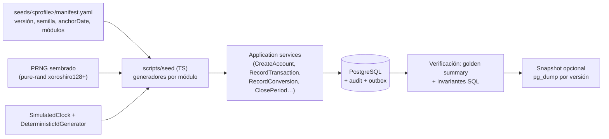
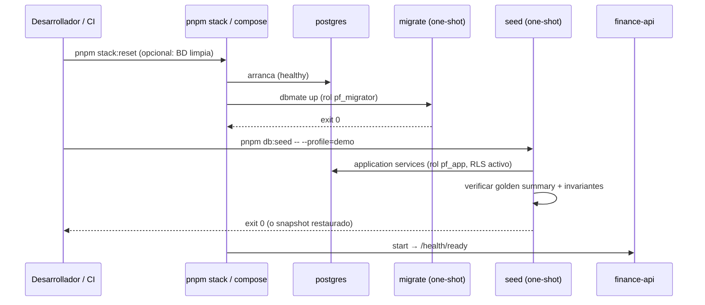

# 29 — Seed datasets

> **Estado:** Propuesto · **Fecha:** 2026-10-01 · **Owner:** Principal Architect / QA Lead
> **Relacionado:** [ARCHITECTURE.md](./ARCHITECTURE.md) (§6 `seeds/{minimal,demo,large}`, §10 servicio `seed` y `pnpm db:seed`) · [09-ledger-design.md](./09-ledger-design.md) · [16-testing-strategy.md](./16-testing-strategy.md) · [17-test-traceability.md](./17-test-traceability.md) · [19-local-development.md](./19-local-development.md) · [23-ci-cd.md](./23-ci-cd.md) · [24-roadmap.md](./24-roadmap.md)

---

## 1. Propósito y principios

PFOS necesita datos realistas para pruebas manuales, tests automatizados, reportes, demos y, en Phase 8, experimentos de ML. Este documento define **tres perfiles de seed** y cómo se generan.

Principios no negociables:

1. **Datos 100 % ficticios.** Nunca datos personales reales, extractos reales, nombres de bancos reales con números de cuenta, ni capturas de la cuenta del owner. Instituciones con nombres inventados (p. ej. *Banco Andino Demo*, *P2P Exchange Demo*); números de cuenta con prefijo `DEMO-`.
2. **Generados a través de los casos de uso de la aplicación** (application services de cada contexto), **nunca con SQL crudo**. Así toda invariante (`INV-001..INV-020`, ver [09-ledger-design.md](./09-ledger-design.md)) se cumple por construcción, se escriben audit logs y eventos de outbox, y el seed actúa como test de integración masivo.
3. **Determinismo total:** mismo perfil + misma versión + misma semilla ⇒ mismo resultado bit a bit (IDs, fechas, montos). PRNG sembrado, `Clock` simulado e `IdGenerator` determinista ([16-testing-strategy.md §6.2](./16-testing-strategy.md)).
4. **Versionados**: cada perfil tiene un manifiesto con versión semántica y un **resumen dorado** (saldos y totales esperados) que los tests verifican.
5. **Crecen con el roadmap:** un perfil solo incluye datos de capabilities implementadas; el manifiesto declara qué módulos cubre.

## 2. Perfiles

| Perfil | Uso principal | Volumen | Tiempo objetivo de carga |
|---|---|---|---|
| **Minimal** | Smoke, tests automatizados (API/E2E), CI | 2 workspaces, ~6 cuentas, ~20 transacciones | < 10 s |
| **Demo** | Pruebas manuales, demos, desarrollo de UI, reporting | 1 workspace principal + 1 compartido, 21 meses, ~1 800 transacciones | < 2 min |
| **Large** | Performance (k6), escalabilidad de reportes, ML (Phase 8) | 5 años, ~100 000 transacciones + 20 workspaces satélite | < 30 min (generación); < 2 min (restore de snapshot) |

### 2.1 Minimal Seed

Diseñado para que los test cases del catálogo se puedan ejecutar sobre él sin preparar datos adicionales.

- **Usuarios (Keycloak dev realm, credenciales de prueba solo locales):** `owner@demo.pfos.test` (OWNER de W1 y W2), `editor@demo.pfos.test` (EDITOR de W1), `viewer@demo.pfos.test` (VIEWER de W1), `outsider@demo.pfos.test` (OWNER solo de W2).
- **Workspaces:** `W1 Personal Demo` (base BOB, `America/La_Paz`) y `W2 Other Demo` (para aislamiento RLS).
- **Monedas:** BOB (2), USD (2), USDT (6), BTC (8).
- **Cuentas W1:**

| Cuenta | Tipo (`AccountType`) | Naturaleza | Liquidez (default) | Moneda | Saldo de apertura |
|---|---|---|---|---|---|
| Bank A | `BANK` | ASSET | `LIQUID` | BOB | 1 000.00 |
| Bank B | `SAVINGS` | ASSET | `LIQUID` | BOB | 0.00 |
| USD Savings | `SAVINGS` | ASSET | `LIQUID` | USD | 500.00 |
| USDT Wallet | `CRYPTO_WALLET` | ASSET | `LIQUID` | USDT | 100.000000 |
| BTC Wallet | `CRYPTO_WALLET` | ASSET | `LIQUID` | BTC | 0.01250000 |
| Credit Card | `CREDIT_CARD` | LIABILITY | `ILLIQUID` | BOB | 0.00 |

  Tipos según la lista canónica de FR-ACCOUNTS-001 (docs/31 D3: el antiguo "checking" es `BANK`); naturaleza derivada del tipo y liquidez por defecto según FR-ACCOUNTS-011 (D5). Las cuentas con saldo de apertura 0 no generan asiento; su `LedgerAccount` nace con el primer posting (get-or-create, D6).
- **Categorías:** cada workspace se provisiona por el mismo gancho que `CreateWorkspace` (dataset `minimal` v3, `apps/api/src/seed/run-seed.ts`): las 11 categorías de sistema (FR-CLASSIFICATION-003) y el catálogo sugerido es-BO de [§2.4](#24-catálogo-inicial-de-categorías-sugerido) (incluye, p. ej., *Supermercado*, *Alquiler*, *Servicios básicos*, *Sueldo*, *Suscripciones digitales*, *Transporte público*). Pendiente para TC-CLASSIFICATION-ARCHIVE-001: una categoría archivada con transacciones (`Old Gym`).
- **Instituciones (dataset `minimal` v4):** catálogo inicial ficticio por workspace (`apps/api/src/seed/minimal/institutions.json`: *Banco Andino Demo*, *Cooperativa Illimani Demo*, *Billetera Altiplano Demo*, *P2P Exchange Demo*) cargado una vez en W1 y W2 como instituciones normales de cada workspace (editables y archivables; re-ejecutar la seed no restaura lo renombrado). Nunca en migraciones ni en código de producto (FR-ACCOUNTS-012, add-accounts-management 2.4).
- **Transacciones:** pocas y con propósito (un gasto con split, un pending, un refund, una transacción voided). Los saldos de apertura coinciden con los ejemplos de los TCs (p. ej. TC-LEDGER-TRANSFER-001 parte de Bank A = 1 000.00 BOB, Bank B = 0.00 BOB) **antes** de aplicar esas transacciones; los tests que necesitan el estado "virgen" usan el snapshot `minimal@opening`.
- **W2:** una cuenta `W2 Bank` BOB 5 000.00 y 3 transacciones, usadas solo para verificar que nunca aparecen desde W1.

### 2.2 Demo Seed

> **Decisión del owner D36 (docs/31, 2026-10-03; ADR-0026; change `add-demo-data`, capability `identity/demo-data`).** Los datos demo pueden tener apariencia de terceros (bancos, comercios y personas **ficticios** con aspecto real), pero **solo se cargan por una acción explícita en la app** (OWNER: "Cargar datos de demostración" / "Limpiar datos de demostración" en la configuración del workspace), **siempre en un workspace de demostración dedicado** (`is_demo` inmutable), marcado de forma visible y **completamente removible** (archivo inmediato + purga física acotada a workspaces demo). Nunca se cargan al arrancar, migrar o iniciar sesión, ni dentro de un workspace real. El perfil `demo` de `pnpm db:seed` (solo local/CI) reutiliza el mismo cargador y crea el mismo tipo de workspace demo.

Ventana: **2025-01-01 → 2026-09-30** (21 meses), anclada a una fecha fija (`anchorDate: 2026-09-30`); opción `--anchor=today` desplaza todas las fechas para demos "actuales".

**Personas (ficticias):**

| Persona | Rol | Descripción |
|---|---|---|
| **Valeria Mamani** (ficticia) | OWNER de *Finanzas de Valeria* | Desarrolladora de software en La Paz, ingreso en BOB, ahorra en USD/USDT, compra BTC ocasionalmente, tiene un préstamo vehicular y una tarjeta de crédito |
| **Diego Choque** (ficticio) | VIEWER del workspace de Valeria; OWNER de *Hogar Choque-Mamani* | Pareja; consulta reportes; workspace compartido de gastos del hogar |

**Contenido del workspace principal:**

| Elemento | Detalle |
|---|---|
| Cuentas | Banco Andino Demo (BOB checking), Banco Andino Demo USD savings, Cash BOB, P2P Exchange Demo USDT wallet, Cold Wallet BTC, Tarjeta Andina Demo (LIABILITY BOB), Préstamo vehicular (LIABILITY BOB) |
| Salario | 12 000.00 BOB el último día hábil del mes; aguinaldo en diciembre; aumento del 5 % en 2026-01 |
| Alquiler | 3 500.00 BOB el día 5; ajuste a 3 700.00 BOB en 2026-02 |
| Servicios | Luz, agua, gas, internet con estacionalidad (invierno junio–agosto +25 % en luz/gas) |
| Suscripciones | Streaming 9.99 USD → **11.99 USD** desde 2025-10 (cambio de precio); música 5.99 USD; cloud storage 2.99 USD; cargo a tarjeta |
| Préstamo | Desembolso 50 000.00 BOB el 2025-02-01, 9 % anual, 36 cuotas francesas ≈ 1 589.99 BOB (calculadas por el motor de amortización; la última cuota ajusta el redondeo), desglose principal/interés/seguro |
| Tarjeta de crédito | 15–30 compras/mes; pago total mensual desde la cuenta BOB (transferencia ASSET→LIABILITY); un mes con pago parcial |
| Conversiones | 1–3 compras P2P de USDT con BOB al mes (quoted 6.88–7.05 BOB/USDT, spread y fee variables); 4 conversiones USDT→BTC con network fee; 2 ventas USDT→BOB |
| Transferencias | Ahorro mensual BOB checking → USD savings vía conversión; transferencias a Cash |
| Metas | Fondo de emergencia 30 000.00 BOB (cuenta vinculada); Viaje 2 000.00 USD (earmark virtual) |
| Presupuestos | Mensuales por categoría desde 2025-03, con plantilla versionada (v1 → v2 en 2026-01) |
| Meses cerrados | 2025-01 → 2026-06 cerrados; 2026-07 → 2026-09 abiertos; un cierre reabierto y re-cerrado (auditado) |
| Casos especiales | Refunds, splits, duplicados sugeridos (2), transacciones pending al final de la ventana, una corrección por reversa |

> La disponibilidad de cada bloque depende de la fase: Planning (presupuestos, cierres) desde Phase 2, Commitments desde Phase 3, Goals/Debt desde Phase 4. El manifiesto (`modules:`) indica qué se genera en cada versión.

> **As-built (add-demo-data, 2026-10-04).** Dataset Demo v1 de Phase 1 en `apps/api/src/demo/dataset/` (manifiesto `DEMO_MANIFEST`,
> generador `buildDemoPlan`, PRNG mulberry32 sembrado y `golden-summary.json`): cuentas de Banco Andino Demo (BOB y USD), efectivo,
> P2P Exchange Demo (USDT), Cold Wallet BTC, Tarjeta Andina Demo y préstamo vehicular (pagos simples: capital fijo + interés 0.75 %/mes;
> la amortización francesa llega con Debt), ~560 transacciones (salario, alquiler, servicios por QR, suscripciones USD, tarjeta con
> pago total y uno parcial, conversiones P2P con fees, reembolsos, split, ajuste, 2 ediciones, 1 anulación, 2 pendientes) y 210 tasas
> manuales "Demo". Se carga desde la app ("Cargar datos de demostración", job `demo.load`) o con `pnpm db:seed -- --profile=demo`
> (mismo cargador, workspace demo de `owner@demo.pfos.test` con origen W1). Metas, presupuestos y cierres llegarán con sus fases.

### 2.3 Large Dataset Seed

- **Ventana:** 2021-10-01 → 2026-09-30 (5 años).
- **Workspace principal:** ~100 000 transacciones (~55/día), 25 cuentas (fiat, cripto, tarjetas, préstamos), 120 categorías, 600 counterparties, 40 suscripciones.
- **20 workspaces satélite** con 1 000–5 000 transacciones cada uno para medir RLS y aislamiento bajo carga.
- **Patrones realistas:**
  - **Estacionalidad:** diciembre (+40 % compras), febrero (útiles escolares), invierno (servicios), carnaval.
  - **Tendencias:** inflación de alimentos +0.4 %/mes; crecimiento salarial escalonado; adopción creciente de USDT.
  - **Ruido:** distribución log-normal de montos por categoría; días de semana vs fin de semana.
  - **Anomalías inyectadas con etiquetas** (para detección de anomalías futura): gastos atípicos (×5–×20 del percentil 95 de la categoría), cargos duplicados, suscripción olvidada que sube de precio, fraude simulado con counterparty nuevo, saltos de tasa P2P. Las etiquetas viven **fuera de la BD del producto** en `seeds/large/labels/anomalies.v<N>.jsonl` (`transactionId`, `kind`, `injectedAt`, `severity`), para no contaminar el dominio.
- **Uso en performance:** k6 sobre listados filtrados, net worth histórico, reportes por categoría y cash-flow calendar ([16-testing-strategy.md §5.15](./16-testing-strategy.md)).

> **As-built (ci/nightly-perf, 2026-10-04; v2 desde perf/balance-query: la cuenta `P2P Exchange Demo — BTC` ya no
> tiene saldo de apertura — queda sin postings, regresión del 422 `CURRENCY_MISMATCH` del resumen).** Large Seed v2 en `apps/api/src/seed/large/`: plan determinista `buildLargePlan`
> (`large-plan.ts`, mismo PRNG mulberry32 y aritmética de unidades mínimas `bigint` que el dataset Demo, regla ESLint de
> determinismo, `golden-summary.json` verificado por test) ejecutado por `loadLargeWorkspace` con los **casos de uso
> públicos** (`applyPlanOp`, compartido con el `DemoDataLoader`), un lote por mes, reloj simulado, actor `system:seed` y
> verificación final de saldos contra el plan + balance de comprobación en cero. Contenido: workspace principal
> `Large — Principal` (owner = `owner@demo.pfos.test`) 2021-10 → 2026-09 con **97 374 transacciones**, 25 cuentas,
> ~120 categorías (catálogo + 42 extra), 600 contrapartes, 40 suscripciones (5 con alza de precio), 600 tasas manuales,
> estacionalidad (diciembre +40 %, febrero +15 %, invierno), inflación de alimentos +0.4 %/mes, montos log-normales y
> 172 anomalías etiquetadas (OUTLIER, DUPLICATE_CHARGE, NEW_COUNTERPARTY_FRAUD, SUBSCRIPTION_PRICE_HIKE, P2P_RATE_JUMP)
> exportables con `--labels-out` (JSONL fuera de la BD); 20 satélites con 1 079–4 775 transacciones (56 116 en total).
> `pnpm db:seed -- --profile=large [--scale=0.1] [--concurrency=4] [--months=N]` (contenedor o `--host`); rechazada con
> `PFOS_ENV=staging|production`, idempotente por `platform.seed_run` y rechaza una carga parcial previa. Carga completa
> medida en local (Windows 11 + Docker Desktop, 4 workspaces en paralelo): **≈ 32 min** (~20 ms por operación, dominado por
> la latencia de ida y vuelta a PostgreSQL); aún sin snapshot `pg_dump` restaurable (§7 pregunta 1). Los IDs de las
> filas no son deterministas (los casos de uso generan UUIDv7); sí lo son fechas, montos, claves del plan y saldos.

## 3. Generación determinista



- **PRNG:** `pure-rand` (el mismo motor de fast-check) con semilla del manifiesto; sub-generadores derivados por módulo (`seed ⊕ hash(moduleName)`) para que añadir un módulo no altere los datos de los demás.
- **Prohibido** `Math.random`, `Date.now()` y `new Date()` sin argumentos en `seeds/` y `scripts/seed` (regla ESLint `pf/no-nondeterminism`).
- **Montos** generados como enteros de unidades mínimas y convertidos a `Money` (decimal string) — nunca `number` con decimales.
- **Clock simulado:** cada caso de uso se ejecuta con el `Clock` posicionado en la fecha simulada, de modo que `created_at` y audit logs sean coherentes con la historia.
- **Actor de seed:** las mutaciones se ejecutan con un actor técnico `system:seed` asociado a la persona OWNER, visible en el audit trail.
- **Rendimiento del Large seed:** ejecución in-process de los application services (sin HTTP), en lotes por mes dentro de transacciones; el resultado se guarda como **snapshot** (`pg_dump -Fc`) etiquetado `large@<seedVersion>+<schemaVersion>` y se restaura en CI/perf en lugar de regenerar.

### 3.1 Manifiesto y versionado

```yaml
# seeds/demo/manifest.yaml (ilustrativo)
profile: demo
seedVersion: 1.2.0          # semver: major = cambia datos existentes; minor = añade módulos/datos; patch = fixes sin cambiar golden
generatorVersion: 1.2.0
prngSeed: 20260930
anchorDate: 2026-09-30
timezone: America/La_Paz
schemaVersion: "20261015120000"   # última migración requerida (dbmate)
modules: [identity, accounts, classification, ledger, transactions, fx]   # + planning, commitments, goals, debt según fase
golden: golden-summary.json       # saldos por cuenta, net worth mensual, totales por categoría y mes
```

- Cambiar el seed de forma que altere el **golden summary** exige incrementar `major` (o `minor` si solo añade) y actualizar los tests que dependen de él en el mismo PR.
- El golden summary se verifica tras cada carga (`pnpm db:seed` falla si no coincide).

## 4. Flujo de carga



**Comandos** (coherentes con [ARCHITECTURE §10](./ARCHITECTURE.md#10-plataforma-local-adr-0011-adr-0012)):

| Comando | Efecto |
|---|---|
| `pnpm stack:reset` | Elimina volúmenes y recrea BD vacía |
| `pnpm db:migrate` | Aplica migraciones |
| `pnpm db:seed -- --profile=minimal` | Carga Minimal (por defecto) |
| `pnpm db:seed -- --profile=demo [--anchor=today] [--seed=<n>]` | Carga Demo |
| `pnpm db:seed -- --profile=large [--from-snapshot]` | Genera Large o restaura su snapshot |
| `docker compose --profile core --profile seed up` | Ejecuta el servicio one-shot `seed` (perfil por env `SEED_PROFILE`) |

- `db:seed` **se niega a correr** si la BD no está vacía de datos de negocio (salvo `--force` en local) y **nunca** contra entornos con `APP_ENV=production` (comprobación explícita). En staging solo se permite `demo`, bajo aprobación.

## 5. Uso de los seeds

| Consumidor | Perfil | Cómo |
|---|---|---|
| Tests de dominio/unit | — | No usan seeds: usan builders y object mothers alineados con Minimal ([16 §6.3](./16-testing-strategy.md)) |
| Tests de integración/API | Minimal (fixtures) | Snapshot `minimal@opening` restaurado como `TEMPLATE` database |
| E2E (Playwright) | Minimal | compose `core` + `seed` en CI |
| Migration tests | Demo | Snapshot de la release anterior con Demo → migrar → verificar invariantes y golden summary |
| Pruebas manuales / demos | Demo | Personas Valeria y Diego; guion de demo en [19-local-development.md](./19-local-development.md) |
| Reporting tests | Demo | El golden summary es el oráculo de reportes (net worth mensual, gasto por categoría) |
| Performance (k6) | Large | Snapshot restaurado en compose/staging efímero |
| ML experiments (Phase 8) | Large | Export a Parquet desde read models + `labels/anomalies.jsonl`; nunca datos reales |

## 6. Estructura en el repositorio (propuesta)

```
seeds/
├─ minimal/{manifest.yaml, golden-summary.json, scenarios/*.ts}
├─ demo/{manifest.yaml, golden-summary.json, personas.yaml, generators/*.ts}
└─ large/{manifest.yaml, golden-summary.json, generators/*.ts, labels/.gitkeep}
scripts/seed/            # CLI TS: parse args, PRNG, clock, runner, verificación
```

## 7. Preguntas abiertas

1. ¿Los snapshots de Large se guardan como artefacto de CI, en un bucket S3 de dev, o en GitHub Releases? (Tamaño estimado: cientos de MB).
2. ¿El seed `demo` debe poder cargarse en **staging** para demos externas? Requiere decisión de seguridad. — Parcialmente resuelta por D36: la carga es una acción de la app en un workspace demo aislado y purgable; queda para el owner si `DEMO_DATA_ENABLED` se habilita en staging/producción (default propuesto: deshabilitado). **Resuelta por el owner el 2026-10-04 (docs/31 D41):** deshabilitado por defecto en `staging`/`production`; ventana del dataset de 21 meses.
3. ¿Montos del Demo Seed (salario 12 000 BOB, alquiler 3 500 BOB) representativos para el owner, o se prefiere escalarlos?
4. ¿Las credenciales de los usuarios de prueba viven solo en el realm import de Keycloak dev ([19-local-development.md](./19-local-development.md)) o también en `.env.example`?
5. ¿Generación del Large seed vía application services es suficientemente rápida? Si no, evaluar un "bulk use case" de dominio (sigue validando invariantes) en lugar de SQL directo.
