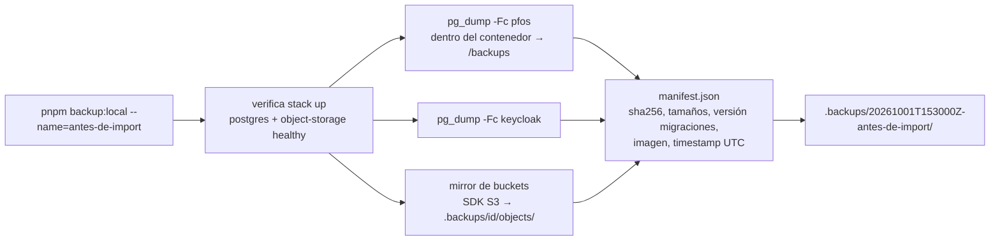
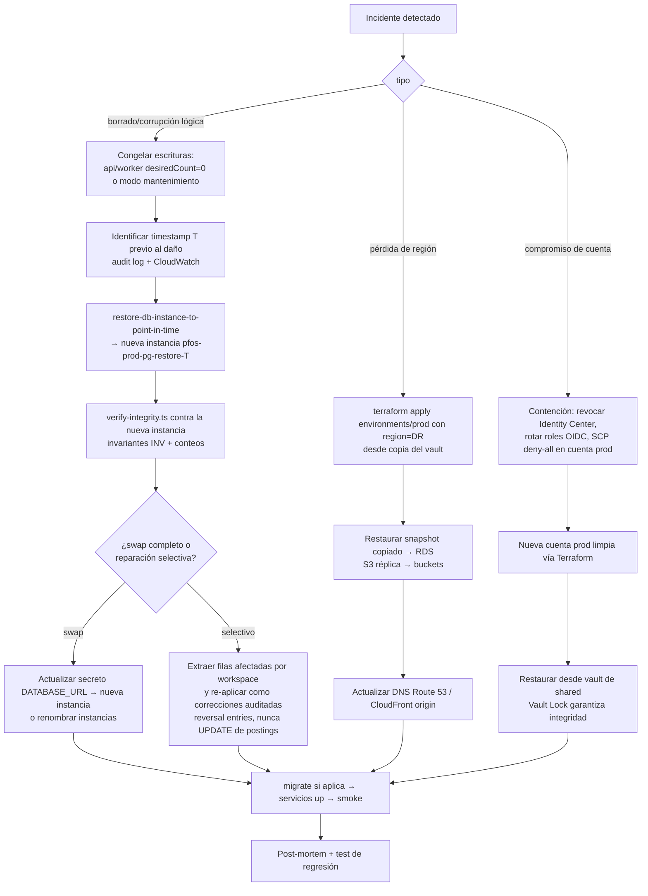

# 30 — Backup y Disaster Recovery

> **Estado:** Propuesto · **Fecha:** 2026-10-01 · **Relacionado:** [ARCHITECTURE.md](ARCHITECTURE.md) §4, §9, §10, §11 · [02-non-functional-requirements.md](02-non-functional-requirements.md) (NFR-REL, NFR-DATA) · [08-data-model.md](08-data-model.md) · [09-ledger-design.md](09-ledger-design.md) (invariantes `INV-NNN`) · [12-security.md](12-security.md) · [19-local-development.md](19-local-development.md) · [21-cloud-deployment-options.md](21-cloud-deployment-options.md) · [22-infrastructure.md](22-infrastructure.md) · [23-ci-cd.md](23-ci-cd.md) · ADR-0005, ADR-0009, ADR-0013, ADR-0014

> Configuración y scripts **ilustrativos** (Phase 0). Los objetivos RPO/RTO son una **propuesta** para aprobación del owner en el DESIGN GATE.

---

## 1. Qué se protege y cómo

| Activo | Fuente de verdad | Durabilidad requerida | Mecanismo principal |
|---|---|---|---|
| PostgreSQL (`pfos`: ledger, transacciones, planning, audit, `platform.outbox/inbox`) | **Sí** — datos financieros | Máxima | RDS automated backups + **PITR**, snapshots manuales, copia cross-account/cross-region; local: `pg_dump -Fc` |
| Object storage (documentos, adjuntos, exports) | Sí — documentos del usuario | Alta | S3 **versioning** + lifecycle + replicación opcional; local: mirror vía SDK S3 |
| Redis/Valkey (colas BullMQ, caché) | **No** — derivable | Ninguna (reconstruible) | El outbox en PostgreSQL es la fuente; colas se re-hidratan desde outbox; jobs programados se re-registran al arrancar el worker |
| Keycloak DB (local) / IdP cloud (usuarios) | Sí para identidades | Media | Local: `pg_dump` de la BD `keycloak`; Cognito: export de usuarios (sin hashes de contraseña — re-registro/reset) — ver §6 |
| Secretos | Sí | Alta | Secrets Manager (recovery window 30 d) + regeneración documentada; no se copian valores fuera |
| Infraestructura | Código | Alta | Terraform en git + state S3 versionado ([22](22-infrastructure.md)) |
| Imágenes | Registro | Media | ECR (shared) con tags inmutables; reconstruibles desde git por SHA |
| Read models (`reporting`), `AccountBalanceSnapshot` | **No** — derivados | Ninguna | Reconstruibles desde el ledger (ARCHITECTURE §4.1) |

> Principio: **solo PostgreSQL y object storage requieren backup**. Todo lo demás se reconstruye desde ellos, desde git o desde IaC.

## 2. Objetivos RPO / RTO (propuesta)

| Escenario | RPO propuesto | RTO propuesto | Base |
|---|---|---|---|
| Fallo de instancia / AZ (prod) | ≤ 5 min (Single-AZ: PITR) / ≈ 0 (Multi-AZ) | ≤ 1 h (Single-AZ: restore PITR) / ≤ 5 min (Multi-AZ) | RDS sube logs de transacciones ~cada 5 min |
| Borrado/corrupción lógica (bug, migración) | **≤ 15 min** (punto previo al incidente) | **≤ 4 h** | PITR a instancia nueva + reconciliación |
| Pérdida de región | ≤ 24 h (copia diaria cross-region) — ≤ 15 min si se habilita *cross-region automated backup replication* | ≤ 8 h | AWS Backup copy / replicación de backups automáticos |
| Compromiso de cuenta prod | ≤ 24 h | ≤ 24 h | Copias en vault de la cuenta `shared` con Vault Lock |
| Documentos (S3) borrados/sobrescritos | 0 (versioning) | ≤ 1 h | Restaurar versión previa |
| Local (dev) | Último `backup:local` | Minutos | Manual |

Objetivo global propuesto para el producto: **RPO ≤ 15 min, RTO ≤ 4 h** (típico de app personal con datos financieros; sin requisito de alta disponibilidad 24/7). Se registra como `NFR-REL-*` en [02-non-functional-requirements.md](02-non-functional-requirements.md) (lo escribe su autor; aquí la propuesta).

## 3. Backup y restore local

### 3.1 `pnpm backup:local`

- Implementación: `scripts/backup-local.ts` (TypeScript, cross-platform). Usa `docker compose exec -T postgres pg_dump --format=custom --compress=zstd:6 --no-owner --no-privileges` hacia el bind mount `/backups` (= `./.backups` del repo, en `.gitignore`), evitando transferir el dump por stdout (problemas de binario en terminales Windows).
- `pg_dump` del **cliente del mismo major que el servidor** (el del propio contenedor `postgres:18`).
- Objetos: `@aws-sdk/client-s3` lista y descarga `pfos-local-documents` y `pfos-local-exports` (con metadatos y `Content-Type` en un `objects.index.json`).
- `manifest.json`: `{ id, createdAt, pfosVersion, gitSha, schemaMigrations: [...últimas versiones dbmate], files: [{ path, sha256, bytes }], seedProfile? }`.
- Rotación: conserva los últimos N=10 (configurable `BACKUP_LOCAL_KEEP`).
- Cifrado opcional: `--encrypt` con `age` (clave pública en `.env`, `BACKUP_AGE_RECIPIENT`) — recomendado si los backups locales contienen **datos reales** del owner.

### 3.2 `pnpm restore:local -- <id>`

1. Verifica `manifest.json` y checksums (aborta si no coinciden).
2. Pide confirmación (o `--yes`); para `finance-api`, `finance-worker`, `finance-web` (deja `deps` arriba).
3. `pg_restore --clean --if-exists --no-owner --role=pfos_migrator --exit-on-error -d pfos` (+ `keycloak`). Reaplica `GRANT`s a `pfos_app` mediante la migración idempotente de roles.
4. Vacía y re-sube los objetos del bucket desde `objects/`.
5. `pnpm db:migrate` (si el backup es de una versión anterior, aplica migraciones pendientes).
6. **Verificación de integridad** (`scripts/verify-integrity.ts`): invariantes del ledger (para cada `JournalEntry` y moneda `Σ amount = 0`; postings sin entry; saldos = Σ postings), conteos por tabla vs manifest, referencias a objetos existentes (cada `documents.attachment.object_key` existe en el bucket).
7. Arranca `core`; vacía colas de Redis (borra claves `pfos:*` con SCAN+UNLINK; la DB lógica es exclusiva de PFOS) para que el worker re-hidrate desde el outbox.

Cubre el scenario *Backup and restore round trip* de la spec `platform/local-environment`.

## 4. Cloud — PostgreSQL (RDS)

| Control | Producción | Staging |
|---|---|---|
| Automated backups + PITR | **Sí**, retención **14 días** (máx. 35) | 3 días |
| Ventana de backup | 06:00–06:30 UTC (02:00 La Paz) | idem |
| Snapshots manuales | `pre-migrate-<sha>` en cada deploy con migraciones (retención 30 d, limpieza por script) + mensual `monthly-YYYYMM` (retención 12 meses) | Antes de migraciones destructivas |
| Cifrado | KMS CMK `pfos-prod-rds`; snapshots heredan cifrado | KMS |
| Copia cross-account | **AWS Backup**: plan diario → vault `pfos-prod-vault` (cuenta prod) → **copy** a vault `pfos-dr-vault` (cuenta `shared`) con **Vault Lock (compliance mode)**, retención 35 días + mensuales 12 meses | No |
| Copia cross-region | Copia diaria del vault de `shared` a región DR (p. ej. `us-west-2`, a decidir) — o *RDS cross-region automated backups replication* (PITR en otra región, más caro) | No |
| `deletion_protection` | Sí | No |
| Final snapshot al destruir | Sí | No |

Notas:
- Copiar snapshots cifrados entre cuentas/regiones requiere compartir/usar una CMK accesible en destino (KMS multi-Region key o re-cifrado con la key del vault destino) — se define en el módulo `database`/`security` ([22](22-infrastructure.md)).
- Backups lógicos complementarios: **`pg_dump` semanal** de producción ejecutado como ECS task one-off hacia S3 `pfos-prod-backups` (cifrado, Object Lock *governance* 90 días). Motivo: portabilidad entre proveedores/versiones mayores y defensa ante corrupción a nivel de storage. Costo: céntimos.

## 5. Cloud — Object storage (S3)

| Control | Configuración |
|---|---|
| Versioning | **ON** en `documents` y `exports` (prod y staging) |
| Lifecycle | Versiones no actuales → Standard-IA a 30 días → expiración a 365 días; `exports` actuales expiran a 7 días (son artefactos temporales); abortar multipart incompletos a 7 días |
| Protección de borrado | Delete markers recuperables; MFA Delete no (incompatible con automatización); política que niega `s3:DeleteObjectVersion` a los roles de app |
| Replicación | **Opcional**: CRR de `documents` a bucket en cuenta `shared`/región DR (*Replication Time Control* no necesario). Recomendado activar cuando haya documentos reales |
| Cifrado | SSE-KMS con bucket key |
| Integridad | Checksums (`x-amz-checksum-sha256`) en subida; hash guardado en `documents.attachment` |

## 6. Redis, IdP y secretos

- **Redis/Valkey: no durable por diseño.** Ante pérdida: el worker al arrancar (a) re-registra jobs repetibles (recurrencias, cierres de mes) de forma idempotente, (b) el outbox relay re-publica eventos `platform.outbox` no marcados como publicados; los consumidores son idempotentes (`platform.inbox`). Jobs en vuelo se reintentan (at-least-once). ElastiCache Serverless tiene snapshots diarios opcionales — **no se dependen de ellos**.
- **IdP**:
  - Local: BD `keycloak` incluida en `backup:local`.
  - Cognito (si se elige): no exporta hashes de contraseña. DR = recrear user pool por Terraform + importar usuarios (CSV) con reset obligatorio, o federación. Para un usuario, aceptable. El vínculo con el dominio es `iam.user.external_subject` (+ email) — documentar el remapeo de `sub` en el runbook.
  - Keycloak en cloud: su BD forma parte del backup RDS.
- **Secretos**: Secrets Manager con `recovery_window_in_days = 30`. No se exportan valores. DR = regenerar (contraseñas de BD, cookie secret, client secret) — todos son **rotables sin pérdida de datos** (salvo: sesiones activas se invalidan). La CMK de KMS tiene *deletion window* de 30 días y su eliminación está denegada por SCP.

## 7. Runbook de restauración (producción)

Ubicación final: `docs/runbooks/restore-production.md` (Phase 1). Resumen:

Reglas del runbook:
- Restaurar **siempre a una instancia nueva**; nunca sobre la existente (preserva evidencia y permite comparar).
- La reparación selectiva respeta la inmutabilidad del ledger (ARCHITECTURE §4): correcciones como **reversal + nueva entry**, con `AuditLog` motivo `DATA_RECOVERY`.
- Cada paso registra hora y responsable en el issue del incidente.

## 8. Simulacros de restauración (restore drills)

| Drill | Frecuencia | Dónde | Automatización | Criterio de éxito |
|---|---|---|---|---|
| Local/CI: `backup:local` → mutación → `restore:local` | Cada PR que toque scripts de backup; nightly | CI (compose) | `pnpm test:platform` (escenario round trip) | Estado idéntico (hash de tablas + objetos) |
| Migración sobre snapshot de release | Cada release | CI | `test:migrations` up-from-release-snapshot ([16](16-testing-strategy.md) §5.9) | Invariantes OK tras migrar |
| **Restore PITR de producción** | **Mensual** (`nightly.yml` con schedule mensual) | Cuenta **staging** (snapshot compartido/copiado cifrado) | Workflow `restore-drill`: restaura último punto → instancia efímera en subnet aislada → `verify-integrity.ts` → métricas (duración = RTO observado) → destruye | Integridad OK y **RTO observado < 1 h**; resultado publicado como artefacto + alarma si falla |
| Restore desde vault cross-account/region | Trimestral | Cuenta shared / región DR | Semi-manual (runbook) | Restore completo < 8 h |
| Restore de versión S3 | Trimestral | staging | Script | Objeto recuperado con checksum igual |
| Game day (región/compromiso) | Anual | staging | Manual guiado | Runbook ejecutable sin pasos no documentados |

Privacidad: el drill de producción restaura **datos reales** en la cuenta staging de forma efímera — la instancia restaurada vive en subnet aislada, sin endpoints públicos, cifrada con KMS, se destruye al terminar (< 2 h) y solo el rol del workflow accede. Alternativa más estricta: ejecutar el drill **dentro de la cuenta prod** en instancia efímera (Preguntas abiertas).

## 9. Escenarios DR

| Escenario | Detección | Respuesta | RPO/RTO esperados |
|---|---|---|---|
| **Borrado accidental por el usuario** (p. ej. archivar cuenta, anular transacción) | Usuario | No hay hard delete de datos financieros (soft-archive, reversals — ARCHITECTURE §9): se **deshace en la app** (des-archivar, reversal de la reversal). Sin restore | 0 / minutos |
| **Borrado accidental por operador/bug** (DELETE/UPDATE masivo) | Alarmas de anomalía de filas, invariantes nightly, usuario | Runbook §7 rama lógica (PITR a instancia nueva + reparación selectiva) | ≤ 15 min / ≤ 4 h |
| **Migración corrupta** | `migrate` falla (no se despliega) o verificación post-migración/smoke | Si falló: forward-fix, servicios siguen en N-1. Si aplicó y dañó: snapshot `pre-migrate-<sha>` o PITR → runbook §7 | ≤ 15 min / ≤ 4 h |
| **Fallo de AZ / instancia** | RDS events, health checks | Single-AZ: PITR/restore automático por AWS o manual; Multi-AZ: failover automático | ≤ 5 min / ≤ 1 h (Single-AZ) |
| **Pérdida de región** | AWS Health | Runbook §7 rama región (Terraform en región DR + snapshot copiado + réplica S3) | ≤ 24 h / ≤ 8 h |
| **Compromiso de cuenta AWS prod** | GuardDuty, CloudTrail, alarmas de billing | Contención + nueva cuenta + restore desde vault con Vault Lock en `shared` | ≤ 24 h / ≤ 24 h |
| **Ransomware/borrado malicioso de backups** | AWS Backup events | Vault Lock compliance impide borrar copias durante la retención; Object Lock en dumps lógicos | ≤ 24 h |
| **Pérdida de Redis** | Health/alarmas | Recrear; re-hidratación desde outbox | 0 datos financieros / minutos |
| **Pérdida del portátil del owner** | — | Repo en GitHub; `.env` local es dev-only y regenerable; backups locales con datos reales deben estar cifrados (`--encrypt`) | n/a |
| **Pérdida de acceso a GitHub** | — | Mirror del repo (opcional, p. ej. bundle mensual cifrado en S3 shared); imágenes en ECR | — |

## 10. Export a nivel de workspace (backup de usuario)

Función de producto (user-facing), complementaria a los backups de plataforma y requisito de portabilidad de datos.

- **Qué**: export completo de un workspace → ZIP con:
  - `manifest.json` (formato `pfos-export`, `formatVersion: 1`, `workspaceId`, `exportedAt`, `pfosVersion`, `baseCurrency`, conteos, sha256 por fichero).
  - `json/` — un fichero por agregado (accounts, institutions, transactions + splits + conversion details, ledger journal entries + postings, categories, tags, custom fields, counterparties, budgets, templates, recurring, goals, loans, fx-rates usadas, rules, audit-log), montos como **string decimal** y fechas según ARCHITECTURE §8.
  - `csv/` — vistas planas legibles (transacciones con categoría/moneda, saldos por cuenta y fecha) para hojas de cálculo.
  - `documents/` — adjuntos (opcional, puede ser grande).
- **Cómo**: comando `POST /api/v1/workspaces/{id}/exports` (con `Idempotency-Key`) → job del worker → objeto en bucket `exports` (cifrado) → notificación → descarga por **presigned URL** de vida corta (p. ej. 15 min), expiración del objeto a 7 días. Solo rol `OWNER` (decisión de permisos en [12-security.md](12-security.md)); queda en `AuditLog`.
- **Consistencia**: export dentro de una transacción `REPEATABLE READ` (snapshot consistente) con RLS del workspace.
- **Import/restauración de workspace** desde export: fuera de alcance inicial (Phase 6+ junto al pipeline de imports); el formato se diseña desde ya para ser re-importable (IDs UUIDv7 preservados).
- Programación opcional: export automático mensual al email/almacenamiento del usuario (Phase 7+).

## 11. Cifrado de backups

| Backup | Cifrado en reposo | En tránsito | Claves |
|---|---|---|---|
| RDS automated/snapshots | KMS CMK (heredado) | TLS interno AWS | `pfos-prod-rds` (rotación anual automática) |
| Copias AWS Backup cross-account/region | KMS de vault destino | TLS | CMK del vault `shared` (multi-Region si aplica) |
| `pg_dump` lógicos en S3 | SSE-KMS + Object Lock | TLS | `pfos-prod-backups` |
| S3 documentos/réplicas | SSE-KMS | TLS (política `aws:SecureTransport`) | `pfos-prod-s3` |
| Backups locales | `age` opcional (recomendado con datos reales) | n/a | Clave del owner (fuera del repo) |
| Exports de workspace | SSE-KMS en bucket; ZIP opcionalmente con contraseña definida por el usuario (Phase 7+) | HTTPS (presigned) | — |

Acceso a backups restringido por políticas de vault/bucket (solo roles de backup/restore); toda acción de restore queda en CloudTrail.

## 12. Monitorización de backups

- Alarmas: job de AWS Backup fallido/no ejecutado en 26 h; copia cross-account fallida; `restore-drill` fallido; antigüedad del último `pg_dump` lógico > 8 días; `BackupRetentionPeriod` < esperado (AWS Config rule opcional o check en `infra-drift`).
- Dashboard "Backups" en [18-observability.md](18-observability.md).

## 13. Preguntas abiertas

1. Aprobar **RPO ≤ 15 min / RTO ≤ 4 h** como objetivo global (y RTO ≤ 1 h para fallo de instancia).
2. ¿Multi-AZ en producción desde el inicio (+≈ 14 USD/mes, aprox.) o Single-AZ + PITR?
3. Región DR y si se activa replicación cross-region de backups automáticos (PITR en otra región) o basta copia diaria.
4. ¿El restore drill mensual con datos reales se ejecuta en la cuenta staging (efímero, aislado) o dentro de prod?
5. ¿Replicación S3 de `documents` desde el día 1 o al haber documentos reales?
6. Formato de export: ¿se requiere además un formato estándar (p. ej. *Ledger/hledger journal*, OFX) para portabilidad hacia otras herramientas?
7. Backups locales con datos reales: ¿cifrado `age` obligatorio por defecto?
