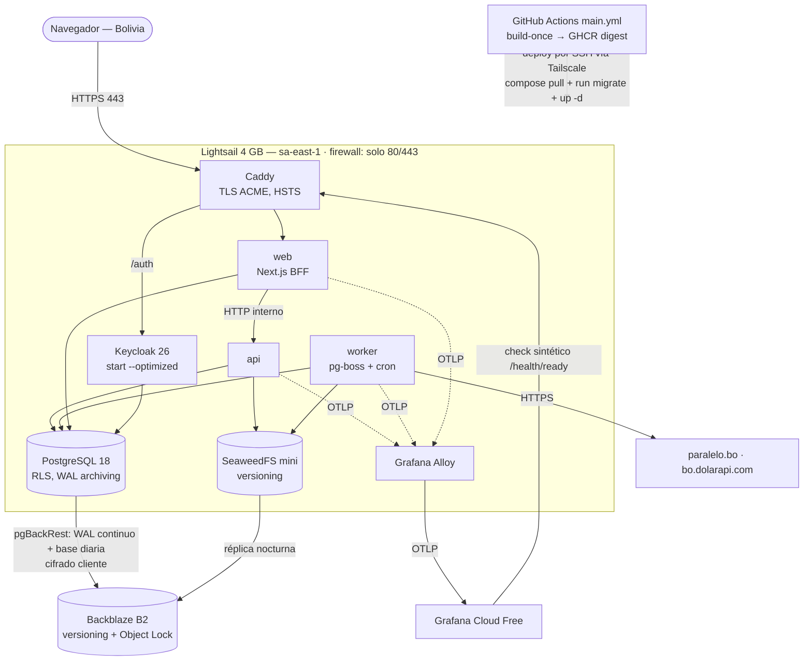

# SPIKE-09 — Opciones de despliegue cloud de bajo costo

> Investigación **documental** con mediciones locales; **sin código productivo** y sin cuenta cloud. Evidencia para [ADR-0013](../../docs/adr/0013-cloud-deployment-strategy.md) y para la propuesta [ADR-0027](../../docs/adr/0027-destino-de-despliegue-inicial-vps-compose.md). Ejecutado el **2026-10-03** desde la máquina del owner (Windows 11, zona horaria `SA Western Standard Time` = Bolivia, UTC−4). Precios consultados el **2026-10-03** en las fuentes de §15; todo lo marcado **(est.)** es una estimación propia.

## 1. Pregunta

¿Cuál es el destino de despliegue de menor costo que cumpla los requisitos no negociables de PFOS (PostgreSQL 18 con RLS y **PITR**, OIDC, API S3, jobs programados, observabilidad, IaC, seguridad por diseño) para **1 a pocos usuarios** en Bolivia, y cómo se escala sin rehacer la aplicación? La pregunta original de ARCHITECTURE §15 ("ECS/Fargate vs Cloud Run para staging+prod") se amplía porque las estimaciones de [docs/21](../../docs/21-cloud-deployment-options.md) (USD 60–195/mes) son altas para un proyecto personal y no contemplaban un VPS único ni las ofertas gestionadas baratas de 2026.

## 2. Método y límites

| Qué | Cómo | Evidencia |
|---|---|---|
| Precios y capacidades | Páginas oficiales de precios/documentación (preferidas) y, si no exponen la cifra, fuentes secundarias fechadas; ver §15 | §15 |
| Latencia desde Bolivia | Handshake TCP (`time_connect − time_namelookup`, IPv4, 7 intentos) a endpoints públicos de cada región | [scripts/latency.sh](scripts/latency.sh), [results/latency-2026-10-03.txt](results/latency-2026-10-03.txt) |
| Footprint de memoria | Mediciones de SPIKE-06/07/10 + `docker stats` de solo lectura del stack `deps` local en ejecución | [results/docker-stats-deps-2026-10-03.txt](results/docker-stats-deps-2026-10-03.txt) |
| Costo real facturado | **No medido**: requiere cuenta cloud del owner (PoC de 48 h, §13) | — |

Límites: los precios cambian (Hetzner subió dos veces en 2026); las cifras sin impuestos (Bolivia aplica IVA/IT a servicios digitales del exterior, no incluido); tipo de cambio supuesto **1 EUR ≈ 1.17 USD** (est.).

## 3. Qué hay que desplegar (perfil de carga)

| Componente | Proceso / imagen | Memoria observada | Fuente |
|---|---|---|---|
| `finance-api` (NestJS) | `api` | 160 MiB idle, 290–342 MiB tras carga (con OTel) | SPIKE-10 |
| `finance-api` | `worker` (pg-boss, cron `LEDGER_INTEGRITY_CRON`, polling FX a paralelo.bo / bo.dolarapi.com) | ≈ igual que `api` (est.) | — |
| `finance-api` | `migrate` (one-shot, dbmate) | efímero | — |
| `finance-web` (Next.js BFF) | `web` | 150–300 MiB (est.) | — |
| PostgreSQL 18 | `postgres:18.6` | 75 MiB en dev; 300–600 MiB con `shared_buffers=256MB` (est.) | stats 2026-10-03 |
| Keycloak 26.8 | modo `start --optimized` | **545 MiB** idle (15 h); 554–581 MiB con límite 1 GiB; 908 MiB tras E2E sin límite; funciona con 512 MiB pero el primer login tarda 27 s | stats 2026-10-03, SPIKE-06 |
| SeaweedFS 4.48 `mini` | object storage | 63 MiB idle; 112 MiB tras carga con `GOMEMLIMIT=200MiB` | stats, SPIKE-07 |
| Valkey | **opcional** (Q5: pg-boss + sesiones en PG) | 5 MiB | SPIKE-06 |
| Reverse proxy TLS (Caddy) + agente OTel (Grafana Alloy) | nuevos en prod | 30–50 MiB + 80–150 MiB (est.) | — |
| `otel-lgtm` | **solo local** | 408 MiB → 1.1 GiB | SPIKE-10 |

**Presupuesto de RAM en producción (sin `otel-lgtm`, sin Valkey): ≈ 1.8–2.8 GiB** → un host de **4 GB** alcanza con ~1 GiB de margen + 2 GiB de swap; 8 GB es holgado. CPU: carga personal (≪ 1 req/s); lo único sensible es el arranque en frío de Keycloak (30–80 s según CPU).

Hallazgo transversal: el **worker de pg-boss hace polling continuo** (`JOB_QUEUE_POLLING_INTERVAL_SECONDS`), así que ninguna base "serverless" llega a escalar a cero, y cualquier plataforma con worker requiere un proceso **siempre encendido**. Esto anula el ahorro de los free tiers "scale-to-zero" (Neon Free, Cloud Run sin instancias mínimas).

## 4. Latencia medida desde Bolivia (2026-10-03, RTT de handshake TCP, ms)

| Región | Endpoint | min | mediana |
|---|---|---|---|
| OCI Santiago (`sa-santiago-1`) | objectstorage | **63** | 67 |
| Vultr São Paulo | sao-br-ping | 79 | 83 |
| Vultr Santiago | scl-cl-ping | 85 | 93 |
| OCI São Paulo (`sa-saopaulo-1`) | objectstorage | 105 | 108 |
| **AWS São Paulo (`sa-east-1`)** | ec2 | **112** | 114 |
| Hetzner Ashburn | ash-speed | 131 | 140 |
| OCI Ashburn | objectstorage | 136 | 140 |
| AWS N. Virginia (`us-east-1`) | ec2 | 138 | 143 |
| Vultr New Jersey | nj-us-ping | 143 | 145 |
| Hetzner Falkenstein (DE) | fsn1-speed | 235 | 247 |
| Hetzner Helsinki (FI) | hel1-speed | 258 | 263 |

ICMP de control: Vultr São Paulo 55–64 ms, Vultr Santiago 90 ms, Hetzner Ashburn 158–164 ms, Hetzner Falkenstein 214–225 ms. Los endpoints `*.googleapis.com` (54 ms) terminan en el edge de Google y **no** representan la región, por eso no se listan. Una sola conexión (ISP del owner) y un solo momento: tomar como orden de magnitud.

Lectura: Sudamérica ahorra **~30 ms** frente a US East en AWS (la ruta a São Paulo desde este ISP no es directa) y **~120–150 ms** frente a Europa. Para un BFF con cookies (1–2 RTT por navegación + TLS) Europa se nota (~0.5–1 s extra en la primera carga), US East es aceptable y Sudamérica es lo mejor.

## 5. Opciones evaluadas

Costos en USD/mes para **producción** (staging se resuelve aparte, §9). "Ops" = esfuerzo operativo para 1 persona.

### 5.1 (a) VPS único con Docker Compose

Se reutilizan las mismas imágenes de GHCR por digest y el mismo contrato de configuración ([config-reference](../../docs/config-reference.md)); la plataforma solo cambia el override de Compose y el proxy TLS.

| Proveedor / plan | Specs | Precio | Región / RTT | Notas |
|---|---|---|---|---|
| **Hetzner CX33** | 4 vCPU (Intel compartida), 8 GB, 80 GB | **€8.49** + backups 20 % (€1.70) + IPv4 ≈ €0.50 (est.) ≈ **USD 12.5** | Solo DE/FI para CX/CAX; 235–263 ms | Subió el 2026-04-01 y el 2026-06-15 (CX +38 %, CPX ×2.4–3.1). En EE. UU. solo hay CPX y quedó caro (CPX41 €120.49) |
| Hetzner CX23 | 2 vCPU, 4 GB | €5.49 (≈ USD 8 con backups/IPv4) | DE/FI | 4 GB justo con Keycloak |
| **AWS Lightsail 4 GB** (São Paulo desde 2026-06-12) | 2 vCPU (burst), 4 GB, 80 GB SSD, IPv4 incluida | **USD 24** (+ snapshots USD 0.05/GB-mes) | `sa-east-1`; 112 ms | Mismo precio en todas las regiones (SP con la mitad de transferencia incluida: 2 TB). Cuenta AWS → Budgets, CloudTrail, S3 para state de IaC, ruta natural a ECS/RDS |
| Lightsail 8 GB | 2 vCPU, 8 GB, 160 GB | USD 44 | idem | Si se quiere `otel-lgtm` o margen |
| Vultr Regular 4 GB (São Paulo) | 2 vCPU, 4 GB | ≈ USD 30 (est. por fuente secundaria; USD 20 en EE. UU.) | 79–83 ms | Mejor RTT de los pagos; provider Terraform oficial; menos servicios alrededor |
| DigitalOcean Basic 4 GB | 2 vCPU, 4 GB, 80 GB | USD 24 | Sin región en Sudamérica (NYC/TOR/SFO…) | Managed PG 18 barato (§5.6) |
| **Oracle Cloud Always Free (A1)** | **2 OCPU, 12 GB** ARM (recortado desde 4/24 a mediados de 2026; la doc oficial ya dice 2/12), 200 GB block | **USD 0** | Santiago 63 ms / São Paulo 105 ms (solo en la *home region*) | Capacidad A1 escasa; reclamo de instancias "ociosas" (< 20 % CPU/red/RAM p95 en 7 días — PFOS lo cumpliría) salvo en cuenta Pay-As-You-Go; **ARM** → requiere imágenes multi-arch (hoy CI publica solo `linux/amd64`) |

- **Ops:** media — parches del SO (unattended-upgrades), Docker, firewall, backups/PITR de PostgreSQL **propios** (§10), restore drill mensual ([docs/30](../../docs/30-backup-and-disaster-recovery.md)). Sin HA: RTO = recrear VM con IaC + restaurar (≈ 1 h, est.).
- **Seguridad:** buena si se cumple §11 (solo 80/443 públicos, SSH cerrado, contenedores non-root ya exigidos por ADR-0011, puertos internos en `127.0.0.1` como ya hace Compose). Un solo host = un solo blast radius; datos de staging nunca en el host de prod.
- **IaC:** OpenTofu/Terraform con providers oficiales `aws` (recursos `aws_lightsail_*`), `hcloud`, `vultr`, `oci`, `digitalocean`; cloud-init para el host; Compose como "runtime spec".
- **Lock-in:** mínimo (VM + Compose + Postgres estándar).
- **Encaje container-first + contrato único:** **máximo** — es el modo B de [docs/19](../../docs/19-local-development.md) con otro override; `verify-by-digest` de `main.yml` ya prueba exactamente ese stack.

### 5.2 (b) PaaS: Fly.io, Railway, Render

| PaaS | Estimación PFOS (web, api, worker 512 MB + Keycloak 1 GB + PG) | Región cercana | PITR / PG 18 | Comentario |
|---|---|---|---|---|
| **Fly.io** | Máquinas ≈ USD 22 en `iad` × **1.615** en `gru` ≈ 35 + **Managed Postgres Basic USD 38** (+ USD 0.28/GB) ≈ **USD 75–80**; con PG propio en máquina + volumen ≈ USD 45 (est.) | `gru` São Paulo | MPG: HA y backups automáticos; PITR/versión no documentados en la página de precios | IPv4 dedicada USD 2; snapshots de volumen USD 0.08/GB (10 GB gratis). Provider Terraform no oficial/limitado |
| **Railway** | Uso medido: ~2–2.5 GB RAM × USD 10 + CPU ~0.1–0.2 vCPU × USD 20 + volúmenes USD 0.15/GB ≈ **USD 25–35** (est.) | Sin región SA documentada | PG como plantilla en contenedor; sin PITR gestionado | Cuota de plan (Hobby USD 5 / Pro USD 20) es crédito de uso. Logs 7–30 días. Menor control de red |
| **Render** | 3 × USD 7 (512 MB) + Keycloak USD 25 (2 GB) + PG ≥ USD 6 (256 MB; ~1 GB ≈ USD 20 est.) ≈ **USD 52–66** | Oregon/Ohio/Virginia/Frankfurt/Singapur (sin SA) | PITR **3 días** en Hobby, 7 en Pro (USD 25/mes de workspace); PG 18 no verificado | Bandwidth incluida baja (5 GB Hobby, overage USD 0.15/GB). Blueprints YAML como IaC |

Ops muy baja, pero: Keycloak (JVM ≥ 1 GiB) encarece cada PaaS; ninguno da PITR ≥ 7 días + PG 18 + región SA a la vez por < USD 50; IaC menos madura; los servicios privados/secretos son específicos de cada plataforma (lock-in medio).

### 5.3 (c) Cloud Run + base gestionada

- Cloud Run: instance-based USD 0.000018/vCPU-s y 0.000002/GiB-s (Tier 1) con free tier mensual; `southamerica-east1` es Tier 2 (más caro). El **worker** y **Keycloak** necesitan instancias siempre encendidas (o *worker pools*, ya GA) → ≈ USD 20–45 cada uno (est.); `web`/`api` pueden escalar a cero.
- Cloud SQL `db-f1-micro` en `southamerica-east1`: **USD 12/mes** + almacenamiento + logs de PITR; PG 18 es la versión por defecto.
- Alternativas de BD: Neon/Supabase (§5.6).
- **Total producción ≈ USD 60–110** (coherente con docs/21). Ops baja, buen PITR, IaC madura (provider `google`), pero el ahorro scale-to-zero no aplica a PFOS (worker + JVM).

### 5.4 (d) AWS ECS Fargate + RDS (candidata anterior, ADR-0013)

- Fargate ARM `us-east-1` re-verificado: **USD 0.0323838/vCPU-h y 0.003560/GB-h** (coincide con docs/21). RDS PostgreSQL 18 disponible desde 2025-11.
- Las estimaciones de docs/21 siguen vigentes: **producción ≈ USD 110–130/mes** (`us-east-1`, perfil mínimo sin NAT), staging+prod 165–195; en `sa-east-1` +30–50 % (est.). Keycloak en Fargate (0.5 vCPU/1 GB + IPv4) ≈ **+USD 18/mes/entorno** (est.).
- Ops media (VPC, IAM, ALB), seguridad y PITR excelentes (RDS hasta 35 días, AWS Backup cross-account), IaC muy madura, alto *learning value*. Es la meta de largo plazo, no el punto de partida para 1 usuario.

### 5.5 (e) Identidad: Keycloak propio vs IdP gestionado

| Opción | Costo a esta escala | Memoria / ops | Encaje |
|---|---|---|---|
| **Keycloak 26 propio** (actual, ADR-0010) | USD 0 marginal en un VPS de 4 GB; ≈ +18/mes en Fargate; ≈ +20–45 en Cloud Run | 545–581 MiB medidos; arranque 30–80 s; actualizar imagen y realm | Paridad total con local (SPIKE-06), datos de usuarios bajo control propio |
| Amazon Cognito (Lite/Essentials) | 10 000 MAU gratis | Cero ops | Natural en nivel 4 (AWS); OIDC estándar pero claims/refresh distintos → revalidar el lock de refresh del BFF |
| Auth0 Free | 25 000 MAU gratis | Cero ops | Funciones avanzadas (dominio propio, ciertos MFA) en planes pagos — verificar antes de elegir |
| Zitadel Cloud Free | hasta 100 DAU | Cero ops; self-host ~0.5 GB de piso | OIDC sólido; free tier pequeño pero suficiente para un hogar |

Como el BFF usa `openid-client` con discovery (`OIDC_ISSUER_URL`) y la autorización vive en PFOS (roles por workspace + RLS), el IdP es **intercambiable por configuración** salvo revalidar refresh-rotation y claims. **Recomendación:** mantener Keycloak en los niveles 1–3 (cabe en RAM, cero terceros con PII); evaluar Cognito solo al pasar al nivel 4.

### 5.6 (f) PostgreSQL gestionado barato

| Servicio | Precio de entrada | PG 18 | PITR | RLS / roles | Región SA | Veredicto |
|---|---|---|---|---|---|---|
| **Neon** Launch | USD 0.106/CU-h, USD 0.35/GB-mes, historia USD 0.20/GB-mes. Con polling de pg-boss la compute no duerme: 0.25 CU × 730 h ≈ **USD 19.4** + storage ≈ **USD 21–25** | **Sí** (GA 2026-05-01; default desde 2026-06-05) | Restore window hasta **7 días** (Launch), 30 (Scale) | RLS estándar, **pero** los roles creados por consola/API heredan `neon_superuser` con **BYPASSRLS** → los roles de app (`DATABASE_URL`, `WORKER_DATABASE_URL`, `BFF_DATABASE_URL`) DEBEN crearse por SQL desde `migrate` y verificarse con el test de cobertura RLS (ADR-0023) | `aws-sa-east-1` (GA 2025-02) | **Mejor opción gestionada barata.** Sin IP allowlist ni private networking en Launch (TLS + credenciales) |
| Neon Free | 100 CU-h/proyecto, 0.5 GB… | Sí | Historia 6 h, sin instant restore | idem | Sí | **No apto**: el worker consume ~182 CU-h/mes a 0.25 CU |
| Supabase Pro | USD 25 (+ PITR **USD 100/mes** por 7 días) | **No** (default PG 17) | Solo con add-on | RLS nativo | `sa-east-1` | **Descartado**: PG 17 (ADR-0005 exige 18) y PITR caro |
| Aiven | Free (1 GB) / Developer desde USD 5 | No verificado | PITR desde plan Startup (USD 75, 2 días) | Estándar | Elegible por cloud | **Descartado** para prod (sin PITR barato) |
| DigitalOcean Managed PG | **USD 15.15** (1 GiB) | **Sí** | Backups diarios + restauración a punto en el tiempo (7 días, según docs DO; verificar) | Estándar | No (NYC/TOR) | Buena alternativa en nivel 3 si se acepta latencia US |
| Lightsail Managed DB | USD 15 (1 GB) | **No** (12–16) | 7 días | — | SP | **Descartado** (sin PG 18) |
| Cloud SQL | USD 12 (`db-f1-micro`, SP) | Sí (default) | Sí | Estándar | `southamerica-east1` | Solo si se elige Cloud Run |
| RDS | ≈ USD 14+ (`db.t4g.micro`, `us-east-1`, docs/21) | Sí (desde 2025-11) | Hasta 35 días | Estándar | `sa-east-1` | Nivel 4 |

### 5.7 (g) Object storage

| Servicio | Precio | Versioning | Object Lock | Presigned PUT | Presigned **POST** | Uso propuesto |
|---|---|---|---|---|---|---|
| **SeaweedFS en el host** | USD 0 (disco del VPS) | Sí | — | Sí | **Sí** | Documentos de usuario en niveles 1–3 (validado 23/23 en SPIKE-07, incl. presigned POST y versioning) |
| **Backblaze B2** | USD 6.95/TB-mes, 10 GB gratis, egress gratis hasta 3× lo almacenado | **Sí (por defecto)** | **Sí** | Sí | **No** | **Destino de backups** (repo de PITR + réplica de documentos), con clave de aplicación sin `deleteFiles` y Object Lock |
| Cloudflare R2 | USD 0.015/GB-mes, 10 GB + 1 M ops A + 10 M ops B gratis, egress gratis | **No** | **No** | Sí | **No** | Solo assets públicos/CDN; **no** para backups (sin inmutabilidad) ni documentos (sin versioning, rompe ADR-0009) |
| Amazon S3 | ≈ USD 0.023/GB-mes | Sí | Sí | Sí | Sí | Nivel 4 (paridad total) |

Hallazgo: **ni R2 ni B2 implementan presigned POST**; R2 tampoco versioning ni Object Lock. Como el flujo por defecto de PFOS ya es presigned **PUT** con `Content-Length` firmado (SPIKE-07 §4.4), mover documentos a B2 sería posible perdiendo solo el rango de tamaño; a R2 no, por versioning.

### 5.8 (h) Observabilidad

- **Grafana Cloud Free** (verificado 2026-10-03): 10 000 series activas, **50 GB/mes** de logs, 50 GB de trazas, 50 GB de profiles, **14 días** de retención, 3 usuarios, 100 000 ejecuciones de checks sintéticos API/mes. Ingesta OTLP. Pro: USD 19/mes + uso.
- Con sampling de trazas al 10 % y logs `info`, PFOS queda órdenes de magnitud por debajo del límite. Los datos salen a un tercero: la redacción de pino y `OTEL_NODE_RESOURCE_DETECTORS=env,os,serviceinstance` (SPIKE-10) ya evitan PII y datos del host.
- Uptime/alertas: un check sintético de Grafana contra `/health/ready` + alerta por email.
- `otel-lgtm` propio en prod solo con 8 GB (1.1 GiB medidos).

## 6. Comparación consolidada (producción, 1–pocos usuarios)

| Opción | USD/mes (prod) | Ops | Backups / PITR | Seguridad | IaC | RTT desde Bolivia | Lock-in | Encaje container-first + contrato único |
|---|---|---|---|---|---|---|---|---|
| Oracle Free A1 + Compose | **0–2** | Media (+ riesgo de reclamo/capacidad) | Propio (pgBackRest → B2) | Media-buena (OCI IAM; ARM) | `oci` ✓ | 63 (Santiago) | Bajo | Alto (requiere multi-arch) |
| Hetzner CX33 + Compose | **≈ 13–15** | Media | Propio + backups de VM 20 % | Buena | `hcloud` ✓ | 235–263 | Bajo | **Máximo** |
| **Lightsail SP 4 GB + Compose** | **≈ 27–30** | Media | Propio + snapshots automáticos | Buena (cuenta AWS, CloudTrail, Budgets) | `aws` ✓ | **112** | Bajo | **Máximo** |
| Lightsail SP + Neon (PG gestionado) | **≈ 47–55** | Baja-media | **Gestionado** (7 días) + `pg_dump` a B2 | Buena (sin allowlist en Launch) | `aws` + `neon` (provider comunitario) | 112 (+1–2 ms app↔BD, misma región) | Bajo-medio | Alto (solo cambia `DATABASE_URL`) |
| DO Droplet + DO Managed PG | ≈ 39–42 | Baja-media | Gestionado | Buena | `digitalocean` ✓ | ≈ 140 (est., sin medir) | Bajo-medio | Alto |
| Railway | ≈ 25–35 (est.) | Muy baja | Sin PITR gestionado | Media | Limitada | Sin región SA | Medio | Medio |
| Render | ≈ 52–66 | Muy baja | PITR 3 días (Hobby) | Media | Blueprints | Sin región SA | Medio | Medio |
| Fly.io (`gru`) | ≈ 45–80 | Baja-media | MPG con backups | Media | Limitada | SP (no medido) | Medio | Alto |
| Cloud Run + Cloud SQL | ≈ 60–110 | Baja | Excelente | Muy buena | `google` ✓ | SP (edge 54) | Medio | Alto |
| ECS Fargate + RDS (`us-east-1`) | ≈ 110–130 (staging+prod 165–195) | Media | Excelente | Muy buena | `aws` ✓ | 138–143 | Medio | Alto |

## 7. Niveles recomendados

| Nivel | Costo | Composición | Para quién / cuándo |
|---|---|---|---|
| **N1 — Mínimo** | **≈ USD 10–15/mes** | Hetzner **CX33** (DE/FI) con Compose: Caddy, web, api, worker, PG 18, Keycloak, SeaweedFS, Alloy. Backups de VM Hetzner (20 %) + **pgBackRest → B2** (PITR) + réplica de documentos a B2. Grafana Cloud Free. DNS en Cloudflare (gratis). | Presupuesto < USD 20. Se acepta ~250 ms de RTT. *Variante USD 0:* Oracle Free A1 en Santiago (63 ms) **solo** con cuenta PAYG, imágenes multi-arch y plan B listo por reclamo/capacidad |
| **N2 — Recomendado** | **≈ USD 27–30/mes** | Igual que N1 pero en **AWS Lightsail 4 GB São Paulo** (USD 24) + snapshots automáticos diarios (≈ USD 2–4) + B2 (≈ 0) + dominio (≈ 1). State de OpenTofu en S3 (céntimos). AWS Budgets con alerta a USD 35 | Default. Mejor RTT razonable, cuenta AWS lista para crecer, mismo stack que local |
| **N3 — BD gestionada** | **≈ USD 50–60/mes** | N2 con PostgreSQL movido a **Neon Launch `aws-sa-east-1`** (PG 18, PITR 7 días; ~USD 21–25), Keycloak y su BD también en Neon; se mantiene pgBackRest/`pg_dump` diario a B2 como copia fuera del proveedor. Alternativa: Lightsail 8 GB con `otel-lgtm` propio | Cuando el owner no quiera operar backups/PITR propios, o tras un incidente de restore |
| N4 — Plataforma | ≥ USD 110/mes | ADR-0013 original: ECS Fargate + RDS (+ Cognito o Keycloak en Fargate), multi-cuenta | Varios usuarios reales, requisito de HA/RTO < 1 h, o *learning value* AWS como objetivo explícito |

Staging en todos los niveles: **efímero** (§9), no un segundo entorno permanente.

## 8. Recomendación por defecto: **N2 — VPS único en AWS Lightsail São Paulo con Docker Compose**

Razonamiento:

1. **Costo:** ≈ USD 27–30/mes frente a USD 110–195 de ECS/Fargate — ~4–6× menos, con los mismos requisitos funcionales (PG 18 + RLS + PITR propio, OIDC, S3 API, jobs, observabilidad).
2. **Paridad:** es el **modo B** de docs/19 en otra máquina: mismas imágenes por digest (`main.yml` ya hace `verify-by-digest` del stack `core`), mismo contrato de configuración, misma SeaweedFS validada (incluido presigned POST y versioning), mismo Keycloak validado en SPIKE-06. Cero adapters nuevos.
3. **Latencia:** 112 ms (≈ 30 ms mejor que US East y ≈ 130 ms mejor que Hetzner EU) sin el riesgo operativo de Oracle Free.
4. **Ruta de crecimiento:** misma cuenta y región AWS que el N4 (`sa-east-1`): S3 para state ya existe, CloudTrail/Budgets desde el día 1, y el salto a RDS/ECS no cambia de proveedor ni de IaC (provider `aws`, ADR-0014).
5. **x86:** Lightsail es amd64 → no hay que cambiar el build de CI (a diferencia de Oracle A1 o Hetzner CAX).

Lo que se sacrifica conscientemente: HA (un solo host; RTO ≈ 1 h restaurando en una VM nueva), PITR gestionado (se opera pgBackRest, con restore drill mensual), y parte del *learning value* de ECS (aplazado al N4).

Si el owner fija un presupuesto **< USD 20**, el default pasa a **N1 (Hetzner CX33)** sin cambiar nada más que el módulo de IaC del host.

## 9. Topología del default (N2)

Notas:

- **Compose de producción:** override `deploy/compose/compose.prod.yaml` (a crear en el change de despliegue): sin perfiles `deps`/`seed`/`observability`, solo Caddy publica puertos, Keycloak con build optimizado y sin `start-dev`, `PFOS_ENV=production` (rechaza seeds y buckets automáticos), límites de memoria del §3.
- **Secretos:** generados una vez en el host (`/etc/pfos/*.env`, 0600, root), copia cifrada (age) en el gestor del owner; CI solo transmite digests. Nada de secretos en el repo ni en el state.
- **Staging efímero:** `tofu apply -var env=staging` crea una VM idéntica (Lightsail 4 GB ≈ USD 0.033/h, est.) para validar un release o un restore drill y se destruye; el gate diario sigue siendo `verify-by-digest` en CI.

## 10. Backups y PITR en N1/N2 (sin servicio gestionado)

| Elemento | Propuesta | Cumple docs/30 |
|---|---|---|
| WAL | `archive_mode=on`, pgBackRest `archive-push` a B2 (repo S3-compatible, `repo1-cipher-type=aes-256-cbc`), `archive_timeout=60s` | RPO ≤ 1–5 min (objetivo ≤ 15 min) |
| Base | Full semanal + diferencial diario; retención 14 días | PITR 14 días (como RDS en docs/30) |
| Inmutabilidad | Bucket B2 con Object Lock (≤ retención) y clave de aplicación del host **sin** `deleteFiles`; expiración por lifecycle de B2 | Protege ante compromiso del host |
| Snapshots de VM | Automáticos diarios (Lightsail) / backups Hetzner | Restauración rápida de todo el host |
| Documentos | SeaweedFS versioning + réplica nocturna a B2 | RPO ≤ 24 h para archivos |
| Drill | Mensual en VM efímera: restore PITR → `verify-integrity` → medir RTO → destruir | RTO observado < 1 h |

pgBackRest soporta PG 18 desde 2.55 (2025-04) y sigue con releases (2.58 en 2026-01, 2.59 en 2026-07); WAL-G 3.0.8 (2026-01) es la alternativa.

## 11. Seguridad por diseño (checklist del host)

- Firewall del proveedor: entrada solo 80/443; **sin SSH público** (Tailscale; consola del proveedor como break-glass). Docker publica en `127.0.0.1` salvo Caddy (los `ports` ya usan `PF_BIND_ADDR`).
- Usuario sin login de root; `unattended-upgrades` + reinicio programado; disco cifrado si el proveedor lo ofrece (verificar en Lightsail).
- Contenedores non-root, imágenes por digest (ADR-0011); Trivy en CI ya existe.
- Roles de PostgreSQL sin `BYPASSRLS`; `DATABASE_MIGRATOR_URL` solo para `migrate` (ADR-0023).
- TLS 1.2+/HSTS en Caddy; cookies `Secure`/`SameSite` del BFF (SPIKE-06).
- Cuenta AWS: root con MFA, IAM Identity Center, CloudTrail, Budgets (docs/22 §12). GHCR: token de solo lectura (`read:packages`) en el host.
- Egress: el worker solo necesita HTTPS a paralelo.bo, bo.dolarapi.com, B2, Grafana Cloud y GHCR.

## 12. Riesgos

| Riesgo | Prob. | Impacto | Mitigación |
|---|---|---|---|
| Fallo/borrado del host único | Media | Alto | IaC + PITR en B2 + snapshots; drill mensual; RTO ≈ 1 h |
| Backups/PITR propios mal configurados | Media | **Muy alto** | Drill automatizado que **falla** si no restaura; alerta de `archive` atrasado; pasar a N3 si el drill falla dos veces |
| 4 GB insuficientes (Keycloak + PG + Node) | Baja-media | Medio | Límites por contenedor, swap 2 GB, métricas de memoria; subir a 8 GB (USD 44) sin rediseño |
| Subidas de precio (Hetzner 2026: +30 % a ×3) | Media | Bajo-medio | Contratos estándar → mover de proveedor en horas; Budgets |
| Oracle Free: reclamo o falta de capacidad | Alta | Alto | Solo como variante, con PAYG y plan B |
| Datos de telemetría en Grafana Cloud | Baja | Medio | Redacción y detectores restringidos (SPIKE-10), sampling |
| Neon (N3) con roles `neon_superuser` (BYPASSRLS) | Media | **Muy alto** | Roles de app por SQL + test de cobertura RLS en el pipeline de despliegue |
| R2 usado por error para backups/documentos | Baja | Alto | ADR-0027 lo prohíbe; usar B2/S3 |
| IVA/IT sobre servicios digitales del exterior | Alta | Bajo | Presupuestar +~15 % (est.) |

## 13. Ruta de migración entre niveles

| De → A | Qué cambia | Esfuerzo (est.) |
|---|---|---|
| N1 ↔ N2 | Módulo de IaC del host (`hcloud` ↔ `aws_lightsail_*`); restore PITR desde B2 en el host nuevo; DNS | ½ día |
| N2 → N3 | `pg_dump`/restore o replicación lógica a Neon; roles de app por SQL; cambiar `DATABASE_URL`/`WORKER_DATABASE_URL`/`BFF_DATABASE_URL`/`DATABASE_MIGRATOR_URL`; quitar PG del Compose | ½–1 día |
| N3 → N4 | Neon → RDS (`sa-east-1`); Compose → task definitions ECS con las mismas variables; SeaweedFS → S3 (sincronizar versiones); Keycloak → Fargate o Cognito (revalidar refresh/claims) | 3–5 días |
| Cualquier → local | `pg_dump` + `rclone sync` del bucket → modo B | horas |

Invariante que habilita todo: **contratos estándar** (Postgres wire, API S3, OIDC, OTLP) + imágenes inmutables + contrato único de configuración. Ningún nivel introduce SDKs de proveedor en la app.

## 14. Pendiente y validación

1. **Owner: confirmar presupuesto mensual (Q3)** → N1, N2 o N3. Sin respuesta, se planifica N2.
2. PoC de 48 h en la cuenta del owner (cuando se abra el change de despliegue): crear N2 con OpenTofu, levantar el stack, medir RAM real con carga E2E, ejecutar un restore PITR completo y registrar el costo facturado en Cost Explorer.
3. Verificar: cifrado en reposo de discos Lightsail; RTT real a Lightsail SP (se midió el endpoint EC2 de la región); comportamiento de pgBackRest con Object Lock de B2.

## 15. Fuentes (consultadas el 2026-10-03)

- Hetzner: [privatedevops — repricing 2026-06-15](https://privatedevops.com/news/hetzner-june-2026-cloud-price-increase-what-to-do), [wz-it — análisis (act. 2026-10-01)](https://wz-it.com/en/blog/hetzner-price-increase-june-2026-cpx-ccx-alternatives/), [heise — precios en EE. UU.](https://heise.de/-11333037), [Cloud Pricing Comparison 2026-08](https://kimmo.suominen.com/stuff/cpc-2026-08.txt)
- AWS: [Lightsail pricing](https://aws.amazon.com/lightsail/pricing/), [Lightsail en São Paulo (2026-06-12)](https://aws.amazon.com/about-aws/whats-new/2026/06/amazon-lightsail-aws-regions/), [Lightsail DB FAQ (versiones PG)](https://docs.aws.amazon.com/lightsail/latest/userguide/amazon-lightsail-faq-databases.html), [Fargate pricing](https://aws.amazon.com/fargate/pricing/), [RDS PostgreSQL 18](https://aws.amazon.com/about-aws/whats-new/2025/11/amazon-rds-postgresql-major-version-18)
- Oracle: [Always Free Resources (doc oficial: 2 OCPU / 12 GB)](https://docs.oracle.com/en-us/iaas/Content/FreeTier/resourceref.htm), [braindetox — recorte 2026](https://braindetox.kr/en/posts/oracle_always_free_tier_reduced_2026.html)
- DigitalOcean / Vultr: [costbench DO](https://costbench.com/software/cloud-infrastructure/digitalocean), [infratally DO Managed PG](https://infratally.com/articles/digitalocean-managed-postgres-deep-dive/), [DO — PG 18](https://docs.digitalocean.com/products/databases/postgresql/details/limits/), [cloud-mercato Vultr SP](https://pcr.cloud-mercato.com/providers/vultr/flavors/vc2-2c-4gb/pricing)
- PaaS: [fly.io/pricing](https://fly.io/pricing.md), [render.com/pricing](https://render.com/pricing.md), [railway.com/pricing](https://railway.com/pricing)
- Google: [Cloud Run pricing](https://cloud.google.com/run/pricing), [Cloud SQL db-f1-micro (bytebase)](https://www.bytebase.com/dbcost/cloudsql/instance/db-f1-micro/), [Cloud SQL versiones](https://docs.cloud.google.com/sql/docs/postgres/db-versions)
- Postgres gestionado: [Neon pricing](https://neon.com/pricing), [Neon PG 18 GA](https://neon.com/docs/changelog/2026-05-01), [Neon roles (`neon_superuser`)](https://neon.com/docs/manage/roles/), [Neon restore window](https://neon.com/docs/introduction/restore-window), [Supabase pricing](https://supabase.com/pricing.md), [Supabase PITR](https://supabase.com/docs/guides/platform/manage-your-usage/point-in-time-recovery), [Aiven pricing](https://aiven.io/pricing?product=pg)
- Object storage: [R2 pricing](https://developers.cloudflare.com/r2/pricing/), [R2 S3 API](https://developers.cloudflare.com/r2/api/s3/api/), [B2 S3-compatible API](https://www.backblaze.com/docs/cloud-storage-s3-compatible-api), [B2 precios (dev.to)](https://dev.to/ethan-carter/backblaze-b2-vs-self-hosted-s3-which-saves-more-money-4gp8)
- Observabilidad: [Grafana Cloud pricing](https://grafana.com/pricing/)
- Identidad: [Keycloak sizing (benchmark 26.4)](https://www.keycloak.org/2025/10/keycloak-benchmark), [Cognito pricing](https://aws.amazon.com/cognito/pricing/), [Auth0 free plan (costbench)](https://www.costbench.com/software/identity-access-management/auth0/free-plan/), [Zitadel Cloud free tier](https://agentdeals.dev/vendor/zitadel)
- Backups: [pgBackRest 2.59.0](https://postgresql.org/about/news/pgbackrest-2590-released-3355), [WAL-G 3.0.8](https://www.postgresql.org/about/news/wal-g-308-released-3219)

## 16. Impacto en ADRs / docs

- **ADR-0027 (nuevo, Propuesto):** destino de despliegue inicial por niveles, default N2. Si se acepta, **reemplaza a ADR-0013** (que queda como referencia del N4).
- **ADR-0013:** Nota fechada apuntando a este spike y a ADR-0027 (estado sin cambios hasta la decisión del owner).
- **ADR-0009:** sin cambio de decisión; nota para el futuro: R2 no sirve como backend de documentos (sin versioning) y B2 no soporta presigned POST.
- **ADR-0010:** el IdP cloud queda en Keycloak propio para N1–N3.
- **ADR-0014:** sin cambio; se suman providers `aws` (Lightsail), `hcloud`, `b2`, `cloudflare`, `grafana`.
- **ARCHITECTURE §15**, **DESIGN-GATE Q3** y área 14, **docs/21** (nota de vigencia), `spikes/README.md`: actualizados en este cambio.
- Futuro change OpenSpec (`platform/delivery-pipeline`): `compose.prod.yaml`, módulo OpenTofu del host, job de deploy, pgBackRest y drill.
